Некоторые уязвимости WebSockets могут быть обнаружены и использованы только путем манимуляции рукопожатия WebSocket 
Эти уязвимости, как правило, связаны с недостатками конструкции, такими как:

-- Неправильное доверие к HTTP-заголовкам для выполнения решений по безопасности, таких как заголовок`X-Forwarded-For`
`X-Forwarded-For` - это сигнал серверу о том, что этому отправителю можно доверять

>	в контексте WebSocket рукопожатия (handshake) сервер может полагаться на X-Forwarded-For для определения домена, с которого пришел запрос. если заголовок не проверяется должным образом, можно обойти проверки Origin и CSRF-защиту.--
		например, сервер ожидает что Origin будет доверенным, но если он берет значение из X-Forwarded-For, то подставив нужный заголовок можно заставить сервер думать что запрос пришел с белого IP

-= Недостатки в механизмах обработки сеансов, поскольку контекст сеанса, в котором обрабатываются сообщения WebSocket, обычно определяется контекстом сеанса сообщения рукопожатия

-- Поверхность атаки, представленная пользовательскими HTTP-заголовками, используемыми приложением

-------

лаба https://portswigger.net/web-security/websockets/lab-manipulating-handshake-to-exploit-vulnerabilities

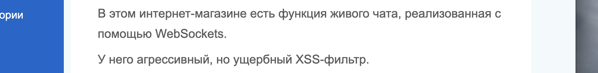


(ущербный фильтр*)

задание: вызвать через WS alert()

----------


на сайте лабы есть живой чат

++ есть функция по адресу `GET /resources/js/chat.js HTTP/2`
вот такая 
```js
HTTP/2 200 OK
Content-Type: application/javascript; charset=utf-8
Cache-Control: public, max-age=3600
X-Frame-Options: SAMEORIGIN
Content-Length: 3561

(function () {
    var chatForm = document.getElementById("chatForm");
    var messageBox = document.getElementById("message-box");
    var webSocket = openWebSocket();

    messageBox.addEventListener("keydown", function (e) {
        if (e.key === "Enter" && !e.shiftKey) {
            e.preventDefault();
            sendMessage(new FormData(chatForm));
            chatForm.reset();
        }
    });

    chatForm.addEventListener("submit", function (e) {
        e.preventDefault();
        sendMessage(new FormData(this));
        this.reset();
    });

    function writeMessage(className, user, content) {
        var row = document.createElement("tr");
        row.className = className

        var userCell = document.createElement("th");
        var contentCell = document.createElement("td");
        userCell.innerHTML = user;
        contentCell.innerHTML = (typeof window.renderChatMessage === "function") ? window.renderChatMessage(content) : content;

        row.appendChild(userCell);
        row.appendChild(contentCell);
        document.getElementById("chat-area").appendChild(row);
    }

    function sendMessage(data) {
        var object = {};
        data.forEach(function (value, key) {
            object[key] = htmlEncode(value);
        });

        openWebSocket().then(ws => ws.send(JSON.stringify(object)));
    }

    function htmlEncode(str) {
        if (chatForm.getAttribute("encode")) {
            return String(str).replace(/['"<>&\r\n\\]/gi, function (c) {
                var lookup = {'\\': '&#x5c;', '\r': '&#x0d;', '\n': '&#x0a;', '"': '&quot;', '<': '&lt;', '>': '&gt;', "'": '&#39;', '&': '&amp;'};
                return lookup[c];
            });
        }
        return str;
    }

    function openWebSocket() {
       return new Promise(res => {
            if (webSocket) {
                res(webSocket);
                return;
            }

            let newWebSocket = new WebSocket(chatForm.getAttribute("action"));

            newWebSocket.onopen = function (evt) {
                writeMessage("system", "System:", "No chat history on record");
                newWebSocket.send("READY");
                res(newWebSocket);
            }

            newWebSocket.onmessage = function (evt) {
                var message = evt.data;

                if (message === "TYPING") {
                    writeMessage("typing", "", "[typing...]")
                } else {
                    var messageJson = JSON.parse(message);
                    if (messageJson && messageJson['user'] !== "CONNECTED") {
                        Array.from(document.getElementsByClassName("system")).forEach(function (element) {
                            element.parentNode.removeChild(element);
                        });
                    }
                    Array.from(document.getElementsByClassName("typing")).forEach(function (element) {
                        element.parentNode.removeChild(element);
                    });

                    if (messageJson['user'] && messageJson['content']) {
                        writeMessage("message", messageJson['user'] + ":", messageJson['content'])
                    } else if (messageJson['error']) {
                        writeMessage('message', "Error:", messageJson['error']);
                    }
                }
            };

            newWebSocket.onclose = function (evt) {
                webSocket = undefined;
                writeMessage("message", "System:", "--- Disconnected ---");
            };
        });
    }
})();


```

с вот такой очисткой пользовательского ввода
```js
 function htmlEncode(str) {
        if (chatForm.getAttribute("encode")) {
            return String(str).replace(/['"<>&\r\n\\]/gi, function (c) {
                var lookup = {'\\': '&#x5c;', '\r': '&#x0d;', '\n': '&#x0a;', '"': '&quot;', '<': '&lt;', '>': '&gt;', "'": '&#39;', '&': '&amp;'};
                return lookup[c];
            });
        }
        return str;
    }
```

-------------

вот запрос `READY`  для запуска соединения!
но активируется все через `GET /chat HTTP/2`

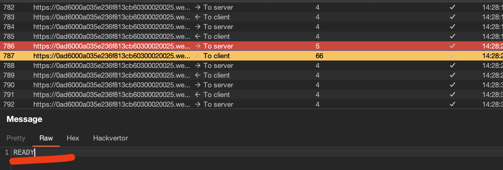


и пошло соединение!
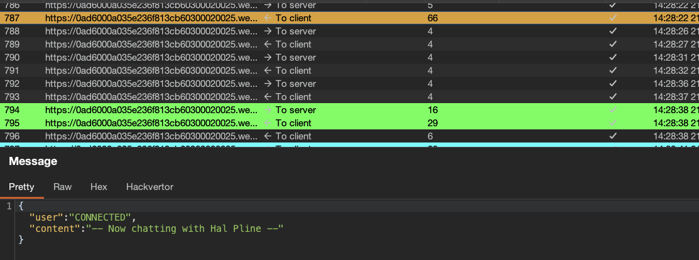


```json
{"user":"CONNECTED","content":"-- Now chatting with Hal Pline --"}
```

-----------

пробую через перехватить и подменить трафик
сообщения на `     `

я отправил это дело, и попал сразу в черный список
то есть - заблочили

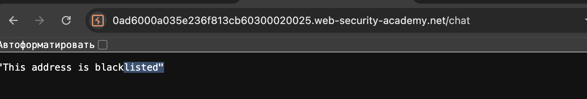


то есть страница с чатом вообще не открывается теперь
`https://0ad6000a035e236f813cb60300020025.web-security-academy.net/chat`
ну это уже похоже на реальную жизнь 

------


вот мой запрос к чату , 
```http
GET /chat HTTP/2
Host: 0ad6000a035e236f813cb60300020025.web-security-academy.net
Cookie: session=eTDAiE8JRMgs4u4DU5s9RfbswM0V0rBi
Cache-Control: max-age=0
Sec-Ch-Ua: "Chromium";v="145", "Not:A-Brand";v="99"
Sec-Ch-Ua-Mobile: ?0
Sec-Ch-Ua-Platform: "macOS"
Accept-Language: ru-RU,ru;q=0.9
Upgrade-Insecure-Requests: 1
User-Agent: Mozilla/5.0 (Macintosh; Intel Mac OS X 10_15_7) AppleWebKit/537.36 (KHTML, like Gecko) Chrome/145.0.0.0 Safari/537.36
Accept: text/html,application/xhtml+xml,application/xml;q=0.9,image/avif,image/webp,image/apng,*/*;q=0.8,application/signed-exchange;v=b3;q=0.7
Sec-Fetch-Site: same-origin
Sec-Fetch-Mode: navigate
Sec-Fetch-User: ?1
Sec-Fetch-Dest: document
Referer: https://0ad6000a035e236f813cb60300020025.web-security-academy.net/
Accept-Encoding: gzip, deflate, br
Priority: u=0, i


```

и вот ответ
```http
HTTP/2 401 Unauthorized
Content-Type: application/json; charset=utf-8
X-Frame-Options: SAMEORIGIN
Content-Length: 29

"This address is blacklisted"
```

--------

попробую подменить 
X-Forwarded-For
или
Referer

---------

добавлю `X-Forwarded-For: 127.0.0.1`
и сработало! страница открылась!

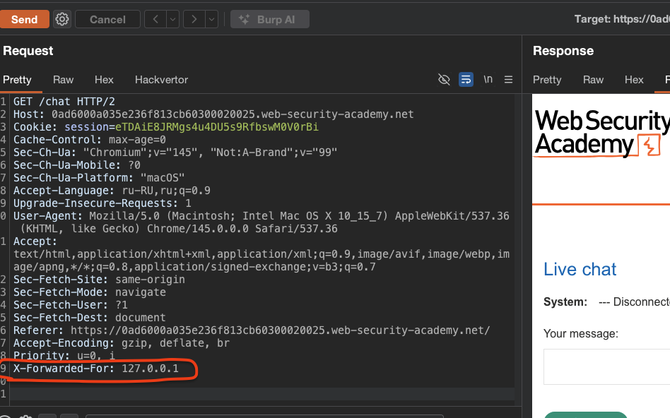


-----

теперь попробую перехватить запрос и подменить сообщение на 
`     `

(почему я не пробую отправить напрямую в чат сразу свой пейлоад? - потому что вижу этот файл js где есть функции очистки данных, и видно, что они работают на клиенте, перед отправкой в веб сокет, как в предыдущей лабе, то есть скорее всего все очищается и только потом отправляется веб сокетом на сервер)

----

но ничего не выходит, так как несмотря на то, что я открыл страницу с `X-Forwarded-For: 127.0.0.1` , но сообщения все равно не уходят

вот перехваченный запрос

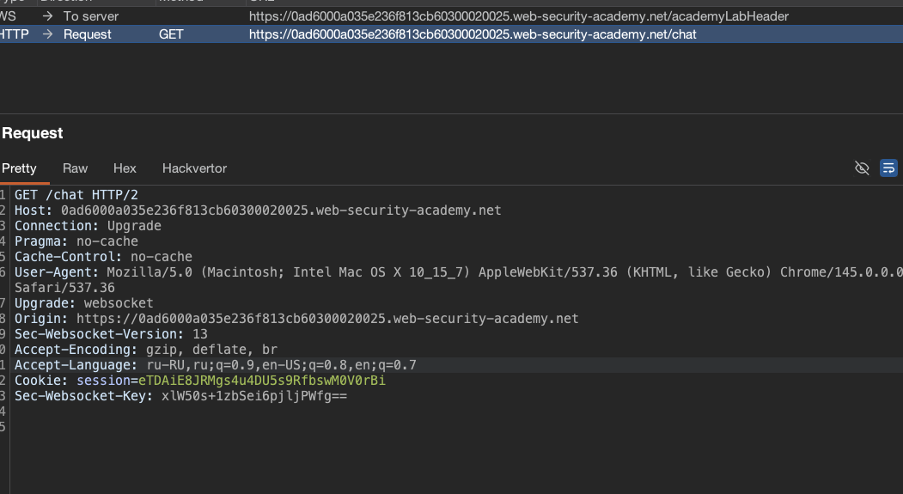


попробую и сюда подставить `X-Forwarded-For: 127.0.0.1`
но все равно не выходит!
пробовал подставить X-Forwarded-For: 127.0.0.1 и удалить Origin

------

значит попробую вручную полностью установить рукопожатие и отправить смс через websocket

-----------

пробую вот так открыть соединение:
```http
GET /chat HTTP/2
Host: 0ad6000a035e236f813cb60300020025.web-security-academy.net
Pragma: no-cache
Cache-Control: no-cache
User-Agent: Mozilla/5.0 (Macintosh; Intel Mac OS X 10_15_7) AppleWebKit/537.36 (KHTML, like Gecko) Chrome/145.0.0.0 Safari/537.36
Upgrade: websocket
Origin: https://0ad6000a035e236f813cb60300020025.web-security-academy.net
Sec-Websocket-Version: 13
Accept-Encoding: gzip, deflate, br
Accept-Language: ru-RU,ru;q=0.9,en-US;q=0.8,en;q=0.7
Cookie: session=eTDAiE8JRMgs4u4DU5s9RfbswM0V0rBi
Sec-Websocket-Key: 9lUadWrb8ZXXOqimIvOySQ==
X-Forwarded-For: 127.0.0.1

```
от ответ 200  но веб сокет не открывается
чат закрыт

--------

смог откравить смс - и вызвать алерт, но смс но сохранилось в переписку на сервере, то есть в чат сам не отправилось

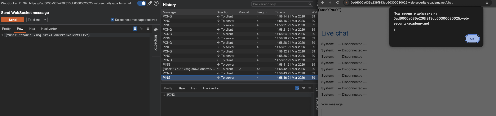


---------

может, я неверно открываю само соединение...

то есть вот, я перезапустил лабу
перехватил запрос
и когда отправляю пейлоад - то это сообщение блокируется` "error":"Attack detected: Event handler"`

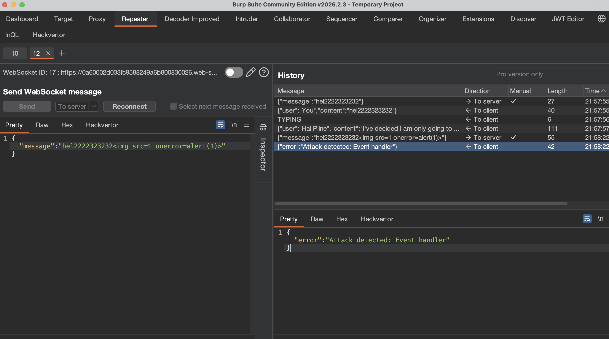


-------


```


{"message":""}


X-Forwarded-For: 127.0.0.1


```

я зашел в репитер
в веб сокет историю
нашел запрос - которым я отправляю сообщения

нажал - переподключение

подставил заголовок X-Forwarded-For: 127.0.0.1

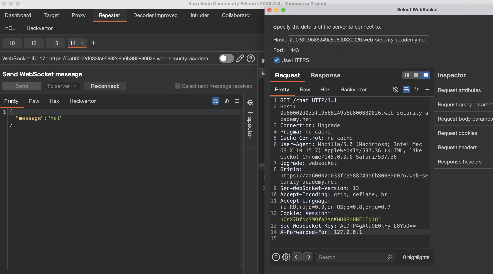


и вуаля - веб сокет снова заработал, и блокировка уже не работает!!
но видно, что я отправил пейлоад `"message":"<></>"`  сообщением в чат
но в самом веб сокете ответ такой `"content":"<><\/>"`  то есть - есть защита или экранирование!
теперь моя цель - обойти эту защиту!

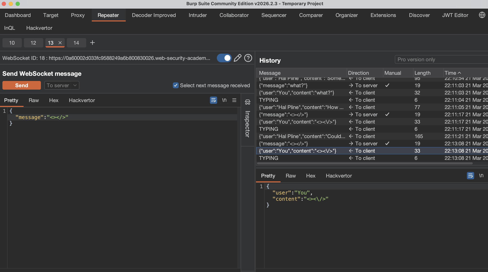


---------
вот так нет блокировки `"message":"<><%2F>"`

пробую `"message":"" ` - норм: пропустил

пробую `    {"message":""}    ` ответ - "error":"Attack detected: Event handler" и соединение закрылось вообще

пробую так  `{"message":"}" `

прошло без блокирвоки - но алерта нет

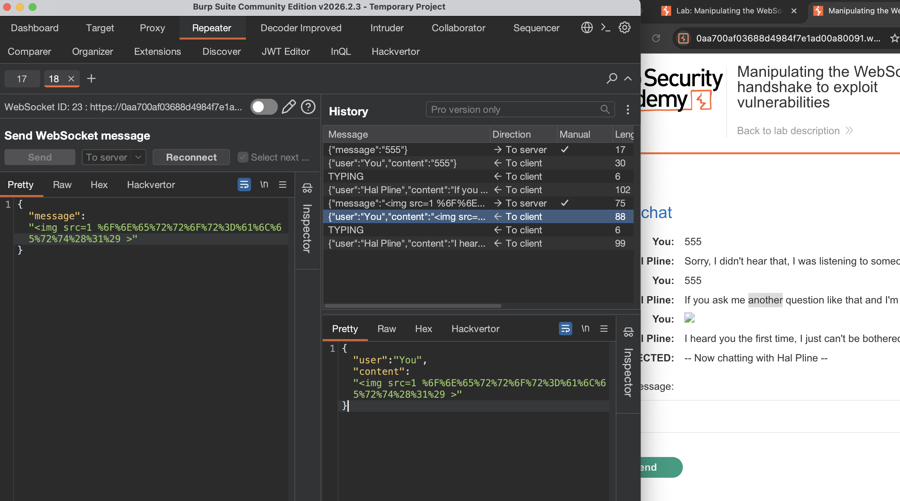


просмотрю код страницы

вот как это вставилось в страницу отразившись от сервера, не раскодированно
```html
<tr class="message"><th>You:</th><td></td></tr>
```

попробую html кодировку (и еще я не понял, почему в концк появилось: ="")
пейлоад
```json
{"message":""}
```

```html
<tr class="message"><th>You:</th><td></td></tr>
```

-------------
ну в чат сам все попадает и отражается от сервера - и я даже вижу саму картинку.. но алерт блокируется, а шифрованный алерт - не расщифровывается 
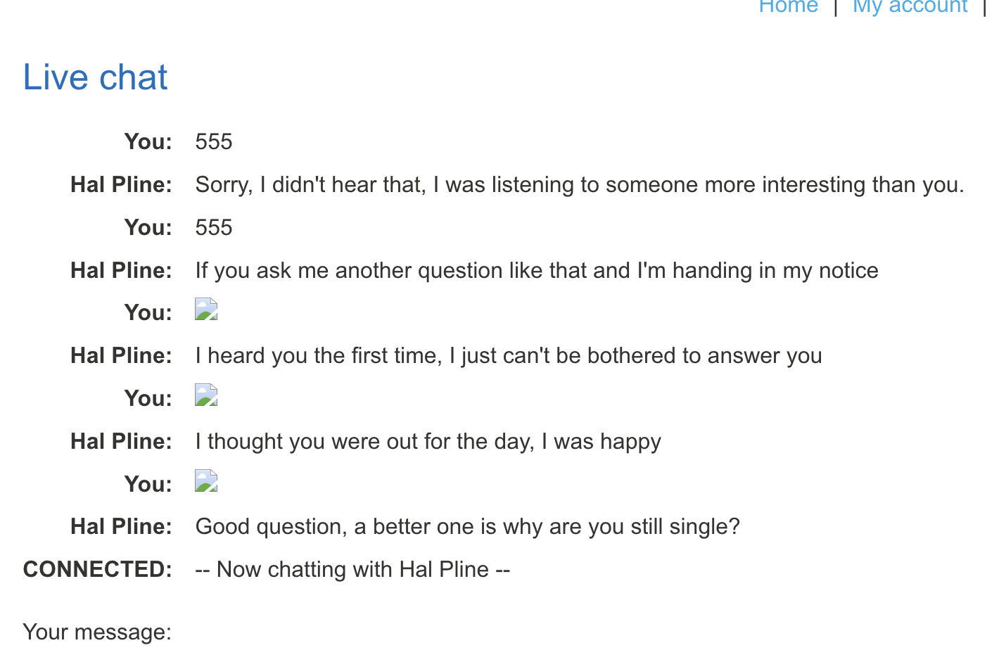


то есть я могу и картинки подгружать сюда без проблем!

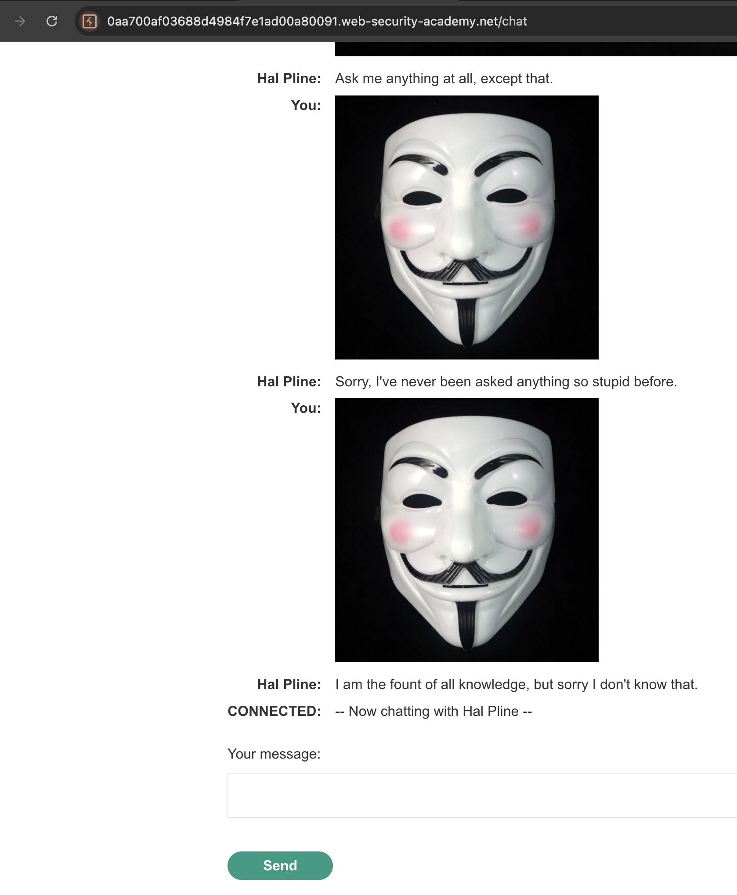


--------

при тестирование, периодически - когда меня банят - я спокойно меняю X-Forwarded-For: 1.2.3.9
на любое значение - и сервис меня без проблем снова допускает к чату

-------

у меня получилось сделать так
`{"message":""}`
и в веб сокете я не получил блокировку

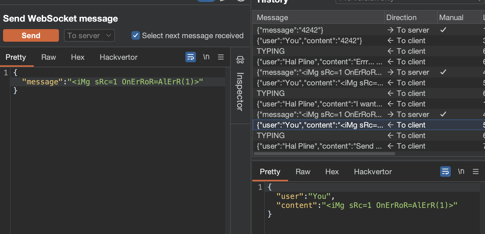


но теперь у меня заблокировался сам чат и не открывается 
`ответ 401 "This address is blacklisted"`

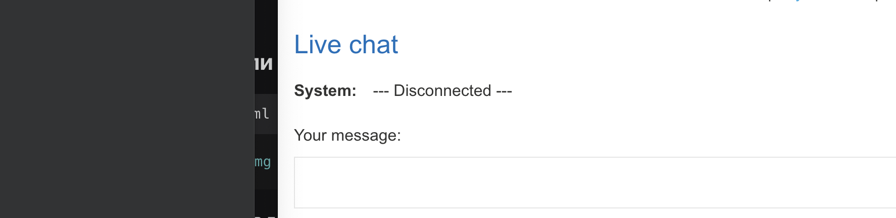


при чем я пробую везде подставлять X-Forwarded-For: 1.2.3.1  и сама страница открываестся , но сам чат нет...


--------

бэктики `бэктики`
```

      - не работает

но в офиц решении увидел это :
**бэктики** (обратные кавычки) вместо скобок

      - сработал

	(а что  `так можно было?`  вместо  ()  )

```

лаба решена 

----------


### суть

1 - я перехватил пакет - подменил текст на пейлоад со скриптом - но получал блокировку
2 - я подменил X-Forwarded-For: и сайт меня разблокировал (то есть блокировка была по "заголовкам")
3 - я смог подобрать пейлоад который подгружал картинку на сайт, и также спокойно вызвал алерт

cервер доверяет заголовку `X-Forwarded-For` для принятия решений о безопасности (черный список), подменив его на `127.0.0.1`, можно обойти блокировку

- Бэктики `` alert`1` `` → обход детекта вызова функции с круглыми скобками

#### Защита

1. не доверяй заголовку X-Forwarded-For для принятия решений о безопасности. Используй реальный IP из соединения
    
2. применяй санитизацию на серверной стороне, не только на клиенте
    
3. используй Content Security Policy для ограничения выполнения скриптов
    
4. экранируй вывод данных в зависимости от контекста (HTML, JS, атрибуты)
    
5. не полагайся на WAF как единственную защиту, используй правильную валидацию на уровне приложения
    
6. для WebSocket обязательно проверяй сессию при handshake и при каждом сообщении
    
7. используй строгую типизацию входящих сообщений, отбрасывай невалидные поля