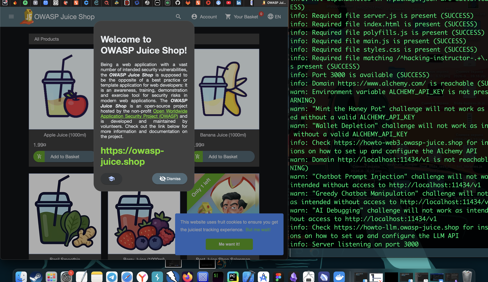

на момент начала тестов Juice-Shop - я уже прорешал почти все лабы на портсвигер, поэтому , я начну тестировать  Juice-Shop согласно своей методичке по веб безопасности - которую я выработал на основе знаний и навыков полученных при обучении в portswigger

где необходимо - буду использовать burp-suite + свои различные сервера 

буду пошагово тестировать на конкретные уязвимости!

--------

#### запуск

разверну сам магазин через докер у себя локально на маке 

```q
docker run --rm -p 127.0.0.1:3003:3000 --name juice-shop bkimminich/juice-shop
```

ну и локально открываю
http://localhost:3001
http://127.0.0.1:3001
и все прекрасно работает! 

juice-shop работает! можно приступать к тестированию!




текущий прогресс нулевой
`http://localhost:3003/#/score-board`


поехали!


