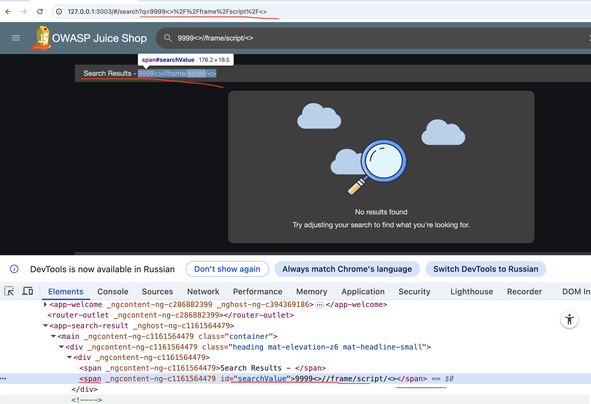
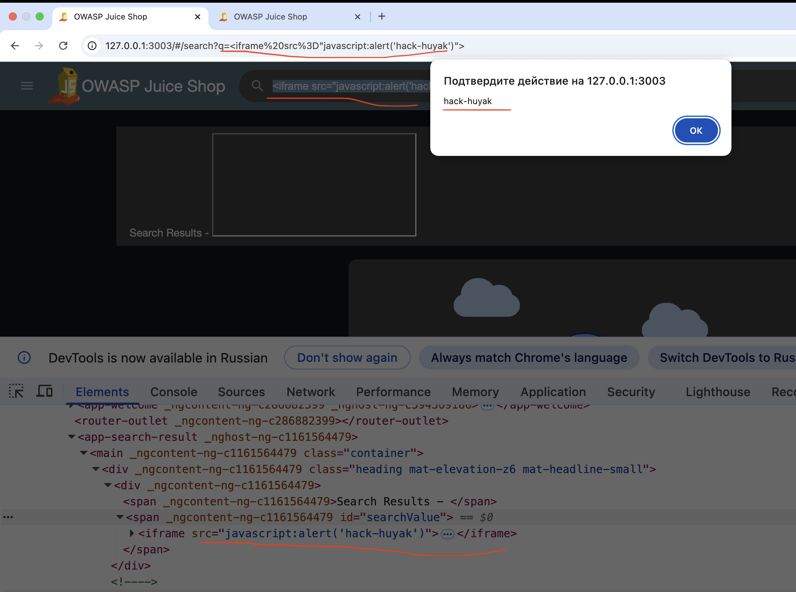
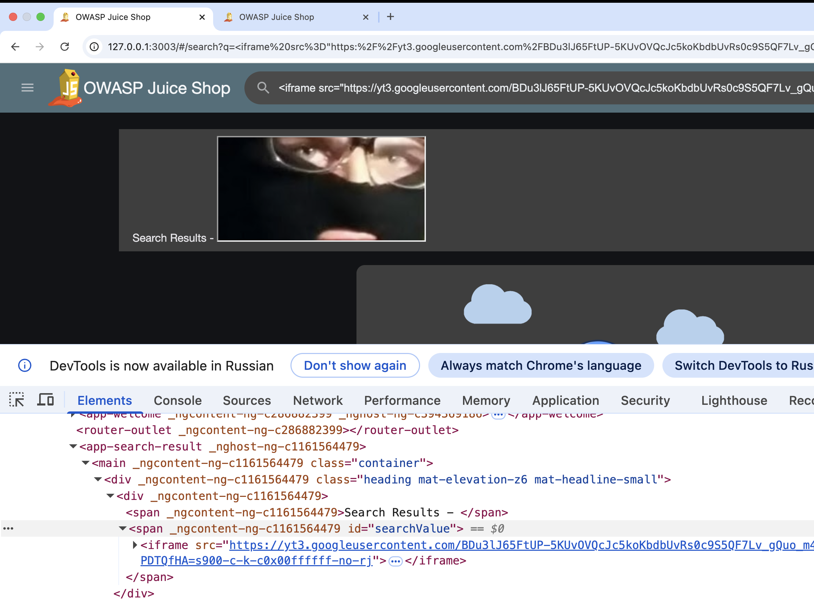
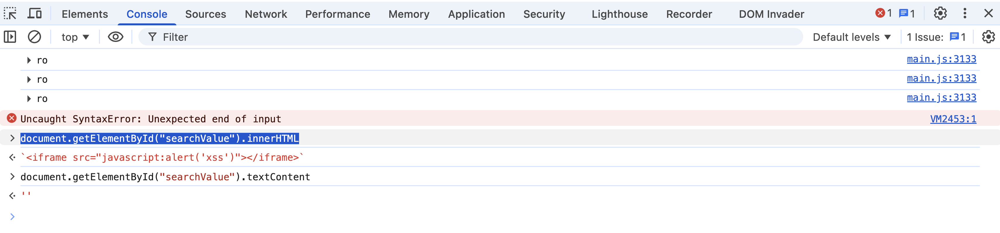
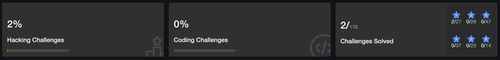

#### juice-shop
через докер у себя локально на маке 
```q
docker run --rm -p 127.0.0.1:3003:3000 --name juice-shop bkimminich/juice-shop
```
ну и локально открываю
http://localhost:3001


задание - найти DOM XSS

хз - че сделать нужно - чтобы засчиталось - попробую аллерт вызвать 

--------




На первый взгляд все максимально банально

вводимые символы - видны и в html страницы и в адресной строке, что само собой является приглашением для взлома

Я вёл просто разные символы в поисковую строку, сайт в HTML отражает результаты запроса, открыв вход страницы я увидел что специальные спецсимволы и спец атрибуты то есть имена тегов не шифруются, не разбиваются, никак не валидируется ввод, поэтому я попробую щас просто вывести аллерт

и мой скрипт вышел из контекста - но попал в другой

```html
<div _ngcontent-ng-c1161564479=""><span _ngcontent-ng-c1161564479="">Search Results - </span>
<span _ngcontent-ng-c1161564479="" id="searchValue">;<script>alert("hack-huyak")</script></span>
</div>
```

попробую создать свой атрибут

``
результат
```html
<div _ngcontent-ng-c1161564479="">

<span _ngcontent-ng-c1161564479="">Search Results - </span>

<span _ngcontent-ng-c1161564479="" id="searchValue">

<span></span></span>

</div>
```

мой пейлоад четко вставляется в сам html код !!
но аллерта нет

------
пробую через iframe

`<iframe src="javascript:alert('hack-huyak')">`

сработало - аллерт есть




```js
<iframe src="https://avatars.mds.yandex.net/get-images-cbir/4113800/0zDT2rFzN4BQAYQ87v_jvw_/orig"></iframe>
```

вуаля!  и картинку туда подгрузил! но в score-board не вижу прогресса (




-------

разобрался, они хотят чтобы я вывел аллерт с xss

```js
<iframe src="javascript:alert('hack-huyak')">
```

сработало - задание засчиталось !


также можно глянуть через консоль 

document.getElementById("searchValue").textContent - Возвращает только **текст** внутри тега. А так как внутри `iframe` нет текста (только атрибуты и пустое тело), то и результат пустой


document.getElementById("searchValue").innerHTML  - Возвращает **всё содержимое** тега как HTML-разметку




прогресс - бар  + 1



------

### вывод

- **Разработчик использовал `.innerHTML` для вставки.** Именно поэтому твой `iframe`превратился в настоящий HTML-тег, а не в текст
   
- **Если бы он использовал `.textContent`, твой код был бы безопасен.** Браузер показал бы строку `<iframe src="javascript:alert('xss')">` как обычный текст, и ничего бы не произошло
-------