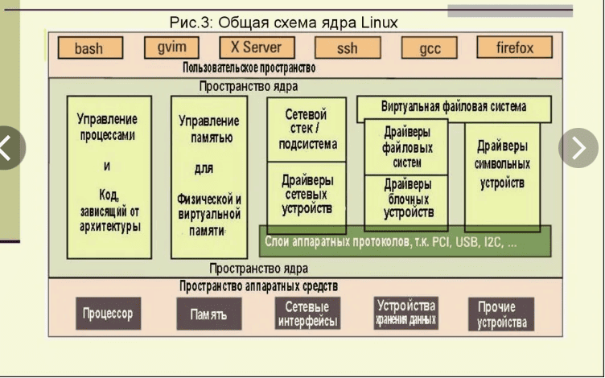

# [АРХИТЕКТУРА база




## 1.1 Четыре столпа Linux

**СТОЛП 1: Всё есть файл**  
В Windows: есть файлы, есть реестр, есть процессы, есть устройства, есть сетевые соединения — разные сущности.  
В Linux: **ВСЁ — ЭТО ФАЙЛ**. Диск — файл. Процесс — папка. Устройство — файл. Настройки — файл. Сокет — файл. Канал — файл.

Когда вы в Windows подключаете диск — это `D:`. Когда в Linux подключаете диск — это файл ==/dev/sda==. Вы можете читать этот файл, писать в него, отправлять по сети. Диск — это просто файл, который представляет устройство.

**СТОЛП 2: Маленькие программы, делающие одно дело хорошо**  
В Windows: программа "Microsoft Word" делает ВСЁ: пишет текст, рисует картинки, проверяет орфографию, считает таблицы.  
В Linux: `cat` только выводит файлы. `grep` только ищет текст. `sort` только сортирует. Они соединяются через **конвейер (pipe)**.

**СТОЛП 3: Всё прозрачно**  
В Windows: "Почему тормозит?" — черный ящик. всюду внешняя оболочка
В Linux: Вы можете открыть файл конфигурации обычным блокнотом. Вы можете посмотреть исходный код. Вы можете трассировать каждый syscall. Нет секретов.

**СТОЛП 4: Сообщество, а не корпорация**  
Windows разрабатывает Microsoft. macOS разрабатывает Apple. 
Linux разрабатывает **человечество**. Тысячи разработчиков по всему миру. Нет одного владельца. Есть мейнтейнеры. Есть Линус Торвальдс (создатель ядра). Но никто не может просто так взять и закрыть проект.

---

## 1.2 Дистрибутив — это не "вид Linux"

**Критически важное понятие:**  
**Linux** — это только **ЯДРО** (kernel). Это программа, которая управляет железом, памятью, процессами.

**Дистрибутив** — это ядро + набор программ + менеджер пакетов + конфиги.

**Пример:**

- Ядро Linux — это двигатель.
    
- **Debian** — стабильный, консервативный, много где стоит.  
  **Ubuntu** — Debian, только с костылями для красоты и удобства.  
  **CentOS/RHEL** — корпоративный сегмент, сервера.  
  **Arch** — для тех, кто хочет собрать систему из кирпичей сам.

## проверка   вот тут [[POINT-RECON]]

мы сможем понять где мы вообще ?
uname -a


чтобы понять что стоит там есть несколько команд обьед в одну

cat /etc/os-release 2>/dev/null || cat /etc/*release 2>/dev/null || cat /etc/issue 2>/dev/null || lsb_release -a 2>/dev/null  (это для ЛИНУКСА!)


`uname -a`               — покажет ядро. По ядру можно косвенно понять.  
`which apt`            (есть — Debian/Ubuntu)  
`which yum`            ( есть — CentOS/RHEL)  
`which pacman`        (есть — Arch, ты у еб-тов)

Но пентестеру, который лезет в чужие сервера, **глубоко %D0%BF%D0%BE%D1%85%D1%83%D0%B9, что там стоит. Ты заходишь — и видишь тот же bash, те же права, ту же файловую систему

---

# ТОМ 2: АНАТОМИЯ — ИЗ ЧЕГО СОСТОИТ LINUX

## 2.1 Уровень 0: Железо (Hardware)

Процессор, память, жесткие диски, сетевая карта, USB-контроллеры.  
Linux работает на ВСЁМ:

- Суперкомпьютеры (100% топ-500)
    
- Серверы (80% интернета)
    
- Десктопы (3%, но свято место)
    
- Android (ЯДРО Linux!)
    
- Роутеры
    
- Холодильники
    
- Автомобили (Tesla)
    
- Терминалы оплаты
    

---

## 2.2 Уровень 1: Ядро (Kernel) — СЕРДЦЕ

Ядро — это единственная программа, которая имеет **абсолютную власть**. Оно работает в режиме ядра (ring 0), все остальные — в пользовательском режиме (ring 3).

**Что делает ядро?**

**А. Управление процессами (Scheduler)**  - Планировщик
Ядро решает: какому процессу сколько времени CPU дать.  
Если вы открыли 100 вкладок в Chrome, ядро распределяет время между ними так, чтобы вам казалось, что всё работает одновременно.
==Scheduler  — хитрый жук   - **иллюзия времени** ==

**Как работает:**

1. У тебя одно ядро процессора (или 4, 8, 16 — неважно).
    
2. Процессов — дох (браузер 100 вкладок, терминал, дискорд, 50 бэкграунд-служб).
    
3. Ядро даёт каждому процессу **микроскопический кусочек времени**: 1мс, 5мс, 10мс.
    
4. Переключает контекст быстрее чем ты моргнёшь.
    
5. Процесс А поработал 5мс — стоп, иди в очередь, запускаем процесс Б.
    
6. Процесс Б поработал — стоп, запускаем В.
    
7. По кругу, тысячи раз в секунду.
    

**Результат:**

- Процесс А думает: «Я работаю без остановки уже 10 секунд».
    
- Процесс Б думает: «Я работаю без остановки уже 10 секунд».


**Б. Управление памятью (Memory Manager)**  
Каждый процесс думает, что у него есть вся память. Ядро создает эту иллюзию через **==виртуальную память**.==
Ядро **раздаёт каждому процессу иллюзию, что у него вся память**.

**Процессы не видят друг друга.**  
**Процессы не видят ядро.**  
**Процессы живут в матрице и счастливы.**

Когда процессу нужно больше памяти — ядро выделяет ещё.  
Когда память заканчивается — ядро скидывает что-то на диск (swap) или убивает на жрущий процесс (OOM Killer).


- Процесс A имеет адрес 0x1234
    
- Процесс B тоже имеет адрес 0x1234
    
- Ядро транслирует это в РАЗНЫЕ физические адреса в RAM

==Ядро — хитрый жук. Каждый процесс думает что он — царь и память вся его. А на деле ядро просто ловко подсовывает им разные куски одного стола==

**В. Управление устройствами (Drivers)**  
80% кода ядра — это драйверы. Драйверы встроены в ядро (монолитный kernel) или загружаются как модули.  
`lsmod` — посмотреть загруженные модули  
`modprobe` — загрузить модуль

**Г. Файловые системы (VFS — Virtual File System)**  
Ядро предоставляет единый интерфейс для работы с разными ФС:

- ext4, XFS, Btrfs (родные)
    
- NTFS, FAT (Windows)
    
- ISO9660 (CD)
    
- сетевые: NFS, SMB
    
- псевдо: proc, sysfs, tmpfs
    

**Д. Сеть (Network Stack)**  
TCP/IP, UDP, ARP, ICMP — всё это в ядре.

**Е. Безопасность (SELinux, AppArmor, namespaces, cgroups)**  
Ядро изолирует процессы друг от друга.

---

## 2.3 Уровень 2: Пользовательское пространство (User Space)

==Всё, что не ядро — это пользовательское пространство.  ==
Даже если вы root. Даже если вы rm -rf /. Ядро всё равно отдельно.

======================
**А. Init система — ПЕРВЫЙ ПРОЦЕСС**  
Когда ядро загрузилось
1. Ядро **создаёт** процесс с PID 1
2. 1. Ядро **вкладывает** в этот процесс программу `/sbin/init`
3. `/sbin/init` (или `systemd`) — **демон**. Самый главный
Это ПРАРОДИТЕЛЬ всех процессов. Если он умрет — система упадет (kernel panic). батя
PID 1 — это не просто процесс. Это **корневой элемент иерархии**.

 ЧТО ОН ДЕЛАЕТ?
**1. Запускает всё остальное**
- SSH сервер
- Сетевые службы
- Твой терминал
- Графический интерфейс
- Буквально **каждый процесс** в системе — его потомок

его (батька*) возможно можно убить командой:      kill -9 1
но на современ системах :  Ядро защита скажет: "Ты еб""""? Это мой сын. Иди н"".

**2. Усыновляет сирот (процессы)**  
Если какой-то процесс умирает, а его дети остались висеть — **PID 1 становится их новым отцом**. Он принимает их, ждёт их завершения, убирает за ними зомби (части полуживых проц).

**3. Иногда сам становится демоном**  
Systemd, init, OpenRC — это имена конкретных реализаций PID 1
### **Демон — это процесс, который работает в фоне и не отсвечивает.**

==обычные процессы== работают так: **Терминал открыт — ты видишь процесс.**  **Терминал закрыл — процесс умер.**
==демон:== - Запустился-- Отвалился от терминала-- Ушёл в фон-- Живёт своей жизнью-- Не привязан ни к какому окну/пользователю/сессии

**Примеры демонов:**
- `sshd` — ждёт SSH подключения
- `nginx` — обслуживает веб-запросы
- `cron` — выполняет задачи по расписанию
- `systemd` — управляет всем остальным

Раньше был SysVinit (скрипты в /etc/init.d).  
Сейчас почти везде **systemd**.  
Systemd запускает всё: службы, монтирует диски, управляет сетью, логирует.

===========

**Б. Оболочка (==Shell==)**  
==Это программа-интерпретатор, которая дает вам командную строку.  ==
==bash, zsh, fish, sh== — это просто программы. Они не являются частью ядра.  
Вы можете установить любой shell.

===========
**В. Системные утилиты (GNU Coreutils)**  
==ls, cp, mv, rm, cat, grep== — это всё отдельные программы.  
Они лежат в /bin, /usr/bin.  
Их разрабатывает проект GNU. Поэтому правильное название — **GNU/Linux**.

про **GNU
В 80х UNIX был платным, закрытым, принадлежал AT&T. Ричард Столлман сказал: **"На&&уй так жить"** и решил написать **свою свободную UNIX-подобную систему**.

Он назвал проект **GNU** — рекурсивный акроним "GNU is Not UNIX" (потому что программисты любую %%%% готовы рекурсивно обозвать).

===========
**Г. Сервисы (Daemons)**  
Фоновые процессы:

- sshd — SSH сервер
    
- httpd/nginx — веб-сервер
    
- mysqld — база данных
    
- systemd-journald — логи


===========

**Д. Графический интерфейс (GUI)**  
X11 или Wayland — это просто программы.  
GNOME, KDE, XFCE — это просто наборы программ.  
Они не являются частью ядра. Вы можете работать вообще без GUI (сервер).


---

# ТОМ 3: ФАЙЛОВАЯ СИСТЕМА — ДЕРЕВО, А НЕ ЛЕС

## 3.1 Иерархия: FHS (Filesystem Hierarchy Standard)

В Windows: C:\ Program Files, Windows, Users  

В Linux: всё от корня `/`

text

/      (корень)
├── bin -> usr/bin        # Базовые команды (ls, cp, cat) — ДОЛЖНЫ БЫТЬ для восстановления
├── boot                  # Ядро, initramfs, загрузчик GRUB
├── dev                   # Файлы устройств (sda — диск, tty — терминал, random — генератор)
├── etc                   # ВСЕ конфиги системы (буквально ВСЁ здесь)
│   ├── passwd            # Пользователи
│   ├── shadow           # Пароли (хеши)
│   ├── fstab            # Что монтировать при загрузке
│   ├── hosts            # Локальный DNS
│   ├── network/         # Сетевые конфиги
│   └── systemd/         # Конфиги systemd
├── home                 # Домашние папки пользователей
│   └── user/            # /home/ivan
├── lib -> usr/lib       # Библиотеки, нужные для /bin
├── media                # Точки монтирования съемных носителей
├── mnt                  # Временное монтирование
├── opt                  # Опциональное ПО (обычно проприетарное)
├── proc                 # ПСЕВДО-ФС. Здесь нет файлов на диске. Здесь информация о процессах в ядре
│   ├── cpuinfo         # Информация о процессоре
│   ├── meminfo         # Память
│   └── 1234/           # Папка процесса с PID 1234
├── root                 # Домашняя папка root (не в /home!)
├── run                  # Временные файлы (PID файлы, сокеты)
├── sbin -> usr/sbin     # Системные команды (только для root)
├── srv                  # Данные сервисов (FTP, HTTP)
├── sys                  # ПСЕВДО-ФС. Информация об устройствах от ядра
├── tmp                  # Временные файлы (ОЧИЩАЮТСЯ ПРИ ПЕРЕЗАГРУЗКЕ!)
├── usr                  # Unix System Resources — ПОЛЬЗОВАТЕЛЬСКИЕ ПРОГРАММЫ
│   ├── bin             # Большинство команд
│   ├── lib             # Библиотеки
│   ├── local          # Программы, собранные вручную
│   └── share          # Документация, иконки, шрифты
└── var                  # Variable — ИЗМЕНЯЕМЫЕ ДАННЫЕ
    ├── log             # Логи (ОЧЕНЬ ВАЖНО)
    ├── mail           # Почта
    ├── spool          # Очереди печати, cron
    └── tmp            # Временные файлы, сохраняемые между перезагрузками

==** ЭТО ДЕРЕВО. ЭТО БАЗА.**

---

## 3.2 Почему так сложно?

**Вопрос:** Зачем нужны bin и sbin? Почему не всё в одном месте?  
**Ответ:** Исторически. /bin — для загрузки, /usr/bin — для всего остального. Сейчас многие дистрибутивы делают симлинки, но стандарт остается.

**Вопрос:** Что за папки proc и sys?  
**Ответ:** Это интерфейс к ядру.

- `cat /proc/cpuinfo` — ядро отдает информацию о процессоре
    
- `echo 1 > /proc/sys/net/ipv4/ip_forward` — включаем форвардинг пакетов (пишем в ядро!)
    

Там нет реальных файлов. Это **виртуальная файловая система**.

---

# ТОМ 4: ПРОЦЕССЫ — КАК ЭТО РАБОТАЕТ ВНУТРИ

## 4.1 PID 1 — Великий Прародитель батёк

Когда компьютер включается:

1. BIOS/UEFI — проверяет железо
    
2. Загрузчик (GRUB) — грузит ядро
    
3. Ядро — инициализирует устройства, создает /dev, /proc
    
4. Ядро — запускает **/sbin/init** (PID 1)
    
5. init — запускает всё остальное
    

**В systemd:**  
PID 1 — это /lib/systemd/systemd  
Он запускает:

- systemd-journald (логи)
    
- systemd-logind (сессии пользователей)
    
- systemd-udevd (устройства)
    
- networkd (сеть)
    
- resolved (DNS)
    
- И сервисы: sshd, cron, и т.д.
    

**Проверка:**


```bash
ps -p 1
  PID TTY          TIME CMD
    1 ?        00:00:03 systemd
```

---

## 4.2 Жизненный цикл процесса

**fork() + exec() — классика UNIX**

1. **fork()** — процесс создает свою точную копию (родитель и ребенок).  
    Ребенок получает новый PID, но копию памяти родителя.
    
2. **exec()** — процесс заменяет свой код на другую программу.  
    Вы не запускаете программу. Вы fork()'итесь, потом exec()'ите.
    

**Пример:**  
Вы вводите `ls` в bash.

1. bash делает fork() → появляется процесс-ребенок bash
    
2. ребенок делает exec("/bin/ls") → его код заменяется кодом ls
    
3. ls выполняется, завершается
    
4. bash продолжает ждать ввод
    

**Проверка:**

bash

strace -f bash -c "ls" | grep exec

---

## 4.3 Zombie и orphan

==**Zombie (зомби):**  ==
Процесс завершился, но родитель не прочитал его exit code.  
В таблице процессов висит как "defunct".  
Не занимает память, но занимает слот в таблице процессов.

==**Orphan (сирота):**  ==
Родитель умер раньше ребенка.  
Ребенок автоматически усыновляется init (PID 1).  
init периодически делает wait() и убирает зомби.

---

## 4.4 Потоки (Threads)

В Linux потоки — это **легковесные процессы**.  
Они разделяют память с родителем, но имеют свой стек.  
`ps -Lf` — посмотреть потоки.

---

# ТОМ 5: ПАМЯТЬ — КАК LINUX НЕ ДАЕТ ПРОГРАММАМ ПОДРАТЬСЯ

## 5.1 Виртуальная память

Каждый процесс думает, что у него есть:

- 0x00000000 — 0xFFFFFFFF (32 бита) или больше (64 бита)
    
- Вся память только его
    
- Он может писать куда угодно
    

**Реальность:**  
Ядро и MMU (Memory Management Unit) транслируют виртуальные адреса в физические.  
Процесс A имеет виртуальный адрес 0x1234 → физический 0xA000  
Процесс B имеет виртуальный адрес 0x1234 → физический 0xB000  
Они НЕ ВИДЯТ друг друга.

---

## 5.2 Swap — "Если не хватает оперативки"

Когда RAM заканчивается, ядро выгружает редко используемые страницы памяти на диск — в **swap-раздел** или ==**swap-файл**.==

Это не "дополнительная оперативка". Это медленно. Очень медленно.  раз так в 100
Но лучше, чем kernel panic (out of memory).

**Проверка:**

bash

```bash
free -h
swapon --show
```
---

## 5.3 OOM Killer (Out Of Memory Killer)

Когда памяти совсем нет и swap кончился, ядро начинает убивать процессы.  
У каждого процесса есть **==oom_score**.  ==
Чем выше — тем больше шанс быть убитым.

- Занимаешь много памяти → высокий score
    
- ==root ==процессы имеют приоритет
    
- ядро никогда не убьет само себя (PID 1, kthreads)
    

**Смотреть:**


```bash
ps aux -O oom_score
```

---

# ТОМ 6: ФАЙЛОВАЯ СИСТЕМА — ГЛУБОКО

## 6.1 Inode — ВМЕСТО ИМЕНИ ФАЙЛА

**Фундаментальная истина:**  
Linux не знает имен файлов. Linux знает **inode**.  
Имя файла — просто ссылка на inode.

**Что такое inode?**  
Это структура данных в ФС, которая содержит:

- Адреса блоков на диске, где лежат данные
    
- Владелец (uid, gid)
    
- Права доступа (rwx)
    
- Время (ctime, mtime, atime)
    
- Количество жестких ссылок


[**Файловая система — это просто способ хранить файлы на диске.*
[Как органайзер в шкафу
- [**EXT4** — стандартный шкаф для Linux
- **[NTFS** — шкаф от Microsoft
- **[APFS** — шкаф от Apple
- **[FAT32** — старая хуня, но работает везде (флешки)]
- 
- [**Каждая ФС решает три задачи:**
1. **[Где лежат данные?** (содержимое файла)
2. **[Как файл называется?** (имя)
3. **[Кто владелец, какие права?** (метаданные)
[**И вот тут появляется inode.**
[Inode — это **номерок**, под которым ФС хранит **всё о файле, кроме его имени**.
[Внутри inode:
[- Размер файла
- [Владелец (UID)
- [Группа (GID)
- [Права (rwx)
- [Врмя создания/изменения
- **[Ссылки на блоки данных** (где на диске лежит содержимое)

**[Главный пипец, который нужно понять:**

**[Имя файла — это не сам файл.**  
[Имя — это просто **ссылка на inode**.

[Один inode может иметь **много имён** (жёсткие ссылки).  
[Имя можно удалить — файл останется, если есть другое имя.  
[Имя можно поменять — inode тот же.

**[Проверить inode:**


```bash
ls -li файл
```

**Чего НЕТ в inode?**

- Имени файла
    

**Посмотреть inode:**


```bash
ls -li file.txt
12345 -rw-r--r-- 1 user user 0 Jan 1 12:00 file.txt
```
# 12345 — это inode

---

## 6.2 Жесткие ссылки (hardlink)

Одно и то же inode → два имени.  
Файл один, имен два.

```bash
ln file.txt link.txt
ls -li
12345 file.txt
12345 link.txt  # ТОТ ЖЕ INODE!
```

Если удалить file.txt, данные не пропадут — есть link.txt.  
Данные удаляются только когда количество ссылок становится 0. (как **ARC** в swift )

**Нельзя:**

- Создать жесткую ссылку на папку
    
- Создать жесткую ссылку на другую ФС (другой раздел)
    

---

## 6.3 Символические ссылки (symlink, softlink)

Отдельный файл, который содержит путь к другому файлу.  
Аналог ярлыка в Windows.

```bash
ln -s original.txt symlink.txt
ls -l symlink.txt
lrwxrwxrwx 1 user user 12 Jan 1 12:00 symlink.txt -> original.txt
```

Символическая ссылка имеет свой inode, свои права (обычно 777).  
Если удалить original — ссылка "битая".

---

# ТОМ 7: ПРАВА ДОСТУПА — НЕ ПРОСТО RWX

## 7.1 Классическая модель

**3 уровня:**

- u (user) — владелец
    
- g (group) — группа
    
- o (others) — остальные
    

**3 права:**

- r (4) — чтение
    
- w (2) — запись
    
- x (1) — выполнение
    

**Для файлов:**

- r — можно прочитать содержимое
    
- w — можно изменить
    
- x — можно запустить
    

**Для папок:**

- r — можно прочитать список файлов (ls)
    
- w — можно создавать/удалять файлы в папке
    
- x — можно "пройти" через папку (cd)
    

**ВАЖНО:** Если у папки нет x, вы не сможете зайти в неё, даже если есть r.

---

## 7.2 Специальные биты

**SUID (4xxx, u+s):**  
Программа запускается от владельца файла, а не от пользователя.  
Классика: `/usr/bin/passwd`  
passwd должен редактировать /etc/shadow (только root).  
Вы запускаете passwd → он работает с правами root, меняет ваш пароль.

**SGID (2xxx, g+s):**

- Для файла: запускается от группы файла
    
- Для папки: новые файлы наследуют группу папки
    

**Sticky bit (1xxx, o+t):**  
Для папки: файл может удалить только владелец.  
Классика: `/tmp` — все могут писать, но удалить чужой файл нельзя.

```bash
chmod 4755 file     # SUID
chmod 2755 folder   # SGID
chmod 1777 /tmp     # Sticky
```

---

## 7.3 ACL (Access Control Lists)

Когда не хватает "u,g,o", нужны ACL — можно дать права конкретным пользователям, не владельцам.

```bash
setfacl -m u:ivan:rwx folder
getfacl folder
```

---

# ТОМ 8: УСТРОЙСТВА — ВСЁ ЕСТЬ ФАЙЛ

## 8.1 /dev — ДИВНЫЙ МИР

```bash
ls -l /dev/sda
brw-rw---- 1 root disk 8, 0 Jan 1 12:00 /dev/sda
```

`b` — block device  
`8,0` — major, minor номер (ядро знает, какой драйвер отвечает за major 8)

**Типы устройств:**

- **b** — block (диски) — читаем блоками, можно seek
    
- **c** — character (терминалы, звук, random) — поток байт
    
- **p** — pipe (FIFO)
    
- **s** — socket
    

**Важные устройства:**

- `/dev/null` — черная дыра. Всё, что туда уходит, исчезает.
    
- `/dev/zero` — бесконечные нули
    
- `/dev/urandom` — случайные числа
    
- `/dev/tty` — текущий терминал
    

---

## 8.2 udev — динамическое управление

Раньше: в /dev были тысячи файлов на все случаи жизни.  
Сейчас: **udev** создает файлы устройств только когда устройство подключено.

bash

udevadm info --query=all --name=/dev/sda

---

# ТОМ 9: ЗАГРУЗКА — ОТ НАЖАТИЯ КНОПКИ ДО ПРИГЛАШЕНИЯ

## Этап 1: BIOS/UEFI (0-2 сек)

- Включается питание
    
- Процессор начинает выполнять код из ROM (BIOS/UEFI)
    
- POST — проверка памяти, устройств
    
- Ищет загрузочное устройство (по порядку: USB, CD, HDD)
    

## Этап 2: Загрузчик (2-5 сек)

- **GRUB** (Grand Unified Bootloader) — самый популярный
    
- GRUB читает конфиг `/boot/grub/grub.cfg`
    
- Показывает меню (или грузит default)
    
- Загружает ядро (`vmlinuz-5.15.0-generic`) и initramfs в память
    
- Передает управление ядру
    

## Этап 3: Ядро (5-10 сек)

- Распаковывает себя
    
- Инициализирует CPU, память, MMU
    
- Загружает драйверы из initramfs
    
- Монтирует корневую ФС (с initramfs или реальную)
    
- Запускает `/sbin/init` (PID 1)
    

## Этап 4: Init (systemd) (10-30 сек)

- Читает `/etc/systemd/system/default.target`
    
- Запускает базовые службы: монтирует диски (fstab), настраивает сеть
    
- Запускает getty (терминалы) — вы видите login:
    
- Запускает display manager (если есть GUI) — gdm, sddm, lightdm
    

**ГОТОВО!**

---

# ТОМ 10: ЛОГИ — ГДЕ ИСКАТЬ, КОГДА ВСЁ СЛОМАЛОСЬ

## 10.1 Традиционные логи (текстовые файлы)

`/var/log/` — святая святых.

- `/var/log/syslog` / `/var/log/messages` — всё подряд
    
- `/var/log/auth.log` — логины, sudo
    
- `/var/log/kern.log` — ядро
    
- `/var/log/dmesg` — буфер ядра (можно `dmesg -H`)
    
- `/var/log/apt/history.log` — установка пакетов
    
- `/var/log/nginx/access.log` — веб-сервер
    
- `/var/log/mysql/error.log` — база данных
    

## 10.2 systemd journal (бинарные)

`journalctl` — главная команда для логов.


```bash
journalctl -u sshd.service        # логи конкретной службы
journalctl -f                     # follow (как tail -f)
journalctl --since "1 hour ago"   # за час
journalctl -p err                 # только ошибки
journalctl -k                     # только ядро
```

---

# ТОМ 11: СЕТЬ — КАК LINUX ВИДИТ МИР

## 11.1 Интерфейсы


```bash
ip a

- lo — loopback (127.0.0.1)
    
- eth0, enp0s3 — Ethernet
    
- wlan0 — Wi-Fi
    
- docker0 — виртуальный мост Docker
    
- tun0 — VPN
```
    

## 11.2 Таблица маршрутизации


```bash
ip route
default via 192.168.1.1 dev eth0
192.168.1.0/24 dev eth0 proto kernel scope link src 192.168.1.100
```

**Что это значит:**

- 192.168.1.0/24 — локальная сеть, напрямую
    
- default — всё остальное, через шлюз 192.168.1.1
    

## 11.3 Netfilter/iptables/nftables — огонь!

Ядро имеет встроенный брандмауэр. Каждый пакет проходит через цепочки правил.

**Цепочки:**

- PREROUTING — до маршрутизации
    
- INPUT — пакеты для самого сервера
    
- FORWARD — транзитные пакеты
    
- OUTPUT — пакеты от сервера
    
- POSTROUTING — после маршрутизации
    

**Таблицы:**

- filter — фильтрация (DROP, ACCEPT)
    
- nat — трансляция адресов (SNAT, DNAT)
    
- mangle — изменение пакетов
    
- raw — особые случаи
    

**Современность:**

- `iptables` — старый интерфейс
    
- `nftables` — новый интерфейс (CentOS 8+, Debian 10+)
    

---

# ТОМ 12: ИЗОЛЯЦИЯ — КОНТЕЙНЕРЫ И НЕ ТОЛЬКО

Linux умеет изолировать процессы задолго до Docker.

## 12.1 Namespaces — "иллюзия отдельной системы"

**Что можно изолировать:**

- mount (mnt) — своя файловая система
    
- pid — свои PID (внутри PID 1)
    
- net — свои сетевые интерфейсы
    
- ipc — межпроцессное взаимодействие
    
- uts — своё hostname
    
- user — свои пользователи
    
- cgroup — ресурсы
    

**Docker использует namespaces**, чтобы контейнер думал, что он на отдельном сервере.

## 12.2 cgroups — ресурсы не для всех

Control Groups — ограничение CPU, памяти, диска для группы процессов.


```bash
systemd-cgtop
```

---

# ТОМ 13: ИТОГ — КАК УСТРОЕН LINUX (КРАТКО)

1. **Ядро** — абсолютная власть, доступ к железу, монолит с модулями.
    
2. **Init (systemd)** — первый процесс, родитель всех.
    
3. **Файловая система** — единое дерево от /, независимо от физических дисков.
    
4. **Всё есть файл** — диски /dev/sda, процессы /proc/1234, настройки /sys.
    
5. **Права доступа** — u/g/o, rwx, inode, ссылки, ACL.
    
6. **Сеть** — интерфейсы, маршруты, netfilter.
    
7. **Логи** — journalctl и /var/log.
    
8. **Пакеты** — apt/yum/dnf/pacman.