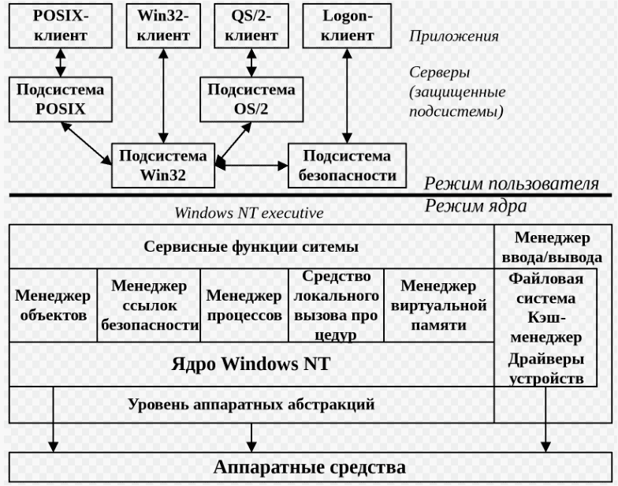

# [АРХИТЕКТУРА база

# ТОМ 1: ФИЛОСОФИЯ WINDOWS — КАК ЭТО РАБОТАЕТ "ПОД КАПОТОМ"

Прежде чем мы нырнем в дебри реестра, процессов и архитектуры, вы должны понять главное отличие Windows от Linux. Это не "плохо" и не "хорошо". Это **разная философия**, рожденная разными историческими условиями.

---

## 1.1 Три столпа Windows

**СТОЛП 1: Windows — это продукт, а не религия**  
Linux создавался энтузиастами для энтузиастов. Windows создавала корпорация для продажи.  
Последствие: Windows должна работать у бабушки, у которой 15 вирусов, кривой диск и она выдернула шнур во время обновления. Поэтому Windows **терпит**. Она прощает глупые ошибки, пытается исправить, скрывает сложность.

**СТОЛП 2: GUI — первичен, командная строка — вторична**  
В Linux вы приходите в командную строку, а GUI — это надстройка.  
В Windows вы приходите в рабочий стол, а командная строка — это инструмент для админов.  
Даже сейчас, когда Microsoft развивает PowerShell и WSL, **мышление Windows остается GUI-ориентированным**.

**СТОЛП 3: Обратная совместимость — священная корова**  
Программа, написанная для Windows 95 в 1995 году, с высокой вероятностью запустится на Windows 11 в 2025 году.  
Microsoft тащит этот багаж десятилетиями. В ядре Windows до сих пор есть код, поддерживающий OS/2 и POSIX (отключено, но код есть). Есть эмуляция DOS (NTVDM). Есть поддержка 16-битных приложений на 32-битных системах.  
**Цена:** Огромная сложность внутри.  
**Выгода:** Ваш бизнес-софт с 1998 года работает без переписывания.

---

## 1.2 Windows — это не "одна система"

Когда вы говорите "Windows", вы на самом деле говорите о четырех разных эпохах:

**1. MS-DOS (1981-2000)**  
Однозадачная, 16-бит, без защиты памяти. Просто загрузчик программ.  
Windows 3.1, 95, 98, Me — это **надстройка над DOS**. Они не были полноценными ОС.

**2. Windows NT (1993 — настоящее время)**  
Полноценное ядро. Защита памяти. Многозадачность. 32/64 бита.  
NT — New Technology.  
Windows NT 3.1, NT 4.0, 2000, XP, Vista, 7, 8, 10, 11 — **это одна линейка**, развивающаяся с 1993 года.  
**Ваша Windows 11 — это праправнучка Windows NT 3.1.**

**3. Windows CE (1996-2013)**  
Для встраиваемых систем, КПК, навигаторов.

**4. Windows Embedded**  
Для терминалов, банкоматов, касс.

**ВСЁ, ЧТО МЫ РАССМАТРИВАЕМ ДАЛЬШЕ — ЭТО ЛИНЕЙКА NT.**

---

# ТОМ 2: АРХИТЕКТУРА — ИЗ ЧЕГО СОСТОИТ WINDOWS

## 2.1 Уровень -1: Железо (Hardware)

Процессор, память, диски, сеть.  
Windows работает ТОЛЬКО на:

- x86 (32 бита) — постепенно умирает
    
- x64 (64 бита) — стандарт
    
- ARM (новые Surface, сервера) — растет
    

Windows **НЕ** работает на:

- PowerPC (было, умерло)
    
- Itanium (IA-64, умерло)
    
- MIPS (было, умерло)
    
- Alpha (было, умерло)
    

---

## 2.2 Уровень 0: Абстракция от железа (HAL)

Hardware Abstraction Layer.  
Это прослойка между ядром и железом.  
Ядро не знает, как именно прерывать конкретный контроллер, как именно писать в регистры PIC/APIC. Оно вызывает HAL. HAL говорит: "На этом чипсете — так, на этом — эдак".  
**Результат:** Windows можно портировать на новую архитектуру, переписав только HAL, а не всё ядро.

---

## 2.3 Уровень 1: Ядро (Kernel) — NTOSKRNL.EXE

**Файл:** `C:\Windows\System32\ntoskrnl.exe`  
Это сердце. Загружается в память при старте и никогда не выгружается.

**Что делает ядро Windows:**

**А. Управление процессами и потоками (Process/Thread Manager)**  
Создание, завершение, планирование.  
Windows использует **вытесняющую многозадачность с приоритетами**.  
Планировщик — **priority-based, preemptive, round-robin**.  
32 уровня приоритета (0-31).  
0 — нулевая страница (системный)  
1-15 — динамические (обычные процессы)  
16-31 — реального времени (драйверы, ядро)

**Б. Управление памятью (Memory Manager)**  
Виртуальная память. 4KB страницы (можно 2MB/1GB huge pages).  
Поддержка PAE (Physical Address Extension) для 32-бит систем >4GB RAM.  
Файл подкачки — `pagefile.sys`.

**В. Диспетчер ввода-вывода (I/O Manager)**  
Всё, что связано с драйверами, файловыми системами, устройствами.

**Г. Кэш-менеджер (Cache Manager)**  
Единый системный кэш для файлового ввода-вывода.

**Д. Диспетчер объектов (Object Manager)**  
**КЛЮЧЕВОЕ ОТЛИЧИЕ ОТ LINUX.**  
В Linux "всё есть файл". В Windows "всё есть **объект**".  
Объекты: процессы, потоки, файлы, события, семафоры, разделы памяти, токены доступа, реестр.  
Объектами управляет Object Manager. У каждого объекта есть:

- Имя (опционально, может быть в иерархии Object Namespace)
    
- Дескриптор безопасности (Security Descriptor — кто что может)
    
- Счетчик ссылок
    
- Методы создания/закрытия
    

**Е. Менеджер конфигурации (Configuration Manager)**  
РЕЕСТР. Да, это компонент ядра. Реестр не "файл с настройками", это **база данных, доступная из ядра**.

---

## 2.4 Уровень 2: Исполнительная система (Executive)

Это набор компонентов, работающих в режиме ядра, но не являющихся ядром в узком смысле.

**A. Диспетчер процессов (Process Manager)**  
Создание и завершение процессов. Работает с Object Manager.

**Б. Диспетчер памяти (Memory Manager)**  
Виртуальная память, проецируемые файлы, pagefile.

**В. Диспетчер ввода-вывода (I/O Manager)**  
Драйверы, IRP (I/O Request Packets).

**Г. Диспетчер кэша (Cache Manager)**

**Д. Диспетчер конфигурации (Configuration Manager) — РЕЕСТР**

**Е. Диспетчер PnP (Plug and Play Manager)**  
Обнаружение нового железа, загрузка драйверов.

**Ж. Диспетчер питания (Power Manager)**  
Сон, гибернация, управление питанием устройств.

**З. Диспетчер безопасности (Security Reference Monitor)**  
Проверяет, имеет ли процесс право на доступ к объекту.

**И. Диспетчер локальных вызовов процедур (LPC/Local Procedure Call)**  
Коммуникация между процессами на одной машине.  
В современных версиях — ALPC (Advanced LPC).

---

## 2.5 Уровень 3: Драйверы устройств

Драйверы в Windows — это загружаемые модули (.sys) в режиме ядра.  
Они работают в том же адресном пространстве, что и ядро.  
Плохой драйвер = BSOD.

**Типы драйверов:**

- WDM (Windows Driver Model) — старый стандарт
    
- KMDF (Kernel-Mode Driver Framework) — современный, упрощает
    
- UMDF (User-Mode Driver Framework) — драйверы в пользовательском режиме (без риска для системы)
    
- Фильтр-драйверы (например, антивирусы — перехватывают запросы к файлам)
    
- Минифильтры (новый механизм для файловых систем)
    

**Важно:** Windows НЕ использует монолитное ядро с загружаемыми модулями как Linux.  
Windows — **гибридное ядро**.  
Часть драйверов (графика, файловые системы) могут быть в пользовательском режиме.

---

## 2.6 Уровень 4: Пользовательский режим — Подсистемы

Ядро само по себе не знает, что такое "приложение Windows".  
Ядро знает, что такое "процесс", "поток", "память".  
Но оно не знает, как загрузить PE-файл (.exe), как обработать Win32 API.

Этим занимаются **подсистемы окружения (Environment Subsystems)**.

**Главная подсистема: Win32 (csrss.exe + win32k.sys)**

- csrss.exe — Client/Server Runtime Subsystem
    
- win32k.sys — графический драйвер, часть ядра
    
- Обрабатывает API: CreateWindow, ReadFile, WriteConsole
    

**Другие подсистемы (исторические):**

- OS/2 (умерла)
    
- POSIX (умерла)
    
- WSL (Windows Subsystem for Linux) — современная
    

Каждая подсистема реализует свою семантику процессов, потоков, объектов.

---

## 2.7 Уровень 5: Системные процессы

**PID 4: System** — ядро + HAL. Не является процессом в обычном смысле, это "процесс-пустышка" для потоков ядра.

**csrss.exe** — подсистема Win32. Критический процесс. Если убить — BSOD.

**wininit.exe** — запускает services.exe, lsass.exe, lsaiso.exe

**services.exe** — Диспетчер служб (SCM). Запускает и контролирует службы Windows.

**lsass.exe** — Local Security Authority Subsystem Service. Аутентификация, смена паролей, токены безопасности. ХРАНИЛИЩЕ ПАРОЛЕЙ (SAM).

**lsaiso.exe** — изоляция LSASS (Credential Guard)

**svchost.exe** — Процесс-хост для служб из DLL.  
Один svchost может содержать несколько служб (группировка).  
`tasklist /svc` — посмотреть, какие службы внутри.

**explorer.exe** — Рабочий стол, панель задач, Проводник.

**System Idle Process** — не процесс, счетчик свободного CPU.

---

# ТОМ 3: ФАЙЛОВАЯ СИСТЕМА — НЕ ТОЛЬКО C:\

## 3.1 Иерархия Windows

В отличие от Linux, где всё от `/`, в Windows несколько корней:

**C:** — системный диск (обычно)  
**D:** — данные или DVD  
**E:** — флешка

**Нет единого корня.** Есть **Object Namespace** в ядре, но обычный пользователь туда не ходит.

---

## 3.2 Структура системного диска (C:)

text

C:\
├── Program Files          # 64-битные программы
├── Program Files (x86)    # 32-битные программы (на 64-бит системе)
├── ProgramData            # Общие данные программ (раньше All Users)
├── Windows                # СИСТЕМА
│   ├── System32           # 64-битные системные файлы (на 64-бит)
│   │   ├── drivers       # Драйверы (.sys)
│   │   ├── config        # РЕЕСТР (SAM, SYSTEM, SOFTWARE, SECURITY)
│   │   ├── spool         # Очереди печати
│   │   └── catroot       # Подписи драйверов
│   ├── SysWOW64          # 32-битные системные файлы на 64-бит системе
│   ├── Temp              # Временные файлы
│   ├── WinSxS           # WinSxS — КОШМАР (см. ниже)
│   └── INF              # Файлы установки драйверов (.inf)
├── Users                 # Пользователи (аналог /home)
│   ├── Public           # Общедоступные файлы
│   └── Иван            # Профиль пользователя
│       ├── Desktop      # Рабочий стол
│       ├── Documents    # Мои документы
│       ├── Downloads    # Загрузки
│       ├── AppData      # Важнейшая папка
│       │   ├── Local   # Локальные данные (не перемещаются)
│       │   ├── Roaming # Перемещаемые данные (синхронизируются)
│       │   └── LocalLow# Пониженная целостность (IE, Flash)
│       └── NTUSER.DAT  # Файл реестра пользователя
└── Boot                 # Файлы загрузчика (скрытый)

---

## 3.3 WinSxS — почему у меня занято 20 ГБ?

**C:\Windows\WinSxS** — Windows Side-by-Side.  
Microsoft позволила иметь несколько версий одной и той же DLL одновременно.  
Программа A требует DLL v1.0, программа B — v2.0. Раньше был DLL Hell. Теперь обе версии лежат в WinSxS.

**Как это работает:**  
В папке программы лежат не настоящие DLL, а **жесткие ссылки** (hardlinks) на файлы в WinSxS.  
Вы видите `C:\Program Files\App\mydll.dll`, физически это `C:\Windows\WinSxS\amd64_microsoft...\mydll.dll`.

**Почему WinSxS растет:**  
Каждое обновление Windows кладет **новую копию** системных файлов в WinSxS. Старые не удаляются (откат).  
Почистить: `Dism /Online /Cleanup-Image /StartComponentCleanup`

**Никогда не удаляйте папку WinSxS вручную.** Система умрет.

---

## 3.4 Файловые системы Windows

**FAT16/FAT32** — древнее, для совместимости. Макс файл 4GB.  
**NTFS** — родная, журналируемая, права доступа (ACL), шифрование (EFS), сжатие, теневые копии.  
**ReFS** — Resilient File System (серверы, самовосстановление).  
**exFAT** — для флешек (нет ограничения 4GB).

---

## 3.5 Теневые копии (Shadow Copy/VSS)

Volume Shadow Copy Service.  
Позволяет делать снапшоты диска "на лету", даже если файлы открыты.  
Используется:

- Точки восстановления системы
    
- Бэкап (wbadmin)
    
- Previous Versions в проводнике
    

**Технически:**  
VSS создает "моментальный снимок" — копируются только измененные блоки (copy-on-write).  
Файл выглядит как обычный, но физически это "разностный" образ.

---

# ТОМ 4: РЕЕСТР — ЦЕНТР УПРАВЛЕНИЯ ПОЛЕТАМИ

## 4.1 Что такое реестр?

В Linux: конфиги — текстовые файлы в /etc.  
В Windows: конфиги — **бинарная база данных**, иерархическая, доступная из ядра.

**Файлы реестра (hive):**

text

C:\Windows\System32\config\
├── SAM          — Security Accounts Manager (пользователи, пароли)
├── SECURITY     — Политики безопасности
├── SOFTWARE     — Настройки ПО, ассоциации файлов
├── SYSTEM       — Настройки драйверов, служб
└── DEFAULT      — Профиль по умолчанию

C:\Users\Иван\NTUSER.DAT — профиль пользователя
C:\Users\Иван\AppData\Local\Microsoft\Windows\UsrClass.dat — еще один

---

## 4.2 Структура реестра (5 корневых ключей)

**HKEY_LOCAL_MACHINE (HKLM)**  
Информация о системе, не зависящая от пользователя.  
HKLM\SAM — пользователи и пароли (хеши NTLM). Нельзя читать обычному пользователю.  
HKLM\SECURITY — политики безопасности.  
HKLM\SOFTWARE — настройки программ.  
HKLM\SYSTEM — драйверы, службы, загрузка.

**HKEY_CLASSES_ROOT (HKCR)**  
Ассоциации файлов (что открывает .txt) и COM-классы.  
Объединяет:

- HKLM\SOFTWARE\Classes (для всех пользователей)
    
- HKCU\SOFTWARE\Classes (для текущего)
    

**HKEY_CURRENT_USER (HKCU)**  
Настройки текущего пользователя. Ссылка на HKU{SID}.

**HKEY_USERS (HKU)**  
Все загруженные профили пользователей.

**HKEY_CURRENT_CONFIG**  
Ссылка на HKLM\SYSTEM\CurrentControlSet\Hardware Profiles\Current.

---

## 4.3 Типы данных в реестре

- REG_SZ — строка
    
- REG_EXPAND_SZ — строка с переменными (%PATH%)
    
- REG_BINARY — бинарные данные
    
- REG_DWORD — 32-битное число
    
- REG_QWORD — 64-битное число
    
- REG_MULTI_SZ — массив строк
    

---

## 4.4 Внутреннее устройство реестра

Реестр — это **логически** дерево.  
**Физически** — набор файлов (hive) и **B-tree** внутри.

Каждый hive имеет:

- Base block (заголовок)
    
- Ячейки (cells):
    
    - Ключи (key) — узлы дерева
        
    - Значения (value) — листья
        
    - Дескрипторы безопасности
        

При загрузке hive проецируется в память (memory-mapped file).  
Доступ через системные вызовы (NtOpenKey, NtQueryValueKey).

---

# ТОМ 5: ПРОЦЕССЫ И ПОТОКИ

## 5.1 Процесс в Windows

**Структура EPROCESS** (в ядре) — огромная структура, содержащая:

- PID
    
- Имя образа
    
- Таблицы страниц памяти
    
- Таблицы дескрипторов (handle table)
    
- Токен доступа (кто запустил)
    
- Список потоков
    
- Приоритет
    
- Счетчики CPU, памяти
    

**Пользовательский режим:**

- PEB (Process Environment Block) — структура в userspace
    
- Содержит: аргументы командной строки, переменные окружения, загруженные DLL
    

---

## 5.2 Поток (Thread)

**Структура ETHREAD** (ядро):

- TEB (Thread Environment Block) — в userspace
    
- Стек ядра и пользовательский стек
    
- Контекст (регистры)
    
- Приоритет
    

**Планировщик:**  
Приоритеты 0-31 (0 — система, 31 — realtime)  
Квант — ~30-60ms (зависит от версии и настроек)  
Windows Server дает больший квант (лучше для фоновых задач)  
Windows Client — меньший квант (отзывчивость UI)

**Состояния потока:**

- Ready
    
- Running
    
- Waiting
    
- Standby
    
- Terminated
    

---

## 5.3 Job Objects — группа процессов

Job — контейнер для процессов.  
Можно ограничить:

- Общее время CPU
    
- Рабочий набор памяти
    
- Процессорное сродство (affinity)
    
- Приоритет
    

Используется браузерами (Chrome), веб-серверами (IIS).

---

# ТОМ 6: ПАМЯТЬ

## 6.1 Виртуальная память

32 бита: 4GB.  
По умолчанию: 2GB пользователю, 2GB ядру.  
Можно включить `/3GB` в boot.ini (3GB user, 1GB kernel) — только для 32-бит.

64 бита: 8TB пользователю, 8TB ядру (теоретически 256TB, ограничено железом).

**Страницы:**  
4KB — стандарт  
2MB — large pages (для SQL Server, Hyper-V)  
1GB — huge pages (серверы)

---

## 6.2 Файл подкачки (pagefile.sys)

`C:\pagefile.sys` — по умолчанию.  
Может быть несколько файлов подкачки на разных дисках.  
Может быть отключен (не рекомендуется).

**Типы памяти:**

- **Physical memory** — RAM
    
- **Commit charge** — виртуальная память, выделенная процессам
    
- **Commit limit** — RAM + размер pagefile
    
- **Working set** — физическая RAM, занятая процессом сейчас
    

**Структура страничного файла:**  
PFN (Page Frame Number) database — база данных физических страниц.  
Каждая страница RAM имеет PFN entry.  
Состояния: active, standby, modified, free, zeroed, bad.

---

## 6.3 Session Manager (SMSS)

Первая программа в пользовательском режиме после ядра.  
Создает подсистемы (csrss, winlogon), загружает реестр, создает pagefile.

---

# ТОМ 7: ЗАГРУЗКА WINDOWS

## Фаза 0: Включение питания

- POST (Power-On Self Test)
    
- BIOS/UEFI ищет загрузочное устройство
    

## Фаза 1: Загрузчик (UEFI)

- UEFI читает загрузчик: `\EFI\Microsoft\Boot\bootmgfw.efi`
    
- bootmgfw.efi читает BCD (Boot Configuration Database) — `\EFI\Microsoft\Boot\BCD`
    
- BCD — файл реестра, аналог boot.ini
    

**Старый BIOS/MBR:**

- MBR (сектор 0) → bootsect.dos → bootmgr
    

## Фаза 2: Windows Boot Manager (bootmgr)

- bootmgr читает BCD
    
- Выбирает, какую ОС грузить
    
- Запускает winload.exe
    

## Фаза 3: winload.exe

- Загружает ядро (ntoskrnl.exe)
    
- Загружает HAL (hal.dll)
    
- Загружает реестр (SYSTEM hive)
    
- Загружает драйверы (с флагом BOOT_START)
    
- Передает управление ядру
    

## Фаза 4: Ядро (ntoskrnl)

- Инициализирует исполнительную систему
    
- Запускает SMSS.exe (Session Manager)
    

## Фаза 5: SMSS

- Создает файл подкачки (pagefile.sys)
    
- Загружает остальные hives реестра
    
- Запускает csrss.exe, winlogon.exe
    

## Фаза 6: winlogon

- Запускает службы (services.exe)
    
- Запускает lsass.exe (безопасность)
    
- Показывает экран входа
    

## Фаза 7: userinit

- После входа запускает userinit.exe
    
- userinit запускает explorer.exe
    
- **ГОТОВО**
    

---

# ТОМ 8: БЕЗОПАСНОСТЬ — НЕ ТОЛЬКО АНТИВИРУС

## 8.1 SID (Security Identifier)

Уникальный идентификатор безопасности.  
Никогда не повторяется.

**Пример:** `S-1-5-21-123456789-987654321-135792468-1001`

- S — строка
    
- 1 — версия
    
- 5 — authority (NT AUTHORITY)
    
- 21 — non-unique (локальный)
    
- ... — RID (Relative ID)
    

**Известные SID:**

- S-1-0-0 — NULL
    
- S-1-1-0 — WORLD (все)
    
- S-1-5-18 — LOCAL SYSTEM
    
- S-1-5-19 — NT Authority\LocalService
    
- S-1-5-20 — NT Authority\NetworkService
    
- S-1-5-21-...-500 — Administrator
    
- S-1-5-21-...-501 — Guest
    
- S-1-5-21-...-1000 — первый пользователь
    

---

## 8.2 Токен доступа (Access Token)

При входе в систему создается **токен**.  
Прикрепляется к каждому процессу/потоку пользователя.

**Содержит:**

- SID пользователя
    
- SID групп
    
- Привилегии (SeShutdownPrivilege, SeDebugPrivilege...)
    
- Integrity Level (Mandatory Integrity Control)
    

**Integrity Level (IL):**

- Untrusted (0) — ничего нельзя
    
- Low (1) — Internet Explorer в песочнице
    
- Medium (2) — обычный пользователь
    
- High (3) — администратор
    
- System (4) — SYSTEM
    
- Installer (5) — TrustedInstaller
    

---

## 8.3 UAC (User Account Control)

Появился в Vista.  
**Проблема:** В XP все сидели под админом, вирусы делали что хотели.  
**Решение:** Админский токен split-токен.

**Как работает:**

1. Вы админ, логинитесь
    
2. Вам дается ДВА токена: полный админский (High) и ограниченный (Medium)
    
3. По умолчанию процессы работают с Medium
    
4. При попытке сделать админское действие (изменить реестр, установить софт) — появляется UAC-диалог
    
5. Если подтвердить — процесс запускается с High токеном
    

**Можно отключить. Не отключайте.**

---

## 8.4 SAM — база паролей

`C:\Windows\System32\config\SAM`  
Доступ к файлу заблокирован, пока система работает.  
Пароли хранятся в виде NTLM-хешей.

**Хеширование NTLM:**  
MD4(UTF-16-LE(password))  
**Никакой соли.** Можно радужные таблицы.

**Где берутся пароли в домене:**

- Локальные: SAM
    
- Доменные: NTDS.dit (контроллер домена)
    

**Дамп паролей:**

- Из SAM (требуется SYSTEM)
    
- Из памяти LSASS (Mimikatz)
    

---

## 8.5 AppLocker / Software Restriction Policies

Ограничение, какие программы можно запускать.  
По пути, по хешу, по сертификату.

**Цель:** Запретить вирусам запускаться из %TEMP% или AppData.

---

# ТОМ 9: ДРАЙВЕРЫ — КАК ЭТО РАБОТАЕТ

## 9.1 IRP (I/O Request Packet)

Основная структура для обмена между менеджером ввода-вывода и драйверами.

**Жизненный цикл:**

1. Win32 API (ReadFile) → ntdll!NtReadFile → syscall
    
2. I/O Manager создает IRP
    
3. IRP передается драйверу через стек драйверов
    
4. Драйвер обрабатывает, передает дальше или завершает
    
5. IRP возвращается, данные пользователю
    

**Стек драйверов:**  
Файловая система → Volume Manager → Disk Driver → Port Driver → Miniport

---

## 9.2 Типы драйверов

**Legacy (NT 4.0 style):**  
Старые. Сами управляют своим стеком.

**WDM (Windows Driver Model):**  
PnP, Power Management. Основной стиль для Windows 2000/XP.

**KMDF (Kernel Mode Driver Framework):**  
Упрощает написание драйверов. Объектная модель. WDF предоставляет стандартную обработку IRP.

**UMDF (User Mode Driver Framework):**  
Драйверы в пользовательском режиме.  
Для устройств, где не нужна бешеная скорость (USB-мышки, принтеры, датчики).  
Грохнулся драйвер — перезапустится, не BSOD.

**Фильтры:**  
Перехватывают IRP до/после основного драйвера.  
Пример: антивирус — видит все запросы к файлам.

---

# ТОМ 10: СЕТЬ В WINDOWS

## 10.1 Сетевой стек

1. **NDIS** (Network Driver Interface Specification) — граница между ядром и сетевыми драйверами.
    
2. **Протоколы** (TCP/IP, NetBIOS, IPX — RIP IPX) — встроены в ядро.
    
3. **AFD** (Ancillary Function Driver) — Winsock в ядре.
    
4. **Winsock** (ws2_32.dll) — API для приложений.
    

---

## 10.2 Windows Firewall с расширенной безопасностью

Не просто "разрешить/запретить порт".  
Основан на **Windows Filtering Platform (WFP)**.  
WFP — это API для перехвата сетевых пакетов на всех уровнях (L2-L7).

**Используется:**

- Брандмауэром
    
- Антивирусами (сетевые экраны)
    
- Родительским контролем
    
- VPN-клиентами
    

---

## 10.3 DNS в Windows

**Кэш DNS:**  
`ipconfig /displaydns` — посмотреть  
`ipconfig /flushdns` — очистить

**Hosts файл:**  
`C:\Windows\System32\drivers\etc\hosts`  
До сих пор работает. Раньше использовался вирусами (перенаправление банков).

---

# ТОМ 11: ЛОГИ — ГДЕ ИСКАТЬ, КОГДА ВСЁ СЛОМАЛОСЬ

## 11.1 Event Log (События)

`eventvwr.msc` — просмотр событий

**Журналы Windows:**

- Application — ошибки программ
    
- Security — логин/логаут, доступ к файлам (если включено аудитом)
    
- System — драйверы, службы, синие экраны
    
- Setup — установка обновлений
    
- Forwarded Events — события с других машин
    

**Журналы приложений и служб:**

- Microsoft/Windows/... — специализированные логи (например, PowerShell/Operational)
    
- Internet Explorer — логи браузера
    
- Key Management Service — активация
    

**Просмотр через командную строку:**  
`wevtutil qe System /c:10 /f:text`  
`Get-EventLog -LogName System -Newest 10` (PowerShell)

---

## 11.2 Синие экраны (BSOD)

**Минидампы:** `C:\Windows\Minidump\*.dmp`  
**Полный дамп:** `C:\Windows\MEMORY.DMP`

**Анализ:**

- WinDbg (отладчик)
    
- BlueScreenView
    
- WhoCrashed
    

**Коды остановки:**

- 0x0000001A — MEMORY_MANAGEMENT
    
- 0x0000003B — SYSTEM_SERVICE_EXCEPTION
    
- 0x00000050 — PAGE_FAULT_IN_NONPAGED_AREA
    
- 0x0000007B — INACCESSIBLE_BOOT_DEVICE
    
- 0x0000007E — SYSTEM_THREAD_EXCEPTION_NOT_HANDLED
    
- 0x0000009F — DRIVER_POWER_STATE_FAILURE
    
- 0x000000D1 — DRIVER_IRQL_NOT_LESS_OR_EQUAL
    

**Что делать:**

1. Посмотреть, какой драйвер (WinDbg: `!analyze -v`)
    
2. Вспомнить, что ставили/обновляли
    
3. Обновить драйвер
    
4. Откатить драйвер
    
5. Откатить систему
    
6. Переустановить систему
    

---

## 11.3 DEP (Data Execution Prevention)

Аппаратная защита: NX-бит (No eXecute).  
Помечает страницы памяти как "только данные", нельзя выполнять код.  
Борьба с shellcode в куче/стеке.

**Проверка:**  
`wmic OS get DataExecutionPrevention_SupportPolicy`

---

# ТОМ 12: УПРАВЛЕНИЕ — KAK ЭТО АВТОМАТИЗИРОВАТЬ

## 12.1 WMI (Windows Management Instrumentation)

Реализация WBEM (Web-Based Enterprise Management) от Microsoft.  
Позволяет управлять Windows через объекты.

**Классы WMI:**

- Win32_Process — процессы
    
- Win32_Service — службы
    
- Win32_LogicalDisk — диски
    
- Win32_NetworkAdapter — сетевые карты
    
- Win32_UserAccount — пользователи
    

**wmic.exe** — командная строка для WMI.  
`wmic process list brief`  
`wmic product get name,version`

**WMI умирает.** Microsoft заменяет на PowerShell.

---

## 12.2 PowerShell

**НЕ CMD.** Это .NET в командной строке.

**Объекты, не текст:**  
CMD: `dir` → текст  
PowerShell: `Get-ChildItem` → объекты FileInfo

**Модули:**

- ActiveDirectory
    
- Hyper-V
    
- Exchange
    
- SQL Server
    

**Выполнение политик:**  
Restricted, AllSigned, RemoteSigned, Unrestricted, Bypass.

**WinRM (WS-Management):**  
PowerShell Remoting — управление удаленными машинами.

---

## 12.3 GPO (Group Policy)

Централизованное управление настройками в домене.  
Редактор: `gpedit.msc` (локально), `gpmc.msc` (домен)

**Что можно настроить:**

- Реестр (Administrative Templates — ADMX/ADML файлы)
    
- Права пользователей
    
- Скрипты входа/выхода
    
- Установку софта
    
- Брандмауэр
    
- BitLocker
    
- Internet Explorer
    

---

# ТОМ 13: ТРЮКИ И СЕКРЕТЫ

## 13.1 Alternate Data Streams (ADS)

NTFS позволяет хранить **несколько потоков данных** в одном файле.

**Создать:**  
`echo secret > file.txt:hidden.txt`

**Прочитать:**  
`notepad file.txt:hidden.txt`

**Увидеть:**  
`dir /r`

**Использовали:**

- Вирусы (прячут код в потоках)
    
- MacOS (хранят иконки в `:AFP_AfpInfo`)
    
- Браузеры (маркировка скачанных файлов `:Zone.Identifier`)
    

---

## 13.2 Жесткие ссылки и симлинки

**Hardlink:**  
`mklink /h link.txt original.txt`

**Symlink:**  
`mklink link.txt original.txt`

**Directory Junction:**  
`mklink /j link_folder original_folder`

**Symbolic link для папок:**  
`mklink /d link_folder original_folder`

---

## 13.3 Объекты ядра в .\

`\\.\C:` — прямой доступ к диску (минуя файловую систему)  
`\\.\PhysicalDrive0` — физический диск 0  
`\\.\COM1` — COM-порт

---

## 13.4 Special Folders

`shell:Desktop` — рабочий стол  
`shell:Downloads` — загрузки  
`shell:AppData` — Roaming  
`shell:Local AppData` — Local  
`shell:ProgramFiles` — Program Files  
`shell:Startup` — автозагрузка

**Открыть:**  
`explorer shell:Startup`

---

# ТОМ 14: АДМИНИСТРИРОВАНИЕ — ЧТО ДЕЛАТЬ, КОГДА ВСЁ ПЛОХО

## 14.1 Safe Mode (Безопасный режим)

Загрузка только с минимальными драйверами.  
F8 при старте (или Shift + F8 — часто не работает, слишком быстро).

**Варианты:**

- Безопасный режим
    
- Безопасный режим с сетью
    
- Безопасный режим с командной строкой
    
- Режим восстановления служб каталогов (DC)
    
- Последняя удачная конфигурация
    

---

## 14.2 Last Known Good Configuration

Загружает реестр и драйверы с момента последнего успешного входа.  
Исправляет, если установили кривой драйвер и не можете войти.

---

## 14.3 System Restore (Точки восстановления)

VSS сохраняет состояние системных файлов и реестра.  
Не трогает документы.

**Командная строка:**  
`rstrui.exe` — запуск восстановления

---

## 14.4 Startup Repair

Автоматическое исправление загрузчика, поврежденных системных файлов.

---

# ТОМ 15: WINDOWS — ЭТО НЕ ПРОСТО

**Резюме:**

1. **Windows — гибридное ядро.** Ядро + HAL + драйверы в режиме ядра, подсистемы в пользовательском.
    
2. **Всё есть объект, а не файл.** Object Manager, дескрипторы, Security Descriptor.
    
3. **Реестр — не текстовые конфиги, а бинарная БД в ядре.**
    
4. **NTFS — журналируемая ФС с ACL, ADS, сжатием, шифрованием.**
    
5. **Загрузка сложная:** UEFI → bootmgfw → BCD → winload → ntoskrnl → SMSS → CSRSS/winlogon → services → explorer.
    
6. **Безопасность:** SID, токены, integrity levels, UAC, AppLocker.
    
7. **BSOD — это драйверы.** В 99% случаев.
    
8. **PowerShell — будущее.** WMI — прошлое.
    

---

**Теперь вы знаете Windows так, как её знают админы.**

Не на уровне "нажать кнопку Пуск", а на уровне "что происходит в ядре, когда вы её нажимаете".

Этого достаточно, чтобы:

- Понимать, куда смотреть при ошибке
    
- Не бояться реестра
    
- Объяснить, почему WinSxS весит 20 ГБ
    
- Отличить процесс system от svchost
    
- Знать, где лежат пароли
    
- Починить загрузку
    

**Windows — это не хаос. Это просто очень большая и сложная система, которая развивается 30+ лет, сохраняя обратную совместимость.**