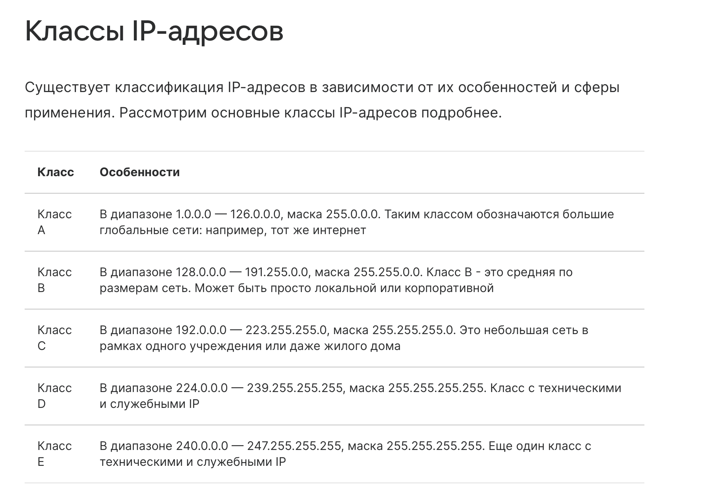

# Internet Protocol address

# работает на 3 ур   OSI

Отвечает за логическую адресацию и маршрутизацию пакетов данных от отправителя к получателю **через различные сети**
---
уникальные цифровые координаты, которые присваиваются любому устройству в [сети](https://practicum.yandex.ru/blog/setevaya-infrastruktura-ekspluataciya-i-monitoring/). Он помогает передавать данные между устройствами. Он работает так же, как почтовый адрес, который помогает почтальону доставить письма, только в этом случае это данные.

# **IP-адреса бывают разных классов:**

- **IPv4** (Internet Protocol Version 4) — самый распространённый класс IP-адреса. Он включает четыре числа, разделённых точками, допустим 164.121.2.1. Однако диапазон таких адресов ограничен.
- **IPv6** (Internet Protocol Version 6) — свежая версия, состоящая из более длинных комбинаций букв и чисел, допустим 3024:0fv6:44c2:0001:0001:7s1e:0461:6355. Она была создана, чтобы решить проблему нехватки IPv4.
- 
----
###  **версии:**

#### **IPv4 (Internet Protocol version 4)**

# диапазон от 0.0.0.0 до 255.255.255.255

- **Адресация:** ==32-битные адреса, записываются как 4 десятичных числа (0-255), например, `192.168.1.1`==
    
- **Пространство адресов:** ~4.3 миллиарда адресов. **Исчерпано.**
- **Ключевые проблемы:**
    
    - **Нехватка адресов:** Решается через: 
    - **NAT (Network Address Translation)** и **частные адреса**(10.0.0.0/8, 172.16.0.0/12, 192.168.0.0/16).
      
    - **Слабая встроенная безопасность:** Без дополнительных протоколов (IPSec) данные передаются в открытом виде.
- **Заголовок:** Сложный, переменной длины (обычно 20 байт + опции).
- **Состояние:** Доминирует, но постепенно вытесняется.
    
#### **IPv6 (Internet Protocol version 6)**

- **Адресация:** ==128-битные адреса, записываются как 8 групп по 4 шестнадцатеричных цифр, например, `2001:0db8:85a3:0000:0000:8a2e:0370:7334`. Можно сокращать.==
    
- **Пространство адресов:** Огромное (~3.4×10³⁸ адресов). Хватит на каждую песчинку на Земле.
    
- **Ключевые улучшения:**
    
    - **Автоконфигурация адресов (SLAAC).**
        
    - **Упрощенный заголовок** (фиксированный, 40 байт) для более быстрой обработки маршрутизаторами.
        
    - **Встроенная поддержка IPSec** (хотя и необязательная).
        
    - **Лучшая поддержка мобильности и QoS.**
        
- **Важные типы адресов:**
    
    - **Unicast:** Один-к-одному.
        
    - **Multicast:** Один-ко-многим (вместо отдельного broadcast).
        
    - **Link-local** (fe80::/10): Для общения в пределах одной сети без маршрутизатора.
        
- **Состояние:** Активно внедряется, но медленно.

-----

-----------

- Крупные сайты (Google, Facebook) **могут** обрабатывать миллионы запросов одновременно
    
- Но они **всё равно ставят лимиты на IP**, чтобы:
    
    - Защититься от брутфорса
        
    - Предотвратить DDoS
        
    - Экономить ресурсы на ботов

- Да, большинство серверов **ограничивают запросы с одного IP**
    
- Это называется **Rate Limiting** или **DDoS protection**
    
- Типичные лимиты: 10-100 запросов в минуту с одного IP
    
- При превышении: временная блокировка (5-30 мин), CAPTCHA, или перманентный бан

## . **Как обходят эти ограничения хакеры:**

### Способ A: Прокси-серверы (самый популярный)

python

# Пример: Использование списка прокси
proxies = [
    "http://proxy1.com:8080",
    "http://proxy2.com:8080", 
    # ... 500+ прокси
]

# Каждый запрос через случайный прокси
for i in range(1000):
    proxy = random.choice(proxies)
    requests.get(url, proxies={"http": proxy, "https": proxy})

`127.0.0.1` — это такой **«короткий внутренний номер» для любого компьютера или сервера**. Это зарезервированный IP-адрес, который всегда означает **«это устройство, на котором я сейчас нахожусь»**.

