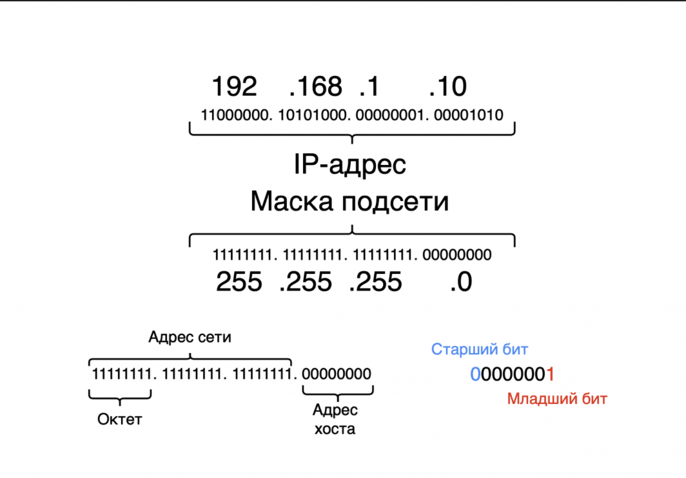
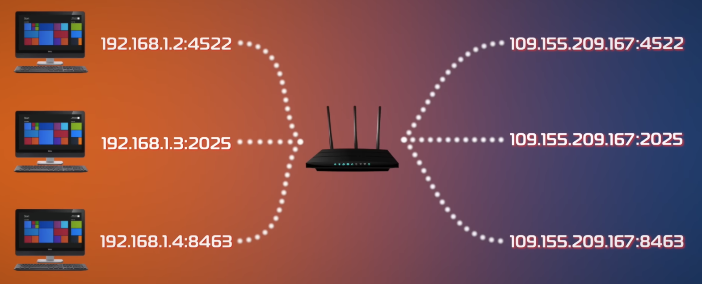
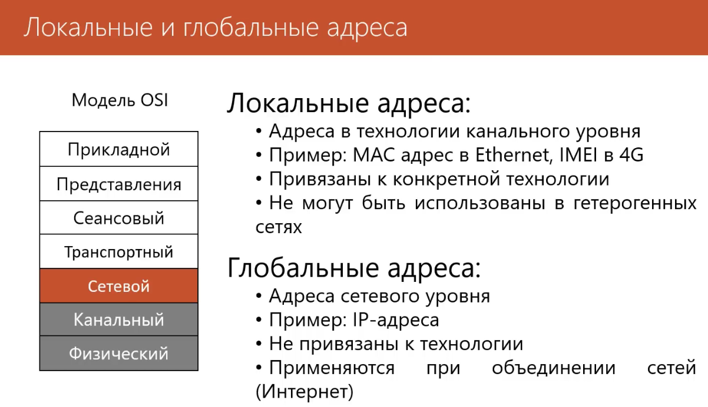

# Internet Protocol address

# работает на 3 ур   OSI

Отвечает за логическую адресацию и маршрутизацию пакетов данных от отправителя к получателю **через различные сети**
---
уникальные цифровые координаты, которые присваиваются любому устройству в [сети](https://practicum.yandex.ru/blog/setevaya-infrastruktura-ekspluataciya-i-monitoring/). Он помогает передавать данные между устройствами. Он работает так же, как почтовый адрес, который помогает почтальону доставить письма, только в этом случае это данные.

# **IP-адреса бывают разных классов:**

- **IPv4** (Internet Protocol Version 4) — самый распространённый класс IP-адреса. Он включает четыре числа, разделённых точками, допустим 164.121.2.1. Однако диапазон таких адресов ограничен.
- **IPv6** (Internet Protocol Version 6) — свежая версия, состоящая из более длинных комбинаций букв и чисел, допустим 3024:0fv6:44c2:0001:0001:7s1e:0461:6355. Она была создана, чтобы решить проблему нехватки IPv4.
- 
----
###  **версии:**

#### **IPv4 (Internet Protocol version 4)**

# диапазон от 0.0.0.0 до 255.255.255.255

- **Адресация:** ==32-битные адреса, записываются как 4 десятичных числа (0-255), например, `192.168.1.1`==
    
- **Пространство адресов:** ~4.3 миллиарда адресов. **Исчерпано.**
- **Ключевые проблемы:**
    
    - **Нехватка адресов:** Решается через: 
    - **NAT (Network Address Translation)** и **частные адреса**(10.0.0.0/8, 172.16.0.0/12, 192.168.0.0/16).
      
    - **Слабая встроенная безопасность:** Без дополнительных протоколов (IPSec) данные передаются в открытом виде.
- **Заголовок:** Сложный, переменной длины (обычно 20 байт + опции).
- **Состояние:** Доминирует, но постепенно вытесняется.
    
#### **IPv6 (Internet Protocol version 6)**

- **Адресация:** ==128-битные адреса, записываются как 8 групп по 4 шестнадцатеричных цифр, например, `2001:0db8:85a3:0000:0000:8a2e:0370:7334`. Можно сокращать.==
    
- **Пространство адресов:** Огромное (~3.4×10³⁸ адресов). Хватит на каждую песчинку на Земле.
    
- **Ключевые улучшения:**
    
    - **Автоконфигурация адресов (SLAAC).**
        
    - **Упрощенный заголовок** (фиксированный, 40 байт) для более быстрой обработки маршрутизаторами.
        
    - **Встроенная поддержка IPSec** (хотя и необязательная).
        
    - **Лучшая поддержка мобильности и QoS.**
        
- **Важные типы адресов:**
    
    - **Unicast:** Один-к-одному.
        
    - **Multicast:** Один-ко-многим (вместо отдельного broadcast).
        
    - **Link-local** (fe80::/10): Для общения в пределах одной сети без маршрутизатора.
        
- **Состояние:** Активно внедряется, но медленно.

-----

-----------

- Крупные сайты (Google, Facebook) **могут** обрабатывать миллионы запросов одновременно
    
- Но они **всё равно ставят лимиты на IP**, чтобы:
    
    - Защититься от брутфорса
        
    - Предотвратить DDoS
        
    - Экономить ресурсы на ботов

- Да, большинство серверов **ограничивают запросы с одного IP**
    
- Это называется **Rate Limiting** или **DDoS protection**
    
- Типичные лимиты: 10-100 запросов в минуту с одного IP
    
- При превышении: временная блокировка (5-30 мин), CAPTCHA, или перманентный бан

## . **Как обходят эти ограничения хакеры:**

### Способ A: Прокси-серверы (самый популярный)

python

# Пример: Использование списка прокси
proxies = [
    "http://proxy1.com:8080",
    "http://proxy2.com:8080", 
    # ... 500+ прокси
]

# Каждый запрос через случайный прокси
for i in range(1000):
    proxy = random.choice(proxies)
    requests.get(url, proxies={"http": proxy, "https": proxy})

`127.0.0.1` — это такой **«короткий внутренний номер» для любого компьютера или сервера**. Это зарезервированный IP-адрес, который всегда означает **«это устройство, на котором я сейчас нахожусь»**.

----

Вся адресная сеть IPv4 (примерно 4.3 миллиарда адресов) делится на 
**публичные диапазоны, 
приватные диапазоны, 
специальные** диапазоны.

-------

### Разбор на примере `10.0.0.0/8`
- **`   10.0.0.0`** — это **адрес сети**. Он обозначает всю подсеть целиком.
    
- **`/8`** означает, что **первые 8 битов** (первый октет `10.`) фиксированы и идентифицируют сеть. Остальные 24 бита (три октета `x.x.x`) можно использовать для адресации устройств.

----

`10.0.0.0` **`/8`** = Маска `255.0.0.0`
От `10.0.0.0` до `10.255.255.255`|**16 777 216** адресов (огромная сеть)

`172.16.0.0` **`/12`** = Маска `255.240.0.0`
От `172.16.0.0` до `172.31.255.255`|**1 048 576** адресов (крупная сеть)

`192.168.1.0` **`/24`** = Маска `255.255.255.0`
От `192.168.1.0` до `192.168.1.255`|**256** адресов (маленькая, домашняя сеть)

---

порты:

- **  
    Ваш телефон в Wi-Fi**:
    
    - ✅ Роутер выдаёт ему **локальный (частный) IP-адрес**, например, `192.168.1.105`. **Порт не выдаётся "навсегда"**. Порт (`:52413`) динамически выбирается ОС телефона **для каждого нового исходящего соединения** (к каждому сайту — свой случайный порт).
        
- **Домашняя сеть (NAT)**:
    
    - ✅ Все устройства в вашей Wi-Fi-сети имеют **разные локальные IP** (`192.168.1.105`, `.106`, `.107`), но один **общий внешний (публичный) IP-адрес** роутера. Это и есть работа **NAT (Network Address Translation)** в роутере.
        
- **Провайдер (Ростелеком)**:
    
    - ✅ Ваш роутер соединяется с оборудованием **Ростелекома**. Ростелеком назначает вашему роутеру этот самый **публичный IP** (например, `95.165.32.10`). Для интернета **весь трафик со всех ваших устройств выглядит исходящим с одного адреса `95.165.32.10`**.
        
- **Глобальная маршрутизация**:
    
    - ✅ Далее пакет путешествует через **цепочку маршрутизаторов (routers) провайдеров разного уровня** (городские, магистральные). Они смотрят на **IP-адрес назначения** в пакете (например, IP ВКонтакте) и пересылают его "ближе" к цели. Это похоже на сортировку писем на почте по индексу.
        
- **Система DNS (преобразование имён)**:
    
    - ⚠️ **DNS работает ДО этого путешествия, на самом первом шаге**. Когда вы в браузере набираете `vk.com`, ваш телефон **сначала** спрашивает у DNS-сервера (часто у Ростелекома): _"Какой IP-адрес у `vk.com`?"_
        
    - DNS-сервер отвечает: _"`vk.com` — это `87.240.132.72"`_. **Только после этого** ваш телефон формирует пакет с **IP-адресом назначения `87.240.132.72`** и отправляет его по описанному выше маршруту. Без DNS ваш телефон просто не знал бы, куда отправлять запрос.
        
- **Целевой сервер (ВКонтакте)**:
    
    - ✅ Пакет наконец достигает серверов ВКонтакте с IP `87.240.132.72`. Сервер видит, что запрос пришёл с адреса `95.165.32.10` (ваш роутер) на порт `443` (HTTPS). Он обрабатывает ваше сообщение, формирует ответ и отправляет его **обратно на `95.165.32.10`**.
        
    - ✅ Ваш роутер получает ответ, смотрит в свою **NAT-таблицу**, находит там запись "этот ответ для телефона `192.168.1.105`" и пересылает ответ в вашу Wi-Fi-сеть.

-----
### **`192.168.0.12` — IP-адрес** разбор
Это **веб-сервер**, доступный только из локальной сети, работающий на порту 8080.

**`192.168.`** — начало диапазона **частных (приватных) IP-адресов** (только внутренняя сеть)
- Диапазоны: `10.0.0.0/8`, `172.16.0.0/12`, `192.168.0.0/16`
  **`.0.12`** — конкретный хост в подсети
- Обычно: `.1` — роутер/шлюз, `.2`-`.254` — устройства

- **Порт 8080** — альтернативный HTTP-порт
- Часто используется для:
    - Веб-приложений в разработке
    - Прокси-серверов
    - Альтернативных веб-сервисов когда порт 80 занят      
    - Docker-контейнеров

------

### **1. 🏢 `10.0.0.0/8` — много адресов (больгие компании)**

- **Адреса:** `10.0.0.1` — `10.255.255.254`
- **Максимально:** ~16 миллионов устройств
- **Пример:** Крупная корпорация, облачный провайдер
10.0.0.1    — главный роутер
10.0.1.15   — отдел бухгалтерии
10.10.5.20  — сервер разработки
10.255.1.1  — удалённый офис

### **2. 🏢 `172.16.0.0/12` — средняя компания

- **Адреса:** `172.16.0.1` — `172.31.255.254`
- **Максимально:** ~1 миллион устройств
- **Пример:** Средний бизнес, университет
172.16.0.1   — основной роутер
172.16.1.10  — Wi-Fi для гостей
172.17.0.5   — отдел продаж
172.31.255.1 — резервный сервер

### **3. 🏠 `192.168.0.0/16` — небольшая компания (офис/дом частный)

- **Адреса:** `192.168.0.1` — `192.168.255.254`
- **Максимально:** ~65 тысяч устройств
- **Самый частый в:** домах, кафе, малом бизнесе
192.168.0.1    — домашний Wi-Fi роутер
192.168.0.2    — твой ноутбук
192.168.0.3    — твой телефон
192.168.1.100  — принтер

-----
