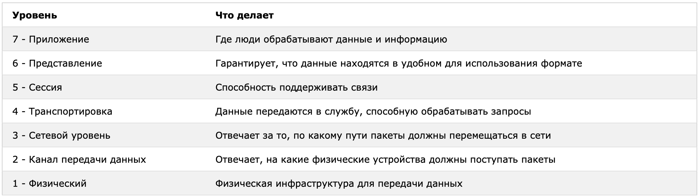

всего тут 7 уровней 
Open Systems Interconnection
-------------------------------
"Взаимодействие открытых систем") представляет собой простой и интуитивно понятный способ стандартизации различных частей, необходимых для связи между сетями.
-----------------------

Модель проясняет, что требуется для связи в сети, разделяя требования на несколько уровней.

-------
Три верхних уровня обычно реализуются в программном обеспечении в операционной системе

|Уровень|Где это реализовано|
|---|---|
|7 - Приложение|Программное обеспечение|
|6 - Представление|Программное обеспечение|
|5 - Сессия|Программное обеспечение|

Нижние 3 уровня обычно реализуются аппаратно в устройствах в сети, например Коммутаторы, маршрутизаторы и межсетевые экраны:

**Уровень 4, транспортный уровень, связывает программное обеспечение с аппаратными

| Уровень                   | Где это реализовано    |
| ------------------------- | ---------------------- |
| 3 - Сетевой уровень       | Аппаратное обеспечение |
| 2 - Канал передачи данных | Аппаратное обеспечение |
| 1 - Физический            | Аппаратное обеспечение |

----
--------
------

7 уровень это уровень работы сайта/приложения = прикладной! 

----------
## **7-й уровень OSI в контексте AppSec**--------------

Аспект       |      Теория OSI |      Практика AppSec (PortSwigger)
Уровень приложений и протоколов (HTTP, FTP, SMTP, DNS) - Веб-приложения, API, сервисы

**Основные протоколы** =  [[HTTP s]]  /  HTTPS  ,   DNS  ,   SMTP  ,   FTP,   SSH

**Единица данных** **HTTP-запросы**: `GET /login`, `POST /api/d, options

**==Ключевые уязвимости** =  **OWASP Top 10**: SQLi, XSS, CSRF, SSRF, Bro
**Injection** - **XSS** - **Broken Auth** - **SSRF** - **XXE** - **CSRF**

тут команды:
`gopher://`, `dict://`, `ldap://`, `tftp://`, `file://`, команды **`stats`** и **`quit `**
(for ssrf)

---------
## **6-й уровень OSI — Представления (Presentation)**-------

**"Переводчик" сети.** Отвечает за преобразование, шифрование и сжатие данных в формат, понятный прикладному уровню. Гарантирует, что данные, отправленные одним приложением, будут читаемы другим.

Уровень кодировок, сериализации и криптографии. Часто игнорируется, но критически важен для безопасности данных.

**Основные задачи**  
**Кодирование/декодирование** (ASCII, UTF-8, Base64), 
**Шифрование/дешифрование** (SSL/TLS на этом уровне в модели OSI, хотя на практике оно работает между уровнями), 
**Сжатие данных** (gzip, deflate). (Защита от атак на **криптографию**, уязвимости **десериализации**, **инъекции через кодировки**.)

**Данные в представлении (Formatted Data)**. Данные в "чистом" виде, готовые для передачи на прикладной уровень.
**Сериализованные объекты** (XML, JSON, YAML, бинарные форматы), **зашифрованные блоки**, **кодированные строки** (Base64)

==**Ключевые уязвимости**
**Уязвимости десериализации** (ведут к RCE, например, в Java, .NET, Python), 
**Слабые алгоритмы шифрования** (DES, RC4, слабые ключи),
**Уязвимости в библиотеках сжатия**, 
**Атаки на кодировки**(Unicode-обход валидации, Path Traversal через кодирование).
**Insecure Deserialization** (OWASP Top 10), 
**Padding Oracle Attack**, 
**CRIME/BREACH** (атаки на сжатие TLS), 
**XML External Entity (XXE)** — частично пересекается с 7 уровнем.

тут же Кодирование `%0a` для перевода строки, `%20` для пробела в командах. (for ssrf)

-------
## **5-й уровень OSI — Сеансовый (Session)**-------------
СМЫСЛ 
**"Координатор диалога"**. Управляет сеансами связи между приложениями (установка, поддержание, синхронизация, корректное завершение). Разделяет данные разных сеансов.

**Установка, управление и завершение сеанса** (логическое соединение), **Диалоговый контроль**(полудуплексный/дуплексный), **Синхронизация контрольных точек**.

**Сеансовые сообщения (Session Data)**. Данные, связанные с управлением сессией.

Это уровень управления **сессиями (sessions)**, **аутентификации** и **диалога** между клиентом и сервером.
Механизмы привязки сессии к пользователю (**session ID, tokens**), таймауты, управление состоянием диалога.
**Session ID** (в cookie, URL), **токены**(JWT, OAuth), **диалоговые состояния**.

==**Ключевые уязвимости** 
**Перехват сессии (Session Hijacking)**— кража session ID, 
**Фиксация сессии (Session Fixation)**, 
**Небезопасное завершение сессии**(логаут не уничтожает сессию на сервере), 
**Длительные таймауты сессии**, 
**Уязвимости в генерации session ID** (предсказуемость, недостаточная энтропия).
**Broken Authentication** (часть OWASP Top 10), 
атаки на **JWT** (подделка слабого алгоритма, раскрытие секрета), 
**CSRF** (Cross-Site Request Forgery) — атака на доверие сессии.

Доступ к **`/proc/self/fd/`**(файловым дескрипторам) — это работа с сессиями (сокетами) процесса. (for ssrf)

-----------
## **4-й уровень OSI — Транспортный (Transport)**----------
ЗАДАЧИ
**"Служба доставки"**. Обеспечивает сквозную (end-to-end) связь, целостность данных и контроль потока между хостами. Отвечает за **надежность** доставки.
Разделение трафика между **приложениями** на одном хосте. 
Уровень **портов**, **соединений** и **гарантий доставки**.

ПРОТОКОЛЫ 
==**TCP== (Transmission Control Protocol)**— надежный, с установлением соединения. 
==**UDP== (User Datagram Protocol)** — ненадежный, без установления соединения.

**TCP** (веб, почта, файлы), 
**UDP** (DNS, VoIP, игры, стримы), 
иногда **SCTP**, 
**QUIC** (поверх UDP).

данные в виде:
**Сегмент (Segment)** — для TCP. **Дейтаграмма (Datagram)** — для UDP.
**TCP-сегменты** с порядковыми номерами, флагами (SYN, ACK, RST). **UDP-пакеты** — простые и быстрые.

==**Ключевые уязвимости**
**Сканирование портов** (Nmap), 
**DoS/DDoS** на уровне транспорта (SYN Flood, UDP Flood), 
**Подделка TCP-сегментов** (IP Spoofing + TCP sequence prediction — старые атаки), 
**Hijacking TCP-сессий**, 
**Манипуляции с MTU**(фрагментация).
**Network Attacks**: **SYN Flood**, **UDP Amplification** (использование открытых DNS/NTP серверов), 
**Port exhaustion attacks** (исчерпание пула портов), атаки на **механизмы перегрузки** TCP.

Указание порта **`:11211`** в `gopher://...:11211/...` или трюк **`:11211aaa`** в `fsockopen`. (for ssrf)

--------
## **3-й уровень OSI — Сетевой (Network)**------------
СУТЬ
**"Маршрутизатор"**. Отвечает за логическую адресацию, маршрутизацию и доставку пакетов между **разными сетями** (межсетевое взаимодействие). Определяет **лучший путь** для данных.
Уровень **IP-адресов**, **маршрутизаторов** и **подсетей**. Основа Интернета.

ПРОТОКОЛЫ
==**IP== (Internet Protocol)** — IPv4, IPv6 (основной). 
- ICMP ("Internet Control Message Protocol" - "Протокол управляющих сообщений Интернета") - Используется сетевыми устройствами и сетевыми операторами для диагностики сетевых подключений или для устройств, чтобы отправлять сообщения об ошибках и реагировать на них, и т.д.
- IPSec ("Internet Protocol Security" - "Безопасность интернет-протокола") - Разрешает зашифрованные и безопасные соединения между двумя сетевыми устройствами.
**Маршрутизация**: OSPF, BGP, RIP.

**IP-пакет** — основная единица передачи между сетями.

ДАННЫЕ В ФОРМЕ: 
**Пакет (Packet)** или **IP-дейтаграмма**. 
Содержит **IP-заголовок** (исходный и целевой IP-адрес, TTL, протокол) и данные с транспортного уровня.

==**Ключевые уязвимости**
**IP Spoofing** (подмена исходного IP), 
**Smurf-атака** (ICMP эхо-запрос на broadcast-адрес), 
**Отравление ARP**(хотя ARP — уровень 2, атакует связь 2-3), 
**Атаки на маршрутизацию** (BGP hijacking), 
**Фрагментационные атаки**(Teardrop), 
**MITM через подмену маршрута**.
**Network-layer DDoS** (flood пакетами), 
**IP spoofing для обхода ACL**, 
**Уязвимости в реализациях стека TCP/IP** (память, переполнение буфера), 
**Атаки на BGP** (перехват трафика целых сетей).

Указание `127.0.0.1`, `192.168.1.1`, `169.254.169.254`(облачные метаданные). (for ssrf)

--------
## **2-й уровень OSI — Канала передачи данных (Data Link)**-----
Уровень **коммутаторов (switches)**, **Ethernet**, **Wi-Fi (802.11)**. Управляет доступом к общей среде.

СУТЬ:
**"Сосед по локальной сети"**. Обеспечивает передачу кадров (frames) между **непосредственно соединенными устройствами** в одной локальной сети (LAN). Работает с **физическими (MAC) адресами**.

ПРОТОКОЛЫ (основные...)
==**Ethernet== (802.3)**, 
==**Wi-Fi== (802.11)**, 
==**PPP**==(точка-точка), 
==**VLAN== (802.1Q)**, 
==**ARP**==(сопоставление IP -> MAC), 
==**LLC**==(управление логическим каналом).

**Ethernet** — основа LAN. **802.1X** — аутентификация в сети (EAP). 
**MAC-адресация**.

ДАННЫЕ КАДРАМИ _ ФРЕЙМЫ:
**Кадр (Frame)**. Содержит **MAC-адреса отправителя и получателя**, контрольную сумму (CRC) и данные (IP-пакет).
**Ethernet-кадр** — передается между сетевыми картами и коммутаторами в одной сети.

==**Ключевые уязвимости**
**ARP Poisoning/Spoofing**(перенаправление трафика в локальной сети — основа для MITM), **MAC Flooding** — атака на таблицу коммутатора (заполнение CAM-таблицы), 
**VLAN Hopping** (переход между VLAN), 
**Перехват трафика (Sniffing)** в общих сегментах (хабы, небезопасный Wi-Fi), 
**Атаки на Wi-Fi**(слабый WEP/WPS, Evil Twin).
**Локальные MITM-атаки**, 
**Сниффинг паролей и данных**, 
**Атаки на беспроводные сети** (Krack против WPA2), 
**Изоляция сети** как контрмера ->
(портовая безопасность на коммутаторах, DHCP snooping).==

---------
## **1-й уровень OSI — Физический (Physical)**----------

ЖЕЛЕЗЯКИ и ПРЕОБРАЗОВАТЕЛИ
**Физическая инфраструктура**. Всё, что можно потрогать.

**"Провода и сигналы"**. Отвечает за передачу необработанного битового потока по физической среде (медный кабель, оптоволокно, радиоволны). Преобразует **биты** в **сигналы** и наоборот.

Кабели, коннекторы, напряжения, частоты, физические разъемы.

ДАННЫЕ 
**Бит (Bit)** — единичный 0 или 1, передаваемый как электрический, оптический или радиосигнал. **Поток битов**. Не имеет структуры "пакетов" на этом уровне.
чистые данные  0 и 1

==Че может быть уязвимо?==

**Физический перехват (Wiretapping)**— подключение к кабелю, установка жучков, снятие излучения с кабеля (TEMPEST), 
**Глушение сигнала (Jamming)** — радио-помехи для Wi-Fi/Bluetooth, 
**Повреждение инфраструктуры** (перерезание кабелей), 
**Кража оборудования**, 
**Подключение неавторизованных устройств** в розетку (контроль доступа в помещение).

**Физическая безопасность (Physical Security)** — первый и главный рубеж. 
Замки, видеонаблюдение, охрана, экранирование помещений (Faraday cage). 
Атаки этого уровня часто требуют **физического доступа** к объекту.

--------

