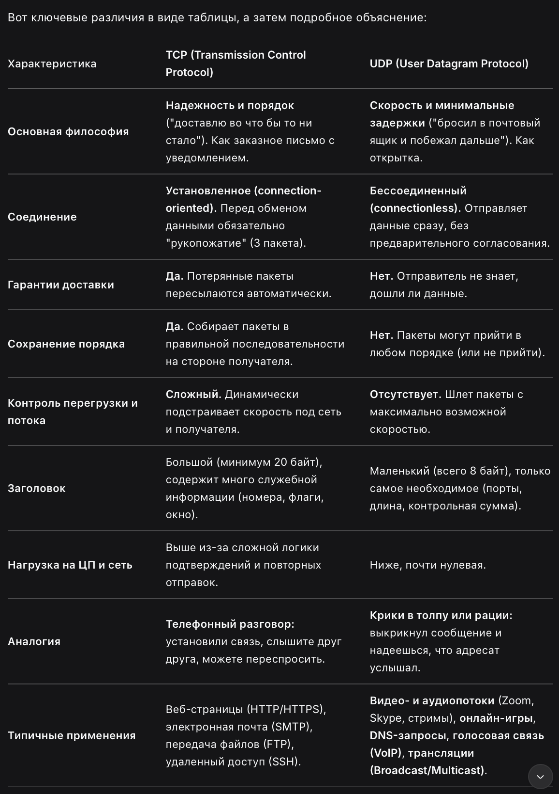
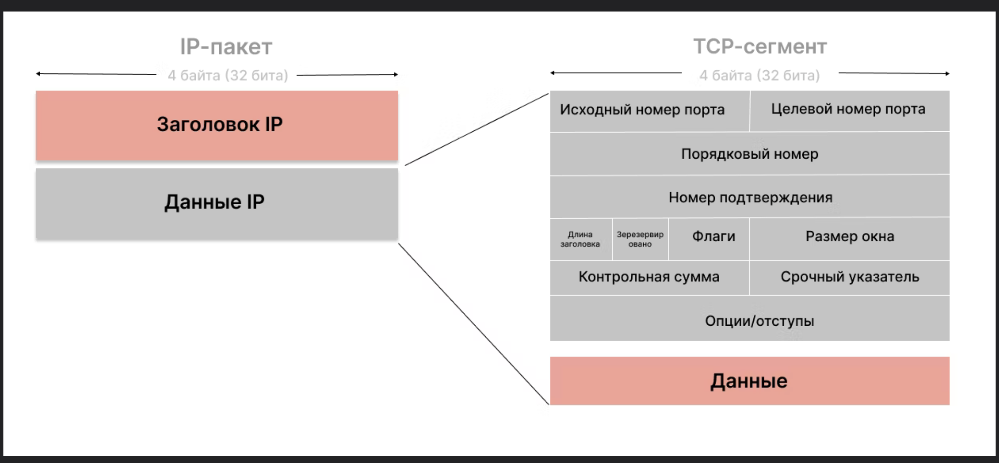
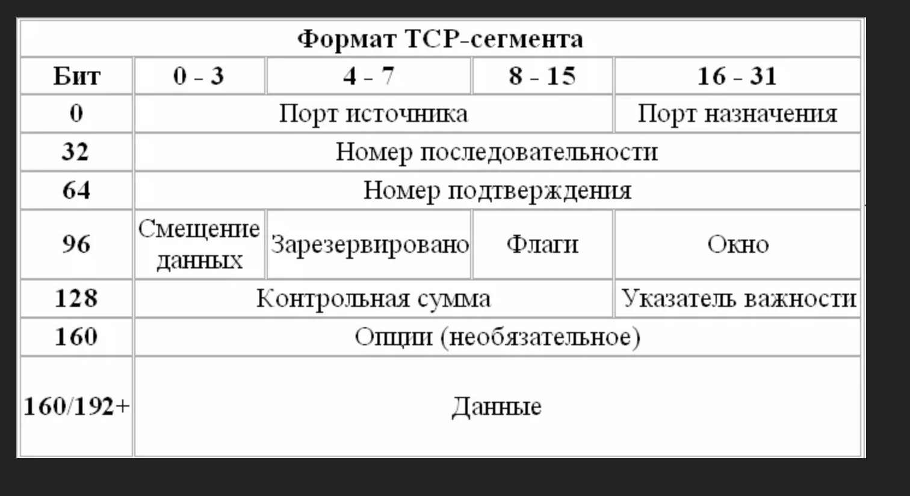

**протокол TCP**

-------
### Общее между TCP и UDP?

1. **Уровень стека:** Оба работают на **транспортном уровне** (4-й уровень OSI).
    
2. **Система портов:** Оба используют **номера портов** (от 1 до 65535), чтобы направлять данные конкретному приложению на компьютере. Это их главная задача — мультиплексирование.
    
3. **Работа поверх IP:** Оба полагаются на протокол IP (сетевой уровень) для маршрутизации пакетов по сети от одного IP-адреса к другому.
-----

**UDP** — это прямой аналог TCP

✅ TCP гарантирует, что файл скачан без ошибок.

Transmission Control Protocol — один из ключевых и наиболее распространенных протоколов, используемых для транспортировки информации в интернете. Он управляет передачей сведений таким образом, чтобы информация достигала получателя без потерь и в правильном порядке.

**TCP работает с сегментами (TCP segment)**.

**Сегмент (TCP segment)** — это единица данных на **транспортном уровне** (4-й уровень модели OSI). Это то, что создает сам протокол TCP. В него входят **ваши данные (полезная нагрузка)** и **TCP-заголовок** — служебная информация для управления соединением

- **Пакет (Packet)** или **датаграмма (IP datagram)** — это единица данных на **сетевом уровне** (3-й уровень). Когда TCP-сегмент передается вниз по стеку протоколов, он "оборачивается" в IP-пакет. К TCP-сегменту добавляется **IP-заголовок** (с адресами отправителя и получателя).

### Внутри TCP-пакета (сегмента):

Каждый TCP-сегмент состоит из двух частей:

**A. Заголовок (Header) - служебная информация (обычно 20 байт, может быть больше):**  
Это "мозг" операции. Ключевые поля:

- **Порты источника и назначения:** Определяют, каким именно программам на компьютерах предназначены данные (например, веб-браузеру на порту 80).
    
- **Порядковый номер (Sequence Number) и Номер подтверждения (Acknowledgment Number):** Обеспечивают **упорядочивание** пакетов и **подтверждение** их получения. Это основа надежности TCP.
    
- **Флаги (Flags):** Управляют соединением (например, `SYN` — начать соединение, `ACK` — подтверждение, `FIN` — завершить соединение, `RST` — аварийный сброс).
    
- **Окно (Window Size):** Сообщает, сколько данных готов принять получатель. Это механизм **управления потоком**, чтобы не "завалить" медленный компьютер данными.
----

# **Из каких компонентов состоит пакет протокола TCP**

Пакет протокола TCP, также известный как сегмент TCP, состоит из нескольких компонентов, каждый из которых играет важную роль в обеспечении надежной и упорядоченной передачи данных. Рассмотрим основные компоненты сегмента TCP:

**1. Порт отправителя (Source Port)**

Это 16-битное поле, которое указывает порт отправителя. Порты используются для идентификации конкретного приложения или процесса на устройстве отправителя.

**2. Порт получателя (Destination Port)**

Это 16-битное поле, которое указывает порт получателя. Порты используются для идентификации конкретного приложения или процесса на устройстве получателя.

**3. Номер последовательности (Sequence Number)** 

Это 32-битное поле, которое используется для упорядочивания сегментов данных. Номер последовательности указывает порядковый номер первого байта данных в сегменте.

**4. Номер подтверждения (Acknowledgment Number)** 

Это 32-битное поле, которое используется для подтверждения получения данных. Номер подтверждения указывает следующий ожидаемый номер последовательности, который получатель ожидает получить.

**5. Длина заголовка (Header Length)** 

Это 4-битное поле, также известное как Data Offset, которое указывает длину заголовка TCP в 32-битных словах. Это поле определяет, где заканчивается заголовок и начинаются данные.

**6. Резерв (Reserved)** 

Это 6-битное поле, которое зарезервировано для будущего использования и должно быть установлено в нуль.

**7. Флаги (Flags)** 

Это 6-битное поле, которое содержит различные флаги, используемые для управления соединением и передачей данных:

URG (Urgent): Указывает, что поле Urgent Pointer действительно.

ACK (Acknowledgment): Указывает, что поле Acknowledgment Number действительно.

PSH (Push): Указывает, что данные должны быть переданы получателю без буферизации.

RST (Reset): Указывает, что соединение должно быть сброшено.

SYN (Synchronize): Указывает, что соединение должно быть установлено.

FIN (Finish): Указывает, что отправитель завершил передачу данных.

**8. Размер окна (Window Size)** 

Это 16-битное поле, которое указывает количество байт, которые отправитель готов принять, начиная с номера подтверждения. Это поле используется для управления потоком данных.

**9. Контрольная сумма (Checksum)** 

Это 16-битное поле, которое используется для проверки целостности заголовка и данных. Контрольная сумма вычисляется на основе заголовка и данных сегмента.

**10. Указатель срочности (Urgent Pointer)** 

Это 16-битное поле, которое указывает смещение от номера последовательности до последнего срочного байта данных. Это поле действительно только в том случае, если флаг URG установлен.

**11. Опции (Options)** 

Это переменное поле, которое может содержать дополнительные параметры, такие как MSS (Maximum Segment Size), Window Scale и Timestamps. Длина этого поля должна быть кратна 32 битам.

**12. Данные (Data)** 

Это поле содержит полезную нагрузку, передаваемую между устройствами. Длина данных определяется длиной сегмента минус длина заголовка.

Пример структуры сегмента TCP

----------

    

**B. Данные (Payload):** Сама полезная информация, которую нужно передать (часть HTML-страницы, кусок файла, фрагмент сообщения).

# Для чего нужен TCP и его пакеты? Ключевые функции

1. **Установка соединения ("Рукопожатие" - Handshake):** Перед обменом данными клиент и сервер обмениваются тремя пакетами (`SYN`, `SYN-ACK`, `ACK`), чтобы договориться о начале общения. ("три рукопожатия")
    
2. **Надежная доставка:** Получатель подтверждает (`ACK`) каждый полученный пакет. Если отправитель не получил подтверждение, он отправляет пакет заново.
    
3. **Упорядочивание:** Каждому байту данных присваивается порядковый номер. Если пакеты пришли в неправильном порядке (что часто бывает в сетях), TCP на стороне получателя соберет их правильно.
    
4. **Управление потоком:** Предотвращает перегрузку получателя с помощью механизма "окна".
    
5. **Управление перегрузкой:** Адаптирует скорость отправки данных в зависимости от загруженности сети.

6. 

**Где применяется протокол TCP**

Этот протокол необходим там, где требуется передача информации с гарантированной доставкой. Также он незаменим при работе с данными, для которых будет особенно критичным нарушение целостности. Примеры таких форматов: фотографии, видеоролики, тексты.

1. Веб-браузеры

TCP широко используется в веб-браузерах для передачи данных по протоколу HTTP/[HTTPS](https://rt-solar.ru/products/solar_webproxy/blog/2675/). Каждый запрос веб-страницы или ресурса (например, изображения или видео) передается по TCP.

2. Электронная почта

Протоколы SMTP, IMAP и POP3, используемые для отправки и получения электронной почты, работают поверх TCP. Это обеспечивает надежную передачу писем и их содержимого.

3. Файловые передачи

Протоколы FTP и SFTP, используемые для передачи файлов между устройствами, также работают поверх TCP. Это гарантирует, что файлы будут переданы без ошибок и в правильном порядке.

4. Удаленный доступ

Протоколы SSH и Telnet, используемые для удаленного доступа к устройствам, работают поверх TCP. Это обеспечивает надежную передачу команд и данных между клиентом и сервером.

5. Стриминг и онлайн-игры

TCP используется в некоторых приложениях для стриминга и онлайн-игр, где важна надежность передачи данных. Однако для таких приложений чаще используется протокол UDP, который обеспечивает более низкую задержку, но меньшую надежность.

-----
https://rt-solar.ru/products/solar_webproxy/blog/5227/?ysclid=ml2l5a28nl912977184
# **Механизм создания соединения** 

Протокол TCP для создания стабильного соединения проходит трехступенчатое рукопожатие — Triple Handshake. Если оно пройдет успешно, информация сможет одновременно передаваться по двум каналам. Как происходит процесс:

- Клиент инициирует соединение, то есть отправляет сегмент данных с порядковым номером и флагом SYN. 
- Сервер отвечает сегментом с двумя флагами — SYN и ACK. Последний подтверждает, что отправленные инициатором данные были получены. При этом сервер увеличивает порядковый номер принятого сегмента на 1 и записывает это значение в поле номера подтверждения. И последний этап второй ступени рукопожатия — установка произвольного номера для ответного пакета. 
- После принятия клиентом фрагмента с SYN+ACK соединение считается установленным. Далее происходит отправка ответного сегмента с ACK и обновленными номерами. Этот пакет не несет смысловой нагрузки — он является проверочным. 

Обмен данными по протоколу TCP начинается только после окончания третьей ступени рукопожатия. Однако такая методика соединения используется не только для создания устойчивого соединения. Проверка порядковых номеров является еще и базовой фильтрацией DDoS-атак.

# **Роль TCP в кибербезопасности**

Когда речь идет о безопасности данных, важно понимать, что надежность и целостность передачи являются основными требованиями. Протокол TCP выполняет ключевую роль в защите данных от потерь и ошибок.

**1. Гарантированная доставка данных** 

Если данные передаются через TCP, вы можете быть уверены, что информация будет доставлена в полном объеме и в правильном порядке. Это особенно важно для систем, где потеря или искажение данных может привести к серьезным последствиям.

**2. Контроль целостности и ошибок** 

Ошибки в процессе передачи, такие как потеря пакетов или поврежденные данные, могут стать уязвимостью для атак. TCP эффективно решает эту проблему, обеспечивая исправление ошибок и повторную отправку поврежденных пакетов.

**3. Защита от атак** 

Протокол TCP помогает в защите от некоторых типов атак, например, "man-in-the-middle" (MITM), в которых злоумышленник пытается перехватить и изменить передаваемые данные. Несмотря на это, TCP сам по себе не защищает данные от шифрования или скрытого перехвата, для этого используются другие механизмы, такие как [SSL/TLS](https://rt-solar.ru/products/solar_webproxy/blog/3852/).
