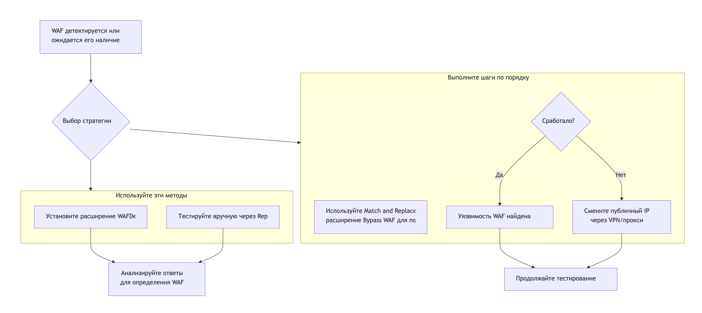

после обнаружения waf его можно пробовать обойти! 

1)  обфускация запросов
2)  подмена ip адресов  IP через **VPN** или **прокси-ротацию** 
     например **Утилиты (Mubeng)** (но использовать только проверенные адресса)
3)  подмена содержимого запросов

для подмены запросов в burp  есть инструмент **Match and Replace**
или плагин **Расширение "Bypass WAF"**

**Web Application Firewall (WAF)** — это специализированный межсетевой экран, который защищает веб-приложения, анализируя HTTP/HTTPS-трафик на 7-м (прикладном) уровне модели OSI. Если обычный фаервол проверяет IP-адреса и порты, то WAF «понимает» логику веб-запросов: смотрит на URL, параметры, заголовки и тело запроса.

|**Критерий**|**Обычный фаервол**|**WAF (Web Application Firewall)**|

|**Уровень защиты**|Сетевой (IP, порты)|**Прикладной (HTTP/HTTPS-запросы)**|

|**Что блокирует**|DDoS, сканирование портов|**SQL-инъекции, XSS, брутфорс**|

|**Где работает**|На сервере или маршрутизаторе|**Перед веб-сервером (как «щит» или обратный прокси)**|

|**Основная цель**|Защита сети|**Защита логики и данных конкретного приложения**|

### 🔍 Как WAF обнаруживает и блокирует атаки

WAF — это не одна функция, а система, которая проверяет трафик несколькими способами.

1. **Проверка по сигнатурам (правилам)**: Самый распространённый метод. WAF содержит базу известных шаблонов атак (регулярные выражения). Например, если в запросе найдется `' OR '1'='1`, он будет заблокирован. Эти правила часто основываются на списке OWASP Top 10 (основные угрозы, такие как инъекции и XSS).
    
2. **Поведенческий анализ (аномалии)**: Система изучает нормальное поведение пользователей и приложения. Если происходит что-то необычное (например, 1000 запросов в секунду с одного IP или странная последовательность действий), WAF может заблокировать такие запросы или потребовать CAPTCHA.
    
3. **Scorebuilding (балльная система)**: Каждое подозрительное событие (например, наличие кавычки или скрипта) добавляет «баллы риска». Если сумма превышает порог, запрос блокируется. Это уменьшает ложные срабатывания.
    
4. **Репутационный анализ**: WAF может использовать чёрные списки IP-адресов, известных из ботнетов, или блокировать запросы из сети Tor.
    
5. **Токенизация (для сложных атак)**: Специальные библиотеки (например, libinjection) разбивают запрос на логические токены (ключевые слова, строки, операторы) и ищут вредоносные комбинации. Это эффективно против замаскированных SQL-инъекций.
    

### 🚧 Основные техники обхода WAF (Bypass)

Именно здесь твой интерес к payload'ам становится ключевым. Вот основные приёмы:

|**Техника обхода**|**Суть метода**|**Конкретный пример (куда подставить)**|

|**Обфускация (запутывание)**|Разбиение ключевых слов, чтобы они не совпали с сигнатурой.|Вместо `UNION SELECT`использовать `UNI/**/ON SEL/**/ECT` или `U%0aNION%0dSELECT`.|

|**Кодирование символов**|Использование URL, Unicode или двойного кодирования.|`'` → `%27` → `%2527`; `<` → `%3C`→ `&lt;`.|

|**Использование альтернативного синтаксиса**|Замена операторов на логически эквивалентные.|`' OR '1'='1` → `' \| '1'='1`(для некоторых СУБД).|
|**Конкатенация строк**|Сборка команды из частей, особенно в командных инъекциях.|`/bin/cat /etc/passwd` → `/bi'n'/ca't' /e'tc'/pa'ss'wd`.|

|**Подмена HTTP-заголовков**|Изменение `User-Agent`, добавление заголовков `X-Forwarded-For` для маскировки под внутренний трафик.|`X-Forwarded-For: 127.0.0.1`.|

|**Понижение версии HTTP**|Иногда WAF для HTTP/1.1 строже, чем для HTTP/1.0.|Явное указание в запросе: `GET /test HTTP/1.0`.|

> ⚠️ **Важно**: Эти техники не гарантируют успех. Современные WAF, особенно использующие машинное обучение и поведенческий анализ, могут детектировать такие обходы.

### 🔬 Как обнаружить и протестировать WAF

1. **Обнаружение (Fingerprinting)**:
    
    - **Ответы сервера**: Отправь запрос с явной атакой (например, `'`). Если получишь страницу с ошибкой **не от самого приложения** (например, с названием WAF: `Cloudflare`, `ModSecurity`, `Sucuri`), WAF обнаружен.
        
    - **Заголовки ответов**: Ищи уникальные заголовки в ответе (например, `Server: cloudflare`, `X-WAF-Match`).
        
    - **Разница в кодах ответа**: Отправь два запроса — легитимный и с атакой. Если на атаку приходит `403`, `406` или кастомная страница, а на легитимный — `200`, это явный признак WAF.
        
    - **Инструменты**: `wafw00f`, `Nmap` (скрипт `http-waf-fingerprint`).
        
2. **Тестирование (в контексте пентеста)**:
    
    - **Разведка**: Сначала определи тип WAF и его поведение. Используй небольшие безобидные тесты (`'`, `..;/`).
        
    - **Фаззинг**: Методично подставляй payload'ы из своего списка в разные части запроса (параметры, заголовки `Cookie`, `User-Agent`), применяя техники обфускации.
        
    - **Анализ ответов**: Внимательно сравнивай ответы на обычные запросы и на фаззинг. Ищи малейшие различия в коде статуса, заголовках, времени ответа или тексте ошибки.
        
    - **Автоматизация с умом**: Такие инструменты, как `sqlmap`, имеют тамперы (`--tamper`), которые автоматически применяют техники обхода. Но ручное тестирование в Burp Suite Repeater часто эффективнее против сложных WAF.
        

### 💡 Ключевые выводы для практики

- **WAF — это щит, а не стена**. Он значительно усложняет эксплуатацию уязвимостей, но не делает приложение неуязвимым.
    
- **Главная цель WAF — защита от массовых и автоматизированных атак**. Опытный тестировщик, готовый потратить время на анализ и обфускацию, имеет высокие шансы на успех.
    
- **Тестирование против WAF — это игра в кошки-мышки**. Требует терпения, креативности и глубокого понимания как работы веб-приложений, так и методов фильтрации.
    

