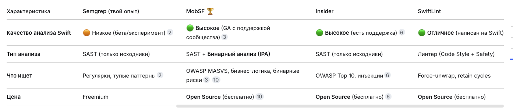
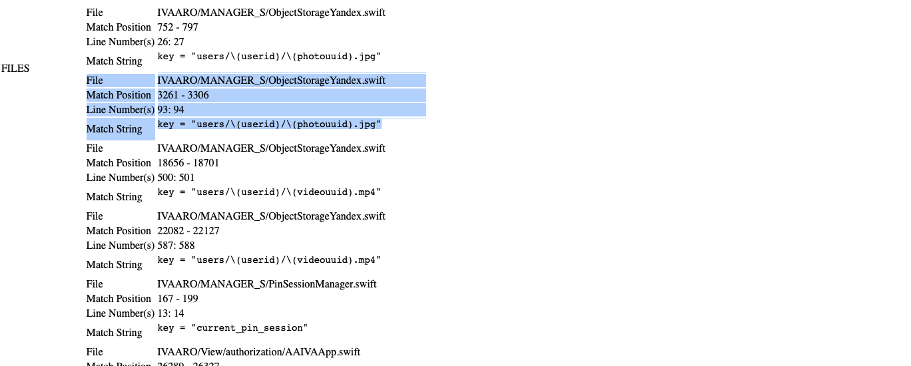

ios swift

1. **MobSF (Mobile Security Framework) - твой основной бро**
    
    - Самый авторитетный опенсорный инструмент по мобильной безопасности. Используется для статического и динамического анализа iOS и Android
      
    - Умеет анализировать как исходники (Swift/ObjC), так и готовый IPA-файл. Он как раз ищет те хардкорные штуки, которые ты упоминал: unsafe функции, слабые криптопримитивы, проблемы с URL Scheme, Pinning, бинарные проверки. Находит **реальные** уязвимости, в отличие от Semgrep
      
    - **Как вставить в пайплайн:** У MobSF есть готовый CLI-инструмент `mobsfscan` и REST API. Простейший запуск для исходников:

```yaml
- name: MobSF Scan
run: mobsfscan . --html -o report.html
```

----------------------------


----------

иду на свой сервер
```q
ssh -i /Users/evgeniy/Desktop/вирт\ МАШИНА/id_rsa-2 user1@87.242.86.39


# ставлю pip 
sudo apt install -y python3-pip

# ставлю mobsfscan глобально
sudo pip3 install mobsfscan

# првоерочка
mobsfscan --help


```

теперь сам пайплайн

```q
name: MobSF Security Scan

on:
  push:
    branches: [ main ]
  workflow_dispatch:

jobs:
  mobsf-scan:
    runs-on: self-hosted
    
    steps:
      - name: Checkout code
        uses: actions/checkout@v4
      
      - name: Run MobSF scan
        run: |
          echo "🔥 Running MobSF scan..."
          mobsfscan . --type ios --json -o results.json
          echo ""
          echo "=== RESULTS ==="
          cat results.json
```

запушил - все сработало . и на выводе в логах получил 24000 строк

слишком сложно там конечно вручную все проверять, или парсить самому не кайф тоже

```q
name: MobSF Security Scan

  

on:

  push:

    branches: [ main ]

  workflow_dispatch:

  

jobs:

  mobsf-scan:

    runs-on: self-hosted

    steps:

      - name: Checkout code

        uses: actions/checkout@v4

      - name: Run MobSF scan

        run: |

          echo "🔥 Running MobSF iOS security scan..."

          # JSON результат (для анализа)

          mobsfscan . --type ios --json -o results.json

          # HTML отчет (для людей)

          mobsfscan . --type ios --html -o report.html

          # Краткое резюме в логи (через grep, без Python)

          echo ""

          echo "========== QUICK SUMMARY =========="

          echo "Total issues found:"

          grep -E '"(ios_[a-z_]+)":' results.json | head -20 || echo "No issues parsed"

      - name: Upload reports

        uses: actions/upload-artifact@v4

        if: always()

        with:

          name: mobsf-reports

          path: |

            results.json

            report.html
```


запушил и пайплайн отработал успешно
(пока-что я здесь не настроил правила, при которых пайплайн должен выдать ошибку)


вот такие типы уязвимостей нашел сканер
```q
mobsfscan: v0.4.5 | Ajin Abraham | opensecurity.in

========== QUICK SUMMARY ==========
Total issues found:
    "ios_biometric_bool": {
    "ios_custom_keyboard_disabled": {
    "ios_detect_reversing": {
    "ios_hardcoded_secret": {
    "ios_insecure_random_no_generator": {
    "ios_keychain_weak_accessibility_value": {
    "ios_log": {
```

---

в результатах  24тыс строк но уже в html удобном формате вот так:



в скане есть главы - RULE ID
и под ними уже **`FILES`** - найденные "уязвимости"

например вот - кусок

```q


|🟢🟡 👉  🔴  RULE ID|ios_keychain_weak_accessibility_value|
|CWE|CWE-305: Authentication Bypass by Primary Weakness|

|MASVS|MSTG-AUTH-8|
|OWASP-MOBILE|M1: Improper Platform Usage|
|REFERENCE|https://github.com/MobSF/owasp-mstg/blob/master/Document/0x06f-Testing-Local-Authentication.md|

описание

|DESCRIPTION|A key stored in the Keychain is using a weak accessibility value. Use stronger ACLs like `kSecAttrAccessibleWhenPasscodeSetThisDeviceOnly/kSecAttrAccessibleWhenUnlocked/kSecAttrAccessibleAfterFirstUnlockThisDeviceOnly`.|
|SEVERITY|WARNING|

👉 уже уязвимости, что нашел сканер 


|FILES|\|   \|   \|<br>\|---\|---\|<br>\|File\|IVAARO/MANAGER_S/KeychainManager.swift\|<br>\|Match Position\|3594 - 3628\|<br>\|Line Number(s)\|116\|<br>\|Match String\|kSecAttrAccessibleAfterFirstUnlock\|<br>\|File\|IVAARO/MANAGER_S/KeychainManager.swift\|<br>\|Match Position\|5500 - 5534\|<br>\|Line Number(s)\|166\|<br>\|Match String\|kSecAttrAccessibleAfterFirstUnlock\||

--------------------------------------------
👉 ниже след правило


|🟢🟡 👉  🔴  RULE ID|ios_biometric_bool|
|CWE|CWE-303: Incorrect Implementation of Authentication Algorithm|

|MASVS|MSTG-AUTH-8|
|OWASP-MOBILE|M1: Improper Platform Usage|
|REFERENCE|https://github.com/MobSF/owasp-mstg/blob/master/Document/0x06f-Testing-Local-Authentication.md#local-authentication-framework|
|DESCRIPTION|Biometric authentication should be hardware and keychain backed, local authentication returns a boolean that can be bypassed by runtime instrumentation tools like Frida. This is not applicable if authentication data in keychain is protected with a biometric only access control.|

SEVERITY - ЭТ УРОВЕРЬ ОПАСНОСТИ!

|SEVERITY|WARNING|

👉 уже уязвимости, что нашел сканер 

|FILES|\|   \|   \|<br>\|---\|---\|<br>\|File\|IVAARO/View/searchScreen+chats/listAllMyChats.swift\|<br>\|Match Position\|6520 - 6546\|<br>\|Line Number(s)\|173\|<br>\|Match String\|.deviceOwnerAuthentication\|<br>\|File\|IVAARO/View/searchScreen+chats/listAllMyChats.swift\|<br>\|Match Position\|6705 - 6731\|<br>\|Line Number(s)\|176\|<br>\|Match String\|.deviceOwnerAuthentication\|<br>\|File\|IVAARO/View/searchScreen+chats/listAllMyChats.swift\|<br>\|Match Position\|6689 - 6705\|<br>\|Line Number(s)\|176\|<br>\|Match String\|.evaluatePolicy(\|<br>\|File\|IVAARO/View/searchScreen+chats/listAllMyChats.swift\|<br>\|Match Position\|6434 - 6444\|<br>\|Line Number(s)\|170\|<br>\|Match String\|LAContext(\||
```

SEVERITY - ЭТ УРОВЕРЬ ОПАСНОСТИ!

 соответственно можно настроить сканер так чтобы после получения файла сканирования при нахождении в нём высокого уровня опасности находок чтобы сканер падал, это будет минимальное ci/cd решение которое будет хоть как-то работать. Это для начала.

разбор этих двух мест

1. **ios_biometric_bool** - 4 места в listAllMyChats.swift (биометрия возвращает bool) - это можно легко подменить через frida или lldb
2. **ios_keychain_weak_accessibility** - 2 места в KeychainManager.swift (слабый уровень доступа) - там используется kSecAttrAccessibleAfterFirstUnlock - это значит - что данные в кейчейн сохранены не на самом максимальном уровне, вот тут я подробнее рассказывал про уровни кейчейн 👉 [[_R_проверка-целостности-файлов-и-кода(патч-ipa)]]
		безопасно так - kSecAttrAccessibleWhenPasscodeSetThisDeviceOnly или так kSecAttrAccessibleAfterFirstUnlockThisDeviceOnly
---------

далее - задача настроить так пайплайн - чтобы была проверка результатов выдачи сканера с фильтрацией по критичности, он нашел тут мне 8000 уязвимостей, многие из них повторяются! и нужно придумать то, как это систематизировать, и чтобы тест падал при нахождении реальных уязвимостей!

например ,  |SEVERITY|INFO|  - можно обращать меньше внимания
и вручную проверять переодически все значения, а также можно написать скрипт, чтобы дополнительно проверял инфо срабатывания

например,  MobSF помечает все `print()` что есть в коде, как потенциальную проблему (INFO уровень)

на самом деле по всем результатам - я вижу что 98% текущей выдачи уязвимостей от MobSF это уровень INFO!

и в остальном

WARNING  -  MSTG-CRYPTO-6  =  2 уязвимости
WARNING  -  MSTG-STORAGE-14 = 14 уязвимосей
WARNING  -  MSTG-AUTH-8  =  2 уязвимости
WARNING  -  MSTG-AUTH-8 biometric  =  4 уязвимости
WARNING  -  MSTG-CRYPTO-6  =  2 уязвимости


-------


можно попробовать  сделать так,чтобы при WARNING - падал пайплайн


создал в корне проекта файл
 `parse_mobsf.py`

```python
#!/usr/bin/env python3
import json
import sys

def main():
    try:
        with open('results.json', 'r') as f:
            data = json.load(f)
    except FileNotFoundError:
        print("❌ results.json not found!")
        sys.exit(1)
    except json.JSONDecodeError as e:
        print(f"❌ JSON parsing error: {e}")
        sys.exit(1)
    
    results = data.get('results', {})
    warnings = []
    
    print("\n🔍 Анализ найденных уязвимостей:\n")
    print("┌─────────────────────────────────────────────────────────────────┐")
    print("│ WARNING (Критичные)                                             │")
    print("├─────────────────────────────────────────────────────────────────┤")
    
    for rule_name, rule_data in results.items():
        severity = rule_data.get('metadata', {}).get('severity', 'UNKNOWN')
        
        if severity == 'WARNING':
            description = rule_data.get('metadata', {}).get('description', 'No description')
            files = rule_data.get('files', [])
            
            print(f"│")
            print(f"│ ⚠️  [{severity}] {rule_name}")
            print(f"│    📝 {description[:70]}...")
            print(f"│    📁 Найдено в {len(files)} файлах:")
            
            for f in files[:3]:
                file_path = f.get('file_path', 'unknown')
                line_num = f.get('line_number', '?')
                print(f"│       - {file_path}:{line_num}")
            
            if len(files) > 3:
                print(f"│       ... и еще {len(files) - 3} мест")
            print(f"│")
            warnings.append(rule_name)
    
    print("└─────────────────────────────────────────────────────────────────┘")
    
    print(f"\n📊 Статистика:")
    print(f"   🔴 WARNING уязвимостей: {len(warnings)}")
    print(f"   🟢 INFO уязвимостей: {len(results) - len(warnings)}")
    
    if len(warnings) > 0:
        print(f"\n❌❌❌ ПАЙПЛАЙН УПАЛ! Найдены реальные уязвимости уровня WARNING!")
        print(f"📋 Список проблем: {', '.join(warnings)}")
        sys.exit(1)
    else:
        print("\n✅ ПАЙПЛАЙН ПРОШЕЛ! Критичных уязвимостей не найдено.")
        sys.exit(0)

if __name__ == '__main__':
    main()
```


----------

и сам файл  `mobsf.yml`

```c
name: MobSF Security Scan

on:
  push:
    branches: [ main ]
  pull_request:
    branches: [ main ]
  workflow_dispatch:

jobs:
  mobsf-scan:
    runs-on: self-hosted
    
    steps:
      - name: Checkout code
        uses: actions/checkout@v4
      
      - name: Run MobSF scan
        run: |
          echo "🔥 Running MobSF iOS security scan..."
          
          mobsfscan . --type ios --json -o results.json
          mobsfscan . --type ios --html -o report.html
          
          echo ""
          echo "========== PARSING RESULTS =========="
          
          python3 parse_mobsf.py
      
      - name: Upload reports
        uses: actions/upload-artifact@v4
        if: always()
        with:
          name: mobsf-reports
          path: |
            results.json
            report.html
```


-----

пушу - пайпалйн работает - вижу сперва логи в самом github actions

```js
Run echo "🔥 Running MobSF iOS security scan..."
🔥 Running MobSF iOS security scan...
/usr/lib/python3/dist-packages/requests/__init__.py:87: RequestsDependencyWarning: urllib3 (2.7.0) or chardet (4.0.0) doesn't match a supported version!
  warnings.warn("urllib3 ({}) or chardet ({}) doesn't match a supported "
/usr/lib/python3/dist-packages/requests/__init__.py:87: RequestsDependencyWarning: urllib3 (2.7.0) or chardet (4.0.0) doesn't match a supported version!
  warnings.warn("urllib3 ({}) or chardet ({}) doesn't match a supported "
- Pattern Match  0
- Pattern Match  1
- Pattern Match  2
- Pattern Match  3
- Pattern Match █ 4
И так далее
- Pattern Match ███████████████████████████████████████████████████████████ 180
- Pattern Match ███████████████████████████████████████████████████████████ 181
- Pattern Match ████████████████████████████████████████████████████████████ 182

mobsfscan: v0.4.5 | Ajin Abraham | opensecurity.in

========== PARSING RESULTS ==========

🔍 Анализ найденных уязвимостей:

┌─────────────────────────────────────────────────────────────────┐
│ WARNING (Критичные)                                             │
├─────────────────────────────────────────────────────────────────┤
│
Warning: RNING] ios_biometric_bool
│    📝 Biometric authentication should be hardware and keychain backed, local...
│    📁 Найдено в 4 файлах:
│       - IVAARO/View/searchScreen+chats/listAllMyChats.swift:?
│       - IVAARO/View/searchScreen+chats/listAllMyChats.swift:?
│       - IVAARO/View/searchScreen+chats/listAllMyChats.swift:?
│       ... и еще 1 мест
│
│
Warning: RNING] ios_hardcoded_secret
│    📝 Files may contain hardcoded sensitive information like usernames, pass...
│    📁 Найдено в 14 файлах:
│       - IVAARO/MANAGER_S/ObjectStorageYandex.swift:?
│       - IVAARO/MANAGER_S/ObjectStorageYandex.swift:?
│       - IVAARO/MANAGER_S/ObjectStorageYandex.swift:?
│       ... и еще 11 мест
│
│
Warning: RNING] ios_insecure_random_no_generator
│    📝 The App uses an insecure Random Number Generator....
│    📁 Найдено в 2 файлах:
│       - IVAARO/View/searchScreen+chats/chats.swift:?
│       - IVAARO/View/searchScreen+chats/chats.swift:?
│
│
Warning: RNING] ios_keychain_weak_accessibility_value
│    📝 A key stored in the Keychain is using a weak accessibility value. Use ...
│    📁 Найдено в 2 файлах:
│       - IVAARO/MANAGER_S/KeychainManager.swift:?
│       - IVAARO/MANAGER_S/KeychainManager.swift:?
│
└─────────────────────────────────────────────────────────────────┘

📊 Статистика:
   🔴 WARNING уязвимостей: 4
   🟢 INFO уязвимостей: 3

❌❌❌ ПАЙПЛАЙН УПАЛ! Найдены реальные уязвимости уровня WARNING!
📋 Список проблем: ios_biometric_bool, ios_hardcoded_secret, ios_insecure_random_no_generator, ios_keychain_weak_accessibility_value
Error: Process completed with exit code 1.

```

по сути - теперь вижу не так уж и много уязвимостей

и их можно пофиксить
ios_biometric_bool - не так сложно исправить

ios_hardcoded_secret - нужно проверить и тоже пофиксить, либо если нужно, добавить как исключение

ios_insecure_random_no_generator - это скорее всего отвечает за фигню какую-нибудь , поэтому как исключение можно внести конкретные случаи или пофиксить с помощью того же  CryptoKit

ios_keychain_weak_accessibility_value - пофиксить по сути легко, только проверить то, не будет ли ломать логику приложения, мало ли, там используется кейчейн при работе в бекграунде


