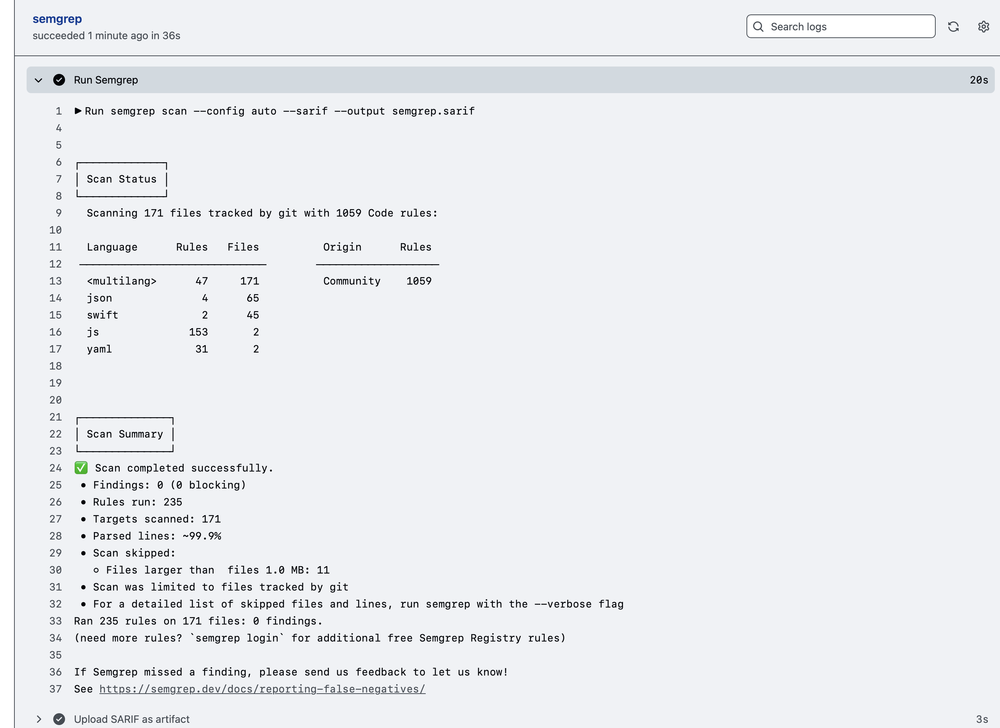
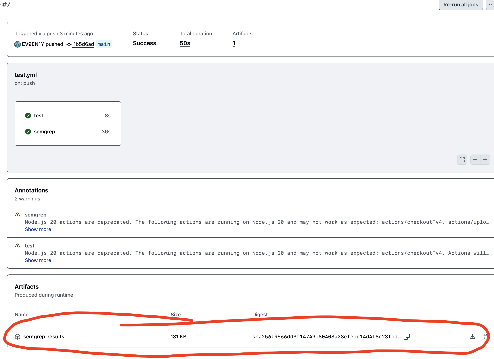
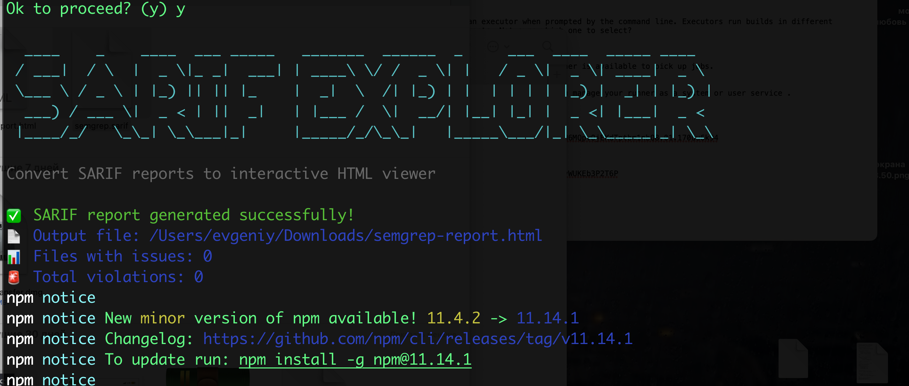
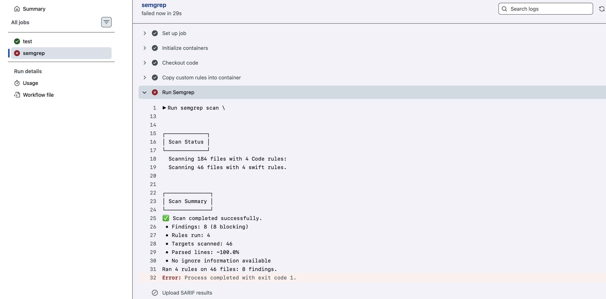

внедряю semgrep в пайплайн 

✅  (настроил несколько правил для semgrep для ios кода и понял, что semgrep не совсем подходит для этих задач + ко всему - полноценно эксплуатировал свою цепочку ci/cd и запуск пайплайнов)

-------
В одном `.yml` файле - один workflow (один `name:` и один `on:`)
пример pipeline_(workflow)
а воот job и шагов может быть сколь угодно

```q
name: Мой пайплайн            # Название workflow

on: push                     # Триггер: при пуше

jobs-1000:                        # Список заданий

  test-job:                  # Одно задание
  
    runs-on: self-hosted     # Раннер
    
    steps:                   # Шаги внутри задания
    
      - name: Checkout       # Шаг 1
        uses: actions/checkout@v4
        
      - name: Run script     # Шаг 2
        run: echo "Hello"
        
        
jobs-2000:                        # Список заданий

  test-job:                  # Одно задание
  
    runs-on: self-hosted     # Раннер
    
    steps:                   # Шаги внутри задания
    
      - name: Checkout       # Шаг 1
        uses: actions/checkout@v4
        
      - name: Run script     # Шаг 2
        run: echo "Hello"
        
        
```

либо можно создавать несколько файлов типа .yml

вот так

```q
.github/workflows/
├── test.yml          # один пайплайн (например, тестовый)
├── sast.yml          # другой пайплайн (например, Semgrep)
├── swiftlint.yml     # третий пайплайн (SwiftLint)
└── mobsf.yml         # четвёртый (MobSF)
```
и тогда последовательно будет выполняться каждый **workflow**
то есть в .github/workflows/ может быть 

---------


итак, для теста - запущу пайплайн - при котором установится и запустится Semgrep - и тупо выполнит базовую проверку всего, и будет штук 300 наверно срабатываний

```json
name: CI/CD Security Pipeline

on:
  push:
    branches: [ main ]
  pull_request:
    branches: [ main ]

permissions:
  contents: read
  security-events: write

jobs:

  test:
    runs-on: self-hosted
    steps:
      - name: Checkout code
        uses: actions/checkout@v4
      - name: Say hello
        run: echo "Hello from Cloud.ru server!"

  semgrep:
    runs-on: self-hosted
    container:
      image: semgrep/semgrep
    steps:
      - name: Checkout code
        uses: actions/checkout@v4
      - name: Run Semgrep
        run: semgrep scan --config auto --sarif --output semgrep.sarif
      - name: Upload results to GitHub Security tab
        uses: github/codeql-action/upload-sarif@v3
        with:
          sarif_file: semgrep.sarif
```

запушил этот файл
git add .github/workflows/test.yml
git commit -m "Add Semgrep SAST to pipeline"
git push origin main


и так как это первый запуск semgrep - то нужно подождать , пока ранер скачает его впервые на сервер, потом ждать придется меньше

прошло 2 минуты

результаты 

test - выполнился
semgrep  - выдал фейл  - говорит, что  `PAT_TOKEN` не добавлен в GitHub Secrets
добавлю и повторю

**Settings** → **Secrets and variables** → **Actions** →  **New repository secret**
имя указываю PAT_TOKEN

а ниже нужно добавить Personal Access Token (его можно в настройках создать)
вот так создается  Personal Access Token
профиль →  **Settings** (твой аватар) → **Developer settings** → **Personal access tokens** → **Tokens (classic)**  →    **Generate new token (classic)**  назову его *semgrep-upload* и полные права ему **`repo`** - хотя достаточно будет только `security_events`

этот токен Personal Access Token добавляю в поле где создаю Actions secrets для PAT_TOKEN

перезапустил - и новая ошибка - говорит - что нужно настроить ### Code Scanning
иду сюда - **Settings** → **Code security and analysis**   → **Code scanning**

короче... Code scanning - это платная шняга , и работает только при подключении платного тарифа  **GitHub Advanced Security**

но, есть и хороший момент, для публичных репозиториев - все должно быть бесплатно!

либо можно сделать так: в файле .yml - name: Upload SARIF as artifact
и тогда , по идее - получиться в виде файла скачивать результаты тестов

вот так в итоге выглядит сейчас мой .yml

таймаут поставил 30 сек (тестово) , но по умолчанию 5 сек
это время на 1 файл на 1 правило
```json
name: CI/CD Security Pipeline

  

**on**:

  push:

    branches: [ main ]

  pull_request:

    branches: [ main ]

  

jobs:

  

  test:

    runs-**on**: self-hosted

    steps:

      - name: Checkout code

        uses: actions/checkout@v4

      - name: Say hello

        run: echo "Hello from Cloud.ru server!"

  

  semgrep:

    runs-**on**: self-hosted

    container:

      image: semgrep/semgrep

    steps:

      - name: Checkout code

        uses: actions/checkout@v4

      - name: Run Semgrep with full logging

        env:

              SEMGREP_TIMEOUT: "30"

        run: |

          semgrep scan \

            --config auto \

            --config p/swift \

            --sarif \

            --output semgrep.sarif \

            --verbose \

            --max-target-bytes 0 \

            --no-git-ignore \

            2>&1 | tee semgrep-full.log

      - name: Upload SARIF results

        uses: actions/upload-artifact@v4

        with:

          name: semgrep-results

          path: semgrep.sarif

      - name: Upload full scan log

        uses: actions/upload-artifact@v4

        with:

          name: semgrep-full-log

          path: semgrep-full.log
```
// как артефакт сохраняю результаты

перезапускаю -пушу файл

и вуаля! все работает! 
✅  semgrep отработал!!!




вот здесь можно выгрузить результаты





там такой файл semgrep.sarif - но там сейчас пусто - так как semgrep не нашел уязвимостей 

а сам файл *.sarif* можно легко переделать в читаемый html c помощью *sarif-explorer*
```shell
npx sarif-explorer@latest --input ~/Downloads/semgrep.sarif --output ~/Downloads/semgrep-report.html
```



и там же появился файлик html - который красиво открывается в браузерах!

-------

также можно добавить в .yml
```q
- name: Run Semgrep
  run: semgrep scan --config auto --sarif --output semgrep.sarif --verbose
``` 
чтобы видеть - какие файлы сканировал Semgrep


вот отчет и есть проблемы - он не нашел уязвимостей + ко всему - он пропустил некоторые файлы вообще - не смог их обработать!
хотя он использовал кучу правил!!!

```
running 1059 rules from 2 configs
Rules:
<SKIPPED DATA (too many entries; use --max-log-list-entries)>
               
               
┌─────────────┐
│ Scan Status │
└─────────────┘
  Scanning 183 files with 1059 Code rules:
                                                                                                                        
  Language      Rules   Files          Origin      Rules                                                                
 ─────────────────────────────        ───────────────────                                                               
  <multilang>      47     183          Community    1059                                                                
  json              4      65                                                                                           
  swift             2      46                                                                                           
  js              153       2                                                                                           
  yaml             31       2                                                                                           
                                                                                                                        
SCA findings adjustment: No SCA rules to adjust

========================================
Files skipped:
========================================

  Always skipped by Semgrep:

   • <none>

  Skipped by .gitignore:
  (Disabled with --no-git-ignore)

   • <none>

  Skipped by .semgrepignore:
  - https://semgrep.dev/docs/ignoring-files-folders-code/#understand-semgrep-defaults

   • <none>

  Skipped by --include patterns:

   • <none>

  Skipped by --exclude patterns:

   • <none>

  Files that couldn't be accessed:

   • <none>

  Skipped by limiting to files smaller than 0 bytes:
  (Adjust with the --max-target-bytes flag)

   • <none>

  ❌❌❌☠️👉Partially analyzed due to parsing or internal Semgrep errors

   •❌❌ IVAARO/View/FirstScrin/FirstScrin.swift (1 rule failed to run)

     The following 1 rule failed to run on this file:

     • Rule swift.lang.storage.sensitive-storage-userdefaults.swift-user-defaults due to exception "Timeout" raised
       during analysis

   •❌❌ IVAARO/View/SettingScreen/SettingScreen.swift (~0.5% of lines always skipped)

     The following lines were skipped for all analysis:

     • lines 855-860 due to exception "PartialParsing" raised during analysis

                
                
┌──────────────┐
│ Scan Summary │
└──────────────┘
✅ Scan completed successfully.
 • Findings: 0 (0 blocking)
 • Rules run: 235
 • Targets scanned: 183
 • Parsed lines: ~99.9%
 • No ignore information available
Ran 235 rules on 183 files: 0 findings.
(need more rules? `semgrep login` for additional free Semgrep Registry rules)

If Semgrep missed a finding, please send us feedback to let us know!
See https://semgrep.dev/docs/reporting-false-negatives/
Sending pseudonymous metrics since metrics are configured to AUTO, registry usage is True, and login status is False

```

я точно знаю, что в коде есть хардкод ключи, но semgrep в моих руках сейчас не смог найти ничего , что ну очень странно...

короче, дипсик мне сказал, что в офиц документации Semgrep пишут, что Semgrep пока что только в тестовом режиме работает со swift... 

------

### пробую добавить кастомные правила в Semgrep 

добавил папку в корень проекта(рядом с папкой .github) .semgrep/rules
и в нее добавил папку rules с правилами
внутри этой папки файл hardcoded-keys.yml

вот он
```q
rules:

  - id: yandex-api-key-pattern

    pattern-regex: "[a-f0-9]{32}"

    message: "Обнаружена строка, похожая на API-ключ (32 hex символа)"

    languages:

      - swift

    severity: WARNING

  

  - id: large-byte-array

    pattern-regex: "\\[[0-9]{2,3}(,\\s*[0-9]{2,3}){8,}\\]"

    message: "Обнаружен массив целых чисел, похожий на обфусцированные строки"

    languages:

      - swift

    severity: WARNING

    metadata:

      description: "Возможно, это обфусцированные URL, ключи или шелл-код. Проверь вручную"
```

внес этот файл в пайплайн

```q
name: CI/CD Security Pipeline

on:
  push:
    branches: [ main ]
  pull_request:
    branches: [ main ]

jobs:

  test:
    runs-on: self-hosted
    steps:
      - name: Checkout code
        uses: actions/checkout@v4
      - name: Say hello
        run: echo "Hello from Cloud.ru server!"

  semgrep:
    runs-on: self-hosted
    container:
      image: semgrep/semgrep
    steps:
      - name: Checkout code
        uses: actions/checkout@v4
      - name: Copy custom rules into container
        run: |
          mkdir -p /semgrep-rules
          cp -r .semgrep/rules/* /semgrep-rules/
      - name: Run Semgrep
        env:
          SEMGREP_TIMEOUT: "30"
        run: |
          semgrep scan \
            --config p/swift \
            --config /semgrep-rules \
            --sarif \
            --output semgrep.sarif \
            --max-target-bytes 0 \
            --no-git-ignore
      - name: Upload SARIF results
        uses: actions/upload-artifact@v4
        with:
          name: semgrep-results
          path: semgrep.sarif
```


запушил - смотрю результаты!

и он нашел 8 подозрительных вещей в коде:
```
┌──────────────┐
│ Scan Summary │
└──────────────┘
✅ Scan completed successfully.
• Findings: 8 (8 blocking)
• Rules run: 237
• Targets scanned: 185
• Parsed lines: ~99.9%
• No ignore information available
Ran 237 rules on 185 files: 8 findings.

```

и вот, что нашли мои кастом правила:


```json
"locations": [
            {
              "physicalLocation": {
                "artifactLocation": {
                  "uri": "IVAARO/View/authorization/AAIVAApp.swift",
                  "uriBaseId": "%SRCROOT%"
                },
                "region": {
                  "endColumn": 245,
                  "endLine": 28,
                  "snippet": {
                    "text": "    let g000: [UInt8] = [232, 158, 128, 199, 219, 241, 156, 197, 200, 253, 193, 230, 147, 242, 154, 238, 157, 201, 128, 207, 237, 255, 255, 153, 195, 210, 195, 232, 204, 220, 228, 211, 249, 199, 229, 146, 157, 253, 232, 194, 225, 198, 250, 150]"
                  },
                  "startColumn": 25,
                  "startLine": 28
                }
              }
            }
          ],
          "message": {
            "text": "Обнаружен массив целых чисел, похожий на обфусцированные строки"
          },
          
          это не сильно критично, это всего лишь шифрованные url адреса url эндпоинтов через XOR-дешифрование
          а также шифрованные публичные ключи от сертификатов для ssl pinning
          по сути , если бинарник не шифрованный, и его реверсить , то прямым запросом не получиться найти это, но все равно можно будет найти функцию которая дешифрует этот код и взять от туда ключ шифрования, если он конечно, не в кейчейн, но и сам кейчен можно дампануть легко, я это уже делал в файле [[keychain_dumper]]
          
          и таких массивов несколько штук нашел он!!!
          
          
          ----------------
          
 "locations": [
            {
              "physicalLocation": {
                "artifactLocation": {
                  "uri": "IVAARO/View/authorization/AAIVAApp.swift",
                  "uriBaseId": "%SRCROOT%"
                },
                "region": {
                  "endColumn": 56,
                  "endLine": 123,
                  "snippet": {
                    "text": "                with: \"547835fe6e9d44ea3a6e938944d1482d\","
                  },
                  "startColumn": 24,
                  "startLine": 123
                }
              }
            }
          ],
          "message": {
            "text": "Обнаружена строка, похожая на API-ключ (32 hex символа)"

а это уже серьзная уязвимость!!
это же захардкоженный ключ от YandexLoginSDK.shared.activate!!!
(я открыл xcode и убедился в этом!)
            
```


------
#### таким образом, можно добавлять кастомные различные правила, которые бы могли находить нужные уязвимости!

-----------

#### чтобы пайплайн падал - можно сделать так:
#### ++ сделать так, чтобы точное совпадение строк - считалось исключением:

```q
rules:
  - id: yandex-api-key-pattern
    pattern-regex: "[a-f0-9]{32}"
    pattern-not: "547835fe6e9d44ea3a6e938944d1482d"   # ← исключить этот конкретный ключ
    message: "Обнаружена строка, похожая на API-ключ (32 hex символа)"
    languages:
      - swift
    severity: ERROR

  - id: large-byte-array
    pattern-regex: "\\[[0-9]{2,3}(,\\s*[0-9]{2,3}){8,}\\]"
    message: "Обнаружен массив целых чисел, похожий на обфусцированные строки"
    languages:
      - swift
    severity: ERROR
```


и главный файл с добавлением --error + логи ошибки из-за которой упадет
```q
name: CI/CD Security Pipeline

on:
  push:
    branches: [ main ]
  pull_request:
    branches: [ main ]

jobs:

  test:
    runs-on: self-hosted
    steps:
      - name: Checkout code
        uses: actions/checkout@v4
      - name: Say hello
        run: echo "Hello from Cloud.ru server!"

  semgrep:
    runs-on: self-hosted
    container:
      image: semgrep/semgrep
    steps:
      - name: Checkout code
        uses: actions/checkout@v4
      - name: Copy custom rules into container
        run: |
          mkdir -p /semgrep-rules
          cp -r .semgrep/rules/* /semgrep-rules/
      - name: Run Semgrep
        env:
          SEMGREP_TIMEOUT: "30"
        run: |
          semgrep scan \
            --config /semgrep-rules \
            --error \
            --text \
            --verbose \
            --output semgrep.txt \
            --max-target-bytes 0 \
            --no-git-ignore
          
          echo "==== SEMGREP RESULTS ===="
          cat semgrep.txt
          echo "==== END OF RESULTS ===="
          
          semgrep scan \
            --config /semgrep-rules \
            --error \
            --sarif \
            --output semgrep.sarif \
            --max-target-bytes 0 \
            --no-git-ignore
      - name: Upload SARIF results
        uses: actions/upload-artifact@v4
        with:
          name: semgrep-results
          path: semgrep.sarif
```
пробую запустить снова

результаты  - semgrep тест УПАЛ как и должен был упасть!




отлично semgrep упал ! но причину мне не говорит
я даже сделал так его блок - но все равно - он не показывает мне причину...

```q
      - name: Run Semgrep

        env:

          SEMGREP_TIMEOUT: "30"

        run: |

          semgrep scan \

            --config /semgrep-rules \

            --error \

            --sarif \

            --output semgrep.sarif \

            --max-target-bytes 0 \

            --no-git-ignore

          # Показываем результаты прямо из SARIF-файла вручную

          echo "==== VULNERABILITIES FOUND ===="

          cat semgrep.sarif | grep -E '"ruleId"|"uri"|"startLine"|"text"' | head -50

          echo "==== END OF RESULTS ===="

          # Проверяем, есть ли уязвимости

          if grep -q '"ruleId"' semgrep.sarif; then

            echo "❌ Security issues found! Failing the build."

            exit 1

          else

            echo "✅ No security issues found"

          fi
```


--------------

### вывод

короче, со swift  - это какая дичь получается с semgrep , он все таки работает нормально с Python, JS, Go, Java 
для swift все таки нужно использовать **grep** **MobSF** **SwiftLint** **SonarQube с плагином Swift** и другие анализаторы