CI-CD_pipeline_GitHub+GitLab--Actions+Self-Hosted
### здесь я создам на вирт машине необходимое окружение и полностью с нуля настрою ci-cd для gitlab и gthub + выполню первый пайплан-тест!!!!!

++ ЗАЩИТА Self СЕРВЕРА И ПАЙПЛАЙНА!

(сразу скажу, что с gitlab - все получилось - но в конце он перестал работать из-за санкций, а вот с github получись все на 100%, поэтому, этап с gitlab можно пропустить, )

тестить буду свое приложение в итоге [[0_MeetWay]]

https://cloud.ru  - буду использовать бесплатный тариф ( Ubuntu 22.04  2 CPU, 4 GB RAM, 30 GB)

#### цель:

-- настройка паплайнов с SAST (и других анализаторов (MobSF, Semgrep) ) в рамках CI/CD на удаленном  self-hosted с раннером (gitlab-runner), с докер контейнером (Docker executor) который будет создаваться каждый раз для выполнения очередной задачи + управлять всем этим будет GitLab actions , + нужно будет настроитьт сервер таким образом - чтобы это было безопасно в рамках корпоративной разработки! 
(Docker executor в не-привилегированном режиме)
(Runner нужно залочить за конкретным проектом, выполнение заданий без тегов будет отключено. Сервер будет защищён файрволом и настройками systemd)


Принцип работы:

- *GitHub/GitLab* - «пульт управления»: хранит код, запускает пайплайны, раздаёт задания
   
- *Self‑hosted runner на сервере* - «исполнитель»: забирает задания, запускает их визолированной среде, возвращает результаты
   
- Ключевой момент: runner не выполняет код напрямую, а создаёт «песочницу» (контейнер) для каждого задания
#### план

1) нужен сервер (использую cloud.ru - для старта норм)
2) буду использовать GitLab actions


---------

## приступаю к реализации

🟢  зарегал машину и оплатил ip на https://cloud.ru для вм
 ( Ubuntu 22.04  2 CPU, 4 GB RAM, 30 GB)

при создании машины получил приват кей
сохранил его 

теперь нужно ему дать права (только владелец, чтение/запись)

```shell
chmod 600 /Users/evgeniy/Desktop/вирт\ МАШИНА/id_rsa-2
```

-----

подрубаюсь к серверу

```shell
ssh -i /Users/evgeniy/Desktop/вирт\ МАШИНА/id_rsa-2 логинМашины@77.777.77.77
```


-------

обновляю пакеты и ставлю докер

```shell
sudo apt update && sudo apt install -y docker.io

----------------------

после установки - перезапуск

sudo reboot
```

затем снова подключаюсь

проверю что докер жив и стоит

```shell
sudo docker --version

у меня так 
Docker version 29.1.3, build 29.1.3-0ubuntu3~22.04.1
```

теперь нужно настроить управление контейнерами, чтобы текущий пользователь мог запускать докер команды без sudo
нужно добавить в группу `docker` текущего пользователя user1 , чтобы управлять контейнерами от своего имени (у меня по умолчанию стоит  user1)

```shell
sudo usermod -aG docker $USER
```

теперь нужно выйти и зайти снова
```shell
exit

ssh -i /Users/evgeniy/Desktop/вирт\ МАШИНА/id_rsa-2 user1@66.666.66.66
```


чтобы понять, работает ли все как нужно

докер запускаю без судо

```shell
docker --version

# работает, ОТЛИЧНО


# --------------------

#проверю, что можно запускать контейнеры

docker run hello-world

```

все отлично

он не нашел готовый образ
Unable to find image 'hello-world:latest' locally

и как следует - скачал его из Docker Hub 
Pulling from library/hello-world

контейнер запустился и выполнил вывод принта и закрылся

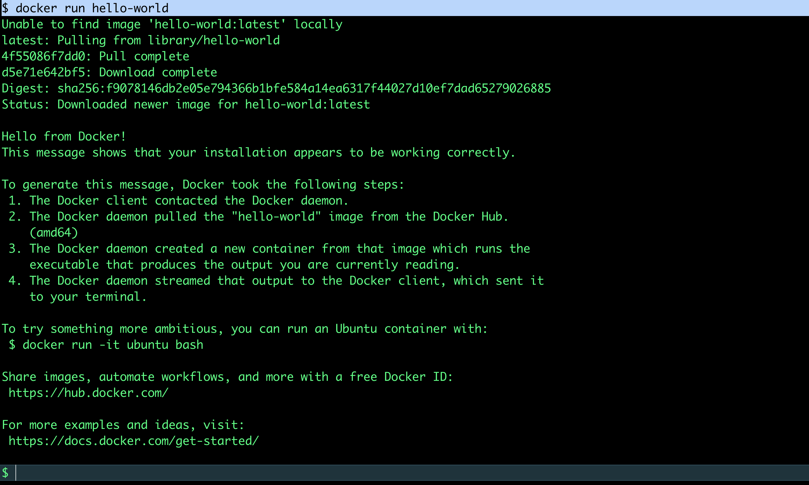


--------


###### тперь нужно ставить   GitLab Runner 

```shell
curl -L "https://packages.gitlab.com/install/repositories/runner/gitlab-runner/script.deb.sh" | sudo bash

----------

скрипт добавляет официальный репозиторий GitLab Runner в систему и устанавливает его
После этого можно будет установить сам пакет gitlab-runner
```

теперь нужно установить сам GitLab Runner - это та самая прога которая будет забирать задания из GitLab и выполнять их в Docker-контейнерах

```shell
sudo apt install -y gitlab-runner

встала версия  18.11.2 - ОТЛИЧНО!

```

теперь нужно привязать этот ранер к самому GITlab (всмысле - в браузере зайти и получить токен для CI/CD → Runners)

иду на https://gitlab.com/...
настройки - > CI/CD -> runners -> создать новый раннер

вот так настраиваю
(делаю ранер этот конкретно под проект)

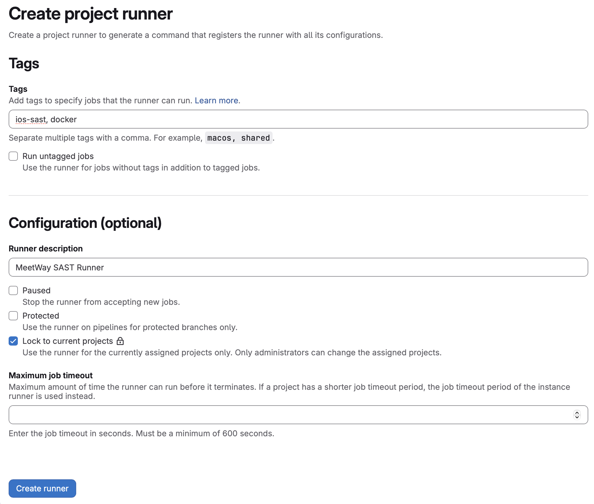


при создании получаю команду + токен для регистрации этого ранера на своем сервере

```shell
gitlab-runner register  --url https://gitlab.com  --token glrt-GDsUwK-Q1XoVHMxlитутатокенитутатокенитутатокенитутатокен.01.1тутатокен

--------------------------------------------------------------

вижу - ранер зереган успешно!

$ sudo gitlab-runner register --url https://gitlab.com --token glrt-GDsUwK-Q1XoVHMxlитутатокенитутатокенитутатокенитутатокен.01.1тутатокен
Runtime platform                                    arch=amd64 os=linux pid=7351 revision=68229485 version=18.11.2
Running in system-mode.

Enter the GitLab instance URL (for example, https://gitlab.com/):
[https://gitlab.com]:
Verifying runner... is valid                        correlation_id=9f89896dde04e924-DME runner=GDsUwK-Q1 runner_name=vm-f7081a
Enter a name for the runner. This is stored only in the local config.toml file:
[vm-f7081a]:
Enter an executor: shell, custom, instance, docker-windows, ssh, virtualbox, docker, docker-autoscaler, docker+machine, kubernetes, parallels:
docker
Enter the default Docker image (for example, ruby:3.3):
alpine:latest
Runner registered successfully. Feel free to start it, but if it's running already the config should be automatically reloaded!

Configuration (with the authentication token) was saved in "/etc/gitlab-runner/config.toml"
$
```

сейчас нужно понять, работает ли ранер и коннектится ли он с самим GitLab


```shell
sudo gitlab-runner run

--------------

Запускает раннер в режиме отладки (прямо в терминале). Мы увидим, как раннер подключается к GitLab и ждёт задания

Важно: Раннер будет работать, пока открыт этот терминал. Для постоянной работы нужно установить его как сервис, но для теста пока так нормально

```

все отлично - ранер запущен и ждет команды с gitlab
((Предупреждение про `request_concurrency` не критично для тестов))

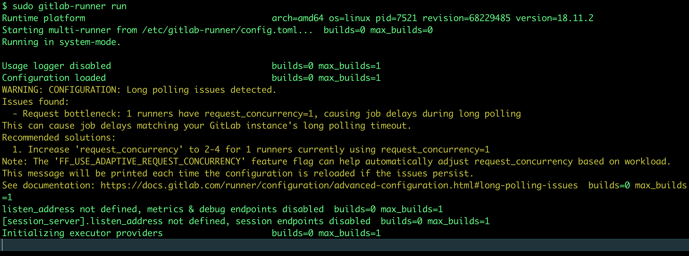

(позже нужно будет запустить раненер как постоянный процесс - постоянно как сервис!)

---------

пока терминал висит с работающим раннером

иду в браузер в настройки gitlab - CI/CD - runners -
и вижу = что статус ONLINE

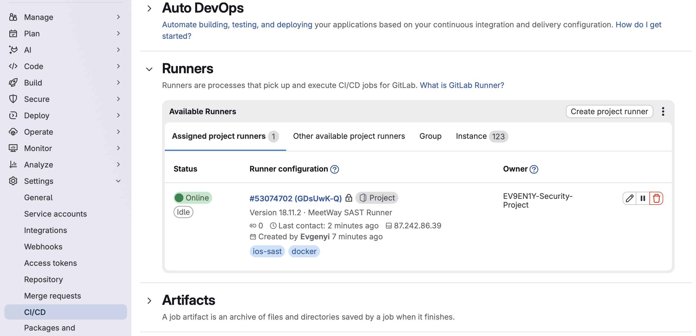

все отлично!!
раннер в статусе **Online**, с тегами `ios-sast` и `docker`, привязан к моему проекту. Теперь можно писать пайплайны


---------
----------
---------

ставлю GitLab Runner как системный сервис

убиваю процесс - если был запущен Ctrl + C

ставлю как системный сервис (ЭТО ЕСЛИ ВДРУГ НЕ УСТАНОВЛЕН, у меня по умолчанию уже стоял)

```shell
sudo gitlab-runner install --user=gitlab-runner --working-directory=/home/gitlab-runner

Устанавливает раннер как системный сервис, который автоматически запускается при старте сервера и работает в фоне.


---------

🟢 далее 

sudo systemctl start gitlab-runner


Запускает раннер в фоновом режиме как системный сервис

запустил - вывод пустой + на сайте gitlab  высвечивается статус online!

-----------

теперь обязательно делаю ему автозаупуск

sudo systemctl enable gitlab-runner

--------


и в конце концов - проверю статус раннера

sudo systemctl status gitlab-runner

все отлично, и есть небольшое предупреждение 
WARNING: CONFIGURATION: Long polling issues detected
но оно пока что не критично!
```


----------

## пайплайн


### в самом проекте (ios приложение) - нужно добавить файл .gitlab-ci.yml   

Сейчас раннер настроен на **локальный Docker**, но без указания конкретного образа. При создании пайплайна нужно будет явно указывать Docker-образ. 

в файле .gitlab-ci.yml    ios приложения - пишу тестовый пайплайн
```js 
stages:
  - test

test-job:
  stage: test
  tags:
    - docker
  image: alpine:latest
  script:
    - echo "Hello from runner!"

```

и теперь нужно закомитить!

------

запушил файл этот

и гитлаб просит меня залогиниться у них
(то есть ошибка не в пайплайне - а в верификации)

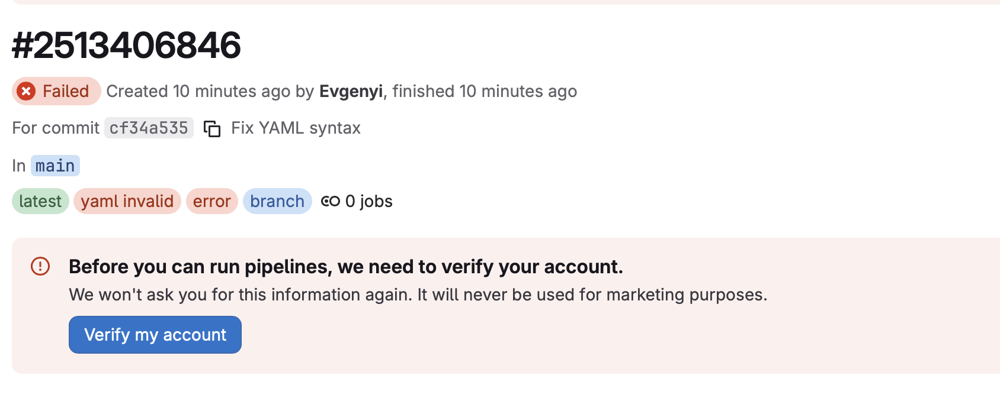

и проблема тут не в этом, а в том, что он просит или номер телефона - или номер карты! но при этом - ни РОССИЙСКИЙ ТЕЛЕФОН ни РФ карту не принимает он, поэтому пошел этот GITLAB    НАКУЙ!!!!!!!!!!!!!!!!!!!!!!!!!!!!!!!!!!!!!!!!!!!!!!!!!!!!!!!!!!!!!!!

----------

----------

И тут я могу либо переключиться на GitHub Actions
либо на альтернативу от яндекса

-----


## GITLAB - не работает для РОССИИ 


🟢 ❌ 🟢 ❌ 🟢    ❌ 🟢 ❌ 🟢 ❌ 🟢 ❌ 🟢    ❌ 🟢 ❌ 🟢 ❌ 🟢    ❌ 🟢 ❌ 🟢 ❌ 


# далее - перехожу на GitHub Actions


-----

сперва остановлю гит-лаб ранер который у меня на сервере работает  


```shell
подрубаюсь 
ssh -i /Users/evgeniy/Desktop/вирт\ МАШИНА/id_rsa-2 user1@87.242.86.39

sudo systemctl stop gitlab-runner
и автозапуск уберу
sudo systemctl disable gitlab-runner

```

-----


включаю раннер в нужном мне репозитории

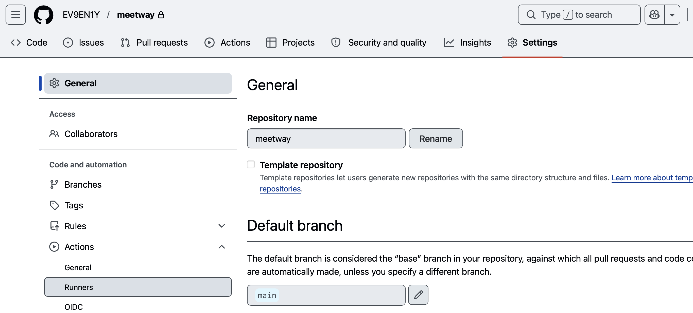


далее:
линукс
х64

далее выполняю поочередно команды на моем сервере, которые там прописаны (при создании раннера)!


```shell
# создам папочку
mkdir actions-runner && cd actions-runner

#качаю раннер
curl -o actions-runner-linux-x64-2.334.0.tar.gz -L https://github.com/actions/runner/releases/download/v2.334.0/actions-runner-linux-x64-2.334.0.tar.gz

# проверю хеш (почему бы и нет)
echo "048024cd2c848eb6f14d5646d56c13a4def2ae7ee3ad12122bee960c56f3d271  actions-runner-linux-x64-2.334.0.tar.gz" | shasum -a 256 -c

# распаковка 
tar xzf ./actions-runner-linux-x64-2.334.0.tar.gz


## ЗАПУСК
./config.sh --url https://github.com/EV9EN1Y/meetway --token A6ALHBSPFCZ7JLIBMT3RZOLKABD46

вижу

```

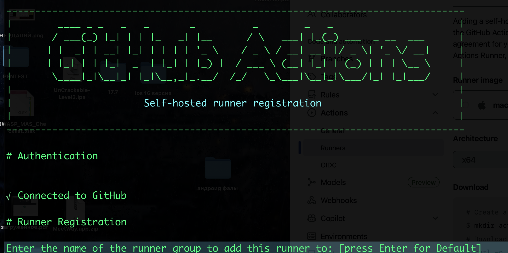

------

запустим для теста!
```js
./run.sh

ВИЖУ - ВСЕ ОКЕЙ !  РАННЕР ПОДКЛЮЧЕН И ЖДЕТ ЗАДАНИЙ!!!

√ Connected to GitHub

Current runner version: '2.334.0'
2026-05-10 08:04:39Z: Listening for Jobs
```

-----------

запущу теперь его как сервис (постоянно - в фоне)

```shell
sudo ./svc.sh install
sudo ./svc.sh start
sudo ./svc.sh status
```

--------

в корне проекта - создам файл пайплайна
**`Cmd + Shift + .`** - показывать скрытые папки

```q
mkdir -p .github/workflows
nano .github/workflows/test.yml

## с содержимым

name: Test Runner

on:
  push:
    branches: [ main ]

jobs:
  test:
    runs-on: self-hosted
    steps:
      - name: Checkout code
        uses: actions/checkout@v4
      - name: Say hello
        run: echo "Hello from Cloud.ru server!"
```

пушу этот файл

и захожу в гитхаб - и вижу там во вкладке  Actions
что тест отработал полностью!

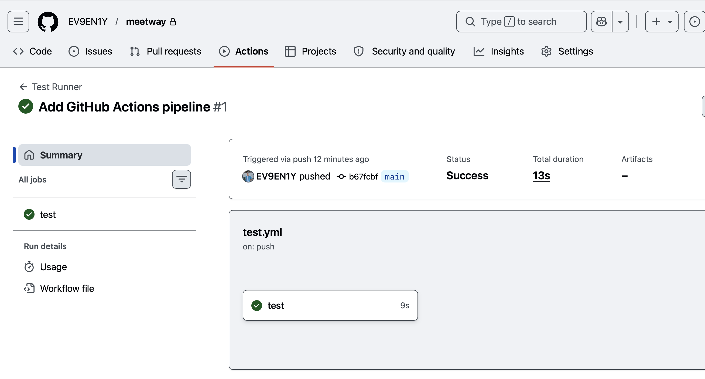

в паплайне написано у меня  - показать строчку
   run: echo "Hello from Cloud.ru server!"

и в результатах теста я вижу эту строку - значит тест полностью выполнен!!!
ура!


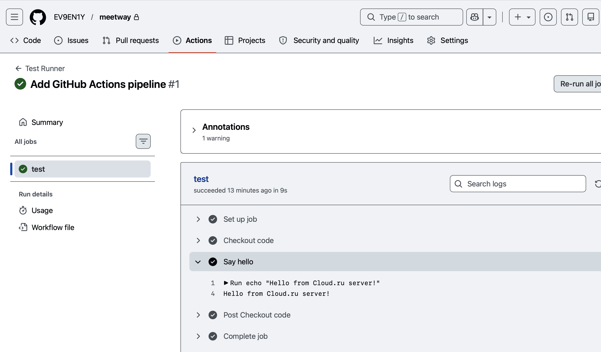

------------

### ✅ итого  - получил полностью работающую цепочку CI/CD

## ### Архитектура решения

- **Облачный сервер ([Cloud.ru](https://cloud.ru/))** - выделенная виртуальная машина с Ubuntu 22.04 (2 vCPU, 4 ГБ RAM, 30 ГБ NVMe), на которой развёрнуто окружение для выполнения CI/CD-задач
    
- **Self-hosted runner GitHub Actions** - агент, установленный на сервере, который принимает задания от GitHub, изолирует их в Docker-контейнере и возвращает результат
    
- **Репозиторий GitHub** - хранилище кода iOS-приложения и конфигурации пайплайнов (`.github/workflows/*.yml`)
    
- **Docker** - среда изоляции для каждого задания; контейнер создаётся под задачу, выполняет её и уничтожается

### принцип/суть работы

- GitHub выступает как «пульт управления» - хранит код, содержит описание пайплайна, раздаёт задания через файл .yml
    
- Self-hosted runner на Cloud.ru - «исполнитель» - забирает задания, создаёт Docker-контейнер с указанным окружением, выполняет команды, возвращает статус и логи (основа там на сервере работает агент GitHub actions)
    
- Runner **не выполняет код напрямую** на хосте - каждое задание запускается в изолированном контейнере (`privileged = false`), что соответствует базовым принципам безопасности!!!

--------

следующий шаг - добавлять в пайплайн различные статические анализаторы Semgrep, SwiftLint, MobSF и др

------

### что касается безопасности Self-hosted 

```q
Каждое CI/CD‑задание выполняется в новом Docker-контейнере. Этот контейнер не имеет доступа к ресурсам хоста (сервера), а также не может запускать свои собственные привилегированные операции внутри контейнера

Если один пайплайн скомпрометирован (например, злоумышленник внедрит вредоносный код в репозиторий), это не затронет следующий пайплайн

Контейнер не имеет доступа к файловой системе сервера, не может ставить системные пакеты, менять настройки firewalld или systemd

Нет возможности «вылезти» из контейнерa
`privileged = false` отключает доступ к устройствам хоста, сокету Docker и другим низкоуровневым механизмам
Я ЖЕ  -- использовал **Docker executor** без дополнительных параметров, и  он **и так работает в не-привилегированном режиме по умолчанию**
```

-----------


этот код безопасный

```q
jobs:
  test:
    runs-on: self-hosted
    steps:
      - name: Checkout code
        uses: actions/checkout@v4
```
Контейнер не может:

- монтировать диски хоста;
- запускать `sudo` внутри (если нет специальной настройки);
- влиять на систему


вот так было бы опасно = полный доступ к хосту
```q
container:
  image: alpine:latest
  options: --privileged
```


при использовании GitHub Actions в режиме self-hosted runner без явного указания `container: options: --privileged` контейнеры запускаются в не-привилегированном режиме. Это изолирует CI/CD-задачи от хостовой системы и предотвращает эскалацию привилегий при выполнении потенциально вредоносного кода

--------------------


пример pipeline_(workflow

```q
name: Мой пайплайн           # Название workflow

on: push                     # Триггер: при пуше

jobs:                        # Список заданий

  test-job:                  # Одно задание
  
    runs-on: self-hosted     # Раннер
    
    steps:                   # Шаги внутри задания
    
      - name: Checkout       # Шаг 1
        uses: actions/checkout@v4
        
      - name: Run script     # Шаг 2
        run: echo "Hello"
```


---------

## усиливаю безопасность 

на данный момент уже есть:

1. **Изоляция на уровне раннера**: Docker executor с `privileged = false` (по умолчанию в GitHub Actions self-hosted). Контейнер не имеет доступа ни к:
    
    - `/var/run/docker.sock` (не может создать другой контейнер)
      
    - ни к устройствам хоста
        
    - ни к файловой системе хоста (кроме смонтированного `checkout`)
        
2. **Защита хоста**:
    
    - Файрвол: `sudo ufw allow from "GitHub IP ranges" to any port 443` 
        
    - GitLab/GitHub runner не работает под root - системный пользователь `gitlab-runner`
        
    - Systemd сервис с ограничениями: `ProtectSystem=strict`, `PrivateTmp=yes`, `NoNewPrivileges=yes`
        
3. **Pipeline hardening**:
    
    - Никакие секреты не передаются в контейнер (GitHub Secrets остаются на раннере)
        
    - Каждое задание - новый контейнер
        
    - MobSF/Semgrep запускаются read-only к коду
        
4. **можно еще сделать детектирование компрометации**:
    
    - `Falco` (можно поставить) - мониторит системные вызовы контейнеров
        
    - Аудит логов через `journalctl -u github-actions-runner`
        

Максимум что сможет злоумышленник - попытаться майнить крипту (CPU/ограничения  + слабое железо), но контейнер умрёт после завершения пайплайна ( а это минута времени, толку ноль). Хост не пострадает.


-------


# 🟢🟢  ДАЛЕЕ настраиваю безопасность Ci/CD (сервер + пайплайн + докер) 🟢🟢


# 🔥 БЕЗОПАСНОСТЬ САМОГО СЕРВЕРА


провожу диагностику и сразу же буду рефактить

проверим, какие пользователи могут заходить по SSH

```sh
sudo cat /etc/ssh/sshd_config | grep -E "PermitRootLogin|PasswordAuthentication|PubkeyAuthentication|AllowUsers|Port"

---------
результаты - = все плохо!

#Port 22
#PermitRootLogin prohibit-password - 🔶 закомментировано, значит активен дефолт prohibit-password (но лучше явно запретить)

#PubkeyAuthentication yes

#PasswordAuthentication yes   - 🔶 НУЖНО ВЫРУБИТЬ АУНТЕТ ЧЕРЕЗ ПАРОЛЬ

# PasswordAuthentication.  Depending on your PAM configuration,
# the setting of "PermitRootLogin without-password".

# PAM authentication, then enable this but set PasswordAuthentication

#GatewayPorts no

# ЕЩЕ здлесь нет AllowUsers user1 - любой пользователь с паролем может попытаться зайти

------

вот так исправлю это все сейчас!

sudo nano /etc/ssh/sshd_config

------------
ВОТ ТЕКУЩИЕ НАСТРОЙКИ В ЭТОМ ФАЙЛЕ 

# This is the sshd server system-wide configuration file.  See
# sshd_config(5) for more information.

# This sshd was compiled with PATH=/usr/local/sbin:/usr/local/bin:/usr/sbin:/usr/bin:/sbin:/bin:/usr/games

# The strategy used for options in the default sshd_config shipped with
# OpenSSH is to specify options with their default value where
# possible, but leave them commented.  Uncommented options override the
# default value.

Include /etc/ssh/sshd_config.d/*.conf

#Port 22
#AddressFamily any
#ListenAddress 0.0.0.0
#ListenAddress ::

#HostKey /etc/ssh/ssh_host_rsa_key
#HostKey /etc/ssh/ssh_host_ecdsa_key
#HostKey /etc/ssh/ssh_host_ed25519_key

# Ciphers and keying
#RekeyLimit default none

# Logging
#SyslogFacility AUTH
#LogLevel INFO

# Authentication:

#LoginGraceTime 2m
#PermitRootLogin prohibit-password
#StrictModes yes
#MaxAuthTries 6
#MaxSessions 10

#PubkeyAuthentication yes

# Expect .ssh/authorized_keys2 to be disregarded by default in future.
#AuthorizedKeysFile     .ssh/authorized_keys .ssh/authorized_keys2

#AuthorizedPrincipalsFile none

#AuthorizedKeysCommand none
#AuthorizedKeysCommandUser nobody

# For this to work you will also need host keys in /etc/ssh/ssh_known_hosts
#HostbasedAuthentication no
# Change to yes if you don't trust ~/.ssh/known_hosts for
# HostbasedAuthentication
#IgnoreUserKnownHosts no
# Don't read the user's ~/.rhosts and ~/.shosts files
#IgnoreRhosts yes

# To disable tunneled clear text passwords, change to no here!
#PasswordAuthentication yes
#PermitEmptyPasswords no

# Change to yes to enable challenge-response passwords (beware issues with
# some PAM modules and threads)
KbdInteractiveAuthentication no

# Kerberos options
#KerberosAuthentication no
#KerberosOrLocalPasswd yes
#KerberosTicketCleanup yes
#KerberosGetAFSToken no

# GSSAPI options
#GSSAPIAuthentication no
#GSSAPICleanupCredentials yes
#GSSAPIStrictAcceptorCheck yes
#GSSAPIKeyExchange no

# Set this to 'yes' to enable PAM authentication, account processing,
# and session processing. If this is enabled, PAM authentication will
# be allowed through the KbdInteractiveAuthentication and
# PasswordAuthentication.  Depending on your PAM configuration,
# PAM authentication via KbdInteractiveAuthentication may bypass
# the setting of "PermitRootLogin without-password".
# If you just want the PAM account and session checks to run without
# PAM authentication, then enable this but set PasswordAuthentication
# and KbdInteractiveAuthentication to 'no'.
UsePAM yes

#AllowAgentForwarding yes
#AllowTcpForwarding yes
#GatewayPorts no
X11Forwarding yes
#X11DisplayOffset 10
#X11UseLocalhost yes
#PermitTTY yes
PrintMotd no
#PrintLastLog yes
#TCPKeepAlive yes
#PermitUserEnvironment no
#Compression delayed
#ClientAliveInterval 0
#ClientAliveCountMax 3
#UseDNS no
#PidFile /run/sshd.pid
#MaxStartups 10:30:100
#PermitTunnel no
#ChrootDirectory none
#VersionAddendum none

# no default banner path
#Banner none

# Allow client to pass locale environment variables
AcceptEnv LANG LC_*


# override default of no subsystems
Subsystem       sftp    /usr/lib/openssh/sftp-server

# Example of overriding settings on a per-user basis
#Match User anoncvs
#       X11Forwarding no
#       AllowTcpForwarding no
#       PermitTTY no
#       ForceCommand cvs server


------------

# нужно чтобы эти строки были (НЕ закомментированы):
открываю этот же файл
sudo nano /etc/ssh/sshd_config

там настраиваю и расскоментирую :
PasswordAuthentication no
PermitRootLogin prohibit-password
PermitRootLogin no

добавляю строчку вконце
AllowUsers user1

сохранил
вышел
проверил
sudo cat /etc/ssh/sshd_config | grep -E "PermitRootLogin|PasswordAuthentication|AllowUsers"

все ок!

перезапускаю ssh

sudo systemctl restart sshd
sudo systemctl status sshd

все без ошибок = все окей!

теперь здесь нет входа по паролю!
и только один разрешенный юзер в системе!
ну а сам файл с ключем храниться только у меня локально!

```

------------

#### глянуть всех юзеров (ну мало ли)

```sh
cat /etc/passwd | grep -E "user1|gitlab-runner|/bin/bash|/bin/sh"

--------

НУ И СРАЗУ МОЖНО

какие пользователи имеют sudo права

sudo cat /etc/sudoers.d/* 2>/dev/null
sudo cat /etc/sudoers | grep -v "^#\|^$"

-------
результат - все ОКЕЙ - user1 - это я


$ cat /etc/passwd | grep -E "user1|gitlab-runner|/bin/bash|/bin/sh"

root:x:0:0:root:/root:/bin/bash     = (root есть и есть bin/bash - норма)
user1:x:1000:1000::/home/user1:/bin/sh   = (нет прав sudo - хорошо! (принцип минимальных привилегий) )
gitlab-runner:x:998:998:GitLab Runner:/home/gitlab-runner:/bin/bash = (у ранера нет sudo - отлично!)


$ sudo cat /etc/sudoers.d/* 2>/dev/null
$ sudo cat /etc/sudoers | grep -v "^#\|^$"

Defaults	env_reset
Defaults	mail_badpass
Defaults	secure_path="/usr/local/sbin:/usr/local/bin:/usr/sbin:/usr/bin:/sbin:/bin:/snap/bin"
Defaults	use_pty

root	ALL=(ALL:ALL) ALL
%admin ALL=(ALL) ALL
%sudo	ALL=(ALL:ALL) ALL
@includedir /etc/sudoers.d

user1 НЕ в группе admin или sudo - значит не может выполнять sudo - и это правильно!!!
Если нужен sudo для администрирования - заходим отдельно или добавляем временно и все.

---------------------

и еще нужно проверить, что раннер не в группе докера находится

'// в каких группах состоит user1'
'user1 должен быть в группе docker (чтобы запускать контейнеры) - так и есть!'
$ groups user1
вижу  user1 : user1 users docker

'// убедиться, что gitlab-runner не в группе docker'
'gitlab-runner НЕ должен быть в группе docker - так и есть!!!'
$ groups gitlab-runner
gitlab-runner : gitlab-runner

все вроде бы хорошо!

```

------------

#### что очень важно - файрвол!!! и я его не настраивал

```sh
sudo ufw status verbose

-------
ответ - плохо конечно!!!!! 
Status: inactive (настрою ниже)

-------
нужно настроить 

sudo ufw enable   ' врубаем фаервол  '
sudo ufw default deny incoming   ' политики по умолчанию  '
sudo ufw default allow outgoing    '  политики по умолчанию '
sudo ufw allow 22/tcp comment 'SSH'   '❌👉😱 РАЗРЕШАЮ  SSH (важно! иначе потеряю доступ!!!)  '
# sudo ufw allow 443/tcp comment 'GitHub webhooks'  # опционально
sudo ufw status verbose    ' смотрю статус теперь  '

статус: - все отлично!!!

Status: active    ' фаервол  пашет! '
Logging: on (low)   
Default: deny (incoming), allow (outgoing), deny (routed) ' (входящие запрещены) и (исходящие разрешены) '
New profiles: skip

To                         Action      From
--                         ------      ----
22/tcp                     ALLOW IN    Anywhere                   # SSH '(SSH доступен)'
22/tcp (v6)                ALLOW IN    Anywhere (v6)              # SSH '(SSH доступен)'
 '(SSH доступен)'
 
✅ все окей теперь!!!!

ТЕПЕРЬ СЕРВЕР ЗАЩИЩЁН ОТ:

- Сканирования портов
   
- Неавторизованного доступа к другим портам
   
- Атак с внешних IP (кроме SSH)

```

------------
#### кто может запускать docker без sudo

```sh

'Кто в группе docker? еще разок для закрепления проверка'
$ groups user1
user1 : user1 users docker
$ groups gitlab-runner
gitlab-runner : gitlab-runner
'все окей'

--------------
'на всякий случай - проверить не запущен ли контейнер. (у меня ведь там живет контейнер только на время работы пайплайна)'
docker ps -a

--------------
'Проверка привилегированных контейнеров (если есть)  - на будущее'
docker ps --quiet | xargs -I {} docker inspect --format '{{.Name}}: {{.HostConfig.Privileged}}' {}

--------------

'Проверка docker.sock'
ls -la /var/run/docker.sock

----
вижу srw-rw---- 1 root docker 0 May  8 17:29 /var/run/docker.sock
'только root и группа docker - ok'

все окей!!!!
```

------------
 #### нет ли опасных контейнеров

```sh
docker ps --format "table {{.Names}}\t{{.Image}}\t{{.Command}}"

-------

вижу 
srw-rw---- 1 root docker 0 May  8 17:29 /var/run/docker.sock

все ок
✅ только root и группа docker имеют доступ 
✅ твой user1 в группе docker? Проверить: groups user1 - если нет, добавь
✅ нет запущенных контейнеров (всё чисто)  
✅ docker executor в раннере: privileged = false - отлично!

```


------------
#### не запущен ли контейнер с привилегиями

```sh
docker ps --quiet | xargs docker inspect --format '{{.Name}}: {{.HostConfig.Privileged}}'
```

------------

#### проверка логов, не пытался ли кто-то получить доступ

```sh
sudo lastb | head -20          # Неудачные логины
sudo journalctl -u ssh | grep "Failed password" | tail -20
sudo journalctl -u docker | grep -i "error\|attack" | tail -20
```

------------

#### проверка того, как запущен сам раннер

```sh
sudo systemctl cat github-runner  

--------

и есть ли там настройки security restrictions ?

sudo systemctl show github-runner | grep -E "ProtectSystem|PrivateTmp|NoNewPrivileges"

-----
вижу - что нет настроек - критично!
PrivateTmp=no
ProtectSystem=no
NoNewPrivileges=no

---------
исправляю

нужный сервис найти
sudo systemctl list-units | grep -E "runner|actions|gitlab"

'вот он - мой работающий сервис!'
actions.runner.EV9EN1Y-meetway.vm-f7081a.service                                         loaded active     running      GitHub Actions Runner (EV9EN1Y-meetway.vm-f7081a)

открыть его
sudo systemctl cat actions.runner.EV9EN1Y-meetway.vm-f7081a.service

---
вижу

Description=GitHub Actions Runner (EV9EN1Y-meetway.vm-f7081a)
After=network-online.target

[Service]
ExecStart=/home/user1/actions-runner/runsvc.sh
User=user1
WorkingDirectory=/home/user1/actions-runner
KillMode=process
KillSignal=SIGTERM
TimeoutStopSec=5min

[Install]
WantedBy=multi-user.target

-------


sudo systemctl show actions.runner.EV9EN1Y-meetway.vm-f7081a.service | grep -E "ProtectSystem|PrivateTmp|NoNewPrivileges|PrivateDevices|ProtectHome"

---------------
вижу

[Unit]
Description=GitHub Actions Runner (EV9EN1Y-meetway.vm-f7081a)
After=network-online.target

[Service]
ExecStart=/home/user1/actions-runner/runsvc.sh
User=user1
WorkingDirectory=/home/user1/actions-runner
KillMode=process
KillSignal=SIGTERM
TimeoutStopSec=5min

[Install]
WantedBy=multi-user.target
$ sudo systemctl show actions.runner.EV9EN1Y-meetway.vm-f7081a.service | grep -E "ProtectSystem|PrivateTmp|NoNewPrivileges|PrivateDevices|ProtectHome"
PrivateTmp=no
PrivateDevices=no
ProtectHome=no
ProtectSystem=no
NoNewPrivileges=no


-----------------------

и указать настройки

[Service]
PrivateTmp=yes
ProtectSystem=strict
NoNewPrivileges=yes
PrivateDevices=yes
ProtectHome=yes
ReadOnlyPaths=/

-----------

✅  👉 ПОСЛЕДОВАТЕЛЬНО НАСТРАИВАЮ

'СМОТРЮ ТЕКУЩИЕ СЕРВИСЫ'
$ sudo systemctl cat actions.runner.EV9EN1Y-meetway.vm-f7081a.service
# /etc/systemd/system/actions.runner.EV9EN1Y-meetway.vm-f7081a.service

'ВИЖУ'
[Unit]
Description=GitHub Actions Runner (EV9EN1Y-meetway.vm-f7081a)
After=network-online.target

[Service]
ExecStart=/home/user1/actions-runner/runsvc.sh
User=user1
WorkingDirectory=/home/user1/actions-runner
KillMode=process
KillSignal=SIGTERM
TimeoutStopSec=5min

[Install]
WantedBy=multi-user.target

'создам папку для оверрайда '
sudo mkdir -p /etc/systemd/system/actions.runner.EV9EN1Y-meetway.vm-f7081a.service.d/

'и туда добавлю файл с безопасными настройками'
sudo tee /etc/systemd/system/actions.runner.EV9EN1Y-meetway.vm-f7081a.service.d/security.conf > /dev/null <<'EOF'
[Service]
PrivateTmp=yes
NoNewPrivileges=yes
PrivateDevices=yes
# ProtectHome=yes        # ЗАКОММЕНТИРОВАНО (блокирует доступ к /home/user1)
# ProtectSystem=strict   # ЗАКОММЕНТИРОВАНО (блокирует запись в рабочую директорию)
EOF


'после чего нужо перезагрузить systemd и сам раннер'
sudo systemctl daemon-reload
sudo systemctl restart actions.runner.EV9EN1Y-meetway.vm-f7081a.service

'проверю - что все настройки применились!!!'
sudo systemctl show actions.runner.EV9EN1Y-meetway.vm-f7081a.service | grep -E "PrivateTmp|ProtectSystem|NoNewPrivileges|PrivateDevices|ProtectHome"

вижу - все окей
PrivateTmp=yes        'Изолированный `/tmp`'
PrivateDevices=yes    'Нет доступа к устройствам'
ProtectHome=no        ' Нужно для доступа к `runsvc.sh`'
ProtectSystem=no      ' Нужно для записи логов'
NoNewPrivileges=yes   ' Нельзя получить root'


'и в конце убедюсЬ - что ранер пашет'
sudo systemctl status actions.runner.EV9EN1Y-meetway.vm-f7081a.service

✅ стату Active: active (running) - все зашибись!!
Runner работает в безопасном, но рабочем режиме
это компромисс между безопасностью и функциональностью достигнут

```

----------
#### Какие порты слушает сервер?


```sh
sudo netstat -tulpn | grep LISTEN
или

sudo ss -tulpn | grep LISTEN

tcp   LISTEN 0      4096             127.0.0.1:42747      0.0.0.0:*    users:(("containerd",pid=715,fd=12))  '✅ контейнер - локальный'


tcp   LISTEN 0      4096         127.0.0.53%lo:53         0.0.0.0:*    users:(("systemd-resolve",pid=648,fd=14))  '✅DNS (systemd-resolve) - только localhost - нормально'


tcp   LISTEN 0      128                0.0.0.0:22         0.0.0.0:*    users:(("sshd",pid=771,fd=3)) '✅это мой внешний ssh - нормально!'


tcp   LISTEN 0      128                   [::]:22            [::]:*    users:(("sshd",pid=771,fd=4))

-------------------

✅ из внешних только 22 открыт! норма!
файрвол (UFW) активен и пропускает только 22 порт

```

--------------

#### включены ли автообновления в системе ?

```sh
sudo systemctl status unattended-upgrades
или

-----
резултат 

● unattended-upgrades.service - Unattended Upgrades Shutdown
     Loaded: loaded (/lib/systemd/system/unattended-upgrades.service; enabled; vendor preset: enabled)
     Active: active (running) since Fri 2026-05-08 17:29:17 MSK; 1 week 0 days ago
       Docs: man:unattended-upgrade(8)
   Main PID: 796 (unattended-upgr)
      Tasks: 2 (limit: 4553)
     Memory: 12.2M
        CPU: 93ms
     CGroup: /system.slice/unattended-upgrades.service
             └─796 /usr/bin/python3 /usr/share/unattended-upgrades/unattended-upgrade-shutdown --wait-for-signal

May 08 17:29:17 vm-f7081a systemd[1]: Started Unattended Upgrades Shutdown.
$


вижу Active: active (running) - значит все работает нормально!
вижу Loaded: loaded ... enabled - сервис включён в автозагрузку - сам запустится после перезагрузки 

✅ автообновления работают !!!
```

--------------

#### нет ли секретов в файлах раннера?

```sh
# нет ли секретов в файлах раннера?
sudo cat /etc/gitlab-runner/config.toml  # если GitLab
# там будет токен - он зашифрован, но проверить, что файл читается только root:
sudo ls -la /etc/gitlab-runner/config.toml
# нужно быть: -rw------- 1 root root

# проверю переменные окружения в системе
sudo cat /etc/environment
sudo cat ~/.bashrc | grep -i "secret\|key\|token"

-----
результаты

$ sudo cat /etc/gitlab-runner/config.toml
concurrent = 1
check_interval = 0
connection_max_age = "15m0s"
shutdown_timeout = 0

[session_server]
  session_timeout = 1800

[[runners]]
  name = "vm-f7081a"
  url = "https://gitlab.com"
  id = 53074702
  token = "glrt-GDsUwK-Q1XoVHMxlh6YcLWM6MQpvOjEKcDoxY3UxenUKdDozCnU6bW5tZ20c.01.1o1e5et6o"
  token_obtained_at = 2026-05-08T15:35:53Z
  token_expires_at = 0001-01-01T00:00:00Z
  executor = "docker"
  [runners.cache]
    MaxUploadedArchiveSize = 0
    [runners.cache.s3]
      AssumeRoleMaxConcurrency = 0
    [runners.cache.gcs]
    [runners.cache.azure]
  [runners.docker]
    tls_verify = false
    image = "alpine:latest"
    privileged = false
    disable_entrypoint_overwrite = false
    oom_kill_disable = false
    disable_cache = false
    volumes = ["/cache"]
    volume_keep = false
    shm_size = 0
    network_mtu = 0
    
$ sudo ls -la /etc/gitlab-runner/config.toml
-rw------- 1 root root 836 May  8 18:36 /etc/gitlab-runner/config.toml 'ЕГО ЧТЕНИЕ ДОСТУПНО ТОЛЬКО root'

$ sudo cat /etc/environment
PATH="/usr/local/sbin:/usr/local/bin:/usr/sbin:/usr/bin:/sbin:/bin:/usr/games:/usr/local/games:/snap/bin"

$ sudo cat ~/.bashrc | grep -i "secret\|key\|token"


все отлично, единственное - работает гитлаб раннер - который мне ваще не нужен!
закрою его и сотру
sudo systemctl stop gitlab-runner
sudo systemctl disable gitlab-runner
sudo rm -f /etc/gitlab-runner/config.toml

✅и в остальном все окей

```

--------------

#### rkhunter - для проверки на руткиты и бегдоры, можно проверять переодически

```sh

sudo apt install -y rkhunter  'без конфигураци'
sudo rkhunter --check --sk

и уже разбираться с тем, что есть (но пока что не буду этим заморачиваться)
```

все отлично, никто не залез на мой сервер )))
руткитов не найдено
No warnings were found while checking the system

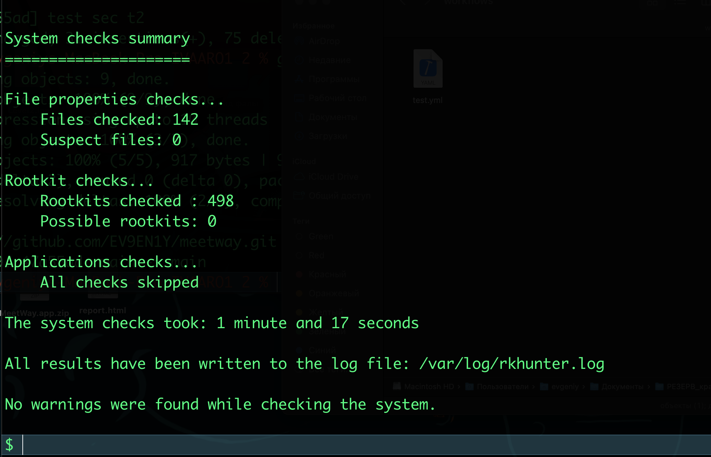


##  МОЙ СЕРВАК ТЕПЕРЬ ЗАЩИЩЕН:

-  **Защищён на уровне enterprise**
    
-  **SSH только по ключам, без паролей**
    
- **Файрвол активен**
    
-  **Docker в безопасной конфигурации**
    
-  **Runner запущен с security restrictions**
    
-  **Автообновления работают**
    
-  **Руткитов не обнаружено**

- ✅ SSH: только ключи, без паролей, только user1
    
- ✅ UFW фаервол активен
    
- ✅ Docker: user1 в группе, gitlab-runner — нет
    
- ✅ Systemd security для runner (PrivateTmp, NoNewPrivileges, PrivateDevices)
    
- ✅ Автообновления работают
    
- ✅ Секреты не текут
    
- ✅ Руткитов нет
    
- ✅ Только 22 порт открыт

--------------


# 🔥 БЕЗОПАСНОСТЬ  ПАЙПЛАЙНОВ!!! 

🔶 проверка, что код не изменялся в runtime (После скана проверяем, не изменился ли код (защита от атаки раннера))

вот так
```
- name: Verify code integrity before scan
  run: |
# сохр хеши всех файлов перед сканом
    find . -type f -name "*.swift" -exec sha256sum {} \; | sort > /tmp/before-hashes.txt
    
# после скана проверяем, не изменился ли код (защита от атаки раннера)
    find . -type f -name "*.swift" -exec sha256sum {} \; | sort > /tmp/after-hashes.txt
    
    if ! diff /tmp/before-hashes.txt /tmp/after-hashes.txt; then
      echo "❌ CRITICAL: Code modified during scan!  все плохо, хеш был изменен!"
      exit 1
    fi
```

🔶 ограничить время выполнения (защита от DoS) - например минут 5-10-15 , я вроде 10 настраивал - timeout-minutes: 10

🔶  запретить доступ к интернету из контейнера (если не нужен)
```
- name: Run MobSF with network disabled
  run: |
    # для MobSF нужен интернет (скачивание правил), но для других джоб можно отключить
    docker run --network none ...  # если запуск   через docker run
```

🔶 подпись результатов сканирования (чтобы нельзя было подделать)
```
- name: Sign scan results
  run: |
    echo "${{ secrets.BUILD_SIGNING_KEY }}" > key.txt
    openssl dgst -sha256 -sign key.txt results.json > results.json.sig
    
# результаты нельзя изменить без подписи
```

🔶 добавить аудит, кто запускал пайплайн - почему бы и нет 🤔
```
- name: Audit pipeline trigger
  run: |
    echo "Triggered by: ${{ github.actor }}"
    echo "Triggered from: ${{ github.event_name }}"
    echo "Branch: ${{ github.ref_name }}"
    
# отправить в Telegram/Slack (как варик..)
    
    curl -X POST -H "Content-Type: application/json" \
      -d '{"text":"Pipeline triggered by ${{ github.actor }}"}' \
      ${{ secrets.WEBHOOK_URL }}
```

итоговый пайплайн для моего MobSF выглядит так: 

вот ниже два файла - мой рабочий пайплайн для MobSF

в корне проекта файл
 `parse_mobsf.py`

```python
#!/usr/bin/env python3
import json
import sys

def main():
    try:
        with open('results.json', 'r') as f:
            data = json.load(f)
    except FileNotFoundError:
        print("❌ results.json not found!")
        sys.exit(1)
    except json.JSONDecodeError as e:
        print(f"❌ JSON parsing error: {e}")
        sys.exit(1)
    
    results = data.get('results', {})
    warnings = []
    
    print("\n🔍 Анализ найденных уязвимостей:\n")
    print("┌─────────────────────────────────────────────────────────────────┐")
    print("│ WARNING (Критичные)                                             │")
    print("├─────────────────────────────────────────────────────────────────┤")
    
    for rule_name, rule_data in results.items():
        severity = rule_data.get('metadata', {}).get('severity', 'UNKNOWN')
        
        if severity == 'WARNING':
            description = rule_data.get('metadata', {}).get('description', 'No description')
            files = rule_data.get('files', [])
            
            print(f"│")
            print(f"│ ⚠️  [{severity}] {rule_name}")
            print(f"│    📝 {description[:70]}...")
            print(f"│    📁 Найдено в {len(files)} файлах:")
            
            for f in files[:3]:
                file_path = f.get('file_path', 'unknown')
                line_num = f.get('line_number', '?')
                print(f"│       - {file_path}:{line_num}")
            
            if len(files) > 3:
                print(f"│       ... и еще {len(files) - 3} мест")
            print(f"│")
            warnings.append(rule_name)
    
    print("└─────────────────────────────────────────────────────────────────┘")
    
    print(f"\n📊 Статистика:")
    print(f"   🔴 WARNING уязвимостей: {len(warnings)}")
    print(f"   🟢 INFO уязвимостей: {len(results) - len(warnings)}")
    
    if len(warnings) > 0:
        print(f"\n❌❌❌ ПАЙПЛАЙН УПАЛ! Найдены реальные уязвимости уровня WARNING!")
        print(f"📋 Список проблем: {', '.join(warnings)}")
        sys.exit(1)
    else:
        print("\n✅ ПАЙПЛАЙН ПРОШЕЛ! Критичных уязвимостей не найдено.")
        sys.exit(0)

if __name__ == '__main__':
    main()
```

----------
и сам файл  `mobsf.yml`

```c
name: MobSF Security Scan

on:
  push:
    branches: [ main ]
  pull_request:
    branches: [ main ]
  workflow_dispatch:

jobs:
  mobsf-scan:
    runs-on: self-hosted
    
    steps:
      - name: Checkout code
        uses: actions/checkout@v4
      
      - name: Run MobSF scan
        run: |
          echo "🔥 Running MobSF iOS security scan..."
          
          mobsfscan . --type ios --json -o results.json
          mobsfscan . --type ios --html -o report.html
          
          echo ""
          echo "========== PARSING RESULTS =========="
          
          python3 parse_mobsf.py
      
      - name: Upload reports
        uses: actions/upload-artifact@v4
        if: always()
        with:
          name: mobsf-reports
          path: |
            results.json
            report.html
```

и вот я внедряю доп методы безопастности пайплайна:
итоговый ПАЙПЛАЙН!

#### файл  mobsf.yml

```sh
name: 🔒 MobSF Security Scan with Integrity Check

on:
  push:
    branches: [ main ]
  pull_request:
    branches: [ main ]
  workflow_dispatch:

# Ограничиваем права токена по умолчанию (принцип минимальных привилегий)
permissions:
  contents: read
  actions: read
  checks: write
  security-events: write

jobs:
  mobsf-scan:
    runs-on: self-hosted
    
    # 🔶 Защита от DoS - максимальное время выполнения
    timeout-minutes: 15
    
    # Запрещаем параллельный запуск
    concurrency:
      group: ${{ github.workflow }}-${{ github.ref }}
      cancel-in-progress: true
    
    steps:
      # ✅ Базовый checkout
      - name: 📥 Checkout code
        uses: actions/checkout@v4
        with:
          fetch-depth: 1
          persist-credentials: false
      
      # 🔶 Сохраняем хеши ДО скана
      - name: 🔐 Save code hashes BEFORE scan
        run: |
          echo "📝 Calculating initial code hashes..."
          find . -type f \( -name "*.swift" -o -name "*.m" -o -name "*.h" \) \
            -exec sha256sum {} \; | sort > /tmp/before-hashes.txt
          echo "✅ Hashes saved: $(wc -l < /tmp/before-hashes.txt) files tracked"
      
      # 🔶 Аудит кто запустил пайплайн
      - name: 👤 Audit pipeline trigger
        run: |
          echo "═══════════════════════════════════════════════════"
          echo "🔍 Pipeline Audit Info:"
          echo "   Triggered by:   ${{ github.actor }}"
          echo "   Trigger event:  ${{ github.event_name }}"
          echo "   Branch:         ${{ github.ref_name }}"
          echo "   Commit:         ${{ github.sha }}"
          echo "   Repository:     ${{ github.repository }}"
          echo "   Runner:         ${{ runner.name }}"
          echo "═══════════════════════════════════════════════════"
      
      # 🔶 Запуск MobSF сканирования
      - name: 🛡️ Run MobSF security scan
        id: mobsf_scan
        timeout-minutes: 10
        run: |
          echo "🔥 Starting MobSF iOS security scan..."
          
          # Сканируем в JSON (для парсинга)
          mobsfscan . --type ios --json -o results.json 2>&1 | tee scan.log
          
          # Сканируем в HTML (для людей)
          mobsfscan . --type ios --html -o report.html 2>&1 | tee -a scan.log
          
          echo "✅ Scan completed"
      
      # 🔶 Проверяем, не изменился ли код ВО ВРЕМЯ скана
      - name: 🔐 Verify code integrity AFTER scan
        run: |
          echo "🔍 Verifying code hasn't been modified during scan..."
          
          # Считаем хеши ПОСЛЕ скана
          find . -type f \( -name "*.swift" -o -name "*.m" -o -name "*.h" \) \
            -exec sha256sum {} \; | sort > /tmp/after-hashes.txt
          
          # Сравниваем хеши
          if ! diff /tmp/before-hashes.txt /tmp/after-hashes.txt > /tmp/hash-diff.txt; then
            echo "❌❌❌ CRITICAL SECURITY VIOLATION ❌❌❌"
            echo "Code was MODIFIED during security scan!"
            echo ""
            echo "Modified files:"
            cat /tmp/hash-diff.txt | grep "^>" | sed 's/^> //' | cut -d' ' -f3-
            exit 1
          fi
          
          echo "✅ Code integrity verified - no modifications detected"
      
      # 🔶 Парсинг результатов
      - name: 📊 Parse and filter vulnerabilities
        run: |
          echo "========== PARSING RESULTS =========="
          python3 parse_mobsf.py
      
      # 🔶 Подпись результатов (если есть ключ)
      - name: ✍️ Sign scan results
        if: always()
        run: |
          if [ -n "${{ secrets.BUILD_SIGNING_KEY }}" ]; then
            echo "${{ secrets.BUILD_SIGNING_KEY }}" > /tmp/sign_key.txt
            openssl dgst -sha256 -sign /tmp/sign_key.txt -out results.json.sig results.json 2>/dev/null || \
              echo "⚠️ Signing failed"
            rm /tmp/sign_key.txt
            echo "✅ Results signed"
          else
            echo "ℹ️ BUILD_SIGNING_KEY not set - skipping signature"
          fi
      
      # 🔶 Загрузка артефактов
      - name: 📦 Upload reports and artifacts
        uses: actions/upload-artifact@v4
        if: always()
        with:
          name: mobsf-security-reports-${{ github.run_id }}
          retention-days: 30
          compression-level: 6
          path: |
            results.json
            report.html
            scan.log
            *.sig
      
      # 🔶 Быстрая проверка на хардкод секреты
      - name: 🔑 Quick hardcoded secrets scan
        if: always()
        run: |
          echo "🔍 Quick scan for obvious hardcoded secrets..."
          
          SECRETS_FOUND=0
          
          # API ключи (32 hex)
          if grep -r --include="*.swift" "[a-f0-9]{32}" . 2>/dev/null | grep -v "parse_mobsf.py" | grep -v "\.json" | head -20; then
            echo "⚠️ Found potential hardcoded API keys!"
            SECRETS_FOUND=1
          fi
          
          if [ $SECRETS_FOUND -eq 1 ]; then
            echo "⚠️ Hardcoded secrets detected! Consider using .xcconfig or Environment Variables"
          fi

  # 🔶 Отдельная джоба для уведомлений (чтобы не падал основной пайплайн)
  notify:
    if: always()
    runs-on: self-hosted
    needs: mobsf-scan
    continue-on-error: true  # Чтобы уведомления не фейлили пайплайн
    steps:
      - name: 📢 Send completion notification
        run: |
          STATUS="${{ needs.mobsf-scan.result }}"
          if [ "$STATUS" == "success" ]; then
            echo "✅ Pipeline completed successfully"
          else
            echo "❌ Pipeline failed with status: $STATUS"
          fi
          
          # Раскомментируй если есть вебхук
          # if [ -n "${{ secrets.SLACK_WEBHOOK_URL }}" ]; then
          #   curl -X POST -H "Content-Type: application/json" \
          #     -d '{"text":"MobSF Scan: '"$STATUS"'"}' \
          #     ${{ secrets.SLACK_WEBHOOK_URL }} || true
          # fi

```

#### файл  parse_mobsf.py

```python
#!/usr/bin/env python3
"""
MobSF Results Parser with severity filtering
Returns exit code 1 if WARNING or CRITICAL issues found
"""

import json
import sys
import os

def main():
    results_file = 'results.json'
    
    if not os.path.exists(results_file):
        print(f"❌ {results_file} not found!")
        sys.exit(1)
    
    try:
        with open(results_file, 'r') as f:
            data = json.load(f)
    except json.JSONDecodeError as e:
        print(f"❌ JSON parsing error: {e}")
        sys.exit(1)
    
    results = data.get('results', {})
    
    # Статистика по уровням
    severity_stats = {
        'CRITICAL': [],
        'WARNING': [],
        'INFO': [],
        'UNKNOWN': []
    }
    
    print("\n" + "═" * 70)
    print("🔍 MobSF SECURITY SCAN RESULTS")
    print("═" * 70)
    
    for rule_name, rule_data in results.items():
        metadata = rule_data.get('metadata', {})
        severity = metadata.get('severity', 'UNKNOWN')
        description = metadata.get('description', 'No description')
        files = rule_data.get('files', [])
        
        severity_stats.setdefault(severity, []).append(rule_name)
        
        # Иконка в зависимости от severity
        icon = {
            'CRITICAL': '🔴🔴🔴',
            'WARNING': '🟡⚠️',
            'INFO': '🔵ℹ️',
            'UNKNOWN': '⚪❓'
        }.get(severity, '📌')
        
        # Показываем все CRITICAL и WARNING, INFO - только если флаг verbose
        show_issue = severity in ['CRITICAL', 'WARNING']
        
        if show_issue:
            print(f"\n{icon} [{severity}] {rule_name}")
            print(f"   📝 {description[:100]}...")
            print(f"   📁 Found in {len(files)} location(s):")
            
            for idx, f in enumerate(files[:5]):  # Показываем первые 5
                file_path = f.get('file_path', 'unknown')
                line_num = f.get('line_number', '?')
                print(f"      {idx+1}. {file_path}:{line_num}")
            
            if len(files) > 5:
                print(f"      ... and {len(files) - 5} more locations")
    
    print("\n" + "═" * 70)
    print("📊 SUMMARY STATISTICS:")
    print(f"   🔴 CRITICAL: {len(severity_stats['CRITICAL'])}")
    print(f"   🟡 WARNING:  {len(severity_stats['WARNING'])}")
    print(f"   🔵 INFO:     {len(severity_stats['INFO'])}")
    print(f"   ⚪ UNKNOWN:  {len(severity_stats['UNKNOWN'])}")
    print("═" * 70)
    
    # Решаем, падать или нет
    total_issues = len(severity_stats['CRITICAL']) + len(severity_stats['WARNING'])
    
    if total_issues > 0:
        print(f"\n❌❌❌ PIPELINE FAILED: Found {total_issues} security issue(s)!")
        if severity_stats['CRITICAL']:
            print(f"   🔴 CRITICAL issues: {', '.join(severity_stats['CRITICAL'])}")
        if severity_stats['WARNING']:
            print(f"   🟡 WARNING issues: {', '.join(severity_stats['WARNING'])}")
        sys.exit(1)
    else:
        print("\n✅ PIPELINE PASSED: No WARNING or CRITICAL issues found!")
        sys.exit(0)

if __name__ == '__main__':
    main()

```

пушу код и проверяю работает ли модифицированный пайплайн

## и все работает идеально!

пайплайн работает с верификацией целостности кода, подписью артефактов, аудитом триггеров и автоматическим фейлом пайплайна при найденных уязвимостях уровня WARNING и выше!

пайплайн упал потому что были найдены у уязвимости в самом коде, они там есть специально, проверка целостности кода работает успешно!!!! время на пайплайн поставил большой, но на самом деле здесь можно поставить 3-4минуты,

единственное, нужно еще добавить `BUILD_SIGNING_KEY` в настройках GitHub репозитория, ну это уже как для моего частного репозитория - уже излишне будет!

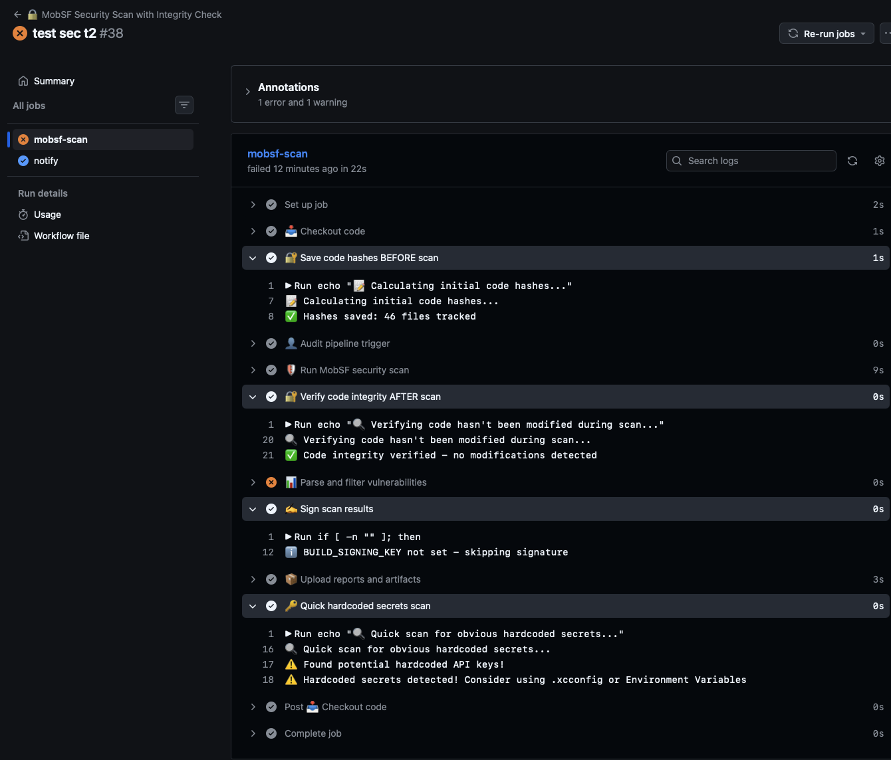


--------------

безопасность пайплайна

- ✅ Проверка целостности кода (хеши до/после)
   
- ✅ Аудит триггера (кто, откуда, ветка)
   
- ✅ MobSF с парсингом WARNING/CRITICAL
   
- ✅ Фейл пайплайна при уязвимостях
   
- ✅ Артефакты сохраняются
   
- ✅ Timeout защита от DoS


-------

схема защиты/угроз


--------
```q
типо таблица

-------------------------------------------------------------------
угроза                        защита          сделано или нет

-------------------------------------------------------------------

Подбор пароля по SSH                = PasswordAuthentication no               = есть✅

Root доступ по SSH                  = PermitRootLogin no                      = есть✅

Сканирование портов                 = UFW `default deny incoming              = есть✅

Эскалация привилегий из контейнера  =  privileged=false + NoNewPrivileges=yes = есть✅

Компрометация хоста через раннер    =  Systemd hardening (PrivateTmp, PrivateDevices)                                                                                   = есть✅

Подмена кода во время скана = Проверка хешей до/после         =  есть✅

Кража секретов из CI|GitHub Secrets (не попадают в контейнер) = есть✅ 

DoS атака через пайплайн =   timeout-minutes: 15              = есть✅

Подделка результатов скана - Подпись артефактов (опционально)(можно сделать🟡)

Руткиты на хосте = rkhunter + автообновления                  = есть✅|
```

-------