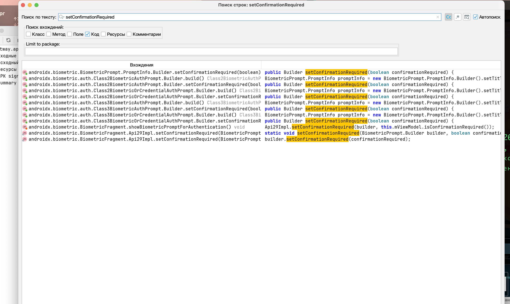

# MASTG-TEST-0329: References to APIs Enforcing Authentication without Explicit User Action
https://mas.owasp.org/MASTG/tests/android/MASVS-AUTH/MASTG-TEST-0329/


не отключает ли приложение обязательное подтверждение действия пользователем при биометрической аутентификации

--------

Когда  используется `BiometricPrompt` для биометрической аутентификации, по умолчанию система требует, чтобы пользователь явно подтвердил свое действие (например, нажал кнопку "Подтвердить" после сканирования отпечатка). Это делается для того, чтобы избежать случайных или несанкционированных операций

За это отвечает метод `setConfirmationRequired()`. По умолчанию он установлен в `true`, что безопасно

Если разработчик явно установит его в `false`, то пользователю не нужно будет нажимать кнопку подтверждения - аутентификация произойдет автоматически после успешного сканирования. Это может быть удобно для низкорисковых операций, но для критических действий (платежи, доступ к личным данным) это небезопасно

---


##  запускаю  jadx-gui
```c
jadx-gui ~/Desktop/meetway.apk
```


ищу  setConfirmationRequired

-----

обнаружил несколько совпадений




---

  Результат анализа через jadx


Все вхождения `setConfirmationRequired` оказались в коде библиотеки `androidx.biometric` (не в app-коде):

- `androidx/biometric/BiometricPrompt.java`
- `androidx/biometric/auth/Class3BiometricOrCredentialAuthPrompt.java`
- `androidx/biometric/auth/Class2BiometricAuthPrompt.java`
- `androidx/biometric/auth/Class2BiometricOrCredentialAuthPrompt.java`
- `androidx/biometric/auth/Class3BiometricAuthPrompt.java`
- `androidx/biometric/BiometricFragment.java`

**В коде самого MeetWay вызовов `setConfirmationRequired()` не найдено

------

Единственное место вызова биометрии - `ListAllMyChatsScreenKt.authenticateWithBiometric()`:

```java


BiometricPrompt.PromptInfo promptInfoBuild = new BiometricPrompt.PromptInfo.Builder()
    .setTitle("MeetWay")
    .setSubtitle("Пожалуйста, авторизуйтесь для доступа к приложению")
    .setAllowedAuthenticators(15)  // BIOMETRIC_STRONG | DEVICE_CREDENTIAL
    .build();
    
```

**`setConfirmationRequired()` не вызывается → используется **значение по умолчанию = `true`

Это значит, что после сканирования отпечатка система покажет кнопку "Подтвердить" - пользователь должен явно подтвердить действие

 Доп
- `setAllowedAuthenticators(15)` разрешает как биометрию, так и PIN/пароль устройства
- Биометрия запрашивается при входе в экран списка чатов (`list_all_my_chats`)
- При неудачной аутентификации - навигация на `first_scrin` (экран логина)

---

##  Вывод:  уязвимость не подтверждена

MeetWay НЕ отключает `setConfirmationRequired`
Приложение использует безопасное поведение по умолчанию (`true`), при котором пользователь должен явно подтвердить действие после биометрической аутентификации


