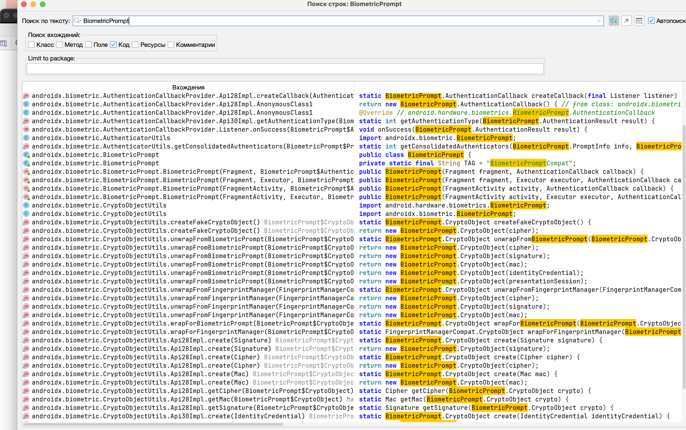
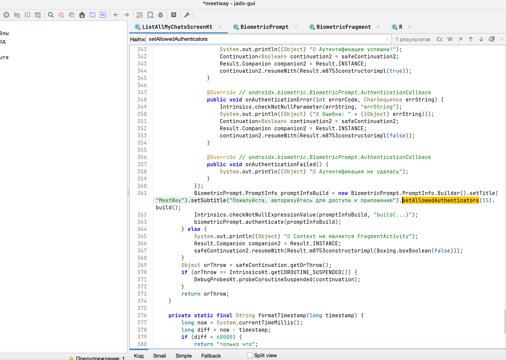

# MASTG-TEST-0326: References to APIs Allowing Fallback to Non-Biometric Authentication
https://mas.owasp.org/MASTG/tests/android/MASVS-AUTH/MASTG-TEST-0326/

Тест проверяет, как приложение настраивает биометрическую аутентификацию через `BiometricPrompt`. Если в настройках разрешен **откат к PIN/паролю** (device credentials), то это считается менее безопасным, чем использование только биометрии

В Android это настраивается с помощью `setAllowedAuthenticators()`. Если в этот метод передается `DEVICE_CREDENTIAL` (вместе с биометрией или отдельно), то приложение позволяет войти по PIN-коду

**Небезопасная практика:** `setAllowedAuthenticators(BIOMETRIC_STRONG | DEVICE_CREDENTIAL)`  
**Безопасная практика:** `setAllowedAuthenticators(BIOMETRIC_STRONG)`

>	Но я не до конца согласен с выводами теста, о том что этот способ, который должен ставить в приоритет ПИН-код аутентификацию правильный, потому что логически понятно, что приоритет нужно всё-таки давать код паролю, ПИН-кода. Потому что-не на всех телефонах биометрическом сертификации работают чётко. Например на некоторых андроидах биометрическом учить сертификацию можно надурить. Например также может быть плохое освещение, или какие-то блики световые на лице, или капля дождя на сенсоре распечатка пальцев, подобные ситуации, в которых биометрия может давать сбой, но при этом нужно дать пользователю полноценно и безопасно пользоваться устройством через код-пароль секретный.

--------

как проводит тест

##  запускаю  jadx-gui
```c
jadx-gui ~/Desktop/meetway.apk
```

ищу следующие методы:

- `setAllowedAuthenticators` - основной метод, который задает разрешенные способы аутентификации
   
- `setDeviceCredentialAllowed` - устаревший метод, который включал откат к PIN/паролю (используй его как дополнительный индикатор)
   
- `DEVICE_CREDENTIAL` - константа, указывающая на разрешение использовать PIN/пароль
   
- `BiometricPrompt` - класс, используемый для биометрической аутентификации
   
- `Authenticators` - интерфейс, содержащий константы для аутентификаторов
   

ну а далее - нужно анализировать найденные методы и понять, в каких контекстах они используются!


---

- **Тест считается пройденым:** ЕСЛИ приложение требует только биометрию для критических операций, откат к PIN/паролю не разрешен
   
- **Тест провален:** Приложение разрешает откат к PIN/паролю для критических операций

----------




---

  Биометрия ИСПОЛЬЗУЕТСЯ

1. `ListAllMyChatsScreenKt.authenticateWithBiometric()` - полноценная реализация
2. Вызывается через `LaunchedEffect` в `ListAllMyChatsScreen`, когда `showBiometricDialog == true`
3. Если биометрия не пройдена - пользователя кидает на `first_scrin` (по сути - логаут)

 тест можно считать пройденным с замечаниями (см. ниже), пк5еуотому что защита ЕСТЬ, но есть нюансы

### Результаты статического анализа кода




**Найдено в `ListAllMyChatsScreenKt.java`:**

```java
// Проверка доступности биометрии
BiometricManager biometricManager = context.getSystemService(BiometricManager.class);
if (biometricManager.canAuthenticate(32783) != 0) {  // 32783 = BIOMETRIC_STRONG | DEVICE_CREDENTIAL
    // Биометрия не настроена — пропускаем
    return true;
}

// Создание BiometricPrompt
BiometricPrompt prompt = new BiometricPrompt.Builder()
    .setTitle("MeetWay")
    .setSubtitle("Пожалуйста, авторизуйтесь для доступа к приложению")
    .setAllowedAuthenticators(15)  // 15 = BIOMETRIC_STRONG (0x0F)
    .build();
```

### Разбор `setAllowedAuthenticators(15)`

- Константа **15** = `BIOMETRIC_STRONG` (0x0F)
- `DEVICE_CREDENTIAL` = 0x8000 (32768)
- **Вывод:** приложение НЕ разрешает откат к PIN/паролю в диалоге биометрии. Только сильная биометрия
- С точки зрения MASTG-TEST-0326 - это безопасная практика

### Вывод

| Критерий                                           | Результат                              |
| -------------------------------------------------- | -------------------------------------- |
| Используется `BiometricPrompt`                     | ✅ Да, в `ListAllMyChatsScreenKt`       |
| `setAllowedAuthenticators` без `DEVICE_CREDENTIAL` | ✅ `BIOMETRIC_STRONG` (15)              |
| Откат к PIN разрешён                               | ❌ Нет, только биометрия                |
| Защита применяется при входе                       |  Применяется при открытии экрана чатов |

**ВВЫВОД: ПРОЙДЕН** (но с замечанием по UX при отсутствии биометрии на устройстве)

MeetWay использует только `BIOMETRIC_STRONG` - формально тест пройден

