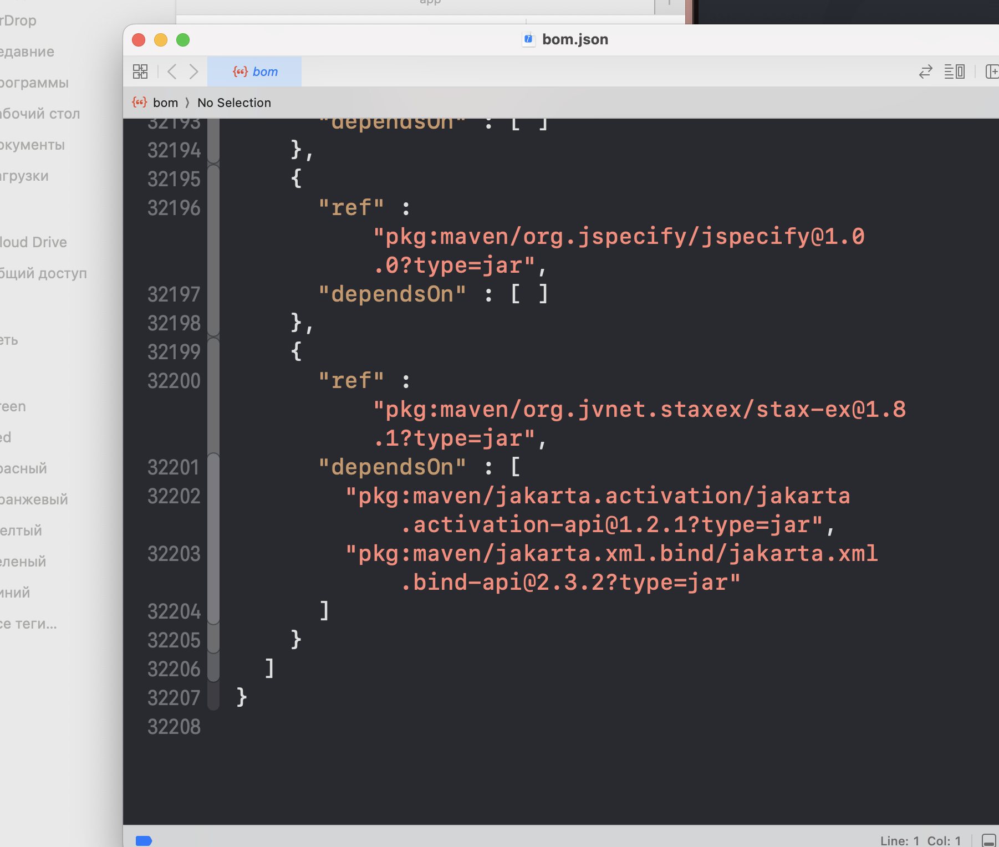

# MASTG-TEST-0274: Dependencies with Known Vulnerabilities in the App's SBOM
https://mas.owasp.org/MASTG/tests/android/MASVS-CODE/MASTG-TEST-0274/

**есть ли в приложении зависимости с известными уязвимостями**, но в отличие от предыдущего теста - [[L1-L2_dependencyCheck_библиотеки_с_известными_уязвимостями]] , здесь анализируется **SBOM (Software Bill of Materials)**

### -------------------------------------------------------------

Этот тест делает то же самое- что и тест [[L1-L2_dependencyCheck_библиотеки_с_известными_уязвимостями]] , но используя SBOM - документ, который содержит список всех компонентов приложения. SBOM может быть сгенерирован автоматически (например, через Gradle плагины) или запрошен у команды разработчиков. Затем SBOM загружается в систему управления уязвимостями, такую как Dependency-Track, где он анализируется на наличие известных CVE

------

добавить в формате CycloneDX плагин в проект, чтобы он собрал sbom файл!

и потом запустить по нему dependencyCheck, который как обычно - все проверит

-----


чтобы установить плагин - нужно

установить плагин CycloneDX и сгенерировать SBOM

Добавь в gradle/libs.versions.toml в секцию [plugins]:

```toml
  cyclonedx-bom = { id = "org.cyclonedx.bom", version = "2.2.0" }
```

В root build.gradle.kts:

```kotlin
  alias(libs.plugins.cyclonedx.bom) apply false
```

В app/build.gradle.kts в plugins {}:

```kotlin
  alias(libs.plugins.cyclonedx.bom)
```

--------

генерирую SBOM 

```q
cd ~/Documents/android-meetway
  ./gradlew cyclonedxBom
  
вот результат

> Task :app:cyclonedxBom
Unknown keyword meta:enum - you should define your own Meta Schema. If the keyword is irrelevant for validation, just use a NonValidationKeyword or if it should generate annotations AnnotationKeyword
Unknown keyword deprecated - you should define your own Meta Schema. If the keyword is irrelevant for validation, just use a NonValidationKeyword or if it should generate annotations AnnotationKeyword

BUILD SUCCESSFUL in 58s
1 actionable task: 1 executed
Consider enabling configuration cache to speed up this build: https://docs.gradle.org/9.1.0/userguide/configuration_cache_enabling.html


иду сюда за файлом

```


в этом файле все зависимости

всего 32 000 строк




----
теперь запускаю dependencyCheck - и он должен подхватить этот файл и выполнить проверку
scanSet - это просто список файлов или папок, которые dependency-check будет
сканировать. По дефолту он сам ищет JAR/AAR файл


нужно добавить SBOM в scanSet dependency-check


запускаю проверку!
настройки для запуска dependency-check есть в этом файле [[[L1-L2_dependencyCheck_библиотеки_с_известными_уязвимостями]]]

```q
cd /Users/evgeniy/Documents/android-meetway
  ./gradlew dependencyCheckAnalyze
```

нашел теже 3 уязвимости, как и в тесте [[[L1-L2_dependencyCheck_библиотеки_с_известными_уязвимостями]]]]
 как бы - все окей, все совпадает

```c
> Task :app:dependencyCheckAnalyze
Verifying dependencies for project app
Checking for updates and analyzing dependencies for vulnerabilities
----------------------------------------------------
.NET Assembly Analyzer could not be initialized and at least one 'exe' or 'dll' was scanned. The 'dotnet' executable could not be found on the path; either disable the Assembly Analyzer or add the path to dotnet core in the configuration.
The dotnet 8.0 core runtime or SDK is required to analyze assemblies
Sonatype OSS Index Analyzer disabled due to missing credentials. Authentication with token is now required, and OSS Index is migrating to Sonatype Guide. See https://dependency-check.github.io/DependencyCheck/analyzers/oss-index-analyzer.html for more information on authentication with Sonatype Guide OSS Index.
Generating report for project app

❌☠️☠️❌
❌☠️☠️❌  Found 3 vulnerabilities in project app   ❌☠️☠️❌
❌☠️☠️❌

One or more dependencies were identified with known vulnerabilities in app:

browser-1.10.0.aar (pkg:maven/androidx.browser/browser@1.10.0, cpe:2.3:a:android:android_browser:1.10.0:*:*:*:*:*:*:*) : CVE-2008-7298
classes.jar (pkg:maven/androidx.browser/browser@1.10.0, cpe:2.3:a:android:android_browser:1.10.0:*:*:*:*:*:*:*) : CVE-2008-7298
httpclient-4.5.6.jar (pkg:maven/org.apache.httpcomponents/httpclient@4.5.6, cpe:2.3:a:apache:httpclient:4.5.6:*:*:*:*:*:*:*) : CVE-2020-13956


See the dependency-check report for more details.


[Incubating] Problems report is available at: file:///Users/evgeniy/Documents/android-meetway/build/reports/problems/problems-report.html

Deprecated Gradle features were used in this build, making it incompatible with Gradle 10.

You can use '--warning-mode all' to show the individual deprecation warnings and determine if they come from your own scripts or plugins.

For more on this, please refer to https://docs.gradle.org/9.1.0/userguide/command_line_interface.html#sec:command_line_warnings in the Gradle documentation.

BUILD SUCCESSFUL in 15s
1 actionable task: 1 executed
```

**Рекомендации:**

1. Обновить `androidx.browser` до последней версии (сейчас актуальная 1.8.0 или выше, проверь актуальность)
   
2. Обновить `org.apache.httpcomponents:httpclient` до версии 4.5.13 или выше, где эта уязвимость исправлена
   
3. Либо заменить `httpclient` на более современный `OkHttp`, который у тебя уже используется


-------

### вывод следующий

Так как оба теста показали одинаковый результат и нашли по три одинаковые уязвимости это подтверждает то что тест выполнен полноценно

тест провален - 3 уязвимости найдены 


