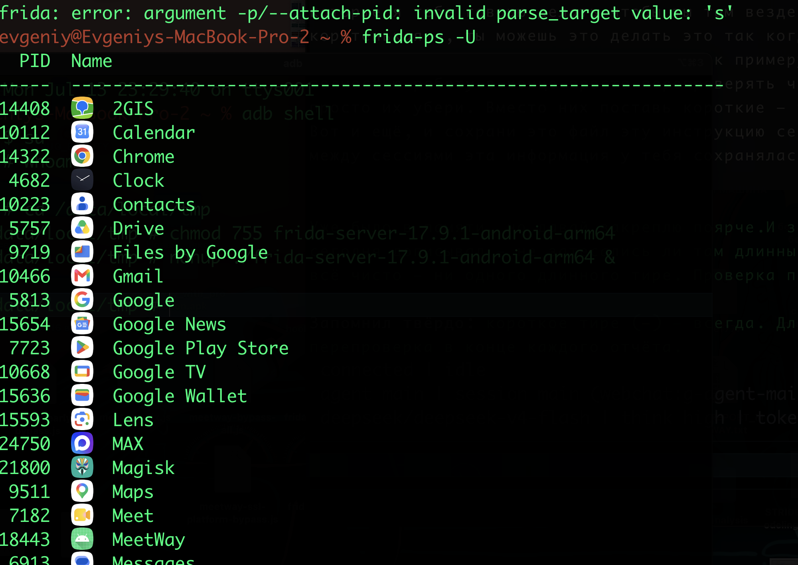

# MASTG-TEST-0400: Runtime Use of WebViewClient URL Loading Handlers
https://mas.owasp.org/MASTG/tests/android/MASVS-CODE/MASTG-TEST-0400/

Тест проверяет в рантайме, как приложение обрабатывает загрузку URL в WebView. Он перехватывает вызовы `shouldOverrideUrlLoading` и `shouldInterceptRequest` и показывает, какие URL-адреса загружаются, как они проверяются и разрешается ли их загрузка

-------
фрида везде стоит уже

```q
кидаю shell телефона

adb shell
su

запускаю сервер фриды на телефоне

cd /data/local/tmp
chmod 755 frida-server-17.9.1-android-arm64
nohup ./frida-server-17.9.1-android-arm64 &


НА МАКЕ В НОВОМ ТЕМИНАЛЕ 

// кидаю порт
adb forward tcp:27042 tcp:27042

смотрю запущенные процессы

frida-ps -U

вижу PID своего приложение

17576   MeetWay
```

-------




**Frida-скрипт**, который будет перехватывать:

- `shouldOverrideUrlLoading` - логируй URL и возвращаемое значение (`true` - перехвачено, `false` - загружено)
   
- `shouldInterceptRequest` - логируй URL и возвращаемые данные
   
- `WebView` - для отслеживания загрузки страниц

```js
cat > /Users/evgeniy/Desktop/hook_webview.js << 'EOF'
// hook_webview.js - Перехват WebViewClient методов
Java.perform(function() {
    console.log("[*] === WebView Hook Script Started ===");

    // 1. Перехват shouldOverrideUrlLoading
    try {
        var WebViewClient = Java.use("android.webkit.WebViewClient");
        WebViewClient.shouldOverrideUrlLoading.overload('android.webkit.WebView', 'java.lang.String').implementation = function(view, url) {
            console.log("[+] shouldOverrideUrlLoading(String) called");
            console.log("[+] URL: " + url);
            console.log("[+] Backtrace:\n" + Java.use("android.util.Log").getStackTraceString(Java.use("java.lang.Exception").$new()));
            // Возвращаем false, чтобы не блокировать загрузку (для наблюдения)
            return false;
        };
        console.log("[+] Hooked: shouldOverrideUrlLoading(String)");

        WebViewClient.shouldOverrideUrlLoading.overload('android.webkit.WebView', 'android.webkit.WebResourceRequest').implementation = function(view, request) {
            var url = request.getUrl().toString();
            console.log("[+] shouldOverrideUrlLoading(WebResourceRequest) called");
            console.log("[+] URL: " + url);
            console.log("[+] Method: " + request.getMethod());
            console.log("[+] Backtrace:\n" + Java.use("android.util.Log").getStackTraceString(Java.use("java.lang.Exception").$new()));
            return false;
        };
        console.log("[+] Hooked: shouldOverrideUrlLoading(WebResourceRequest)");
    } catch(e) {
        console.log("[-] Error hooking shouldOverrideUrlLoading: " + e);
    }

    // 2. Перехват shouldInterceptRequest
    try {
        var WebViewClient = Java.use("android.webkit.WebViewClient");
        WebViewClient.shouldInterceptRequest.overload('android.webkit.WebView', 'android.webkit.WebResourceRequest').implementation = function(view, request) {
            var url = request.getUrl().toString();
            console.log("[+] shouldInterceptRequest() called");
            console.log("[+] URL: " + url);
            console.log("[+] Method: " + request.getMethod());
            console.log("[+] Backtrace:\n" + Java.use("android.util.Log").getStackTraceString(Java.use("java.lang.Exception").$new()));
            return this.shouldInterceptRequest(view, request);
        };
        console.log("[+] Hooked: shouldInterceptRequest(WebResourceRequest)");
    } catch(e) {
        console.log("[-] Error hooking shouldInterceptRequest: " + e);
    }

    // 3. Перехват onPageStarted (загрузка страницы)
    try {
        var WebViewClient = Java.use("android.webkit.WebViewClient");
        WebViewClient.onPageStarted.implementation = function(view, url, favicon) {
            console.log("[+] onPageStarted() called");
            console.log("[+] URL: " + url);
            console.log("[+] Backtrace:\n" + Java.use("android.util.Log").getStackTraceString(Java.use("java.lang.Exception").$new()));
            this.onPageStarted(view, url, favicon);
        };
        console.log("[+] Hooked: onPageStarted()");
    } catch(e) {
        console.log("[-] Error hooking onPageStarted: " + e);
    }

    // 4. Перехват onPageFinished (завершение загрузки)
    try {
        var WebViewClient = Java.use("android.webkit.WebViewClient");
        WebViewClient.onPageFinished.implementation = function(view, url) {
            console.log("[+] onPageFinished() called");
            console.log("[+] URL: " + url);
            console.log("[+] Backtrace:\n" + Java.use("android.util.Log").getStackTraceString(Java.use("java.lang.Exception").$new()));
            this.onPageFinished(view, url);
        };
        console.log("[+] Hooked: onPageFinished()");
    } catch(e) {
        console.log("[-] Error hooking onPageFinished: " + e);
    }

    // 5. Дополнительно: перехват WebView.loadUrl
    try {
        var WebView = Java.use("android.webkit.WebView");
        WebView.loadUrl.overload('java.lang.String').implementation = function(url) {
            console.log("[+] WebView.loadUrl() called");
            console.log("[+] URL: " + url);
            console.log("[+] Backtrace:\n" + Java.use("android.util.Log").getStackTraceString(Java.use("java.lang.Exception").$new()));
            this.loadUrl(url);
        };
        console.log("[+] Hooked: WebView.loadUrl()");
    } catch(e) {
        console.log("[-] Error hooking WebView.loadUrl: " + e);
    }

    console.log("[*] === All WebView hooks are set. Waiting for WebView activity... ===");
});
EOF
```


запус со скриптом

```q
frida -U -f com.evgeniy.meetway -l /Users/evgeniy/Desktop/hook_webview.js
```

------

запустил приложение - открыл там веб вью с авторизацией

результат теста:

не обнаружил вызовов данных методов

тест пройден так как в ходе анализа не было обнаружено небезопасного поведения WebView


```q
evgeniy@Evgeniys-MacBook-Pro-2 ~ % frida -U -f com.evgeniy.meetway -l /Users/evgeniy/Desktop/hook_webview.js
     ____
    / _  |   Frida 17.9.1 - A world-class dynamic instrumentation toolkit
   | (_| |
    > _  |   Commands:
   /_/ |_|       help      -> Displays the help system
   . . . .       object?   -> Display information about 'object'
   . . . .       exit/quit -> Exit
   . . . .
   . . . .   More info at https://frida.re/docs/home/
   . . . .
   . . . .   Connected to KB2003 (id=6b62e119)
Spawned `com.evgeniy.meetway`. Resuming main thread!
[KB2003::com.evgeniy.meetway ]-> [*] === WebView Hook Script Started ===
[+] Hooked: shouldOverrideUrlLoading(String)
[+] Hooked: shouldOverrideUrlLoading(WebResourceRequest)
[+] Hooked: shouldInterceptRequest(WebResourceRequest)
[+] Hooked: onPageStarted()
[+] Hooked: onPageFinished()
[+] Hooked: WebView.loadUrl()
[*] === All WebView hooks are set. Waiting for WebView activity... ===

```


