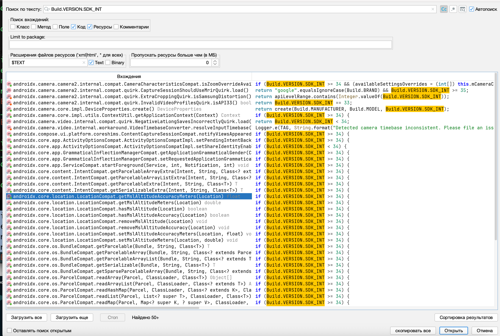

# MASTG-TEST-0245: References to Platform Version APIs
https://mas.owasp.org/MASTG/tests/android/MASVS-CODE/MASTG-TEST-0245/

**проверяет ли приложение версию Android**, на которой оно запущено

------

Android-приложения должны **динамически проверять версию операционной системы** во время выполнения, чтобы использовать новые функции на новых версиях и не падать на старых. Это делается с помощью `Build.VERSION.SDK_INT` и сравнения с константами типа `Build.VERSION_CODES`.

Если приложение не проверяет версию ОС, оно может попытаться использовать API, которых нет на старых версиях, что приведет к крашу. Или, наоборот, не использовать новые безопасные фичи на новых версиях

----

поиск через jadx

- `   Build.VERSION.SDK_INT` - основная переменная для проверки версии
   
- `Build.VERSION_CODES` - содержит константы версий (например, `UPSIDE_DOWN_CAKE` для Android 14)
   
- `if (Build.VERSION.SDK_INT >=` - паттерн сравнения
   
- `SDK_INT` - более короткий вариант


--------




50+ вызовов есть
то есть приложение использует вызовы!
по сути - тест пройден!

----

попрошу open claw - быстро проверить каждый вызов и определить - где и для чего вызываются данные методы:

-----

##  Результат проверки Скайнета

###  Где используются проверки версий

Все 50+ вхождений `Build.VERSION.SDK_INT` — **в сторонних библиотеках** (androidx.core, Coil, CameraX и т.д.):

```
androidx/core/...                  — AndroidX Core (совместимость)
androidx/camera/...                — CameraX (аппаратные фичи)
androidx/activity/...              — Activity API (back gesture и т.д.)
androidx/emoji2/...                — EmojiCompat
coil/util/HardwareBitmaps.java     — Coil (битмапы)
```

В **коде самого MeetWay** (com.evgeniy.meetway) - **ни одного** вызова `SDK_INT` или `VERSION_CODES`

###  Почему это нормально

| Параметр | Значение |
|---|---|
| `minSdkVersion` | **33** (Android 13) |
| `targetSdkVersion` | **36** (Android 16) |
| `compileSdkVersion` | **36** |

При `minSdk = 33` приложение работает только на Android 13+. Все API, которые использует MeetWay, доступны начиная с этой версии. Явные runtime-проверки не требуются — библиотеки AndroidX сами обрабатывают редкие кейсы совместимости.

###  Итог

50+ вхождений в jadx-gui — это **библиотечный код**, не app-код.
MeetWay не пишет своих `if (Build.VERSION.SDK_INT >= ...)`, но это оправдано высоким `minSdk = 33`.

---

##  Вывод: тест пройден ✅

Приложение не имеет проблем с platform version checks.
- minSdk 33 покрывает все используемые API
- Библиотеки обрабатывают свою совместимость
- Риска краша из-за отсутствия проверок нет