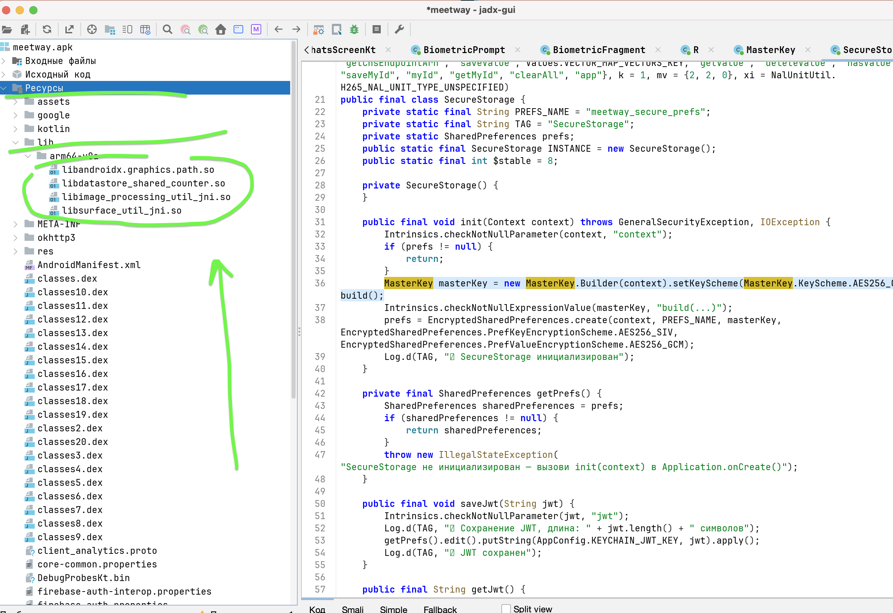
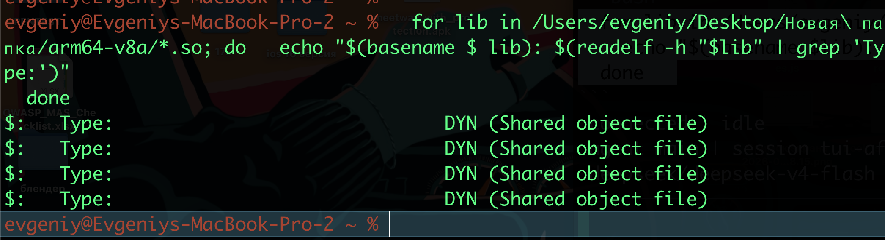

# MASTG-TEST-0222: Position Independent Code (PIC) Not Enabled
https://mas.owasp.org/MASTG/tests/android/MASVS-CODE/MASTG-TEST-0222/


тест **MASTG-TEST-0222** про то, включена ли в нативных библиотеках твоего приложения защита **Position Independent Code (PIC)**.
это проверка того, правильно ли скомпилированы `.so` файлы на предмет защиты от атак на память
### PIC 

PIC - это способ компиляции кода, при котором он может выполняться корректно, независимо от того, в какое место памяти он загружен 
Для Android это критично, потому что начиная с версии 5.0 (API 21) система требует, чтобы все динамически подгружаемые библиотеки были скомпилированы с поддержкой 

PIE (Position-Independent Executable) 
Если PIC отключен, код становится уязвимым для атак, использующих фиксированные адреса в памяти, что позволяет злоумышленнику легче внедрить и выполнить свой вредоносный код

-------

нужно извлечь **`.so`** файлы
буду использовать утилиту readelf

```q
readelf -h имя_библиотеки.so | grep "Type:"
```

- Если Type = `DYN (Shared object file)` — PIC включён. Тест пройден ✅
- Если Type = `EXEC (Executable file)` — PIC выключен. Тест провален ❌
- Для самопроверки: `readelf -d имя_библиотеки.so | grep TEXTREL` — если есть вывод, то код содержит непозиционно-независимые ссылки (плохо)

----------

достаю so файлы через jadx




```q
Проверка через readelf -h :

разом все 
  for lib in /Users/evgeniy/Desktop/Новая\ папка/arm64-v8a/*.so; do   echo "$(basename $ lib): $(readelf -h "$lib" | grep 'Type:')"
  done
  
  
или по очереди руками


readelf -h /Users/evgeniy/Desktop/Новая\ папка/arm64-v8a/libandroidx.graphics.path.so | grep "Type:"

readelf -h /Users/evgeniy/Desktop/Новая\ папка/arm64-v8a/libdatastore_shared_counter.so | grep "Type:"

readelf -h /Users/evgeniy/Desktop/Новая\ папка/arm64-v8a/libimage_processing_util_jni.so | grep "Type:"

readelf -h /Users/evgeniy/Desktop/Новая\ папка/arm64-v8a/libsurface_util_jni.so | grep "Type:"

```

результат
$:   Type:                              DYN (Shared object file)
$:   Type:                              DYN (Shared object file)
$:   Type:                              DYN (Shared object file)
$:   Type:                              DYN (Shared object file)





все библиотеки - DYN, PIC включён 

---

##  Перепроверка через LLM
 
Команда `readelf -d | grep -i pic` **не является корректным способом** проверки PIC.
PIC в .so файлах определяется через **ELF header type**:
- `DYN (Shared object file)` — PIC включён ✅
- `EXEC (Executable file)` — PIC выключен ❌

### Результат проверки всех .so файлов MeetWay (arm64-v8a)

| Библиотека | ELF Type | PIC |
|---|---|---|
| `libandroidx.graphics.path.so` | DYN | ✅ |
| `libdatastore_shared_counter.so` | DYN | ✅ |
| `libimage_processing_util_jni.so` | DYN | ✅ |
| `libsurface_util_jni.so` | DYN | ✅ |

TEXTREL не найдено ни в одной библиотеке.
Всего native библиотек в APK: 4 (только arm64-v8a).

---

##  Вывод: PASS

Все 4 нативные библиотеки MeetWay скомпилированы с поддержкой PIC.

**Статус:**  тест MASTG-TEST-0222 пройден