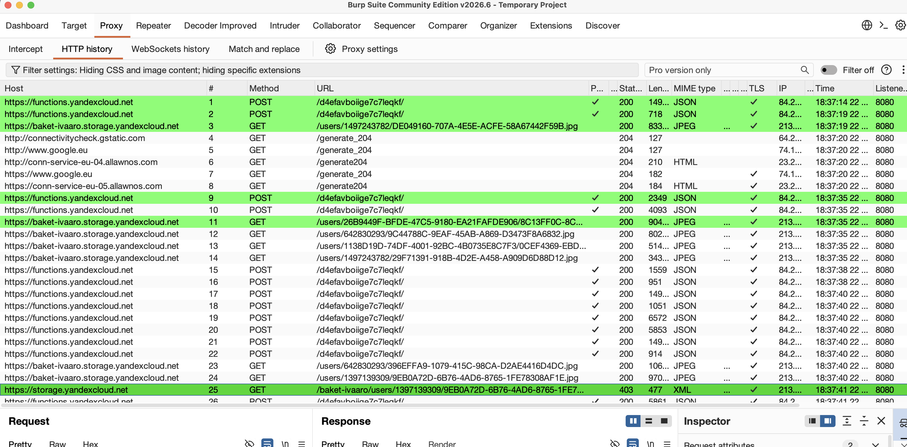
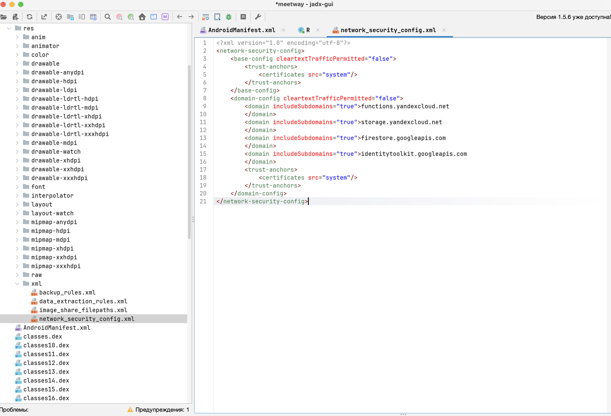

# MASTG-TEST-0236: Cleartext Traffic Observed on the Network
https://mas.owasp.org/MASTG/tests/android/MASVS-NETWORK/MASTG-TEST-0236/

## что проверяет этот тест

Тест MASTG-TEST-0236 (динамический) проверяет, идёт ли **реальный незашифрованный трафик** от приложения. В отличие от статического теста 0235, который смотрит только конфигурацию, этот тест перехватывает live-трафик и смотрит, что по факту летит по сети.

Если приложение шлёт данные по HTTP (а не HTTPS) – тест провален: пароли, токены, сообщения видны в открытом виде.

## какие инструменты использую

- **Burp Suite** на Маке – `192.168.0.11:8080`
- **OnePlus 8T** (Android 14, root, Magisk)
- **APEX injection** – `proxy-on.sh` (nsenter bind-mount Conscrypt)
- **Frida** – `ssl-unpin-meetway.js` или `meetway-nuke-v2.js` (обход OkHttp CertificatePinner)

## подготовка

APEX injection для Android 14 (Conscrypt не видит Magisk-серты):

```bash
adb exec-out su -c sh /data/local/tmp/proxy-on.sh
```

Скрипт `proxy-on.sh` делает:
- WiFi Proxy → `192.168.0.11:8080`
- tmpfs на `/system/etc/security/cacerts/` со всеми системными сертами + Burp CA
- nsenter inject в Zygote и все процессы (bind-mount сертов в APEX)
- iptables REDIRECT 80/443 → 8080

Детали: см. `P_dast-burp_данные-не-указанные-в-политике.md`

## как провожу тест

**шаг 1 – запускаю Burp Suite на Маке (прокси 192.168.0.11:8080)**

**шаг 2 – отключаю прокси на телефоне, логинюсь в приложении (чтобы Яндекс OAuth не падал):**
```bash
adb exec-out su -c sh /data/local/tmp/proxy-off.sh
```
> Открыть MeetWay на телефоне, ввести логин/пароль Яндекса, дождаться полной загрузки

**шаг 3 – включаю прокси + APEX injection:**
```bash
adb exec-out su -c sh /data/local/tmp/proxy-on.sh
```

**шаг 4 – запускаю MeetWay через Frida с обходом pinning:**
```bash
adb forward tcp:27042 tcp:27042
frida -U -f com.evgeniy.meetway -l /tmp/ssl-unpin-meetway.js
```

**шаг 5 – тыкаю по функционалу:** чаты, лента, профиль – смотрю Burp HTTP History

## что нашёл







Посмотрел весь перехваченный трафик MeetWay в Burp:

**MeetWay-specific запросы (Cloud Functions + Object Storage):**
- `POST /d4efavboiige7c7leqkf/` → `functions.yandexcloud.net` – HTTPS ✅
- `GET /users/*.jpg` → `baket-ivaaro.storage.yandexcloud.net` – HTTPS ✅
- Единичные `GET` к `storage.yandexcloud.net` (403) – HTTPS ✅

| Тип трафика | Нашёл? |
|--|--|
| HTTP-запросы от MeetWay | ❌ **не обнаружены** |
| HTTPS-запросы MeetWay | ✅ весь трафик – HTTPS |
| HTTP-запросы системы | ✅ captive portal check (не приложение) |
| Эндпоинты MeetWay | `functions.yandexcloud.net`, `baket-ivaaro.storage.yandexcloud.net`, `storage.yandexcloud.net` |

Все запросы MeetWay – только HTTPS. Ни одного HTTP от приложения. JWT, сообщения, профиль, фото – всё шифруется.

## вывод

**Тест пройден ✅**

Причина: весь трафик MeetWay идёт через HTTPS. HTTP-запросы не обнаружены ни в статическом анализе (NSC запрещает cleartext), ни в динамическом (Burp перехват). Cleartext-трафика нет.

Уровень теста: L1, L2.
Профиль: MASVS-NETWORK.

---
