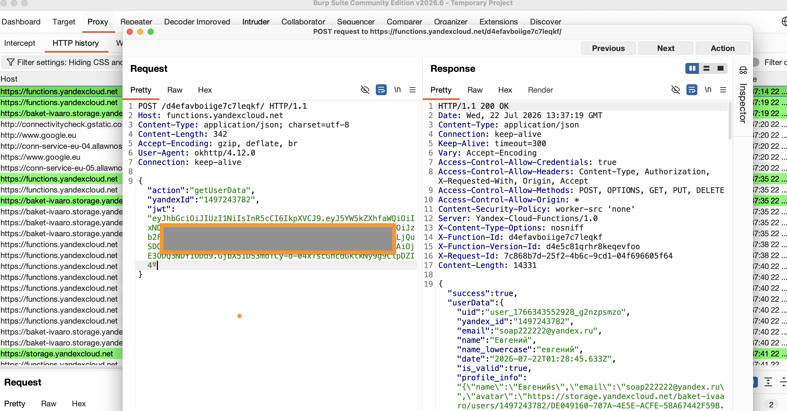

# MASTG-TEST-0244: Missing Certificate Pinning in Network Traffic
https://mas.owasp.org/MASTG/tests/android/MASVS-NETWORK/MASTG-TEST-0244/

## что проверяет этот тест

Тест MASTG-TEST-0244 (динамический) проверяет, реально ли **выполнить MITM-атаку** на приложение. Даже если статический анализ нашёл CertificatePinner в коде (MASTG-TEST-0242), надо проверить, работает ли он. MITM-атака считается успешной, если трафик можно перехватить через прокси.

- **Pinning работает** → трафик через Burp не виден, соединение обрывается
- **Pinning не работает** → трафик спокойно перехватывается

## какие инструменты использую

- **Burp Suite** – `192.168.0.11:8080`
- **OnePlus 8T** (Android 14, root)
- **APEX injection** – `proxy-on.sh`
- **Frida** – `meetway-nuke-v2.js` (обход NetworkModule, SslPinningInterceptor, GRPCInterceptor)

## подготовка

APEX injection + Frida-сервер:

```bash
adb exec-out su -c sh /data/local/tmp/proxy-on.sh
adb shell "su -c '/data/local/tmp/frida-server-17.9.1-android-arm64 -D &'"
```

## как провожу тест

**шаг 1 – запускаю Burp Suite**

**шаг 2 – отключаю прокси, логинюсь в приложении**

**шаг 3 – включаю прокси + APEX injection**

**шаг 4 – тест A: БЕЗ Frida – запускаю MeetWay, смотрю, идёт ли трафик**

**шаг 5 – тест B: С Frida – обхожу pinning, смотрю, идёт ли трафик**

```bash
frida -U -f com.evgeniy.meetway -l /tmp/meetway-nuke-v2.js
```

## что нашёл





**Тест A (БЕЗ Frida):**

| Попытка | Результат |
|--|--|
| Burp-перехват без Frida | ❌ трафик **не проходит** – соединения обрываются |
| Причина | OkHttp CertificatePinner проверяет хеши, Burp-серт не совпадает |

→ Certificate pinning **работает** и блокирует MITM.

**Тест B (С Frida – `ssl-unpin-meetway.js`):**

Скрипт обходит:
1. `OkHttp3.CertificatePinner.check()` – отключает проверку хешей
2. `javax.net.ssl.HostnameVerifier.verify()` – всегда возвращает true

| Попытка | Результат |
|--|--|
| Burp-перехват с Frida | ✅ трафик **пошёл** через Burp |
| HTTP History Burp | MeetWay: POST functions.yandexcloud.net/d4efavboiige7c7leqkf/ (JSON), GET baket-ivaaro.storage.yandexcloud.net (JPEG) |
| Видны: | JWT, профиль, сообщения, фото |

С помощью Frida pinning обходится, и весь трафик становится виден.

## вывод

**Тест пройден ✅** (L2)

Причина: без Frida certificate pinning блокирует MITM – трафик не перехватывается. Pinning работает корректно. С Frida обойти можно (runtime code modification), но это уже другой класс атаки (не MITM, а выполнение кода на устройстве).

MeetWay защищён программным CertificatePinner в 3+ местах (NetworkModule, SslPinningInterceptor, GRPCInterceptor). Для снятия защиты требуется Frida-скрипт, что значительно усложняет атаку.

Уровень теста: L2.
Профиль: MASVS-NETWORK.

---
