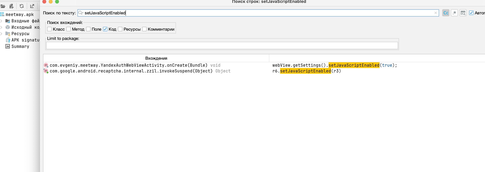
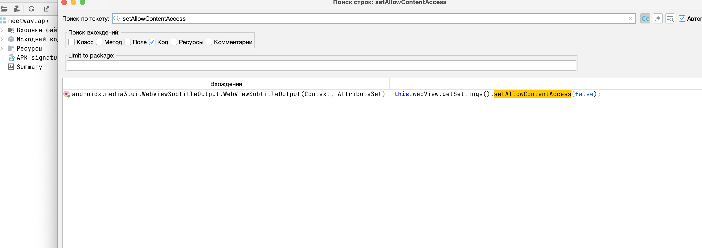

# MASTG-TEST-0250: References to Content Provider Access in WebViews
https://mas.owasp.org/MASTG/tests/android/MASVS-PLATFORM/MASTG-TEST-0250/

тест **MASTG-TEST-0250** проверяет, не создает ли приложение **опасную комбинацию настроек WebView**, которая позволит злоумышленнику получить доступ к локальным файлам и данным через контент-провайдеры


Если в WebView одновременно включены три настройки:

1. **`setJavaScriptEnabled(true)`** - включен JavaScript (он нужен для работы многих функций)
   
2. **`setAllowContentAccess(true)` (или не отключен явно)** - разрешен доступ к контент-провайдерам через `content://` URI
   
3. **`setAllowUniversalAccessFromFileURLs(true)`** - разрешены кросс-доменные запросы из файлов
   

То злоумышленник, который сможет внедрить свой HTML/JS код в WebView (например, через XSS или загрузку вредоносной страницы), сможет обратиться к любому контент-провайдеру на устройстве и вытянуть чувствительные данные

-----------


как проверить?

1. **Найти все WebView** в коде приложения (через статический анализ).
    
2. **Проверить вызовы методов**:
    
    - `webView.getSettings().setJavaScriptEnabled(...)`
        
    - `webView.getSettings().setAllowContentAccess(...)`
        
    - `webView.getSettings().setAllowUniversalAccessFromFileURLs(...)`
        
3. **Получить список контент-провайдеров** из `AndroidManifest.xml`.
    
4. **Оценить риск**

------

##  запускаю  jadx-gui
```c
jadx-gui ~/Desktop/meetway.apk
```

Этот тест **провален**, если одновременно выполняются три условия
- `setJavaScriptEnabled` явно установлен в `true`
   
- `setAllowContentAccess` явно установлен в `true` или **вообще не используется** (т.к. значение по умолчанию = `true`)
   
- `setAllowUniversalAccessFromFileURLs` явно установлен в `true`
   

Если хотя бы одно из этих условий не выполняется (например, `setAllowContentAccess` явно выставлен в `false`), тест считается пройденным

------


проверяю:

setJavaScriptEnabled - тру

setAllowContentAccess -  false

setAllowUniversalAccessFromFileURLs -  нет в коде


----





**Результат:** Тест **MASTG-TEST-0250** пройден

**Обоснование:** В ходе статического анализа кода с помощью jadx было установлено, что в приложении используется WebView. При этом:

- Метод `setAllowContentAccess` явно установлен в `false`, что блокирует доступ к контент-провайдерам из WebView
   
- Метод `setAllowUniversalAccessFromFileURLs` не используется, следовательно, применяется безопасное значение по умолчанию (`false`)
   

Таким образом, критическая комбинация настроек, позволяющая злоумышленнику через WebView получить доступ к локальным данным через контент-провайдеры, отсутствует

-------