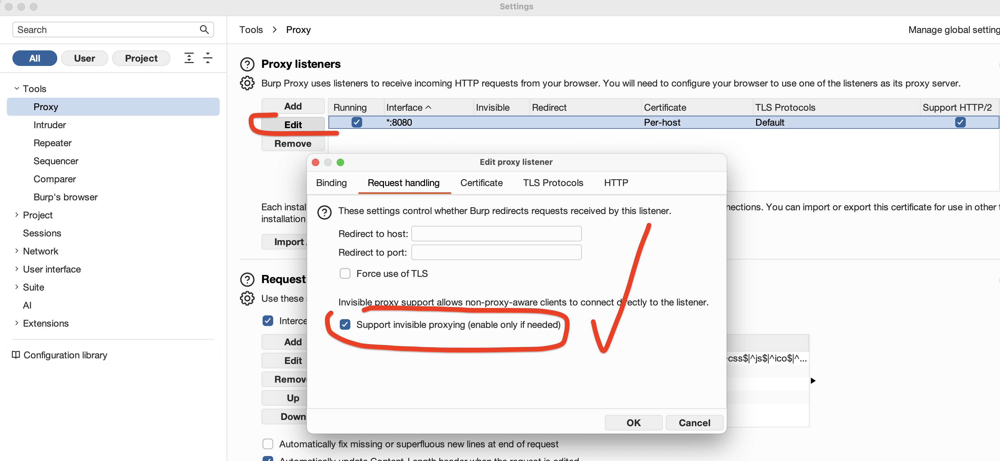
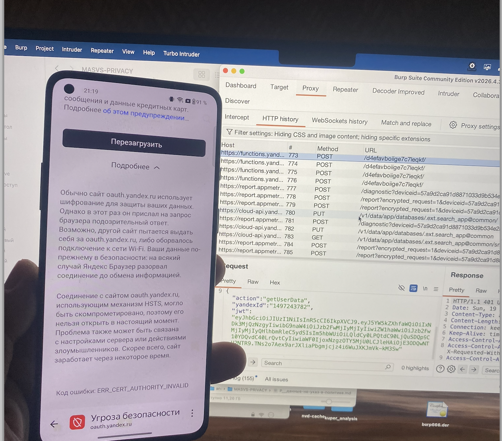
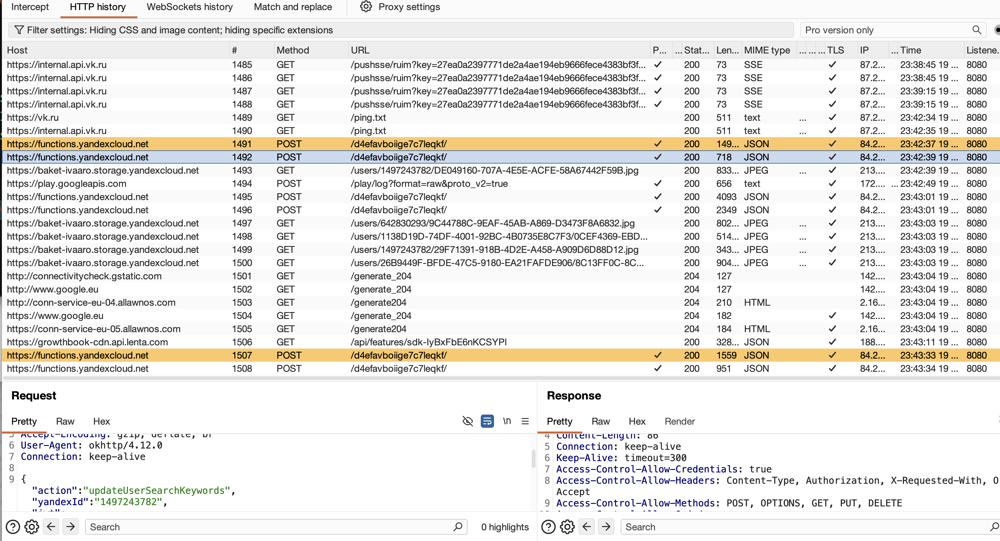

# MASTG-TEST-0206: Undeclared PII in Network Traffic Capture
https://mas.owasp.org/MASTG/tests/android/MASVS-PRIVACY/MASTG-TEST-0206/

**не отправляет ли приложение по сети персональные данные (PII)**, которые не указаны в политике конфиденциальности или в декларации о данных в Google Play

Тест проверяет, какие данные приложение передает по сети (через перехват трафика). Если ты вводишь в приложении свои данные (имя, почту, телефон) и они уходят на сервер, то они должны быть явно указаны в политике конфиденциальности и в Google Play Data Safety. Если они там не указаны, это нарушение

нужно динамически перехватить трафик приложения через burp или другой прокси
и смотреть -  какие данные отправляются

нужно проверить, что те данные - которые передаются реально через сеть приложением - что они указаны в политике конфиденциальности


-------

## Устройство
OnePlus 8T (KB2003), OxygenOS 14, Android 14, Magisk 30.7, root

## Проблема
На Android 14 системные сертификаты находятся в APEX-контейнере Conscrypt (`/apex/com.android.conscrypt/cacerts/`). Этот контейнер read-only и каждый процесс (приложение) имеет свой mount namespace. Традиционные методы (просто скопировать серт в `/system/etc/security/cacerts/` или навесить tmpfs на APEX) не работают

**Дополнительно:** iptables DNAT/REDIRECT на OUTPUT chain не перехватывает трафик приложений на этом устройстве – пакеты не совпадают с правилами (0 packets). REDIRECT работает только для процессов из root shell

**Что работает:** WiFi Proxy (`192.168.0.11:8080`) - приложения используют его. Но TLS рукопожатие падает (`Trust anchor for certification path not found`), потому что Conscrypt TrustManager на старте системы не видит Burp-серт

-------

## Решение 

### Шаг 1 - Включить invisible proxy в Burp
Burp Suite на Маке: Proxy → Proxy Settings → Edit (порт 8080) → Request Handling → поставить `☑ Support invisible proxying`


### Шаг 2 - Настроить WiFi Proxy на телефоне
В настройках Wi-Fi сети: HTTP Proxy = ручной, IP = `192.168.0.11`, порт = `8080`

> 🖥️ **Где настраивать:** на телефоне, Settings → Wi-Fi → Настройки сети → Proxy 
-

---------


### Шаг 3 - Создать и сохранить скрипты на телефоне

Сначала нужно создать на телефоне скрипты для включения и отключения прокси.

> 🖥️ **Где выполнять:** в терминале **компьютера** (macOS)

Файлы уже лежат на телефоне:
- `/data/local/tmp/proxy-on.sh` - включение
- `/data/local/tmp/proxy-off.sh` - отключение

Если нужно создать их заново - создаём на компьютере, пушим через ADB:
```bash
# На компьютере создаём файл proxy-on.sh
# (содержимое скрипта ниже в этом шаге)

# Пушим на телефон через USB:
adb push proxy-on.sh /data/local/tmp/proxy-on.sh
adb push proxy-off.sh /data/local/tmp/proxy-off.sh

# Делаем исполняемыми (через компьютер):
adb exec-out su -c chmod 755 /data/local/tmp/proxy-on.sh
adb exec-out su -c chmod 755 /data/local/tmp/proxy-off.sh
```

Содержимое **proxy-on.sh** (автоматизирует весь шаг 3):

```bash
#!/system/bin/sh
# FULL ENABLE: включает прокси + инжектит серт в APEX

WIFI_IP="192.168.0.11"
WIFI_PORT="8080"

# --- Cert injection ---
mkdir -p /data/local/tmp/tmp-ca-copy
cp /apex/com.android.conscrypt/cacerts/* /data/local/tmp/tmp-ca-copy/ 2>/dev/null
mount -t tmpfs tmpfs /system/etc/security/cacerts 2>/dev/null
cp /data/local/tmp/tmp-ca-copy/* /system/etc/security/cacerts/ 2>/dev/null
cp /data/adb/modules/burp_cert/system/etc/security/cacerts/9a5ba575.0 /system/etc/security/cacerts/ 2>/dev/null
chown root:root /system/etc/security/cacerts/* 2>/dev/null
chmod 644 /system/etc/security/cacerts/* 2>/dev/null
chcon u:object_r:system_file:s0 /system/etc/security/cacerts/* 2>/dev/null

# --- nsenter injection в Zygote и все процессы ---
ZYGOTE_PID=$(pidof zygote 2>/dev/null)
ZYGOTE64_PID=$(pidof zygote64 2>/dev/null)
for ZPID in $ZYGOTE_PID $ZYGOTE64_PID; do
    [ -n "$ZPID" ] && nsenter --mount=/proc/$ZPID/ns/mnt -- /bin/mount --bind /system/etc/security/cacerts /apex/com.android.conscrypt/cacerts 2>/dev/null
done
APP_PIDS=$(echo "$ZYGOTE_PID $ZYGOTE64_PID" | xargs -n1 ps -o PID -P 2>/dev/null | grep -v PID | head -30)
for PID in $APP_PIDS; do
    [ -n "$PID" ] && nsenter --mount=/proc/$PID/ns/mnt -- /bin/mount --bind /system/etc/security/cacerts /apex/com.android.conscrypt/cacerts 2>/dev/null &
done
wait

# --- iptables ---
/system/bin/iptables -t nat -A OUTPUT -p tcp --dport 80 -j REDIRECT --to-port 8080 2>/dev/null
/system/bin/iptables -t nat -A OUTPUT -p tcp --dport 443 -j REDIRECT --to-port 8080 2>/dev/null
sysctl -w net.ipv6.conf.all.disable_ipv6=1 >/dev/null 2>&1
rm -rf /data/local/tmp/tmp-ca-copy 2>/dev/null

# --- WiFi Proxy ---
settings put global http_proxy ${WIFI_IP}:${WIFI_PORT} 2>/dev/null
echo "Proxy ON"
```

Содержимое **proxy-off.sh** (полностью отключает):

```bash
#!/system/bin/sh
/system/bin/iptables -t nat -D OUTPUT -p tcp --dport 80 -j REDIRECT --to-port 8080 2>/dev/null
/system/bin/iptables -t nat -D OUTPUT -p tcp --dport 443 -j REDIRECT --to-port 8080 2>/dev/null
umount /system/etc/security/cacerts 2>/dev/null
settings put global http_proxy :0 2>/dev/null
sysctl -w net.ipv6.conf.all.disable_ipv6=0 2>/dev/null
echo "Proxy OFF"
```

> 🗂️ Куда сохранить: `/data/local/tmp/proxy-on.sh` и `/data/local/tmp/proxy-off.sh` на телефоне


---------------


### Шаг 4 - APEX cert injection (ключевой!)

Этот шаг выполняется автоматически скриптом `proxy-on.sh`. Если хочешь понять, что именно происходит внутри – вот ручной процесс:

> 🖥️ **Где выполнять:** в терминале **компьютера** (все команды через `adb exec-out su -c`)

Вместо того чтобы монтировать tmpfs напрямую на APEX (что не работает из-за per-process mount namespace), делаем:

```bash
# 1. Сохраняем оригинальные APEX серты
cp /apex/com.android.conscrypt/cacerts/* /data/local/tmp/tmp-ca-copy/

# 2. Монтируем tmpfs на /system/etc/security/cacerts/ (работает)
mount -t tmpfs tmpfs /system/etc/security/cacerts

# 3. Копируем обратно все серты + Burp CA
cp /data/local/tmp/tmp-ca-copy/* /system/etc/security/cacerts/
cp /data/adb/modules/burp_cert/system/etc/security/cacerts/9a5ba575.0 /system/etc/security/cacerts/

# 4. Фиксим SELinux контекст
chcon u:object_r:system_file:s0 /system/etc/security/cacerts/*

# 5. Bind-mount через nsenter в namespace Zygote (для новых приложений)
nsenter --mount=/proc/$ZYGOTE_PID/ns/mnt -- \
    /bin/mount --bind /system/etc/security/cacerts /apex/com.android.conscrypt/cacerts

# 6. Bind-mount в namespace всех запущенных приложений
for PID in $APP_PIDS; do
    nsenter --mount=/proc/$PID/ns/mnt -- \
        /bin/mount --bind /system/etc/security/cacerts /apex/com.android.conscrypt/cacerts
done
```

**Почему это работает:** на Android 14 каждый процесс (Zygote → приложения) имеет свой mount namespace для APEX. Файлы в APEX read-only, но можно сделать bind-mount из другого места. nsenter заходит в namespace нужного процесса и монтирует туда tmpfs с сертами

---------------


### Шаг 5 - iptables REDIRECT (для root shell тестов)
> 🖥️  в терминале **компьютера** через `adb exec-out su -c`

```bash
adb exec-out su -c 'iptables -t nat -A OUTPUT -p tcp --dport 80 -j REDIRECT --to-port 8080'
adb exec-out su -c 'iptables -t nat -A OUTPUT -p tcp --dport 443 -j REDIRECT --to-port 8080'
```

Правила НЕ перехватывают трафик приложений на этом устройстве, но работают для curl из adb shell. Основной трафик идёт через WiFi Proxy. Внутри скрипта `proxy-on.sh` эти правила уже прописаны

---------------

### Шаг 6 - Сделать постоянным (Magisk-модуль)

>  на **компьютере** через `adb exec-out su -c`

Скрипты proxy-on.sh и proxy-off.sh живут в `/data/local/tmp/` - после перезагрузки они сохраняются. Но чтобы всё включалось автоматически, обновлён `service.sh` в Magisk-модуле `burp_cert`:

```bash
# Путь на телефоне:
/data/adb/modules/burp_cert/service.sh
```

Он делает то же самое, что proxy-on.sh, но с задерж
кой 5 секунд после загрузки системы


-------

### Шпаргалка: быстрое включение/отключение

> 🖥️ **Где выполнять:** все команды в терминале **компьютера** (macOS)

```bash
# Включить (WiFi Proxy + сертификат + iptables):
adb exec-out su -c sh /data/local/tmp/proxy-on.sh

# Отключить (чистый телефон):
adb exec-out su -c sh /data/local/tmp/proxy-off.sh

# Для curl тестов (если нужно проверить из shell):
adb reverse tcp:8080 tcp:8080
```

### ДОПОЛНИТЕЛЬНО - Обход SSL Pinning (Frida для MeetWay - так как у меня стоит SSL Pinning)

> 🖥️ **Где выполнять:** все команды в терминале **компьютера** (macOS)

Если приложение использует certificate pinning (как MeetWay - ==он пинит серт Yandex Cloud Functions), системный серт Burp не поможет. Нужен runtime-обход через Frida

**На телефоне** уже установлен Frida-server:
```bash
/data/local/tmp/frida-server-17.9.1-android-arm64
```

Скрипт обхода **ssl-unpin-meetway.js** – сохранить на компьютере:

🗂️ Куда сохранить: `/tmp/ssl-unpin-meetway.js` на компьютере

```javascript
// MeetWay SSL Unpinning - обход OkHttp CertificatePinner
Java.perform(function() {
    console.log('[+] MeetWay SSL Unpinning started');

    // Hook OkHttp CertificatePinner
    try {
        var CertificatePinner = Java.use('okhttp3.CertificatePinner');
        CertificatePinner.check$okhttp.implementation = function(pin, certificate) {
            console.log('[+] CertificatePinner bypass');
            return;
        };
        console.log('[+] OkHttp CertificatePinner hooked');
    } catch(e) { console.log('[-] OkHttp hook failed: ' + e); }

    // Hook HostnameVerifier – пропускаем любые хосты
    try {
        var HostnameVerifier = Java.use('javax.net.ssl.HostnameVerifier');
        HostnameVerifier.verify.implementation = function(hostname, session) {
            console.log('[+] HostnameVerifier bypass: ' + hostname);
            return true;
        };
        console.log('[+] HostnameVerifier hooked');
    } catch(e) { console.log('[-] HostnameVerifier hook failed: ' + e); }

    console.log('[+] Ready');
});
```


фрида везде стоит уже

```q
кидаю shell телефона

adb shell
su

запускаю сервер фриды на телефоне

cd /data/local/tmp
chmod 755 frida-server-17.9.1-android-arm64
nohup ./frida-server-17.9.1-android-arm64 &


НА МАКЕ В НОВОМ ТЕМИНАЛЕ 

// кидаю порт
adb forward tcp:27042 tcp:27042

смотрю запущенные процессы

frida-ps -U

вижу PID своего приложение

17576   MeetWay
```


**Запуск:**
```bash
# 1. Убедиться что Frida-server запущен на телефоне:
adb shell "su -c '/data/local/tmp/frida-server-17.9.1-android-arm64 -D &'"

# 2. Пробросить порт:
adb forward tcp:27042 tcp:27042

# 3. Запустить MeetWay с обходом пининга:
frida -U -f com.evgeniy.meetway -l /tmp/ssl-unpin-meetway.js
```

-------

## Результат

**После APEX injection:**
- VK (ВКонтакте) - работает, трафик идёт через Burp ✅
- Некоторые другие приложения тоже работают, в которых нет защиты SSL
- Системные приложения - работают ✅
- curl ssl_verify_result: 0 (серт доверен) ✅

**Ограничения:**
- **MeetWay** - падает с `Certificate pinning failure!`. Нужен Frida-обход (скрипт готов)
- **QUIC/HTTP3** - не ловится через HTTP proxy, отключается в Chrome: `chrome://flags/#enable-quic`
- После перезагрузки телефона: adb reverse нужно настроить заново (только для curl-тестов из shell)


----------


### Полный рабочий процесс (как пользоваться)

1. **Отключить прокси** → залогиниться в приложении (мне это нужно потому что авторизация в моем приложении работает через Яндекс авторизацию, через Яндекс браузер. Автоматически как бы, и поэтому даже если я могу обойти проверку сертификатов на своем приложении через Freda сервер, то обходить сертификаты Яндекса пока что у меня желания и целей нету, поэтому я придумал так что я сначала отключаю все свои Hook, и приложения работают как обычно и когда уже приложение полностью открылось в базовом фоновом режиме и работает тогда только я подключаю заново перехват)
   ```bash
   adb exec-out su -c sh /data/local/tmp/proxy-off.sh
   ```
   > Открыть приложение на телефоне, ввести логин/пароль

2. **Включить прокси**
   ```bash
   adb exec-out su -c sh /data/local/tmp/proxy-on.sh
   ```

3. **Запустить приложение через Frida** (если есть пининг)
   ```bash
   adb forward tcp:27042 tcp:27042
   adb shell "su -c '/data/local/tmp/frida-server-17.9.1-android-arm64 -D &'"
   frida -U -f com.evgeniy.meetway -l /tmp/ssl-unpin-meetway.js
   ```

4. **Смотреть трафик** в Burp Suite → HTTP history

-------

трафик пошел через BURP полностью, но полноценно запустиь приложение не получается из-за защиты яндекс-браузера- так как в моем прилжении - при входе в него происходит авторизация через яндекс-браузер!

соответственно - тут нужно уже обходить защиту яндекса, что пока что сложновато для меня

(да - тут jwt - так надо!!)))


--------

так что сейчас есть пара вариков - как обойти это

1 - отключить прокси - авторизоватсья в приложении - потом снова включить прокси!

2 - это запустить приложение через андроид студию Android Studio → Profiler → Network и там будет весь трафик

3 - пытаться обойти SSL у яндекс браузера (заманчиво - но может занять много времени .. очень .. но не знаю точно)

-------

1 - отключаю прокси

вот скрипты:

### Полное отключение прокси (чистый телефон)

```bash
adb exec-out su -c sh /data/local/tmp/proxy-off.sh
```

Что делает:
- Удаляет iptables REDIRECT правила (порты 80/443)
- Размонтирует tmpfs с сертификатами (/system/etc/security/cacerts)
- Очищает системный WiFi Proxy
- Включает IPv6 обратно

Телефон возвращается в обычное состояние

### Полное включение прокси (Burp ready)

```bash
adb exec-out su -c sh /data/local/tmp/proxy-on.sh
```

Что делает:
- Ставит WiFi Proxy на `192.168.0.11:8080`
- Монтирует tmpfs на `/system/etc/security/cacerts/` со всеми системными сертами + Burp CA
- Через nsenter внедряет bind-mount в Zygote и все запущенные процессы
- Настраивает iptables REDIRECT для 80/443
- Отключает IPv6

Для curl тестов из shell (если понадобится):
```bash
adb reverse tcp:8080 tcp:8080
```

### Примечание
После полного отключения прокси - можно спокойно логиниться в приложения
После логина - включить обратно, и трафик снова пойдёт через Burp

Для MeetWay с certificate pinning:
```bash
frida -U -f com.evgeniy.meetway -l /tmp/ssl-unpin-meetway.js
```


запустил приложение - отключив прокси
залогинился
теперь снова запустил приложение - но со скриптом фриды для обхода локального SSL

и вуаля - весь трафик пошел через BURP ! победа!!! теперь можно и сам тест выполнять!



-------

PII которые передаются:
- JWT в каждом запросе - содержит  email, login, yandex_id, name в plaintext
  (не шифрован!)
- searchKeywords - текстовое поле,  куча-данных (все
  города, места, хобби)
- updateUserProfile - profession, country, name
- updateUserLocations - локации
- В ответах сервера - email и данные других пользователей 
- сами смс - и чаты - но они шифрованные хорошо


-------

Далее нужно посмотреть политику конфиденциальности данного приложения, которая должна быть доступна в самом приложении а также на странице Google play, play маркета или ру store, или Apple Store, в общем того магазина где находится приложение, и посмотреть о том что написано в политике по поводу данных которые это приложение может передавать и использовать, и сравнить с тем что реально идёт с трафиком данного приложения, если окажется так что какие-то данные не указаны в политике конфиденциальности, но в трафике они обнаружены, то это получается нарушение

### тест выполнен

Так как у меня нет политики конфиденциальности для моего приложения, полноценной, так как я не хочу щас рисковать, и запускать Messenger в магазины приложений, то соответственно я щас не могу сравнить результаты теста с этой политикой. Ну смысл понятен, он очень прост.


