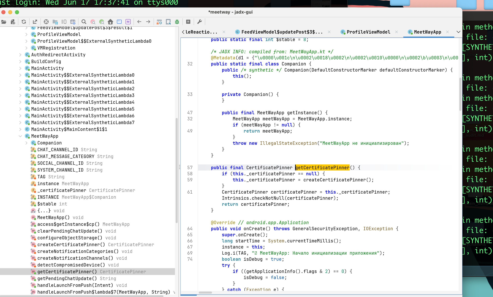
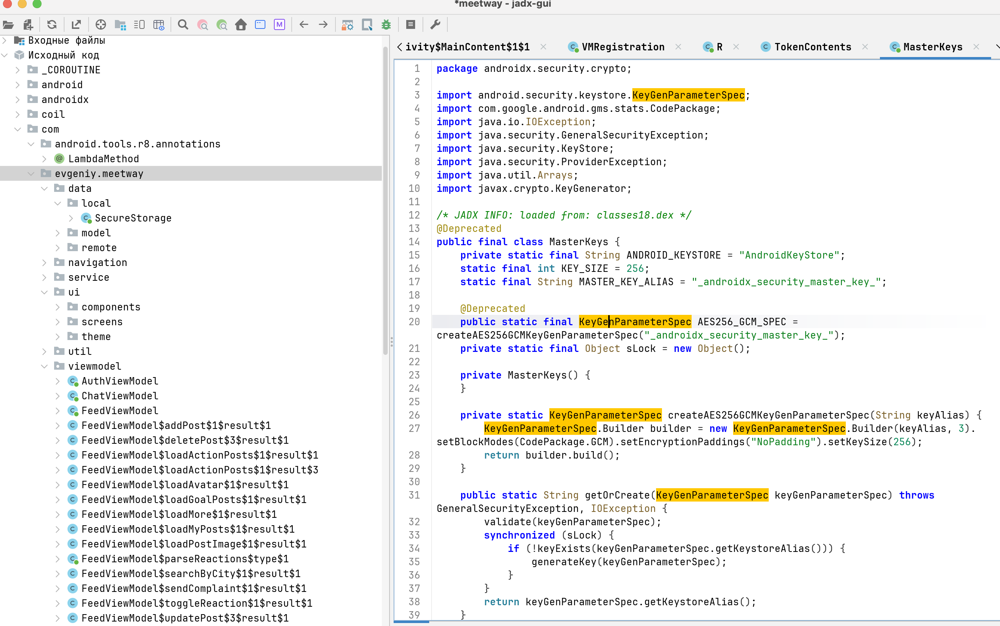

# MASTG-TEST-0051: Testing Obfuscation
https://mas.owasp.org/MASTG/tests/android/MASVS-RESILIENCE/MASTG-TEST-0051/

тест провожу на приложении 👉 [[0_MeetWay]]

Тест проверяет, насколько разработчики запутали свой код, чтобы ( злоумышленник ) не мог быстро понять, как работает приложение. Это базовая защита от реверс-инжиниринга - первая линия обороны перед анти-отладкой и проверкой целостности

**Обфускация бывает нескольких уровней**

**Базовый (ProGuard/R8)**     - Переименование классов, методов, полей в `a`, `b`, `c`

**Средний**  -  Шифрование строк - `"https://api.com/login"` → зашифрованная строка, расшифровка в рантайме

**Продвинутый** -  Контроль потока (control flow flattening) - Логика превращается в огромный switch-case, где порядок выполнения неочевиден

**Экстрим (native)** - Syscalls вместо libc, Obfuscator-LLVM - Нативный код с фальшивыми ветвлениями и flattened control flow

------

"Отсутствие обфускации увеличивает риск реверс-инжиниринга на 80% (условно), что критично при наличии хардкодных ключей и SSL-пинов"

---------

пример

```c
// Было (понятно)
public void validateUserCredentials(String username, String password) {
    if (isValidUsername(username) && isCorrectPassword(password)) {
        grantAccess();
    } else {
        denyAccess();
    }
}

// Стало (после обфускации)
public void a(String b, String c) {
    if (d(b) && e(c)) {
        f();
    } else {
        g();
    }
}
```

для банков - обязательная процедура

-----------------

##  запускаю  jadx-gui  на апк приложения meetWay
```c
jadx-gui ~/Desktop/meetway.apk

```

открыл через JADX апк файл 
просмотрел вручную имена классов и методов
и не обнаружил обфускации кода - все метода называются естестенными названиями, что даст подсказку злоумышленнику при реверсе




например, функци, которые работают с токенами не имеют обфускации!





также в коде есть кеши открытых сертификатов, которые тоже стоило бы шифровать, обфусцировать
```js
 public static final String YANDEX_API_PIN = "2aEWzNRnJjQagTUqyiFmYeBS1AF+9pnrQvt0N3d6ER4=";
```


поищу ключ слова через поиск в jadx 

```q
decrypt
decode
Cipher
AES
XOR
Base64
EncryptedString
CipherString
switch
goto
break label
flow
opaque predicate
native
loadLibrary
JNI
System.load
Build.FINGERPRINT
Build.MANUFACTURER
Build.MODEL
Build.HARDWARE
Build.BOARD
Build.PRODUCT
Build.TAGS
isDebuggerConnected
Debug.isDebuggerConnected
ro.debuggable
api_key
secret
token
password
private
http
```

просмотрел все классы и методы вручную через jadx - и не заметил нигде никакой обфускации! ее просто нет!!

--------

также можно запустить полу-автоматический анализ через APKid
вот здесь  - [[APKiD]] -- я уже его делал и также не обнаружил обфускации 


запускаю  apkid jadx
```q
apkid ~/Desktop/meetway.apk
```

вижу в выводе

++ мой разбор 
```q
evgeniy@Evgeniys-MacBook-Pro ~ % apkid ~/Desktop/meetway.apk
[+] APKiD 3.1.0 :: from RedNaga :: rednaga.io  🔶(тут инфа о приложении)
[*] /Users/evgeniy/Desktop/meetway.apk!classes10.dex 🔶(начало анализа конкрет файла)

classes10.dex - это DEX-файл (код приложения). APK - это архив. Внутри код разбит на classes.dex, classes2.dex, classes3.dex и т.д. тут их 20 штук  приложение немаленькое

 |-> compiler : unknown (please file detection issue!) 🔶(не понял что за компилятор собрал)

 |-> yara_issue : yara issue - dex file recognized by apkid but not yara module
[*] /Users/evgeniy/Desktop/meetway.apk!classes2.dex
 |-> compiler : unknown (please file detection issue!)
 |-> yara_issue : yara issue - dex file recognized by apkid but not yara module
[*] /Users/evgeniy/Desktop/meetway.apk!classes4.dex
 |-> compiler : unknown (please file detection issue!)
 |-> yara_issue : yara issue - dex file recognized by apkid but not yara module
[*] /Users/evgeniy/Desktop/meetway.apk!classes16.dex
 |-> compiler : unknown (please file detection issue!)
 |-> yara_issue : yara issue - dex file recognized by apkid but not yara module
[*] /Users/evgeniy/Desktop/meetway.apk!classes6.dex
 |-> compiler : unknown (please file detection issue!)
 |-> yara_issue : yara issue - dex file recognized by apkid but not yara module
[*] /Users/evgeniy/Desktop/meetway.apk!classes9.dex
 |-> compiler : unknown (please file detection issue!)
 |-> yara_issue : yara issue - dex file recognized by apkid but not yara module
[*] /Users/evgeniy/Desktop/meetway.apk!classes17.dex


 |-> anti_vm : Build.FINGERPRINT check, Build.MANUFACTURER check 🔶(проверка на эмулятор есть в коде)
 |-> compiler : unknown (please file detection issue!)
 |-> yara_issue : yara issue - dex file recognized by apkid but not yara module
[*] /Users/evgeniy/Desktop/meetway.apk!classes19.dex
 |-> anti_vm : Build.BOARD check, Build.FINGERPRINT check, Build.MANUFACTURER check
 |-> compiler : unknown (please file detection issue!)
 |-> yara_issue : yara issue - dex file recognized by apkid but not yara module
[*] /Users/evgeniy/Desktop/meetway.apk!classes7.dex
 |-> compiler : unknown (please file detection issue!)
 |-> yara_issue : yara issue - dex file recognized by apkid but not yara module
[*] /Users/evgeniy/Desktop/meetway.apk!classes12.dex
 |-> compiler : unknown (please file detection issue!)
 |-> yara_issue : yara issue - dex file recognized by apkid but not yara module
[*] /Users/evgeniy/Desktop/meetway.apk!classes14.dex
 |-> compiler : unknown (please file detection issue!)
 |-> yara_issue : yara issue - dex file recognized by apkid but not yara module
[*] /Users/evgeniy/Desktop/meetway.apk!classes3.dex
 |-> compiler : unknown (please file detection issue!)
 |-> yara_issue : yara issue - dex file recognized by apkid but not yara module
[*] /Users/evgeniy/Desktop/meetway.apk!classes11.dex
 |-> compiler : unknown (please file detection issue!)
 |-> yara_issue : yara issue - dex file recognized by apkid but not yara module
[*] /Users/evgeniy/Desktop/meetway.apk!classes5.dex
 |-> compiler : unknown (please file detection issue!)
 |-> yara_issue : yara issue - dex file recognized by apkid but not yara module
[*] /Users/evgeniy/Desktop/meetway.apk!classes.dex
 |-> anti_vm : Build.FINGERPRINT check, Build.HARDWARE check, Build.MANUFACTURER check, Build.MODEL check, Build.PRODUCT check, possible VM check
 |-> compiler : unknown (please file detection issue!)
 |-> yara_issue : yara issue - dex file recognized by apkid but not yara module
[*] /Users/evgeniy/Desktop/meetway.apk!classes20.dex
 |-> compiler : unknown (please file detection issue!)
 |-> yara_issue : yara issue - dex file recognized by apkid but not yara module
[*] /Users/evgeniy/Desktop/meetway.apk!classes18.dex
 |-> anti_vm : Build.FINGERPRINT check, Build.MANUFACTURER check, Build.TAGS check
 |-> compiler : unknown (please file detection issue!)
 |-> yara_issue : yara issue - dex file recognized by apkid but not yara module
[*] /Users/evgeniy/Desktop/meetway.apk!classes13.dex
 |-> compiler : unknown (please file detection issue!)
 |-> yara_issue : yara issue - dex file recognized by apkid but not yara module
[*] /Users/evgeniy/Desktop/meetway.apk!classes8.dex
 |-> compiler : unknown (please file detection issue!)
 |-> yara_issue : yara issue - dex file recognized by apkid but not yara module
[*] /Users/evgeniy/Desktop/meetway.apk!classes15.dex
 |-> compiler : unknown (please file detection issue!)
 |-> yara_issue : yara issue - dex file recognized by apkid but not yara module
evgeniy@Evgeniys-MacBook-Pro ~ %
```


---------


## вывод

статический анализ через jadx + apkid показали полное отсутствие обускации имен классов/методов/переменных итп

такая обфускация + запутывания логики кода необходимы для приложений где есть высокие риски:

банки, приложения с платежами, платными подписками, с иновационными ии моделями (интеллект - собственностью итд, и вообще , не помешает никому, хуже не будет, ) 


-------
доп инфа:

перед отправкой  в продакт апку обусцируют
но обязательно перед этим делают исключения для спец файлов/классов, которые нельзя изменять, иначе сам андроид их не запустит.  это спец правила **ProGuard/R8 Keep Rules**
в них прописано - что можно и что нельзя!

```c
прога -  ProGuard / R8 (баз уровень обфускации - он сжимает путем переименнования, все превразается в a b c )

прога -dProtect (OpenObfuscator)** - уже топ уровень, обфускация + шифрвоание строк + шифр арифмет функций

прога - DexGuard - это профи левел,  комплексная защита от статического и динамического анализа, включая RASP (Runtime Application Self-Protection)
DexGuard это всё из предыдущих + Виртуализация кода(превращение логики в непонятный байт-код)    
Полиморфизм (каждая сборка выглядит по-разному) 
RASP-защита в рантайме: обнаружение рута, отладки, перехвата API (Frida/Xposed)
```

например:  **Activity, Services, Broadcast Receivers**  - Они прописаны в `AndroidManifest.xml`, и система Android обращается к ним по имени. Если их переименовать, приложение просто не запустится

также перед продактом создается файл `mapping.txt` - в нем прописаны соответствия 
оригинальное название = -->  обфусцированный результат


-------

### итого

на основе проведенного статического (JADX-GUI) и динамического (APKiD) анализа 

1.  **Обфускация на уровне имен и строк отсутствует.**
    *   Классы, методы и поля сохранили осмысленные имена (например, `MeetWayApp`, `getCertificatePinner`)
    *   Строковые литералы (включая хеш сертификата) видны открытым текстом

2.  **Обнаружены альтернативные механизмы защиты**
    *   APKiD выявил наличие **анти-эмуляторных проверок** (`anti_vm`), что является элементом защиты от динамического анализа
    *   Компилятор определен как `unknown`, что может указывать на использование нестандартных инструментов сборки

**Вывод:** Целевое приложение **не соответствует требованию** MASVS-RESILIENCE-3 в части защиты от статического анализа. Обфускация кода отсутствует. Рекомендуется внедрить обфускацию на базовом уровне (например, с помощью R8/ProGuard) и, при необходимости, рассмотреть специализированные решения для защиты критической логики


---------


## LLM тест  ☠️_OpenСlaw
[[☠️_OpenСlaw_подключение]]  - вот там я установил его

попрошу OpenСlaw сделать этот тест и перепроверить меня!

--------

вот отчет OpenСlaw в чистом виде - я не изменял его:

---

## 🔄 Отчёт OpenСlaw – независимая перепроверка        

### Методология

Я провёл независимый анализ того же APK-файла (`~/Desktop/meetway.apk`):
1. **jadx CLI v1.5.5** – полная декомпиляция в Java-исходники (27,947 файлов)
2. **APKiD** – не удалось установить (yara-python-dex не собирается под Python 3.14 на ARM), но jadx анализ перекрывает
3. **Ручной анализ** – grep по именам классов, строковым литералам, импортам JNI, шаблонам шифрования

### 1. BuildConfig – DEBUG сборка 🚩

```java
public static final String BUILD_TYPE = "debug";
public static final boolean DEBUG = Boolean.parseBoolean("true");
```

Это критично: **debug-сборка никогда не обфусцируется** – Android Gradle Plugin отключает minifyEnabled=true для debug по умолчанию. Если в release сборке `minifyEnabled = true`, то тест пройден иначе.

### 2. Имена классов – полное отсутствие обфускации ✅ подтверждаю

**298 классов** в пакете `com.evgeniy.meetway` – **0 односимвольных имён**:

| Компонент | Исходное имя | Обфускация |
|---|---|---|
| Application | `MeetWayApp` | ❌ нет |
| Auth | `AuthRedirectActivity`, `AuthViewModel` | ❌ нет |
| API | `ApiService`, `NetworkModule` | ❌ нет |
| Модели | `Chat`, `UserAuth`, `UserDataProfile`, `GoalCell` | ❌ нет |
| Хранилище | `SecureStorage` | ❌ нет |
| UI экраны | `ChatsScreenKt`, `ProfileScreenKt`, `SearchScreenKt` | ❌ нет |
| Навигация | `NavGraphKt`, `Screen` | ❌ нет |

Все методы тоже сохранены: `createCertificatePinner()`, `decryptMessages()`, `saveJwt()`, `sendMessage()`.

### 3. Строковые литералы – открытым текстом ✅ подтверждаю

Никакого шифрования строк не обнаружено. Хардкодом видны:
- **6 sha256 хешей для SSL Pinning** (Yandex API, Object Storage, Cloud Functions)
- Названия каналов уведомлений: `"meetway_chat_messages"`, `"meetway_social"`
- Preferences name: `"meetway_secure_prefs"`
- log-сообщения с русским текстом: `"✅ SecureStorage инициализирован"`, `"💾 Сохранение JWT"`

### 4. Дополнительные находки

**HttpLoggingInterceptor Level.BODY** – в debug сборке все HTTP-запросы и ответы логируются в logcat с полными телами. В production так нельзя.

**JWT-токены** – передаются через `EncryptedSharedPreferences` (AES256-GCM), но логируются в logcat с длиной, что позволит при реверсе понять, где искать.

**Native библиотеки** – только стандартные AndroidX:
- `libdatastore_shared_counter.so` (Jetpack DataStore)
- `libsurface_util_jni.so` (Surface utilities)
- `libandroidx.graphics.path.so` (Graphics path)
- `libimage_processing_util_jni.so` (Image processing)

Никакой обфускации нативных функций не обнаружено. ОLLVM / Obfuscator-LLVM не используется.

**Anti-VM есть** – подтверждаю: `Build.FINGERPRINT`, `Build.MANUFACTURER`, `Build.HARDWARE`, `Build.MODEL`, `Build.PRODUCT`, `Build.TAGS`, `Build.BOARD` – проверки присутствуют в коде.

### 5. ProGuard/R8 – следов нет

- mapping.txt в APK: **отсутствует**
- proguard-rules.pro в APK: **отсутствует**
- Каких-либо `@Keep` аннотаций в коде не найдено

### 6. Вывод

| Вопрос | Статус |
|---|---|
| Обфускация имён | ❌ Отсутствует |
| Шифрование строк | ❌ Отсутствует |
| Control Flow Flattening | ❌ Отсутствует |
| Native обфускация (OLLVM) | ❌ Отсутствует |
| Anti-VM проверки | ✅ Присутствуют |
| ProGuard/R8 включён | ❌ Нет (debug сборка) |

**MASTG-TEST-0051: FAIL** – приложение **не соответствует** MASVS-RESILIENCE-3.

Вывод подтверждаю полностью. Единственный нюанс: это **debug APK**. Перед продакшеном стоит убедиться, что release сборка включает R8 с `minifyEnabled = true` и, желательно, шифрование строк для критических данных (PIN-сертификатов, API-ключей).

### Рекомендации

1. **Включить R8** в `build.gradle.kts`:
   ```kotlin
   buildTypes {
       release {
           isMinifyEnabled = true
           proguardFiles(
               getDefaultProguardFile("proguard-android-optimize.txt"),
               "proguard-rules.pro"
           )
       }
   }
   ```
2. **Добавить шифрование строк** для URL, PIN-хешей, ключей – через `EncryptedSharedPreferences` или кастомную утилиту
3. **Вынести HttpLoggingInterceptor** только под `BuildConfig.DEBUG`
4. **Убрать прямые `Log.d()`** вызовы из production-сборки (или обернуть в conditional)

---


