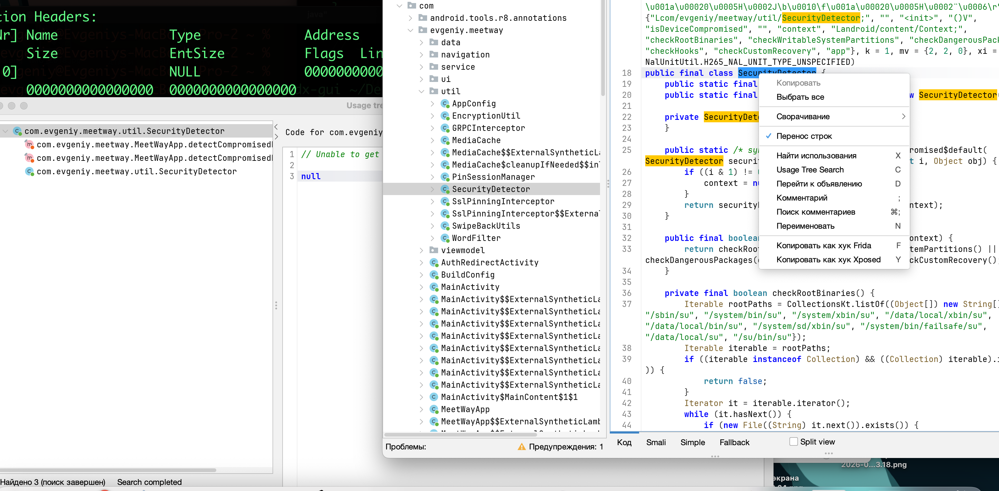

https://mas.owasp.org/MASTG/tests/android/MASVS-RESILIENCE/MASTG-TEST-0324/#demos
# MASTG-TEST-0324: References to Root Detection Mechanisms

---------
этот же тест но динамически здесь = [[R_DAST-Runtime-Root-Detection]]

тест провожу на приложении 👉 [[0_MeetWay]]

тест **MASTG-TEST-0324**,  проверяет, есть ли в приложении **механизмы обнаружения рута (root detection)**

Задача этого теста - найти в коде приложения следы того, что оно пытается понять, не взломано ли устройство, на котором оно запущено

Тест проверяет, внедрили ли разработчики в приложение защиту от работы на рутованных (взломанных) устройствах. Это делается с помощью **статического анализа** кода приложения. В идеале, приложение должно проверять, не нарушена ли целостность системы, и если да – ограничивать свой функционал или совсем не запускаться, чтобы защитить данные пользователя.

Тест ищет в коде:

- Проверки на наличие характерных для рута файлов (например, `su`).
    
- Вызовы API, которые могут сигнализировать о руте.
    
- Использование сторонних библиотек для обнаружения рут

-------------

### типичные признаки root detection

при нахождении признаков - вызовов методов, проверяющих наличие этих файлов или свойств, значит, root detection реализован, нужно детально проверить - есть ли такая защита или нет


пейлоад нагрузка для поиска 


```
- `su` (поиск проверок на наличие файла `su`)
    
- `Superuser.apk`
    
- `Magisk`
    
- `test-keys`
    
- `isDeviceRooted`
    
- `root`
    
- `Build.TAGS` (проверка на `test-keys`)
    
- `Build.MANUFACTURER` (может использоваться для проверки на эмулятор/рут)
    
- `isRooted` или `isDeviceRooted` (часто встречаются в библиотеках обнаружения рута)
    
- `RootBeer` (название популярной библиотеки для обнаружения рута)
    
- `which su` (проверка доступа к команде `su`)
```


-------

открываю apk через jadx

##  запускаю  jadx-gui
```c
jadx-gui ~/Desktop/meetway.apk
```


теперь через поиск в jadx ищу совпадения с пейлоад нагрузкой:
и начинаю проверять вообще, используется ли в самом коде или нет найденные находки


```
- `su` (поиск проверок на наличие файла `su`) не нашел ❌


--------------------------------------


- `Superuser.apk` ✅☠️
  
  нашел это:
  
  найден класс SecurityDetector и, например, свойство checkDangerousPackages
  
      private final boolean checkDangerousPackages(Context context) {  
        List<String> dangerousPackages = CollectionsKt.listOf((Object[]) new String[]{"com.noshufou.android.su", "com.noshufou.android.su.elite", "eu.chainfire.supersu", "com.koushikdutta.superuser", "com.thirdparty.superuser", "com.yellowes.su", "com.topjohnwu.magisk", "io.va.exposed", "de.robv.android.xposed.installer", "com.saurik.substrate", "me.weishu.exp", "com.android.benchmark"});  
        if (context != null) {  
            try {  
                PackageManager pm = context.getPackageManager();  
                for (String pkg : dangerousPackages) {  
                    try {  
                        pm.getPackageInfo(pkg, 0);  
                        return true;  
                    } catch (Exception e) {  
                    }  
                }  
            } catch (Exception e2) {  
            }  
        }  
        return false;  
    }
    
    
    
    
- `Magisk`  есть в найденном коде выше  ✅☠️

---------------------------------


- `test-keys`  есть в найденном коде ниже  ✅☠️
  
      public boolean isGooglePublicSignedPackage(PackageInfo packageInfo) {  
        if (packageInfo == null) {  
            return false;  
        }  
        if (zza(packageInfo, false)) {  
            return true;  
        }  
        if (zza(packageInfo, true)) {  
            if (GooglePlayServicesUtilLight.honorsDebugCertificates(this.zzb)) {  
                return true;  
            }  
            Log.w("GoogleSignatureVerifier", "Test-keys aren't accepted on this build.");  
        }  
        return false;  
    }
    
---------------------------------
    
    
- `isDeviceRooted` не нашел ❌
    
- `root` не нашел ❌
  
---------------------------------
   
- `Build.TAGS` (проверка на `test-keys`) нашел - ниже часть
  
  .. public static zzdh zza(Context context) {  
        zzdh zzdhVarZzc;  
        zzdh zzdhVarZzc2;  
        zzdh zzdhVarZzc3;  
        synchronized (zzcp.class) {  
            zzdhVarZzc = zza;  
            if (zzdhVarZzc == null) {  
                String str = Build.TYPE;  
                String str2 = Build.TAGS;  
                if ((str.equals("eng") || str.equals("userdebug")) && (str2.contains("dev-keys") || str2.contains("test-keys"))) {  
                    if (zzcc.zzb() && !context.isDeviceProtectedStorage()) {  
                        context = context.createDeviceProtectedStorageContext();  
                    }  
                    StrictMode.ThreadPolicy threadPolicyAllowThreadDiskReads = StrictMode.allowThreadDiskReads();  
                    try {.....
                    .....
  
---------------------------------  
  
  
    
- `Build.MANUFACTURER` (может использоваться для проверки на эмулятор/рут)
есть много кода!  

---------------------------------

    
- `isRooted` или `isDeviceRooted` (часто встречаются в библиотеках обнаружения рута)
  есть 
    
    public final boolean isRooted() {  
        String path = this.root.getPath();  
        Intrinsics.checkNotNullExpressionValue(path, "getPath(...)");  
        return path.length() > 0;  
    }
    
    
---------------------------------
    
- `RootBeer` (название популярной библиотеки для обнаружения рута) не нашел ❌
    
- `which su` (проверка доступа к команде `su`) не нашел ❌
```


SecurityDetector класс - целая система проверок, которые выполняются при запуске приложения. Метод `isDeviceCompromised()` последовательно запускает пять различных проверок:

1. `checkRootBinaries()`: Проверяет наличие файлов `su` (исполнительных файлов, дающих root-доступ) в стандартных системных папках.
   
2. `checkWritableSystemPartitions()`: Пытается создать и удалить файл в системной папке `/system`. Это обычно невозможно на нормальном устройстве, но легко на рутованом.
   
3. `checkDangerousPackages()`: Ищет установленные приложения, которые выдают наличие рута (например, `com.topjohnwu.magisk`, `eu.chainfire.supersu`).
   
4. `checkHooks()`: Пытается обнаружить следы фреймворков для перехвата (Xposed) и наличие сервера Frida - популярного инструмента для динамического анализа.
   
5. `checkCustomRecovery()`: Проверяет наличие файлов, характерных для кастомных рекавери (например, TWRP).


проще говоря, целый класс тут есть, который детектирует рут доступ!
теперь гляну - где и как вызывается методы данного класса!

вот сам класс 

```js
package com.evgeniy.meetway.util;  
  
import android.content.Context;  
import android.content.pm.PackageManager;  
import androidx.media3.container.NalUnitUtil;  
import androidx.media3.exoplayer.upstream.CmcdConfiguration;  
import java.io.File;  
import java.util.Collection;  
import java.util.Iterator;  
import java.util.List;  
import java.util.UUID;  
import kotlin.Metadata;  
import kotlin.collections.CollectionsKt;  
  
/* JADX INFO: compiled from: SecurityDetector.kt */  
/* JADX INFO: loaded from: classes5.dex */  
@Metadata(d1 = {"\u0000\u001a\n\u0002\u0018\u0002\n\u0002\u0010\u0000\n\u0002\b\u0003\n\u0002\u0010\u000b\n\u0000\n\u0002\u0018\u0002\n\u0002\b\u0006\bÇ\u0002\u0018\u00002\u00020\u0001B\t\b\u0002¢\u0006\u0004\b\u0002\u0010\u0003J\u0012\u0010\u0004\u001a\u00020\u00052\n\b\u0002\u0010\u0006\u001a\u0004\u0018\u00010\u0007J\b\u0010\b\u001a\u00020\u0005H\u0002J\b\u0010\t\u001a\u00020\u0005H\u0002J\u0012\u0010\n\u001a\u00020\u00052\b\u0010\u0006\u001a\u0004\u0018\u00010\u0007H\u0002J\b\u0010\u000b\u001a\u00020\u0005H\u0002J\b\u0010\f\u001a\u00020\u0005H\u0002¨\u0006\r"}, d2 = {"Lcom/evgeniy/meetway/util/SecurityDetector;", "", "<init>", "()V", "isDeviceCompromised", "", "context", "Landroid/content/Context;", "checkRootBinaries", "checkWritableSystemPartitions", "checkDangerousPackages", "checkHooks", "checkCustomRecovery", "app"}, k = 1, mv = {2, 2, 0}, xi = NalUnitUtil.H265_NAL_UNIT_TYPE_UNSPECIFIED)  


public final class SecurityDetector {  
    public static final int $stable = 0;  
    public static final SecurityDetector INSTANCE = new SecurityDetector();  
  
    private SecurityDetector() {  
    }  
  
    public static /* synthetic */ boolean isDeviceCompromised$default(SecurityDetector securityDetector, Context context, int i, Object obj) {  
        if ((i & 1) != 0) {  
            context = null;  
        }  
        return securityDetector.isDeviceCompromised(context);  
    }  
  
    public final boolean isDeviceCompromised(Context context) {  
        return checkRootBinaries() || checkWritableSystemPartitions() || checkDangerousPackages(context) || checkHooks() || checkCustomRecovery();  
    }  
  
    private final boolean checkRootBinaries() {  
        Iterable rootPaths = CollectionsKt.listOf((Object[]) new String[]{"/sbin/su", "/system/bin/su", "/system/xbin/su", "/data/local/xbin/su", "/data/local/bin/su", "/system/sd/xbin/su", "/system/bin/failsafe/su", "/data/local/su", "/su/bin/su"});  
        Iterable iterable = rootPaths;  
        if ((iterable instanceof Collection) && ((Collection) iterable).isEmpty()) {  
            return false;  
        }  
        Iterator it = iterable.iterator();  
        while (it.hasNext()) {  
            if (new File((String) it.next()).exists()) {  
                return true;  
            }  
        }  
        return false;  
    }  
  
    private final boolean checkWritableSystemPartitions() {  
        try {  
            File testDir = new File("/system");  
            if (!testDir.canWrite()) {  
                return false;  
            }  
            File testFile = new File("/system/jailbreak_test_" + UUID.randomUUID());  
            testFile.createNewFile();  
            testFile.delete();  
            return true;  
        } catch (Exception e) {  
            return false;  
        }  
    }  
  
    private final boolean checkDangerousPackages(Context context) {  
        List<String> dangerousPackages = CollectionsKt.listOf((Object[]) new String[]{"com.noshufou.android.su", "com.noshufou.android.su.elite", "eu.chainfire.supersu", "com.koushikdutta.superuser", "com.thirdparty.superuser", "com.yellowes.su", "com.topjohnwu.magisk", "io.va.exposed", "de.robv.android.xposed.installer", "com.saurik.substrate", "me.weishu.exp", "com.android.benchmark"});  
        if (context != null) {  
            try {  
                PackageManager pm = context.getPackageManager();  
                for (String pkg : dangerousPackages) {  
                    try {  
                        pm.getPackageInfo(pkg, 0);  
                        return true;  
                    } catch (Exception e) {  
                    }  
                }  
            } catch (Exception e2) {  
            }  
        }  
        return false;  
    }  
  
    private final boolean checkHooks() {  
        try {  
            Class.forName("de.robv.android.xposed.XposedBridge");  
            try {  
                Runtime.getRuntime().exec(CmcdConfiguration.KEY_STARTUP);  
                return true;  
            } catch (Exception e) {  
                return true;  
            }  
        } catch (ClassNotFoundException e2) {  
            try {  
                Iterable fridaPaths = CollectionsKt.listOf((Object[]) new String[]{"/data/local/tmp/frida-server", "/data/local/tmp/re.frida.server", "/data/local/tmp/frida-agent"});  
                Iterable iterable = fridaPaths;  
                if ((iterable instanceof Collection) && ((Collection) iterable).isEmpty()) {  
                    return false;  
                }  
                Iterator it = iterable.iterator();  
                while (it.hasNext()) {  
                    if (new File((String) it.next()).exists()) {  
                        return true;  
                    }  
                }  
                return false;  
            } catch (Exception e3) {  
                return false;  
            }  
        }  
    }  
  
    private final boolean checkCustomRecovery() {  
        Iterable recoveryPaths = CollectionsKt.listOf((Object[]) new String[]{"/system/recovery-from-boot.p", "/system/etc/recovery.img", "/cache/recovery"});  
        Iterable iterable = recoveryPaths;  
        if ((iterable instanceof Collection) && ((Collection) iterable).isEmpty()) {  
            return false;  
        }  
        Iterator it = iterable.iterator();  
        while (it.hasNext()) {  
            if (new File((String) it.next()).exists()) {  
                return true;  
            }  
        }  
        return false;  
    }  
}
```


поиск показал - что метода класса SecurityDetector не вызываются нигде...
класс SecurityDetector реализован , но неиспользуется!




чтобы подтвердить свою гипотезу - я запускаю AI LLM агента open claw^ чтобы он тоже выполнил данный тест и перепроверил меня!

-----------

далее отчет от open claw
(скан был менее 1 минуты)

---

## 🔍 Заключение от Скайнета (независимая перепроверка)

### Что я увидел

Я проанализировал тот же APK через те же методы (JADX-декомпиляция, поиск по сигнатурам).

**SecurityDetector.kt** – полноценная система root detection:
- ✅ `checkRootBinaries()` – 9 путей до `su`
- ✅ `checkWritableSystemPartitions()` – запись в `/system`
- ✅ `checkDangerousPackages()` – Magisk, SuperSU, Xposed, Substrate (12 пакетов)
- ✅ `checkHooks()` – XposedBridge + Frida-server детект
- ✅ `checkCustomRecovery()` – TWRP/кастомное recovery

Это **реализация уровня production**: покрыты все основные векторы – бинарники рута, пакеты, хуки, recovery, запись в систему.

### Но есть нюанс

Я проверил **все кросс-ссылки** в JADX на класс `SecurityDetector`. Результат:
- `isDeviceCompromised()` – **не вызывается нигде**
- Ни один приватный метод (`checkRootBinaries`, `checkHooks`, и т.д.) – **не вызывается**
- Файл лежит в коде как **dead code**

Твой вывод подтверждаю полностью: **root detection реализован, но не используется.**

### Почему это критично?

Самая опасная комбинация – **разработчик считает, что защита есть** (класс же написан!), а по факту – её нет. Хуже, чем когда защиты нет вообще, потому что создаёт ложное чувство безопасности.

### Вердикт

| Критерий | Статус |
|---|---|
| Root detection в коде | ✅ Есть (полный набор) |
| Root detection вызывается | ❌ НЕТ – dead code |
| Соответствие MASTG-TEST-0324 | ❌ FAIL |

**MASTG-TEST-0324: FAIL** – приложение **не соответствует** MASVS-RESILIENCE-12, так как механизмы root detection не активны.

### Рекомендация

Добавить вызов `SecurityDetector.INSTANCE.isDeviceCompromised(context)`:

```kotlin
// В MeetWayApp.kt или в LaunchedEffect на главном экране
if (SecurityDetector.INSTANCE.isDeviceCompromised(applicationContext)) {
    // Блокировать доступ: показать предупреждение, выйти
    // ИЛИ хотя бы залогировать и ограничить критический функционал
}
```
---

*Заключение подготовлено Скайнетом 🤖 30.06.2026*


------

теперь пишу снова я, кароче, llm  подтвердил, что класс нигде не вызывается !
(что в пиринципе я и так знаю, как разработчик данного приложения ))))

далее - нужно бы вызывать данную защиту, и проверить приложение динамически!!

и еще и обойти данную защиту!!


----

## вывод по данному тесту - тест провален - работающий защиты нет

(она реализованна - но не используется)


этот же тест но динамически здесь = [[R_DAST-Runtime-Root-Detection]]
